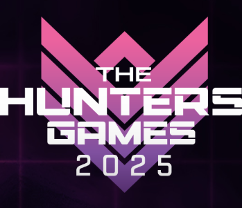
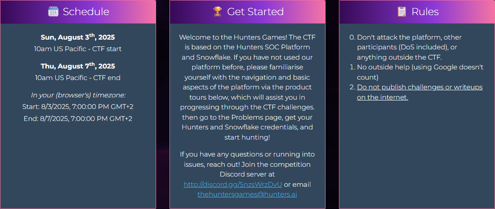

# Welcome to the Hunters Games 2025

The Hunters Games is an exciting Capture The Flag (CTF) competition designed to challenge your cybersecurity skills. Powered by the [**Hunters SOC Platform**](https://www.hunters.security/) and [**Snowflake**](https://www.snowflake.com/de/), this event will test your ability to **solve problems**, **analyze data**, and **think critically under pressure**.

## Event Details 🗓️

- **Start Date:** Sunday, August 3rd, 2025, 10:00 AM US Pacific (7:00 PM GMT+2)  
- **End Date:** Thursday, August 7th, 2025, 10:00 AM US Pacific (7:00 PM GMT+2)  

## How to Get Started 🚀

1. Familiarize yourself with the **Hunters SOC Platform** using the product tours provided.  
2. Navigate to the **Problems** page to retrieve your Hunters and Snowflake credentials.  
3. Begin solving challenges and earning points!  

## Rules 📋

- Do not attack the platform, other participants, or any external systems (e.g., DoS attacks).  
- No external assistance is allowed (searching on Google is permitted).  
- Do not share or publish challenges or writeups online.  

## Need Help? 🆘

If you encounter any issues or have questions, join our [Discord server](http://discord.gg/SnzsWrzDvU) or email us at [thehuntersgames@hunters.ai](mailto:thehuntersgames@hunters.ai).  

**Good luck, and may the best hunter win! 🏆**