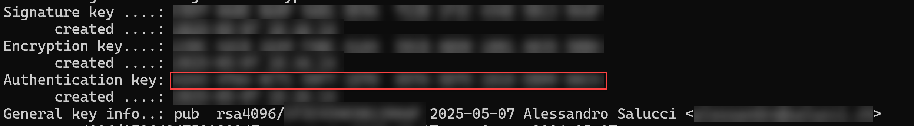

# 🔐 Hardened GitHub Setup with YubiKey on Windows 11

This guide walks through a secure setup of **GitHub access using a YubiKey** on **Windows 11**, including:

- `SSH` authentication with your YubiKey
- `GPG` commit signing with full hardware isolation
- `Touch` requirement on every cryptographic operation

---

## 🔧 Prerequisites

- Windows 11 (no admin rights required)
- [Git](https://git-scm.com/downloads/win) for Windows
- [Gpg4win](https://gpg4win.org/) (Kleopatra, GPG Agent)
- A touch-enabled [YubiKey](https://www.yubico.com/der-yubikey/yubikey-5-fips-serie/?lang=de) (OpenPGP-capable)
- [GitHub account](https://github.com/trustinveritas)
- [PowerShell](https://learn.microsoft.com/de-de/powershell/scripting/install/installing-powershell-on-windows?view=powershell-7.5)

---

## 1️⃣ Install Gpg4win (if not already)

1. Download from: [https://gpg4win.org/](https://gpg4win.org/)
2. Install with:
   - `Kleopatra`
   - `GnuPG`
   - `GPG Agent`
   - `Smartcard Support`

> No admin rights are required if using the per-user installer.

---

## 2️⃣ Connect YubiKey and Check Status

> Check YubiKey status and confirm OpenPGP is detected

```powershell
gpg --card-status
```


---

## 3️⃣ Generate Keys Directly on the YubiKey

> Launch interactive card tool

```powershell
gpg --edit-card
```

Then enter:

:::tip
Before generating the keys, change the default User / Admin `PIN`

Command: `admin` > `passwd`

**Default User PIN:** `123456`
**Default Admin PIN:** `12345678`
:::

```text
admin
key-attr
generate
```

:::info
Set `1` - `RSA` to `4096` if [supported by the yubi key](https://support.yubico.com/hc/en-us/articles/360013790259-Using-Your-YubiKey-with-OpenPGP).
:::

- Respond to name/email prompts
- Say **yes** when asked to store the keys **on the card**
- This generates:
  - A signing key
  - An encryption key
  - An authentication (SSH) key

---

## 4️⃣ Export Public `SSH` Key

> Get your `Authentication key ID`

```powershell
gpg --card-status
```

```powershell
[ SNIP ]

Signature key ....: 
      created ....: 
Encryption key....: 
      created ....: 
Authentication key: YOU NEED THIS ONE HERE COMPLETE
      created ....: 

[ SNIP ]
```



## 5️⃣ Configure `Git` for `GPG` Signing

> Get your `GPG Key ID`

```powershell
gpg --list-secret-keys --keyid-format LONG
```

```powershell
[ SNIP ]

sec>  rsa4096/YOU NEED THIS ONE

[ SNIP ]
```


> Configure `Git` to use `GPG` with your `YubiKey`

```powershell
git config --global user.name "YOUR USER NAME"
git config --global user.email "your@email.com"
git config --global user.signingkey YOURKEYID
git config --global commit.gpgsign true
git config --global gpg.program "C:\\Program Files (x86)\\GnuPG\\bin\\gpg.exe"
git config --global core.sshCommand "C:\\Windows\\System32\\OpenSSH\\ssh.exe"
```

:::note
The mail hast to be the **same** like in your `GPG key` generation.
:::

---

## 6️⃣ Export Public `GPG` Key

> Export public key in ASCII format for GitHub

```powershell
gpg -o pubkey.asc --armor --export YOURKEYID
```

Upload contents of `pubkey.asc` to:

**`GitHub` → `Settings` → `SSH and GPG Keys` → `New GPG Key`**

---

## 7️⃣ Extract SSH Public Key from YubiKey

> Generate SSH public key from GPG Auth subkey

```powershell
gpg --export-ssh-key Authentication key > id_rsa.pub
```

:::note
Remove all blank spaces
:::

Copy the output (`ssh-ed25519 ...`) to:

**`GitHub` → `Settings` → `SSH and GPG Keys` → `New SSH Key`**

---

## 8️⃣ Hardened gpg-agent.conf (🔒 Secure Session TTL)

Create or edit this file:

```powershell
notepad "$env:APPDATA\gnupg\gpg-agent.conf"
```

Paste this secure config:

```ini
enable-ssh-support
enable-win32-openssh-support
use-standard-socket

# Cache timeout (seconds)
default-cache-ttl 60
max-cache-ttl 300

default-cache-ttl-ssh 60
max-cache-ttl-ssh 300

# Additional security
no-allow-loopback-pinentry
no-allow-mark-trusted
pinentry-timeout 30
```

Reload the agent:

```powershell
gpg-connect-agent killagent /bye
gpg-connect-agent /bye
```

---

## 9️⃣ Enforce Touch for All GPG Keys (YubiKey Only)

> Require physical touch for all GPG subkeys

```powershell
ykman openpgp keys set-touch sig ON
ykman openpgp keys set-touch enc ON
ykman openpgp keys set-touch aut ON
```

> This ensures no operation can happen without you physically tapping the YubiKey.

---

## 1️⃣1️⃣ Test GitHub SSH Access

> You should see a success message from GitHub

```powershell
ssh -T git@github.com
```

Expected output:

```text
Hi yourusername! You've successfully authenticated, but GitHub does not provide shell access.
```

:::info
If you get an error use the following command to get `verbose` output.

```powershell
ssh -vT git@github.com
```

:::

---

## 1️⃣2️⃣ Test GPG-Signed Commit

> Try a signed commit to verify YubiKey integration

```powershell
git clone git@github.com:your/repo.git
cd repo
echo Secure > secure.txt
git add secure.txt
git commit -S -m "Signed commit using YubiKey"
```

> You will be prompted to touch the YubiKey.

---

## 🧼 Optional: Manual Agent Cleanup Command

To forcibly wipe out any GPG agent session:

> Manual GPG session cleanup for maximum security

```powershell
gpg-connect-agent killagent /bye
gpg-connect-agent /bye
```

You can alias this in your PowerShell profile:

```powershell
Function End-GPGSession {
    gpg-connect-agent killagent /bye
    gpg-connect-agent /bye
    Write-Host "GPG agent session cleared."
}
```

---

## ✅ Summary

| Feature                    | Hardened? | Notes |
|----------------------------|-----------|-------|
| GPG commit signing         | ✅ Yes    | Key stored only on YubiKey |
| SSH via GPG Auth key       | ✅ Yes    | Hardware-backed with touch |
| Agent socket management    | ✅ Yes    | Safe PowerShell logic only |
| TTL-based session expiry   | ✅ Yes    | 1–5 minute cache window    |
| Touch requirement enforced | ✅ Yes    | All subkeys require tap    |
| Admin rights needed        | ❌ No     | All actions run as user    |
