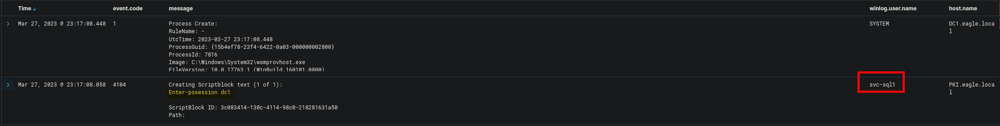
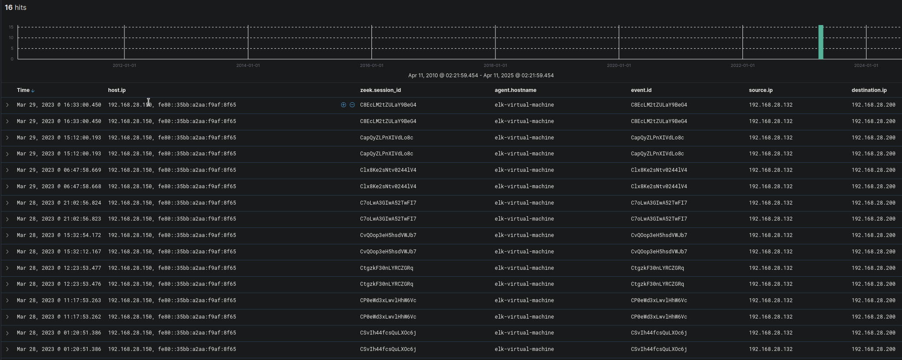

import RevealFlag from '@site/src/components/RevealFlag';

# Hunting For Stuxbot (Round 2)

Recently uncovered details shed light on the operational strategy of Stuxbot's newest iteration.

1. The newest iterations of **Stuxbot are exploiting** the `C:\Users\Public` directory as a **conduit for deploying** supplementary utilities.
2. The newest iterations of Stuxbot are **utilizing `registry run keys`** as a mechanism **to ensure their sustained presence** within the infected system.
3. The newest iterations of Stuxbot are utilizing `PowerShell Remoting` for **lateral movement within the network** and **to gain access to domain controllers**.

---

## The Available Data

The cybersecurity strategy implemented is predicated on the utilization of the Elastic stack as a SIEM solution. Through the "Discover" functionality we can see logs from multiple sources. These sources include:

- `Windows audit logs` (categorized under the index pattern `windows*`)
- `System Monitor (Sysmon) logs` (also falling under the index pattern `windows*`, more about Sysmon [here](https://learn.microsoft.com/en-us/sysinternals/downloads/sysmon))
- `PowerShell logs` (indexed under `windows*` as well, more about PowerShell logs [here](https://www.splunk.com/en_us/blog/security/hunting-for-malicious-powershell-using-script-block-logging.html))
- `Zeek logs`, [a network security monitoring tool](https://www.elastic.co/guide/en/beats/filebeat/current/exported-fields-zeek.html) (classified under the index pattern `zeek*`)

---

## The Tasks

### Hunt 1: Create a KQL query to hunt for "`Lateral Tool Transfer` [MITRE ATT&CK - T1570](https://attack.mitre.org/techniques/T1570/)" to `C:\Users\Public`. Enter the content of the `user.name` field in the document that is related to a transferred tool that starts with "`r`" as your answer

> svc-sql1

- Let's check for [Sysmon Event ID 15 - FileCreateStreamHash (streams added to existing files)](https://www.ultimatewindowssecurity.com/securitylog/encyclopedia/event.aspx?eventid=90015)
  - Files which come from the internet

```sql
event.code: 15
```

Add filter

```sql
file.directory is C:\Users\bob\Downloads
```

```txt
File stream created:
RuleName: -
UtcTime: 2023-03-26 20:05:47.793
ProcessGuid: {3f3a32cd-a59b-6420-c601-000000001a00}
ProcessId: 908
Image: C:\Program Files (x86)\Microsoft\Edge\Application\msedge.exe
TargetFilename: C:\Users\bob\Downloads\invoice.one
CreationUtcTime: 2023-03-26 20:05:43.609
Hash: MD5=127021207D6415A3B426732B782EFC24,SHA256=AAEE893B24C9474B23E94C725A67D83F2722E4FED8BA8C25CE60BD76B30C0954,IMPHASH=00000000000000000000000000000000
Contents: -
User: EAGLE\bob
```

> `event.created` `Mar 26, 2023 @ 20:05:48.914`

---

- Let's check for [Sysmon Event ID 11 - File creation](https://www.ultimatewindowssecurity.com/securitylog/encyclopedia/event.aspx?eventid=90011)

```sql
event.code: 11
```

```txt
File created:
RuleName: -
UtcTime: 2023-03-26 20:06:27.990
ProcessGuid: {3f3a32cd-a5a1-6420-cc01-000000001a00}
ProcessId: 6660
Image: C:\Program Files\Microsoft Office\Root\Office16\ONENOTE.EXE
TargetFilename: C:\Users\bob\AppData\Local\Temp\OneNote\16.0\Exported\{EC284AA9-1F31-4DC4-B3C5-3EEE8137EBC3}\NT\0\invoice.bat
CreationUtcTime: 2023-03-26 20:06:27.990
User: EAGLE\bob
```

> `event.created` `Mar 26, 2023 @ 20:06:29.604`

---

```sql
event.code: 11 AND file.directory: "C:\\Users\\Public"
```

```txt
File created:
RuleName: -
UtcTime: 2023-03-26 21:23:57.243
ProcessGuid: {3f3a32cd-a5c5-6420-e301-000000001a00}
ProcessId: 9944
Image: C:\WINDOWS\System32\WindowsPowerShell\v1.0\powershell.exe
TargetFilename: C:\Users\Public\DomainPasswordSpray.ps1
CreationUtcTime: 2023-03-26 21:23:57.243
User: EAGLE\bob
```

> `event.created` `Mar 26, 2023 @ 21:23:59.239`

```txt
File created:
RuleName: EXE
UtcTime: 2023-03-26 22:17:01.805
ProcessGuid: {3f3a32cd-c2ca-6420-d400-000000001d00}
ProcessId: 8072
Image: C:\Users\bob\AppData\Local\Temp\default.exe
TargetFilename: C:\Users\Public\SharpHound.exe
CreationUtcTime: 2023-03-26 22:17:01.805
User: EAGLE\bob
```

> `event.created` `Mar 26, 2023 @ 22:17:03.724`

---

### Let's check for all files created inside `C:\Users\Public\` and `file.extension` is `exe`

```sql
event.code: 11 and file.directory: "C:\\Users\\Public" and file.extension: "exe"
```

```txt
File created:
RuleName: EXE
UtcTime: 2023-03-26 22:17:01.805
ProcessGuid: {3f3a32cd-c2ca-6420-d400-000000001d00}
ProcessId: 8072
Image: C:\Users\bob\AppData\Local\Temp\default.exe
TargetFilename: C:\Users\Public\SharpHound.exe
CreationUtcTime: 2023-03-26 22:17:01.805
User: EAGLE\bob
```

> `default.exe` - `SharpHound.exe`  
> `event.created` `Mar 27, 2023 @ 00:17:03.724`

```txt
File created:
RuleName: EXE
UtcTime: 2023-03-27 22:40:12.705
ProcessGuid: {0b5600e8-1acb-6422-ed02-000000001f00}
ProcessId: 1064
Image: C:\Windows\default.exe
TargetFilename: C:\Users\Public\payload.exe
CreationUtcTime: 2023-03-27 22:40:12.705
User: EAGLE\svc-sql1
```

> `default.exe` - `payload.exe`  
> `event.created` `Mar 28, 2023 @ 00:40:14.378`

```txt
File created:
RuleName: EXE
UtcTime: 2023-03-27 22:54:17.094
ProcessGuid: {0b5600e8-1b90-6422-ef02-000000001f00}
ProcessId: 2896
Image: C:\windows\system32\svchost.exe
TargetFilename: C:\Users\Public\Rubeus.exe
CreationUtcTime: 2023-03-27 22:54:17.094
User: EAGLE\svc-sql1
```

> `C:\windows\system32\svchost.exe` - `Rubeus.exe`  
> `event.created` `Mar 28, 2023 @ 00:54:18.795`

```txt
File created:
RuleName: EXE
UtcTime: 2023-03-27 23:00:36.343
ProcessGuid: {0b5600e8-1b90-6422-ef02-000000001f00}
ProcessId: 2896
Image: C:\windows\system32\svchost.exe
TargetFilename: C:\Users\Public\Rubeus.exe
CreationUtcTime: 2023-03-27 23:00:36.343
User: EAGLE\svc-sql1
```

> `C:\windows\system32\svchost.exe` - `Rubeus.exe`  
> `event.created` `Mar 28, 2023 @ 01:00:38.171`

```txt
File created:
RuleName: EXE
UtcTime: 2023-03-27 23:13:32.704
ProcessGuid: {0b5600e8-1b90-6422-ef02-000000001f00}
ProcessId: 2896
Image: C:\windows\system32\svchost.exe
TargetFilename: C:\Users\Public\mimikatz.exe
CreationUtcTime: 2023-03-27 23:13:32.704
User: EAGLE\svc-sql1
```

> `C:\windows\system32\svchost.exe` - `mimikatz.exe`  
> `event.created` `Mar 28, 2023 @ 01:13:34.625`

---

### Hunt 2: Create a KQL query to hunt for "`Boot or Logon Autostart Execution: Registry Run Keys / Startup Folder` [MITRE ATT&CK - T1547.001](https://attack.mitre.org/techniques/T1547/001/)". Enter the content of the `registry.value` field in the document that is related to the first registry-based persistence action as your answer

> LgvHsviAUVTsIN

- Let's check for [Sysmon Event ID 13 - Registry value set](https://www.ultimatewindowssecurity.com/securitylog/encyclopedia/event.aspx?eventid=90013)
  - This Registry event type identifies Registry value modifications. The event records the value written for Registry values of type **DWORD** and **QWORD**.

```sql
event.code: 13 and message : "*Run*"
```

```txt
Registry value set:
RuleName: T1060,RunKey
EventType: SetValue
UtcTime: 2023-03-26 20:17:33.845
ProcessGuid: {3f3a32cd-a5c5-6420-e301-000000001a00}
ProcessId: 9944
Image: C:\WINDOWS\System32\WindowsPowerShell\v1.0\powershell.exe
TargetObject: HKU\S-1-5-21-1518138621-4282902758-752445584-1107\SOFTWARE\Microsoft\Windows\CurrentVersion\Run\LgvHsviAUVTsIN
Details: C:\Users\bob\AppData\Local\Temp\default.exe
User: EAGLE\bob
```

> `C:\Users\bob\AppData\Local\Temp\default.exe` - `C:\WINDOWS\System32\WindowsPowerShell\v1.0\powershell.exe`  
> `HKU\S-1-5-21-1518138621-4282902758-752445584-1107\SOFTWARE\Microsoft\Windows\CurrentVersion\Run\LgvHsviAUVTsIN`  
> `event.created` `Mar 26, 2023 @ 22:17:34.817`

```txt
Registry value set:
RuleName: T1060,RunKey
EventType: SetValue
UtcTime: 2023-03-26 22:12:44.594
ProcessGuid: {3f3a32cd-c2ca-6420-d400-000000001d00}
ProcessId: 8072
Image: C:\Users\bob\AppData\Local\Temp\default.exe
TargetObject: HKU\S-1-5-21-1518138621-4282902758-752445584-1107\SOFTWARE\Microsoft\Windows\CurrentVersion\Run\KFbyzDpudqtCF
Details: C:\Users\bob\AppData\Local\Temp\svchost.exe
User: EAGLE\bob
```

> `C:\Users\bob\AppData\Local\Temp\svchost.exe` - `C:\Users\bob\AppData\Local\Temp\default.exe`  
> `HKU\S-1-5-21-1518138621-4282902758-752445584-1107\SOFTWARE\Microsoft\Windows\CurrentVersion\Run\KFbyzDpudqtCF`  
> `event.created` `Mar 27, 2023 @ 00:12:45.713`

```txt
Registry value set:
RuleName: T1060,RunKey
EventType: SetValue
UtcTime: 2023-03-27 21:25:58.972
ProcessGuid: {3f3a32cd-0952-6422-4c04-000000001d00}
ProcessId: 5620
Image: C:\Users\bob\AppData\Local\Temp\default.exe
TargetObject: HKU\S-1-5-21-1518138621-4282902758-752445584-1107\SOFTWARE\Microsoft\Windows\CurrentVersion\Run\cgCfhHDMwmN
Details: C:\Users\bob\AppData\Local\Temp\svchost.exe
User: EAGLE\bob
```

> `C:\Users\bob\AppData\Local\Temp\svchost.exe` - `C:\Users\bob\AppData\Local\Temp\default.exe`  
> `HKU\S-1-5-21-1518138621-4282902758-752445584-1107\SOFTWARE\Microsoft\Windows\CurrentVersion\Run\cgCfhHDMwmN`  
> `event.created` `Mar 27, 2023 @ 23:26:00.099`

```txt
Registry value set:
RuleName: T1060,RunKey
EventType: SetValue
UtcTime: 2023-03-27 22:23:52.572
ProcessGuid: {0b5600e8-1624-6422-d102-000000001f00}
ProcessId: 832
Image: C:\Windows\default.exe
TargetObject: HKU\S-1-5-21-1518138621-4282902758-752445584-1111\Software\Microsoft\Windows\CurrentVersion\Run\ybZishBHbRKgfe
Details: C:\Users\svc-sql1\AppData\Local\Temp\svchost.exe
User: EAGLE\svc-sql1
```

> `C:\Users\svc-sql1\AppData\Local\Temp\svchost.exe` - `C:\Windows\default.exe`  
> `HKU\S-1-5-21-1518138621-4282902758-752445584-1111\Software\Microsoft\Windows\CurrentVersion\Run\ybZishBHbRKgfe`  
>  `event.created` `Mar 28, 2023 @ 00:23:53.027`

:::danger
`default.exe` is now located at `C:\Windows\default.exe` with user `svc-sql1`
:::

---

### Hunt 3: Create a KQL query to hunt for "`PowerShell Remoting for Lateral Movement` [Red Team Notes - WinRM for Lateral Movement](https://www.ired.team/offensive-security/lateral-movement/t1028-winrm-for-lateral-movement)". Enter the content of the `winlog.user.name` field in the document that is related to PowerShell remoting-based lateral movement towards DC1

<RevealFlag> `svc-sql1` </RevealFlag>

```sql
message:(*Enter-PSSession* OR *New-PSSession* OR *Invoke-Command* OR *Invoke-Expression* OR *Get-PSSession* OR *Remove-PSSession* OR *ComputerName* OR *WSMan* OR *ShellId* OR *Microsoft.PowerShell* OR *session.configuration* OR *Enable-PSRemoting* OR *winrm*) OR
powershell.file.script_block_text:(*PSSession* OR *Invoke-Command* OR *winrm* OR *WSMan* OR *session.configuration*)
```

```txt
Creating Scriptblock text (1 of 1):
Enter-pssession dc1

ScriptBlock ID: 3c083414-130c-4114-98c0-218281631a50
Path: 
```



:::info
[Remote Services: Windows Remote Management - MITRE ATT&CK ID T1021.006](https://attack.mitre.org/techniques/T1021/006/)
:::

```sql
event.code: 4648 AND message : "*powershell.exe*"
```

```txt
A logon was attempted using explicit credentials.

Subject:
	Security ID:		S-1-5-21-1518138621-4282902758-752445584-1107
	Account Name:		bob
	Account Domain:		EAGLE
	Logon ID:		0xA8478
	Logon GUID:		{00000000-0000-0000-0000-000000000000}

Account Whose Credentials Were Used:
	Account Name:		administrator
	Account Domain:		
	Logon GUID:		{00000000-0000-0000-0000-000000000000}

Target Server:
	Target Server Name:	DC1.eagle.local
	Additional Information:	DC1.eagle.local

Process Information:
	Process ID:		0x26d8
	Process Name:		C:\Windows\System32\WindowsPowerShell\v1.0\powershell.exe

Network Information:
	Network Address:	-
	Port:			-

This event is generated when a process attempts to log on an account by explicitly specifying that account’s credentials.  This most commonly occurs in batch-type configurations such as scheduled tasks, or when using the RUNAS command.
```

:::info

- [Event 4648 – "Logon with explicit credentials"](https://www.ultimatewindowssecurity.com/securitylog/encyclopedia/event.aspx?eventid=4648)
- Calling User `bob@EAGLE`
- Account Used `administrator` (no domain specified)
- Target Server `DC1.eagle.local`
- Process `powershell.exe`
- Process Path `C:\Windows\System32\WindowsPowerShell\v1.0\powershell.exe`

:::

> `event.created` `Mar 26, 2023 @ 23:34:58.733`

---

### [Account Logon – Successful Logon (Event ID 4624)](https://www.ultimatewindowssecurity.com/securitylog/encyclopedia/event.aspx?eventid=4624)

```sql
event.code: 4624 and winlog.event_data.TargetUserName: "administrator"
```

```txt
An account was successfully logged on.

Subject:
	Security ID:		S-1-5-18
	Account Name:		DC2$
	Account Domain:		EAGLE
	Logon ID:		0x3E7

Logon Information:
	Logon Type:		2
	Restricted Admin Mode:	-
	Virtual Account:		No
	Elevated Token:		Yes

Impersonation Level:		Impersonation

New Logon:
	Security ID:		S-1-5-21-1518138621-4282902758-752445584-500
	Account Name:		administrator
	Account Domain:		EAGLE
	Logon ID:		0x107287
	Linked Logon ID:		0x0
	Network Account Name:	-
	Network Account Domain:	-
	Logon GUID:		{aca4c672-8a41-453d-b963-33b14b598ffc}

Process Information:
	Process ID:		0x7c8
	Process Name:		C:\Windows\System32\svchost.exe

Network Information:
	Workstation Name:	DC2
	Source Network Address:	127.0.0.1
	Source Port:		0

Detailed Authentication Information:
	Logon Process:		User32 
	Authentication Package:	Negotiate
	Transited Services:	-
	Package Name (NTLM only):	-
	Key Length:		0

This event is generated when a logon session is created. It is generated on the computer that was accessed.

The subject fields indicate the account on the local system which requested the logon. This is most commonly a service such as the Server service, or a local process such as Winlogon.exe or Services.exe.

The logon type field indicates the kind of logon that occurred. The most common types are 2 (interactive) and 3 (network).

The New Logon fields indicate the account for whom the new logon was created, i.e. the account that was logged on.

The network fields indicate where a remote logon request originated. Workstation name is not always available and may be left blank in some cases.

The impersonation level field indicates the extent to which a process in the logon session can impersonate.

The authentication information fields provide detailed information about this specific logon request.
	- Logon GUID is a unique identifier that can be used to correlate this event with a KDC event.
	- Transited services indicate which intermediate services have participated in this logon request.
	- Package name indicates which sub-protocol was used among the NTLM protocols.
	- Key length indicates the length of the generated session key. This will be 0 if no session key was requested.
```

:::danger

- Interactive logon (`Logon Type 2`)
- `administrator@EAGLE`
- Process: `svchost.exe`
- Source IP: `127.0.0.1`
- Suspicious: `SYSTEM` context, `svchost` spawning `interactive logon`

:::

> `event.created` `Mar 23, 2023 @ 18:11:14.106`

```txt
An account was successfully logged on.

Subject:
	Security ID:		S-1-5-18
	Account Name:		DC2$
	Account Domain:		EAGLE
	Logon ID:		0x3E7

Logon Information:
	Logon Type:		7
	Restricted Admin Mode:	-
	Virtual Account:		No
	Elevated Token:		Yes

Impersonation Level:		Impersonation

New Logon:
	Security ID:		S-1-5-21-1518138621-4282902758-752445584-500
	Account Name:		administrator
	Account Domain:		EAGLE
	Logon ID:		0x1B871D0
	Linked Logon ID:		0x0
	Network Account Name:	-
	Network Account Domain:	-
	Logon GUID:		{5b864ed0-562e-e231-a7b5-29758a00fd24}

Process Information:
	Process ID:		0x2c0
	Process Name:		C:\Windows\System32\lsass.exe

Network Information:
	Workstation Name:	DC2
	Source Network Address:	-
	Source Port:		-

Detailed Authentication Information:
	Logon Process:		Negotiat
	Authentication Package:	Negotiate
	Transited Services:	-
	Package Name (NTLM only):	-
	Key Length:		0
```

:::danger

- `Logon Type 7` = Unlock, but initiated by `lsass.exe`, not normal
- `SYSTEM` account (`DC2$`) spawning a session for `administrator`
- Source: `localhost` (no remote IP), indicates `local impersonation` or `S4U` abuse
- `Logon GUID` matches `4648` usage

:::

> `event.created` `Mar 26, 2023 @ 21:48:13.025`

```txt
An account was successfully logged on.

Subject:
	Security ID:		S-1-5-18
	Account Name:		DC2$
	Account Domain:		EAGLE
	Logon ID:		0x3E7

Logon Information:
	Logon Type:		7
	Restricted Admin Mode:	-
	Virtual Account:		No
	Elevated Token:		Yes

Impersonation Level:		Impersonation

New Logon:
	Security ID:		S-1-5-21-1518138621-4282902758-752445584-500
	Account Name:		administrator
	Account Domain:		EAGLE
	Logon ID:		0x4C5FD06
	Linked Logon ID:		0x0
	Network Account Name:	-
	Network Account Domain:	-
	Logon GUID:		{c051a5ca-6afe-d3bc-76fe-98d1fc092ea3}

Process Information:
	Process ID:		0x53c
	Process Name:		C:\Windows\System32\svchost.exe

Network Information:
	Workstation Name:	DC2
	Source Network Address:	127.0.0.1
	Source Port:		0

Detailed Authentication Information:
	Logon Process:		User32 
	Authentication Package:	Negotiate
	Transited Services:	-
	Package Name (NTLM only):	-
	Key Length:		0
```

:::danger

- `Logon Type 7` = "Unlock", but was triggered by `svchost.exe` instead of a user
- `administrator@EAGLE` logged on locally from `127.0.0.1`
- Likely `S4U (Service-for-User)` or `token manipulation`
- Process: `svchost.exe` spawning session for `administrator`

:::

> `event.created` `Mar 29, 2023 @ 22:49:30.315`

---

```sql
event.code: 4648 and winlog.event_data.TargetUserName: "administrator"
```

```txt
A logon was attempted using explicit credentials.

Subject:
	Security ID:		S-1-5-18
	Account Name:		DC2$
	Account Domain:		EAGLE
	Logon ID:		0x3E7
	Logon GUID:		{00000000-0000-0000-0000-000000000000}

Account Whose Credentials Were Used:
	Account Name:		administrator
	Account Domain:		EAGLE
	Logon GUID:		{8118849c-9a5d-fa21-0c89-1544ad839abb}

Target Server:
	Target Server Name:	localhost
	Additional Information:	localhost

Process Information:
	Process ID:		0x884
	Process Name:		C:\Windows\System32\svchost.exe

Network Information:
	Network Address:	127.0.0.1
	Port:			0

This event is generated when a process attempts to log on an account by explicitly specifying that account’s credentials.  This most commonly occurs in batch-type configurations such as scheduled tasks, or when using the RUNAS command.
```

:::danger

- `svchost.exe` attempted to log on with `administrator` credentials locally
- This is not expected unless part of `post-exploitation` or `scheduled task abuse`
- Strong sign of `S4U`, `token theft`, or `malicious service` behavior

:::

> `event.created` `Mar 23, 2023 @ 23:20:41.366`

```txt
A logon was attempted using explicit credentials.

Subject:
	Security ID:		S-1-5-18
	Account Name:		DC2$
	Account Domain:		EAGLE
	Logon ID:		0x3E7
	Logon GUID:		{00000000-0000-0000-0000-000000000000}

Account Whose Credentials Were Used:
	Account Name:		administrator
	Account Domain:		EAGLE
	Logon GUID:		{5b864ed0-562e-e231-a7b5-29758a00fd24}

Target Server:
	Target Server Name:	localhost
	Additional Information:	localhost

Process Information:
	Process ID:		0x2c0
	Process Name:		C:\Windows\System32\lsass.exe

Network Information:
	Network Address:	-
	Port:			-
```

:::danger

- `lsass.exe` initiated logon using `administrator` — highly unusual
- Suggests credential manipulation, possible `LSA abuse`
- No source IP → `local, scripted activity`

:::

> `event.created` `Mar 26, 2023 @ 21:48:13.025`

```txt
A logon was attempted using explicit credentials.

Subject:
	Security ID:		S-1-5-21-1518138621-4282902758-752445584-1107
	Account Name:		bob
	Account Domain:		EAGLE
	Logon ID:		0x4656C
	Logon GUID:		{00000000-0000-0000-0000-000000000000}

Account Whose Credentials Were Used:
	Account Name:		administrator
	Account Domain:		
	Logon GUID:		{00000000-0000-0000-0000-000000000000}

Target Server:
	Target Server Name:	DC1.eagle.local
	Additional Information:	DC1.eagle.local

Process Information:
	Process ID:		0xc78
	Process Name:		C:\Users\bob\AppData\Local\Temp\default.exe

Network Information:
	Network Address:	-
	Port:			-
```

:::danger

- `bob` used `default.exe` to initiate logon as `administrator`
- Strong sign of `lateral movement attempt` or `custom payload`
- Target was `DC1`

:::

> `event.created` `Mar 26, 2023 @ 23:53:28.921`

```txt
A logon was attempted using explicit credentials.

Subject:
	Security ID:		S-1-5-18
	Account Name:		DC2$
	Account Domain:		EAGLE
	Logon ID:		0x3E7
	Logon GUID:		{00000000-0000-0000-0000-000000000000}

Account Whose Credentials Were Used:
	Account Name:		administrator
	Account Domain:		EAGLE
	Logon GUID:		{c051a5ca-6afe-d3bc-76fe-98d1fc092ea3}

Target Server:
	Target Server Name:	localhost
	Additional Information:	localhost

Process Information:
	Process ID:		0x53c
	Process Name:		C:\Windows\System32\svchost.exe

Network Information:
	Network Address:	127.0.0.1
	Port:			0
```

:::danger

- `svchost.exe` again attempting credentialed logon for `administrator`
- Localhost address (`127.0.0.1`) and `SYSTEM` context imply `privilege abuse`
- Could be part of `automated lateral movement toolchain` or `persistence`

:::

> `event.created` `Mar 29, 2023 @ 22:49:30.315`

---

### Zeek filter for PowerShell Remoting WinRM

```sql
destination.port: 5985 AND
NOT network.protocol: "dns" AND
NOT network.protocol: "krb_tcp" AND
NOT network.protocol: "smb" AND
NOT network.protocol: "gssapi" AND
NOT network.protocol: "dce_rpc" AND
NOT network.protocol: "http" AND
NOT network.transport: "icmp" AND
NOT destination.port: (53 OR 88 OR 123 OR 389)
```

:::tip
This query helps identify:

- PowerShell Remoting (`WinRM`) traffic
- hat is not standard web (`HTTP`), `LDAP`, `DNS`, `Kerberos`, `SMB`, `ICMP`, `NTP`, etc.
- `Port 5985`, which is the default `HTTP-based WinRM`

:::

