import RevealFlag from '@site/src/components/RevealFlag';

# Understanding Log Sources & Investigating with Splunk

## What Is Splunk?

Splunk is a highly scalable, versatile, and robust data analytics software solution known for its ability to ingest, index, analyze, and visualize massive amounts of machine data. Splunk has the capability to drive a wide range of initiatives, encompassing cybersecurity, compliance, data pipelines, IT monitoring, observability, as well as overall IT and business management.

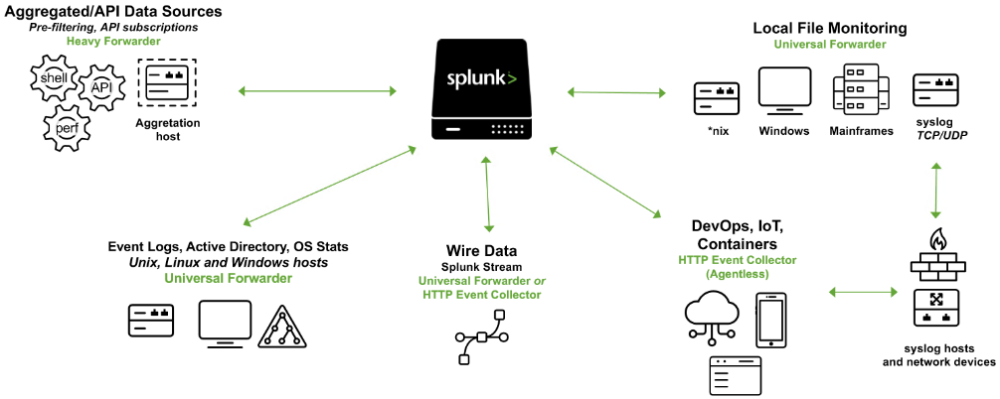

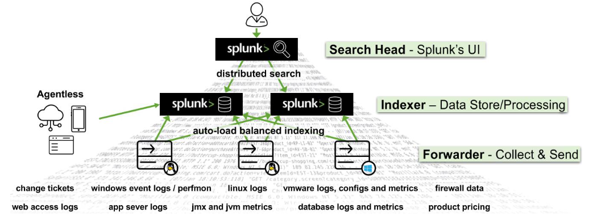

**Splunk's (Splunk Enterprise)** `architecture` consists of several layers that work together to `collect`, `index`, `search`, `analyze`, and `visualize` **data**. The architecture can be divided into the following main components:

- `Forwarders`  
Forwarders are **responsible for data collection**. They gather machine data from various sources and forward it to the indexers. The types of forwarders used in Splunk are:
  - `Universal Forwarder (UF)`  
  This is a lightweight agent that collects data and forwards it to the Splunk indexers without any preprocessing. Universal Forwarders are individual software packages that can be easily installed on remote sources without significantly affecting network or host performance.
  - `Heavy Forwarder (HF)`  
  This agent serves the purpose of collecting data from remote sources, especially for intensive data aggregation assignments involving sources like firewalls or data routing/filtering points. According to [Splexicon](https://docs.splunk.com/Splexicon:Heavyforwarder), heavy forwarders stand out from other types of forwarders as they parse data before forwarding, allowing them to route data based on specific criteria such as event source or type. They can also index data locally while simultaneously forwarding it to another indexer. Typically, Heavy Forwarders are deployed as dedicated "data collection nodes" for API/scripted data access, and they exclusively support Splunk Enterprise.
  - Please note that there are `HTTP Event Collectors (HECs)` available for directly collecting data from applications in a scalable manner. HECs operate by using token-based JSON or raw API methods. In this process, data is sent directly to the Indexer level for further processing.
- `Indexers`  
The indexers receive data from the forwarders, organize it, and store it in indexes. While indexing data, the indexers generate sets of directories categorized by age, wherein each directory hold compressed raw data and corresponding indexes that point to the raw data. They also process search queries from users and return results.
- `Search Heads`  
Search heads coordinate search jobs, dispatching them to the indexers and merging the results. They also provide an interface for users to interact with Splunk. On Search Heads, `Knowledge Objects` can be crafted to extract supplementary fields and manipulate data without modifying the original index data. It is important to mention that Search Heads also offer various tools to enrich the search experience, including reports, dashboards, and visualizations.
- `Deployment Server`  
It manages the configuration for forwarders, distributing apps and updates.
- `Cluster Master`  
The cluster master coordinates the activities of indexers in a clustered environment, ensuring data replication and search affinity.
- `License Master`  
It manages the licensing details of the Splunk platform.

**Splunk's `key components` include:**

- `Splunk Web Interface`  
This is the graphical interface through which users can interact with Splunk, carrying out tasks like searching, creating alerts, dashboards, and reports.
- `Search Processing Language (SPL)`  
The query language for Splunk, allowing users to search, filter, and manipulate the indexed data.
- `Apps and Add-ons`  
Apps provide specific functionalities within Splunk, while add-ons extend capabilities or integrate with other systems. Splunk Apps enable the coexistence of multiple workspaces on a single Splunk instance, catering to different use cases and user roles. These ready-made apps can be found on [Splunkbase](https://splunkbase.splunk.com/), providing additional functionalities and pre-configured solutions. Splunk Technology Add-ons serve as an abstraction layer for data collection methods. They often include relevant field extractions, allowing for schema-on-the-fly functionality. Additionally, Technology Add-ons encompass pertinent configuration files (props/transforms) and supporting scripts or binaries. A Splunk App, on the other hand, can be seen as a comprehensive solution that typically utilizes one or more Technology Add-ons to enhance its capabilities.
- `Knowledge Objects`  
These include fields, tags, event types, lookups, macros, data models, and alerts that enhance the data in Splunk, making it easier to search and analyze.

## Splunk As A SIEM Solution

When it comes to cybersecurity, Splunk can play a crucial role as a log management solution, but its true value lies in its analytics-driven Security Information and Event Management (SIEM) capabilities. Splunk as a SIEM solution can aid in real-time and historical data analysis, cybersecurity monitoring, incident response, and threat hunting. Moreover, it empowers organizations to enhance their detection capabilities by leveraging User Behavior Analytics.

As discussed, `Splunk Processing Language (SPL)` is a language containing over a hundred commands, functions, arguments, and clauses. It's the backbone of data analysis in Splunk, used for `searching`, `filtering`, `transforming`, and `visualizing data`.

Let's assume that `main` is an index containing **Windows Security** and **Sysmon logs**, among others.

1. **Basic Searching**  
    The most fundamental aspect of SPL is searching. By default, a search returns all events, but it can be narrowed down with keywords, boolean operators, comparison operators, and wildcard characters. For instance, a search for error would return all events containing that word.  
  
    Boolean operators `AND`, `OR`, and `NOT` are used for more specific queries.  
    
    The `search` command is typically implicit at the start of each SPL query and is not usually written out.

### Example using explicit search syntax

```sql
search index="main" "UNKNOWN"
```

By specifying the index as `main`, the query narrows down the search to only the events stored in the `main` index. The term `UNKNOWN` is then used as a keyword to filter and retrieve events that include this specific term.

:::info[Note]
Wildcards (`*`) can replace any number of characters in searches and field values.
:::

### Example (implicit search syntax)

```sql
index="main" "*UNKNOWN*"
```

This SPL query will search within the `main` index for events that contain the term `UNKNOWN` anywhere in the event data.

2. **Fields and Comparison Operators**  
    Splunk automatically identifies certain data as fields (like `source`, `sourcetype`, `host`, `EventCode`, etc.), and users can manually define additional fields. These fields can be used with comparison operators (`=`, `!=`, `<`, `>`, `<=`, `>=`) for more precise searches.

### Example using more precise searches

```sql
index="main" EventCode!=1
```

This SPL (Splunk Processing Language) query is used to search within the `main` index for events that do `not` have an `EventCode` value of `1`.

3. **The fields command**  
    The `fields` command specifies which fields should be included or excluded in the search results.

### Example using `fields`

```sql
index="main" sourcetype="WinEventLog:Sysmon" EventCode=1 | fields - User
```

After retrieving all process creation events from the `main` index, the `fields` command excludes the `User` field from the search results. Thus, the results will contain all fields normally found in the [Sysmon Event ID 1](https://www.ultimatewindowssecurity.com/securitylog/encyclopedia/event.aspx?eventid=90001) logs, except for the user that initiated the process.

:::info[Note]
Utilizing `sourcetype` **restricts the scope exclusively to** **Sysmon event logs**.
:::

4. **The table command**  
    The `table` command presents search results in a tabular format.

### Example using `table`

```sql
index="main" sourcetype="WinEventLog:Sysmon" EventCode=1 | table _time, host, Image
```

This query returns process creation events, then arranges selected fields (_time, host, and Image) in a tabular format. `_time` is the timestamp of the event, `host` is the name of the host where the event occurred, and `Image` is the name of the executable file that represents the process.

5. **The rename command**  
The `rename` command renames a field in the search results.

### Example using `rename`

```sql
index="main" sourcetype="WinEventLog:Sysmon" EventCode=1 | rename Image as Process
```

This command renames the `Image` field to `Process` in the search results. `Image` field in **Sysmon logs** represents the name of the executable file for the process. By renaming it, all the subsequent references to `Process` would now refer to what was originally the `Image` field.

6. **The dedup command**  
The `dedup` command removes duplicate events.

### Example using `dedup`

```sql
index="main" sourcetype="WinEventLog:Sysmon" EventCode=1 | dedup Image
```

The `dedup` command removes duplicate entries based on the `Image` field from the process creation events. This means if the same process (`Image`) is created multiple times, it will appear only once in the results, effectively removing repetition.

7. **The sort command**  
The `sort` command sorts the search results.

### Example using `sort`

```sql
index="main" sourcetype="WinEventLog:Sysmon" EventCode=1 | sort - _time
```

This command sorts all process creation events in the `main` index in **descending order** of their timestamps (_time), i.e., **the most recent events are shown first**.

8. **The stats command**  
The `stats` command performs statistical operations.

### Example using `stats`

```sql
index="main" sourcetype="WinEventLog:Sysmon" EventCode=3 | stats count by _time, Image
```

This query will return a table where each row represents a unique combination of a timestamp (`_time`) and a process (`Image`). The count column indicates the number of network connection events that occurred for that specific process at that specific time.

However, it's challenging to visualize this data over time for each process because the data for each process is interspersed throughout the table. We'd need to manually filter by process (`Image`) to see the counts over time for each one.

9. **The chart command**  
The `chart` command creates a data visualization based on statistical operations.

### Example using `chart`

```sql
index="main" sourcetype="WinEventLog:Sysmon" EventCode=3 | chart count by _time, Image
```

This query will return a table where each row represents a unique timestamp (`_time`) and each column represents a unique process (`Image`). The cell values indicate the number of network connection events that occurred for each process at each specific time.

With the `chart` command, you can easily visualize the data over time for each process because each process has its own column. You can quickly see at a glance the count of network connection events over time for each process.

10. **The eval command**  
The `eval` command creates or redefines fields.

### Example using `eval`

```sql
index="main" sourcetype="WinEventLog:Sysmon" EventCode=1 | eval Process_Path=lower(Image)
```

This command creates a new field `Process_Path` which contains the lowercase version of the `Image` field. It doesn't change the actual `Image` field, but creates a new field that can be used in subsequent operations or for display purposes.

11. **The rex command**  
The `rex` command extracts new fields from existing ones using regular expressions.

### Example using `rex`

```sql
index="main" EventCode=4662 | rex max_match=0 "[^%](?<guid>{.*})" | table guid
```

- `index="main" EventCode=4662`  
Filters the events to those in the `main` index with the `EventCode` equal to `4662`. This narrows down the search to specific events with the specified EventCode.

- `rex max_match=0 "[^%](?<guid>{.*})"`  
Uses the `rex` command to extract values matching the pattern from the events' fields. The regex pattern `{.*}` looks for substrings that begin with `{` and end with `}`. The `[^%]` part ensures that the match does not begin with a `%` character. The captured value within the curly braces is assigned to the named capture group `guid`.

- `table guid`  
Displays the extracted GUIDs in the output. This command is used to format the results and display only the `guid` field.

- `max_match=0`  
The option ensures that all occurrences of the pattern are extracted from each event. By default, the rex command only extracts the first occurrence.

:::info
This is useful because GUIDs are not automatically extracted from 4662 event logs.
:::

12. **The lookup command**  
The `lookup` command enriches the data with external sources.

### Example using `lookup`

> Suppose the following CSV file called `malware_lookup.csv

```sql
filename, is_malware
notepad.exe, false
cmd.exe, false
powershell.exe, false
sharphound.exe, true
randomfile.exe, true
```

This CSV file should be added as a new Lookup table as follows.

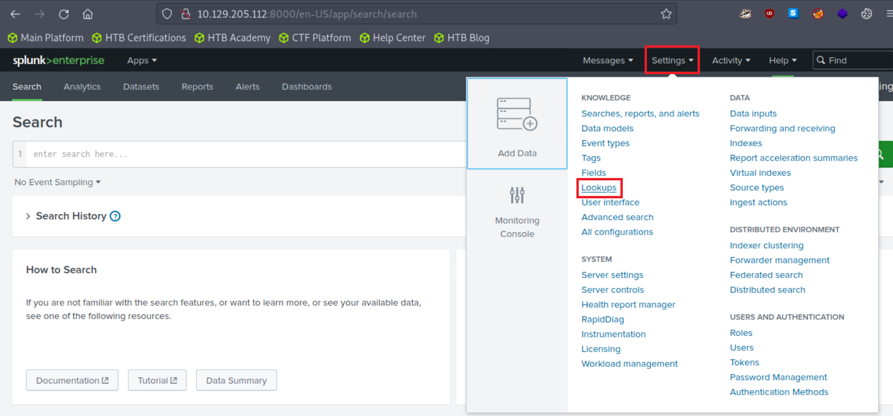

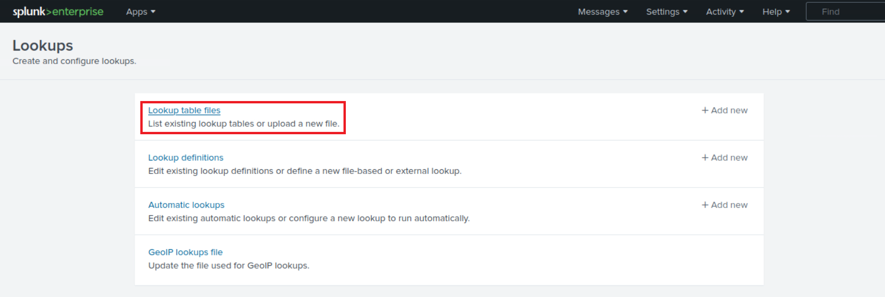

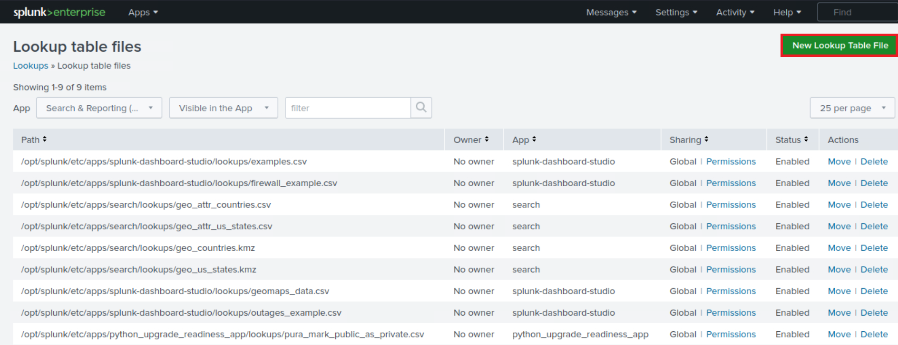

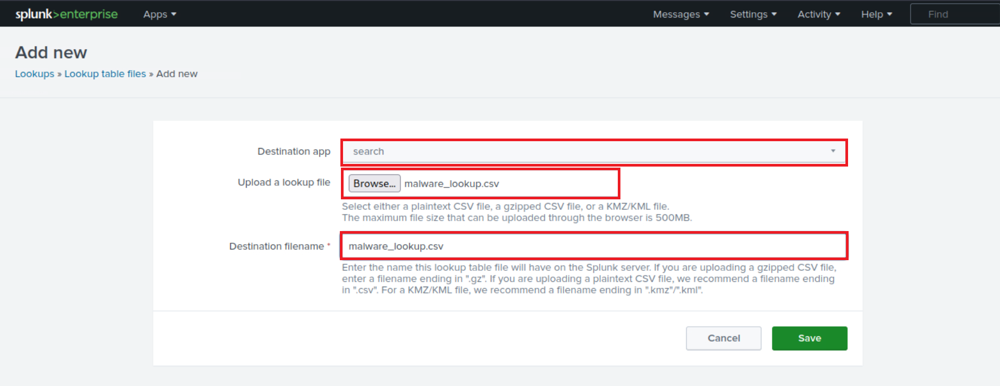

```sql
index="main" sourcetype="WinEventLog:Sysmon" EventCode=1 | rex field=Image "(?P<filename>[^\\\]+)$" | eval filename=lower(filename) | lookup malware_lookup.csv filename OUTPUTNEW is_malware | table filename, is_malware
```

- `index="main" sourcetype="WinEventLog:Sysmon" EventCode=1`  
This is the search criteria. It's looking for Sysmon logs (as identified by the sourcetype) with an EventCode of 1 (which represents process creation events) in the "main" index.

- `| rex field=Image "(?P<filename>[^\\\]+)$"`  
This command is using the regular expression (regex) to extract a part of the Image field. The Image field in Sysmon EventCode=1 logs typically contains the full file path of the process. This regex is saying: Capture everything after the last backslash (which should be the filename itself) and save it as filename.

- `| eval filename=lower(filename)`  
This command is taking the filename that was just extracted and converting it to lowercase. The lower() function is used to ensure the search is case-insensitive.

- `| lookup malware_lookup.csv filename OUTPUTNEW is_malware`  
This command is performing a lookup operation using the filename as a key. The lookup table (malware_lookup.csv) is expected to contain a list of filenames of known malicious executables. If a match is found in the lookup table, the new field is_malware is added to the event, which indicates whether or not the process is considered malicious based on the lookup table. `<-- filename in this part of the query is the first column title in the CSV`.

- `| table filename, is_malware`  
This command is formatting the output to show only the fields filename and is_malware. If is_malware is not present in a row, it means that no match was found in the lookup table for that filename.

In summary, this query is **extracting the filenames of newly created processes**, **converting them to lowercase**, **comparing them against a list of known malicious filenames**, and **presenting the findings in a table**.

An equivalent that also removes duplicates is the following.

```sql
index="main" sourcetype="WinEventLog:Sysmon" EventCode=1 | eval filename=mvdedup(split(Image, "\\")) | eval filename=mvindex(filename, -1) | eval filename=lower(filename) | lookup malware_lookup.csv filename OUTPUTNEW is_malware | table filename, is_malware | dedup filename, is_malware
```

- `index="main" sourcetype="WinEventLog:Sysmon" EventCode=1`  
This command is the search criteria. It is pulling from the `main` index where the sourcetype is `WinEventLog:Sysmon` and the `EventCode` is `1`. **The Sysmon EventCode of 1 indicates a process creation event.**

- `| eval filename=mvdedup(split(Image, "\\"))`  
This command is splitting the `Image` field, which contains the file path, into multiple elements at each backslash and making it a multivalue field. The `mvdedup` function is used to eliminate any duplicates in this multivalue field.

- `| eval filename=mvindex(filename, -1)`  
Here, the `mvindex` function is being used to select the last element of the multivalue field generated in the previous step. In the context of a file path, this would typically be the actual file name.

- `| eval filename=lower(filename)`  
This command is taking the filename field and converting it into lowercase using the lower function. This is done to ensure the search is not case-sensitive and to standardize the data.

- `| lookup malware_lookup.csv filename OUTPUTNEW is_malware`  
This command is performing a lookup operation. The `lookup` command is taking the `filename` field, and checking if it matches any entries in the `malware_lookup.csv` lookup table. If there is a match, it appends a new field, `is_malware`, to the event, indicating whether the process is flagged as malicious.

- `| table filename, is_malware`  
The `table` command is used to format the output, in this case showing only the f`ilename` and `is_malware` fields in a tabular format.

- `| dedup filename, is_malware`  
This command eliminates any duplicate events based on the filename and is_malware fields. In other words, if there are multiple identical entries for the `filename` and `is_malware` fields in the search results, the `dedup` command will retain only the first occurrence and remove all subsequent duplicates.

In summary, this SPL query searches the Sysmon logs for process creation events, extracts the `file name` from the `Image` field, converts it to lowercase, matches it against a list of known malware from the `malware_lookup.csv` file, and then displays the results in a table, removing any duplicates based on the `filename` and `is_malware` fields.

13. **The inputlookup command**  
The `inputlookup` command retrieves data from a lookup file without joining it to the search results.

### Example using `inputlookup`

```sql
| inputlookup malware_lookup.csv
```

This command retrieves all records from the `malware_lookup.csv` file. The result is not joined with any search results but can be used to verify the content of the lookup file or for subsequent operations like filtering or joining with other datasets.

14. **Time Range**  
Every event in Splunk has a timestamp. Using the time range picker or the `earliest` and `latest` commands, you can limit searches to specific time periods.

### Example using `earliest`

```sql
index="main" earliest=-7d EventCode!=1
```

By combining the `index="main"` condition with `earliest=-7d` and `EventCode!=1`, the query will retrieve events from the main index that occurred in the last seven days and do not have an `EventCode` value of `1`.

15. **The transaction command**  
The `transaction` command is used in Splunk to group events that share common characteristics into transactions, often used to track sessions or user activities that span across multiple events.

### Example using `transaction`

```sql
index="main" sourcetype="WinEventLog:Sysmon" (EventCode=1 OR EventCode=3) | transaction Image startswith=eval(EventCode=1) endswith=eval(EventCode=3) maxspan=1m | table Image |  dedup Image
```

- `index="main" sourcetype="WinEventLog:Sysmon" (EventCode=1 OR EventCode=3)`  
This is the search criteria. It's pulling from the `main` index where the sourcetype is `WinEventLog:Sysmon` and the `EventCode` is either `1` or `3`. In Sysmon logs, `EventCode 1` refers to **a process creation event**, and `EventCode 3` refers to **a network connection event**.

- `| transaction Image startswith=eval(EventCode=1) endswith=eval(EventCode=3) maxspan=1m`  
The transaction command is used here to group events based on the Image field, which represents the executable or script involved in the event. This grouping is subject to the conditions: the transaction starts with an event where `EventCode` is `1` and ends with an event where `EventCode` is `3`. The `maxspan=1m` clause limits the transaction to events occurring within a 1-minute window. The transaction command can link together related events to provide a better understanding of the sequences of activities happening within a system.

- `| table Image`  
This command formats the output into a table, displaying only the `Image` field.

- `| dedup Image`  
Finally, the `dedup` command removes duplicate entries from the result set. Here, it's eliminating any duplicate `Image` values. The command keeps only the first occurrence and removes subsequent duplicates based on the `Image` field.

In summary, this query aims to identify sequences of activities (process creation followed by a network connection) associated with the same executable or script within a 1-minute window. It presents the results in a table format, ensuring that the listed executables/scripts are unique. The query can be valuable in threat hunting, particularly when looking for indicators of compromise such as rapid sequences of process creation and network connection events initiated by the same executable.

16. **Subsearches**  
A `subsearch` in Splunk is a search that is nested inside another search. It's used to compute a set of results that are then used in the outer search.

### Example using `subsearch`

```sql
index="main" sourcetype="WinEventLog:Sysmon" EventCode=1 NOT [ search index="main" sourcetype="WinEventLog:Sysmon" EventCode=1 | top limit=100 Image | fields Image ] | table _time, Image, CommandLine, User, ComputerName
```

- **In this query**
  - `index="main" sourcetype="WinEventLog:Sysmon" EventCode=1`  
  The main search that fetches `EventCode=1 (Process Creation)` events.

  - `NOT []`  
  The square brackets contain the subsearch. By placing `NOT` before it, the main search will exclude any results that are returned by the subsearch.

  - `search index="main" sourcetype="WinEventLog:Sysmon" EventCode=1 | top limit=100 Image | fields Image`  
  The subsearch that fetches `EventCode=1 (Process Creation)` events, then uses the `top` command to return the 100 most common `Image` (process) names.

  - `table _time, Image, CommandLine, User, Computer`  
  This presents the final results as a table, displaying the timestamp of the event (`_time`), the process name (`Image`), the command line used to execute the process (`CommandLine`), the user that executed the process (`User`), and the computer on which the event occurred (`ComputerName`).

This query can help to highlight unusual or rare processes, which may be worth investigating for potential malicious activity. Be sure to adjust the limit in the subsearch as necessary to fit your environment.

As a note, this type of search can generate a lot of noise in environments where new and unique processes are frequently created, so careful tuning and context are important.

---

### This is just the tip of the iceberg when it comes to SPL.

Its vast command set and flexible syntax provide comprehensive data analysis capabilities. As with any language, proficiency comes with practice and experience. Find below some excellent resources to start with:

- [https://docs.splunk.com/Documentation/SCS/current/SearchReference/Introduction](https://docs.splunk.com/Documentation/SCS/current/SearchReference/Introduction)
- [https://docs.splunk.com/Documentation/SplunkCloud/latest/SearchReference/](https://docs.splunk.com/Documentation/SplunkCloud/latest/SearchReference/)
- [https://docs.splunk.com/Documentation/SplunkCloud/latest/Search/](https://docs.splunk.com/Documentation/SplunkCloud/latest/Search/)

---

## How To Identify The Available Data

### Data and field identification approach 1: Leverage Splunk's Search & Reporting Application (SPL)

In any robust Security Information and Event Management (SIEM) system like Splunk, understanding the available data sources, the data they provide, and the fields within them is critical to leveraging the system effectively. In Splunk, we primarily use the Search & Reporting application to do this. Let's delve into how we can identify data source types, data, and fields within Splunk.

Splunk can ingest a wide variety of data sources. We classify these data sources into source types that dictate how Splunk formats the incoming data. To identify the available source types, we can run the following SPL command, `after selecting the suitable time range in the time picker of the Search & Reporting application.`

```sql
| eventcount summarize=false index=* | table index
```

This query uses `eventcount` to count events in all indexes, then `summarize=false` is used to display counts for each index separately, and finally, the `table` command is used to present the data in tabular form.

---

```sql
| metadata type=sourcetypes
```

This search uses the `metadata` command, which provides us with various statistics about specified indexed fields. Here, we're focusing on `sourcetypes`. The result is a list of all `sourcetypes` in our Splunk environment, along with additional metadata such as the first time a source type was seen (`firstTime`), the last time it was seen (`lastTime`), and the number of hosts (`totalCount`).

---

For a simpler view, we can use the following search.

```sql
| metadata type=sourcetypes index=* | table sourcetype
```

Here, the `metadata` command retrieves metadata about the data in our indexes. The `type=sourcetypes` argument tells Splunk to return metadata about sourcetypes. The `table` command is used to present the data in tabular form.

---

```sql
| metadata type=sources index=* | table source
```

This command returns a list of all data sources in the Splunk environment.

---

Once we know our source types, we can investigate the kind of data they contain. Let's say we are interested in a sourcetype named `WinEventLog:Security`, we can use the table command to present the raw data as follows.

```sql
sourcetype="WinEventLog:Security" | table _raw
```

The `table` command generates a table with the specified fields as columns. Here, `_raw` represents the raw event data. This command will return the raw data for the specified source type.

Splunk automatically extracts a set of default fields for every event it indexes, but it can also extract additional fields depending on the source type of the data. To see all fields available in a specific source type, we can use the `fields` command.

---

```sql
sourcetype="WinEventLog:Security" | table *
```

This command generates a table with all fields available in the `WinEventLog:Security` sourcetype. However, be cautious, as the use of `table *` can result in a very wide table if our events have a large number of fields. This may not be visually practical or effective for data analysis.

A better approach is to identify the fields you are interested in using the `fields` command as mentioned before, and then specifying those field names in the `table` command.

**Example**

```sql
sourcetype="WinEventLog:Security" | fields Account_Name, EventCode | table Account_Name, EventCode
```

---

If we want to see a list of field names only, without the data, we can use the `fieldsummary` command instead.

```sql
sourcetype="WinEventLog:Security" | fieldsummary
```

This search will return a table that includes every field found in the events returned by the search (across the sourcetype we've specified). The table includes several columns of information about each field:

- `field`  
The name of the field.

- `count`  
The number of events that contain the field.

- `distinct_count`  
The number of distinct values in the field.

- `is_exact`  
Whether the count is exact or estimated.

- `max`  
The maximum value of the field.

- `mean`  
The mean value of the field.

- `min`  
The minimum value of the field.

- `numeric_count`  
The number of numeric values in the field.

- `stdev`  
The standard deviation of the field.

- `values`  
Sample values of the field.

We may also see:

- `modes`  
The most common values of the field.

- `numBuckets`  
The number of buckets used to estimate the distinct count.

:::info[Note]
The values provided by the `fieldsummary` command are calculated based on the events returned by our search. So if we want to see all fields within a specific `sourcetype`, we need to make sure our time range is large enough to capture all possible fields.
:::

```sql
index=* sourcetype=* | bucket _time span=1d | stats count by _time, index, sourcetype | sort - _time
```

Sometimes, we might want to know how events are distributed over time. This query retrieves all data (`index=* sourcetype=*`), then `bucket` command is used to group the events based on the `_time` field into 1-day buckets. The `stats` command then counts the number of events for each day (`_time`), `index`, and `sourcetype`. Lastly, the sort command sorts the result in descending order of `_time`.

---

```sql
index=* sourcetype=* | rare limit=10 index, sourcetype
```

The `rare` command can help us identify uncommon event types, which might be indicative of abnormal behavior. This query retrieves all data and finds the 10 rarest combinations of indexes and sourcetypes.

```sql
index="main" | rare limit=20 useother=f ParentImage
```

This command displays the 20 least common values of the `ParentImage` field.

---

```sql
index=* sourcetype=* | fieldsummary | where count < 100 | table field, count, distinct_count
```

A more complex query can provide a detailed summary of fields. This search shows a summary of all fields (`fieldsummary`), filters out fields that appear in less than 100 events (`where count < 100`), and then displays a table (`table`) showing the field name, total count, and distinct count.

```sql
index=* | sistats count by index, sourcetype, source, host
```

We can also use the `sistats` command to explore event diversity. This command counts the number of events per index, sourcetype, source, and host, which can provide us a clear picture of the diversity and distribution of our data.

---

```sql
index=* sourcetype=* | rare limit=10 field1, field2, field3
```

The `rare` command can also be used to find uncommon combinations of field values. Replace `field1`, `field2`, `field3` with the fields of interest. This command will display the 10 rarest combinations of these fields.

By combining the above SPL commands and techniques, we can explore and understand the types of data source, the data they contain, and the fields within them. This understanding is the foundation upon which we build effective searches, reports, alerts, and dashboards in Splunk.

Lastly, remember to follow your organization's data governance policies when exploring data and source types to ensure you're compliant with all necessary privacy and security guidelines.

### Data and field identification approach 2: Leverage Splunk's User Interface

When using the `Search & Reporting` application's user interface, identifying the available data source types, the data they contain, and the fields within them becomes a task that involves interacting with various sections of the UI. Let's examine how we can effectively use the Splunk Web interface to identify these elements.

- `Data Sources`  
The first thing we want to identify is our data sources. We can do this by navigating to the `Settings` menu, which is usually located on the top right corner of our Splunk instance. In the dropdown, we'll find `Data inputs`. By clicking on `Data inputs`, we'll see a list of various data input methods, including files & directories, HTTP event collector, forwarders, scripts, and many more. These represent the various sources through which data can be brought into Splunk. Clicking into each of these will give us an overview of the data sources being utilized.

- `Data (Events)`  
Now, let's move on to identifying the data itself, in other words, the events. For this, we'll want to navigate to the `Search & Reporting` app. By exploring the events in the `Fast` mode, we can quickly scan through our data. The `Verbose` mode, on the other hand, lets us dive deep into each event's details, including its raw event data and all the fields that Splunk has extracted from it.

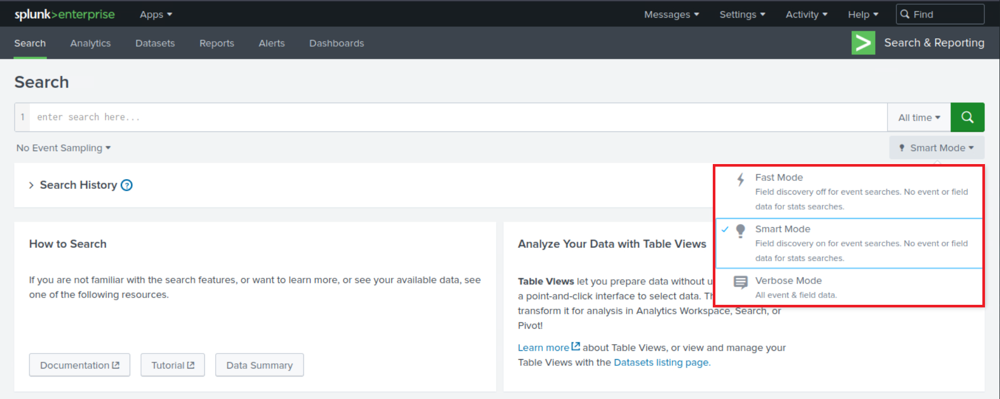

In the search bar, we could simply put `*` and hit search, which will bring up all the data that we have indexed. However, this is usually a massive amount of data, and it might not be the most efficient way to go about it. A better approach might be to leverage the time picker and select a smaller time range (let's be careful while doing so though to not miss any important/useful historic logs).

---

- `Fields`  
Lastly, to identify the fields in our data, let's look at an event in detail. We can click on any event in our search results to expand it.

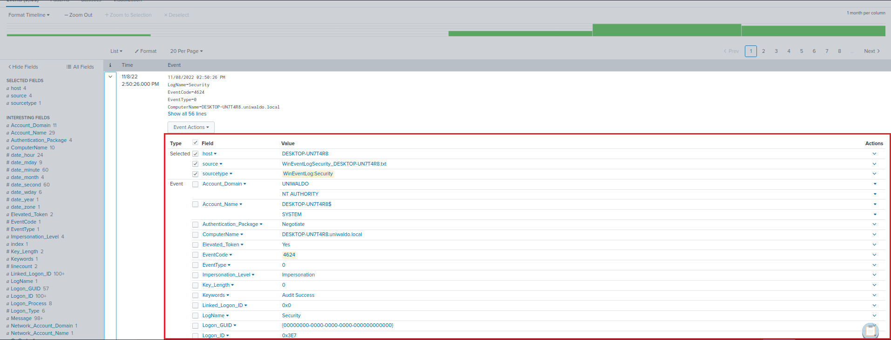

We can also see on the left hand side of the "**Search & Reporting**" application two categories of fields: `Selected Fields` and `Interesting Fields`. `Selected Fields` are fields that are always shown in the events (like `host`, `source`, and `sourcetype`), while `Interesting Fields` are those that appear in at least 20% of the events. By clicking `All fields`, we can see all the fields present in our events.

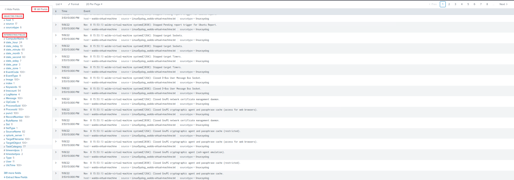

---

- `Data Models`  
Data Models provide an organized, hierarchical view of our data, simplifying complex datasets into understandable structures. They're designed to make it easier to create meaningful reports, visualizations, and dashboards without needing a deep understanding of the underlying data sources or the need to write complex SPL queries. Here is how we can use the Data Models feature to identify and understand our data:

  - `Accessing Data Models`  
  To access Data Models, we click on the `Settings` tab on the top right corner of the Splunk Web interface. Then we select `Data Models` under the `Knowledge` section. This will lead us to the Data Models management page. **<-- If it appears empty, please execute a search and navigate to the Data Models page again.**

  - `Understanding Existing Data Models`  
  On the Data Models management page, we can see a list of available Data Models. These might include models created by ourselves, our team, or models provided by Splunk Apps. Each Data Model is associated with a specific app context and is built to describe the structured data related to the app's purpose.

  - `Exploring Data Models`  
  By clicking on the name of a Data Model, we are taken to the `Data Model Editor`. This is where the true power of Data Models lies. Here, we can view the hierarchical structure of the data model, which is divided into `objects`. Each object represents a specific part of our data and contains `fields` that are relevant to that object.

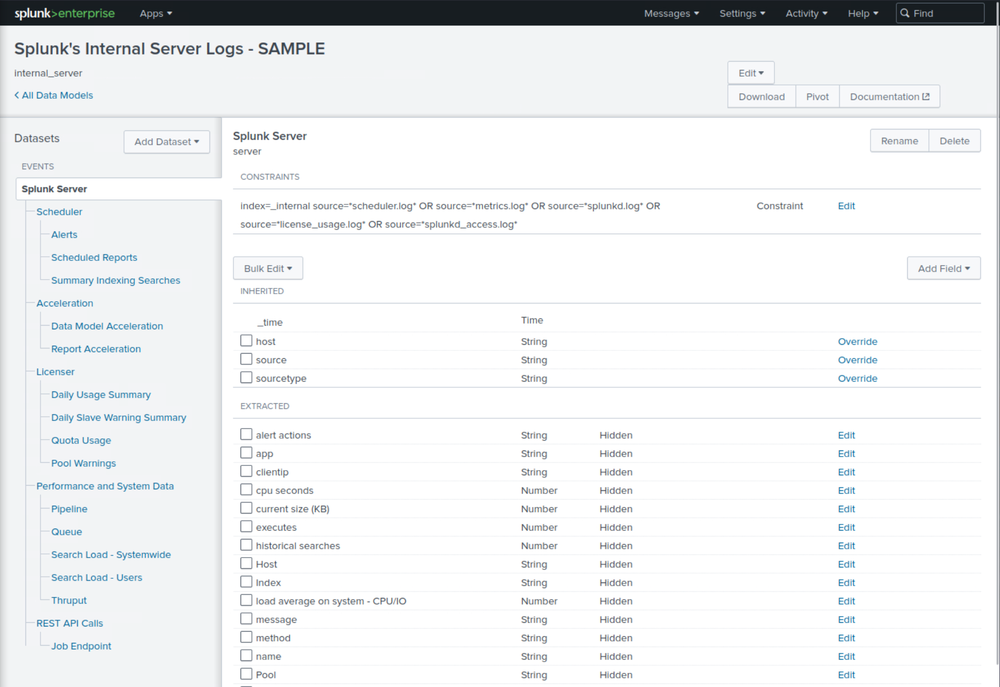

#### Example
  
If we have a Data Model that describes web traffic, we might see objects like `Web Transactions`, `Web Errors`, etc. Within these objects, we'll find fields like `status`, `url`, `user`, etc.

---

- `Pivots`  
Pivots are an extremely powerful feature in Splunk that allows us to create complex reports and visualizations without writing SPL queries. They provide an interactive, drag-and-drop interface for defining and refining our data reporting criteria. As such, they're also a fantastic tool for identifying and exploring the available data and fields within our Splunk environment. To start with Pivots to identify available data and fields, we can use the `Pivot` button that appears when we're browsing a particular data model in the `Data Models` page.

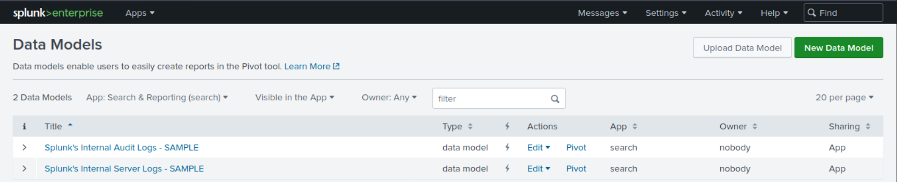

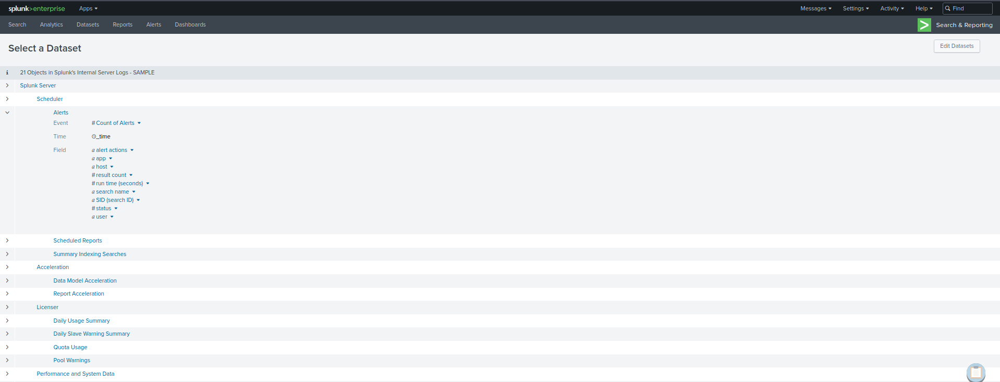

## Practical Exercises

### Questions

### 1. Open the "Search & Reporting" application, and find through an SPL search against all data the account name with the highest amount of Kerberos authentication ticket requests. Enter it as your answer.

<RevealFlag> flag{docusaurus_ctf_flag} </RevealFlag>

### 2. Open the "Search & Reporting" application, and find through an SPL search against all 4624 events the count of distinct computers accessed by the account name SYSTEM. Enter it as your answer.

<RevealFlag> flag{docusaurus_ctf_flag} </RevealFlag>

### 3. Open the "Search & Reporting" application, and find through an SPL search against all 4624 events the account name that made the most login attempts within a span of 10 minutes. Enter it as your answer.

<RevealFlag> flag{docusaurus_ctf_flag} </RevealFlag>