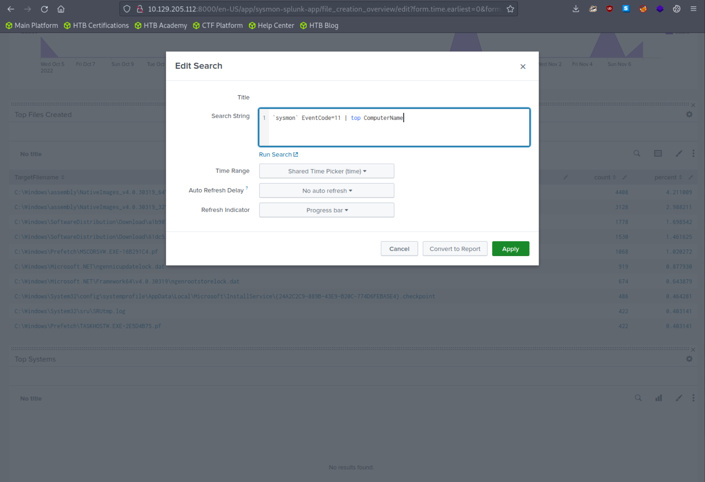
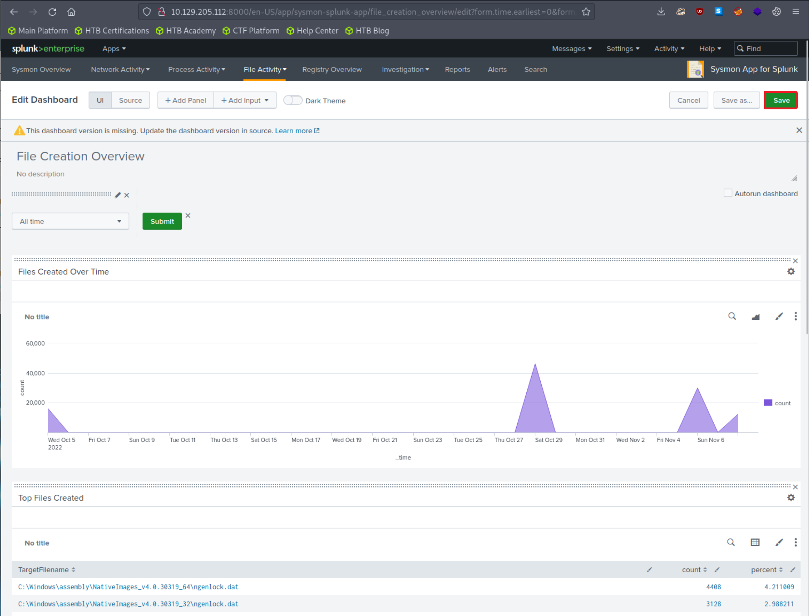

import RevealFlag from '@site/src/components/RevealFlag';

# Using Splunk Applications

## Splunk Applications

Splunk applications, or apps, are packages that we add to our Splunk Enterprise or Splunk Cloud deployments to extend capabilities and manage specific types of operational data. Each application is tailored to handle data from specific technologies or use cases, effectively acting as a pre-built knowledge package for that data. Apps can provide capabilities ranging from custom data inputs, custom visualizations, dashboards, alerts, reports, and more.

Splunk Apps enable the coexistence of multiple workspaces on a single Splunk instance, catering to different use cases and user roles. These ready-made apps can be found on Splunkbase.

As an integral part of our cybersecurity operations, the Splunk apps designed for Security Information and Event Management (SIEM) purposes provide a range of capabilities to enhance our ability to detect, investigate, and respond to threats. They are designed to ingest, analyze, and visualize security-related data, enabling us to detect complex threats and perform in-depth investigations.

When using these apps in our Splunk environment, we need to consider factors such as data volume, hardware requirements, and licensing. Many apps can be resource-intensive, so we must ensure our Splunk deployment is sized correctly to handle the additional workload. Further, it's also important to ensure we have the correct licenses for any premium apps, and that we are aware of the potential for increased license usage due to the added data inputs.

In this segment, we'll be leveraging the `Sysmon App for Splunk` developed by Mike Haag.

To download, add, and use this application, follow the steps delineated below:

### 1. Sign up for a free account at [splunkbase](https://splunkbase.splunk.com/)


### 2. Once registered, log into your account

### 3. Head over to the [Sysmon App for Splunk](https://splunkbase.splunk.com/app/3544) page to download the application.


### 4. Add the application as follows to your search head.


### 5. Adjust the application's [macro](https://docs.splunk.com/Documentation/Splunk/latest/Knowledge/Definesearchmacros) so that events are loaded as follows.


```txt
index="main" sourcetype="WinEventLog:Sysmon"
```

Let's access the Sysmon App for Splunk by locating it in the "**Apps**" column on the Splunk home page and head over to the `File Activity` tab.


Let's now specify "**All time**" on the time picker and click "**Submit**". Results are generated successfully; however, no results are appearing in the "**Top Systems**" section.


We can fix that by clicking on "**Edit**" *(upper right hand corner of the screen)* and editing the search.


The [Sysmon Events with ID 11](https://www.ultimatewindowssecurity.com/securitylog/encyclopedia/event.aspx?eventid=90011) do not contain a field named `Computer`, but they do include a field called `ComputerName`. Let's fix that and click "**Apply**"



```txt
`sysmon` EventCode=11 | top ComputerName
```

Results should now be generated successfully in the "**Top Systems**" section.



---

## Practical Exercises

### Questions

### `1. Access the Sysmon App for Splunk and go to the "Reports" tab. Fix the search associated with the "Net - net view" report and provide the complete executed command as your answer. Answer format: net view /Domain:_.local`

<RevealFlag>{`net view /DOMAIN:uniwaldo.local`}</RevealFlag>

```sql
`sysmon` EventCode=1 CommandLine="*net view*"
| stats count by _time, ComputerName, User, CommandLine, Image, ParentImage
```

:::tip Refactoring Tip
Start with a simple base query (e.g., just ``` `sysmon` EventCode=1 ```) and incrementally add filters like `CommandLine` or `Image`. This helps verify each part returns results before building the full, fixed query.
:::

---

### `2. Access the Sysmon App for Splunk, go to the "Network Activity" tab, and choose "Network Connections". Fix the search and provide the number of connections that SharpHound.exe has initiated as your answer.`

<RevealFlag>{`6`}</RevealFlag>


:::tip
Get from here the right fields for the `Splunk Search Query`.
:::

```txt
11/08/2022 11:27:19 AM
LogName=Microsoft-Windows-Sysmon/Operational
EventCode=3
EventType=4
ComputerName=DESKTOP-EGSS5IS.uniwaldo.local
User=NOT_TRANSLATED
Sid=S-1-5-18
SidType=0
SourceName=Microsoft-Windows-Sysmon
Type=Information
RecordNumber=51176
Keywords=None
TaskCategory=Network connection detected (rule: NetworkConnect)
OpCode=Info
Message=Network connection detected:
RuleName: technique_id=T1036,technique_name=Masquerading
UtcTime: 2022-11-08 19:26:36.487
ProcessGuid: {96192a2a-ad68-636a-2905-000000000d00}
ProcessId: 4352
Image: C:\Users\waldo\Downloads\SharpHound.exe
User: NT AUTHORITY\SYSTEM
Protocol: tcp
Initiated: true
SourceIsIpv6: false
SourceIp: 10.0.0.253
SourceHostname: -
SourcePort: 52731
SourcePortName: -
DestinationIsIpv6: false
DestinationIp: 10.0.0.81
DestinationHostname: -
DestinationPort: 3268
DestinationPortName: -
```

