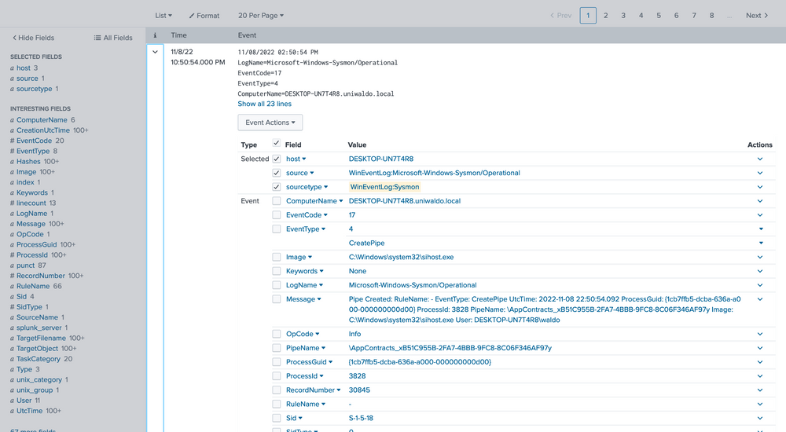
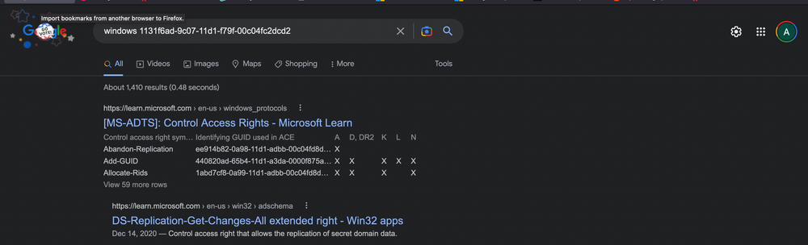

import RevealFlag from '@site/src/components/RevealFlag';

# Intrusion Detection With Splunk (Real-world Scenario)

---

## Introduction

The [Windows Event Logs & Finding Evil](https://blog.salucci.ch/docs/HackingLab/HackTheBox/SOC-Analyst/Windows-Event-Logs-Finding-Evil-Skills-Assessment/) module familiarized us with log exploration on a single machine to pinpoint malicious activity. Now, we're stepping up our game. We'll be conducting similar investigations, but on a much larger scale, across numerous machines to uncover irregular activities within the entire network instead of just one device. Our tools will still include Windows Event logs, but the scope of our work will broaden significantly, demanding careful scrutiny of a larger pool of information, and identifying and discarding false positives whenever possible.

In this module, we'll be zooming in on specific malicious machines. We'll master the art of crafting precise queries and triggering alerts to proactively enhance the security of our environment.

The strategy we'll follow to identify events will mirror our initial lessons. However, we're going up against a much larger data set instead of merely one collection of event logs. And from our vantage point at the Splunk dashboard, we'll aim to weed out false positives.

---

## Ingesting Data Sources

At the start of creating hunts, alerts, or queries, the sheer volume of information and data can be daunting. Part of the art of being a cybersecurity professional involves pinpointing the most meaningful data, determining how to sift through it quickly and efficiently, and ensuring the robustness of our analysis.

To proceed, we need access to data we can analyze and use for threat hunting. There are a few sources we can turn to. One source that Splunk provides, along with installation instructions, is [BOTS](https://github.com/splunk/botsv3). Alternatively, [nginx_json_logs](https://raw.githubusercontent.com/elastic/examples/refs/heads/master/Common%20Data%20Formats/nginx_json_logs/nginx_json_logs) is a handy resource providing us with dummy logs in JSON format. If you upload data from arbitrary sources, ensure your source type correctly extracts the JSON by adjusting the `Indexed Extractions` setting to JSON when crafting a new source type before uploading the JSON data.

Our focus in this module, however, will be on a data set that we've personally created. This data set will assist your progress. You'll be working with over 500,000 events. By setting the time picker to `All time` and submitting the query below, we can retrieve all accessible events.

```sql
index="main" earliest=0
```


We now have a mammoth data set to sift through and analyze across various sourcetypes with multiple infections. Within this data, we will encounter different types of attacks and infections. Our goal here isn't to identify every single one but to understand how we can begin to detect any sort of attack within this vast data pool. By the end of this lesson, we will have identified several attacks, and we encourage you to dive into the data and uncover more on your own.

---

## Searching Effectively

If you're new to Splunk, you might notice that certain queries take considerable time to process and return data, particularly when dealing with larger, more realistic data sets. Effective threat hunting in any SIEM hinges on crafting the right queries and targeting relevant data.

We've touched upon the significance of relevant or accurate data multiple times. What does this really mean? The data within these events contains a mixture of valuable signals that can help us track down attacks and extraneous noise that we need to filter out. It can be a daunting thought that potential threats may be hiding in the background noise, and while this is a possibility, our job as the blue team is to methodically trace down tactics, techniques, and procedures (TTPs), and to craft alerts and hunting queries to cover as many potential threat vectors as we can. This is not a sprint; it's more of a marathon, a process that often spans across the life of an organization. We start by targeting what we know is malicious from familiar data.

Let's dive into our data. Our first objective is to see what we can identify within the Sysmon data. We'll start by listing all our sourcetypes to approach this as an unknown environment from scratch. Run the following query to observe the possible sourcetypes (the screenshot may contain a WinEventLog sourcetype that you will not have).

```sql
index="main" | stats count by sourcetype
```


:::info
This will **list all the sourcetypes available in your Splunk environment**. Now let's query our `Sysmon` `sourcetype` and take a look at the incoming data.
:::

```sql
index="main" sourcetype="WinEventLog:Sysmon"
```


We can delve into the events by clicking the arrow on the left.



Here we can verify that it is indeed Sysmon data and further identify extracted fields that we can target for searching. The extracted fields aid us in crafting more efficient searches. Here's the reasoning.

There are several ways we can run searches to achieve our goal, but some methods will be more efficient than others. We can query all fields, which essentially performs regex searches for our data assuming we don't know what field it exists in. For demonstration, let's execute some generalized queries to illustrate performance differences. Let's search for all possible instances of `uniwaldo.local`.

```sql
index="main" uniwaldo.local
```


This should return results rather quickly. It will display any instances of this specific string found in `any` and `all` sourcetypes the way we ran it. It can be case insensitive and still return the same results. Now let's attempt to find all instances of this string concatenated within any other string such as "myuniwaldo.localtest" by using a wildcard before and after it.

```sql
index="main" *uniwaldo.local*
```


You'll observe that this query returns results `much` more slowly than before, even though the number of results is exactly the same! Now let's target this string within the `ComputerName` field only, as we might only care about this string if it shows up in `ComputerName`. Because no `ComputerName only` contains this string, we need to prepend a wildcard to return relevant results.

```sql
index="main" ComputerName="*uniwaldo.local"
```


You'll find that this query returns results `much` more swiftly than our previous search. The point being made here is that targeted searches in your SIEM will execute and return results much more quickly. They also lessen resource consumption and allow your colleagues to use the SIEM with less disruption and impact. As we devise our queries to hunt anomalies, it's crucial that we keep crafting efficient queries at the forefront of our thinking, particularly if we aim to convert this query into an alert later. Having many slow-running alerts won't benefit our systems or us. If you can aim the search at specific users, networks, machines, etc., it will always be to your advantage to do so, as it also cuts down a lot of irrelevant data, enabling you to focus on what truly matters. But again, how do we know what we `need` to focus on?

---

## 🧠 Embracing The Mindset Of Analysts, Threat Hunters, & Detection Engineers

Making progress on our journey, let's pivot our focus towards spotting anomalies in our data. Remember the foundation we established in the [Windows Event Logs & Finding Evil module](https://blog.salucci.ch/docs/HackingLab/HackTheBox/SOC-Analyst/Windows-Event-Logs/), where we explored the potential of event codes in tracing peculiar activities? We utilized public resources such as the `Microsoft Sysinternals` guide for [Sysmon](https://learn.microsoft.com/en-us/sysinternals/downloads/sysmon). Let's apply the same approach and `identify all Sysmon EventCodes` prevalent in our data with this query.

```sql
index="main" sourcetype="WinEventLog:Sysmon" | stats count by EventCode
```


Our scan uncovers `20 distinct EventCodes`. Before we move further, let's remind ourselves of some of the Sysmon event descriptions and their potential usage in detecting malicious activity.

- [Sysmon Event ID 1 - Process Creation](https://www.ultimatewindowssecurity.com/securitylog/encyclopedia/event.aspx?eventid=90001)  
Useful for hunts targeting abnormal parent-child process hierarchies, as illustrated in the first lesson with Process Hacker. It's an event we can use later.

- [Sysmon Event ID 2 - A process changed a file creation time](https://www.ultimatewindowssecurity.com/securitylog/encyclopedia/event.aspx?eventid=90002)  
Helpful in spotting "time stomp" attacks, where attackers alter file creation times. Bear in mind, not all such actions signal malicious intent.

- [Sysmon Event ID 3 - Network connection](https://www.ultimatewindowssecurity.com/securitylog/encyclopedia/event.aspx?eventid=90003)  
A source of abundant noise since machines are perpetually establishing network connections. We may uncover anomalies, but let's consider other quieter areas first.

- [Sysmon Event ID 4 - Sysmon service state changed](https://www.ultimatewindowssecurity.com/securitylog/encyclopedia/event.aspx?eventid=90004)  
Could be a useful hunt if attackers attempt to stop Sysmon, though the majority of these events are likely benign and informational, considering Sysmon's frequent legitimate starts and stops.

- [Sysmon Event ID 5 - Process terminated](https://www.ultimatewindowssecurity.com/securitylog/encyclopedia/event.aspx?eventid=90005)  
This might aid us in detecting when attackers kill key processes or use sacrificial ones. For instance, Cobalt Strike often spawns temporary processes like werfault, the termination of which would be logged here, as well as the creation in [ID 1](https://www.ultimatewindowssecurity.com/securitylog/encyclopedia/event.aspx?eventid=90001).

- [Sysmon Event ID 6 - Driver loaded](https://www.ultimatewindowssecurity.com/securitylog/encyclopedia/event.aspx?eventid=90006)  
A potential flag for BYOD (bring your own driver) attacks, though this is less common. Before diving deep into this, let's weed out more conspicuous threats first.

- [Sysmon Event ID 7 - Image loaded](https://www.ultimatewindowssecurity.com/securitylog/encyclopedia/event.aspx?eventid=90007)  
Allows us to track dll loads, which is handy in detecting DLL hijacks.

- [Sysmon Event ID 8 - CreateRemoteThread](https://www.ultimatewindowssecurity.com/securitylog/encyclopedia/event.aspx?eventid=90008)  
Potentially aids in identifying injected threads. While remote threads can be created legitimately, if an attacker misuses this API, we can potentially trace their rogue process and what they injected into.

- [Sysmon Event ID 10 - ProcessAccess](https://www.ultimatewindowssecurity.com/securitylog/encyclopedia/event.aspx?eventid=90010)  
Useful for spotting remote code injection and memory dumping, as it records when handles on processes are made.

- [Sysmon Event ID 11 - FileCreate](https://www.ultimatewindowssecurity.com/securitylog/encyclopedia/event.aspx?eventid=90011)  
With many files being created frequently due to updates, downloads, etc., it might be challenging to aim our hunt directly here. However, these events can be beneficial in correlating or identifying a file's origins later.

- [Sysmon Event ID 12 - RegistryEvent (Object create and delete)](https://www.ultimatewindowssecurity.com/securitylog/encyclopedia/event.aspx?eventid=90012) & [Sysmon Event ID 13 - RegistryEvent (Value Set)](https://www.ultimatewindowssecurity.com/securitylog/encyclopedia/event.aspx?eventid=90013)  
While numerous events take place here, many registry events can be malicious, and with a good idea of what to look for, hunting here can be fruitful.

- [Sysmon Event ID 15 - FileCreateStreamHash](https://www.ultimatewindowssecurity.com/securitylog/encyclopedia/event.aspx?eventid=90015)  
Relates to file streams and the "Mark of the Web" pertaining to external downloads, but we'll leave this aside for now.

- [Sysmon Event ID 16 - Sysmon config state changed](https://www.ultimatewindowssecurity.com/securitylog/encyclopedia/event.aspx?eventid=90016)  
Logs alterations in Sysmon configuration, useful for spotting tampering.

- [Sysmon Event ID 17 - Pipe created](https://www.ultimatewindowssecurity.com/securitylog/encyclopedia/event.aspx?eventid=90017) & [Sysmon Event ID 18 - Pipe connected](https://www.ultimatewindowssecurity.com/securitylog/encyclopedia/event.aspx?eventid=90018)  
Record pipe creations and connections. They can help observe malware's interprocess communication attempts, usage of [PsExec](https://learn.microsoft.com/en-us/sysinternals/downloads/psexec), and SMB lateral movement.

- [Sysmon Event ID 22 - DNSEvent](https://www.ultimatewindowssecurity.com/securitylog/encyclopedia/event.aspx?eventid=90022)  
Tracks DNS queries, which can be beneficial for monitoring beacon resolutions and DNS beacons.

- [Sysmon Event ID 23 - FileDelete](https://www.ultimatewindowssecurity.com/securitylog/encyclopedia/event.aspx?eventid=90023)  
Monitors file deletions, which can provide insights into whether a threat actor cleaned up their malware, deleted crucial files, or possibly attempted a ransomware attack.

- [Sysmon Event ID 25 - ProcessTampering (Process image change)](https://learn.microsoft.com/en-us/sysinternals/downloads/sysmon)  
Alerts on behaviors such as process herpadering, acting as a mini AV alert filter.

Based on these `EventCodes`, we can perform preliminary queries. As previously stated, unusual parent-child trees are always suspicious. Let's inspect all parent-child trees with this query.

```sql
index="main" sourcetype="WinEventLog:Sysmon" EventCode=1 | stats count by ParentImage, Image
```


We're met with **5,427 events**, quite a heap to manually sift through. We have choices, weed out what seems benign or target child processes known to be problematic, like `cmd.exe` or `powershell.exe`. Let's target these two.

```sql
index="main" sourcetype="WinEventLog:Sysmon" EventCode=1 (Image="*cmd.exe" OR Image="*powershell.exe") | stats count by ParentImage, Image
```


The `notepad.exe` to `powershell.exe` chain stands out immediately. It implies that `notepad.exe` was run, which then `spawned a child powershell to execute a command`. The next steps? Question the `why` and validate if this is typical.

We can delve deeper by focusing solely on these events.

```sql
index="main" sourcetype="WinEventLog:Sysmon" EventCode=1 (Image="*cmd.exe" OR Image="*powershell.exe") ParentImage="C:\\Windows\\System32\\notepad.exe"
```


We see the `ParentCommandLine` (just `notepad.exe` with no arguments) triggering a `CommandLine` of `powershell.exe` seemingly downloading a file from a server with the IP of `10.0.0.229`!

Our path now forks. We could trace what initiated the `notepad.exe`, or we could investigate other machines interacting with this IP and assess its legitimacy. Let's unearth more about this IP by running some queries to explore all sourcetypes that could shed some light.

```sql
index="main" 10.0.0.229 | stats count by sourcetype
```


Among the few options in this tiny 5-machine environment, most will just inform us that a connection occurred, but not much more.

```sql
index="main" 10.0.0.229 sourcetype="linux:syslog"
```


Here we see that based on the data and the `host` parameter, we can conclude that this IP belongs to the host named `waldo-virtual-machine` on its `ens160` interface. The IP seems to be doing some generic stuff.


This finding indicates that our machine has engaged in some form of communication with a Linux system, notably downloading executable files through `PowerShell`. This sparks some concerns, hinting at the potential compromise of the Linux system as well! We're intrigued to dig deeper. So, let's initiate another inquiry using Sysmon data to unearth any further connections that might have been established.

```sql
index="main" 10.0.0.229 sourcetype="WinEventLog:sysmon" | stats count by CommandLine
```


At this juncture, alarm bells should be sounding! We can spot several binaries with conspicuously malicious names, offering strong signals of their hostile intent. We would encourage you to exercise your investigative skills and try to trace these attacks independently – both for practice and for the thrill of it!

From our assessment, it's becoming increasingly clear that not only was the spawning of `notepad.exe` to `powershell.exe` malicious in nature, but the Linux system also appears to be infected. It seems to be instrumental in transmitting additional utilities. We can now fine-tune our search query to zoom in on the hosts executing these commands.

```sql
index="main" 10.0.0.229 sourcetype="WinEventLog:sysmon" | stats count by CommandLine, host
```


Our analysis indicates that two hosts fell prey to this Linux pivot. Notably, it appears that the `DCSync PowerShell script was executed` on the second host, indicating a likely `DCSync` attack. Instead of making an assumption, we'll seek validation by designing a more targeted query, zeroing in on the `DCSync` attack in this case. Here's the query.

```sql
index="main" EventCode=4662 Access_Mask=0x100 Account_Name!=*$
```


Now, let's dissect the rationale behind this query. [Event Code 4662](https://www.ultimatewindowssecurity.com/securitylog/encyclopedia/event.aspx?eventID=4662) is triggered when `an Active Directory (AD)` object is accessed. It's typically disabled by default and must be deliberately enabled by the Domain Controller to start appearing. `Access Mask 0x100` specifically requests `Control Access` **typically needed for DCSync's high-level permissions**. The `Account_Name` checks where AD objects are directly accessed by users instead of accounts, as **DCSync should only be performed legitimately by `machine accounts` or `SYSTEM`**, not users. You might be wondering **how we can ascertain these are DCSync attempts since they could be accessing anything**. To address this, we evaluate based on the properties field.


We notice **two intriguing GUIDs**. A quick Google search can yield valuable insights. Let's look them up.




Upon researching, we find that the first one is linked to `DS-Replication-Get-Changes-All`, which, as per its description, "**...allows the replication of secret domain data**".

This gives us solid confirmation that a `DCSync` attempt was made and successfully executed by the Waldo user on the `UNIWALDO` domain. It's reasonable to presume that the Waldo user either possesses `Domain Admin` rights or has a **certain level of access rights** permitting this action. Furthermore, it's highly likely that the attacker has extracted all the accounts within the AD as well! This signifies a `full compromise` in our network, and we should consider **rotating our** `krbtgt` **just in case a** `golden ticket` **was created**.

However, it's evident that we've barely scratched the surface of the attacker's activities. The attacker must have initially infiltrated the system and undertaken several maneuvers to obtain domain admin rights, orchestrate lateral movement, and dump the domain credentials. With this knowledge, we will adopt an additional hunt strategy to try and deduce how the attacker managed to obtain Domain Admin rights initially.

We are aware of and have previously observed detections for lsass dumping as a prevalent credential harvesting technique. To spot this in our environment, we strive to identify processes opening handles to lsass, then evaluate whether we deem this behavior unusual or regular. Fortunately, Sysmon event code 10 can provide us with data on process access or processes opening handles to other processes. We'll deploy the following query to zero in on potential lsass dumping.

```sql
index="main" EventCode=10 lsass | stats count by SourceImage
```


We prefer sorting by count to make the data more comprehensible. While it's not always safe to make assumptions, it's generally accepted that an activity occurring frequently is "normal" in an environment. It's also harder to detect malicious activity in a sea of 99 events compared to spotting it in just 1 or 5 possible events. With this logic, we'll begin by examining any conspicuous strange process accesses to lsass.exe by any source image. The most noticeable ones are `notepad` (given its absurdity) and `rundll32` (given its limited frequency). We can further explore these as we usually do.

```sql
index="main" EventCode=10 lsass SourceImage="C:\\Windows\\System32\\notepad.exe"
```

We are investigating the instances of notepad opening the handle. The data at hand is limited, but it's clear that Sysmon seems to think it's related to credential dumping. We can use the call stack to glean additional information about what triggered what and from where to ascertain how this attack was conducted.


To the untrained eye, it might not be immediately apparent that the callstack refers to an `UNKNOWN` segment into `ntdll`. In most cases, any form of shellcode will be located in what's termed an `unbacked` memory region. This implies that **ANY API calls from this shellcode don't originate from any identifiable file on disk**, but from arbitrary, or `UNKNOWN`, regions in memory that don't map to disk at all. While false positives can occur, the scenarios are limited to processes such as `JIT` processes, and they can mostly be filtered out.

---

## 🚨 Creating Meaningful Alerts

Armed with this newfound source of information, we can now **aim to create alerts from malicious malware** based on `API calls` from `UNKNOWN` regions of memory. It's crucial to remember that generating alerts differs from hunting. Our alerts must be resilient and effective, or we risk flooding our defense team with a glut of data, inadvertently providing a smokescreen for attackers to slip through our false positives. Moreover, we must ensure they aren't easily circumvented, where a few tweaks and seconds is all it takes.

**In this case, we'll attempt to create an alert that can detect threat actors based on them making calls from** `UNKNOWN` **memory regions**. We want to focus on the malicious threads/regions while leaving standard items untouched to avoid alert fatigue. The approach we'll adopt in this lab will be more simplified and easier than many live environments due to the smaller amount of data we need to grapple with. However, the same concepts will apply when transitioning to an enterprise network – we'll just need to manage it against a much larger volume of data more effectively and creatively.

We'll start by listing all the call stacks containing `UNKNOWN` during this lab period based on event code to see which can yield the most meaningful data.

```sql
index="main" CallTrace="*UNKNOWN*" | stats count by EventCode
```


It appears that only [event code 10](https://www.ultimatewindowssecurity.com/securitylog/encyclopedia/event.aspx?eventid=90010) shows anything related to our `CallTrace`, so our alert will be tied to process access! This means we'll be alerting on anything attempting to open handles to other processes that don't map back to disk, assuming it's shellcode. We see 1575 counts though...so we'll begin by grouping based on `SourceImage`. Ordering can be applied by clicking on the arrows next to `count`.

```sql
index="main" CallTrace="*UNKNOWN*" | stats count by SourceImage
```


Here are the false positives we mentioned, and they're all `JITs` as well! `.Net` is a `JIT`, and `Squirrel` utilities are tied to `electron`, which is a **chromium browser** and **also contains a** `JIT`. Even with our smaller dataset, there's a lot to sift through, and we're not sure what's malicious and what's not. The most effective way to manage this is by **linking a few queries together**.

**First, we're not concerned when a process accesses itself (necessarily), so let's filter those out for now.**

```sql
index="main" CallTrace="*UNKNOWN*" | where SourceImage!=TargetImage | stats count by SourceImage
```


Next, we know that `C Sharp` **will be hard to weed out**, and **we want a high-fidelity alert**. So we'll **exclude anything** `C Sharp` **related due to its** `JIT`. We can **achieve this by excluding** the `Microsoft.Net` folders and anything that has `ni.dll` in its call trace or `clr.dll`.

```sql
index="main" CallTrace="*UNKNOWN*" SourceImage!="*Microsoft.NET*" CallTrace!=*ni.dll* CallTrace!=*clr.dll* | where SourceImage!=TargetImage | stats count by SourceImage
```


In the next phase, we'll be focusing on eradicating anything related to `WOW64` within its call stack. Why, you may ask? **Well, it's quite often that** `WOW64` **comprises regions of memory that are not backed by any specific file**, **a phenomenon we believe is linked to the** `Heaven's Gate` **mechanism**, though we've yet to delve deep into this matter.

```sql
index="main" CallTrace="*UNKNOWN*" SourceImage!="*Microsoft.NET*" CallTrace!=*ni.dll* CallTrace!=*clr.dll* CallTrace!=*wow64* | where SourceImage!=TargetImage | stats count by SourceImage
```


---

### 👼 What is`Heaven's Gate` ?

<details>
<summary>Click to expand!</summary>

**Heaven's Gate** is a technique used by **32-bit malware** to execute **64-bit code** from **within a 32-bit process on Windows** — effectively **bypassing certain analysis** and **security tools that expect only 32-bit** behavior.

---

#### 🔍 Why It Matters

On **64-bit Windows**, 32-bit processes run inside a special compatibility layer called **WOW64** (`Windows-on-Windows 64-bit`). Normally, these processes are **confined to 32-bit system calls**. But with **Heaven's Gate**, a 32-bit process can:

- 🔁 **Switch to 64-bit mode manually**  
- 🔧 **Directly execute 64-bit instructions and syscalls**  
- 🕳️ **Bypass WOW64 hooks or userland security software**

---

#### 🧠 How It Works (High-Level)

1. A 32-bit process uses a special **far call** (usually to segment selector `0x33`) to jump into 64-bit mode.
2. Once in 64-bit mode, it can make native 64-bit syscalls or access 64-bit memory.
3. This leap over the "WOW64 wall" is called **Heaven’s Gate** — referencing the transition from 32-bit "`heaven`" to 64-bit "`reality`".

---

#### 🚨 Why Malware Uses It

- 🕵️ **Evade detection**: Many security tools focus only on 32-bit execution paths inside WOW64.
- 🧬 **Gain power**: Access 64-bit APIs or memory regions normally unavailable to 32-bit code.
- ⚔️ **Bypass hooking**: Native 64-bit syscalls can avoid user-mode hooks placed in 32-bit DLLs.

---

### 💡 In Context

The statement about **eradicating WOW64 from the call stack** likely means:
> 🔬 You want to filter out call stacks or memory pages originating from the WOW64 subsystem, because they’re **often obfuscated, unmapped, or irrelevant for native x64 analysis** — **and possibly abused via Heaven’s Gate**.

</details>

Moving forward, we'll also exclude `Explorer.exe`, considering its versatile nature. It's akin to a wildcard, capable of undertaking an array of tasks. **Identifying any malicious activity within Explorer directly is almost a Herculean task**. The wide range of legitimate activities it performs and the multitude of tools that often dismiss it due to its intricacies make this process more challenging. It's tough to verify the `UNKNOWN`, especially in this context.

```sql
index="main" CallTrace="*UNKNOWN*" SourceImage!="*Microsoft.NET*" CallTrace!=*ni.dll* CallTrace!=*clr.dll* CallTrace!=*wow64* SourceImage!="C:\\Windows\\Explorer.EXE" | where SourceImage!=TargetImage | stats count by SourceImage
```


With the steps outlined above, we've now established a reasonably robust alert system for our environment. This alert system is adept at identifying known threats. However, it's essential that we review the remaining data to verify its legitimacy. In addition, we must inspect the system to spot any unseen activities. To gain a more comprehensive understanding, we could reintroduce some fields we removed earlier, like `TargetImage` and `CallTrace`, or scrutinize each source image individually to weed out any remaining false positives.

```sql
index="main" CallTrace="*UNKNOWN*" SourceImage!="*Microsoft.NET*" CallTrace!=*ni.dll* CallTrace!=*clr.dll* CallTrace!=*wow64* SourceImage!="C:\\Windows\\Explorer.EXE" | where SourceImage!=TargetImage | stats count by SourceImage, TargetImage, CallTrace
```


Please note that building this alert system was relatively straightforward in our current environment due to the limited data and false positives we had to deal with. However, in a real-world scenario, you might face extensive data that requires more nuanced mechanisms to pinpoint potentially malicious activities. Moreover, it's worth reflecting on the strength of this alert. How easily could it be bypassed? Unfortunately, there are a few ways to get past the alert we crafted.

Imagine the ways to fortify this alert. For instance, a hacker could simply sidestep our alert by **loading any random DLL** with `NI` appended to its name. How could we enhance our alert further? What other ways could this alert be bypassed?

Wrapping up, we've equipped ourselves with skills to sift through vast quantities of data, identify potential threats, explore our **Security Information and Event Management (SIEM)** for valuable data sources, trace attacks from their potential sources, and create potent alerts to keep a close watch on emerging threats. While the techniques we discussed were relatively simplified due to our smaller dataset of around 500.000 events, real-world scenarios may entail much larger or smaller datasets, requiring more rigorous techniques to identify malicious activities.

As you advance in your cybersecurity journey, remember the importance of maintaining effective search strategies, getting innovative with analyzing massive datasets, leveraging open-source intelligence tools like Google to identify threats, and crafting robust alerts that aren't easily bypassed by incorporating arbitrary strings in your scripts.

---

## Practical Exercise

### Questions

---

### `1. Navigate to http://[Target IP]:8000, open the "Search & Reporting" application, and find through an SPL search against all data the other process that dumped lsass. Enter its name as your answer. Answer format: _.exe`

<RevealFlag>{`rundll32.exe`}</RevealFlag>

```sql
index=* (process_name=* OR Image=*) (CommandLine="*lsass*" OR TargetImage="*lsass.exe*" OR ProcessName="*lsass.exe*")
| table _time, host, User, ParentImage, Image, CommandLine
```

#### 🖥️ What to Look For

We are searching for a `non-lsass process` (e.g., `procdump.exe`, `comsvcs.exe`, `taskmgr.exe`, `rundll32.exe`) that interacted with `LSASS` in a suspicious way.

```sql
index=* (process_name=* OR Image=*) 
(CommandLine="*lsass*" OR TargetImage="*lsass.exe*" OR ProcessName="*lsass.exe*") 
AND (CommandLine="*comsvcs.dll*" AND (Image="*rundll32.exe" OR process_name="*rundll32.exe*"))
| table _time, host, User, ParentImage, Image, CommandLine
```


#### 🛑 Why It's Dangerous

- `rundll32.exe` is a signed Windows binary

- `comsvcs.dll` exports `MiniDump` capabilities

- It avoids dropping external tools like `procdump.exe`

---

### `2.  Navigate to http://[Target IP]:8000, open the "Search & Reporting" application, and find through SPL searches against all data the method through which the other process dumped lsass. Enter the misused DLL's name as your answer. Answer format: _.dll`

<RevealFlag>{`comsvcs.dll`}</RevealFlag>

```sql
index=* (process_name=* OR Image=*) 
(CommandLine="*lsass*" OR TargetImage="*lsass.exe*" OR ProcessName="*lsass.exe*") 
AND (CommandLine="*comsvcs.dll*" AND (Image="*rundll32.exe" OR process_name="*rundll32.exe*"))
| table _time, host, User, ParentImage, Image, CommandLine
```

---

### `3. Navigate to http://[Target IP]:8000, open the "Search & Reporting" application, and find through an SPL search against all data any suspicious loads of clr.dll that could indicate a C# injection/execute-assembly attack. Then, again through SPL searches, find if any of the suspicious processes that were returned in the first place were used to temporarily execute code. Enter its name as your answer. Answer format: _.exe`

<RevealFlag>{`rundll32.exe`}</RevealFlag>

#### 🔍 Step 1: Search for Suspicious `clr.dll` Loads

```sql
index=* (ImageLoaded="*clr.dll*" OR ModuleLoaded="*clr.dll*")
| table _time, host, User, ParentImage, Image, ImageLoaded, CommandLine
```

#### 🖥️ What to Look For

- Unusual processes (e.g., `rundll32.exe`, `notepad.exe`, `regsvr32.exe`, etc.) that shouldn’t normally load `.NET CLR`

- No `.NET` app context, yet loading `clr.dll`

```sql
index=* (ImageLoaded="*clr.dll*" OR ModuleLoaded="*clr.dll*") 
NOT (Image="*Corsair*" OR Image="*Teams*" OR Image="*Update.exe" OR Image="*Squirrel.exe" OR Image="*taskhostw.exe" OR Image="*sdiagnhost.exe" OR Image="*tzsync.exe" OR Image="*PowerShell.exe" OR Image="*PresentationHost.exe")
| table _time, host, User, ParentImage, Image, ImageLoaded, CommandLine
```

> Let's tighten the query even more with our new findings!

```sql
index=* (ImageLoaded="*clr.dll*" OR ModuleLoaded="*clr.dll*") 
NOT (
    Image="*Corsair*" OR 
    Image="*Teams*" OR 
    Image="*Update.exe" OR 
    Image="*Squirrel.exe" OR 
    Image="*taskhostw.exe" OR 
    Image="*sdiagnhost.exe" OR 
    Image="*tzsync.exe" OR 
    Image="*PowerShell.exe" OR 
    Image="*PresentationHost.exe" OR 
    Image="*BackgroundDownload.exe" OR 
    Image="*VisualStudio*" OR 
    Image="*msiexec.exe" OR 
    Image="*mmc.exe"
)
| table _time, host, User, ParentImage, Image, ImageLoaded, CommandLine
```


#### 💡 `rundll32.exe`

- It appears multiple times in the logs loading `clr.dll`, which is the `.NET Common Language Runtime`.
- `rundll32.exe` is **not a native .NET host** and is often abused for:
  - Reflective .NET assembly loading
  - Cobalt Strike `execute-assembly`
  - Living-off-the-land (LOLBin) attacks

#### 🕵️ Honorable Mentions (also suspicious)

- `notepad.exe`
  - Also not a .NET host, commonly used for stealthy injection.

- `randomfile.exe` in `Downloads`
  - Could be custom malware or staging tool.

> But the most repeat offender across systems **with no legitimate reason to load clr.dll** is: `rundll32.exe`

---

### `4. Navigate to http://[Target IP]:8000, open the "Search & Reporting" application, and find through SPL searches against all data the two IP addresses of the C2 callback server. Answer format: 10.0.0.1XX and 10.0.0.XX`

<RevealFlag>{`10.0.0.186 and 10.0.0.91`}</RevealFlag>

#### 🎯 Objective

- Identify the **two Command & Control (C2) callback IPs**

```sql
index=* EventCode=3 
| stats count by dest_ip, dest_port, Image, CommandLine
| where like(Image, "%SharpHound.exe%") OR like(Image, "%rundll32.exe%") OR like(Image, "%powershell.exe%") OR like(CommandLine, "%beacon%") OR dest_port=4444 OR dest_port=8080 OR dest_port=1337
```

#### 🔧 Refined SPL Query

```sql
index=* EventCode=3 
(Image="*rundll32.exe" OR Image="*notepad.exe" OR Image="*randomfile.exe" OR Image="*powershell.exe")
| stats count by dest_ip, dest_port, Image, CommandLine
| where dest_port IN (4444, 8080, 1337) OR like(CommandLine, "%beacon%")
```

#### 🧠 Eliminate Common Infrastructure Ports

You can safely **ignore** these as typical enterprise or Windows system services:

- `443` HTTPS
- `389` LDAP
- `445`, `135` SMB / DCOM


```sql
index=* EventCode=3 
(Image="*rundll32.exe" OR Image="*notepad.exe" OR Image="*randomfile.exe" OR Image="*powershell.exe")  
SourceIp=10.0.0.253
DestinationPort!=135 DestinationPort!=443 DestinationPort!=389 DestinationPort!=445
| stats count by dest_ip, dest_port, Image  
| sort - count
```

#### ✅ 1. C2 IP

- **Destination IP**: `10.0.0.186`
- **Destination Port**: `80`
- **Source IP**: `10.0.0.253`
- **Process**: `notepad.exe` ❗️Highly anomalous for network traffic
- **Technique**: LOLBin abuse (`T1218 - Signed Binary Proxy Execution`), possibly execute-assembly or shellcode runner

#### ✅ 2. C2 IP

- **Destination IP**: `10.0.0.91`
- **Port**: `80`
- **Source IP**: `10.0.0.253`
- **Process**: `randomfile.exe` ❗️Highly suspicious, not a standard Windows binary  
- **Technique**: `T1036 - Masquerading`

---

### `5. Navigate to http://[Target IP]:8000, open the "Search & Reporting" application, and find through SPL searches against all data the port that one of the two C2 callback server IPs used to connect to one of the compromised machines. Enter it as your answer.`

<RevealFlag>{`3389`}</RevealFlag>

```sql
index=* EventCode=3 
(SourceIp="10.0.0.186" OR SourceIp="10.0.0.91") 
| table _time, SourceIp, DestinationIp, SourcePort, DestinationPort, Image, CommandLine
```

> You need logs where the **Source IP is the C2 server**


