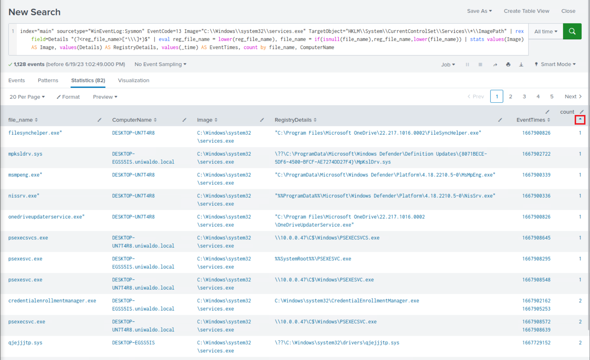

import RevealFlag from '@site/src/components/RevealFlag';

# Detecting Attacker Behavior With Splunk Based On TTPs

---

In the ever-evolving world of cybersecurity, proficient threat detection is crucial. This necessitates a thorough understanding of the myriad `tactics`, `techniques`, and `procedures` (`TTPs`) utilized by potential adversaries, along with a deep insight into our own network systems and their typical behaviors. Effective threat detection often revolves around identifying patterns that either match known malicious behaviors or diverge significantly from expected norms.

In crafting detection-related SPL (Search Processing Language) searches in Splunk, we utilize two main approaches:

- The first approach is grounded in known adversary `TTPs`, leveraging our extensive knowledge of specific threats and attack vectors. This strategy is akin to playing a game of `spot the known`. If an entity behaves in a way that we recognize as characteristic of a particular threat, it draws our attention.

- The second approach, `while still informed by an understanding of attacker TTPs`, leans heavily on statistical analysis and anomaly detection to identify abnormal behavior within the sea of normal activity. This strategy is more of a game of `spot the unusual`. Here, we're not just relying on pre-existing knowledge of specific threats. Instead, we make extensive use of mathematical and statistical techniques to highlight anomalies, working on the premise that malicious activity will often manifest as an aberration from the norm.

Together, these approaches give us a comprehensive toolkit for identifying and responding to a wide spectrum of cybersecurity threats. Each methodology offers unique advantages and, when used in tandem, they create a robust detection mechanism, one that is capable of identifying known threats while also surfacing potential unknown risks.

Additionally, in both approaches, `the key is to understand our data and environment, then carefully tune our queries and thresholds to balance the need for accurate detection with the desire to avoid false positives`. Through continuous review and revision of our SPL queries, we can maintain a high level of security posture and readiness.

Now, let's delve deeper into these two approaches.

:::info[Note]
Please be aware that the upcoming sections do not pertain to detection engineering. The emphasis in these sections is on comprehending the two distinct approaches for constructing searches, rather than the actual process of analyzing an attack, identifying relevant log sources, and formulating searches. Furthermore, the provided searches are not finely tuned. As previously mentioned, fine-tuning necessitates a deep comprehension of the environment and its normal activity.
:::

---

## Crafting SPL Searches Based On Known TTPs

As mentioned above, the first approach revolves around a comprehensive understanding of known attacker behavior and TTPs. With this strategy, our focus is on recognizing patterns that we've seen before, which are indicative of specific threats or attack vectors.

Below are some detection examples that follow this approach.

---

### 1. Example: Detection Of Reconnaissance Activities Leveraging Native Windows Binaries

Attackers often leverage native Windows binaries (such as `net.exe`) to gain insights into the target environment, identify potential privilege escalation opportunities, and perform lateral movement. [Sysmon Event ID 1](Attackers often leverage native Windows binaries (such as net.exe) to gain insights into the target environment, identify potential privilege escalation opportunities, and perform lateral movement. Sysmon Event ID 1 can assist in identifying such behavior.) can assist in identifying such behavior.

```sql
index="main" sourcetype="WinEventLog:Sysmon" EventCode=1 Image=*\\ipconfig.exe OR Image=*\\net.exe OR Image=*\\whoami.exe OR Image=*\\netstat.exe OR Image=*\\nbtstat.exe OR Image=*\\hostname.exe OR Image=*\\tasklist.exe | stats count by Image,CommandLine | sort - count
```


Within the search results, clear indications emerge, highlighting the utilization of native Windows binaries for reconnaissance purposes.

---

### 2. Example: Detection Of Requesting Malicious Payloads/Tools Hosted On Reputable/Whitelisted Domains (Such As `githubusercontent.com`)

Attackers frequently exploit the use of `githubusercontent.com` as a hosting platform for their payloads. This is due to the common whitelisting and permissibility of the domain by company proxies. [Sysmon Event ID 22](https://www.ultimatewindowssecurity.com/securitylog/encyclopedia/event.aspx?eventid=90022) can assist in identifying such behavior.

```sql
index="main" sourcetype="WinEventLog:Sysmon" EventCode=22  QueryName="*github*" | stats count by Image, QueryName
```


> Within the search results, clear indications emerge, highlighting the utilization of `githubusercontent.com` for **payload/tool-hosting** purposes.

---

### 3. Example: Detection Of `PsExec` Usage

[PsExec](https://learn.microsoft.com/en-us/sysinternals/downloads/psexec), a part of the [Windows Sysinternals](https://learn.microsoft.com/en-us/sysinternals/) suite, was initially conceived as a utility to aid system administrators in managing remote Windows systems. **It offers the convenience of connecting to** and **interacting with remote systems via a command-line interface**, and it's available to members of a computer’s Local Administrator group.

The very features that make `PsExec` a powerful tool for system administrators also make it an attractive option for malicious actors. Several `MITRE ATT&CK` techniques, including [T1569.002 (System Services: Service Execution)](https://attack.mitre.org/techniques/T1569/002/), [T1021.002 (Remote Services: SMB/Windows Admin Shares)(https://attack.mitre.org/techniques/T1021/002/)], and [T1570 (Lateral Tool Transfer)](https://attack.mitre.org/techniques/T1570/), have seen `PsExec` in play.

Despite its simple facade, `PsExec` packs a potent punch. It works by copying a service executable to the hidden `Admin$` share. Subsequently, it taps into the `Windows Service Control Manager API` to jump-start the service. The **service uses named pipes** to **link back to the `PsExec` tool**. A major highlight is that `PsExec` can be deployed on both **local** and **remote machines**, and it can enable a user to act under the `NT AUTHORITY\SYSTEM` **account**. By studying [https://www.synacktiv.com/publications/traces-of-windows-remote-command-execution](https://www.synacktiv.com/publications/traces-of-windows-remote-command-execution) and [https://hurricanelabs.com/splunk-tutorials/splunking-with-sysmon-part-3-detecting-psexec-in-your-environment/](https://hurricanelabs.com/splunk-tutorials/splunking-with-sysmon-part-3-detecting-psexec-in-your-environment/) we deduce that [Sysmon Event ID 13](https://www.ultimatewindowssecurity.com/securitylog/encyclopedia/event.aspx?eventid=90013), [Sysmon Event ID 11](https://www.ultimatewindowssecurity.com/securitylog/encyclopedia/event.aspx?eventid=90011), and [Sysmon Event ID 17](https://www.ultimatewindowssecurity.com/securitylog/encyclopedia/event.aspx?eventid=90017) or [Sysmon Event ID 18](https://www.ultimatewindowssecurity.com/securitylog/encyclopedia/event.aspx?eventid=90018) can assist in identifying usage of `PsExec`.

#### Case 1: Leveraging [Sysmon Event ID 13](https://www.ultimatewindowssecurity.com/securitylog/encyclopedia/event.aspx?eventid=90013)

```sql
index="main" sourcetype="WinEventLog:Sysmon" EventCode=13 Image="C:\\Windows\\system32\\services.exe" TargetObject="HKLM\\System\\CurrentControlSet\\Services\\*\\ImagePath" | rex field=Details "(?<reg_file_name>[^\\\]+)$" | eval reg_file_name = lower(reg_file_name), file_name = if(isnull(file_name),reg_file_name,lower(file_name)) | stats values(Image) AS Image, values(Details) AS RegistryDetails, values(_time) AS EventTimes, count by file_name, ComputerName
```

**Let's break down each part of this query**

- `index="main" sourcetype="WinEventLog:Sysmon" EventCode=13 Image="C:\\Windows\\system32\\services.exe" TargetObject="HKLM\\System\\CurrentControlSet\\Services\\*\\ImagePath"`  
This part of the query is selecting logs from the `main` index with the sourcetype of `WinEventLog:Sysmon`. We're specifically looking for events with `EventCode=13`. In Sysmon logs, `EventCode 13` represents an event where a registry value was set. The `Image` field is set to `C:\\Windows\\system32\\services.exe` to filter for events where the services.exe process was involved, which is the Windows process responsible for handling service creation and management. The `TargetObject` field specifies the registry keys that we're interested in. In this case, we're looking for changes to the `ImagePath` value under any service key in `HKLM\\System\\CurrentControlSet\\Services`. The `ImagePath` registry value of a service specifies the path to the executable file for the service.

- `| rex field=Details "(?<reg_file_name>[^\\\]+)$"`  
The `rex` command here is extracting the file name from the `Details` field using a regular expression. The pattern `[^\\\]+)$` captures the part of the path after the last backslash, which is typically the file name. This value is stored in a new field `reg_file_name`.

- `| eval file_name = if(isnull(file_name),reg_file_name,(file_name))`  
This `eval` command checks if the `file_name` field is `null`. If it is, it sets `file_name` to the value of `reg_file_name` (the file name we extracted from the `Details` field). If `file_name` is not null, it remains the same.

- `| stats values(Image), values(Details), values(TargetObject), values(_time), values(EventCode), count by file_name, ComputerName`  
Finally, the `stats` command aggregates the data by `file_name` and `ComputerName`. For each unique combination of file_name and ComputerName, it collects all the unique values of `Image`, `Details`, `TargetObject`, and `_time`, and counts the number of events.

In summary, this query is looking for instances where the `services.exe` process has modified the `ImagePath` value of any service. The output will include the details of these modifications, including the name of the modified service, the new ImagePath value, and the time of the modification.



Among the `less frequent` search results, it is evident that there are indications of execution resembling `PsExec`.

---

#### Case 2: Leveraging [Sysmon Event ID 11](https://www.ultimatewindowssecurity.com/securitylog/encyclopedia/event.aspx?eventid=90011)

```sql
index="main" sourcetype="WinEventLog:Sysmon" EventCode=11 Image=System | stats count by TargetFilename
```


> Again, among the `less frequent` search results, it is evident that there are indications of execution resembling `PsExec`.

#### Case 3: Leveraging [Sysmon Event ID 18](https://www.ultimatewindowssecurity.com/securitylog/encyclopedia/event.aspx?eventid=90018)

```sql
index="main" sourcetype="WinEventLog:Sysmon" EventCode=18 Image=System | stats count by PipeName
```


> This time, the results are more manageable to review and they continue to suggest an execution pattern resembling `PsExec`.

---

### 4. Example: Detection Of Utilizing Archive Files For Transferring Tools Or Data Exfiltration

Attackers may employ `zip`, `rar`, or `7z` files for transferring tools to a compromised host or exfiltrating data from it. The following search examines the creation of `zip`, `rar`, or `7z` files, with results sorted in descending order based on count.

```sql
index="main" EventCode=11 (TargetFilename="*.zip" OR TargetFilename="*.rar" OR TargetFilename="*.7z") | stats count by ComputerName, User, TargetFilename | sort - count
```


> Within the search results, clear indications emerge, highlighting the usage of archive files for tool-transferring and/or data exfiltration purposes.

---

### 5. Example: Detection Of Utilizing PowerShell or MS Edge For Downloading Payloads/Tools

Attackers may exploit PowerShell to download additional payloads and tools, or deceive users into downloading malware via web browsers. The following SPL searches examine files downloaded through PowerShell or MS Edge.

```sql
index="main" sourcetype="WinEventLog:Sysmon" EventCode=11 Image="*powershell.exe*" |  stats count by Image, TargetFilename |  sort + count
```


```sql
index="main" sourcetype="WinEventLog:Sysmon" EventCode=11 Image="*msedge.exe" TargetFilename=*"Zone.Identifier" |  stats count by TargetFilename |  sort + count
```

The `*Zone.Identifier` is indicative of a file downloaded from the internet or another potentially untrustworthy source. Windows uses this zone identifier to track the security zones of a file. The `Zone.Identifier` is an ADS (Alternate Data Stream) that contains metadata about where the file was downloaded from and its security settings.


> Within both search results, clear indications emerge, highlighting the usage of PowerShell and MS edge for payload/tool-downloading purposes.

---

### 6. Example: Detection Of Execution From Atypical Or Suspicious Locations

The following SPL search is designed to identify any process creation (`EventCode=1`) occurring in a user's `Downloads` folder.

```sql
index="main" EventCode=1 | regex Image="C:\\\\Users\\\\.*\\\\Downloads\\\\.*" |  stats count by Image
```


> Within the l`ess frequent` search results, clear indications emerge, highlighting execution from a user's `Downloads` folder.

---

### 7. Example: Detection Of Executables or DLLs Being Created Outside The Windows Directory

The following SPL identifies potential malware activity by checking for the creation of executable and DLL files outside the Windows directory. It then groups and counts these activities by user and target filename.

```sql
index="main" EventCode=11 (TargetFilename="*.exe" OR TargetFilename="*.dll") TargetFilename!="*\\windows\\*" | stats count by User, TargetFilename | sort + count
```


 > Within the `less frequent` search results, clear indications emerge, highlighting the creation of executables outside the Windows directory.

---

### 8. Example: Detection Of Misspelling Legitimate Binaries

Attackers often disguise their malicious binaries by intentionally misspelling legitimate ones to blend in and avoid detection. The purpose of the following SPL search is to detect potential misspellings of the legitimate `PSEXESVC.exe` binary, commonly used by `PsExec`. By examining the `Image`, `ParentImage`, `CommandLine` and `ParentCommandLine` fields, the search aims to identify instances where variations of `psexe` are used, potentially indicating the presence of malicious binaries attempting to masquerade as the legitimate PsExec service binary.

```sql
index="main" sourcetype="WinEventLog:Sysmon" EventCode=1 (CommandLine="*psexe*.exe" NOT (CommandLine="*PSEXESVC.exe" OR CommandLine="*PsExec64.exe")) OR (ParentCommandLine="*psexe*.exe" NOT (ParentCommandLine="*PSEXESVC.exe" OR ParentCommandLine="*PsExec64.exe")) OR (ParentImage="*psexe*.exe" NOT (ParentImage="*PSEXESVC.exe" OR ParentImage="*PsExec64.exe")) OR (Image="*psexe*.exe" NOT (Image="*PSEXESVC.exe" OR Image="*PsExec64.exe")) |  table Image, CommandLine, ParentImage, ParentCommandLine
```


> Within the search results, clear indications emerge, highlighting the misspelling of `PSEXESVC.exe` for evasion purposes.

---

### 9. Example: Detection Of Using Non-standard Ports For Communications/Transfers

Attackers often utilize non-standard ports during their operations. The following SPL search detects suspicious network connections to non-standard ports by excluding standard web and file transfer ports (`80`, `443`, `22`, `21`). The `stats` command aggregates these connections, and they are sorted in descending order by `count`.

```sql
index="main" EventCode=3 NOT (DestinationPort=80 OR DestinationPort=443 OR DestinationPort=22 OR DestinationPort=21) | stats count by SourceIp, DestinationIp, DestinationPort | sort - count
```


> Within the search results, clear indications emerge, highlighting the usage of non-standard ports communication or tool-transferring purposes.

:::info[Note]
It should be apparent by now that with a **comprehensive understanding of attacker** `tactics`, `techniques`, and `procedures` (`TTPs`), we could have detected the compromise of our environment more swiftly. However, it is essential to note that **crafting searches solely based on attacker TTPs** is **insufficient** as **adversaries continuously evolve** and **employ obscure** or **unknown TTPs** to avoid detection.
:::

---

## Practical Exercises

### `1. Navigate to http://[Target IP]:8000, open the "Search & Reporting" application, and find through SPL searches against all data the password utilized during the PsExec activity. Enter it as your answer.`

<RevealFlag>{`Password@123`}</RevealFlag>

```sql
index=* (psexec OR "PsExec") (CommandLine="*-p *" OR CommandLine="*/p *")
| rex field=CommandLine "(?:-|/)p\s+(?<password>[^\s\"]+)"
| table _time host user CommandLine password
```
