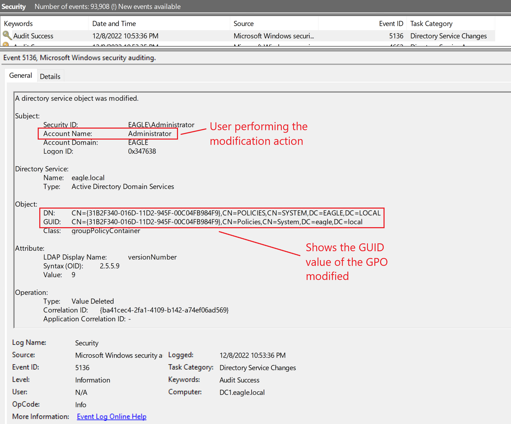
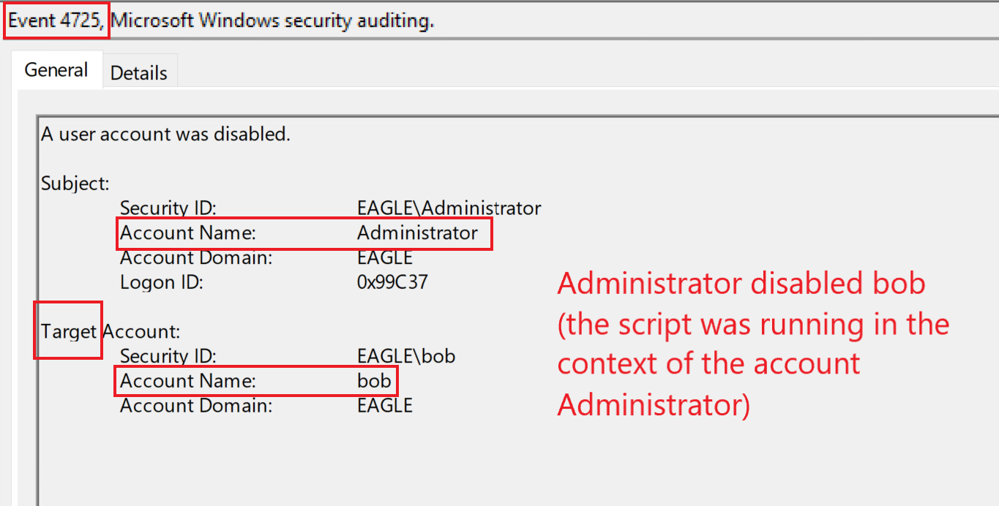
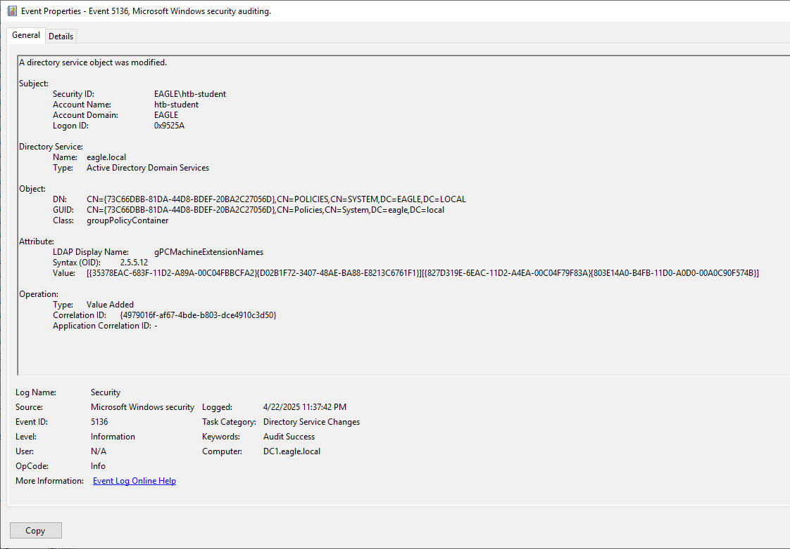

import RevealFlag from '@site/src/components/RevealFlag';

# GPO Permissions / GPO Files

## Description

A [Group Policy Object (GPO)](https://learn.microsoft.com/en-us/previous-versions/windows/desktop/policy/group-policy-objects) is a virtual collection of policy settings that has a unique name. `GPOs` are the most widely used configuration management tool in Active Directory. Each GPO contains a collection of zero or more policy settings. They are linked to an `Organizational Unit` in the AD structure for their settings to be applied to objects that reside in the OU or any child OU of the one to which the GPO is linked. **GPOs can be restricted to which objects they apply by specifying**, for example, `an AD group` *(by default, it applies to Authenticated Users)* or a `WMI filter` *(e.g., apply only to Windows 10 machines)*.

When we create a new GPO, only Domain admins (and similar privileged roles) can modify it. However, within environments, we will encounter different delegations that allow less privileged accounts to perform edits on the GPOs; this is where the problem lies. Many organizations have GPOs that can modify 'Authenticated Users' or 'Domain Users', which entails that any compromised user will allow the attacker to alter these GPOs. Modifications can include additions of start-up scripts or a scheduled task to execute a file, for example. This access will allow an adversary to compromise all computer objects in the OUs that the vulnerable GPOs are linked to.

Similarly, administrators perform software installation via GPOs or configure start-up scripts located on network shares. If the network share is misconfigured, an adversary may be able to replace the file to be executed by the system with a malicious one. The GPO may have no misconfigurations in these scenarios, just misconfigured NTFS permissions on the files deployed.

---

## Attack

No attack walkthrough is available here - it is a simple GPO edit or file replacement.

---

## Prevention

One way to prevent this attack is to **lock down the GPO permissions** to be modified **by a particular group of users only** or **by a specific account**, as this will `significantly limit the ability of who can edit the GPO` or `change its permissions` *(as opposed to everybody in Domain admins, which in some organizations can easily be more than 50)*. Similarly, `never deploy files stored in network locations` **so that many users can modify the share permissions**.

We should also **review the permissions of GPOs actively** and **regularly**, with the option of `automating a task that runs hourly` and `alerts if any deviations from the expected permissions are detected`.

---

## Detection

Fortunately, it is straightforward to **detect when a GPO is modified**. If `Directory Service Changes auditing` is `enabled`, then the [event ID 5136](https://www.ultimatewindowssecurity.com/securitylog/encyclopedia/event.aspx?eventid=5136) will be generated:



From a defensive point of view, if a user who is `not` expected **to have the right to modify a GPO** suddenly appears here, then a red flag should be raised.

---

## Honeypot 🍯

A common thought is that **because of the easy detection methods of these attacks**, it is worth having a `misconfigured GPO` in the environment for threat agents to abuse; this is also true for a deployed file as they can be continuously monitored for any change to the file (e.g., constantly checking if the hash value of the file has not changed). However, implementing these techniques is only recommended if an organization is mature and proactive in responding to high/critical vulnerabilities; this is because if, in the future, an escalation path is discovered via some GPO modification, unless it is possible to mitigate it in real-time, the `trap` backfires to become the weakest point.

However, when implementing a honeypot using `a misconfigured GPO`, consider the following:

- GPO is linked to non-critical servers only.

- Continuous `automation is in place for monitoring modifications of GPO`. If the GPO file is modified, **we will disable the user performing the modification immediately**.

- The `GPO should be automatically unlinked from all locations` if a modification is detected.

Consider the following script to demonstrate how PowerShell can automate this. In our case, the honeypot **GPO is identified by a** `GUID value`, and the action desired is `to disable the account(s) associated with this change`. The reason for potentially multiple accounts is that we will `execute the script every 15 minutes as a scheduled task`. So, **if numerous compromised users were used to modify the GPO in this time frame**, we will `disable them all instantly`. The script has a commented-out section that can be used for sending an email as an alert, but for a PoC, we will display the output on the command line:

```powershell
# Set time window for last 15 minutes
$startTime = (Get-Date).AddMinutes(-15)

# Define honeypot GPO ID
$honeypotGpoID = "73C66DBB-81DA-44D8-BDEF-20BA2C27056D"
$gpoPathPattern = "CN={$honeypotGpoID},CN=POLICIES,CN=SYSTEM,DC=EAGLE,DC=LOCAL"

# Initialize email body and log array
$emailBody = "⚠ Honeypot GPO '$honeypotGpoID' was modified in the last 15 minutes.`r`n"
$logEntries = @()
$disabledUsers = @()

# Get GPO modification events
$events = Get-WinEvent -FilterHashtable @{
    LogName   = 'Security'
    ID        = 5136
    StartTime = $startTime
} -ErrorAction SilentlyContinue | Where-Object {
    $_.Properties[8].Value -match $gpoPathPattern
}

if ($events -and $events.Count -gt 0) {
    foreach ($event in $events) {
        $username = $event.Properties[3].Value
        try {
            $user = Get-ADUser -Identity $username -Properties Enabled -ErrorAction Stop
            if ($user.Enabled -and ($username -notin $disabledUsers)) {
                Disable-ADAccount -Identity $username -Confirm:$false
                $emailBody += "🔒 Disabled user: $username`r`n"
                $logEntries += "[$(Get-Date -Format 'yyyy-MM-dd HH:mm:ss')] Disabled: $username"
                $disabledUsers += $username
            }
        } catch {
            $emailBody += "⚠ Error processing user '$username': $_`r`n"
            $logEntries += "[$(Get-Date -Format 'yyyy-MM-dd HH:mm:ss')] Error for $username: $_"
        }
    }

    # Optional: Send email alert (currently commented out)
    <#
    Send-MailMessage -To "soc-team@yourcompany.com" `
                     -From "alert@yourdomain.local" `
                     -Subject "🚨 Honeypot GPO Alert: $honeypotGpoID" `
                     -SmtpServer "mail.yourdomain.local" `
                     -Body $emailBody `
                     -BodyAsHtml:$false
    #>

    # Write to local log
    $logFile = "C:\Scripts\Logs\Honeypot-GPO-Alert.log"
    if (!(Test-Path $logFile)) {
        New-Item -ItemType File -Path $logFile -Force | Out-Null
    }
    $logEntries | Out-File -Append -FilePath $logFile -Encoding UTF8
}

# Output to console
$emailBody
```

We will see the following output (or email body if configured) if the script detects that the honeypot GPO was modified:

```powershell
⚠ Honeypot GPO '73C66DBB-81DA-44D8-BDEF-20BA2C27056D' was modified in the last 15 minutes.
🔒 Disabled user: eagle.local\bob
```

> As we can see above, the user `bob` was detected modifying our honeypot GPO and is, therefore, disabled. Disabling the user will then create an [event with ID 4725](https://www.ultimatewindowssecurity.com/securitylog/encyclopedia/event.aspx?eventid=4725):



---

## Questions

### `1. From WS001 RDP again into DC1 (172.16.18.3) as 'htb-student:HTB_@cademy_stdnt!' and abuse GPO directly. Once completed type DONE as the answer`

<RevealFlag>{`0x80`}</RevealFlag>



---

#### ✅ Key Fields in Event 5136

Property Index | Field Name | What it shows
---------------|------------|--------------------------------
0 | Subject Security ID | Who made the change
1 | Subject Account Name | User who changed it
2 | Subject Domain Name | Domain
3 | Subject Logon ID | Session ID
4 | Directory Service Name | Active Directory Domain Services
5 | Object DN | Distinguished Name of the object modified (like a GPO DN)
6 | Object Class | Type of object (groupPolicyContainer, etc.)
7 | Attribute Modified | Name of the changed attribute (🔍 important)
8 | Attribute Value | The new value (or pointer to it, depending on the attribute)

---

#### 🔐 Bonus: Map CSE GUIDs

CSE Name | GUID
---------|--------
Registry | `{35378EAC-683F-11D2-A89A-00C04FBBCFA2}`
Security Settings | `{827D319E-6EAC-11D2-A4EA-00C04F79F83A}`
Software Installation | `{803E14A0-B4FB-11D0-A0D0-00A0C90F574B}`
Scripts Extension | `{D02B1F72-3407-48AE-BA88-E8213C6761F1}`