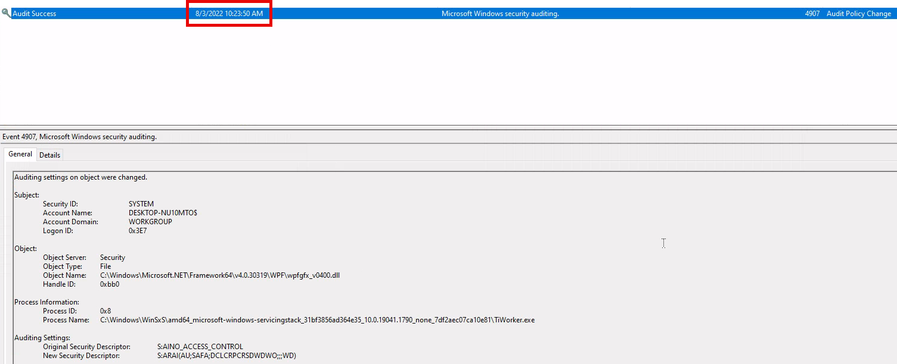

import Link from '@docusaurus/Link';

# 3. Windows Event Logs

**Windows Event Logging Basics**  
`Windows Event Logs` are an intrinsic part of the Windows Operating System, storing logs from different components of the system including the system itself, applications running on it, ETW providers, services, and others.

Windows event logging offers comprehensive logging capabilities for application errors, security events, and diagnostic information. As cybersecurity professionals, we leverage these logs extensively for analysis and intrusion detection.

The logs are categorized into different event logs, such as "**Application**", "**System**", "**Security**", and others, to organize events based on their source or purpose.

Event logs can be accessed using the **Event Viewer** application or programmatically using **APIs** such as the `Windows Event Log API`.

Accessing the **Windows Event Viewer** as an administrative user allows us to explore the various logs available.


The default Windows event logs consist of `Application`, `Security`, `Setup`, `System`, and `Forwarded Events`. While the first four logs cover application errors, security events, system setup activities, and general system information, the "Forwarded Events" section is unique, showcasing event log data forwarded from other machines. This central logging feature proves valuable for system administrators who desire a consolidated view. In our current analysis, we focus on event logs from a single machine.

It should be noted, that the Windows Event Viewer has the ability to open and display previously saved `.evtx` files, which can be then found in the "**Saved Logs**" section.


## The Anatomy of an Event Log

When examining `Application` logs, we encounter two distinct levels of events: `information` and `error`.


**Information events** provide general usage details about the application, such as its start or stop events.  
Conversely, **error events** highlight specific errors and often offer detailed insights into the encountered issues.


Each entry in the Windows Event Log is an "Event" and contains the following primary components:

1. `Log Name`  
The name of the event log (e.g., Application, System, Security, etc.).

2. `Source`  
The software that logged the event.

3. `Event ID`  
A unique identifier for the event.

4. `Task Category`  
This often contains a value or name that can help us understand the purpose or use of the event.

5. `Level`  
The severity of the event (Information, Warning, Error, Critical, and Verbose).

6. `Keywords`  
Keywords are flags that allow us to categorize events in ways beyond the other classification options. These are generally broad categories, such as "Audit Success" or "Audit Failure" in the Security log.

7. `User`  
The user account that was logged on when the event occurred.

8. `OpCode`  
This field can identify the specific operation that the event reports.

9. `Logged`  
The date and time when the event was logged.

10. `Computer`  
The name of the computer where the event occurred.

11. `XML Data`  
All the above information is also included in an XML format along with additional event data.

:::tip
The `Keywords` field is particularly useful when filtering event logs for specific types of events. It can significantly enhance the precision of search queries by allowing us to specify events of interest, thus making log management more efficient and effective.
:::

Taking a closer look at the event log above, we observe several crucial elements. The `Event ID` in the top left corner serves as a unique identifier, which can be further researched on Microsoft's website to gather additional information. The "**SideBySide**" label next to the event ID represents the event source. Below, we find the general error description, often containing rich details. By clicking on the **details**, we can further analyze the event's impact using XML or a well-formatted view.


Additionally, we can extract supplementary information from the event log, such as the **process ID** where the error occurred, enabling more precise analysis.


Switching our focus to security logs, let's consider event `ID 4624`, a commonly occurring event [(detailed at Microsoft)](https://docs.microsoft.com/en-us/windows/security/threat-protection/auditing/event-4624).


According to Microsoft's documentation, this event signifies the **creation of a logon session** on the destination machine, originating from the accessed computer where the session was established. Within this log, we find crucial details, including the "`Logon ID`", which allows us to correlate this logon with other events sharing the same "`Logon ID`". Another important detail is the "`Logon Type`", indicating the type of logon. In this case, it specifies a **Service logon type**, suggesting that "`SYSTEM`" initiated a new service. However, further investigation is required to determine the specific service involved, utilizing correlation techniques with additional data like the "Logon ID".

:::tip[Mnemonic: T.I.L.C.]

- **T**: **Type** – Identify the logon type (e.g., Service Logon).
- **I**: **ID** – Note the Event ID and the Logon ID.
- **L**: **Link** – Correlate events by matching the same Logon ID.
- **C**: **Context** – Understand the user/process context (e.g., SYSTEM starting a service).

:::

<details>
<summary>Example Usage</summary>

1. **Type** – Check if the logon indicates an interactive session, remote session, or service logon.
2. **ID** – Confirm the Event ID (4624) and capture the Logon ID.
3. **Link** – Look for other events sharing the same Logon ID to see what happened next.
4. **Context** – Determine who or what triggered the event (e.g., SYSTEM) and which service or process was involved.

</details>

## Leveraging Custom XML Queries

To streamline our analysis, we can create custom XML queries to identify related events using the "`Logon ID`" as a starting point. By navigating to "`Filter Current Log" -> "XML" -> "Edit Query Manually`" we gain access to a custom XML query language that enables more granular log searches.


In the example query, we focus on events containing the "`SubjectLogonId`" field with a value of "`0x3E7`". The selection of this value stems from the **need to correlate events associated with a specific "Logon ID"** and understand the relevant details within those events.


It is worth noting that if assistance is required in crafting the query, automatic filters can be enabled, allowing exploration of their impact on the XML representation. For further guidance, Microsoft offers informative articles on [advanced XML filtering in the Windows Event Viewer.](https://techcommunity.microsoft.com/t5/ask-the-directory-services-team/advanced-xml-filtering-in-the-windows-event-viewer/ba-p/399761)

By constructing such queries, we can narrow down our focus to the account responsible for initiating the service and eliminate unnecessary details. This approach helps unveil a clearer picture of recent logon activities associated with the specified Logon ID. However, even with this refinement, the amount of data remains significant.

Delving into the log details progressively reveals a narrative. For instance, the analysis begins with [Event ID 4907](https://docs.microsoft.com/en-us/windows/security/threat-protection/auditing/event-4907), which signifies an **audit policy change**.


Within the [event description](https://learn.microsoft.com/en-us/windows/security/threat-protection/auditing/event-4907), we find valuable insights, such as "**This event generates when the SACL of an object (for example, a registry key or file)** was changed."

In case unfamiliar with SACL, referring to the [provided link](https://docs.microsoft.com/en-us/windows/win32/secauthz/access-control-lists) sheds light on access control lists (ACLs). The "`S`" in `SACL` denotes a `system access control list`, which enables administrators to log access attempts to secure objects. Each `Access Control Entry (ACE)` within a `SACL` specifies the types of access attempts by a designated trustee that trigger record generation in the security event log. `ACEs` in a `SACL` can generate **audit records upon failed**, **successful**, or **both types of access** attempts. For more information about SACLs, see [Audit Generation](https://learn.microsoft.com/en-us/windows/win32/secauthz/audit-generation) and [SACL Access Right](https://learn.microsoft.com/en-us/windows/win32/secauthz/sacl-access-right)."

Based on this information, it becomes apparent that the permissions of a file were altered to modify the logging or auditing of access attempts. Further exploration of the event details reveals additional intriguing aspects.


For example, the process responsible for the change is identified as "`SetupHost.exe`", indicating a potential setup process (although it's worth noting that malware can sometimes masquerade under legitimate names). The object name impacted appears to be the "`bootmanager`", and we can examine the new and old security descriptors ("`NewSd`" and "`OldSd`") to identify the changes. Understanding the meaning of each field in the security descriptor can be accomplished through references such as the article [ACE Strings](https://docs.microsoft.com/en-us/windows/win32/secauthz/ace-strings?redirectedfrom=MSDN) and [Understanding SDDL Syntax](https://itconnect.uw.edu/wares/msinf/other-help/understanding-sddl-syntax/).

From the observed events, we can infer that a setup process occurred, involving **the creation of a new file** and **the initial configuration of security permissions for auditing purposes**. Subsequently, we encounter the logon event, followed by a "`special logon`" event.


Analyzing **the special logon event**, we gain insights into `token permissions granted to the user` upon a successful logon.


A comprehensive list of privileges can be found in the documentation on [privilege constants](https://docs.microsoft.com/en-us/windows/win32/secauthz/privilege-constants). For instance, the "`SeDebugPrivilege`" privilege indicates that the user possesses the ability to tamper with memory that does not belong to them.

## Useful Windows Event Logs

1. **Windows System Logs**

    - [Event ID 1074](https://serverfault.com/questions/885601/windows-event-codes-for-startup-shutdown-lock-unlock) (`System Shutdown/Restart`): This event log indicates when and why the system was shut down or restarted. By monitoring these events, you can determine if there are unexpected shutdowns or restarts, potentially revealing malicious activity such as malware infection or unauthorized user access.

    - [Event ID 6005](https://superuser.com/questions/1137371/how-to-find-out-if-windows-was-running-at-a-given-time) (`The Event log service was started`): This event log marks the time when the Event Log Service was started. This is an important record, as it can signify a system boot-up, providing a starting point for investigating system performance or potential security incidents around that period. It can also be used to detect unauthorized system reboots.

    - [Event ID 6006](https://learn.microsoft.com/en-us/answers/questions/235563/server-issue) (`The Event log service was stopped`): This event log signifies the moment when the Event Log Service was stopped. It is typically seen when the system is shutting down. Abnormal or unexpected occurrences of this event could point to intentional service disruption for covering illicit activities.

    - [Event ID 6013](https://serverfault.com/questions/885601/windows-event-codes-for-startup-shutdown-lock-unlock) (`Windows uptime`): This event occurs once a day and shows the uptime of the system in seconds. A shorter than expected uptime could mean the system has been rebooted, which could signify a potential intrusion or unauthorized activities on the system.

    - [Event ID 7040](https://www.slideshare.net/Hackerhurricane/finding-attacks-with-these-6-events) (`Service status change`): This event indicates a change in service startup type, which could be from manual to automatic or vice versa. If a crucial service's startup type is changed, it could be a sign of system tampering.

2. **Windows Security Logs**

    - [Event ID 1102](https://www.ultimatewindowssecurity.com/securitylog/encyclopedia/event.aspx?eventid=1102) (`The audit log was cleared`): Clearing the audit log is often a sign of an attempt to remove evidence of an intrusion or malicious activity.

    - [Event ID 1116](https://learn.microsoft.com/en-us/microsoft-365/security/defender-endpoint/troubleshoot-microsoft-defender-antivirus?view=o365-worldwide) (`Antivirus malware detection`): This event is particularly important because it logs when Defender detects a malware. A surge in these events could indicate a targeted attack or widespread malware infection.

    - [Event ID 1118](https://learn.microsoft.com/en-us/microsoft-365/security/defender-endpoint/troubleshoot-microsoft-defender-antivirus?view=o365-worldwide) (`Antivirus remediation activity has started`): This event signifies that Defender has begun the process of removing or quarantining detected malware. It's important to monitor these events to ensure that remediation activities are successful.

    - [Event ID 1119](https://learn.microsoft.com/en-us/microsoft-365/security/defender-endpoint/troubleshoot-microsoft-defender-antivirus?view=o365-worldwide) (`Antivirus remediation activity has succeeded`): This event signifies that the remediation process for detected malware has been successful. Regular monitoring of these events will help ensure that identified threats are effectively neutralized.

    - [Event ID 1120](https://learn.microsoft.com/en-us/microsoft-365/security/defender-endpoint/troubleshoot-microsoft-defender-antivirus?view=o365-worldwide) (`Antivirus remediation activity has failed`): This event is the counterpart to 1119 and indicates that the remediation process has failed. These events should be closely monitored and addressed immediately to ensure threats are effectively neutralized.

    - [Event ID 4624](https://www.ultimatewindowssecurity.com/securitylog/encyclopedia/event.aspx?eventid=4624) (`Successful Logon`): This event records successful logon events. This information is vital for establishing normal user behavior. Abnormal behavior, such as logon attempts at odd hours or from different locations, could signify a potential security threat.

    - [Event ID 4625](https://www.ultimatewindowssecurity.com/securitylog/encyclopedia/event.aspx?eventid=4625) (`Failed Logon`): This event logs failed logon attempts. Multiple failed logon attempts could signify a brute-force attack in progress.

    - [Event ID 4648](https://www.ultimatewindowssecurity.com/securitylog/encyclopedia/event.aspx?eventid=4648) (`A logon was attempted using explicit credentials`): This event is triggered when a user logs on with explicit credentials to run a program. Anomalies in these logon events could indicate lateral movement within a network, which is a common technique used by attackers.

    - [Event ID 4656](https://www.ultimatewindowssecurity.com/securitylog/encyclopedia/event.aspx?eventid=4656) (`A handle to an object was requested`): This event is triggered when a handle to an object (like a file, registry key, or process) is requested. This can be a useful event for detecting attempts to access sensitive resources.

    - [Event ID 4672](https://www.ultimatewindowssecurity.com/securitylog/encyclopedia/event.aspx?eventid=4672) (`Special Privileges Assigned to a New Logon`): This event is logged whenever an account logs on with super user privileges. Tracking these events helps to ensure that super user privileges are not being abused or used maliciously.

    - [Event ID 4698](https://www.ultimatewindowssecurity.com/securitylog/encyclopedia/event.aspx?eventid=4698) (`A scheduled task was created`): This event is triggered when a scheduled task is created. Monitoring this event can help you detect persistence mechanisms, as attackers often use scheduled tasks to maintain access and run malicious code.

    - [Event ID 4700](https://www.ultimatewindowssecurity.com/securitylog/encyclopedia/event.aspx?eventid=4700) & [Event ID 4701](https://www.ultimatewindowssecurity.com/securitylog/encyclopedia/event.aspx?eventid=4701) (`A scheduled task was enabled/disabled`): This records the enabling or disabling of a scheduled task. Scheduled tasks are often manipulated by attackers for persistence or to run malicious code, thus these logs can provide valuable insight into suspicious activities.

    - [Event ID 4702](https://www.ultimatewindowssecurity.com/securitylog/encyclopedia/event.aspx?eventid=4702) (`A scheduled task was updated`): Similar to 4698, this event is triggered when a scheduled task is updated. Monitoring these updates can help detect changes that may signify malicious intent.

    - [Event ID 4719](https://www.ultimatewindowssecurity.com/securitylog/encyclopedia/event.aspx?eventid=4719) (`System audit policy was changed`): This event records changes to the audit policy on a computer. It could be a sign that someone is trying to cover their tracks by turning off auditing or changing what events get audited.

    - [Event ID 4738](https://www.ultimatewindowssecurity.com/securitylog/encyclopedia/event.aspx?eventid=4738) (`A user account was changed`): This event records any changes made to user accounts, including changes to privileges, group memberships, and account settings. Unexpected account changes can be a sign of account takeover or insider threats.

    - [Event ID 4771](https://www.ultimatewindowssecurity.com/securitylog/encyclopedia/event.aspx?eventid=4771) (`Kerberos pre-authentication failed`): This event is similar to 4625 (failed logon) but specifically for Kerberos authentication. An unusual amount of these logs could indicate an attacker attempting to brute force your Kerberos service.

    - [Event ID 4776](https://www.ultimatewindowssecurity.com/securitylog/encyclopedia/event.aspx?eventid=4776) (`The domain controller attempted to validate the credentials for an account`): This event helps track both successful and failed attempts at credential validation by the domain controller. Multiple failures could suggest a brute-force attack.

    - [Event ID 5001](https://learn.microsoft.com/en-us/microsoft-365/security/defender-endpoint/troubleshoot-microsoft-defender-antivirus?view=o365-worldwide) (`Antivirus real-time protection configuration has changed`): This event indicates that the real-time protection settings of Defender have been modified. Unauthorized changes could indicate an attempt to disable or undermine the functionality of Defender.

    - [Event ID 5140](https://www.ultimatewindowssecurity.com/securitylog/encyclopedia/event.aspx?eventid=5140) (`A network share object was accessed`): This event is logged whenever a network share is accessed. This can be critical in identifying unauthorized access to network shares.

    - [Event ID 5142](https://www.ultimatewindowssecurity.com/securitylog/encyclopedia/event.aspx?eventid=5142) (`A network share object was added`): This event signifies the creation of a new network share. Unauthorized network shares could be used to exfiltrate data or spread malware across a network.

    - [Event ID 5145](https://www.ultimatewindowssecurity.com/securitylog/encyclopedia/event.aspx?eventid=5145) (`A network share object was checked to see whether client can be granted desired access`): This event indicates that someone attempted to access a network share. Frequent checks of this sort might indicate a user or a malware trying to map out the network shares for future exploits.

    - [Event ID 5157](https://www.ultimatewindowssecurity.com/securitylog/encyclopedia/event.aspx?eventid=5157) (`The Windows Filtering Platform has blocked a connection`): This is logged when the Windows Filtering Platform blocks a connection attempt. This can be helpful for identifying malicious traffic on your network.

    - [Event ID 7045](https://www.ultimatewindowssecurity.com/securitylog/encyclopedia/event.aspx?eventid=7045) (`A service was installed in the system`): A sudden appearance of unknown services might suggest malware installation, as many types of malware install themselves as services.

Remember, **one of the key aspects of threat detection is having a good understanding of what is** "`normal`" in our environment. Anomalies that might indicate a threat in one environment could be normal behavior in another. It's crucial to tune our monitoring and alerting systems to our environment to minimize false positives and make real threats easier to spot. In addition, it's essential to have a centralized log management solution in place that can collect, parse, and alert on these events in real-time. Regularly monitoring and reviewing these logs can help in early detection and mitigation of threats. Lastly, we need to make sure **to correlate these logs with other system and security logs to get a more** `holistic view` **of the security events** in our environment.

---

# Practical Exercises

## Questions

### 1. Analyze the event with **ID 4624**, that took place on **8/3/2022 at 10:23:25**. Conduct a similar investigation as outlined in this section and provide the name of the executable responsible for the modification of the auditing settings as your answer. Answer format: T_W_____.exe

> TiWorker.exe


1. 4624 - Logon
2. 4672 - Special Logon
3. 4907 - Audit Policy Change

### 2. Build an XML query to determine if the previously mentioned executable modified the auditing settings of C:\Windows\Microsoft.NET\Framework64\v4.0.30319\WPF\wpfgfx_v0400.dll. Enter the time of the identified event in the format HH:MM:SS as your answer.

>10:23:50

**Windows Event XML Query**

```xml
<QueryList>
  <Query Id="0" Path="Security">
    <Select Path="Security">
      *[
        EventData[
          Data[@Name='ProcessName'] = 'C:\Windows\WinSxS\amd64_microsoft-windows-servicingstack_31bf3856ad364e35_10.0.19041.1790_none_7df2aec07ca10e81\TiWorker.exe'
          and
          Data[@Name='ObjectName'] = 'C:\Windows\Microsoft.NET\Framework64\v4.0.30319\WPF\wpfgfx_v0400.dll'
        ]
      ]
    </Select>
  </Query>
</QueryList>
```

