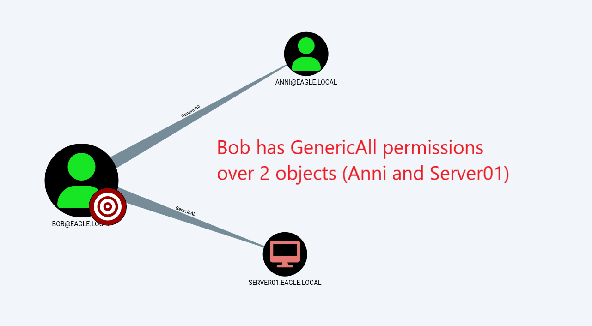

import RevealFlag from '@site/src/components/RevealFlag';

# Object ACLs

## Description

In Active Directory, [Access Control Lists (ACLs)](https://learn.microsoft.com/en-us/windows/win32/secauthz/access-control-lists) are tables, or simple lists, that define the trustees who have access to a specific object and their access type. A trustee may be any security principal, such as a user account, group, or login session. Each `access control list` has a set of `access control entries (ACE)`, and each `ACE` defines the trustee and the type of access the trustee has. Therefore, an **object can be accessed by multiple trustees** since there can be **various** `ACEs`. Access control lists are also used for auditing purposes, such as recording the number of access attempts to a securable object and the type of access. A securable object is any named object in Active Directory that contains a security descriptor, which has the security information about the object, which includes ACLs.

An example of an `Access Control Entry` is that, by default, AD gives Domain Admins the right to modify the password of every object. However, rights can also be delegated to certain users or groups that can perform a specific action on other objects; this can be password resets, modification of group membership, or deletion of objects. In large organizations, if it is virtually impossible to avoid non-privileged users ending up with delegated rights, they should eliminate human error and have well-defined process documentation. For example, suppose an employee was to (accidentally/intentionally) change their department from IT to Security Operations. In that case, the organization must have a process to revoke all rights and access to systems and applications. In real-life AD environments, we will often encounter cases such as:

- All Domain users added as Administrators to all Servers
- Everyone can modify all objects (having full rights to them).
- All Domain users have access to the computer's extended properties containing the LAPS passwords.

---

## Attack

To `identify potential abusable ACLs`, we will use [BloodHound](https://github.com/BloodHoundAD/BloodHound) to graph the relationships between the objects and [SharpHound](https://github.com/BloodHoundAD/SharpHound) to scan the environment and pass `All` to the `-c` parameter *(short version of `CollectionMethod`)*:

```powershell
PS C:\Users\bob\Downloads> .\SharpHound.exe -c All

2022-12-19T14:16:39.1749601+01:00|INFORMATION|This version of SharpHound is compatible with the 4.2 Release of BloodHound
2022-12-19T14:16:39.3312221+01:00|INFORMATION|Resolved Collection Methods: Group, LocalAdmin, GPOLocalGroup, Session, LoggedOn, Trusts, ACL, Container, RDP, ObjectProps, DCOM, SPNTargets, PSRemote
2022-12-19T14:16:39.3468314+01:00|INFORMATION|Initializing SharpHound at 14.16 on 19/12/2022
2022-12-19T14:16:39.5187113+01:00|INFORMATION|Flags: Group, LocalAdmin, GPOLocalGroup, Session, LoggedOn, Trusts, ACL, Container, RDP, ObjectProps, DCOM, SPNTargets, PSRemote
2022-12-19T14:16:39.7530826+01:00|INFORMATION|Beginning LDAP search for eagle.local
2022-12-19T14:16:39.7999574+01:00|INFORMATION|Producer has finished, closing LDAP channel
2022-12-19T14:16:39.7999574+01:00|INFORMATION|LDAP channel closed, waiting for consumers
2022-12-19T14:17:09.8937530+01:00|INFORMATION|Status: 0 objects finished (+0 0)/s -- Using 36 MB RAM
2022-12-19T14:17:28.4874698+01:00|INFORMATION|Consumers finished, closing output channel
2022-12-19T14:17:28.5343302+01:00|INFORMATION|Output channel closed, waiting for output task to complete
Closing writers
2022-12-19T14:17:28.6124768+01:00|INFORMATION|Status: 114 objects finished (+114 2.375)/s -- Using 46 MB RAM
2022-12-19T14:17:28.6124768+01:00|INFORMATION|Enumeration finished in 00:00:48.8638030
2022-12-19T14:17:28.6905842+01:00|INFORMATION|Saving cache with stats: 74 ID to type mappings.
 76 name to SID mappings.
 1 machine sid mappings.
 2 sid to domain mappings.
 0 global catalog mappings.
2022-12-19T14:17:28.6905842+01:00|INFORMATION|SharpHound Enumeration Completed at 14.17 on 19/12/2022! Happy Graphing!
```


The ZIP file generated by `SharpHound` can then be visualized in `BloodHound`. Instead of looking for every misconfigured ACL in the environment, we will focus on `potential escalation paths` that originate from the user `Bob` (our initial user, which we had already compromised and have complete control over). Therefore, the following image demonstrates the different access that `Bob` has to the environment:



`Bob` has full rights over the user `Anni` and the computer `Server01`. Below is what `Bob` can do with each of these:

1. Case  
Full rights over the user `Anni`. In this case, Bob can modify the object Anni by specifying some bonus SPN value and then perform the Kerberoast attack against it (if you recall, the success of this attack depends on the password's strength). However, Bob can also modify the password of the user Anni and then log in as that account, therefore, directly inheriting and being able to perform everything that Anni can (if Anni is a Domain admin, then Bob would have the same rights).

2. Case  
Full control over a computer object can also be fruitful. If `LAPS` is used in the environment, then Bob can obtain the password stored in the attributes and authenticate as the local Administrator account to this server. Another escalation path is abusing `Resource-Based Kerberos Delegation`, allowing Bob to authenticate as anyone to this server. Recall that from the previous attack, `Server01` is trusted for `Unconstrained delegation`, so if Bob was to get administrative rights on this server, he has a potential escalation path to compromise the identity of a Domain Controller or other sensitive computer object.

We can also use [ADACLScanner](https://github.com/canix1/ADACLScanner) to create reports of `discretionary access control lists (DACLs)` and `system access control lists (SACLs)`.

---

## Prevention

There are three things we can do

- Begin `continuous assessment` to detect if this is a problem in the AD environment.
- `Educate` employees with high privileges to avoid doing this.
- `Automate` as much as possible from the access management process, and only assign privileged access to administrative accounts; this ensures that administrators don't manually edit accounts which reduces the risk of introducing delegated rights to unprivileged users.

---

## Detection

Fortunately, we have several ways to detect if AD objects are modified. Unfortunately, the events generated for modified objects are incomplete, as they do not provide granular visibility over what was changed. For example, in the first case described above, Bob modified Anni by adding an SPN value. By doing so, Bob will have the means to perform Kerberoasting against Anni. When the SPN value gets added, an event with the [ID 4738](https://www.ultimatewindowssecurity.com/securitylog/encyclopedia/event.aspx?eventid=4738), "*A user account was changed*", is generated. However, this event `does not demonstrate` `all modified user properties`, `including the SPN`. Therefore, the event only notifies about the modification of a user but does not specify what exactly was changed (although it does have a fair amount of fields that can be useful). Below is the event that will be generated if Bob adds any bogus SPN value to Anni's User Object:


However, using this event, we can tell if a `non-privileged user performs privileged actions on another user`. If, for example, all privileged users have a naming convention that begins with "adminxxxx", then any change not associated with "adminxxxx" is suspicious. If an ACL abuse leads to a password reset, the event [ID 4724](https://www.ultimatewindowssecurity.com/securitylog/encyclopedia/event.aspx?eventid=4724) will be logged.

Similarly, if Bob were to perform the second scenario, an event with [ID 4742](https://www.ultimatewindowssecurity.com/securitylog/encyclopedia/event.aspx?eventid=4742) would be generated, which is also unfortunately limited in the information it can provide; however, it notifies about the action that the user account Bob is compromised and used maliciously. The following was the event [ID 4742](https://www.ultimatewindowssecurity.com/securitylog/encyclopedia/event.aspx?eventid=4742) generated when `Bob` modified `Server01`:


---

## 🍯 Honeypot

`Misconfigured ACLs` can be an effective mechanism of detection for suspicious behavior. There are two ways to approach this:

1. Assign `relatively high ACLs` to a user account used as a honeypot via a previously discussed technique—for example, **a user whose fake credentials are exposed in the description field**. Having ACLs assigned to the account may provoke an adversary to attempt and verify if the account's exposed password is valid as it holds high potential.

2. Have an account that `everyone` or many users can modify. This user will ideally be a honeypot user, with some activity to mimic real users. Any changes occurring on this honeypot user are malicious since there is no valid reason for anyone to perform any actions on it (except admins, that may occasionally need to reset the account's password to make the account look realistic). Therefore, any [event ID 4738](https://www.ultimatewindowssecurity.com/securitylog/encyclopedia/event.aspx?eventid=4738) associated with the honeypot user should trigger an alert. Additionally, mature organizations may immediately disable the user performing the change and initiate a forensic investigation on the source device. For the sake of completeness, if we go back to the Bob/Anni example, a change to Anni's account would be detected as follows:


---

## Questions

### `1. Repeat the example in the section and type DONE as the answer when you are finished`

<RevealFlag>{`DONE`}</RevealFlag>

```powershell
cd "C:\Users\bob\Downloads\"
"C:\Users\bob\Downloads\"
```

