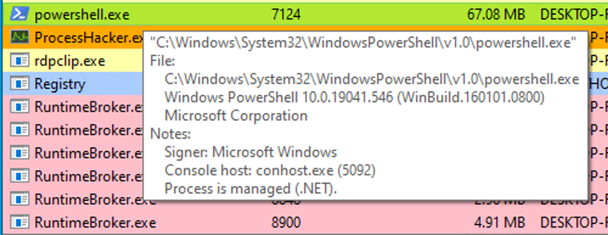

# Analyzing Evil With Sysmon & Event Logs

In our pursuit of robust cybersecurity, it is crucial to understand how to identify and analyze malicious events effectively.  
Building upon our previous exploration of benign events, we will now delve into the realm of malicious activities and discover techniques for detection.

## Sysmon Basics

When investigating malicious events, several event IDs serve as common indicators of compromise. For instance, `Event ID 4624` provides insights into new logon events, enabling us to monitor and detect suspicious user access and logon patterns. Similarly, `Event ID 4688` furnishes information about newly created processes, aiding the identification of unusual or malicious process launches. To enhance our event log coverage, we can extend the capabilities by incorporating Sysmon, which offers additional event logging capabilities.

`System Monitor (Sysmon)` is a Windows system service and device driver that remains resident across system reboots to monitor and log system activity to the Windows event log. Sysmon provides detailed information about process creation, network connections, changes to file creation time, and more.

### Sysmon's primary components includ

- A Windows service for monitoring system activity.
- A device driver that assists in capturing the system activity data.
- An event log to display captured activity data.

**Sysmon's unique capability lies in its ability to log information that typically doesn't appear in the Security Event logs**, and this makes it a powerful tool for deep system monitoring and cybersecurity forensic analysis.

Sysmon categorizes different types of system activity using event IDs, where each ID corresponds to a specific type of event. For example, `Event ID 1` corresponds to "`Process Creation`" events, and `Event ID 3` refers to "`Network Connection`" events. The full list of Sysmon event IDs can be found [here](https://learn.microsoft.com/en-us/sysinternals/downloads/sysmon).

<details>
<summary>Sysmon ID's</summary>

| Sysmon Event ID | Description                                                         |
|-----------------|---------------------------------------------------------------------|
| 1               | Process creation                                                    |
| 2               | A process changed a file creation time                              |
| 3               | Network connection detected                                         |
| 4               | Sysmon service state changed                                        |
| 5               | Process terminated                                                  |
| 6               | Driver loaded                                                       |
| 7               | Image loaded                                                        |
| 8               | CreateRemoteThread in a remote process                              |
| 9               | RawAccessRead (reading drive data via raw access)                   |
| 10              | Process access (handle open to another process with permissions)    |
| 11              | File creation                                                       |
| 12              | Registry object added or deleted                                    |
| 13              | Registry value set                                                  |
| 14              | Registry object renamed                                             |
| 15              | FileCreateStreamHash (streams added to existing files)              |
| 16              | Sysmon configuration changed                                        |
| 17              | Pipe created                                                        |
| 18              | Pipe connected                                                      |
| 19              | WMI filter                                                          |
| 20              | WMI consumer                                                        |
| 21              | WMI subscription                                                    |
| 22              | DNS query                                                           |
| 23              | File deletion (introduced in Sysmon 14)                             |
| 24              | Clipboard change (introduced in Sysmon 15)                          |
| 25              | Process tampering (introduced in Sysmon 15)                         |

</details>

For more granular control over what events get logged, **Sysmon uses an XML-based configuration file**. The configuration file allows you to include or exclude certain types of events based on different attributes like `process names`, `IP addresses`, etc. We can refer to popular examples of useful Sysmon configuration files:

- For a comprehensive configuration, we can visit: [GitHub Sysmon config](https://github.com/SwiftOnSecurity/sysmon-config)
- Another option is: [Sysmon Modular](https://github.com/olafhartong/sysmon-modular), which provides a modular approach

---

### 1. Open an administrator command prompt and execute the following command to install Sysmon

```cmd
sysmon.exe -i -accepteula -h md5,sha256,imphash -l -n
```

```txt
System Monitor v15.15 - System activity monitor
By Mark Russinovich and Thomas Garnier
Copyright (C) 2014-2024 Microsoft Corporation
Using libxml2. libxml2 is Copyright (C) 1998-2012 Daniel Veillard. All Rights Reserved.
Sysinternals - www.sysinternals.com

Sysmon installed.
SysmonDrv installed.
Starting SysmonDrv.
SysmonDrv started.
Starting Sysmon..
Sysmon started.
```

:::info
It should be noted that [Sysmon for Linux](https://github.com/Sysinternals/SysmonForLinux) also exists.
:::

## Detection Example 1: Detecting DLL Hijacking

In our specific use case, we aim to detect a DLL hijack. The Sysmon event log IDs relevant to DLL hijacks can be found in the [Sysmon documentation](https://docs.microsoft.com/en-us/sysinternals/downloads/sysmon). To detect a DLL hijack, we need to focus on `Event Type 7`, which corresponds to module load events. To achieve this, we need to modify the `sysmonconfig-export.xml` Sysmon configuration file we downloaded from [https://github.com/SwiftOnSecurity/sysmon-config](https://github.com/SwiftOnSecurity/sysmon-config).

By examining the modified configuration, we can observe that the "`include`" comment signifies events that should be included.


In the case of detecting DLL hijacks, we change the "`include`" to "`exclude`" to ensure that nothing is excluded, allowing us to capture the necessary data.


To utilize the updated Sysmon configuration, execute the following.

```cmd
sysmon.exe -c sysmonconfig-export.xml
```

```cmd
System Monitor v15.15 - System activity monitor
By Mark Russinovich and Thomas Garnier
Copyright (C) 2014-2024 Microsoft Corporation
Using libxml2. libxml2 is Copyright (C) 1998-2012 Daniel Veillard. All Rights Reserved.
Sysinternals - www.sysinternals.com

Loading configuration file with schema version 4.50
Sysmon schema version: 4.90
Configuration file validated.
Configuration updated.
```

With the modified Sysmon configuration, we can start observing image load events. To view these events, navigate to the Event Viewer and access "`Applications and Services`" -> "`Microsoft`" -> "`Windows`" -> "`Sysmon`." A quick check will reveal the presence of the targeted event ID.


Let's now see how a `Sysmon event ID 7` looks like.


The event log contains the DLL's `signing status` (in this case, it is Microsoft-signed), the `process` or `image responsible` for loading the DLL, and the `specific DLL` that was loaded. In our example, we observe that "`MMC.exe`" loaded "`psapi.dll`", which is also Microsoft-signed. Both files are located in the System32 directory.

Now, let's proceed with building a detection mechanism. To gain more insights into DLL hijacks, conducting research is paramount. We stumble upon an informative [blog post](https://www.wietzebeukema.nl/blog/hijacking-dlls-in-windows) that provides an exhaustive list of various DLL hijack techniques. For the purpose of our detection, we will focus on a specific hijack involving the vulnerable executable `calc.exe` and a list of DLLs that can be hijacked.


Let's attempt the hijack using "`calc.exe`" and "`WININET.dll`" as an example. To simplify the process, we can utilize Stephen Fewer's "hello world" [reflective DLL](https://github.com/stephenfewer/ReflectiveDLLInjection/tree/master/bin). **It should be noted that DLL hijacking does not require reflective DLLs.**

By following the required steps, which involve renaming `reflective_dll.x64.dll` to `WININET.dll`, moving `calc.exe` from `C:\Windows\System32` along with `WININET.dll` to a writable directory (such as the Desktop folder), and executing `calc.exe`, we achieve success. Instead of the Calculator application, a MessageBox is displayed.


The output from Sysmon provides valuable insights. Now, we can observe several `indicators of compromise (IOCs)` to create effective detection rules. Before moving forward though, let's compare this to an authenticate load of "`wininet.dll`" by "`calc.exe`".


Let's explore these IOCs:

1. "`calc.exe`", originally located in **System32**, should not be found in a writable directory. Therefore, a copy of "`calc.exe`" in a **writable directory serves as an IOC**, as it should always reside in `System32` or potentially `Syswow64`.

2. "`WININET.dll`", originally located in **System32**, should not be loaded outside of System32 by calc.exe. If **instances of** "`WININET.dll`" **loading occur outside of System32 with** "`calc.exe`" **as the parent process, it indicates a DLL hijack within** `calc.exe`. While caution is necessary when alerting on all instances of "`WININET.dll`" loading outside of System32 *(as some applications may package specific DLL versions for stability)*, in the case of "`calc.exe`", **we can confidently assert a hijack due to the DLL's unchanging name, which attackers cannot modify to evade detection**.

3. The original "`WININET.dll`" is Microsoft-signed, while our injected DLL remains unsigned.

These **three powerful IOCs** provide an effective means of **detecting a DLL hijack** involving `calc.exe`. It's important to note that while **Sysmon and event logs** offer valuable telemetry for hunting and creating alert rules, they are not the sole sources of information.

## Detection Example 2: Detecting Unmanaged PowerShell/C-Sharp Injection

Before delving into detection techniques, let's gain a brief understanding of `C#` and its runtime environment. `C#` is considered a "`managed`" language, meaning **it requires a backend runtime to execute its code**. The `Common Language Runtime` [CLR](https://docs.microsoft.com/en-us/dotnet/standard/clr) **serves as this runtime environment**. [Managed code](https://docs.microsoft.com/en-us/dotnet/standard/managed-code) does not directly run as assembly; **instead, it is compiled into a bytecode format that the runtime processes and executes**. Consequently, `a managed process relies on the CLR to execute C# code`.

As defenders, we can leverage this knowledge to **detect unusual C# injections or executions** within our environment. To accomplish this, we can utilize a useful utility called [Process Hacker](https://processhacker.sourceforge.io/).


By using `Process Hacker`, we can observe a range of processes within our environment. Sorting the processes by name, we can identify interesting color-coded distinctions. Notably, "`powershell.exe`", **a managed process, is highlighted in green compared to other processes**. **Hovering over powershell.exe** reveals the label "`Process is managed (.NET)`," **confirming its managed status**.



Examining the module loads for `powershell.exe`, by right-clicking on `powershell.exe`, clicking "`Properties`", and navigating to "`Modules`", we can find relevant information.


:::caution
The presence of "`Microsoft .NET Runtime...`", `clr.dll`, and `clrjit.dll` should attract our attention. **These 2 DLLs are used when C# code is ran as part of the runtime to execute the bytecode**. If we observe these DLLs loaded in processes that typically do not require them, it suggests a potential [execute-assembly](https://www.cobaltstrike.com/blog/cobalt-strike-3-11-the-snake-that-eats-its-tail/) or [unmanaged PowerShell](https://www.youtube.com/watch?v=7tvfb9poTKg&ab_channel=RaphaelMudge) injection attack.
:::

### Showcase unmanaged PowerShell injection

We can inject an [unmanaged PowerShell-like DLL](https://github.com/leechristensen/UnmanagedPowerShell) into a random process, such as `spoolsv.exe`. We can do that by utilizing the [PSInject project](https://github.com/EmpireProject/PSInject) in the following manner.

```powershell
 powershell -ep bypass
 Import-Module .\Invoke-PSInject.ps1
 Invoke-PSInject -ProcId [Process ID of spoolsv.exe] -PoshCode "V3JpdGUtSG9zdCAiSGVsbG8sIEd1cnU5OSEi"
```


After the injection, we observe that "`spoolsv.exe`" transitions from an `unmanaged` to a `managed` state.


Additionally, by referring to both the related "`Modules`" tab of `Process Hacker` and `Sysmon Event ID 7`, we can **examine the DLL load information to validate the presence of the aforementioned DLLs**.


## Detection Example 3: Detecting Credential Dumping

Another critical aspect of cybersecurity is detecting `credential dumping activities`. One widely used tool for credential dumping is [Mimikatz](https://github.com/gentilkiwi/mimikatz), offering **various methods for extracting Windows credentials**. One specific command, "`sekurlsa::logonpasswords`", **enables the dumping of password hashes or plaintext passwords by accessing the** `Local Security Authority Subsystem Service (LSASS)`. [LSASS](https://en.wikipedia.org/wiki/Local_Security_Authority_Subsystem_Service) is responsible for **managing user credentials** and is a primary target for credential-dumping tools like Mimikatz.

The attack can be executed as follows.

```cmd
C:\Tools\Mimikatz> mimikatz.exe

  .#####.   mimikatz 2.2.0 (x64) #18362 Feb 29 2020 11:13:36
 .## ^ ##.  "A La Vie, A L'Amour" - (oe.eo)
 ## / \ ##  /*** Benjamin DELPY `gentilkiwi` ( benjamin@gentilkiwi.com )
 ## \ / ##       > http://blog.gentilkiwi.com/mimikatz
 '## v ##'       Vincent LE TOUX             ( vincent.letoux@gmail.com )
  '#####'        > http://pingcastle.com / http://mysmartlogon.com   ***/

mimikatz # privilege::debug
Privilege '20' OK

mimikatz # sekurlsa::logonpasswords

Authentication Id : 0 ; 1128191 (00000000:001136ff)
Session           : RemoteInteractive from 2
User Name         : Administrator
Domain            : DESKTOP-NU10MTO
Logon Server      : DESKTOP-NU10MTO
Logon Time        : 5/31/2023 4:14:41 PM
SID               : S-1-5-21-2712802632-2324259492-1677155984-500
        msv :
         [00000003] Primary
         * Username : Administrator
         * Domain   : DESKTOP-NU10MTO
         * NTLM     : XXXXXXXXXXXXXXXXXXXXXXXXXXXXXXXX
         * SHA1     : XXXXXXXXXXXXXXXXXXXXXXXXXXXXXXXX0812156b
        tspkg :
        wdigest :
         * Username : Administrator
         * Domain   : DESKTOP-NU10MTO
         * Password : (null)
        kerberos :
         * Username : Administrator
         * Domain   : DESKTOP-NU10MTO
         * Password : (null)
        ssp :   KO
        credman :
```

As we can see, the output of the "`sekurlsa::logonpasswords`" command provides **powerful insights into compromised credentials**.

To detect this activity, we can rely on a different Sysmon event. Instead of focusing on DLL loads, we shift our attention to `process access events`. By checking `Sysmon event ID 10`, which represents "`ProcessAccess`" events, we can identify **any suspicious attempts to access** `LSASS`.


For instance, if we observe a **random file** ("`AgentEXE`" in this case) from a **random folder** ("`Downloads`" in this case) **attempting to access LSASS**, it indicates unusual behavior. Additionally, the `SourceUser` being different from the `TargetUser` (e.g., "`waldo`" as the `SourceUser` and "`SYSTEM`" as the `TargetUser`) **further emphasizes the abnormality**. It's also worth noting that as part of the `mimikatz-based credential dumping process`, the `user must request SeDebugPrivileges`. As the name suggests, **it's primarily used for debugging**. **This can be another Indicator of Compromise (IOC)**.

:::info
Please note that **some legitimate processes may access LSASS**, such as `authentication-related processes` or security tools like `AV` or `EDR`.
:::

# Practical Exercises

## Questions

### 1. Replicate the DLL hijacking attack described in this section and provide the SHA256 hash of the malicious WININET.dll as your answer. "C:\Tools\Sysmon" and "C:\Tools\Reflective DLLInjection" on the spawned target contain everything you need.

> 51F2305DCF385056C68F7CCF5B1B3B9304865CEF1257947D4AD6EF5FAD2E3B13


### 2. Replicate the Unmanaged PowerShell attack described in this section and provide the SHA256 hash of clrjit.dll that spoolsv.exe will load as your answer. "C:\Tools\Sysmon" and "C:\Tools\PSInject" on the spawned target contain everything you need.

> 8A3CD3CF2249E9971806B15C75A892E6A44CCA5FF5EA5CA89FDA951CD2C09AA9


### 3. Replicate the Credential Dumping attack described in this section and provide the NTLM hash of the Administrator user as your answer. "C:\Tools\Sysmon" and "C:\Tools\Mimikatz" on the spawned target contain everything you need.

> 5e4ffd54b3849aa720ed39f50185e533

