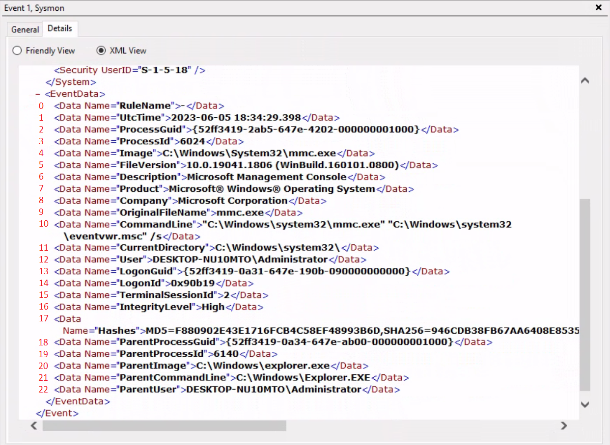

# Get-WinEvent

Understanding the importance of mass analysis of `Windows Event Logs` and `Sysmon logs` is pivotal in the realm of cybersecurity, especially in `Incident Response (IR)` and `threat hunting scenarios`. These **logs hold invaluable information** about `the state of your systems`, `user activities`, `potential threats`, `system changes`, and `troubleshooting information`. However, these logs can also be voluminous and unwieldy. For large-scale organizations, it's not uncommon to generate millions of logs each day. Hence, to distill useful information from these logs, we require efficient tools and techniques to analyze these logs en masse.

One of these tools is the [Get-WinEvent cmdlet](https://learn.microsoft.com/en-us/powershell/module/microsoft.powershell.diagnostics/get-winevent?view=powershell-7.3) in `PowerShell`.

## Using Get-WinEvent

The `Get-WinEvent cmdlet` is an indispensable tool in PowerShell for `querying Windows Event logs` en masse. The cmdlet provides us with the capability to retrieve different types of event logs, including classic Windows event logs like System and Application logs, logs generated by `Windows Event Log technology`, and `Event Tracing for Windows (ETW) logs`.

To quickly identify the available logs, we can leverage the `-ListLog` parameter in conjunction with the `Get-WinEvent cmdlet`. By specifying `*` as the parameter value, we retrieve all logs without applying any filtering criteria. This allows us to obtain a comprehensive list of logs and their associated properties. By executing the following command, we can retrieve the list of logs and display essential properties such as `LogName, RecordCount, IsClassicLog, IsEnabled, LogMode`, and `LogType`. The `|` character is a `pipe operator`. It is used to pass the output of one command (in this case, the `Get-WinEvent` command) to another command (in this case, the `Select-Object` command).

```powershell
PS C:\Users\Administrator> Get-WinEvent -ListLog * | Select-Object LogName, RecordCount, IsClassicLog, IsEnabled, LogMode, LogType | Format-Table -AutoSize

LogName                                                                                RecordCount IsClassicLog IsEnabled  LogMode        LogType
-------                                                                                ----------- ------------ ---------  -------        -------
Windows PowerShell                                                                            2916         True      True Circular Administrative
System                                                                                        1786         True      True Circular Administrative
Security                                                                                      8968         True      True Circular Administrative
Key Management Service                                                                           0         True      True Circular Administrative
Internet Explorer                                                                                0         True      True Circular Administrative
HardwareEvents                                                                                   0         True      True Circular Administrative
Application                                                                                   2079         True      True Circular Administrative
Windows Networking Vpn Plugin Platform/OperationalVerbose                                                 False     False Circular    Operational
Windows Networking Vpn Plugin Platform/Operational                                                        False     False Circular    Operational
SMSApi                                                                                           0        False      True Circular    Operational
Setup                                                                                           16        False      True Circular    Operational
OpenSSH/Operational                                                                              0        False      True Circular    Operational
OpenSSH/Admin                                                                                    0        False      True Circular Administrative
Network Isolation Operational                                                                             False     False Circular    Operational
Microsoft-WindowsPhone-Connectivity-WiFiConnSvc-Channel                                          0        False      True Circular    Operational
Microsoft-Windows-WWAN-SVC-Events/Operational                                                    0        False      True Circular    Operational
Microsoft-Windows-WPD-MTPClassDriver/Operational                                                 0        False      True Circular    Operational
Microsoft-Windows-WPD-CompositeClassDriver/Operational                                           0        False      True Circular    Operational
Microsoft-Windows-WPD-ClassInstaller/Operational                                                 0        False      True Circular    Operational
Microsoft-Windows-Workplace Join/Admin                                                           0        False      True Circular Administrative
Microsoft-Windows-WorkFolders/WHC                                                                0        False      True Circular    Operational
Microsoft-Windows-WorkFolders/Operational                                                        0        False      True Circular    Operational
Microsoft-Windows-Wordpad/Admin                                                                           False     False Circular    Operational
Microsoft-Windows-WMPNSS-Service/Operational                                                     0        False      True Circular    Operational
Microsoft-Windows-WMI-Activity/Operational                                                     895        False      True Circular    Operational
Microsoft-Windows-wmbclass/Trace                                                                          False     False Circular    Operational
Microsoft-Windows-WLAN-AutoConfig/Operational                                                    0        False      True Circular    Operational
Microsoft-Windows-Wired-AutoConfig/Operational                                                   0        False      True Circular    Operational
Microsoft-Windows-Winsock-WS2HELP/Operational                                                    0        False      True Circular    Operational
Microsoft-Windows-Winsock-NameResolution/Operational                                                      False     False Circular    Operational
Microsoft-Windows-Winsock-AFD/Operational                                                                 False     False Circular    Operational
Microsoft-Windows-WinRM/Operational                                                            230        False      True Circular    Operational
Microsoft-Windows-WinNat/Oper                                                                             False     False Circular    Operational
Microsoft-Windows-Winlogon/Operational                                                         648        False      True Circular    Operational
Microsoft-Windows-WinINet-Config/ProxyConfigChanged                                              2        False      True Circular    Operational
--- SNIP ---
```

This command provides us with valuable information about each log, including the name of the log, the number of records present, whether the log is in the classic `.evt` format or the newer `.evtx` format, its enabled status, the log mode (Circular, Retain, or AutoBackup), and the log type (Administrative, Analytical, Debug, or Operational).

Additionally, we can explore the event log providers associated with each log using the `-ListProvider` parameter. Event log providers serve as the sources of events within the logs. Executing the following command allows us to retrieve the list of providers and their respective linked logs.

```powershell
PS C:\Users\Administrator> Get-WinEvent -ListProvider * | Format-Table -AutoSize

Name                                                                       LogLinks
----                                                                       --------
PowerShell                                                                 {Windows PowerShell}
Workstation                                                                {System}
WMIxWDM                                                                    {System}
WinNat                                                                     {System}
Windows Script Host                                                        {System}
Microsoft-Windows-IME-OEDCompiler                                          {Microsoft-Windows-IME-OEDCompiler/Analytic}
Microsoft-Windows-DeviceSetupManager                                       {Microsoft-Windows-DeviceSetupManager/Operat...
Microsoft-Windows-Search-ProfileNotify                                     {Application}
Microsoft-Windows-Eventlog                                                 {System, Security, Setup, Microsoft-Windows-...
Microsoft-Windows-Containers-BindFlt                                       {Microsoft-Windows-Containers-BindFlt/Operat...
Microsoft-Windows-NDF-HelperClassDiscovery                                 {Microsoft-Windows-NDF-HelperClassDiscovery/...
Microsoft-Windows-FirstUX-PerfInstrumentation                              {FirstUXPerf-Analytic}
--- SNIP ---
```

This command provides us with an overview of the available providers and their associations with specific logs. It enables us to identify providers of interest for filtering purposes.

Now, let's focus on retrieving specific event logs using the `Get-WinEvent cmdlet`. At its most basic, `Get-WinEvent` retrieves event logs from local or remote computers. The examples below demonstrate how to retrieve events from various logs.

### 1. Retrieving events from the System log

```powershell
PS C:\Users\Administrator> Get-WinEvent -LogName 'System' -MaxEvents 50 | Select-Object TimeCreated, ID, ProviderName, LevelDisplayName, Message | Format-Table -AutoSize

TimeCreated            Id ProviderName                             LevelDisplayName Message
-----------            -- ------------                             ---------------- -------
6/2/2023 9:41:42 AM    16 Microsoft-Windows-Kernel-General         Information      The access history in hive \??\C:\Users\Administrator\AppData\Local\Packages\MicrosoftWindows.Client.CBS_cw5...
6/2/2023 9:38:32 AM    16 Microsoft-Windows-Kernel-General         Information      The access history in hive \??\C:\Users\Administrator\AppData\Local\Packages\Microsoft.Windows.ShellExperien...
6/2/2023 9:38:32 AM 10016 Microsoft-Windows-DistributedCOM         Warning          The machine-default permission settings do not grant Local Activation permission for the COM Server applicat...
6/2/2023 9:37:31 AM    16 Microsoft-Windows-Kernel-General         Information      The access history in hive \??\C:\Users\Administrator\AppData\Local\Packages\Microsoft.WindowsAlarms_8wekyb3...
6/2/2023 9:37:31 AM    16 Microsoft-Windows-Kernel-General         Information      The access history in hive \??\C:\Users\Administrator\AppData\Local\Packages\microsoft.windowscommunications...
6/2/2023 9:37:31 AM    16 Microsoft-Windows-Kernel-General         Information      The access history in hive \??\C:\Users\Administrator\AppData\Local\Packages\Microsoft.Windows.ContentDelive...
6/2/2023 9:36:35 AM    16 Microsoft-Windows-Kernel-General         Information      The access history in hive \??\C:\Users\Administrator\AppData\Local\Packages\Microsoft.YourPhone_8wekyb3d8bb...
6/2/2023 9:36:32 AM    16 Microsoft-Windows-Kernel-General         Information      The access history in hive \??\C:\Users\Administrator\AppData\Local\Packages\Microsoft.AAD.BrokerPlugin_cw5n...
6/2/2023 9:36:30 AM    16 Microsoft-Windows-Kernel-General         Information      The access history in hive \??\C:\Users\Administrator\AppData\Local\Packages\Microsoft.Windows.Search_cw5n1h...
6/2/2023 9:36:29 AM    16 Microsoft-Windows-Kernel-General         Information      The access history in hive \??\C:\Users\Administrator\AppData\Local\Packages\Microsoft.Windows.StartMenuExpe...
6/2/2023 9:36:14 AM    16 Microsoft-Windows-Kernel-General         Information      The access history in hive \??\C:\Users\Administrator\AppData\Local\Microsoft\Windows\UsrClass.dat was clear...
6/2/2023 9:36:14 AM    16 Microsoft-Windows-Kernel-General         Information      The access history in hive \??\C:\Users\Administrator\ntuser.dat was cleared updating 2366 keys and creating...
6/2/2023 9:36:14 AM  7001 Microsoft-Windows-Winlogon               Information      User Logon Notification for Customer Experience Improvement Program	
6/2/2023 9:33:04 AM    16 Microsoft-Windows-Kernel-General         Information      The access history in hive \??\C:\Windows\AppCompat\Programs\Amcache.hve was cleared updating 920 keys and c...
6/2/2023 9:31:54 AM    16 Microsoft-Windows-Kernel-General         Information      The access history in hive \??\C:\Windows\ServiceProfiles\NetworkService\AppData\Local\Microsoft\Windows\Del...
6/2/2023 9:30:23 AM    16 Microsoft-Windows-Kernel-General         Information      The access history in hive \??\C:\Windows\System32\config\COMPONENTS was cleared updating 54860 keys and cre...
6/2/2023 9:30:16 AM    15 Microsoft-Windows-Kernel-General         Information      Hive \SystemRoot\System32\config\DRIVERS was reorganized with a starting size of 3956736 bytes and an ending...
6/2/2023 9:30:10 AM  1014 Microsoft-Windows-DNS-Client             Warning          Name resolution for the name settings-win.data.microsoft.com timed out after none of the configured DNS serv...
6/2/2023 9:29:54 AM  7026 Service Control Manager                  Information      The following boot-start or system-start driver(s) did not load: ...
6/2/2023 9:29:54 AM 10148 Microsoft-Windows-WinRM                  Information      The WinRM service is listening for WS-Management requests. ...
6/2/2023 9:29:51 AM 51046 Microsoft-Windows-DHCPv6-Client          Information      DHCPv6 client service is started
--- SNIP ---
```

This example retrieves the **first 50 events** from the `System` log. It selects specific properties, including the `event's creation time`, `ID`, `provider name`, `level display name`, and `message`. This facilitates easier analysis and troubleshooting.

### 2. Retrieving events from Microsoft-Windows-WinRM/Operational

```powershell
PS C:\Users\Administrator> Get-WinEvent -LogName 'Microsoft-Windows-WinRM/Operational' -MaxEvents 30 | Select-Object TimeCreated, ID, ProviderName, LevelDisplayName, Message | Format-Table -AutoSize

TimeCreated            Id ProviderName            LevelDisplayName Message
-----------            -- ------------            ---------------- -------
6/2/2023 9:30:15 AM   132 Microsoft-Windows-WinRM Information      WSMan operation Enumeration completed successfully
6/2/2023 9:30:15 AM   145 Microsoft-Windows-WinRM Information      WSMan operation Enumeration started with resourceUri...
6/2/2023 9:30:15 AM   132 Microsoft-Windows-WinRM Information      WSMan operation Enumeration completed successfully
6/2/2023 9:30:15 AM   145 Microsoft-Windows-WinRM Information      WSMan operation Enumeration started with resourceUri...
6/2/2023 9:29:54 AM   209 Microsoft-Windows-WinRM Information      The Winrm service started successfully
--- SNIP ---
```

In this example, events are retrieved from the `Microsoft-Windows-WinRM/Operational` log. The command retrieves the **first 30 events** and selects relevant properties for display, including the `event's creation time`, `ID`, `provider name`, `level display name`, and `message`.

To retrieve the oldest events, instead of manually sorting the results, we can utilize the `-Oldest` parameter with the `Get-WinEvent cmdlet`. This parameter allows us to retrieve the first events based on their chronological order. The following command demonstrates how to retrieve the **oldest 30 events** from the '`Microsoft-Windows-WinRM/Operational`' log.

```powershell
PS C:\Users\Administrator> Get-WinEvent -LogName 'Microsoft-Windows-WinRM/Operational' -Oldest -MaxEvents 30 | Select-Object TimeCreated, ID, ProviderName, LevelDisplayName, Message | Format-Table -AutoSize

TimeCreated           Id ProviderName            LevelDisplayName Message
-----------            -- ------------            ---------------- -------
8/3/2022 4:41:38 PM  145 Microsoft-Windows-WinRM Information      WSMan operation Enumeration started with resourceUri ...
8/3/2022 4:41:42 PM  254 Microsoft-Windows-WinRM Information      Activity Transfer
8/3/2022 4:41:42 PM  161 Microsoft-Windows-WinRM Error            The client cannot connect to the destination specifie...
8/3/2022 4:41:42 PM  142 Microsoft-Windows-WinRM Error            WSMan operation Enumeration failed, error code 215085...
8/3/2022 9:51:03 AM  145 Microsoft-Windows-WinRM Information      WSMan operation Enumeration started with resourceUri ...
8/3/2022 9:51:07 AM  254 Microsoft-Windows-WinRM Information      Activity Transfer
```

### 3. Retrieving events from .evtx Files

If you have an exported `.evtx` file from another computer or you have backed up an existing log, you can utilize the `Get-WinEvent cmdlet` to read and query those logs. This capability is particularly useful for auditing purposes or when you need to analyze logs within scripts.

To retrieve log entries from a `.evtx` file, you need to provide the log file's path using the `-Path` parameter. The example below demonstrates how to read events from the '`C:\Tools\chainsaw\EVTX-ATTACK-SAMPLES\Execution\exec_sysmon_1_lolbin_pcalua.evtx`' file, which represents an exported `Windows PowerShell log`.

```powershell
PS C:\Users\Administrator> Get-WinEvent -Path 'C:\Tools\chainsaw\EVTX-ATTACK-SAMPLES\Execution\exec_sysmon_1_lolbin_pcalua.evtx' -MaxEvents 5 | Select-Object TimeCreated, ID, ProviderName, LevelDisplayName, Message | Format-Table -AutoSize

TimeCreated           Id ProviderName             LevelDisplayName Message
-----------           -- ------------             ---------------- -------
5/12/2019 10:01:51 AM  1 Microsoft-Windows-Sysmon Information      Process Create:...
5/12/2019 10:01:50 AM  1 Microsoft-Windows-Sysmon Information      Process Create:...
5/12/2019 10:01:43 AM  1 Microsoft-Windows-Sysmon Information      Process Create:...
```

By specifying the path of the log file using the `-Path` parameter, we can retrieve events from that specific file. The command selects relevant properties and formats the output for easier analysis, displaying the `event's creation time`, `ID`, `provider name`, `level display name`, and `message`.

### 4. Filtering events with FilterHashtable

To filter Windows event logs, we can use the `-FilterHashtable` parameter, which enables us to define specific conditions for the logs we want to retrieve.

```powershell
PS C:\Users\Administrator> Get-WinEvent -FilterHashtable @{LogName='Microsoft-Windows-Sysmon/Operational'; ID=1,3} | Select-Object TimeCreated, ID, ProviderName, LevelDisplayName, Message | Format-Table -AutoSize

TimeCreated           Id ProviderName             LevelDisplayName Message
-----------           -- ------------             ---------------- -------
6/2/2023 10:40:09 AM   1 Microsoft-Windows-Sysmon Information      Process Create:...
6/2/2023 10:39:01 AM   1 Microsoft-Windows-Sysmon Information      Process Create:...
6/2/2023 10:34:12 AM   1 Microsoft-Windows-Sysmon Information      Process Create:...
6/2/2023 10:33:26 AM   1 Microsoft-Windows-Sysmon Information      Process Create:...
6/2/2023 10:33:16 AM   1 Microsoft-Windows-Sysmon Information      Process Create:...
6/2/2023 9:36:10 AM    3 Microsoft-Windows-Sysmon Information      Network connection detected:...
5/29/2023 6:30:26 PM   1 Microsoft-Windows-Sysmon Information      Process Create:...
5/29/2023 6:30:24 PM   3 Microsoft-Windows-Sysmon Information      Network connection detected:...
```

The command above retrieves events with `IDs 1` and `3` from the `Microsoft-Windows-Sysmon/Operational` event log, selects specific properties from those events, and displays them in a table format. Note: **If we observe Sysmon** `event IDs 1` and `3` (related to "`dangerous`" or `uncommon binaries`) o**ccurring within a short time frame, it could potentially indicate the presence of a process communicating with a** `Command and Control (C2) server`.

For exported events the equivalent command is the following.

```powershell
PS C:\Users\Administrator> Get-WinEvent -FilterHashtable @{Path='C:\Tools\chainsaw\EVTX-ATTACK-SAMPLES\Execution\sysmon_mshta_sharpshooter_stageless_meterpreter.evtx'; ID=1,3} | Select-Object TimeCreated, ID, ProviderName, LevelDisplayName, Message | Format-Table -AutoSize

TimeCreated           Id ProviderName             LevelDisplayName Message
-----------           -- ------------             ---------------- -------
6/15/2019 12:14:32 AM  1 Microsoft-Windows-Sysmon Information      Process Create:...
6/15/2019 12:13:44 AM  3 Microsoft-Windows-Sysmon Information      Network connection detected:...
6/15/2019 12:13:42 AM  1 Microsoft-Windows-Sysmon Information      Process Create:...
```

:::info[Note]
These logs are related to a process communicating with a `Command and Control (C2)` server right after it was created.
:::

If we want the get event logs based on a date range (`5/28/23 - 6/2/2023`), this can be done as follows.

```powershell
 PS C:\Users\Administrator> $startDate = (Get-Date -Year 2023 -Month 5 -Day 28).Date
 PS C:\Users\Administrator> $endDate   = (Get-Date -Year 2023 -Month 6 -Day 3).Date
 PS C:\Users\Administrator> Get-WinEvent -FilterHashtable @{LogName='Microsoft-Windows-Sysmon/Operational'; ID=1,3; StartTime=$startDate; EndTime=$endDate} | Select-Object TimeCreated, ID, ProviderName, LevelDisplayName, Message | Format-Table -AutoSize

 TimeCreated           Id ProviderName             LevelDisplayName Message
-----------           -- ------------             ---------------- -------
6/2/2023 3:26:56 PM    1 Microsoft-Windows-Sysmon Information      Process Create:...
6/2/2023 3:25:20 PM    1 Microsoft-Windows-Sysmon Information      Process Create:...
6/2/2023 3:25:20 PM    1 Microsoft-Windows-Sysmon Information      Process Create:...
6/2/2023 3:24:13 PM    1 Microsoft-Windows-Sysmon Information      Process Create:...
6/2/2023 3:24:13 PM    1 Microsoft-Windows-Sysmon Information      Process Create:...
6/2/2023 3:23:41 PM    1 Microsoft-Windows-Sysmon Information      Process Create:...
6/2/2023 3:20:27 PM    1 Microsoft-Windows-Sysmon Information      Process Create:...
6/2/2023 3:20:26 PM    1 Microsoft-Windows-Sysmon Information      Process Create:...
--- SNIP ---
```

:::info[Note]
The above will filter between the start date inclusive and the end date exclusive. That's why we specified June 3rd and not 2nd.
:::

### 5. Filtering events with FilterHashtable & XML

Consider an **intrusion detection scenario** where a **suspicious network connection** to a particular IP (`52.113.194.132`) has been identified. With `Sysmon` installed, you can use [Event ID 3 (Network Connection)](https://www.ultimatewindowssecurity.com/securitylog/encyclopedia/event.aspx?eventid=90003) logs to **investigate the potential threat**.

```powershell
PS C:\Users\Administrator> Get-WinEvent -FilterHashtable @{LogName='Microsoft-Windows-Sysmon/Operational'; ID=3} |
`ForEach-Object {
$xml = [xml]$_.ToXml()
$eventData = $xml.Event.EventData.Data
New-Object PSObject -Property @{
    SourceIP = $eventData | Where-Object {$_.Name -eq "SourceIp"} | Select-Object -ExpandProperty '#text'
    DestinationIP = $eventData | Where-Object {$_.Name -eq "DestinationIp"} | Select-Object -ExpandProperty '#text'
    ProcessGuid = $eventData | Where-Object {$_.Name -eq "ProcessGuid"} | Select-Object -ExpandProperty '#text'
    ProcessId = $eventData | Where-Object {$_.Name -eq "ProcessId"} | Select-Object -ExpandProperty '#text'
}
}  | Where-Object {$_.DestinationIP -eq "52.113.194.132"}

DestinationIP  ProcessId SourceIP       ProcessGuid
-------------  --------- --------       -----------
52.113.194.132 9196      10.129.205.123 {52ff3419-51ad-6475-1201-000000000e00}
52.113.194.132 5996      10.129.203.180 {52ff3419-54f3-6474-3d03-000000000c00}
```

This script will retrieve `all Sysmon network connection events (ID 3)`, `parse the XML data for each event` to retrieve specific details (`source IP`, `destination IP`, `Process GUID`, and `Process ID`), and `filter the results to include only events where the destination IP matches the suspected IP`.

Further, we can use the `ProcessGuid` to trace back the original process that made the connection, enabling us to understand **the process tree** and **identify any malicious executables** or **scripts**.

You might wonder how we could have been aware of `Event.EventData.Data`. The `Windows XML EventLog (EVTX)` format can be found [here](https://github.com/libyal/libevtx/blob/main/documentation/Windows%20XML%20Event%20Log%20(EVTX).asciidoc).

In the "[Tapping Into ETW](https://blog.salucci.ch/docs/HackingLab/HackTheBox/SOC-Analyst/Tapping-Into-ETW/)" section we were looking for anomalous `clr.dll` and `mscoree.dll` loading activity in processes that ordinarily wouldn't require them. The command below is leveraging `Sysmon's Event ID 7` to detect `the loading of abovementioned DLLs`.

```powershell
PS C:\Users\Administrator> $Query = @"
	<QueryList>
		<Query Id="0">
			<Select Path="Microsoft-Windows-Sysmon/Operational">*[System[(EventID=7)]] and *[EventData[Data='mscoree.dll']] or *[EventData[Data='clr.dll']]
			</Select>
		</Query>
	</QueryList>
	"@
PS C:\Users\Administrator> Get-WinEvent -FilterXml $Query | ForEach-Object {Write-Host $_.Message `n}
Image loaded:
RuleName: -
UtcTime: 2023-06-05 22:23:16.560
ProcessGuid: {52ff3419-6054-647e-aa02-000000001000}
ProcessId: 2936
Image: C:\Tools\GhostPack Compiled Binaries\Seatbelt.exe
ImageLoaded: C:\Windows\Microsoft.NET\Framework64\v4.0.30319\clr.dll
FileVersion: 4.8.4515.0 built by: NET48REL1LAST_C
Description: Microsoft .NET Runtime Common Language Runtime - 	WorkStation
Product: Microsoft® .NET Framework
Company: Microsoft Corporation
OriginalFileName: clr.dll
Hashes: MD5=2B0E5597FF51A3A4D5BB2DDAB0214531,SHA256=8D09CE35C987EADCF01686BB559920951B0116985FE4FEB5A488A6A8F7C4BDB9,IMPHASH=259C196C67C4E02F941CAD54D9D9BB8A
Signed: true
Signature: Microsoft Corporation
SignatureStatus: Valid
User: DESKTOP-NU10MTO\Administrator

Image loaded:
RuleName: -
UtcTime: 2023-06-05 22:23:16.544
ProcessGuid: {52ff3419-6054-647e-aa02-000000001000}
ProcessId: 2936
Image: C:\Tools\GhostPack Compiled Binaries\Seatbelt.exe
ImageLoaded: C:\Windows\System32\mscoree.dll
FileVersion: 10.0.19041.1 (WinBuild.160101.0800)
Description: Microsoft .NET Runtime Execution Engine
Product: Microsoft® Windows® Operating System
Company: Microsoft Corporation
OriginalFileName: mscoree.dll
Hashes: MD5=D5971EF71DE1BDD46D537203ABFCC756,SHA256=8828DE042D008783BA5B31C82935A3ED38D5996927C3399B3E1FC6FE723FC84E,IMPHASH=65F23EFA1EB51A5DAAB399BFAA840074
Signed: true
Signature: Microsoft Windows
SignatureStatus: Valid
User: DESKTOP-NU10MTO\Administrator
--- SNIP ---
```

### 6. Filtering events with Filter XPath

To use `XPath` queries with `Get-WinEvent`, we need to use the `-FilterXPath` parameter. This allows us to craft an XPath query to filter the event logs.

For instance, if we want to get `Process Creation` ([Sysmon Event ID 1](https://www.ultimatewindowssecurity.com/securitylog/encyclopedia/event.aspx?eventid=90001)) events in the Sysmon log to identify installation of any [Sysinterals](https://learn.microsoft.com/en-us/sysinternals/) tool we can use the command below. 

:::info[Note]
**During the installation of a Sysinternals tool the user must accept the presented EULA**. The acceptance action involves the **registry key included** in the command below.
:::

```powershell
 PS C:\Users\Administrator> Get-WinEvent -LogName 'Microsoft-Windows-Sysmon/Operational' -FilterXPath "*[EventData[Data[@Name='Image']='C:\Windows\System32\reg.exe']] and *[EventData[Data[@Name='CommandLine']='`"C:\Windows\system32\reg.exe`" ADD HKCU\Software\Sysinternals /v EulaAccepted /t REG_DWORD /d 1 /f']]" | Select-Object TimeCreated, ID, ProviderName, LevelDisplayName, Message | Format-Table -AutoSize

 TimeCreated           Id ProviderName             LevelDisplayName Message
-----------           -- ------------             ---------------- -------
5/29/2023 12:44:46 AM  1 Microsoft-Windows-Sysmon Information      Process Create:...
5/29/2023 12:29:53 AM  1 Microsoft-Windows-Sysmon Information      Process Create:...
```

:::info[Note]
`Image` and `CommandLine` can be identified by browsing the XML representation of any `Sysmon event with ID 1` through, for example, `Event Viewer`.
:::


Lastly, suppose we want to investigate any network connections to a particular suspicious IP address (`52.113.194.132`) that `Sysmon` has logged. To do that we could use the following command.

```powershell
PS C:\Users\Administrator> Get-WinEvent -LogName 'Microsoft-Windows-Sysmon/Operational' -FilterXPath "*[System[EventID=3] and EventData[Data[@Name='DestinationIp']='52.113.194.132']]"

ProviderName: Microsoft-Windows-Sysmon

TimeCreated                      Id LevelDisplayName Message
-----------                      -- ---------------- -------
5/29/2023 6:30:24 PM              3 Information      Network connection detected:...
5/29/2023 12:32:05 AM             3 Information      Network connection detected:...
```

### 7. Filtering events based on property values

The `-Property *` parameter, when used with `Select-Object`, instructs the command to select all properties of the objects passed to it. In the context of the `Get-WinEvent` command, these properties will include all available information about the event. Let's see an example that will present us with all properties of `Sysmon event ID 1` logs.

```powershell
PS C:\Users\Administrator> Get-WinEvent -FilterHashtable @{LogName='Microsoft-Windows-Sysmon/Operational'; ID=1} -MaxEvents 1 | Select-Object -Property *


Message            : Process Create:
                   RuleName: -
                   UtcTime: 2023-06-03 01:24:25.104
                   ProcessGuid: {52ff3419-9649-647a-1902-000000001000}
                   ProcessId: 1036
                   Image: C:\Windows\System32\taskhostw.exe
                   FileVersion: 10.0.19041.1806 (WinBuild.160101.0800)
                   Description: Host Process for Windows Tasks
                   Product: Microsoft® Windows® Operating System
                   Company: Microsoft Corporation
                   OriginalFileName: taskhostw.exe
                   CommandLine: taskhostw.exe -RegisterDevice -ProtectionStateChanged -FreeNetworkOnly
                   CurrentDirectory: C:\Windows\system32\
                   User: NT AUTHORITY\SYSTEM
                   LogonGuid: {52ff3419-85d0-647a-e703-000000000000}
                   LogonId: 0x3E7
                   TerminalSessionId: 0
                   IntegrityLevel: System
                   Hashes: MD5=C7B722B96F3969EACAE9FA205FAF7EF0,SHA256=76D3D02B265FA5768294549C938D3D9543CC9FEF6927
                   4728E0A72E3FCC335366,IMPHASH=3A0C6863CDE566AF997DB2DEFFF9D924
                   ParentProcessGuid: {00000000-0000-0000-0000-000000000000}
                   ParentProcessId: 1664
                   ParentImage: -
                   ParentCommandLine: -
                   ParentUser: -
Id                   : 1
Version              : 5
Qualifiers           :
Level                : 4
Task                 : 1
Opcode               : 0
Keywords             : -9223372036854775808
RecordId             : 32836
ProviderName         : Microsoft-Windows-Sysmon
ProviderId           : 5770385f-c22a-43e0-bf4c-06f5698ffbd9
LogName              : Microsoft-Windows-Sysmon/Operational
ProcessId            : 2900
ThreadId             : 2436
MachineName          : DESKTOP-NU10MTO
UserId               : S-1-5-18
TimeCreated          : 6/2/2023 6:24:25 PM
ActivityId           :
RelatedActivityId    :
ContainerLog         : Microsoft-Windows-Sysmon/Operational
MatchedQueryIds      : {}
Bookmark             : 		System.Diagnostics.Eventing.Reader.EventBookmark
LevelDisplayName     : Information
OpcodeDisplayName    : Info
TaskDisplayName      : Process Create (rule: ProcessCreate)
KeywordsDisplayNames : {}
Properties           : {System.Diagnostics.Eventing.Reader.EventProperty,
                   System.Diagnostics.Eventing.Reader.EventProperty,
                   System.Diagnostics.Eventing.Reader.EventProperty,
                   System.Diagnostics.Eventing.Reader.EventProperty...}
```

Let's now see an example of a command that retrieves `Process Create` events from the `Microsoft-Windows-Sysmon/Operational` log, checks the parent command line of each event for the string `-enc`, and then displays all properties of any matching events as a list.

```powershell
PS C:\Users\Administrator> Get-WinEvent -FilterHashtable @{LogName='Microsoft-Windows-Sysmon/Operational'; ID=1} | Where-Object {$_.Properties[21].Value -like "*-enc*"} | Format-List

TimeCreated  : 5/29/2023 12:44:58 AM
ProviderName : Microsoft-Windows-Sysmon
Id           : 1
Message      : Process Create:
           RuleName: -
           UtcTime: 2023-05-29 07:44:58.467
           ProcessGuid: {52ff3419-57fa-6474-7005-000000000c00}
           ProcessId: 2660
           Image: C:\Windows\Microsoft.NET\Framework64\v4.0.30319\csc.exe
           FileVersion: 4.8.4084.0 built by: NET48REL1
           Description: Visual C# Command Line Compiler
           Product: Microsoft® .NET Framework
           Company: Microsoft Corporation
           OriginalFileName: csc.exe
           CommandLine: "C:\Windows\Microsoft.NET\Framework64\v4.0.30319\csc.exe" /noconfig /fullpaths
           @"C:\Users\ADMINI~1\AppData\Local\Temp\z5erlc11.cmdline"
           CurrentDirectory: C:\Users\Administrator\
           User: DESKTOP-NU10MTO\Administrator
           LogonGuid: {52ff3419-57f9-6474-8071-510000000000}
           LogonId: 0x517180
           TerminalSessionId: 0
           IntegrityLevel: High
           Hashes: MD5=F65B029562077B648A6A5F6A1AA76A66,SHA256=4A6D0864E19C0368A47217C129B075DDDF61A6A262388F9D2104
           5D82F3423ED7,IMPHASH=EE1E569AD02AA1F7AECA80AC0601D80D
           ParentProcessGuid: {52ff3419-57f9-6474-6e05-000000000c00}
           ParentProcessId: 5840
           ParentImage: C:\Windows\System32\WindowsPowerShell\v1.0\powershell.exe
           ParentCommandLine: "C:\Windows\System32\WindowsPowerShell\v1.0\powershell.exe" -NoProfile
           -NonInteractive -ExecutionPolicy Unrestricted -EncodedCommand JgBjAGgAYwBwAC4AYwBvAG0AIAA2ADUAMAAwADEAIA
           A+ACAAJABuAHUAbABsAAoAaQBmACAAKAAkAFAAUwBWAGUAcgBzAGkAbwBuAFQAYQBiAGwAZQAuAFAAUwBWAGUAcgBzAGkAbwBuACAALQ
           BsAHQAIABbAFYAZQByAHMAaQBvAG4AXQAiADMALgAwACIAKQAgAHsACgAnAHsAIgBmAGEAaQBsAGUAZAAiADoAdAByAHUAZQAsACIAbQ
           BzAGcAIgA6ACIAQQBuAHMAaQBiAGwAZQAgAHIAZQBxAHUAaQByAGUAcwAgAFAAbwB3AGUAcgBTAGgAZQBsAGwAIAB2ADMALgAwACAAbw
           ByACAAbgBlAHcAZQByACIAfQAnAAoAZQB4AGkAdAAgADEACgB9AAoAJABlAHgAZQBjAF8AdwByAGEAcABwAGUAcgBfAHMAdAByACAAPQ
           AgACQAaQBuAHAAdQB0ACAAfAAgAE8AdQB0AC0AUwB0AHIAaQBuAGcACgAkAHMAcABsAGkAdABfAHAAYQByAHQAcwAgAD0AIAAkAGUAeA
           BlAGMAXwB3AHIAYQBwAHAAZQByAF8AcwB0AHIALgBTAHAAbABpAHQAKABAACgAIgBgADAAYAAwAGAAMABgADAAIgApACwAIAAyACwAIA
           BbAFMAdAByAGkAbgBnAFMAcABsAGkAdABPAHAAdABpAG8AbgBzAF0AOgA6AFIAZQBtAG8AdgBlAEUAbQBwAHQAeQBFAG4AdAByAGkAZQ
           BzACkACgBJAGYAIAAoAC0AbgBvAHQAIAAkAHMAcABsAGkAdABfAHAAYQByAHQAcwAuAEwAZQBuAGcAdABoACAALQBlAHEAIAAyACkAIA
           B7ACAAdABoAHIAbwB3ACAAIgBpAG4AdgBhAGwAaQBkACAAcABhAHkAbABvAGEAZAAiACAAfQAKAFMAZQB0AC0AVgBhAHIAaQBhAGIAbA
           BlACAALQBOAGEAbQBlACAAagBzAG8AbgBfAHIAYQB3ACAALQBWAGEAbAB1AGUAIAAkAHMAcABsAGkAdABfAHAAYQByAHQAcwBbADEAXQ
           AKACQAZQB4AGUAYwBfAHcAcgBhAHAAcABlAHIAIAA9ACAAWwBTAGMAcgBpAHAAdABCAGwAbwBjAGsAXQA6ADoAQwByAGUAYQB0AGUAKA
           AkAHMAcABsAGkAdABfAHAAYQByAHQAcwBbADAAXQApAAoAJgAkAGUAeABlAGMAXwB3AHIAYQBwAHAAZQByAA==
           ParentUser: DESKTOP-NU10MTO\Administrator

TimeCreated  : 5/29/2023 12:44:57 AM
ProviderName : Microsoft-Windows-Sysmon
Id           : 1
Message      : Process Create:
           RuleName: -
           UtcTime: 2023-05-29 07:44:57.919
           ProcessGuid: {52ff3419-57f9-6474-6f05-000000000c00}
           ProcessId: 3060
           Image: C:\Windows\System32\chcp.com
           FileVersion: 10.0.19041.1806 (WinBuild.160101.0800)
           Description: Change CodePage Utility
           Product: Microsoft® Windows® Operating System
           Company: Microsoft Corporation
           OriginalFileName: CHCP.COM
           CommandLine: "C:\Windows\system32\chcp.com" 65001
           CurrentDirectory: C:\Users\Administrator\
           User: DESKTOP-NU10MTO\Administrator
           LogonGuid: {52ff3419-57f9-6474-8071-510000000000}
           LogonId: 0x517180
           TerminalSessionId: 0
           IntegrityLevel: High
           Hashes: MD5=33395C4732A49065EA72590B14B64F32,SHA256=025622772AFB1486F4F7000B70CC51A20A640474D6E4DBE95A70
           BEB3FD53AD40,IMPHASH=75FA51C548B19C4AD5051FAB7D57EB56
           ParentProcessGuid: {52ff3419-57f9-6474-6e05-000000000c00}
           ParentProcessId: 5840
           ParentImage: C:\Windows\System32\WindowsPowerShell\v1.0\powershell.exe
           ParentCommandLine: "C:\Windows\System32\WindowsPowerShell\v1.0\powershell.exe" -NoProfile
           -NonInteractive -ExecutionPolicy Unrestricted -EncodedCommand JgBjAGgAYwBwAC4AYwBvAG0AIAA2ADUAMAAwADEAIA
           A+ACAAJABuAHUAbABsAAoAaQBmACAAKAAkAFAAUwBWAGUAcgBzAGkAbwBuAFQAYQBiAGwAZQAuAFAAUwBWAGUAcgBzAGkAbwBuACAALQ
           BsAHQAIABbAFYAZQByAHMAaQBvAG4AXQAiADMALgAwACIAKQAgAHsACgAnAHsAIgBmAGEAaQBsAGUAZAAiADoAdAByAHUAZQAsACIAbQ
           BzAGcAIgA6ACIAQQBuAHMAaQBiAGwAZQAgAHIAZQBxAHUAaQByAGUAcwAgAFAAbwB3AGUAcgBTAGgAZQBsAGwAIAB2ADMALgAwACAAbw
           ByACAAbgBlAHcAZQByACIAfQAnAAoAZQB4AGkAdAAgADEACgB9AAoAJABlAHgAZQBjAF8AdwByAGEAcABwAGUAcgBfAHMAdAByACAAPQ
           AgACQAaQBuAHAAdQB0ACAAfAAgAE8AdQB0AC0AUwB0AHIAaQBuAGcACgAkAHMAcABsAGkAdABfAHAAYQByAHQAcwAgAD0AIAAkAGUAeA
           BlAGMAXwB3AHIAYQBwAHAAZQByAF8AcwB0AHIALgBTAHAAbABpAHQAKABAACgAIgBgADAAYAAwAGAAMABgADAAIgApACwAIAAyACwAIA
           BbAFMAdAByAGkAbgBnAFMAcABsAGkAdABPAHAAdABpAG8AbgBzAF0AOgA6AFIAZQBtAG8AdgBlAEUAbQBwAHQAeQBFAG4AdAByAGkAZQ
           BzACkACgBJAGYAIAAoAC0AbgBvAHQAIAAkAHMAcABsAGkAdABfAHAAYQByAHQAcwAuAEwAZQBuAGcAdABoACAALQBlAHEAIAAyACkAIA
           B7ACAAdABoAHIAbwB3ACAAIgBpAG4AdgBhAGwAaQBkACAAcABhAHkAbABvAGEAZAAiACAAfQAKAFMAZQB0AC0AVgBhAHIAaQBhAGIAbA
           BlACAALQBOAGEAbQBlACAAagBzAG8AbgBfAHIAYQB3ACAALQBWAGEAbAB1AGUAIAAkAHMAcABsAGkAdABfAHAAYQByAHQAcwBbADEAXQ
           AKACQAZQB4AGUAYwBfAHcAcgBhAHAAcABlAHIAIAA9ACAAWwBTAGMAcgBpAHAAdABCAGwAbwBjAGsAXQA6ADoAQwByAGUAYQB0AGUAKA
           AkAHMAcABsAGkAdABfAHAAYQByAHQAcwBbADAAXQApAAoAJgAkAGUAeABlAGMAXwB3AHIAYQBwAHAAZQByAA==
           ParentUser: DESKTOP-NU10MTO\Administrator
--- SNIP ---
```

- `| Where-Object {$_.Properties[21].Value -like "*-enc*"}`  
This portion of the command further filters the retrieved events. The '`|`' character (`pipe operator`) passes the output of the previous command (i.e., the filtered events) to the '`Where-Object`' cmdlet. The '`Where-Object`' cmdlet filters the output based on the script block that follows it.
    
- `$_`  
In the script block, `$_` refers to the current object in the pipeline, i.e., each individual event that was retrieved and passed from the previous command.

- `.Properties[21].Value`  
The `Properties` property of a "`Process Create`" **Sysmon event is an array containing various data about the event**. The **specific index** `21` corresponds to the **ParentCommandLine property** of the event, which holds **the exact command line used** to start the process.



- `-like "*-enc*"`  
This is a comparison operator that matches strings based on a wildcard string, where `*` represents any sequence of characters. In this case, it's looking for any command lines that contain `-enc` anywhere within them. The `-enc` string might be part of suspicious commands, for example, it's a **common parameter in PowerShell commands** to denote an **encoded command** which **could be used to obfuscate malicious scripts**.

- `| Format-List`  
Finally, the output of the previous command (the events that meet the specified condition) is passed to the `Format-List` cmdlet. This cmdlet displays the properties of the input objects as a list, making it easier to read and analyze.

## Practical Exercise

### Questions

### 1. Utilize the Get-WinEvent cmdlet to traverse all event logs located within the "C:\Tools\chainsaw\EVTX-ATTACK-SAMPLES\Lateral Movement" directory and determine when the \\*\PRINT share was added. Enter the time of the identified event in the format HH:MM:SS as your answer.

> 12:30:30

```powershell
# Define the folder path where the EVTX files are located
$logFolder = "C:\Tools\chainsaw\EVTX-ATTACK-SAMPLES\Lateral Movement"

# Search each EVTX file for the addition of a share named 'PRINT'
Get-ChildItem -Path $logFolder -Filter *.evtx | ForEach-Object {
    Write-Host "`n--- Searching: $($_.Name) ---" -ForegroundColor Yellow
    Get-WinEvent -Path $_.FullName -ErrorAction SilentlyContinue |
        Where-Object { $_.Message -like "*\\*\PRINT*" } |
        Select-Object TimeCreated, Id, ProviderName, Message
}
```

#### 🧠 What This Script Does

| Step                                                | Explanation
|-----------------------------------------------------|------------------------------------------------------------------------------
| `Get-ChildItem`                                     | Loops through all `.evtx` files in the specified folder.
| `Get-WinEvent -Path`                                | Opens each event log file one at a time.
| `Where-Object { $_.Message -like "*\\*\PRINT*" }`   | Narrows it down to only those shares named `PRINT`.
| `Select-Object`                                     | Outputs the `timestamp`, `event ID`, `provider`, and `message` for analysis.

#### Output

```powershell
--- Searching: net_share_drive_5142.evtx ---
TimeCreated             Id ProviderName                        Message
-----------             -- ------------                        -------
3/18/2019 7:23:25 AM  5145 Microsoft-Windows-Security-Auditing A network share object was checked to see whether cli...
3/18/2019 7:23:25 AM  5145 Microsoft-Windows-Security-Auditing A network share object was checked to see whether cli...
3/18/2019 7:23:25 AM  5145 Microsoft-Windows-Security-Auditing A network share object was checked to see whether cli...
3/18/2019 7:23:25 AM  5145 Microsoft-Windows-Security-Auditing A network share object was checked to see whether cli...
3/17/2019 12:30:30 PM 5142 Microsoft-Windows-Security-Auditing A network share object was added....
```

#### 💻 PowerShell Command to Detect Access to `\\*\PRINT`

```powershell
Get-WinEvent -FilterHashtable @{
    Path = "C:\Tools\chainsaw\EVTX-ATTACK-SAMPLES\Lateral Movement\net_share_drive_5142.evtx";
    Id = 5142
} | Format-List TimeCreated, Id, Message
```

:::tip
**Event ID 5142**
[5142: A network share object was added](https://www.ultimatewindowssecurity.com/securitylog/encyclopedia/event.aspx?eventid=5142)
:::

#### Output

```powershell
TimeCreated : 3/17/2019 12:30:30 PM
Id          : 5142
Message     : A network share object was added.

              Subject:
                Security ID:            S-1-5-21-3583694148-1414552638-2922671848-1000
                Account Name:           IEUser
                Account Domain:         PC04
                Logon ID:               0x128A9

              Share Information:
                Share Name:             \\*\PRINT
                Share Path:             c:\windows\system32
```