# Tapping Into ETW

## Detection Example 1: Detecting Strange Parent-Child Relationships

**Abnormal parent-child relationships among processes can be indicative of malicious activities**. In standard Windows environments, `certain processes never call or spawn others`. For example, it is **highly unlikely** to see "`calc.exe`" spawning "`cmd.exe`" in a normal Windows environment. Understanding these typical parent-child relationships can assist in detecting anomalies. Samir Bousseaden has shared an insightful mind map introducing common parent-child relationships, which can be referenced [here](https://twitter.com/SBousseaden/status/1195373669930983424).

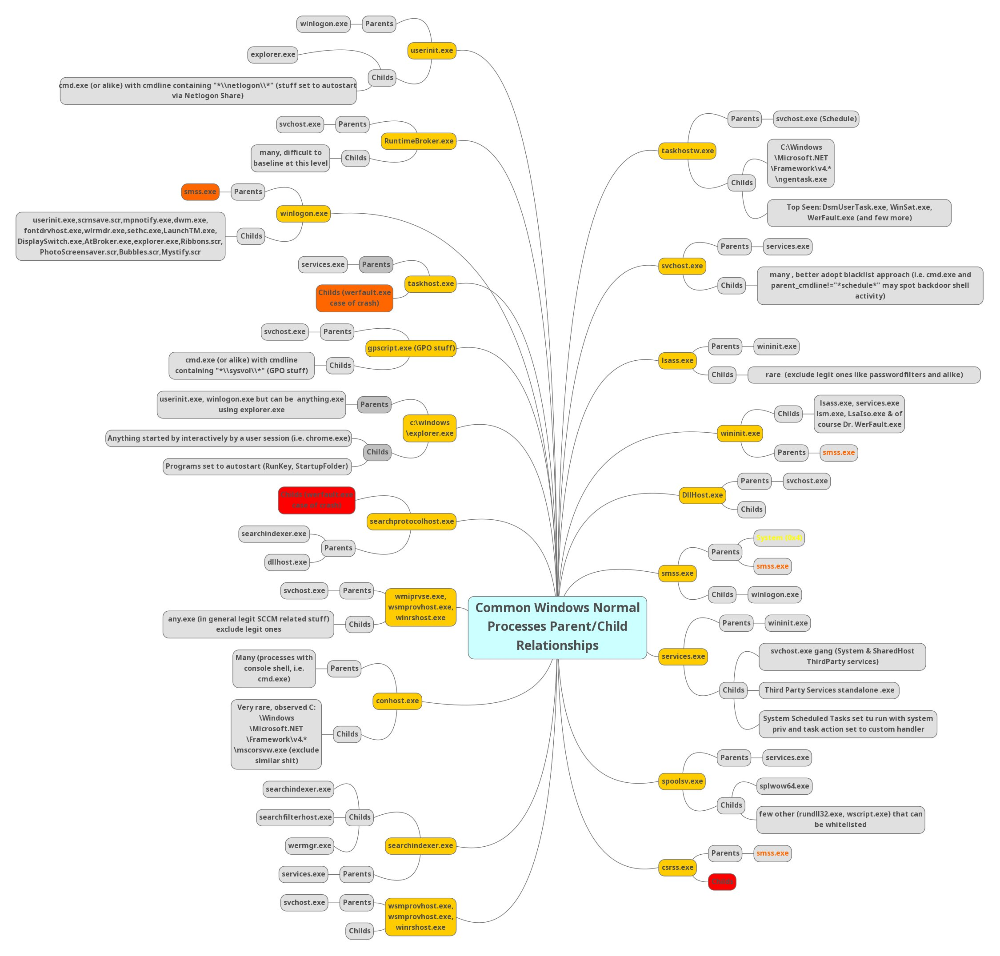

### [SANS Hunt Evil Poster](https://sansorg.egnyte.com/dl/WFdH1hHnQI)

<iframe
  src="/pdfs/SANS_DFPS_FOR508_v4.11_0624.pdf"
  width="100%"
  height="700px"
  style={{ border: 'none' }}
>
  Dieses Dokument kann leider nicht angezeigt werden.
  <a href="/pdfs/SANS_DFPS_FOR508_v4.11_0624.pdf">PDF öffnen</a>
</iframe>

---

By utilizing `Process Hacker`, we can **explore parent-child relationships within Windows**. Sorting the processes by dropdowns in the Processes view reveals a hierarchical representation of the relationships.

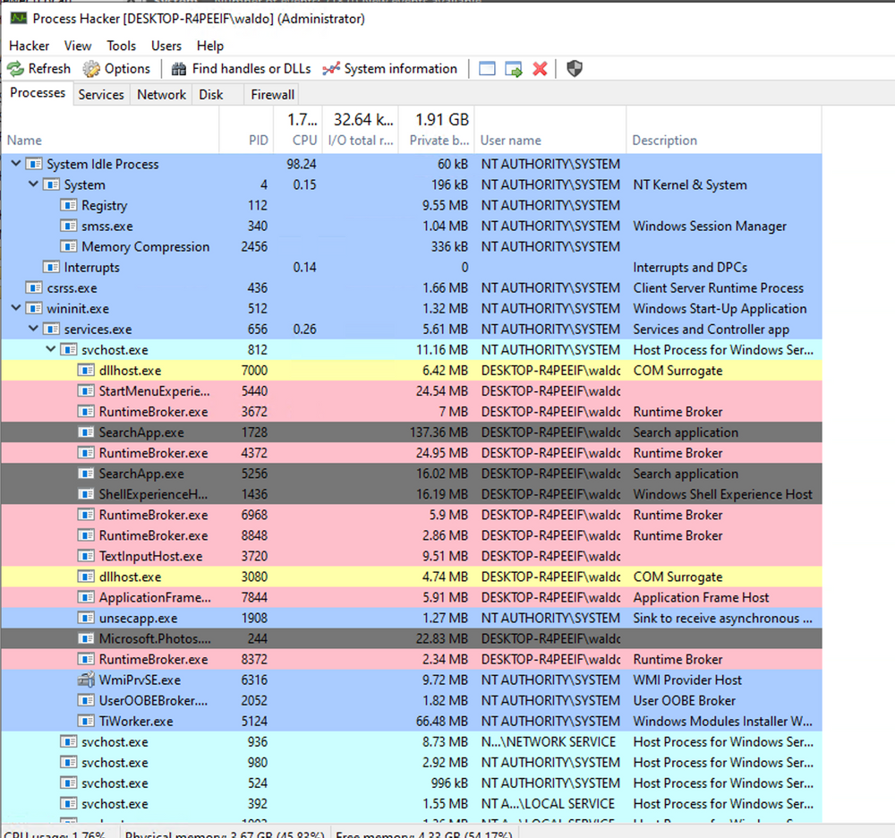

Analyzing these relationships in standard and custom environments enables us to identify deviations from normal patterns. For example, if we observe the "`spoolsv.exe`" process creating "`whoami.exe`" instead of its expected behavior of creating a "`conhost`", it raises suspicion.


To showcase a strange parent-child relationship, where "`cmd.exe`" appears to be created by "`spoolsv.exe`" **with no accompanying arguments**, we will utilize an **attacking technique called** `Parent PID Spoofing`. `Parent PID Spoofing` can be executed through the [psgetsystem project](https://github.com/decoder-it/psgetsystem) in the following manner.

```powershell
PS C:\Tools\psgetsystem> powershell -ep bypass
PS C:\Tools\psgetsystem> Import-Module .\psgetsys.ps1 
PS C:\Tools\psgetsystem> [MyProcess]::CreateProcessFromParent([Process ID of spoolsv.exe],"C:\Windows\System32\cmd.exe","")
```

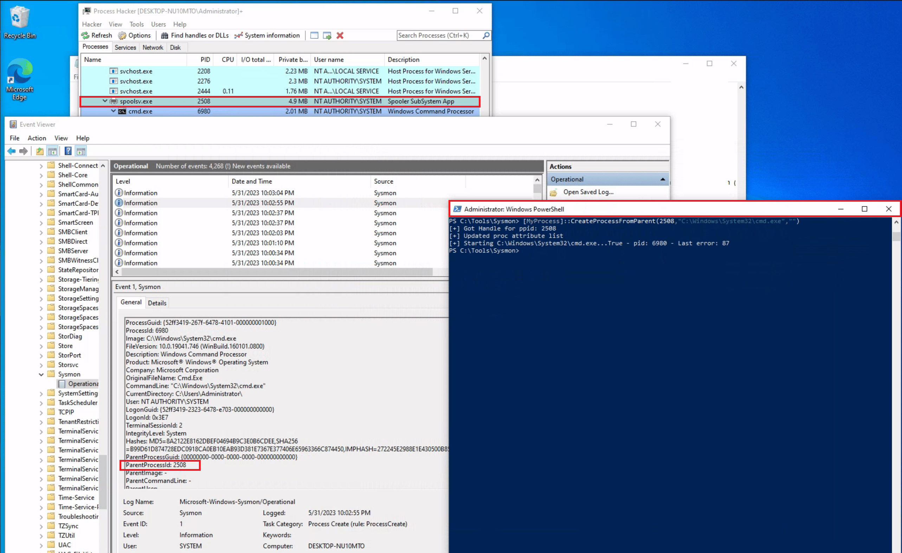

Due to the `parent PID spoofing` technique we employed, `Sysmon Event 1` **incorrectly displays** `spoolsv.exe` **as the parent of** `cmd.exe`. However, it was actually `powershell.exe` that created `cmd.exe`.

As we have previously discussed, although `Sysmon` and `event logs` **provide valuable telemetry for hunting and creating alert rules, they are not the only sources of information**. Let's begin by collecting data from the `Microsoft-Windows-Kernel-Process` provider using [SilkETW](https://github.com/mandiant/SilkETW) (the provider can be identified using `logman` as we described previously, `logman.exe query providers | findstr "Process"`). After that, we can proceed to simulate the attack again to assess whether `ETW` can provide us with more accurate information regarding the execution of `cmd.exe`.

```cmd
c:\Tools\SilkETW_SilkService_v8\v8\SilkETW>SilkETW.exe -t user -pn Microsoft-Windows-Kernel-Process -ot file -p C:\windows\temp\etw.json
```

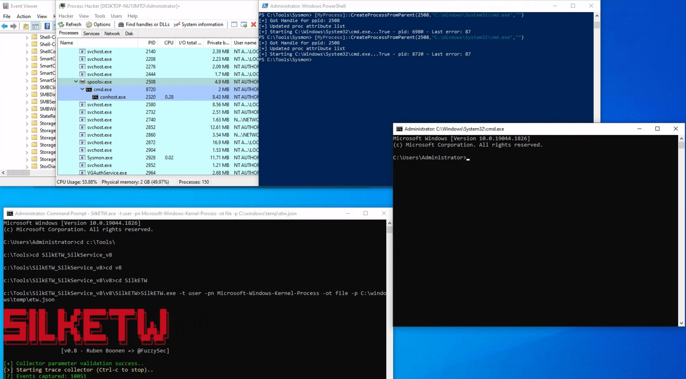

The `etw.json` file (that includes data from the `Microsoft-Windows-Kernel-Process` provider) seems to contain information about `powershell.exe` being the one who created `cmd.exe`.


It should be noted that `SilkETW event logs` can be **ingested** and **viewed by** `Windows Event Viewer` through `SilkService` to provide us with deeper and more extensive visibility into the actions performed on a system.

import Tabs from '@theme/Tabs';
import TabItem from '@theme/TabItem';

<Tabs>
  <TabItem value="cmd" label="Install SilkService">

```cmd
cd "C:\Tools\SilkETW_SilkService_v8\v8\"
sc create SilkService binPath="C:\Path\To\SilkService.exe" start=demand

[SC] CreateService SUCCESS
```

**Configuration**
SilkService ingests an XML configuration file, "`SilkServiceConfig.xml`", which should be placed in the same directory as the service binary. An example configuration file can be seen below.

```xml
<SilkServiceConfig>
  <ETWCollector>
    <!-- Randomly generated GUID -->
    <Guid>3ab1b390-88a1-4841-932b-271bd82b0266</Guid>
    <CollectorType>kernel</CollectorType>

    <!-- Core settings -->
    <ProviderName>Microsoft-Windows-Kernel-Process</ProviderName>
    <KernelKeywords>Process</KernelKeywords>

    <!-- Output logs to Windows Event Log -->
    <OutputType>eventlog</OutputType>

    <!-- Optional: Yara scanning folder -->
    <!-- <YaraScan>C:\Rules\Yara</YaraScan> -->
    <!-- <YaraOptions>Matches</YaraOptions> -->
  </ETWCollector>
</SilkServiceConfig>
```

:::info
Note that each **ETWCollector element should have a random GUID**, this is used for internal tracking and logging purposes. `You can generate GUID's in PowerShell using the following command`:
:::

```powershell
PS C:\> [guid]::NewGuid()

Guid
----
3ab1b390-88a1-4841-932b-271bd82b0266
```

  </TabItem>
  <TabItem value="StartService" label="Start SilkService">

```cmd
net start SilkService

The SilkService service is starting.
The SilkService service was started successfully.
```

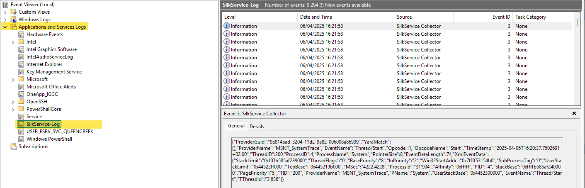

  </TabItem>

  <TabItem value="Testing" label="Testing">

```powershell
Start-Process cmd.exe
```

:::info
This creates a process - `SilkService` with the kernel provider `Microsoft-Windows-Kernel-Process` should recognize this and **write an event in the EventLog**.
:::

🪪 **Get PID of cmd.exe (and optionally of pwsh.exe)**

1. Open Process Hacker
2. Find `cmd.exe`
    - `Right-click` → `Properties` → `Copy PID and Parent PID (should be pwsh.exe)`
    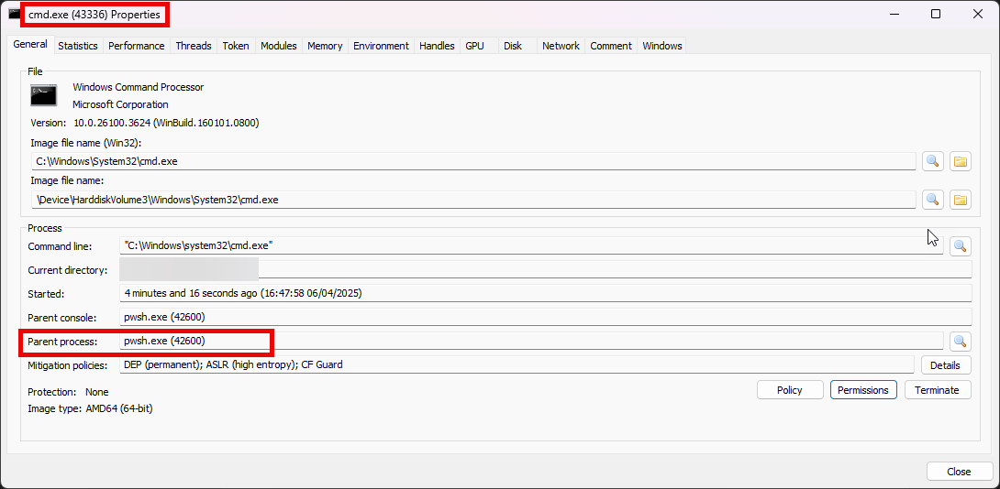
3. Note the start timestamp
    - 16:47:58

🕵️ **Sysmon**

1. Log Location
    - `Event Viewer` → `Applications and Services Logs` → `Microsoft` → `Windows` → `Sysmon` → `Operational`
2. Filter
    - Event ID: 1 (Process Create)
    - Look for
        - Image: `C:\Windows\System32\cmd.exe`
        - ParentImage `C:\Program Files\PowerShell\7\pwsh.exe`
        - ParentProcessId = `42600`
        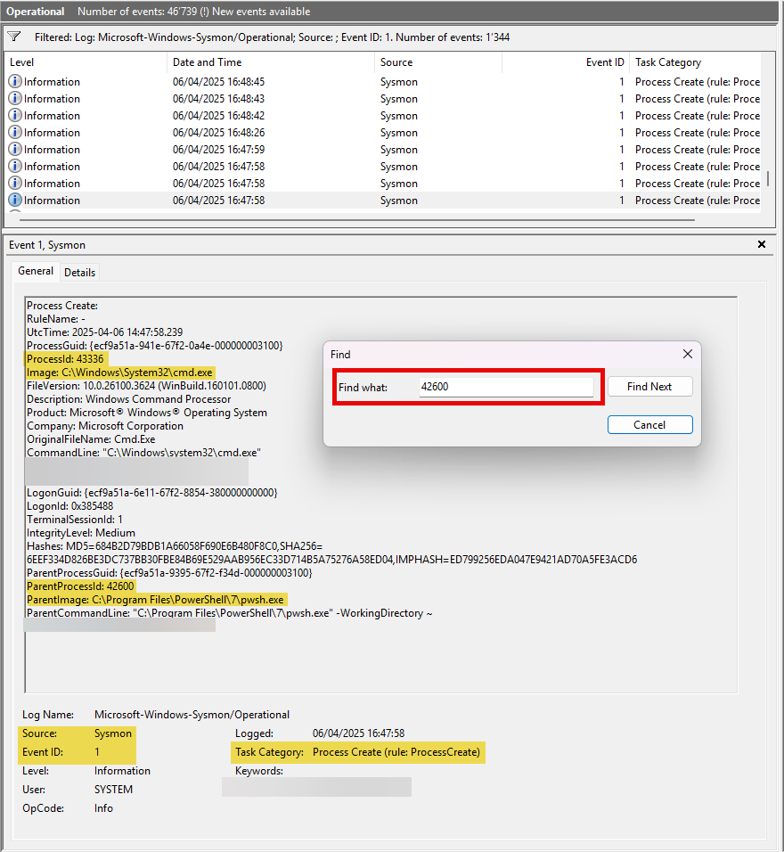

🔍 **Confirm**

- `cmd.exe` was launched by `pwsh.exe`
- Correct `timestamp`, `PID`, `PPID`

🧠 **SilkService**

1. Log Location
    - `Event Viewer` → `Applications and Services Logs` → `SilkService-Log`
2. Look for
    - Event ID: `3` from `SilkService Collector`
    - EventName: "`Process/DCStart`" or "`Thread/DCStart`"
    - ProcessName: "`cmd.exe`"
    - PName: "`pwsh.exe`"
        - This confirms the parent
    - `PID / PPID`: match what you got in Process Hacker and Sysmon

  </TabItem>
</Tabs>

---

## Detection Example 2: Detecting Malicious .NET Assembly Loading

Traditionally, adversaries employed a strategy known as ["Living off the Land" (LotL)](https://www.attackiq.com/2023/03/16/hiding-in-plain-sight/), **exploiting legitimate system tools, such as** `PowerShell`, to carry out their malicious operations. This approach reduces the risk of detection since it involves the use of tools that are native to the system, and therefore less likely to raise suspicion.

:::info
However, the cybersecurity community has adapted and developed countermeasures against this strategy.
:::

**Responding to these defensive advancements, attackers have developed a new approach that Mandiant labels as** ["Bring Your Own Land" (BYOL)](https://www.mandiant.com/resources/blog/bring-your-own-land-novel-red-teaming-technique). Instead of relying on the tools already present on a victim's system, **threat actors** and **penetration testers emulating these tactics now employ** `.NET assemblies executed entirely in memory`. This involves **creating custom-built tools using languages like** `C#`, rendering them independent of the pre-existing tools on the target system. The "`Bring Your Own Land`" lands is quite effective for the following reasons:

- Each W**indows system comes equipped** with a certain version of `.NET` pre-installed by default.

- A salient feature of `.NET` is its managed nature, alleviating the need for programmers to manually handle memory management. This attribute is part of the framework's managed code execution process, where the `Common Language Runtime (CLR)` takes responsibility for key system-level operations such as **garbage collection**, **eliminating memory leaks** and **ensuring more efficient resource utilization**.

- One of the intriguing advantages of using `.NET assemblies` is their **ability to be loaded directly into memory**. This means that an `executable` or `DLL` **does not need to be written physically to the disk** - instead, **it is executed directly in memory**. This behavior **minimizes the artifacts left behind on the system** and can **help bypass some forms of detection** that rely on **inspecting files written to disk**.

- **Microsoft has integrated a wide range of libraries into the** `.NET framework` to address numerous common programming challenges. These `libraries include functionalities for establishing HTTP connections, implementing cryptographic operations, and enabling inter-process communication (IPC)`, such as `named pipes`. These pre-built tools streamline the development process, reduce the likelihood of errors, and make it easier to build robust and efficient applications. Furthermore, **for a threat actor, these rich features provide a toolkit for creating more sophisticated and covert attack methods**.

A powerful illustration of this `BYOL strategy` is the ["execute-assembly"](https://www.cobaltstrike.com/blog/cobalt-strike-3-11-the-snake-that-eats-its-tail/) **command implemented in** `CobaltStrike`, a widely-used software platform for Adversary Simulations and Red Team Operations. `CobaltStrike's 'execute-assembly' command allows the user to execute .NET assemblies directly from memory`, making it an **ideal tool for implementing a** `BYOL strategy`.

In a manner akin to how we `detected the execution of unmanaged PowerShell scripts` through the observation of anomalous `clr.dll` and `clrjit.dll` loading activity in **processes that ordinarily wouldn't require them**, we can employ a similar approach **to identify malicious** `.NET assembly loading`. This is achieved by scrutinizing the activity related to the loading of [.NET-associated DLLs](https://redhead0ntherun.medium.com/detecting-net-c-injection-execute-assembly-1894dbb04ff7), specifically `clr.dll` and `mscoree.dll`.

Monitoring the loading of such libraries can help reveal attempts to execute `.NET assemblies in unusual or unexpected contexts`, which can be a sign of malicious activity. **This type of DLL loading behavior** can often be detected by leveraging `Sysmon's Event ID 7`, which corresponds to "`Image Loaded`" events.

For demonstrative purposes, **let's emulate a malicious .NET assembly load** by executing a precompiled version of [Seatbelt](https://github.com/GhostPack/Seatbelt) that resides on disk. `Seatbelt` is a well-known `.NET assembly`, **often employed by adversaries who load and execute it in memory to gain situational awareness on a compromised system**.

```powershell
PS C:\Tools\GhostPack Compiled Binaries>.\Seatbelt.exe TokenPrivileges

                        %&&@@@&&
                        &&&&&&&%%%,                       #&&@@@@@@%%%%%%###############%
                        &%&   %&%%                        &////(((&%%%%%#%################//((((###%%%%%%%%%%%%%%%
%%%%%%%%%%%######%%%#%%####%  &%%**#                      @////(((&%%%%%%######################(((((((((((((((((((
#%#%%%%%%%#######%#%%#######  %&%,,,,,,,,,,,,,,,,         @////(((&%%%%%#%#####################(((((((((((((((((((
#%#%%%%%%#####%%#%#%%#######  %%%,,,,,,  ,,.   ,,         @////(((&%%%%%%%######################(#(((#(#((((((((((
#####%%%####################  &%%......  ...   ..         @////(((&%%%%%%%###############%######((#(#(####((((((((
#######%##########%#########  %%%......  ...   ..         @////(((&%%%%%#########################(#(#######((#####
###%##%%####################  &%%...............          @////(((&%%%%%%%%##############%#######(#########((#####
#####%######################  %%%..                       @////(((&%%%%%%%################
                        &%&   %%%%%      Seatbelt         %////(((&%%%%%%%%#############*
                        &%%&&&%%%%%        v1.2.1         ,(((&%%%%%%%%%%%%%%%%%,
                         #%%%%##,


====== TokenPrivileges ======

Current Token's Privileges

                     SeIncreaseQuotaPrivilege:  DISABLED
                          SeSecurityPrivilege:  DISABLED
                     SeTakeOwnershipPrivilege:  DISABLED
                        SeLoadDriverPrivilege:  DISABLED
                     SeSystemProfilePrivilege:  DISABLED
                        SeSystemtimePrivilege:  DISABLED
              SeProfileSingleProcessPrivilege:  DISABLED
              SeIncreaseBasePriorityPrivilege:  DISABLED
                    SeCreatePagefilePrivilege:  DISABLED
                            SeBackupPrivilege:  DISABLED
                           SeRestorePrivilege:  DISABLED
                          SeShutdownPrivilege:  DISABLED
                             SeDebugPrivilege:  SE_PRIVILEGE_ENABLED
                 SeSystemEnvironmentPrivilege:  DISABLED
                      SeChangeNotifyPrivilege:  SE_PRIVILEGE_ENABLED_BY_DEFAULT, SE_PRIVILEGE_ENABLED
                    SeRemoteShutdownPrivilege:  DISABLED
                            SeUndockPrivilege:  DISABLED
                      SeManageVolumePrivilege:  DISABLED
                       SeImpersonatePrivilege:  SE_PRIVILEGE_ENABLED_BY_DEFAULT, SE_PRIVILEGE_ENABLED
                      SeCreateGlobalPrivilege:  SE_PRIVILEGE_ENABLED_BY_DEFAULT, SE_PRIVILEGE_ENABLED
                SeIncreaseWorkingSetPrivilege:  DISABLED
                          SeTimeZonePrivilege:  DISABLED
                SeCreateSymbolicLinkPrivilege:  DISABLED
    SeDelegateSessionUserImpersonatePrivilege:  DISABLED
```

Assuming we have `Sysmon` configured appropriately to `log image loading events (Event ID 7)`, executing '`Seatbelt`.exe' would trigger the loading of key `.NET-related DLLs` such as '`clr.dll`' and '`mscoree.dll`'. `Sysmon`, keenly observing system activities, **will log these DLL load operations as** `Event ID 7` **records**.

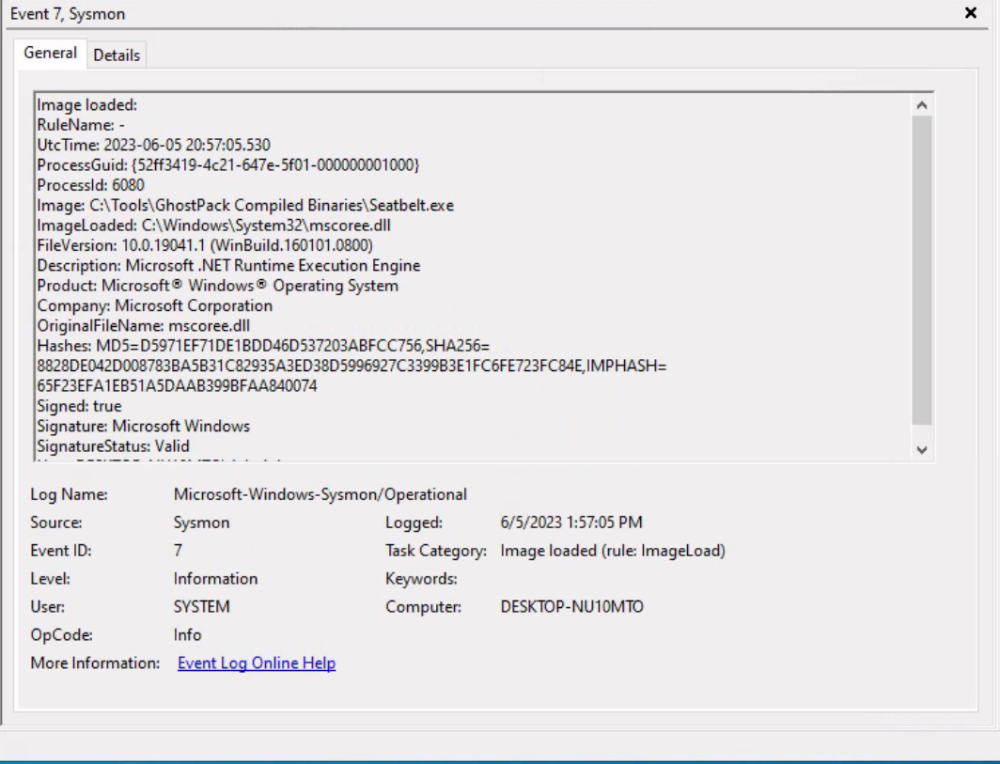
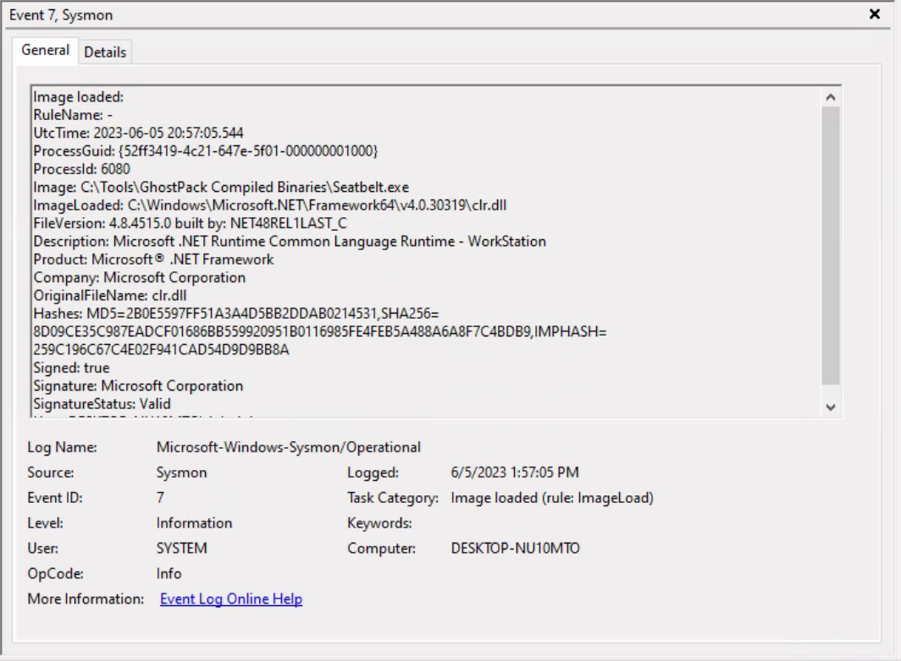

As already mentioned, relying solely on `Sysmon Event ID 7` for detecting attacks can be challenging due to the large volume of events it generates (especially if not configured properly). Additionally, while it informs us about the `DLLs` being loaded, it **doesn't provide granular details about the actual content of the loaded** `.NET assembly`.

To augment our visibility and gain deeper insights into the actual assembly being loaded, we can again leverage `Event Tracing for Windows (ETW)` and specifically the `Microsoft-Windows-DotNETRuntime` provider.

Let's use `SilkETW` to collect data from the `Microsoft-Windows-DotNETRuntime` provider. After that, we can proceed to simulate the attack again to evaluate whether `ETW` can furnish us with more detailed and actionable intelligence regarding the loading and execution of the '`Seatbelt`' `.NET assembly`.

```cmd
c:\Tools\SilkETW_SilkService_v8\v8\SilkETW>SilkETW.exe -t user -pn Microsoft-Windows-DotNETRuntime -uk 0x2038 -ot file -p C:\windows\temp\etw.json
```

```powershell
.\Seatbelt.exe TokenPrivileges


                        %&&@@@&&
                        &&&&&&&%%%,                       #&&@@@@@@%%%%%%###############%
                        &%&   %&%%                        &////(((&%%%%%#%################//((((###%%%%%%%%%%%%%%%
%%%%%%%%%%%######%%%#%%####%  &%%**#                      @////(((&%%%%%%######################(((((((((((((((((((
#%#%%%%%%%#######%#%%#######  %&%,,,,,,,,,,,,,,,,         @////(((&%%%%%#%#####################(((((((((((((((((((
#%#%%%%%%#####%%#%#%%#######  %%%,,,,,,  ,,.   ,,         @////(((&%%%%%%%######################(#(((#(#((((((((((
#####%%%####################  &%%......  ...   ..         @////(((&%%%%%%%###############%######((#(#(####((((((((
#######%##########%#########  %%%......  ...   ..         @////(((&%%%%%#########################(#(#######((#####
###%##%%####################  &%%...............          @////(((&%%%%%%%%##############%#######(#########((#####
#####%######################  %%%..                       @////(((&%%%%%%%################
                        &%&   %%%%%      Seatbelt         %////(((&%%%%%%%%#############*
                        &%%&&&%%%%%        v1.2.2         ,(((&%%%%%%%%%%%%%%%%%,
                         #%%%%##,


====== TokenPrivileges ======

Current Token's Privileges

                          SeShutdownPrivilege:  DISABLED
                      SeChangeNotifyPrivilege:  SE_PRIVILEGE_ENABLED_BY_DEFAULT, SE_PRIVILEGE_ENABLED
                            SeUndockPrivilege:  DISABLED
                SeIncreaseWorkingSetPrivilege:  DISABLED
                          SeTimeZonePrivilege:  DISABLED


[*] Completed collection in 0.012 seconds
```

The `etw.json` file (that includes data from the `Microsoft-Windows-DotNETRuntime` provider) seems to contain a wealth of information about the loaded assembly, including method names.

:::tip
You can use my [SilkETW Parser - Detect DotNETAssemblyLoad.ps1](https://github.com/trustinveritas/pentest-project-site/blob/main/FORENSIC/Windows-Event-Log/SilkETW-Parser/Detect-DotNetAssemblyLoad.ps1)
:::

```powershell
.\Detect-DotNetAssemblyLoad.ps1 -InputFile "C:\path\to\etw.json" -OutputFile "C:\path\to\report.md"
```

<details>
<summary>Parsed etw.json</summary>

| Timestamp | Provider | Event | Process | PID | TID (ThreadID) | Opcode |
|:----------|:---------|:------|:--------|----:|----:|:--------|
| 04/06/2025 17:44:40 | Microsoft-Windows-DotNETRuntime | Method/LoadVerbose | SilkETW | 38384 | 50840 | LoadVerbose |
| 04/06/2025 17:44:40 | Microsoft-Windows-DotNETRuntime | Method/LoadVerbose | SilkETW | 38384 | 50840 | LoadVerbose |
| 04/06/2025 17:44:40 | Microsoft-Windows-DotNETRuntime | Method/LoadVerbose | SilkETW | 38384 | 50840 | LoadVerbose |
| 04/06/2025 17:44:40 | Microsoft-Windows-DotNETRuntime | Loader/AssemblyLoad | SilkETW | 38384 | 50840 | AssemblyLoad |
| 04/06/2025 17:44:40 | Microsoft-Windows-DotNETRuntime | Method/LoadVerbose | SilkETW | 38384 | 50840 | LoadVerbose |
| 04/06/2025 17:44:41 | Microsoft-Windows-DotNETRuntime | Method/LoadVerbose | SilkETW | 38384 | 50840 | LoadVerbose |
| 04/06/2025 17:44:41 | Microsoft-Windows-DotNETRuntime | Method/LoadVerbose | SilkETW | 38384 | 50840 | LoadVerbose |
| 04/06/2025 17:44:41 | Microsoft-Windows-DotNETRuntime | Method/LoadVerbose | SilkETW | 38384 | 50840 | LoadVerbose |
| 04/06/2025 17:44:41 | Microsoft-Windows-DotNETRuntime | Loader/AssemblyLoad | SilkETW | 38384 | 50840 | AssemblyLoad |
| 04/06/2025 17:44:41 | Microsoft-Windows-DotNETRuntime | Loader/AssemblyLoad | SilkETW | 38384 | 50840 | AssemblyLoad |
| 04/06/2025 17:44:41 | Microsoft-Windows-DotNETRuntime | Method/LoadVerbose | SilkETW | 38384 | 50840 | LoadVerbose |
| 04/06/2025 17:44:41 | Microsoft-Windows-DotNETRuntime | Method/LoadVerbose | SilkETW | 38384 | 50840 | LoadVerbose |
| 04/06/2025 17:44:41 | Microsoft-Windows-DotNETRuntime | Method/LoadVerbose | SilkETW | 38384 | 50840 | LoadVerbose |
| 04/06/2025 17:44:41 | Microsoft-Windows-DotNETRuntime | Method/LoadVerbose | SilkETW | 38384 | 50840 | LoadVerbose |
| 04/06/2025 17:44:41 | Microsoft-Windows-DotNETRuntime | Method/LoadVerbose | SilkETW | 38384 | 50840 | LoadVerbose |
| 04/06/2025 17:44:41 | Microsoft-Windows-DotNETRuntime | Method/LoadVerbose | SilkETW | 38384 | 50840 | LoadVerbose |
| 04/06/2025 17:44:41 | Microsoft-Windows-DotNETRuntime | Method/LoadVerbose | SilkETW | 38384 | 50840 | LoadVerbose |
| 04/06/2025 17:44:41 | Microsoft-Windows-DotNETRuntime | Method/LoadVerbose | SilkETW | 38384 | 50840 | LoadVerbose |
| 04/06/2025 17:44:41 | Microsoft-Windows-DotNETRuntime | Method/LoadVerbose | SilkETW | 38384 | 50840 | LoadVerbose |
| 04/06/2025 17:44:41 | Microsoft-Windows-DotNETRuntime | Method/LoadVerbose | SilkETW | 38384 | 50840 | LoadVerbose |
| 04/06/2025 17:44:41 | Microsoft-Windows-DotNETRuntime | Method/LoadVerbose | SilkETW | 38384 | 50840 | LoadVerbose |
| 04/06/2025 17:44:41 | Microsoft-Windows-DotNETRuntime | Loader/AssemblyLoad | SilkETW | 38384 | 50840 | AssemblyLoad |
| 04/06/2025 17:44:41 | Microsoft-Windows-DotNETRuntime | Method/LoadVerbose | SilkETW | 38384 | 50840 | LoadVerbose |
| 04/06/2025 17:44:41 | Microsoft-Windows-DotNETRuntime | Method/LoadVerbose | SilkETW | 38384 | 50840 | LoadVerbose |
| 04/06/2025 17:44:41 | Microsoft-Windows-DotNETRuntime | Method/LoadVerbose | SilkETW | 38384 | 50840 | LoadVerbose |
| 04/06/2025 17:44:41 | Microsoft-Windows-DotNETRuntime | Method/LoadVerbose | SilkETW | 38384 | 50840 | LoadVerbose |
| 04/06/2025 17:44:41 | Microsoft-Windows-DotNETRuntime | Method/LoadVerbose | SilkETW | 38384 | 50840 | LoadVerbose |
| 04/06/2025 17:44:41 | Microsoft-Windows-DotNETRuntime | Method/LoadVerbose | SilkETW | 38384 | 50840 | LoadVerbose |
| 04/06/2025 17:44:41 | Microsoft-Windows-DotNETRuntime | Method/LoadVerbose | SilkETW | 38384 | 50840 | LoadVerbose |
| 04/06/2025 17:44:41 | Microsoft-Windows-DotNETRuntime | Method/LoadVerbose | SilkETW | 38384 | 50840 | LoadVerbose |
| 04/06/2025 17:44:41 | Microsoft-Windows-DotNETRuntime | Method/LoadVerbose | SilkETW | 38384 | 50840 | LoadVerbose |
| 04/06/2025 17:44:41 | Microsoft-Windows-DotNETRuntime | Method/LoadVerbose | SilkETW | 38384 | 50840 | LoadVerbose |
| 04/06/2025 17:44:41 | Microsoft-Windows-DotNETRuntime | Method/LoadVerbose | SilkETW | 38384 | 50840 | LoadVerbose |
| 04/06/2025 17:44:41 | Microsoft-Windows-DotNETRuntime | Method/LoadVerbose | SilkETW | 38384 | 50840 | LoadVerbose |
| 04/06/2025 17:44:41 | Microsoft-Windows-DotNETRuntime | Method/LoadVerbose | SilkETW | 38384 | 50840 | LoadVerbose |
| 04/06/2025 17:44:41 | Microsoft-Windows-DotNETRuntime | Method/LoadVerbose | SilkETW | 38384 | 50840 | LoadVerbose |
| 04/06/2025 17:44:41 | Microsoft-Windows-DotNETRuntime | Method/LoadVerbose | SilkETW | 38384 | 50840 | LoadVerbose |
| 04/06/2025 17:44:41 | Microsoft-Windows-DotNETRuntime | Method/LoadVerbose | SilkETW | 38384 | 50840 | LoadVerbose |
| 04/06/2025 17:44:41 | Microsoft-Windows-DotNETRuntime | Method/LoadVerbose | SilkETW | 38384 | 50840 | LoadVerbose |
| 04/06/2025 17:44:41 | Microsoft-Windows-DotNETRuntime | Method/LoadVerbose | SilkETW | 38384 | 50840 | LoadVerbose |
| 04/06/2025 17:44:41 | Microsoft-Windows-DotNETRuntime | Method/LoadVerbose | SilkETW | 38384 | 50840 | LoadVerbose |
| 04/06/2025 17:44:41 | Microsoft-Windows-DotNETRuntime | Method/LoadVerbose | SilkETW | 38384 | 50840 | LoadVerbose |
| 04/06/2025 17:44:41 | Microsoft-Windows-DotNETRuntime | Method/LoadVerbose | SilkETW | 38384 | 50840 | LoadVerbose |
| 04/06/2025 17:44:41 | Microsoft-Windows-DotNETRuntime | Method/LoadVerbose | SilkETW | 38384 | 50840 | LoadVerbose |
| 04/06/2025 17:44:41 | Microsoft-Windows-DotNETRuntime | Method/LoadVerbose | SilkETW | 38384 | 50840 | LoadVerbose |
| 04/06/2025 17:44:41 | Microsoft-Windows-DotNETRuntime | Method/LoadVerbose | SilkETW | 38384 | 50840 | LoadVerbose |
| 04/06/2025 17:44:41 | Microsoft-Windows-DotNETRuntime | Loader/AssemblyLoad | SilkETW | 38384 | 50840 | AssemblyLoad |
| 04/06/2025 17:44:41 | Microsoft-Windows-DotNETRuntime | Method/LoadVerbose | SilkETW | 38384 | 50840 | LoadVerbose |
| 04/06/2025 17:44:41 | Microsoft-Windows-DotNETRuntime | Method/LoadVerbose | SilkETW | 38384 | 50840 | LoadVerbose |
| 04/06/2025 17:44:41 | Microsoft-Windows-DotNETRuntime | Method/LoadVerbose | SilkETW | 38384 | 50840 | LoadVerbose |
| 04/06/2025 17:44:41 | Microsoft-Windows-DotNETRuntime | Method/LoadVerbose | SilkETW | 38384 | 50840 | LoadVerbose |
| 04/06/2025 17:44:41 | Microsoft-Windows-DotNETRuntime | Method/LoadVerbose | SilkETW | 38384 | 50840 | LoadVerbose |
| 04/06/2025 17:44:41 | Microsoft-Windows-DotNETRuntime | Method/LoadVerbose | SilkETW | 38384 | 50840 | LoadVerbose |
| 04/06/2025 17:44:41 | Microsoft-Windows-DotNETRuntime | Method/LoadVerbose | SilkETW | 38384 | 50840 | LoadVerbose |

### 🔧 Next steps

1. **Correlate with Sysmon Event ID 7**

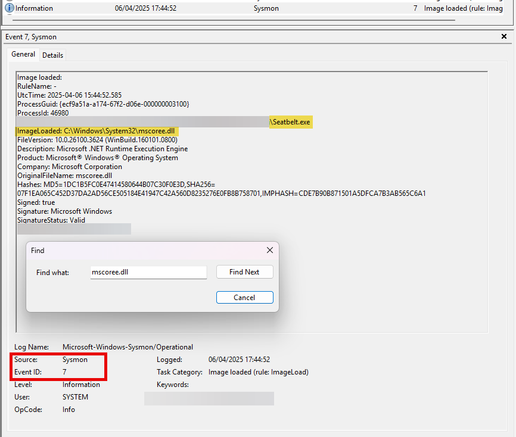

2. **Dig deeper with PowerShell**
    - Filter for `AssemblyLoad` and export as CSV or visualize timelines

    ```powershell
    $events = Get-Content C:\windows\temp\etw.json | ForEach-Object { $_ | ConvertFrom-Json }

    $dotNetAssemblies = $events | Where-Object { $_.EventName -like "*AssemblyLoad*" }

    $dotNetAssemblies | Select-Object TimeStamp, ProcessName, EventName, ProviderName, OpcodeName | Export-Csv .\dotnet_events.csv -NoTypeInformation
    ```

🕵️ **Correlate with expected behavior**  
Ask yourself:

- Was `Seatbelt.exe` run at that time?
- Do you see matching entries in:
    - Sysmon (Event ID 1 = Process Create)?
    - Event ID 7 = Image Load of `clr.dll`, `mscoree.dll`?

If yes → ✅ detection confirmed!

</details>

---

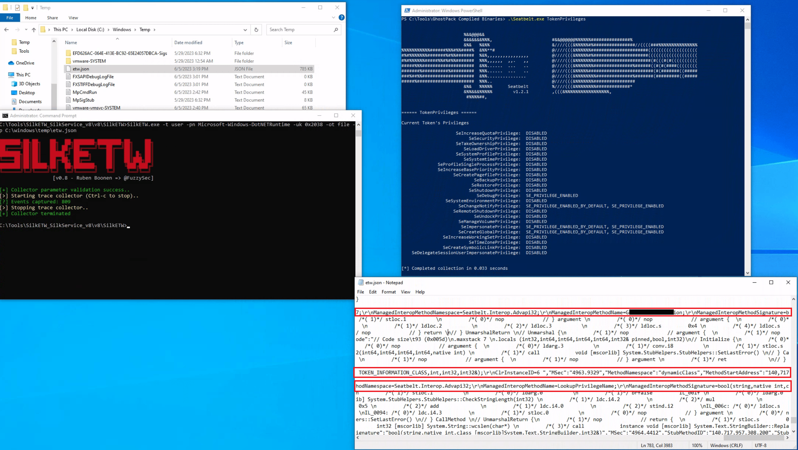

It's worth noting that in our current `SilkETW` configuration, **we're not capturing the entirety of events from the** "`Microsoft-Windows-DotNETRuntime`" provider. Instead, we're selectively targeting a specific subset (indicated by `0x2038`), which includes: `JitKeyword`, `InteropKeyword`, `LoaderKeyword`, and `NGenKeyword`.

- The `JitKeyword` relates to the `Just-In-Time (JIT)` compilation events, providing information on the methods being compiled at runtime. This could be particularly useful for understanding the execution flow of the `.NET assembly`.

- The `InteropKeyword` refers to Interoperability events, which come into play when managed code interacts with `unmanaged code`. These events could provide insights into potential interactions with `native APIs` or other unmanaged components.

- `LoaderKeyword` events provide details on the assembly loading process within the `.NET runtime`, which can be vital for understanding what `.NET assemblies` are being loaded and potentially executed.

- Lastly, the `NGenKeyword` corresponds to `Native Image Generator (NGen) events`, which are concerned with the creation and usage of `precompiled .NET assemblies`. **Monitoring these could help detect scenarios where attackers use** `precompiled .NET assemblies` **to evade JIT-related detections**.

This [blog post](https://medium.com/threat-hunters-forge/threat-hunting-with-etw-events-and-helk-part-1-installing-silketw-6eb74815e4a0) provides valuable perspectives on `SilkETW` as well as `the identification of malware based on .NET`.

## Practical Exercise

### Questions

#### 1. Replicate executing Seatbelt and SilkETW as described in this section and provide the ManagedInteropMethodName that starts with "G" and ends with "ion" as your answer. "c:\Tools\SilkETW_SilkService_v8\v8" and "C:\Tools\GhostPack Compiled Binaries" on the spawned target contain everything you need.

> GetTokenInformation

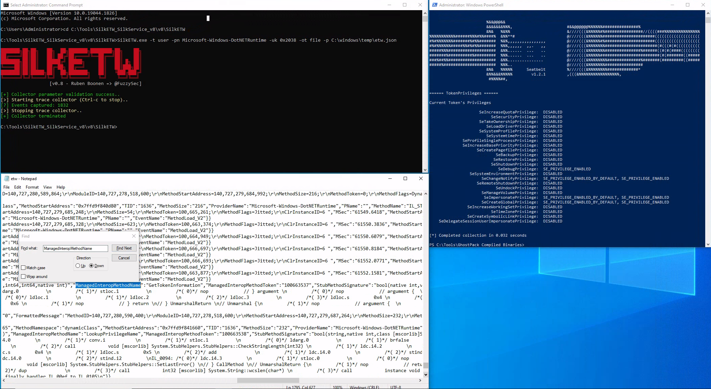