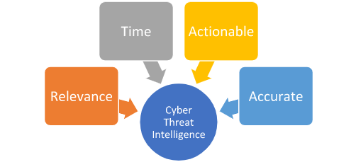

# 12. Threat Intelligence Fundamentals

## Cyber Threat Intelligence Definition

`Cyber Threat Intelligence (CTI)` represents a vital asset in our arsenal, providing essential insights to fortify our defenses against cyberattacks. The primary objective of our CTI team is to transition our defense strategies from merely reactive measures to a more **proactive**, **anticipatory stance**. They contribute crucial insights to our `Security Operations Center (SOC)`.

**Four fundamental principles make CTI an integral part of our cybersecurity strategy:**

