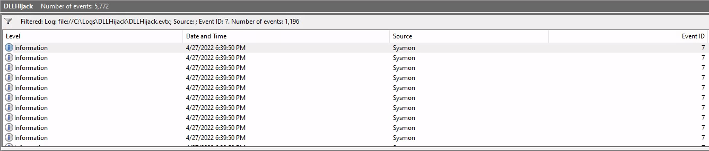

# Windows Event Logs & Finding Evil - Skills Assessment

To keep you sharp, your SOC manager has assigned you the task of **analyzing older attack logs and providing answers** to specific questions.

Navigate to the bottom of this section and click on Click here to spawn the target system!

RDP to [Target IP] using the provided credentials, **examine the logs located in the** `C:\Logs\*` directories, and answer the questions below.

---

## Questions

### 1. By examining the logs located in the "C:\Logs\DLLHijack" directory, determine the process responsible for executing a DLL hijacking attack. Enter the process name as your answer. Answer format: _.exe

> Dism.exe

1. Search Log `DLLHijack.evtx` for `Sysmon Event Type 7` - `Image loaded`



:::info
We have **5'772** Events
:::

2. Let's create a PowerShell Script

```powershell
$logPath = "C:\Logs\DLLHijack\DLLHijack.evtx"

$filter = @{
    Path = $logPath
    Id   = 7
}

Get-WinEvent -FilterHashtable $filter |
ForEach-Object {
    $procPath = $_.Properties[4].Value
    $dllPath  = $_.Properties[5].Value
    if ($dllPath -match "AppData|Temp|ProgramData|Public") {
        [PSCustomObject]@{
            TimeCreated = $_.TimeCreated
            Image       = $procPath
            ImageLoaded = $dllPath
        }
    }
}
```

#### ✅ Purpose
This script helps you quickly identify DLLs loaded from suspicious locations and see which process loaded them, so you can spot DLL hijacking attacks.

:::tip
Normal DLLs are loaded from `C:\Windows\System32`, etc. **If you see a DLL being loaded from a weird path, that’s suspicious**.

- AppData
- Temp
- ProgramData
- Public

:::

#### Output

```powershell
TimeCreated          Image                            ImageLoaded                
-----------          -----                            -----------                
4/27/2022 6:39:30 PM C:\Windows\System32\rundll32.exe C:\ProgramData\DismCore.dll
4/27/2022 6:39:11 PM C:\ProgramData\Dism.exe          C:\ProgramData\DismCore.dll
4/27/2022 6:39:11 PM C:\ProgramData\Dism.exe          C:\ProgramData\Dism.exe 
```

#### 🔎 Suspicious

Clue | Explanation
-----|-------------
`Dism.exe` is legit | Usually found in `C:\Windows\System32\`
DLL loaded from `C:\ProgramData\` | That’s **not** a standard location for system DLLs
DLL named like a core file: `DismCore.dll` | Could be named this way to trick `Dism.exe`
**Process** and **DLL** in **same unusual directory** | Strong sign of tampering — **a hijack setup**

3. Further Investigation

```powershell
$logPath = "C:\Logs\DLLHijack\DLLHijack.evtx"

$filter = @{
    Path = $logPath
    Id   = 1
}

Get-WinEvent -FilterHashtable $filter |
ForEach-Object {
    $imagePath = $_.Properties[4].Value
    $cmdLine  = $_.Properties[10].Value
    $cwd = $_.Properties[11].Value
    $User = $_.Properties[12].Value
    if ($cwd -match "AppData|Temp|ProgramData|Public") {
        [PSCustomObject]@{
            TimeCreated         = $_.TimeCreated
            Image               = $imagePath
            CommandLine         = $cmdLine
            CurrentDirectory    = $cwd
            User                = $User
        }
    }
}
```

#### Output

```powershell
imeCreated      : 4/27/2022 6:39:30 PM
Image            : C:\Windows\System32\rundll32.exe
CommandLine      : rundll32.exe  DismCore.dll,main
CurrentDirectory : C:\ProgramData\
User             : DESKTOP-R4PEEIF\waldo

TimeCreated      : 4/27/2022 6:39:23 PM
Image            : C:\Windows\System32\rundll32.exe
CommandLine      : rundll32.exe  DismCore.dll
CurrentDirectory : C:\ProgramData\
User             : DESKTOP-R4PEEIF\waldo

TimeCreated      : 4/27/2022 6:39:11 PM
Image            : C:\ProgramData\Dism.exe
CommandLine      : Dism
CurrentDirectory : C:\ProgramData\
User             : DESKTOP-R4PEEIF\waldo
```

#### ✅ What This Tells Us

- **Execution Chain Is Clear**
  - A fake `Dism.exe` was manually run from `C:\ProgramData\`
  - Then `rundll32.exe` was used to execute `DismCore.dll` — twice, with different entry points (`main` or `default`)
  - All execution happened in the **same working directory** (`C:\ProgramData\`) — a non-standard location.
- **Same User Context**
  - All executions were done by the same user: `DESKTOP-R4PEEIF\waldo`
  - This implies it was **launched locally**, likely by a **real user** or a **process acting on their behalf**.

### 2. By examining the logs located in the "C:\Logs\PowershellExec" directory, determine the process that executed unmanaged PowerShell code. Enter the process name as your answer. Answer format: _.exe

> Calculator.exe

1. Let's check for `Sysmon Event ID 7 - Image loaded`

:::info
We have 42'487 events.
:::

2. Let's find `clr.dll`, `mscoree.dll` or `clrjit.dll` with a PowerShell Script

```powershell
$logPath = "C:\Logs\PowershellExec\PowershellExec.evtx"

$filter = @{
    Path = $logPath
    Id   = 7
}

Get-WinEvent -FilterHashtable $filter |
ForEach-Object {
    $originalFileName = $_.Properties[10].Value
    $processId = $_.Properties[3].Value
    $image  = $_.Properties[4].Value
    $hash = $_.Properties[11].Value
    $Signed = $_.Properties[12].Value
    $SigStatus = $_.Properties[14].Value
    $User = $_.Properties[15].Value
    if ($originalFileName -match "clr.dll|mscoree.dll|clrjit.dll") {
        [PSCustomObject]@{
            TimeCreated         = $_.TimeCreated
            DLL                 = $originalFileName
            PID                 = $processId
            Process             = $image
            Hash                = $hash
            Signed              = $Signed
            SignatureStatus     = $SigStatus
            User                = $User
        }
    }
}
```

#### Output

```powershell
TimeCreated     : 4/27/2022 6:59:42 PM
DLL             : clrjit.dll
PID             : 3776
Process         : C:\Program Files\WindowsApps\Microsoft.WindowsCalculator_10.1906.55.0_x64__8wekyb3d8bbwe\Calculator.exe
Hash            : SHA1=078C7D64CF4D522E39CE9C1B3BC0333689DF3F40,MD5=61FDA7DD133D894630C2902900538647,SHA256=D8BB3F91EE89E3E4D6A418E7266DBCA1A354343226942C1E0A2E108F44DBCE5E,IMPHASH=9F2B44B648DE13A18C1ABC07250B85C2
Signed          : true
SignatureStatus : Valid
User            : DESKTOP-R4PEEIF\waldo

TimeCreated     : 4/27/2022 6:59:42 PM
DLL             : clr.dll
PID             : 3776
Process         : C:\Program Files\WindowsApps\Microsoft.WindowsCalculator_10.1906.55.0_x64__8wekyb3d8bbwe\Calculator.exe
Hash            : SHA1=C5A99CE7425E1A2245A4C0FAC6FFD725508A6897,MD5=3C242B76E36DAB6C0B1E300AE7BC3D2E,SHA256=99ED3CC3A8CA5938783C0CAA052AC72A104FB6C7777A56D3AD7D6BBA32D52969,IMPHASH=6851068577998FF473E5933122867348
Signed          : true
SignatureStatus : Valid
User            : DESKTOP-R4PEEIF\waldo

TimeCreated     : 4/27/2022 6:59:42 PM
DLL             : mscoree.dll
PID             : 3776
Process         : C:\Program Files\WindowsApps\Microsoft.WindowsCalculator_10.1906.55.0_x64__8wekyb3d8bbwe\Calculator.exe
Hash            : SHA1=CFEF8F0BA040939B87B74F101970A6BBEB5DA15F,MD5=D5971EF71DE1BDD46D537203ABFCC756,SHA256=8828DE042D008783BA5B31C82935A3ED38D5996927C3399B3E1FC6FE723FC84E,IMPHASH=65F23EFA1EB51A5DAAB399BFAA840074
Signed          : true
SignatureStatus : Valid
User            : DESKTOP-R4PEEIF\waldo

TimeCreated     : 4/27/2022 6:58:47 PM
DLL             : clrjit.dll
PID             : 6800
Process         : C:\Windows\System32\WindowsPowerShell\v1.0\powershell.exe
Hash            : SHA1=078C7D64CF4D522E39CE9C1B3BC0333689DF3F40,MD5=61FDA7DD133D894630C2902900538647,SHA256=D8BB3F91EE89E3E4D6A418E7266DBCA1A354343226942C1E0A2E108F44DBCE5E,IMPHASH=9F2B44B648DE13A18C1ABC07250B85C2
Signed          : true
SignatureStatus : Valid
User            : DESKTOP-R4PEEIF\waldo

TimeCreated     : 4/27/2022 6:58:45 PM
DLL             : clr.dll
PID             : 6800
Process         : C:\Windows\System32\WindowsPowerShell\v1.0\powershell.exe
Hash            : SHA1=C5A99CE7425E1A2245A4C0FAC6FFD725508A6897,MD5=3C242B76E36DAB6C0B1E300AE7BC3D2E,SHA256=99ED3CC3A8CA5938783C0CAA052AC72A104FB6C7777A56D3AD7D6BBA32D52969,IMPHASH=6851068577998FF473E5933122867348
Signed          : true
SignatureStatus : Valid
User            : DESKTOP-R4PEEIF\waldo

TimeCreated     : 4/27/2022 6:58:45 PM
DLL             : mscoree.dll
PID             : 6800
Process         : C:\Windows\System32\WindowsPowerShell\v1.0\powershell.exe
Hash            : SHA1=CFEF8F0BA040939B87B74F101970A6BBEB5DA15F,MD5=D5971EF71DE1BDD46D537203ABFCC756,SHA256=8828DE042D008783BA5B31C82935A3ED38D5996927C3399B3E1FC6FE723FC84E,IMPHASH=65F23EFA1EB51A5DAAB399BFAA840074
Signed          : true
SignatureStatus : Valid
User            : DESKTOP-R4PEEIF\waldo
```

3. Further investigation

```powershell
$filter = @{ Path = "C:\Logs\PowershellExec\PowershellExec.evtx"; Id = 7 }

Get-WinEvent -FilterHashtable $filter |
ForEach-Object {
    $dll = $_.Properties[10].Value
    $proc = $_.Properties[4].Value

    if (
        $dll -match "System\.Management\.Automation|System\.Reflection|System\.Runtime|amsi.dll|bcrypt.dll|clr.dll" -and
        $proc -match "C:\\Program Files\\WindowsApps\\Microsoft.WindowsCalculator_10\.1906\.55\.0_x64__8wekyb3d8bbwe\\Calculator.exe"
    ) {
        [PSCustomObject]@{
            TimeCreated = $_.TimeCreated
            Process     = $proc
            DLL         = $dll
        }
    }
}
```

#### Output

```powershell
TimeCreated          Process                                                                                                 DLL       
-----------          -------                                                                                                 ---       
4/27/2022 6:59:42 PM C:\Program Files\WindowsApps\Microsoft.WindowsCalculator_10.1906.55.0_x64__8wekyb3d8bbwe\Calculator.exe amsi.dll  
4/27/2022 6:59:42 PM C:\Program Files\WindowsApps\Microsoft.WindowsCalculator_10.1906.55.0_x64__8wekyb3d8bbwe\Calculator.exe clr.dll   
4/27/2022 6:58:37 PM C:\Program Files\WindowsApps\Microsoft.WindowsCalculator_10.1906.55.0_x64__8wekyb3d8bbwe\Calculator.exe bcrypt.dll
4/27/2022 6:58:10 PM C:\Program Files\WindowsApps\Microsoft.WindowsCalculator_10.1906.55.0_x64__8wekyb3d8bbwe\Calculator.exe bcrypt.dll
```

#### 🔍 What Does This Mean?
DLL | Meaning
----|-------------
`clr.dll` | The .NET CLR — required to run .NET code (e.g., PowerShell)
`bcrypt.dll` | Used for cryptographic operations, often invoked by PowerShell
`amsi.dll` | AntiMalware Scan Interface — **loaded only when PowerShell or script engines are running, so AV/EDR can scan content**

:::danger
Legitimate `Calculator.exe` should NOT load `amsi.dll` under normal use.

Means it ran `PowerShell in-memory` via the `Common Language Runtime - CLR` — no `powershell.exe` needed.
:::

### 3. By examining the logs located in the "C:\Logs\PowershellExec" directory, determine the process that injected into the process that executed unmanaged PowerShell code. Enter the process name as your answer. Answer format: _.exe

> rundll32.exe

1. Let's filter event log for `Sysmon Event ID 8` - `CreateRemoteThread in a remote process`

```powershell
$logPath = "C:\Logs\PowershellExec\PowershellExec.evtx"

$filter = @{
    Path = $logPath
    Id   = 8
}

Get-WinEvent -FilterHashtable $filter |
ForEach-Object {
    $sourceImage  = ($_.Properties[4].Value).ToString().Trim()
    $targetImage  = ($_.Properties[7].Value).ToString().Trim()
    $sourcePID    = $_.Properties[3].Value
    $targetPID    = $_.Properties[6].Value
    $startAddress = $_.Properties[9].Value
    $srcUser      = $_.Properties[12].Value
    $trgUser      = $_.Properties[13].Value

    if ($targetImage -like "*Calculator.exe") {
        [PSCustomObject]@{
            TimeCreated       = $_.TimeCreated
            InjectingProcess  = $sourceImage
            InjectingPID      = $sourcePID
            TargetProcess     = $targetImage
            TargetPID         = $targetPID
            StartAddress      = $startAddress
            SourceUser        = $srcUser
            TargetUser        = $trgUser
        }
    }
}
```

#### Output

```Powershell

TimeCreated      : 4/27/2022 7:00:13 PM
InjectingProcess : C:\Windows\System32\rundll32.exe
InjectingPID     : 8364
TargetProcess    : C:\Program Files\WindowsApps\Microsoft.WindowsCalculator_10.1906.55.0_x64__8wekyb3d8bbwe\Calculator.exe
TargetPID        : 3776
StartAddress     : 0x00000253B2180000
SourceUser       : DESKTOP-R4PEEIF\waldo
TargetUser       : DESKTOP-R4PEEIF\waldo

TimeCreated      : 4/27/2022 6:59:42 PM
InjectingProcess : C:\Windows\System32\rundll32.exe
InjectingPID     : 8364
TargetProcess    : C:\Program Files\WindowsApps\Microsoft.WindowsCalculator_10.1906.55.0_x64__8wekyb3d8bbwe\Calculator.exe
TargetPID        : 3776
StartAddress     : 0x0000025398BD0000
SourceUser       : DESKTOP-R4PEEIF\waldo
TargetUser       : DESKTOP-R4PEEIF\waldo
```

:::tip[Confirms]
➡️ That confirms Calculator.exe was used to run unmanaged PowerShell code, and rundll32.exe was the injector.
:::

> **Sysmon Event ID 8** confirms that `rundll32.exe` **(a known LOLBin)** injected threads into `Calculator.exe`. Shortly after, `Calculator.exe` **loaded key .NET and scripting-related DLLs** (`clr.dll`, `amsi.dll`). **This confirms that** `rundll32.exe` **was used to inject unmanaged PowerShell code into a trusted UWP app**.

### 4. By examining the logs located in the "C:\Logs\Dump" directory, determine the process that performed an LSASS dump. Enter the process name as your answer. Answer format: _.exe

> 

```powershell
$logPath = "C:\Logs\Dump\Dump.evtx"

$filter = @{
    Path = $logPath
    Id   = 10  # Sysmon: Process Access
}

Get-WinEvent -FilterHashtable $filter |
ForEach-Object {
    $sourceImage  = $_.Properties[5].Value
    $targetImage  = $_.Properties[8].Value
    $sourcePID    = $_.Properties[3].Value
    $targetPID    = $_.Properties[7].Value
    $grantedAccess = $_.Properties[9].Value
    $sourceUser   = $_.Properties[11].Value
    $targetUser   = $_.Properties[12].Value

    # Flag if LSASS is being accessed
    if ($targetImage -like "*lsass.exe") {
        # Check if non-system process accessed LSASS with high privileges
        if ($grantedAccess -eq "0x1fffff" -or $grantedAccess -eq "0x1010") {
            [PSCustomObject]@{
                TimeCreated     = $_.TimeCreated
                SourceProcess   = $sourceImage
                SourcePID       = $sourcePID
                TargetProcess   = $targetImage
                TargetPID       = $targetPID
                GrantedAccess   = $grantedAccess
                SourceUser      = $sourceUser
                TargetUser      = $targetUser
                Comment         = "LSASS Access - Potential Dump or Injection"
            }
        }
    }
}
```

#### Output

```powershell
TimeCreated   : 4/27/2022 7:08:56 PM
SourceProcess : C:\Users\waldo\Downloads\processhacker-3.0.4801-bin\64bit\ProcessHacker.exe
SourcePID     : 5560
TargetProcess : C:\Windows\system32\lsass.exe
TargetPID     : 6076
GrantedAccess : 2097151
SourceUser    : DESKTOP-R4PEEIF\waldo
TargetUser    : NT AUTHORITY\SYSTEM
Comment       : LSASS Access - Potential Dump or Injection

TimeCreated   : 4/27/2022 7:08:56 PM
SourceProcess : C:\Users\waldo\Downloads\processhacker-3.0.4801-bin\64bit\ProcessHacker.exe
SourcePID     : 5560
TargetProcess : C:\Windows\system32\lsass.exe
TargetPID     : 696
GrantedAccess : 2097151
SourceUser    : DESKTOP-R4PEEIF\waldo
TargetUser    : NT AUTHORITY\SYSTEM
Comment       : LSASS Access - Potential Dump or Injection
```

:::danger

Field | Value
------|---------
Process | `ProcessHacker.exe` (third-party tool)
Path | `Downloads\processhacker-3.0.4801-bin\64bit\ProcessHacker.exe`
Target | `lsass.exe`
GrantedAccess | `0x1fffff` = `2097151` → Full access rights
User Context | `waldo` accessing `SYSTEM`-owned process

:::

### 5. By examining the logs located in the "C:\Logs\Dump" directory, determine if an ill-intended login took place after the LSASS dump. Answer format: Yes or No

> No

#### Option A: Sysmon `Event ID 4624` (from `Security` log)

In `.evtx`, this is the Windows Security Event for a successful login.

Look for:

Field | Value
------|-----------
Event ID | `4624`
Logon Type | `2`, `3`, or `10` (`interactive`, `network`, `remote interactive`)
Account Name | Same as previously dumped or admin-level
Time | Occurring after the LSASS dump time (e.g., `7:08:56 PM`)

#### Logon Type 2

```xml
<QueryList>
  <Query Id="0" Path="file://C:\Logs\Dump\SecurityLogs.evtx">
    <Select Path="file://C:\Logs\Dump\SecurityLogs.evtx">*[System[(EventID=4624)]] and *[EventData[Data[@Name='LogonType']='2']]</Select>
  </Query>
</QueryList>
```

#### Logon Type 3

```xml
<QueryList>
  <Query Id="0" Path="file://C:\Logs\Dump\SecurityLogs.evtx">
    <Select Path="file://C:\Logs\Dump\SecurityLogs.evtx">*[System[(EventID=4624)]] and *[EventData[Data[@Name='LogonType']='3']]</Select>
  </Query>
</QueryList>
```

#### Logon Type 10

```xml
<QueryList>
  <Query Id="0" Path="file://C:\Logs\Dump\SecurityLogs.evtx">
    <Select Path="file://C:\Logs\Dump\SecurityLogs.evtx">*[System[(EventID=4624)]] and *[EventData[Data[@Name='LogonType']='10']]</Select>
  </Query>
</QueryList>
```

---

#### Option B: Sysmon `Event ID 1`

This shows n**ew process creation**

- `cmd.exe`, `powershell.exe`, `runas.exe`, or suspicious `explorer.exe` sessions
- Launched **after the LSASS dump timestamp**
- Under a **different user context**

```powershell
$logPath = "C:\Logs\Dump\LsassDump.evtx"
$dumpTime = Get-Date "2022-04-27 19:08:56"

$filter = @{
    Path       = $logPath
    Id         = 1                     # Sysmon: Process Creation
    StartTime  = $dumpTime             # Only events after the dump
}

Get-WinEvent -FilterHashtable $filter |
ForEach-Object {
    $props = $_.Properties

    [PSCustomObject]@{
        TimeCreated       = $_.TimeCreated
        Image             = $props[5].Value
        CommandLine       = $props[10].Value
        User              = $props[12].Value
        ParentImage       = $props[17].Value
        ParentCommandLine = $props[18].Value
        ParentUser        = $props[19].Value
    }
}
```

#### Output

```powershell
TimeCreated       : 4/27/2022 7:09:51 PM
Image             : 10.0.19041.1566 (WinBuild.160101.0800)
CommandLine       : \??\C:\Windows\system32\conhost.exe 0xffffffff -ForceV1
User              : NT AUTHORITY\SYSTEM
ParentImage       : SHA1=52A7274A0B4F9493632060FE25993A2EF24FE827,MD5=0D698AF330FD17BEE3BF90011D49251D,SHA256=3C1C6D813D2B031D988204155FC198FE4F32FF56C05DABBCFCD5486131F4FB9D,IMPHASH=C21B297AEB85CEF1BCCE8D72106BBDD0
ParentCommandLine : 67e39d39-f76f-6269-7103-000000000300
ParentUser        : 3668

TimeCreated       : 4/27/2022 7:09:51 PM
Image             : 10.0.19041.1202 (WinBuild.160101.0800)
CommandLine       : C:\Windows\system32\dmclient.exe utcwnf
User              : NT AUTHORITY\SYSTEM
ParentImage       : SHA1=914F9A5DADEC0B5CE5774E3D0826E5C01A040AA8,MD5=2210FE3B3E1B85A401749FACEF6E4958,SHA256=C41258FA588B650483DEE87057AA82F7B855EB257D3D25BE41F71E90C8CA9746,IMPHASH=3F53CAD1BAC93EE5AC20EA3E53FE8CD2
ParentCommandLine : 67e39d39-ecdb-6269-2600-000000000300
ParentUser        : 1600

TimeCreated       : 4/27/2022 7:09:47 PM
Image             : 10.0.19041.546 (WinBuild.160101.0800)
CommandLine       : C:\Windows\system32\DllHost.exe /Processid:{AB8902B4-09CA-4BB6-B78D-A8F59079A8D5}
User              : DESKTOP-R4PEEIF\waldo
ParentImage       : SHA1=2CE12A317BEBF8293F3544433A55D972A5967996,MD5=08EB78E5BE019DF044C26B14703BD1FA,SHA256=E7FC40B41AA8B83841A0B96D169EAF0800AA784733E636935374D56536253F10,IMPHASH=CF79FCE90FCED31836373F3E48251A5D
ParentCommandLine : 67e39d39-ecd9-6269-0d00-000000000300
ParentUser        : 804

TimeCreated       : 4/27/2022 7:09:45 PM
Image             : 10.0.19041.1566 (WinBuild.160101.0800)
CommandLine       : C:\Windows\system32\svchost.exe -k wusvcs -p -s WaaSMedicSvc
User              : NT AUTHORITY\SYSTEM
ParentImage       : SHA1=1F912D4BEC338EF10B7C9F19976286F8ACC4EB97,MD5=CD10CB894BE2128FCA0BF0E2B0C27C16,SHA256=F3FEB95E7BCFB0766A694D93FCA29EDA7E2CA977C2395B4BE75242814EB6D881,IMPHASH=F9BBD96FAE53B7A31264A703CAFA0666
ParentCommandLine : 67e39d39-ecd9-6269-0b00-000000000300
ParentUser        : 656

TimeCreated       : 4/27/2022 7:09:44 PM
Image             : 10.0.19041.546 (WinBuild.160101.0800)
CommandLine       : C:\Windows\system32\wbem\wmiprvse.exe -secured -Embedding
User              : NT AUTHORITY\NETWORK SERVICE
ParentImage       : SHA1=3EA7CC066317AC45F963C2227C4C7C50AA16EB7C,MD5=60FF40CFD7FB8FE41EE4FE9AE5FE1C51,SHA256=2198A7B58BCCB758036B969DDAE6CC2ECE07565E2659A7C541A313A0492231A3,IMPHASH=B71CB3AC5C352BEC857C940CBC95F0F3
ParentCommandLine : 67e39d39-ecd9-6269-0d00-000000000300
ParentUser        : 804

TimeCreated       : 4/27/2022 7:09:44 PM
Image             : 10.0.19041.1566 (WinBuild.160101.0800)
CommandLine       : C:\Windows\system32\svchost.exe -k netsvcs -p -s wuauserv
User              : NT AUTHORITY\SYSTEM
ParentImage       : SHA1=1F912D4BEC338EF10B7C9F19976286F8ACC4EB97,MD5=CD10CB894BE2128FCA0BF0E2B0C27C16,SHA256=F3FEB95E7BCFB0766A694D93FCA29EDA7E2CA977C2395B4BE75242814EB6D881,IMPHASH=F9BBD96FAE53B7A31264A703CAFA0666
ParentCommandLine : 67e39d39-ecd9-6269-0b00-000000000300
ParentUser        : 656

TimeCreated       : 4/27/2022 7:09:44 PM
Image             : 10.0.19041.1620 (WinBuild.160101.0800)
CommandLine       : C:\Windows\System32\mousocoreworker.exe -Embedding
User              : NT AUTHORITY\SYSTEM
ParentImage       : SHA1=2B096F0FFBFFBDD8ACB84D087C07A5848DD4555B,MD5=F25558AA28DE7D0F90ACEA4B14CA6446,SHA256=75805868A17B2B245A5C0EBA5A222B770198A76319CF9FD0958F8F11EA966CDA,IMPHASH=4F8F44BDF9E6EDF9B44D1DF38F33C6C2
ParentCommandLine : 67e39d39-ecd9-6269-0d00-000000000300
ParentUser        : 804

TimeCreated       : 4/27/2022 7:09:43 PM
Image             : 10.0.19041.746 (WinBuild.160101.0800)
CommandLine       : C:\Windows\System32\RuntimeBroker.exe -Embedding
User              : DESKTOP-R4PEEIF\waldo
ParentImage       : SHA1=AB8539EF6B2A93FF9589DEC4B34A0257B6296C92,MD5=BA4CFE6461AFA1004C52F19C8F2169DC,SHA256=E86870769EE6C797E09457BD99C58D9BF2303CF0193A24EF9B1222C2C3DAF628,IMPHASH=D4D98ACF3243E0C97C83C6548571A44E
ParentCommandLine : 67e39d39-ecd9-6269-0d00-000000000300
ParentUser        : 804

TimeCreated       : 4/27/2022 7:09:43 PM
Image             : 10.0.19041.746 (WinBuild.160101.0800)
CommandLine       : C:\Windows\System32\RuntimeBroker.exe -Embedding
User              : DESKTOP-R4PEEIF\waldo
ParentImage       : SHA1=AB8539EF6B2A93FF9589DEC4B34A0257B6296C92,MD5=BA4CFE6461AFA1004C52F19C8F2169DC,SHA256=E86870769EE6C797E09457BD99C58D9BF2303CF0193A24EF9B1222C2C3DAF628,IMPHASH=D4D98ACF3243E0C97C83C6548571A44E
ParentCommandLine : 67e39d39-ecd9-6269-0d00-000000000300
ParentUser        : 804

TimeCreated       : 4/27/2022 7:09:43 PM
Image             : 10.0.19041.746 (WinBuild.160101.0800)
CommandLine       : C:\Windows\System32\RuntimeBroker.exe -Embedding
User              : DESKTOP-R4PEEIF\waldo
ParentImage       : SHA1=AB8539EF6B2A93FF9589DEC4B34A0257B6296C92,MD5=BA4CFE6461AFA1004C52F19C8F2169DC,SHA256=E86870769EE6C797E09457BD99C58D9BF2303CF0193A24EF9B1222C2C3DAF628,IMPHASH=D4D98ACF3243E0C97C83C6548571A44E
ParentCommandLine : 67e39d39-ecd9-6269-0d00-000000000300
ParentUser        : 804

TimeCreated       : 4/27/2022 7:09:43 PM
Image             : 10.0.19041.546 (WinBuild.160101.0800)
CommandLine       : "C:\Windows\system32\BackgroundTaskHost.exe" -ServerName:BackgroundTaskHost.WebAccountProvider
User              : DESKTOP-R4PEEIF\waldo
ParentImage       : SHA1=C6E63C7AAE9C4E07E15C1717872C0C73F3D4FB09,MD5=DA7063B17DBB8BBB3015351016868006,SHA256=20330D3CA71D58F4AEB432676CB6A3D5B97005954E45132FB083E90782EFDD50,IMPHASH=D2ACF1CBC4A6DB14A34C687B9362D66B
ParentCommandLine : 67e39d39-ecd9-6269-0d00-000000000300
ParentUser        : 804

TimeCreated       : 4/27/2022 7:09:42 PM
Image             : 10.0.19041.546 (WinBuild.160101.0800)
CommandLine       : "C:\Windows\system32\backgroundTaskHost.exe" -ServerName:App.AppXmtcan0h2tfbfy7k9kn8hbxb6dmzz1zh0.mca
User              : DESKTOP-R4PEEIF\waldo
ParentImage       : SHA1=C6E63C7AAE9C4E07E15C1717872C0C73F3D4FB09,MD5=DA7063B17DBB8BBB3015351016868006,SHA256=20330D3CA71D58F4AEB432676CB6A3D5B97005954E45132FB083E90782EFDD50,IMPHASH=D2ACF1CBC4A6DB14A34C687B9362D66B
ParentCommandLine : 67e39d39-ecd9-6269-0d00-000000000300
ParentUser        : 804

TimeCreated       : 4/27/2022 7:09:42 PM
Image             : 10.0.19041.546 (WinBuild.160101.0800)
CommandLine       : "C:\Windows\system32\backgroundTaskHost.exe" -ServerName:Microsoft.MicrosoftOfficeHub.AppX54h2e8jwdm50fj5ha8987vz1etpx7czd.mca
User              : DESKTOP-R4PEEIF\waldo
ParentImage       : SHA1=C6E63C7AAE9C4E07E15C1717872C0C73F3D4FB09,MD5=DA7063B17DBB8BBB3015351016868006,SHA256=20330D3CA71D58F4AEB432676CB6A3D5B97005954E45132FB083E90782EFDD50,IMPHASH=D2ACF1CBC4A6DB14A34C687B9362D66B
ParentCommandLine : 67e39d39-ecd9-6269-0d00-000000000300
ParentUser        : 804

TimeCreated       : 4/27/2022 7:09:06 PM
Image             : 10.0.19041.546 (WinBuild.160101.0800)
CommandLine       : C:\Windows\system32\DllHost.exe /Processid:{AB8902B4-09CA-4BB6-B78D-A8F59079A8D5}
User              : DESKTOP-R4PEEIF\waldo
ParentImage       : SHA1=2CE12A317BEBF8293F3544433A55D972A5967996,MD5=08EB78E5BE019DF044C26B14703BD1FA,SHA256=E7FC40B41AA8B83841A0B96D169EAF0800AA784733E636935374D56536253F10,IMPHASH=CF79FCE90FCED31836373F3E48251A5D
ParentCommandLine : 67e39d39-ecd9-6269-0d00-000000000300
ParentUser        : 804

TimeCreated       : 4/27/2022 7:08:57 PM
Image             : 10.0.19041.546 (WinBuild.160101.0800)
CommandLine       : C:\Windows\system32\DllHost.exe /Processid:{AB8902B4-09CA-4BB6-B78D-A8F59079A8D5}
User              : DESKTOP-R4PEEIF\waldo
ParentImage       : SHA1=2CE12A317BEBF8293F3544433A55D972A5967996,MD5=08EB78E5BE019DF044C26B14703BD1FA,SHA256=E7FC40B41AA8B83841A0B96D169EAF0800AA784733E636935374D56536253F10,IMPHASH=CF79FCE90FCED31836373F3E48251A5D
ParentCommandLine : 67e39d39-ecd9-6269-0d00-000000000300
ParentUser        : 804
```

### 🧠 What We're Looking For

To say “**Yes**”, we would expect to see something like:

- A new **interactive session** launched (e.g., `explorer.exe`, `cmd.exe`, `powershell.exe`, etc.)
- A process running as a **different user** (e.g., `NT AUTHORITY\SYSTEM` **after LSASS access by** `waldo`)
- Or any other process suggesting use of **stolen credentials**

Clue | Result
-----|----------
Most processes | Run as `DESKTOP-R4PEEIF\waldo` or `NT AUTHORITY\SYSTEM`
No unusual logons | No new logon sessions (e.g., no `explorer.exe` from `SYSTEM`)
Most activity | Related to `RuntimeBroker.exe`, `svchost.exe`, `dllhost.exe`, `conhost.exe` (**normal background services**)
`dmclient.exe` & `mousocoreworker.exe` | **Normal Windows telemetry/update clients**
All parent/child chains | Appear to be standard system behavior or trusted update/task processes


### 6. By examining the logs located in the "C:\Logs\StrangePPID" directory, determine a process that was used to temporarily execute code based on a strange parent-child relationship. Enter the process name as your answer. Answer format: _.exe

> WerFault.exe

```powershell
# Set the path to the event log
$logPath = "C:\Logs\StrangePPID\StrangePPID.evtx"

# Filter for Sysmon Event ID 1: Process Creation
$filter = @{
    Path = $logPath
    Id   = 1
}

# Process each event and extract suspicious parent-child combinations
Get-WinEvent -FilterHashtable $filter |
ForEach-Object {
    $props = $_.Properties

    $childProcess  = $props[4].Value
    $commandLine   = $props[10].Value
    $user          = $props[12].Value
    $parentProcess = $props[20].Value
    $parentCmdLine = $props[21].Value
    $parentUser    = $props[22].Value

    # Example heuristic: suspicious if parent is not typical for the child
    if (
        $childProcess -match "powershell.exe|cmd.exe|rundll32.exe|mshta.exe" -and
        $parentProcess -notmatch "explorer.exe|services.exe|wininit.exe|taskmgr.exe"
    ) {
        [PSCustomObject]@{
            TimeCreated     = $_.TimeCreated
            ParentProcess   = $parentProcess
            ChildProcess    = $childProcess
            CommandLine     = $commandLine
            User            = $user
            ParentUser      = $parentUser
            ParentCmdLine   = $parentCmdLine
        }
    }
}
```

#### Output

```powershell
TimeCreated   : 4/27/2022 7:18:06 PM
ParentProcess : C:\Windows\System32\WerFault.exe
ChildProcess  : C:\Windows\System32\cmd.exe
CommandLine   : cmd.exe /c whoami
User          : DESKTOP-R4PEEIF\waldo
ParentUser    : DESKTOP-R4PEEIF\waldo
ParentCmdLine : "C:\\Windows\\System32\\werfault.exe"
```

#### 🔍 What It Does

1. Looks for Suspicious Combinations

```powershell
if (
    $childProcess -match "powershell.exe|cmd.exe|rundll32.exe|mshta.exe" -and
    $parentProcess -notmatch "explorer.exe|services.exe|wininit.exe|taskmgr.exe"
)
```

This checks

- Is the `child process` a **commonly abused binary**?
- Is the `parent process` **not one of the usual, legitimate ones**?

> If yes → it considers the relationship suspicious.

#### 🚨 What Makes This Suspicious?

1. `WerFault.exe` shouldn't launch `cmd.exe`
    - `WerFault.exe` is the **Windows Error Reporting** process.
    - Its legitimate job is to **handle crash dialogs** or **memory dumps** — not spawn shells like `cmd.exe`.

2. `cmd.exe` was used to run a command
    - `cmd.exe /c whoami` suggests code execution was attempted temporarily.
    - `whoami` is **commonly used by attackers** or **scripts to verify context/privilege**.

3. Same user (`waldo`) ran both
    - While the user is the same (not SYSTEM or a service), the behavior is **not normal for everyday usage**.