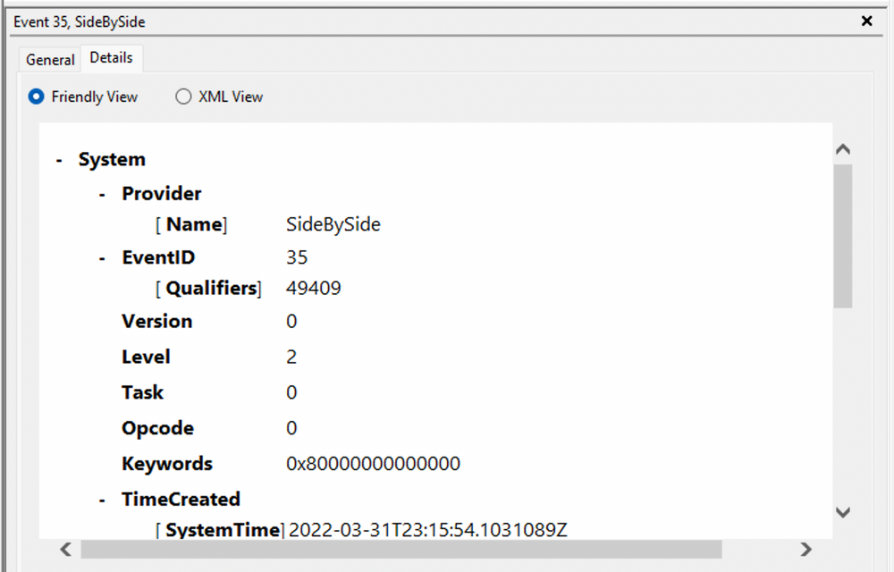
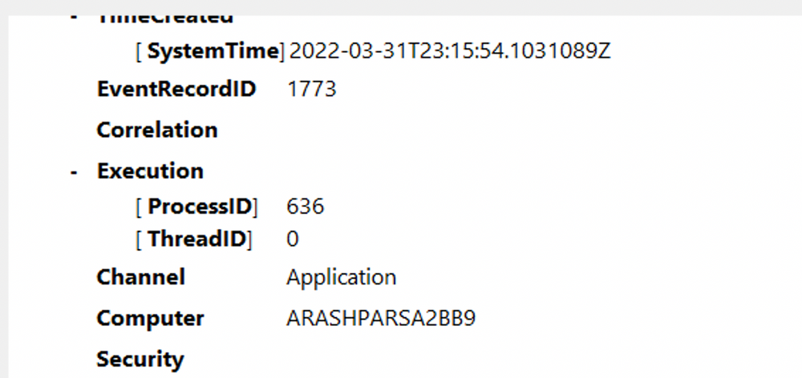
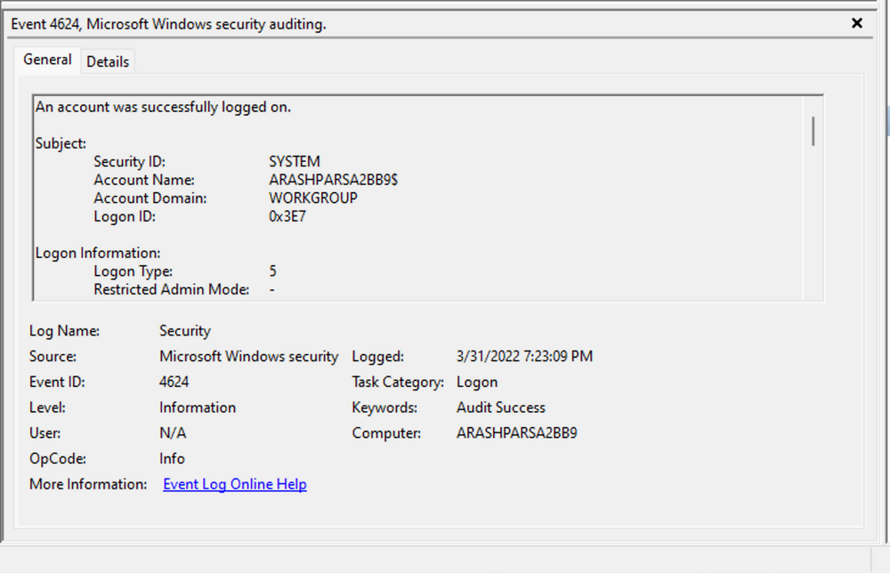
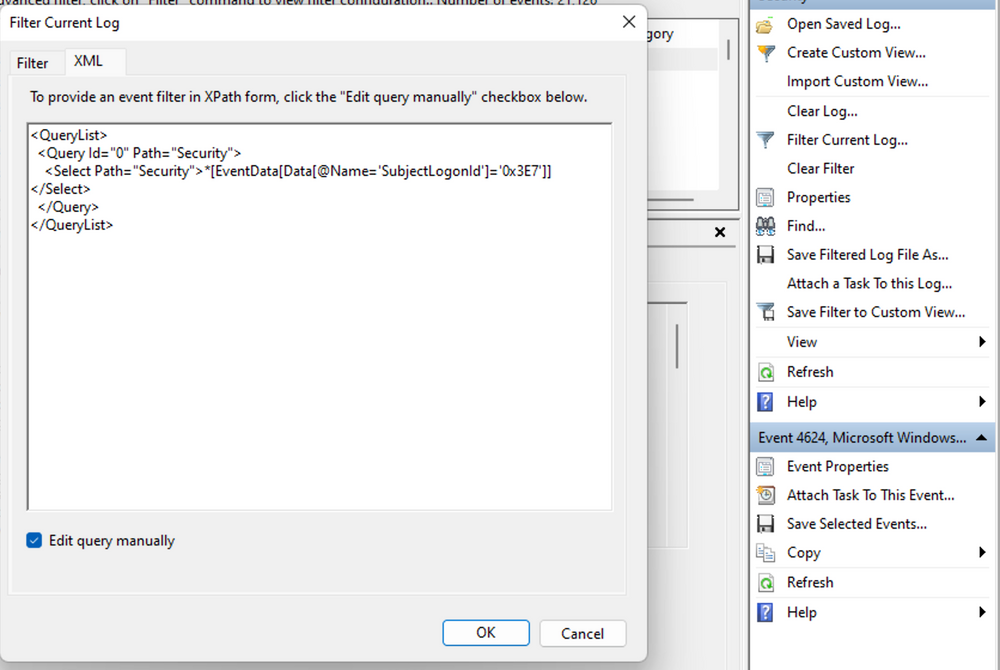
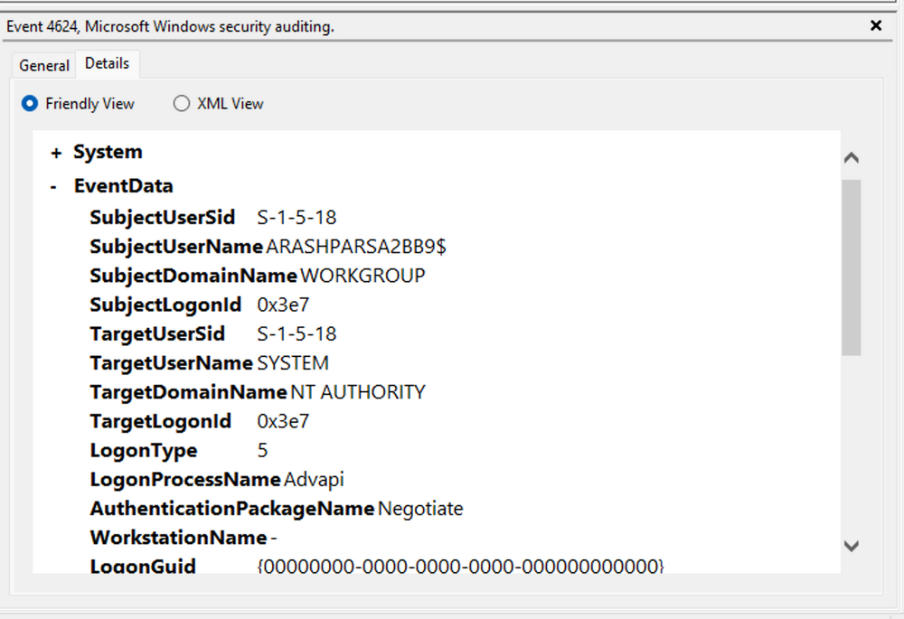
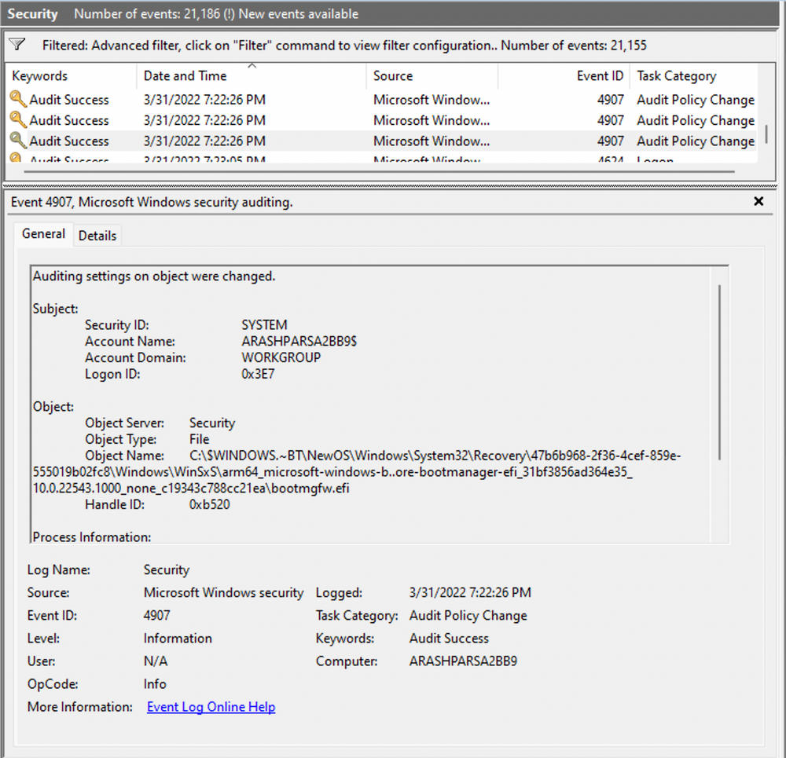
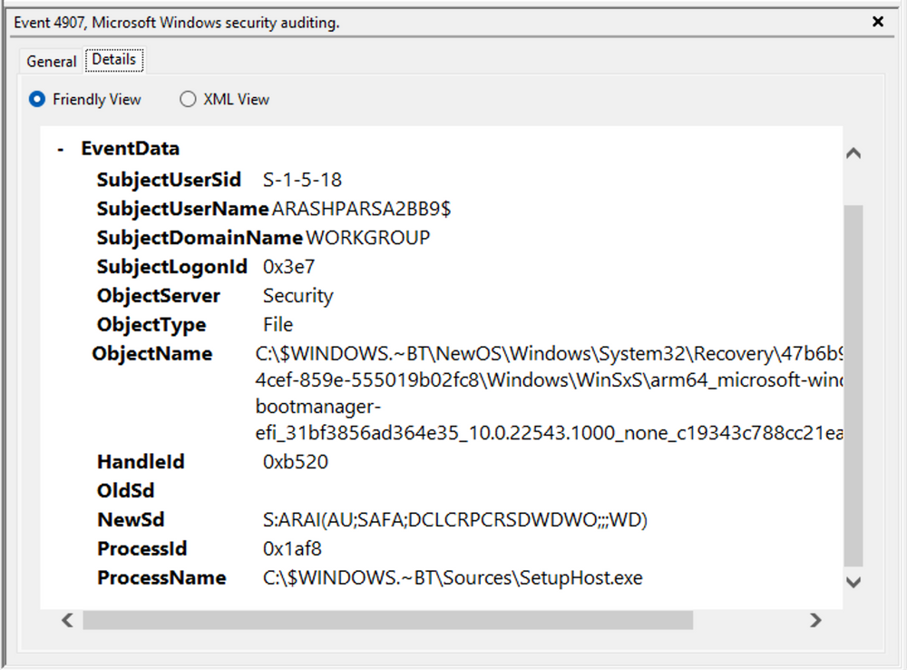
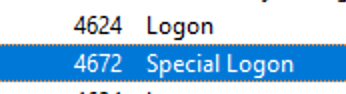
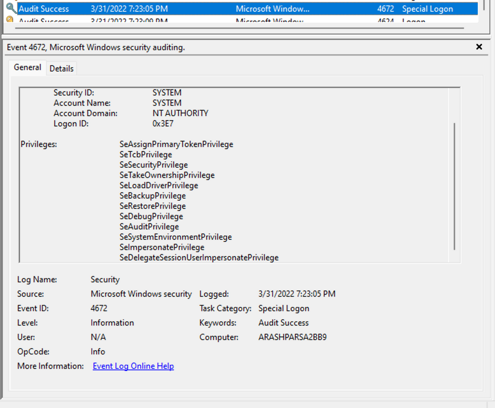

import Link from '@docusaurus/Link';

# Windows Event Logs

**Windows Event Logging Basics**  
`Windows Event Logs` are an intrinsic part of the Windows Operating System, storing logs from different components of the system including the system itself, applications running on it, ETW providers, services, and others.

Windows event logging offers comprehensive logging capabilities for application errors, security events, and diagnostic information. As cybersecurity professionals, we leverage these logs extensively for analysis and intrusion detection.

The logs are categorized into different event logs, such as "**Application**", "**System**", "**Security**", and others, to organize events based on their source or purpose.

Event logs can be accessed using the **Event Viewer** application or programmatically using **APIs** such as the `Windows Event Log API`.

Accessing the **Windows Event Viewer** as an administrative user allows us to explore the various logs available.

The default Windows event logs consist of `Application`, `Security`, `Setup`, `System`, and `Forwarded Events`. While the first four logs cover application errors, security events, system setup activities, and general system information, the "Forwarded Events" section is unique, showcasing event log data forwarded from other machines. This central logging feature proves valuable for system administrators who desire a consolidated view. In our current analysis, we focus on event logs from a single machine.

It should be noted, that the Windows Event Viewer has the ability to open and display previously saved `.evtx` files, which can be then found in the "**Saved Logs**" section.

## The Anatomy of an Event Log

When examining `Application` logs, we encounter two distinct levels of events: `information` and `error`.

**Information events** provide general usage details about the application, such as its start or stop events.  
Conversely, **error events** highlight specific errors and often offer detailed insights into the encountered issues.

Each entry in the Windows Event Log is an "Event" and contains the following primary components:

1. `Log Name`  
The name of the event log (e.g., Application, System, Security, etc.).

2. `Source`  
The software that logged the event.

3. `Event ID`  
A unique identifier for the event.

4. `Task Category`  
This often contains a value or name that can help us understand the purpose or use of the event.

5. `Level`  
The severity of the event (Information, Warning, Error, Critical, and Verbose).

6. `Keywords`  
Keywords are flags that allow us to categorize events in ways beyond the other classification options. These are generally broad categories, such as "Audit Success" or "Audit Failure" in the Security log.

7. `User`  
The user account that was logged on when the event occurred.

8. `OpCode`  
This field can identify the specific operation that the event reports.

9. `Logged`  
The date and time when the event was logged.

10. `Computer`  
The name of the computer where the event occurred.

11. `XML Data`  
All the above information is also included in an XML format along with additional event data.

:::tip
The `Keywords` field is particularly useful when filtering event logs for specific types of events. It can significantly enhance the precision of search queries by allowing us to specify events of interest, thus making log management more efficient and effective.
:::

Taking a closer look at the event log above, we observe several crucial elements. The `Event ID` in the top left corner serves as a unique identifier, which can be further researched on Microsoft's website to gather additional information. The "**SideBySide**" label next to the event ID represents the event source. Below, we find the general error description, often containing rich details. By clicking on the **details**, we can further analyze the event's impact using XML or a well-formatted view.

Additionally, we can extract supplementary information from the event log, such as the **process ID** where the error occurred, enabling more precise analysis.

Switching our focus to security logs, let's consider event `ID 4624`, a commonly occurring event [(detailed at Microsoft)](https://docs.microsoft.com/en-us/windows/security/threat-protection/auditing/event-4624).

According to Microsoft's documentation, this event signifies the **creation of a logon session** on the destination machine, originating from the accessed computer where the session was established. Within this log, we find crucial details, including the "`Logon ID`", which allows us to correlate this logon with other events sharing the same "`Logon ID`". Another important detail is the "`Logon Type`", indicating the type of logon. In this case, it specifies a **Service logon type**, suggesting that "`SYSTEM`" initiated a new service. However, further investigation is required to determine the specific service involved, utilizing correlation techniques with additional data like the "Logon ID".

:::tip[Mnemonic: T.I.L.C.]

- **T**: **Type** – Identify the logon type (e.g., Service Logon).
- **I**: **ID** – Note the Event ID and the Logon ID.
- **L**: **Link** – Correlate events by matching the same Logon ID.
- **C**: **Context** – Understand the user/process context (e.g., SYSTEM starting a service).

:::

Example Usage

1. **Type** – Check if the logon indicates an interactive session, remote session, or service logon.
2. **ID** – Confirm the Event ID (4624) and capture the Logon ID.
3. **Link** – Look for other events sharing the same Logon ID to see what happened next.
4. **Context** – Determine who or what triggered the event (e.g., SYSTEM) and which service or process was involved.

## Leveraging Custom XML Queries

To streamline our analysis, we can create custom XML queries to identify related events using the "`Logon ID`" as a starting point. By navigating to "`Filter Current Log" -> "XML" -> "Edit Query Manually`" we gain access to a custom XML query language that enables more granular log searches.

In the example query, we focus on events containing the "`SubjectLogonId`" field with a value of "`0x3E7`". The selection of this value stems from the **need to correlate events associated with a specific "Logon ID"** and understand the relevant details within those events.

It is worth noting that if assistance is required in crafting the query, automatic filters can be enabled, allowing exploration of their impact on the XML representation. For further guidance, Microsoft offers informative articles on [advanced XML filtering in the Windows Event Viewer.](https://techcommunity.microsoft.com/t5/ask-the-directory-services-team/advanced-xml-filtering-in-the-windows-event-viewer/ba-p/399761)

By constructing such queries, we can narrow down our focus to the account responsible for initiating the service and eliminate unnecessary details. This approach helps unveil a clearer picture of recent logon activities associated with the specified Logon ID. However, even with this refinement, the amount of data remains significant.

Delving into the log details progressively reveals a narrative. For instance, the analysis begins with [Event ID 4907](https://docs.microsoft.com/en-us/windows/security/threat-protection/auditing/event-4907), which signifies an **audit policy change**.

Within the [event description](https://learn.microsoft.com/en-us/windows/security/threat-protection/auditing/event-4907), we find valuable insights, such as "**This event generates when the SACL of an object (for example, a registry key or file)** was changed."

In case unfamiliar with SACL, referring to the [provided link](https://docs.microsoft.com/en-us/windows/win32/secauthz/access-control-lists) sheds light on access control lists (ACLs). The "`S`" in `SACL` denotes a `system access control list`, which enables administrators to log access attempts to secure objects. Each `Access Control Entry (ACE)` within a `SACL` specifies the types of access attempts by a designated trustee that trigger record generation in the security event log. `ACEs` in a `SACL` can generate **audit records upon failed**, **successful**, or **both types of access** attempts. For more information about SACLs, see [Audit Generation](https://learn.microsoft.com/en-us/windows/win32/secauthz/audit-generation) and [SACL Access Right](https://learn.microsoft.com/en-us/windows/win32/secauthz/sacl-access-right)."

Based on this information, it becomes apparent that the permissions of a file were altered to modify the logging or auditing of access attempts. Further exploration of the event details reveals additional intriguing aspects.

For example, the process responsible for the change is identified as "`SetupHost.exe`", indicating a potential setup process (although it's worth noting that malware can sometimes masquerade under legitimate names). The object name impacted appears to be the "`bootmanager`", and we can examine the new and old security descriptors ("`NewSd`" and "`OldSd`") to identify the changes. Understanding the meaning of each field in the security descriptor can be accomplished through references such as the article [ACE Strings](https://docs.microsoft.com/en-us/windows/win32/secauthz/ace-strings?redirectedfrom=MSDN) and [Understanding SDDL Syntax](https://itconnect.uw.edu/wares/msinf/other-help/understanding-sddl-syntax/).

From the observed events, we can infer that a setup process occurred, involving **the creation of a new file** and **the initial configuration of security permissions for auditing purposes**. Subsequently, we encounter the logon event, followed by a "`special logon`" event.

Analyzing **the special logon event**, we gain insights into `token permissions granted to the user` upon a successful logon.

A comprehensive list of privileges can be found in the documentation on [privilege constants](https://docs.microsoft.com/en-us/windows/win32/secauthz/privilege-constants). For instance, the "`SeDebugPrivilege`" privilege indicates that the user possesses the ability to tamper with memory that does not belong to them.