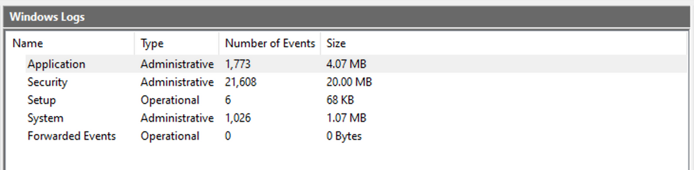

import Link from '@docusaurus/Link';

# Windows Event Logs
**Windows Event Logging Basics**  
`Windows Event Logs` are an intrinsic part of the Windows Operating System, storing logs from different components of the system including the system itself, applications running on it, ETW providers, services, and others.

Windows event logging offers comprehensive logging capabilities for application errors, security events, and diagnostic information. As cybersecurity professionals, we leverage these logs extensively for analysis and intrusion detection.

The logs are categorized into different event logs, such as "**Application**", "**System**", "**Security**", and others, to organize events based on their source or purpose.

Event logs can be accessed using the **Event Viewer** application or programmatically using **APIs** such as the `Windows Event Log API`.

Accessing the **Windows Event Viewer** as an administrative user allows us to explore the various logs available.

The default Windows event logs consist of `Application`, `Security`, `Setup`, `System`, and `Forwarded Events`. While the first four logs cover application errors, security events, system setup activities, and general system information, the "Forwarded Events" section is unique, showcasing event log data forwarded from other machines. This central logging feature proves valuable for system administrators who desire a consolidated view. In our current analysis, we focus on event logs from a single machine.

It should be noted, that the Windows Event Viewer has the ability to open and display previously saved `.evtx` files, which can be then found in the "**Saved Logs**" section.

## The Anatomy of an Event Log
When examining `Application` logs, we encounter two distinct levels of events: `information` and `error`.

**Information events** provide general usage details about the application, such as its start or stop events.  
Conversely, **error events** highlight specific errors and often offer detailed insights into the encountered issues.

Each entry in the Windows Event Log is an "Event" and contains the following primary components:

1. `Log Name`  
The name of the event log (e.g., Application, System, Security, etc.).

2. `Source`  
The software that logged the event.

3. `Event ID`  
A unique identifier for the event.

4. `Task Category`  
This often contains a value or name that can help us understand the purpose or use of the event.

5. `Level`  
The severity of the event (Information, Warning, Error, Critical, and Verbose).

6. `Keywords`  
Keywords are flags that allow us to categorize events in ways beyond the other classification options. These are generally broad categories, such as "Audit Success" or "Audit Failure" in the Security log.

7. `User`  
The user account that was logged on when the event occurred.

8. `OpCode`  
This field can identify the specific operation that the event reports.

9. `Logged`  
The date and time when the event was logged.

10. `Computer`  
The name of the computer where the event occurred.

11. `XML Data`  
All the above information is also included in an XML format along with additional event data.

:::tip
The `Keywords` field is particularly useful when filtering event logs for specific types of events. It can significantly enhance the precision of search queries by allowing us to specify events of interest, thus making log management more efficient and effective.
:::