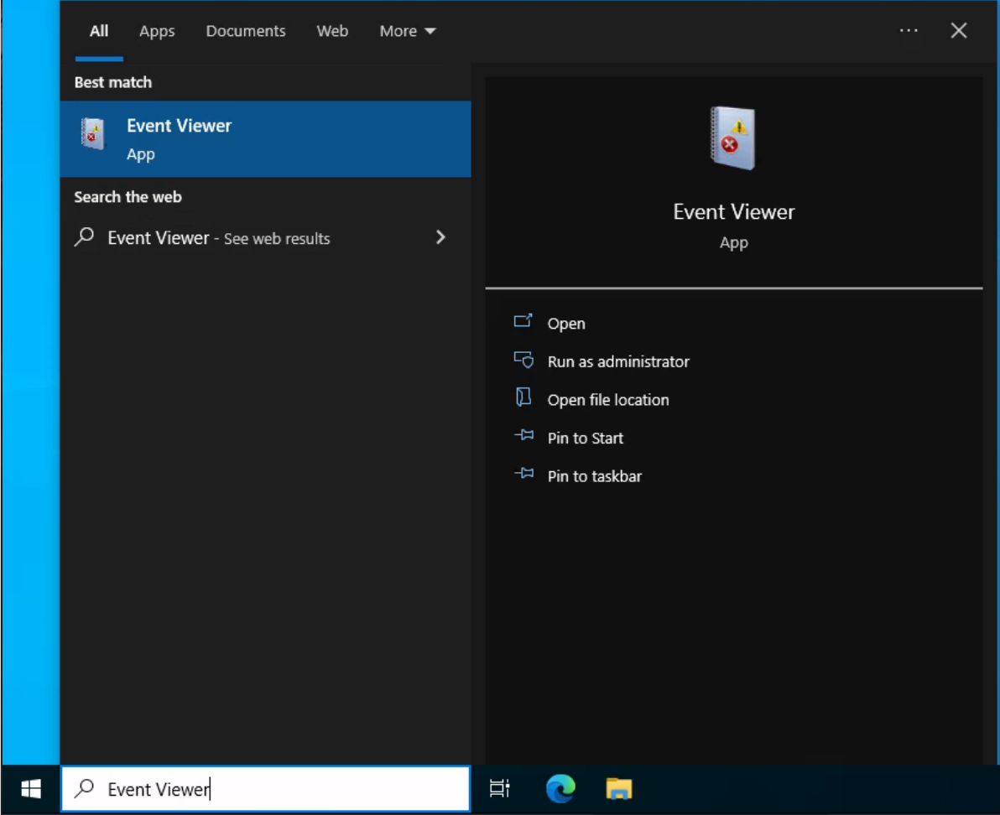
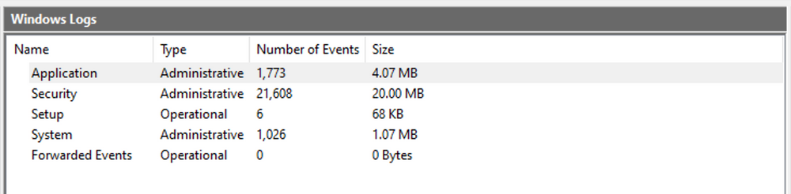

import Link from '@docusaurus/Link';

# Windows Event Logs
**Windows Event Logging Basics**  
`Windows Event Logs` are an intrinsic part of the Windows Operating System, storing logs from different components of the system including the system itself, applications running on it, ETW providers, services, and others.

Windows event logging offers comprehensive logging capabilities for application errors, security events, and diagnostic information. As cybersecurity professionals, we leverage these logs extensively for analysis and intrusion detection.

The logs are categorized into different event logs, such as "**Application**", "**System**", "**Security**", and others, to organize events based on their source or purpose.

Event logs can be accessed using the **Event Viewer** application or programmatically using **APIs** such as the `Windows Event Log API`.

Accessing the **Windows Event Viewer** as an administrative user allows us to explore the various logs available.

The default Windows event logs consist of `Application`, `Security`, `Setup`, `System`, and `Forwarded Events`. While the first four logs cover application errors, security events, system setup activities, and general system information, the "Forwarded Events" section is unique, showcasing event log data forwarded from other machines. This central logging feature proves valuable for system administrators who desire a consolidated view. In our current analysis, we focus on event logs from a single machine.

It should be noted, that the Windows Event Viewer has the ability to open and display previously saved `.evtx` files, which can be then found in the "**Saved Logs**" section.
