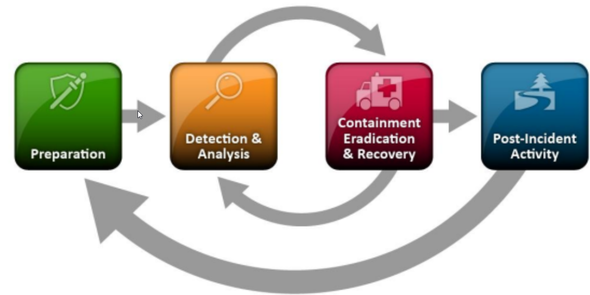

import Link from '@docusaurus/Link';

---
title: "Incident Handling Process"
authors: [asalucci]
tags: [HackTheBox, CTF, trustinveritas, alessandro]
published: 2025-02-24
categories: ["SOC", "Analyst", "Write, Up", "HackTheBox"]
---

# Incident Handling Process

## Module Summary
Incident handling is a clearly defined set of procedures to manage and respond to security incidents in a computer or network environment. This module introduces the overall process of handling security incidents and walks through each stage of the incident handling process. Important key points and implementation details will also be provided regarding all stages of the incident handling process. This module is also aligned with NIST's Computer "Security Incident Handling Guide", since it is one of the most widely used and referenced resources on the matter.

The fundamentals of monitoring and SIEM, as well as the majority of SOC-related and investigation-related topics, will be covered in separate modules and in a highly hands-on manner. This module focuses solely on the procedural aspect of incident handling, hence the lack of hands-on exercises.

This module is broken into sections and there are no accompanying hands-on exercises as the focus is understanding the different stages of the incident handling process from a handler's perspective.

You can start and stop the module at any time and pick up where you left off. There is no time limit or "grading," but you must complete all of the quiz assessments to receive the maximum number of cubes and have this module marked as complete in any paths you have chosen.

The module is classified as "Fundamental" but assumes an understanding of information security fundamentals and common attack principles.

A firm grasp of the following module can be considered prerequisites for successful completion of this module:

- Penetration Testing Process

---

# Incident Handling
## Incident Handling Definition & Scope
**Incident handling (IH)** has become an important part of an organization's defensive capability against cybercrime. While protective measures are constantly being implemented to prevent or lower the amount of security incidents, an incident handling capability is undeniably a necessity for any organization that cannot afford a compromise of its data confidentiality, integrity, or availability. Some organizations choose to implement this capability in-house, while others rely on third-party providers to support them, continuously or when needed. Before we dive into the world of security incidents, let's define some terms and establish a common understanding of them.

**An `event` is an action occurring in a system or network. Examples of events are:**

- A user sending an email
- A mouse click
- A firewall allowing a connection request

An `incident` is an event with a negative consequence. One example of an incident is a system crash. Another example is unauthorized access to sensitive data. Incidents can also occur due to natural disasters, power failures, etc.

There is no single definition for what an IT security incident is, and therefore it varies between organizations. We define an IT security incident as an event with a clear intent to cause harm that is performed against a computer system. Examples of incidents are:

- Data theft
- Funds theft
- Unauthorized access to data
- Installation and usage of malware and remote access tools

**Incident handling is a clearly defined set of procedures to manage and respond to security incidents in a computer or network environment.**

:::tip
One of the most widely used resources on incident handling is [NIST's Computer Security Incident Handling Guide](https://nvlpubs.nist.gov/nistpubs/SpecialPublications/NIST.SP.800-61r2.pdf). The document aims to assist organizations in mitigating the risks from computer security incidents by providing practical guidelines on responding to incidents effectively and efficiently.
:::

### Incident Handling Checklist

## Cyber Kill Chain

1. **In which stage of the cyber kill chain is malware developed?**
> weaponize

## Incident Handling Process Overview

Incident handlers spend most of their time in the first two stages, `preparation` and `detection & analysis`. This is where we spend a lot of time improving ourselves and looking for the next malicious event. When a malicious event is detected, we then move on to the next stage and respond to the event `(but there should always be resources operating on the first two stages, so that there is no disruption of preparation and detection capabilities)`.

**So, incident handling has two main activities, which are `investigating` and `recovering`. The investigation aims to:**

- Discover the initial `patient zero` victim and create an (ongoing if still active) **incident timeline**
- Determine what `tools` and `malware` the adversary used
- `Document the compromised systems` and `what the adversary` has done

2. **True or False: Incident handling contains two main activities. These are investigating and reporting.**
> False

## Preparation Stage (Part 1)
In the `preparation` stage, we have two separate objectives. The first one is the **establishment of incident handling capability within the organization**. The second is the **ability to protect against and prevent IT security incidents by implementing appropriate protective measures**. Such measures include **endpoint and server hardening**, **active directory tiering**, **multi-factor authentication**, **privileged access management**, and so on and so forth. While protecting against incidents is not the responsibility of the incident handling team, this activity is fundamental to the overall success of that team.

### Preparation Prerequisites
During the preparation, we need to ensure that we have:

- Skilled incident handling team members (incident handling team members can be outsourced, but a basic capability and understanding of incident handling are necessary in-house regardless)
- Trained workforce (as much as possible, through security awareness activities or other means of training)
- Clear policies and documentation
- Tools (software and hardware)

### Clear Policies & Documentation
Some of the written policies and documentation should contain an up-to-date version of the following information:

- Contact information and roles of the incident handling team members
- Contact information for the legal and compliance department, management team, IT support, communications and media relations department, law enforcement, internet service providers, facility management, and external incident response team
- Incident response policy, plan, and procedures
- Incident information sharing policy and procedures
- Baselines of systems and networks, out of a golden image and a clean state environment
- Network diagrams
- Organization-wide asset management database
- User accounts with excessive privileges that can be used on-demand by the team when necessary (also to business-critical systems, which are handled with the skills needed to administer that specific system). These user accounts are normally enabled when an incident is confirmed during the initial investigation and then disabled once it is over. A mandatory password reset is also performed when disabling the users.
- Ability to acquire hardware, software, or an external resource without a complete procurement process (urgent purchase of up to a certain amount). The last thing you need during an incident is to wait for weeks for the approval of a $500 tool.
- Forensic/Investigative cheat sheets

:::info
**Taking Notes!**
These notes have to contain:
- timestamps
- the activity performed
- the result of it
- who did it
:::

  
Want to be a true investigator? 🕵️‍♂️

  Always ask yourself:
  - **Who** did it?
  - **What** happened?
  - **When** did it occur?
  - **Where** did it take place?
  - **Why** did it happen?
  - **How** was it executed?
  
  These answers will turn your notes into a powerful tool! 🚀

---

# 🛠️ Incident Report

| 🔍 Field               | 📝 Description |
|------------------------|--------------|
| **Incident ID**        | `INC-YYYYMMDD-001` (Format for unique ID) |
| **Date & Time**        | `YYYY-MM-DD HH:MM:SS` |
| **Reported By**        | Name of the person who reported the incident |
| **Affected System(s)** | List of affected systems (Hostname, IP, etc.) |
| **Severity Level**     | 🔹 Low 🔸 Medium 🔥 High 💀 Critical |
| **Incident Type**      | (e.g., Phishing, Malware, DoS, Data Breach, etc.) |
| **Short Description**  | Brief summary of the incident |
| **Detailed Description** | What exactly happened? Include all relevant details |
| **Initial Indicators** | How was the incident detected? (e.g., logs, user report, IDS/IPS alert) |
| **Actions Taken**      | Step-by-step actions that have been taken so far |
| **Root Cause**         | If known, what caused the incident? |
| **Impact Analysis**    | What was the impact of the incident (data loss, downtime, etc.)? |
| **Mitigation Steps**   | What immediate measures were taken to mitigate the impact? |
| **Lessons Learned**    | What can be improved to prevent similar incidents in the future? |
| **Next Steps**         | What additional actions are required? |
| **Incident Status**    | 🟢 Resolved / 🟡 Ongoing / 🔴 Escalated |
| **Handled By**         | Who worked on resolving the incident? |
| **Evidence Collected** | Hashes, screenshots, logs, artifacts, disk images |
| **References**         | Links to playbooks, documentation, or relevant resources |

---

## Tools (software && Hardware)
Moving forward, we also need to ensure that we have the right tools to perform the job. These include, but are not limited to:
- Additional laptop or a forensic workstation for each incident handling team member to preserve disk images and log files, perform data analysis, and investigate without any restrictions (we know malware will be tested here, so tools such as antivirus should be disabled). These devices should be handled appropriately and not in a way that introduces risks to the organization.
- Digital forensic image acquisition and analysis tools
- Memory capture and analysis tools
- Live response capture and analysis
- Log analysis tools
- Network capture and analysis tools
- Network cables and switches
- Write blockers
- Hard drives for forensic imaging
- Power cables
- Screwdrivers, tweezers, and other relevant tools to repair or disassemble hardware devices if needed
- Indicator of Compromise (IOC) creator and the ability to search for IOCs across the organization
- Chain of custody forms
- Encryption software
- Ticket tracking system
- Secure facility for storage and investigation
- Incident handling system independent of your organization's infrastructure

:::tip
Many of the tools mentioned above will be part of what is known as a `jump bag` - always ready with the necessary tools to be picked up and leave immediately. Without this prepared bag, gathering all necessary tools on the fly may take days or weeks before you are ready to respond.
:::

3. **What should we have prepared and always ready to 'grab and go'?**
> jump bag

4. **True or False: Using baselines, we can discover deviations from the golden image, which aids us in discovering suspicious or unwanted changes to the configuration.**
> True

## Preparation Stage (Part 2)

Another part of the `preparation` stage is to protect against incidents. While protection is not necessarily the responsibility of an incident handling team, any protection-related activities should be known to them to better understand the type and sophistication of an incident and know where to look for artifacts/evidence, that could aid the investigation.

**Let us now look at some of the highly recommended protective measures, which have a high mitigation impact against the majority of threats.**

### DMARC
[DMARC](https://dmarcly.com/blog/how-to-implement-dmarc-dkim-spf-to-stop-email-spoofing-phishing-the-definitive-guide#what-is-dmarc) is an email protection against phishing built on top of the already existing [SPF]](https://dmarcly.com/blog/how-to-implement-dmarc-dkim-spf-to-stop-email-spoofing-phishing-the-definitive-guide#what-is-spf) and [DKIM(https://dmarcly.com/blog/how-to-implement-dmarc-dkim-spf-to-stop-email-spoofing-phishing-the-definitive-guide#what-is-dkim). The idea behind DMARC is to reject emails that 'pretend' to originate from your organization. Therefore, if an adversary is spoofing an email pretending to be an employee asking for an invoice to be paid, the system will reject the email before it reaches the intended recipient. DMARC is easy and inexpensive to implement, however, I cannot stress enough that thorough testing is mandatory; otherwise (and this is oftentimes the case), you risk blocking legitimate emails with no ability to recover them.

### Endpoint Hardening (& EDR)
Endpoint devices (workstations, laptops, etc.) are the entry points for most of the attacks that we are facing on a daily basis. If we consider the fact that most threats will originate from the internet and will target users who are browsing websites, opening attachments, or running malicious executables, a percentage of this activity will occur from their corporate endpoints.

There are a few **widely recognized endpoint hardening standards** by now, with **CIS** and **Microsoft** baselines being the most popular, and these should really be the building blocks for your organization's hardening baselines. Some highly important actions (that actually work) to note and do something about are:

- Disable LLMNR/NetBIOS
- Implement LAPS and remove administrative privileges from regular users
- Disable or configure PowerShell in "ConstrainedLanguage" mode
- Enable Attack Surface Reduction (ASR) rules if using Microsoft Defender
- Implement whitelisting. We know this is nearly impossible to implement. Consider at least blocking execution from user-writable folders (Downloads, Desktop, AppData, etc.). These are the locations where exploits and malicious payloads will initially find themselves. Remember to also block script types such as .hta, .vbs, .cmd, .bat, .js, and similar. Please pay attention to LOLBin files while implementing whitelisting. Do not overlook them; they are really used in the wild as initial access to bypass whitelisting.
- Utilize host-based firewalls. As a bare minimum, block workstation-to-workstation communication and block outbound traffic to LOLBins
- Deploy an EDR product. At this point in time, AMSI provides great visibility into obfuscated scripts for antimalware products to inspect the content before it gets executed. It is highly recommended that you only choose products that integrate with AMSI.

:::tip
When it comes to hardening, **Don't let perfect** be the enemy of good.
:::

### Network Protection
Network segmentation is a powerful technique to avoid having a breach spread across the entire organization. Business-critical systems must be isolated, and connections should be allowed only as the business requires. Internal resources should really not be facing the Internet directly (unless placed in a DMZ).

Additionally, when speaking of network protection you should consider IDS/IPS systems. Their power really shines when SSL/TLS interception is performed so that they can identify malicious traffic based on content on the wire and not based on reputation of IP addresses, which is a traditional and very inefficient way of detecting malicious traffic.

Additionally, ensure that only organization-approved devices can get on the network. Solutions such as 802.1x can be utilized to reduce the risk of bring your own device (BYOD) or malicious devices connecting to the corporate network. If you are a cloud-only company using, for example, Azure/Azure AD, then you can achieve similar protection with Conditional Access policies that will allow access to organization resources only if you are connecting from a company-managed device.

### Privilege Identity Management / MFA / Passwords
At this point in time, stealing privileged user credentials is the most common escalation path in Active Directory environments. Additionally, a common mistake is that admin users either have a weak (but often complex) password or a shared password with their regular user account (which can be obtained via multiple attack vectors such as keylogging). For reference, a weak but complex password is "Password1!". It includes uppercase, lowercase, numerical, and special characters, but despite this, it's easily predictable and can be found in many password lists that adversaries employ in their attacks. It is recommended to teach employees to use pass phrases because they are harder to guess and difficult to brute force. An example of a password phrase that is easy to remember yet long and complex is "i LIK3 my coffeE warm". If one knows a second language, they can mix up words from multiple languages for additional protection.

Multi-factor authentication (MFA) is another identity-protecting solution that should be implemented at least for any type of administrative access to ALL applications and devices.

### Vulnerability Scanning
Perform continuous vulnerability scans of your environment and remediate at least the "high" and "critical" vulnerabilities that are discovered. While the scanning can be automated, the fixes usually require manual involvement. If you can't apply patches for some reason, definitely segment the systems that are vulnerable!

### User Awareness Training
Training users to recognize suspicious behavior and report it when discovered is a big win for us. While it is unlikely to reach 100% success on this task, these trainings are known to significantly reduce the number of successful compromises. Periodic "surprise" testing should also be part of this training, including, for example, monthly phishing emails, dropped USB sticks in the office building, etc.

### Active Directory Security Assessment
The best way to detect security misconfigurations or exposed critical vulnerabilities is by looking for them from the perspective of an attacker. Doing your own reviews (or hiring a third party if the skillset is missing from the organization) will ensure that when an endpoint device is compromised, the attacker will not have a one-step escalation possibility to high privileges on the network. The more additional tools and activity an attacker is generating, the higher the likelihood of you detecting them, so try to eliminate easy wins and low-hanging fruits as much as possible.

Active Directory has a few known and unique escalation paths/bugs. New ones are quite often discovered too. Active Directory security assessments are crucial for the security posture of the environment as a whole. Don't assume that your system administrators are aware of all discovered or published bugs, because in reality they probably aren't.

### Purple Team Exercises
We need to train incident handlers and keep them engaged. There is no question about that, and the best place to do it is inside an organization's own environment. Purple team exercises are essentially security assessments by a red team that either continuously or eventually inform the blue team about their actions, findings, any visibility/security shortcomings, etc. Such exercises will help in identifying vulnerabilities in an organization while testing the blue team's defensive capability in terms of logging, monitoring, detection, and responsiveness. If a threat goes unnoticed, there is an opportunity to improve. For those that are detected, the blue team can test any playbooks and incident handling procedures to ensure they are robust and the expected result has been achieved.

5. **What can we use to block phishing emails pretending to originate from our mail server?**
> DMARC

6. **True or False: "Summer2021!" is a complex password.**
> True

- *I would say False...*

## Detection & Analysis Stage (Part 1)
At this point, we have created processes and procedures, and we have guidelines on how to act upon security incidents.

The `detection & analysis` phase involves all aspects of detecting an incident, such as utilizing sensors, logs, and trained personnel. It also includes information and knowledge sharing, as well as utilizing context-based threat intelligence. Segmentation of the architecture and having a clear understanding of and visibility within the network are also important factors.

Threats are introduced to the organization via an infinite amount of attack vectors, and their detection can come from sources such as:

- An employee that notices abnormal behavior
- An alert from one of our tools (EDR, IDS, Firewall, SIEM, etc.)
- Threat hunting activities
- A third-party notification informing us that they discovered signs of our organization being compromised

It is highly recommended to create levels of detection by logically categorizing our network as follows.

- Detection at the network perimeter (using firewalls, internet-facing network intrusion detection/prevention systems, demilitarized zone, etc.)
- Detection at the internal network level (using local firewalls, host intrusion detection/prevention systems, etc.)
- Detection at the endpoint level (using antivirus systems, endpoint detection & response systems, etc.)
- Detection at the application level (using application logs, service logs, etc.)

### Initial Investigation
When a security incident is detected, you should conduct some initial investigation and establish context before assembling the team and calling an organization-wide incident response. Think about how information is presented in the event of an administrative account connecting to an IP address at HH:MM:SS. Without knowing what system is on that IP address and which time zone the time refers to, we may easily jump to a wrong conclusion about what this event is about. To sum up, we should aim to collect as much information as possible at this stage about the following:

- Date/Time when the incident was reported.
- Who detected the incident and/or who reported it?
- How was the incident detected?
- What was the incident? 
    - Phishing?
    - System unavailability? etc.
- Assemble a list of impacted systems (if relevant)
- Document who has accessed the impacted systems and what actions have been taken. 
    - Make a note of whether this is an ongoing incident or the suspicious activity has been stopped
- Physical location, operating systems, IP addresses and hostnames, system owner, system's purpose, current state of the system
- (If malware is involved) List of IP addresses, time and date of detection, type of malware, systems impacted, export of malicious files with forensic information on them (such as hashes, copies of the files, etc.)

**Overall, the timeline should contain the information described in the following columns:**

 | Date	      | Time of the event | hostname    | event description                   | data source        |
 |------------|-------------------|-------------|-------------------------------------|--------------------|
 | 09/09/2021 |	13:31 CET	        | SQLServer01 | Hacker tool 'Mimikatz' was detected |	Antivirus Software |

 ### Incident Severity & Extent Questions
When handling a security incident, we should also try to answer the following questions to get an idea of the incident's severity and extent:

- What is the exploitation impact?
- What are the exploitation requirements?
- Can any business-critical systems be affected by the incident?
- Are there any suggested remediation steps?
- How many systems have been impacted?
- Is the exploit being used in the wild?
- Does the exploit have any worm-like capabilities?

:::tip
The last two can possibly indicate the level of sophistication of an adversary.
:::

**As you can imagine, high-impact incidents will be handled promptly, and incidents with a high number of impacted systems will have to be escalated.**

### Incident Confidentiality & Communication
Incidents are very confidential topics and as such, all of the information gathered should be kept on a need-to-know basis, unless applicable laws or a management decision instruct us otherwise. There are multiple reasons for this. The adversary may be, for example, an employee of the company, or if a breach has occurred, the communication to internal and external parties should be handled by the appointed person in accordance with the legal department.

When an investigation is launched, we will set some expectations and goals. These often include the type of incident that occurred, the sources of evidence that we have available, and a rough estimation of how much time the team needs for the investigation. Also, based on the incident, we will set expectations on whether we will be able to uncover the adversary or not. Of course, a lot of the above may change as the investigation evolves and new leads are discovered. It is important to keep everyone involved and the management informed about any advancements and expectations.

7. **True or False: Can a third party vendor be a source of detecting a compromise?**
> True

## Detection & Analysis Stage (Part 2)
When an investigation is started, we aim to understand what and how it happened. To analyze the incident-related data properly and efficiently, the incident handling team members need deep technical knowledge and experience in the field. One may ask, "Why do we care about how an incident happened? Why don't we simply rebuild the impacted systems and basically forget it ever happened?".

If we don't know how an incident happened or what was impacted, then any remediative steps we take will not ensure that the attacker cannot repeat his actions to regain access. If we, on the other hand, know exactly how the adversary got in, what tools they used, and which systems were impacted, then we can plan our remediation to ensure that this attack path cannot be replicated.

### The Investigation
The investigation starts based on the initially gathered (and limited) information that contain what we know about the incident so far. With this initial data, we will begin a 3-step cyclic process that will iterate over and over again as the investigation evolves. This process includes:

- Creation and usage of indicators of compromise (IOC)
- Identification of new leads and impacted systems
- Data collection and analysis from the new leads and impacted systems

### 1. Initial Investigation Data
In order to reach a conclusion, an investigation should be based on valid leads that have been discovered not only during this initial phase but throughout the entire investigation process. The incident handling team should bring up new leads constantly and not go solely after a specific finding, such as a known malicious tool. Narrowing an investigation down to a specific activity often results in limited findings, premature conclusions, and an incomplete understanding of the overall impact.

### 2. Creation & Usage Of IOCs
An indicator of compromise is a sign that an incident has occurred. IOCs are documented in a structured manner, which represents the artifacts of the compromise. Examples of IOCs can be IP addresses, hash values of files, and file names. In fact, because IOCs are so important to an investigation, special languages such as OpenIOC have been developed to document them and share them in a standard manner. Another widely used standard for IOCs is Yara. There are a number of free tools that can be utilized, such as Mandiant's IOC Editor, to create or edit IOCs. Using these languages, we can describe and use the artifacts that we uncover during an incident investigation. We may even obtain IOCs from third parties if the adversary or the attack is known.

To leverage IOCs, we will have to deploy an IOC-obtaining/IOC-searching tool (native or third party and possibly at scale). A common approach is to utilize WMI or PowerShell for IOC-related operations in Windows environments. A word of caution! During an investigation, we have to be extra careful to prevent the credentials of our highly privileged user(s) from being cached when connecting to (potentially) compromised systems (or any systems, really). More specifically, we need to ensure that only connection protocols and tools that don't cache credentials upon a successful login are utilized (such as WinRM). Windows logons with logon type 3 (Network Logon) typically don't cache credentials on the remote systems. The best example of "know your tools" that comes to mind is "PsExec". When "PsExec" is used with explicit credentials, those credentials are cached on the remote machine. When "PsExec" is used without credentials through the session of the currently logged on user, the credentials are not cached on the remote machine. This is a great example of demonstrating how the same tool leaves different tracks, so be aware.

### 3. Identification Of New Leads & Impacted Systems
After searching for IOCs, you expect to have some hits that reveal other systems with the same signs of compromise. These hits may not be directly associated with the incident we are investigating. Our IOC could be, for example, too generic. We need to identify and eliminate false positives. We may also end up in a position where we come across a large number of hits. In this case, we should prioritize the ones we will focus on, ideally those that can provide us with new leads after a potential forensic analysis.

### Result: Data Collection & Analysis From The New Leads & Impacted Systems
Once we have identified systems that included our IOCs, we will want to collect and preserve the state of those systems for further analysis in order to uncover new leads and/or answer investigative questions about the incident. Depending on the system, there are multiple approaches to how and what data to collect. Sometimes we want to perform a 'live response' on a system as it is running, while in other cases we may want to shut down a system and then perform any analysis on it. Live response is the most common approach, where we collect a predefined set of data that is usually rich in artifacts that may explain what happened to a system. Shutting down a system is not an easy decision when it comes to preserving valuable information because, in many cases, much of the artifacts will only live within the RAM memory of the machine, which will be lost if the machine is turned off. Regardless of the collection approach we choose, it is vital to ensure that minimal interaction with the system occurs to avoid altering any evidence or artifacts.

Once the data has been collected, it is time to analyze it. This is often the most time-consuming process during an incident. Malware analysis and disk forensics are the most common examination types. Any newly discovered and validated leads are added to the timeline, which is constantly updated. Also note that memory forensics is a capability that is becoming more and more popular and is extremely relevant when dealing with advanced attacks.

:::tip
Keep in mind that during the data collection process, you should keep track of the chain of custody to ensure that the examined data is court-admissible if legal action is to be taken against an adversary.
:::

8. **During an investigation, we discovered a malicious file with an MD5 hash value of `b40f6b2c167239519fcfb2028ab2524a`. How do we usually call such a hash value in investigations? Answer format: Abbreviation**
> IOC

9. **True or False: Patching a system is considered a short term containment.**
> False

10. **True or False: We should train junior team members as part of these post-incident activities.**
> True

<Link className="button button--primary" to="/docs/HackingLab/HackTheBox/SOC-Analyst/introduction-to-the-elastic-stack/">
  Continue SOC-Analyst Path
</Link>