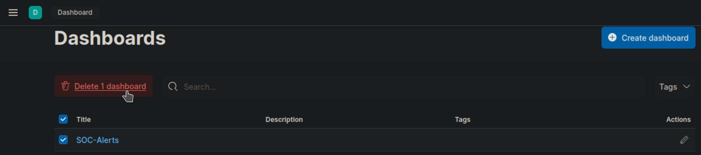
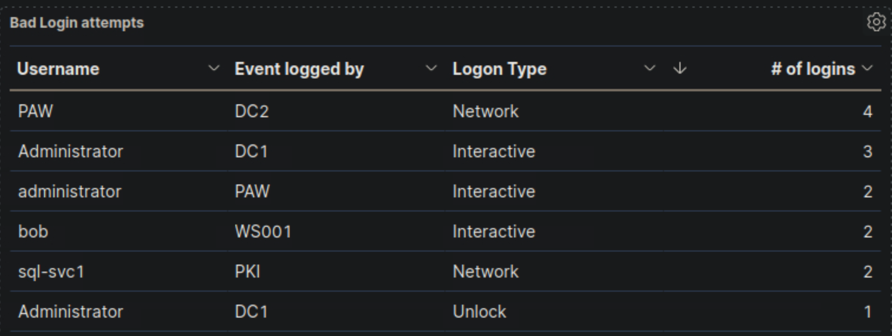
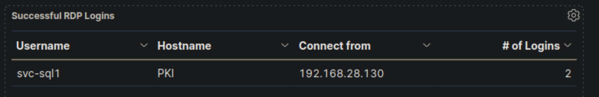
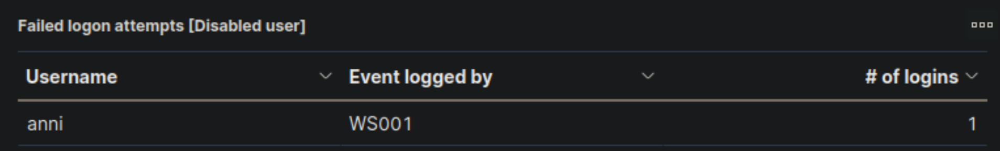
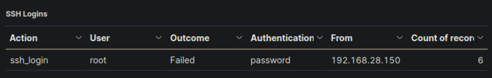

import Link from '@docusaurus/Link';

# Introduction To The Elastic Stack
## What Is The Elastic Stack?
The Elastic stack, created by Elastic, is an open-source collection of mainly three applications (Elasticsearch, Logstash, and Kibana) that work in harmony to offer users comprehensive search and visualization capabilities for real-time analysis and exploration of log file sources.


The high-level architecture of the Elastic stack can be enhanced in resource-intensive environments with the addition of Kafka, RabbitMQ, and Redis for buffering and resiliency, and nginx for security.


### Elasticsearch
Is a distributed and JSON-based search engine, designed with `RESTful APIs`. As the core component of the Elastic stack, it handles indexing, storing, and querying. Elasticsearch empowers users to conduct sophisticated queries and perform analytics operations on the log file records processed by `Logstash`.

### Logstash
Is responsible for collecting, transforming, and transporting log file records. Its strength lies in its ability to consolidate data from various sources and normalize them. Logstash operates in three main areas:

1. `Process input`: Logstash ingests log file records from remote locations, converting them into a format that machines can understand. It can receive records through different [input methods](https://www.elastic.co/guide/en/logstash/current/input-plugins.html), such as reading from a flat file, a TCP socket, or directly from syslog messages. After processing the input, Logstash proceeds to the next function.
2. `Transform and enrich log records`: Logstash offers numerous ways to [modify a log record's](https://www.elastic.co/guide/en/logstash/current/filter-plugins.html) format and even content. Specifically, filter plugins can perform intermediary processing on an event, often based on a predefined condition. Once a log record is transformed, Logstash processes it further.
3. `Send log records to Elasticsearch`: Logstash utilizes [output plugins](https://www.elastic.co/guide/en/logstash/current/output-plugins.html) to transmit log records to Elasticsearch.

### Kibana
Serves as the visualization tool for Elasticsearch documents. Users can view the data stored in Elasticsearch and execute queries through Kibana. Additionally, Kibana simplifies the comprehension of query results using tables, charts, and custom dashboards.

:::note
Beats is an additional component of the Elastic stack. These lightweight, single-purpose data shippers are designed to be installed on remote machines to forward logs and metrics to either Logstash or Elasticsearch directly. Beats simplify the process of collecting data from various sources and ensure that the Elastic Stack receives the necessary information for analysis and visualization
:::

`Beats -> Logstash -> Elasticsearch -> Kibana`


`Beats -> Elasticsearch -> Kibana`


## The Elastic Stack As A SIEM Solution
The Elastic stack can be used as a **Security Information and Event Management (SIEM)** solution to collect, store, analyze, and visualize security-related data from various sources.

To implement the Elastic stack as a SIEM solution, security-related data from various sources such as **firewalls, IDS/IPS, and endpoints** should be ingested into the Elastic stack using `Logstash`. `Elasticsearch` should be **configured to store and index the security data**, and `Kibana` should be used to **create custom dashboards** and **visualizations** to provide insights into security-related events.

To detect security-related incidents, Elasticsearch can be used to perform searches and correlations on the collected security data.

As **Security Operations Center (SOC)** analysts, we are likely to extensively use `Kibana` as our primary interface when working with the Elastic stack. Therefore, it is essential to become proficient with its functionalities and features.


**Kibana Query Language (KQL)** is a powerful and user-friendly query language designed specifically for searching and analyzing data in `Kibana`. It simplifies the process of extracting insights from your indexed Elasticsearch data, offering a more intuitive approach than Elasticsearch's Query DSL. Let's explore the technical aspects and key components of the KQL language.

# 🔍 Kibana Query Language (KQL) Cheat Sheet

## **📌 Basic Structure**
KQL queries are composed of **field:value** pairs, with the **field** representing the data attribute and the **value** representing the data you're searching for.

---

## **🔎 Common Operators & Queries**
| Command/Operator | Description | Example |
|-----------------|-------------|---------|
| `field:value` | Search for exact matches in a specific field. | `event.code:4625` |
| `"free text search"` | Search across multiple fields for a specific term. | `"svc-sql1"` |
| `field:*` | Check if a field exists (not null). | `user:*` |
| `_exists_:field` | Check if a document contains a specific field. | `_exists_:ip` |
| `_missing_:field` | Find documents where a field is missing. | `_missing_:username` |
| `field:"value with spaces"` | Search for an exact phrase in a field. | `user:"John Doe"` |

---

## **🧠 Logical Operators**
| Operator | Description | Example |
|----------|-------------|---------|
| `AND` | Matches documents where both conditions are true. | `event.code:4625 AND winlog.event_data.SubStatus:0xC0000072` |
| `OR` | Matches documents where at least one condition is true. | `event.code:4625 OR event.code:4624` |
| `NOT` or `!` | Excludes specific values from results. | `status:!404` (Excludes 404 errors) |
| `()` | Group expressions to control evaluation order. | `(status:500 OR status:502) AND user:admin` |

---

## **📊 Comparison Operators**
| Operator | Description | Example |
|----------|-------------|---------|
| `field > value` | Search for values greater than a specific number. | `age > 30` |
| `field < value` | Search for values less than a specific number. | `temperature < 100` |
| `field >= value` | Search for values greater than or equal to a number. | `bytes >= 1000` |
| `field <= value` | Search for values less than or equal to a number. | `price <= 50` |
| `field:[start TO end]` | Search within a range (inclusive). | `price:[10 TO 100]` |
| `field:{start TO end}` | Search within a range (exclusive). | `temperature:{30 TO 40}` |

---

## **⏳ Time-Based Searches**
| Query | Description | Example |
|--------|-------------|---------|
| `@timestamp:[now-1h TO now]` | Search for events in the last 1 hour. | `@timestamp:[now-24h TO now]` |
| `@timestamp:[YYYY-MM-DD TO YYYY-MM-DD]` | Search for events within a specific date range. | `@timestamp:[2023-03-03 TO 2023-03-06]` |
| `@timestamp >= "YYYY-MM-DDTHH:MM:SSZ" AND @timestamp <= "YYYY-MM-DDTHH:MM:SSZ"` | Search for precise time ranges. | `@timestamp >= "2023-03-03T00:00:00.000Z" AND @timestamp <= "2023-03-06T23:59:59.999Z"` |

---

## **🔠 Wildcards & Regular Expressions**
| Query | Description | Example |
|--------|-------------|---------|
| `field:"*value*"` | Wildcard search (contains "value"). | `message:"*error*"` |
| `field:"value*"` | Wildcard search (starts with "value"). | `user:"Jo*"` (Matches "John", "Joanna") |
| `field:"*value"` | Wildcard search (ends with "value"). | `filename:"*.log"` |
| `field:/regex/` | Search using regular expressions. | `user:/jo.*doe/` (Matches "John Doe", "Joe Doe") |

---

## **📌 Windows Security Event Queries**
| Query | Description | Example |
|--------|-------------|---------|
| `event.code:4625` | Find **failed login attempts** on Windows. | `event.code:4625` |
| `event.code:4625 AND winlog.event_data.SubStatus:0xC0000072` | Find failed logins where the **account is disabled**. | `event.code:4625 AND winlog.event_data.SubStatus:0xC0000072` |
| `event.code:4625 AND user.name:admin*` | Find failed login attempts targeting **admin users**. | `event.code:4625 AND user.name:admin*` |
| `event.code:4625 AND winlog.event_data.SubStatus:0xC0000072 AND @timestamp:[2023-03-03 TO 2023-03-06]` | Find failed login attempts on **disabled accounts within a date range**. | `event.code:4625 AND winlog.event_data.SubStatus:0xC0000072 AND @timestamp:[2023-03-03T00:00:00Z TO 2023-03-06T23:59:59Z]` |

---

## **🌍 Geo-Based Queries**
| Query | Description | Example |
|--------|-------------|---------|
| `geo_distance:{"lat": 40.7128, "lon": -74.0060, "distance": "10km"}` | Search events within **10km** of given coordinates. | `geo_distance:{"lat": 37.7749, "lon": -122.4194, "distance": "50km"}` |
| `geo_bounding_box` | Search events **inside a rectangular area**. | `geo_bounding_box:{ "top_left": {"lat": 40.73, "lon": -74.1}, "bottom_right": {"lat": 40.01, "lon": -73.5} }` |

---

## **🛠 Identifying Available Data**
> "How can I identify which fields and values are available in Kibana?"
> 
> 🔹 **Solution:** Use [Discover](https://www.elastic.co/guide/en/kibana/current/discover.html) in Kibana to explore the indexed fields.
> 
> - Check the `Index Pattern` in **Stack Management**.
> - Use `_exists_:fieldname` to find documents that contain a specific field.
> - Apply `group by` in **Lens** to analyze unique field values.

:::tip
[Search for Windows event logs](https://www.ultimatewindowssecurity.com/securitylog/encyclopedia/event.aspx?eventid=4625)
:::

## **✅ Conclusion**
🚀 **This cheat sheet provides a structured overview of useful Kibana KQL queries!**  
- **Use logical operators (`AND`, `OR`, `NOT`)** to refine searches.  
- **Time-based searches** help SOC analysts **track security incidents**.  
- **Windows event code queries** assist in **detecting failed login attempts & suspicious activities**.  
- **Wildcards & regex** can enhance **pattern-based searching**.

1. **Enter the username of the disabled account as your answer. Just the username; no need to account for the domain**
> anni


**✅ KQL Search**
```kql
winlog.event_data.SubStatus:0xC0000072
```

**Output**
```kql
Mar 5, 2023 @ 19:27:39.495

winlog.event_data.SubStatus:
    0xc0000072
@timestamp:
    Mar 5, 2023 @ 19:27:39.495
agent.ephemeral_id:
    0bf33195-fe32-4de8-b6d1-734e6b36ec4a
agent.id:
    11617d40-8180-4f89-bd07-9e74d73a3697
agent.name:
    WS001
agent.type:
    winlogbeat
agent.version:
    8.6.0
ecs.version:
    1.12.0
event.action:
    logon-failed
event.category:
    authentication
event.code:
    4625
event.created:
    Mar 5, 2023 @ 19:27:41.478
event.ingested:
    Mar 5, 2023 @ 19:27:43.356
event.kind:
    event
event.module:
    security
event.outcome:
    failure
event.provider:
    Microsoft-Windows-Security-Auditing
event.type:
    start
host.architecture:
    x86_64
host.hostname:
    WS001
```

2. **Now, execute the KQL query that is mentioned in the "Wildcards and Regular Expressions" part of this section and enter the number of returned results (hits) as your answer.**
> 8

**✅ KQL Search**
```kql
event.code:4625 AND user.name: admin*
```


3. **True or false? SOC 2.0 follows a proactive defense approach.**
> True

## SIEM Visualization Example 1: Failed Logon Attempts (All Users)
Dashboards in SIEM solutions serve as containers for multiple visualizations, allowing us to organize and display data in a meaningful way.

1. Navigate to `http://[Target IP]:5601`
2. Click on `Menu > Dashboard`
3. Delete the existing `SOC-Alerts` Dashboard



### Now let's create a new Dashboard!

1. Click `Create new dashboard`
2. Click `Create visualization`
3. Change date to `Last 15 years`
4. Select Index pattern `windows*`
5. Select `Bar vertical stacked`

### Add filter: Filter option that allows us to filter the data before creating a graph
>If our goal is to display failed logon attempts, we can use a filter to only consider event IDs that match `4625 – Failed logon attempt on a Windows system.` 


:::note
The search bar provides us with the ability to double-check the existence of a specific field within our data set, serving as another way to ensure that we are looking at the correct data. For example, let's say we are interested in the `user.name.keyword` field. We can use the search bar to quickly perform a search and verify if this field is present and discovered within our selected data set. This allows us to confirm that we are accessing the desired field and working with accurate data.
:::


6. Let's select the `Table` option for this visualization.
7. Add Row and select the field `user.name`
8. Change Number of values to `1000`
9. Add Row and select the filed `host.hostname`
10. Go to `Metrics` and add the field `Count`

:::note
Now we can see three columns in the table, which contain the following information:
1. The username of the individuals logging in (Note: It currently displays both **users and computers**. Ideally, a filter should be implemented to exclude computer devices and only display users).
2. The machine on which the logon attempt occurred.
3. The number of times the event has occurred (based on the specified time frame or the entire data set, depending on the settings).
:::

### Refining The Visualization
- Clearer column names should be specified in the visualization
- The Logon Type should be included in the visualization
- The results in the visualization should be sorted
- The DESKTOP-DPOESND, WIN-OK9BH1BCKSD, and WIN-RMMGJA7T9TC usernames should not be monitored
- Computer accounts should not be monitored (not a good practice)
    - `NOT user.name: *$ AND winlog.channel.keyword: Security`



4. **"Failed logon attempts [Disabled user]" visualization, if it is available, so that it includes failed logon attempt data related to disabled users including the logon type. What is the logon type in the returned document?**
>Interactive

- Add filter `event.code` > `is` > `4625`
- Add filter `winlog.event_data.SubStatus` > `is` > `0xC0000072`
- Add the row 'Username' `user.name.keyword`
    - Number of values `1000`
    - Display name `Username`
- Add the row 'Hostname' `host.hostname.keyword`
    - Number of values `1000`
    - Display name `Hostname`
- Add the row 'Logon Type Number' `winlog.event_data.LogonType.keyword`
    - Number of values `1000`
    - Display name `Logon Type Number`
- Add the row 'Logon Type' `winlog.logon.type.keyword`
    - Number of values `1000`
    - Display name `Logon Type`
- Add the metrics `Count`
    - Display name `# of Logins`


### 🚀 Understanding the Logon Type
| Logon Type | Description                                          |
|:----------:|------------------------------------------------------|
| 2          | Interactive (local login at the machine)             |
| 3          | Network (e.g., accessing shared folders, RDP)        |
| 4          | Batch (scheduled tasks, scripts)                     |
| 5          | Service (Windows service startup)                    |
| 7          | Unlock (unlocking a workstation)                     |
| 8          | Network cleartext (plaintext authentication)         |
| 9          | New credentials (RunAs command)                      |
| 10         | Remote interactive (RDP / Terminal Services)         |
| 11         |Cached (offline logon using cached credentials)       |

5. **Includes failed logon attempt data where the username field contains the keyword "admin" anywhere within it. What should you specify after user.name: in the KQL query?**
> `*admin*`

- Add filter `event.code` > `is` > `4625`
- Add filter `winlog.event_data.SubStatus` > `is` > `0xC0000072`
- Add filter `user.name` > `is` > `*admin*`
- Add the row 'Username' `user.name.keyword`
    - Number of values `1000`
    - Display name `Username`
- Add the row 'Hostname' `host.hostname.keyword`
    - Number of values `1000`
    - Display name `Hostname`
- Add the row 'Logon Type Number' `winlog.event_data.LogonType.keyword`
    - Number of values `1000`
    - Display name `Logon Type Number`
- Add the row 'Logon Type' `winlog.logon.type.keyword`
    - Number of values `1000`
    - Display name `Logon Type`
- Add the metrics `Count`
    - Display name `# of Logins`

## SIEM Visualization Example 3: Successful RDP Logon Related To Service Accounts
Our visualization will be based on the following Windows event log.

- [4624: An account was successfully logged on](https://www.ultimatewindowssecurity.com/securitylog/encyclopedia/event.aspx?eventid=4624)

6. **"RDP logon for service account" visualization, if it is available, and enter the IP of the machine that initiated the successful RDP logon using service account credentials as your answer.**
> 192.168.28.130

- Add filter `event.code` > `is` > `4624`
- Add filter `winlog.logon.type` > `is` > `RemoteInteractive`
- Add the row 'Username' `user.name.keyword`
    - Number of values `1000`
    - Display name `Username`
- Add the row 'Connect to' `host.hostname.keyword`
    - Number of values `1000`
    - Display name `Connect to`
- Add the row 'Connect from' `related.ip.keyword`
    - Number of values `1000`
    - Display name `Connect from`
- Add the metrics `Count`
    - Display name `# of Logins`
- Add KQL Search `NOT user.name: *$ AND winlog.channel.keyword: Security`



## SIEM Visualization Example 4: Users Added Or Removed From A Local Group (Within A Specific Timeframe)
Our visualization will be based on the following Windows event logs.

- [4732: A member was added to a security-enabled local group](https://www.ultimatewindowssecurity.com/securitylog/encyclopedia/event.aspx?eventid=4732)
- [4733: A member was removed from a security-enabled local group](https://www.ultimatewindowssecurity.com/securitylog/encyclopedia/event.aspx?eventid=4733)


7. **Extend the visualization we created or the "User added or removed from a local group" visualization, if it is available, and enter the common date on which all returned events took place as your answer. Answer format: 20XX-0X-0X**
> 2023-03-05

- Add filter `event.code` > `is one of` > `4732` `4733`
- Add filter `group.name` > `is` > `administrators`
- Add the row 'Username' `user.name.keyword`
    - Number of values `1000`
    - Display name `Username`
- Add the metrics `Count`
- Add the row 'User SID' `winlog.event_data.MemberSid.keyword`
    - Number of values `1000`
    - Display name `User SID`
- Add the row 'User Name' `user.name.keyword`
    - Number of values `1000`
    - Display name `User Name`
- Add the row 'Group Name' `group.name.keyword`
    - Number of values `1000`
    - Display name `Groupe Name`
- Add the row 'Action (Added / Removed)' `event.action.keyword`
    - Number of values `1000`
    - Display name `Action (Added / Removed)`
- Add the row 'Affected Machine' `host.name.keyword`
    - Number of values `1000`
    - Display name `Affected Machine`
- Add the row 'Timestamp' `@timestamp`
    - Display name `Timestamp`


## The Triaging Process
### What Is Alert Triaging?
`Alert triaging`, performed by a **Security Operations Center (SOC) analyst**, is the process of evaluating and prioritizing security alerts generated by various monitoring and detection systems to determine their level of threat and potential impact on an organization's systems and data. It involves systematically reviewing and categorizing alerts to effectively allocate resources and respond to security incidents.

`Escalation` is an important aspect of alert triaging in a SOC environment. The escalation process typically involves notifying supervisors, incident response teams, or designated individuals within the organization who have the authority to make decisions and coordinate the response effort. The SOC analyst provides detailed information about the alert, including its severity, potential impact, and any relevant findings from the initial investigation. This allows the decision-makers to assess the situation and determine the appropriate course of action, such as involving specialized teams, initiating broader incident response procedures, or engaging external resources if necessary.

Escalation ensures that critical alerts receive prompt attention and facilitates effective coordination among different stakeholders, enabling a timely and efficient response to potential security incidents. It helps to leverage the expertise and decision-making capabilities of individuals who are responsible for managing and mitigating higher-level threats or incidents within the organization.

### What Is The Ideal Triaging Process?
1. `Initial Alert Review`:
    - Thoroughly review the initial alert, including metadata, timestamp, source IP, destination IP, affected systems, and triggering rule/signature.
    - Analyze associated logs (network traffic, system, application) to understand the alert's context.

2. `Alert Classification`:
    - Classify the alert based on severity, impact, and urgency using the organization's predefined classification system.

3. `Alert Correlation`:
    - Cross-reference the alert with related alerts, events, or incidents to identify patterns, similarities, or potential indicators of compromise (IOCs).
    - Query the SIEM or log management system to gather relevant log data.
    - Leverage threat intelligence feeds to check for known attack patterns or malware signatures.

4. `Enrichment of Alert Data`:
    - Gather additional information to enrich the alert data and gain context:
        - Collect network packet captures, memory dumps, or file samples associated with the alert.
        - Utilize external threat intelligence sources, open-source tools, or sandboxes to analyze suspicious files, URLs, or IP addresses.
        - Conduct reconnaissance of affected systems for anomalies (network connections, processes, file modifications).

5. `Risk Assessment`:
    - Evaluate the potential risk and impact to critical assets, data, or infrastructure:
        - Consider the value of affected systems, sensitivity of data, compliance requirements, and regulatory implications.
        - Determine likelihood of a successful attack or potential lateral movement.

6. `Contextual Analysis`:
    - The analyst considers the context surrounding the alert, including the affected assets, their criticality, and the sensitivity of the data they handle.
    - They evaluate the security controls in place, such as firewalls, intrusion detection/prevention systems, and endpoint protection solutions, to determine if the alert indicates a potential control failure or evasion technique.
    - The analyst assesses the relevant compliance requirements, industry regulations, and contractual obligations to understand the implications of the alert on the organization's legal and regulatory compliance posture.

7. `Incident Response Planning`:
    - Initiate an incident response plan if the alert is significant:
        - Document alert details, affected systems, observed behaviors, potential IOCs, and enrichment data.
        - Assign incident response team members with defined roles and responsibilities.
     - Coordinate with other teams (network operations, system administrators, vendors) as necessary.

8. `Consultation with IT Operations`:
    - Assess the need for additional context or missing information by consulting with IT operations or relevant departments:
        - Engage in discussions or meetings to gather insights on the affected systems, recent changes, or ongoing maintenance activities.
        - Collaborate to understand any known issues, misconfigurations, or network changes that could potentially generate false-positive alerts.
        - Gain a holistic understanding of the environment and any non-malicious activities that might have triggered the alert.
        - Document the insights and information obtained during the consultation.

9. `Response Execution`:
    - Based on the alert review, risk assessment, and consultation, determine the appropriate response actions.
    - If the additional context resolves the alert or identifies it as a non-malicious event, take necessary actions without escalation.
    - If the alert still indicates potential security concerns or requires further investigation, proceed with the incident response actions.

10. `Escalation`:
    - Identify triggers for escalation based on organization's policies and alert severity:
        - Triggers may include compromise of critical systems/assets, ongoing attacks, unfamiliar/sophisticated techniques, widespread impact, or insider threats.
    - Assess the alert against escalation triggers, considering potential consequences if not escalated.
    - Follow internal escalation process, notifying higher-level teams/management responsible for incident response.
    - Provide comprehensive alert summary, severity, potential impact, enrichment data, and risk assessment.
    - Document all communication related to escalation.
    - In some cases, escalate to external entities (law enforcement, incident response providers, CERTs) based on legal/regulatory requirements.

11. `Continuous Monitoring`:
    - Continuously monitor the situation and incident response progress.
    - Maintain open communication with escalated teams, providing updates on developments, findings, or changes in severity/impact.
    - Collaborate closely with escalated teams for a coordinated response.

12. `De-escalation`:
    - Evaluate the need for de-escalation as the incident response progresses and the situation is under control.
    - De-escalate when the risk is mitigated, incident is contained, and further escalation is unnecessary.
    - Notify relevant parties, providing a summary of actions taken, outcomes, and lessons learned.

# Skills Assessment

**The following are your notes after meeting the senior analyst, who provided insights into the environment:**

- The organization has moved all hosting to the cloud; the old DMZ network is closed down, so no more servers exist there.
- The IT operation team (the core IT admins) consists of four people. They are the only ones with high privileges in the environment.
- The IT operation team often tends to use the default administrator account(s) even if they are told otherwise.
- All endpoint devices are hardened according to CIS hardening baselines. Whitelisting exists to a limited extent.
- IT security has created a privileged admin workstation (PAW) and requires that all admin activities be performed on this machine.
- The Linux environment is primarily 'left over' servers from back in the day, which have very little, if any, activity on a regular day. The root user account is not used; due to audit findings, the account was blocked from connecting remotely, and users who require those rights will need to escalate via the sudo command.
- Naming conventions exist and are strictly followed; for example, service accounts contain '-svc' as part of their name. Service accounts are created with long, complex passwords, and they perform a very specific task (most likely running services locally on machines).

---
## Questions

8. **Navigate to http://[Target IP]:5601, click on the side navigation toggle, and click on "Dashboard". Review the "Failed logon attempts [All users]" visualization of the "SOC-Alerts" dashboard. Choose one of the following as your answer: "Nothing suspicious", "Consult with IT Operations", "Escalate to a Tier 2/3 analyst"**
> Consult with IT Operations


### 🔍 Key Security Considerations
#### 1️⃣ PAW is Logging Network Activity on DC2
- The **Privileged Admin Workstation (PAW)** should be used by IT administrators for all privileged tasks.
    - However, PAW is logging a high number of network logins (4 logins) from DC2.
- **Suspicious?**
    - If PAW is intended for admins, it should not be performing **network logins from DC2**.
    - This might indicate **misuse** or **an unexpected process running** from PAW.

#### 2️⃣ "Administrator" & "administrator" Accounts Are Frequently Used
- We know from IT policy that the IT team should not be using default administrator accounts.
- Yet, both "Administrator" and "administrator" accounts show:
    - Multiple Interactive Logins (3)
    - Unlocking activity
    - Logins on PAW and DC2
- **Suspicious?**
    - IT admins might still be using these accounts instead of their named accounts.
    - **If these logins were not expected, this could indicate unauthorized access.**

#### 3️⃣ Service Account (sql-svc1) Performing Network Logins
- **Service accounts should not be used interactively.**
- `sql-svc1` shows **network logins on PKI**.
- **Suspicious?**
    - If `sql-svc1` was not expected to perform network logins, this could indicate compromise or abuse.

#### 4️⃣ Unexpected Activity from eAdministrator
- The `eAdministrator` account logged in via Network on DC1.
- **Suspicious?**
    - If `eAdministrator` is a regular admin, this could be fine.
    - However, **if this was an unexpected login, it needs to be checked**.

### 🚨 Recommended Action
- 🟠 **"Consult with IT Operations"** ✅

### 🔹 Justification
✅ The **PAW** workstation should not be logging network logins on **DC2**. Needs verification.  
✅ The **Administrator accounts** are being used **despite best practice policies against it**.  
✅ **Service account** (`sql-svc1`) **network activity** should be confirmed as expected.
✅ **eAdministrator login** from DC1 should be verified.  
❌ **No immediate evidence of an attack**, so escalation to **Tier 2/3 is not yet necessary**.  

---

9. **Navigate to http://[Target IP]:5601, click on the side navigation toggle, and click on "Dashboard". Review the "Failed logon attempts [Disabled user]" visualization of the "SOC-Alerts" dashboard. Choose one of the following as your answer: "Nothing suspicious", "Consult with IT Operations", "Escalate to a Tier 2/3 analyst"**
> Escalate to a Tier 2/3 analyst



### 🔍 Key Security Considerations
#### 1️⃣ Disabled User "anni" Attempted a Logon from WS001
- The "**Failed logon attempts [Disabled user]**" visualization shows that user "anni" attempted to log in from **WS001**.
- **Suspicious?**
    - Since the "anni" account is disabled, this attempt should not be occurring.
    - This could be a cached credential on WS001 attempting to log in automatically.
    - If this was not expected, it may indicate an attempt to use an old account for access.

#### 2️⃣ Only a Single Failed Login Attempt Logged
- There is **only one failed login attempt** recorded.
- **Suspicious?**
    - If this were a **brute force attack**, we would expect **multiple failed attempts**.
    - A **single attempt** is often caused by an **auto-login process** or **user confusion**.
    - IT Operations should verify if **any automated scripts or services** are using this account.

#### 3️⃣ WS001 Is a Workstation, Not a Server
- The log source **WS001** suggests that this is an **end-user workstation** rather than a server.
- **Suspicious?**
    - If **WS001** was previously assigned to `anni`, it might still have cached credentials.
    - If `anni` was not supposed to be logging in, someone may have attempted to use this account intentionally.

### 🚨 Recommended Action
- 🟠 **"Escalate to a Tier 2/3 analyst"** ✅

### 🔹 Justification
✅ A disabled account should not be attempting logins – IT should verify if this is expected.
✅ A single failed attempt suggests a possible auto-login process or outdated credentials.
✅ WS001 should be checked for any stored credentials or scheduled tasks using 'anni'.
✅ Evidence of unauthorized access attempt – escalation to Tier 2/3.

---

10. **Navigate to http://[Target IP]:5601, click on the side navigation toggle, and click on "Dashboard". Review the "Failed logon attempts [Admin users only]" visualization of the "SOC-Alerts" dashboard. Choose one of the following as your answer: "Nothing suspicious", "Consult with IT Operations", "Escalate to a Tier 2/3 analyst"**
> Nothing suspicious


### 🔍 Key Security Considerations
#### 1️⃣ Failed Logons with "Administrator" and "administrator" Accounts
- Multiple failed logon attempts using "Administrator" and "administrator" accounts.
- **Suspicious?**
    - The IT policy discourages the use of these accounts, but IT admins still use them frequently.
    - A small number of failed attempts can happen due to mistyped passwords or session timeouts.

#### 2️⃣ Logon Attempts Occurred on Expected Systems
- DC1 (Domain Controller) – Used for authentication and admin activities.
- PAW (Privileged Admin Workstation) – Expected for admin logins.
- DC2 (Another Domain Controller) – Admin access may be expected here.
- **Suspicious?**
    - If IT admins frequently use these systems, occasional failed logins are normal.
    - No indication of brute-force attacks or excessive login failures.

#### 3️⃣ Unlock Attempts on DC1 and PAW
- Unlock failures usually occur when a user enters the wrong password after a session lock.
- **Suspicious?**
    - If an authorized admin simply mistyped their password while unlocking their workstation, this is not unusual.

### 🚨 Recommended Action
- 🟢 **"Nothing suspicious"** ✅

### 🔹 Justification
✅ Small number of failed logins – likely due to normal admin activity.
✅ Logon attempts occurred on expected machines (DC1, PAW, DC2).
✅ No excessive failures, suggesting no brute-force attack.
✅ Unlock failures are common when admins mistype their passwords.
🚨 If failures became frequent or appeared from unexpected locations, further investigation would be needed.

---

11. **Navigate to http://[Target IP]:5601, click on the side navigation toggle, and click on "Dashboard". Review the "RDP logon for service account" visualization of the "SOC-Alerts" dashboard. Choose one of the following as your answer: "Nothing suspicious", "Consult with IT Operations", "Escalate to a Tier 2/3 analyst"**
> Escalate to a Tier 2/3 analyst


### 🔍 Key Security Considerations
#### 1️⃣ Service Account (`svc-sql1`) Used for RDP Login
- Service accounts are typically designed to run background processes, **not for interactive logins**.
- `svc-sql1` was used to establish two RDP logins to PKI from 192.168.28.130.
- **Suspicious?**
    - If `svc-sql1` is strictly meant for SQL services and not for remote desktop access, this is highly unusual.
    - Service accounts should have restricted permissions and should never be used for RDP sessions.
    - If this login was unexpected, it could indicate credential theft or misuse.

#### 2️⃣ Source IP (192.168.28.130) Needs Verification
- Where is `192.168.28.130` located?
    - If this IP belongs to a known and authorized IT administrator machine, the activity may be expected.
    - If the IP is unknown, this could indicate a compromised machine or lateral movement attempt.

#### 3️⃣ Unusual Privilege Escalation Risk
- If an attacker gained access to `svc-sql1`, they could leverage its permissions to escalate privileges.
- **Suspicious?**
    - If `svc-sql1` was not supposed to have **RDP access**, this could mean someone is misusing the account.
    - An attacker might be **moving laterally** to access PKI, which is a critical security infrastructure component.

### 🚨 Recommended Action
- 🔴 **"Escalate to a Tier 2/3 analyst"** ✅

### 🔹 Justification
✅ Service accounts should not be used for RDP sessions – possible compromise or misuse.
✅ PKI is a high-value system, making this an important security concern.
✅ The source IP (192.168.28.130) needs further investigation – is it an admin machine or an unknown system?
✅ If unauthorized, this could indicate credential theft or lateral movement.
🚨 **Due to the risk of privilege escalation, this incident should be escalated immediately.**

---

12. **Navigate to http://[Target IP]:5601, click on the side navigation toggle, and click on "Dashboard". Review the "User added or removed from a local group" visualization of the "SOC-Alerts" dashboard. Choose one of the following as your answer: "Nothing suspicious", "Consult with IT Operations", "Escalate to a Tier 2/3 analyst"**
> Consult with IT Operations


---

13. **Navigate to http://[Target IP]:5601, click on the side navigation toggle, and click on "Dashboard". Review the "Admin logon not from PAW" visualization of the "SOC-Alerts" dashboard. Choose one of the following as your answer: "Nothing suspicious", "Consult with IT Operations", "Escalate to a Tier 2/3 analyst"**
> Consult with IT Operations


---

14. **Navigate to http://[Target IP]:5601, click on the side navigation toggle, and click on "Dashboard". Review the "SSH Logins" visualization of the "SOC-Alerts" dashboard. Choose one of the following as your answer: "Nothing suspicious", "Consult with IT Operations", "Escalate to a Tier 2/3 analyst"**
> Escalate to a Tier 2/3 analyst



<Link className="button button--primary" to="/docs/HackingLab/HackTheBox/SOC-Analyst/Windows-Event-Logs">
  Continue SOC-Analyst Path
</Link>