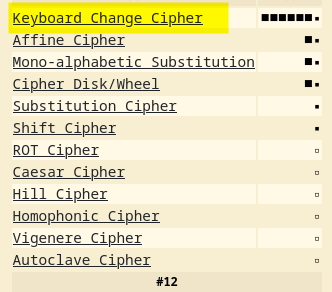
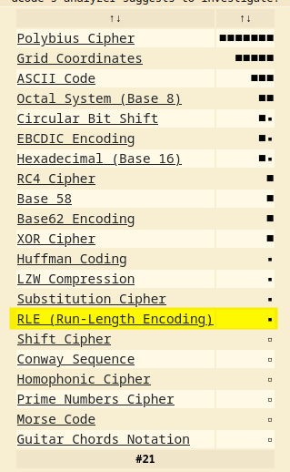

### Level: **_Insane_**


#### Introduction


Legacy challenges from the `US Navy Cyber Competition Team 2019 Assessment` sponsored by [US TENTH Fleet](https://www.fcc.navy.mil/)


Thanks to **[zoobah](https://tryhackme.com/p/zoobah)** for the room on TryHackMe!


---


#### Table of Content


1. [Level: Insane](https://salucci.ch/2023/07/02/ctf-tryhackme-cct2019-crypto1/#level-insane)

   1. [Introduction](https://salucci.ch/2023/07/02/ctf-tryhackme-cct2019-crypto1/#introduction)
   2. [Table of Content](https://salucci.ch/2023/07/02/ctf-tryhackme-cct2019-crypto1/#table-of-content)

2. [CCT2019 - crypto1](https://salucci.ch/2023/07/02/ctf-tryhackme-cct2019-crypto1/#cct2019-crypto1)

   1. [DOWNLOAD THE FILES](https://salucci.ch/2023/07/02/ctf-tryhackme-cct2019-crypto1/#download-the-files)
   2. [CRYPTO1A.TXT](https://salucci.ch/2023/07/02/ctf-tryhackme-cct2019-crypto1/#crypto1a-txt)
   3. [HINT](https://salucci.ch/2023/07/02/ctf-tryhackme-cct2019-crypto1/#hint)
   4. [CIPHER](https://salucci.ch/2023/07/02/ctf-tryhackme-cct2019-crypto1/#cipher)
   5. [HINT](https://salucci.ch/2023/07/02/ctf-tryhackme-cct2019-crypto1/#hint)
   6. [CIPHER](https://salucci.ch/2023/07/02/ctf-tryhackme-cct2019-crypto1/#cipher)
   7. [CYBERCHEF.IO](https://salucci.ch/2023/07/02/ctf-tryhackme-cct2019-crypto1/#cyberchef-io)


---


### CCT2019 - crypto1


Find ye some flags. There are three parts to this challenge, each with its own flag. Solve crypto1a obtain the crypto1a flag and to unlock crypto1b. Solve crypto1b to obtain the crypto1b flag and unlock crypto1c. Solve crypto1c and you'll have all three flags.


**HINT1**  
crypto1a and crypto1b can be solved with freely available online tools


**HINT2**  
For crypto1c, you probably have to code a solution to solve it as I'm not aware of any online tools for this variant. It's not complex to solve if you can figure out the scheme and it is possible to solve by hand although it could be a bit tedious.


**HINT3**  
For crypto1c, start with "0" not "1".


---


##### DOWNLOAD THE FILES


```
mkdir CCT2019
mkdir TASK1
mkdir TASK2
mkdir TASK3
mkdir TASK4

cd TASK4
ls

-rw-r--r-- 1 anyguy anyguy 2007 Jun 29 01:47 crypto1.zip
```


```
# What do we have?
> ZIP File, inside it their is another ZIP File which is encrypted
> TXT File, <strong>crypto1a.txt</strong>
  + Which holds a cipher
```


---


##### CRYPTO1A.TXT


```
Ab .aof y.jdbc'g. urp ornkcbi Ja.oap ogxoycygycrb jcld.po ,cnn rbnf i.y frg or uap x.jago. ru lgbjygaycrb ofmxrnov  Oycnnw cy odrgne i.y frg jnro. .brgid yr ucigp. rgy yd. p.oyv  Xgy jab frg ucigp. rgy yd. t.f ,dcjd dall.bo yr x. yd. bam. ru yd. _nafrgy_ ,dcjd jp.ay.e ydcov Ajygannfw frg dae x.yy.p .by.p cy ydpcj. hgoy yr x. oau. (ann nr,.p[jao. cu frg ln.ao.)v
```


---


[Your best friend...](https://www.dcode.fr/cipher-identifier)





[Get My crypto1a.py Script from GitHub !](https://github.com/trustinveritas/pentest-project-site/blob/main/Cryptographie/CCT2019/crypto1a.py)


---


#### Crypto1b.txt


##### HINT


```
A word of advice for the next one. Don't straddle the fence or you'll end up riding a rail or five. It'll hurt from the bottom up.
```


```
1. Riding a <strong>rail</strong> or <strong>five</strong>
  + Possible: <strong>Rail</strong>-Fence-Cipher
  + Possible: <strong>five</strong> for a setting

2. It'll hurt <strong>from the bottom up</strong>.
  + Read the cipher "<strong>From Bottom</strong> (Left)"
```


---


##### CIPHER


```
n h newuhe eddre nect tota ufyaolim7ter val lcy vsf slAroeeoiroigtatradetlno o pek ?Sl n aee s epeth  atedpairu hsg?Hot oe.wygoelrfo 93aei alsw'e  elntte l o.A eat o,b' by le frnsk,nt tes uv hl o ir lgHayairiteobbaam ibuohlm tursernuuohgteseoob srk    spsrirt1 mdvoho'eI nmpiihi ainuetere susutpa .lwc  dsa   t t,iiorgoguhfecae r tcslhslayhn eseaftaeo peelsantnthu e,nwati  Tetees ecfh ai ofCteb seisn eto potb hyli'rCtirbsx oaego'sbttamt u?Mingfh.e  ev dac cfp  c om  hahh t enm t.esg f ut t  oilso uhao
```


**Encrypt the cipher !**


```
# A hint from my side
1. <em><strong>Keep punctuation and spaces</strong></em>
```


---


[Now that you have the cipher, check out the video](https://www.youtube.com/shorts/-kFxEajJ5kI)


```
Goose Spells <strong>Teerrrriiffiiccc</strong>

# If you read the cipher carefully, you
  have to add some chars.

> <strong>HINT</strong>
  Add <span style="text-decoration: underline">three chars</span>
```


---


#### Crypto1c.txt


##### HINT


```
Last one of the basic batch. But is it compression, encoding, or encryption?
```


[Your best friend again...](https://www.dcode.fr/cipher-identifier)





```
The given sequence could be a <strong>Run-length encoding (RLE)</strong>, which is a form of <em>lossless data compression</em>.
In RLE, runs of data <em>(sequences in which the same data value occurs in many consecutive data elements)</em> are stored as a single data value and count, rather than as the original run. This is most efficient on data that contains many such runs.
```


[More about RLE...](https://en.wikipedia.org/wiki/Run-length_encoding)


---


```
<strong>HINT from the CTF</strong>
For crypto1c, <strong>start with</strong> "<strong>0</strong>" not "1".

# Hint from my side
> <strong><em>BINARY (0 FIRST)</em></strong>
```


##### CIPHER


```
11122112141311112123131222211121621211124112213221112162112113114163113211421121132221622222411321311331611221121413111121231312222111216322121412123312222111122141624112123212416214122231631132114221112162321321242113531132142162321211424112123212322111121322231221111322216222232122141212112163113211422111216231224113221211211232216231224113113232121151124162312311111311416311321142211113212221112162411321222111216212111214132122211121623212114241121232123221111213222312211113222162411211422111124112214113316121421413132163131211211212321241642112141311112162222241132122211121624112231241121121121323221311416311321142141322122111216121212163131214121322213221111321311331615113114162411213242121632122411311322111211241631312211112123212416221321412132221112162411213222141621142211113212221112162112113222164211214131111132131622222123241122323113161421142111111341211212111151322122111122111111512213221111241122131151232121121135211422111132123221115124112123212311513113211422111111513113211211212111221111511
```


---


```
01011001011011110111010100100111011101100110010100100000011011010110000101100100011001010010000001101001011101000010000001110100011010000110100101110011001000000110011001100001011100100010111000100000010110010110111101110101001001110111011001100101001000000111001101101111011011000111011
....
```


```
# You should get something like this
> Note this is only a SNIP !
```


---


##### CYBERCHEF.IO


[Get your Recipe from Cyberchef !](<https://cyberchef.io/#recipe=From_Binary('None',8)&input=MDEwMTEwMDEwMTEwMTExMTAxMTEwMTAxMDAxMDAxMTEwMTExMDExMDAxMTAwMTAxMDAxMDAwMDAwMTEwMTEwMTAxMTAwMDAxMDExMDAxMDAwMTEwMDEwMTAwMTAwMDAwMDExMDEwMDEwMTExMDEwMDAwMTAwMDAwMDExMTAxMDAwMTEwMTAwMDAxMTAxMDAxMDExMTAwMTEwMDEwMDAwMDAxMTAwMTEwMDExMDAwMDEwMTExMDAxMDAwMTAxMTEwMDAxMDAwMDAwMTAxMTAwMTAxMTAxMTExMDExMTAxMDEwMDEwMDExMTAxMTEwMTEwMDExMDAxMDEwMDEwMDAwMDAxMTEwMDExMDExMDExMTEwMTEwMTEwMDAxMTEwMTEwMDExMDAxMDEwMTEwMDEwMDAwMTAwMDAwMDExMDAwMDEwMTEwMTEwMDAxMTAxMTAwMDAxMDAwMDAwMTEwMTExMTAxMTAwMTEwMDAxMDAwMDAwMTExMDEwMDAxMTAxMDAwMDExMDAxMDEwMDEwMDAwMDAxMTAwMDExMDExMTAwMTAwMTExMTAwMTAxMTEwMDAwMDExMTAxMDAwMTEwMTExMTAwMTAwMDAwMDExMDAwMTEwMTEwMTAwMDAxMTAwMDAxMDExMDExMDAwMTEwMTEwMDAxMTAwMTAxMDExMDExMTAwMTEwMDExMTAxMTAwMTAxMDExMTAwMTEwMDEwMDAwMDAxMTAwMTEwMDExMTAwMTAwMTEwMTExMTAxMTAxMTAxMDAxMDAwMDAwMTExMDEwMDAxMTAxMDAwMDExMDAxMDEwMDEwMDAwMDAxMTAwMDEwMDExMDAwMDEwMTExMDAxMTAxMTAxMDAxMDExMDAwMTEwMDEwMDAwMDAxMTAwMDEwMDExMDAwMDEwMTExMDEwMDAxMTAwMDExMDExMDEwMDAwMDEwMTEwMDAwMTAwMDAwMDExMDAwMTAwMTExMDEwMTAxMTEwMTAwMDAxMDAwMDAwMTExMDEwMDAxMTAxMDAwMDExMDAxMDEwMTExMDAxMDAxMTAwMTAxMDAxMDAwMDAwMTEwMDAwMTAxMTEwMDEwMDExMDAxMDEwMDEwMDAwMDAxMTAxMTAxMDExMDExMTEwMTExMDAxMDAxMTAwMTAxMDAxMDAwMDAwMTEwMDAxMTAxMTAxMDAwMDExMDAwMDEwMTEwMTEwMDAxMTAxMTAwMDExMDAxMDEwMTEwMTExMDAxMTAwMTExMDExMDAxMDEwMTExMDAxMTAwMTAwMDAwMDExMDAwMDEwMTEwMTAwMDAxMTAwMTAxMDExMDAwMDEwMTEwMDEwMDAwMTAxMTEwMDAxMDAwMDAwMTAwMTAwMDAxMTAxMTExMDExMTAxMTEwMDEwMDAwMDAxMTEwMTExMDExMDEwMDEwMTEwMTEwMDAxMTAxMTAwMDAxMDAwMDAwMTExMTAwMTAxMTAxMTExMDExMTAxMDEwMDEwMDAwMDAxMTAwMTEwMDExMDAwMDEwMTExMDAxMDAxMTAwMTAxMDAxMDAwMDAwMTEwMDAwMTAxMTAwMTExMDExMDAwMDEwMTEwMTAwMTAxMTAxMTEwMDExMTAwMTEwMTExMDEwMDAwMTAwMDAwMDExMTAxMDAwMTEwMTAwMDAxMTAxMTExMDExMTAwMTEwMTEwMDEwMTAwMTAwMDAwMDEwMDEwMDEwMDEwMDAwMDAxMTEwMTExMDExMDExMTEwMTEwMTExMDAxMTAwMTAwMDExMDAxMDEwMTExMDAxMDAwMTAxMTEwMDAxMDAwMDAwMTAwMDAwMTAxMTEwMTAwMDAxMDAwMDAwMTEwMDAwMTAxMTAxMTEwMDExMTEwMDEwMDEwMDAwMDAxMTEwMDEwMDExMDAwMDEwMTExMDEwMDAxMTAwMTAxMDAxMDExMDAwMDEwMDAwMDAxMTEwMTExMDExMDAxMDEwMTEwMTEwMDAxMTAxMTAwMDAxMDAwMDAwMTEwMDEwMDAxMTAxMTExMDExMDExMTAwMTEwMDEwMTAwMTAwMDAwMDExMDAwMDEwMTEwMTExMDAxMTAwMTAwMDAxMDAwMDAwMTEwMTAwMDAxMTAwMTAxMDExMTAwMTAwMTEwMDEwMTAwMTAwMDAwMDExMDEwMDEwMTExMDAxMTAwMTAwMDAwMDExMTEwMDEwMTEwMTExMTAxMTEwMTAxMDExMTAwMTAwMDEwMDAwMDAxMTAwMTEwMDExMDExMDAwMTEwMDAwMTAxMTAwMTExMDAxMTEwMTAwMDEwMDAw>)


```
# In the input field, put your binary code.
> Note that I removed the flag from the code.
```


- 


