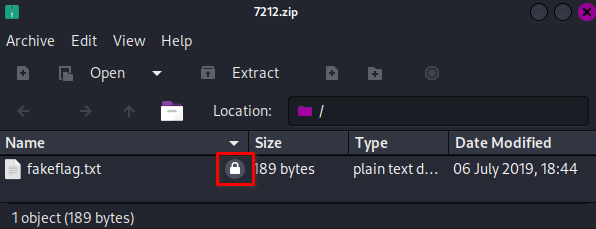
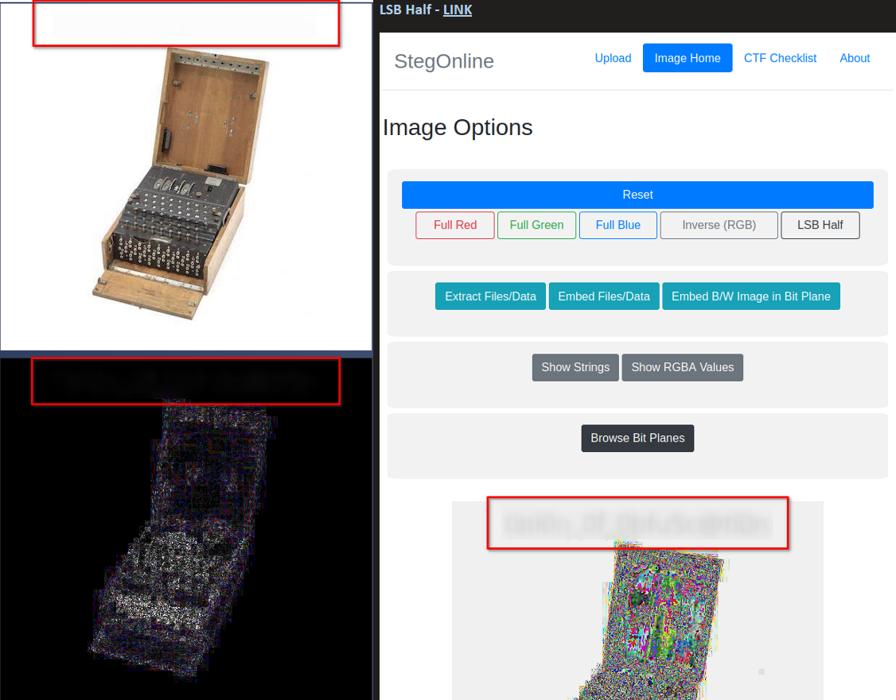
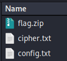

### Level: **_Insane_**


#### Introduction


Legacy challenges from the `US Navy Cyber Competition Team 2019 Assessment` sponsored by [US TENTH Fleet](https://www.fcc.navy.mil/)


Thanks to **[zoobah](https://tryhackme.com/p/zoobah)** for the room on TryHackMe!


---


#### Table of Content


1. [Level: Insane](https://salucci.ch/2023/07/02/ctf-tryhackme-cct2019-for1/#level-insane)

   1. [Introduction](https://salucci.ch/2023/07/02/ctf-tryhackme-cct2019-for1/#introduction)
   2. [Table of Content](https://salucci.ch/2023/07/02/ctf-tryhackme-cct2019-for1/#table-of-content)

2. [CCT2019 - for1](https://salucci.ch/2023/07/02/ctf-tryhackme-cct2019-for1/#cct2019-for1)

   1. [DOWNLAOD THE FILES](https://salucci.ch/2023/07/02/ctf-tryhackme-cct2019-for1/#downlaod-the-files)
   2. [BINWALK the JPEG](https://salucci.ch/2023/07/02/ctf-tryhackme-cct2019-for1/#binwalk-the-jpeg)
   3. [FILE](https://salucci.ch/2023/07/02/ctf-tryhackme-cct2019-for1/#file)
   4. [EXIFTOOL](https://salucci.ch/2023/07/02/ctf-tryhackme-cct2019-for1/#exiftool)
   5. [BINWALK](https://salucci.ch/2023/07/02/ctf-tryhackme-cct2019-for1/#binwalk)
   6. [Since we didn't find anything useful](https://salucci.ch/2023/07/02/ctf-tryhackme-cct2019-for1/#since-we-didn-t-find-anything-useful)
   7. [Findings](https://salucci.ch/2023/07/02/ctf-tryhackme-cct2019-for1/#findings)
   8. [FINDINGS](https://salucci.ch/2023/07/02/ctf-tryhackme-cct2019-for1/#findings)
   9. [Let's try to BRUTE FORCE it](https://salucci.ch/2023/07/02/ctf-tryhackme-cct2019-for1/#let-s-try-to-brute-force-it)
   10. [CIPHER.txt](https://salucci.ch/2023/07/02/ctf-tryhackme-cct2019-for1/#cipher-txt)
   11. [CONFIG.TXT](https://salucci.ch/2023/07/02/ctf-tryhackme-cct2019-for1/#config-txt)


---


### CCT2019 - for1


**UPDATE**  
There was a bug found in cryptii that has now been fixed, but will cause issues on the final step of the challenge. For now, when you find the the cipher text FSXL PXTH EKYT DJXS PYMO JLAY VPRP VO, replace it with this cipher text instead: JHSL PGLW YSQO DQVL PFAO TPCY KPUD TF. Everything else at that step, e.g., the configuration file can remain as-is. I intend to update the challenge file to correct this issue, but this will serve as a temporary fix until that time.


Our former employee Ed is suspected of suspicious activity. We found this image on his work desktop and we believe it is something worth analyzing. Can you assist us in extracting any information of value?


**HINT1**  
if you're not sure if a password is upper- or lower-case, try all lower-case.


**HINT2**  
There are many steps that can be done concurrently in this challenge. If you find you need something, you may have not found the key to unlock it yet. If you have something useful and you're not sure where to use it, it's possible the file you need is still hidden somewhere.


**HINT3**  
[https://cryptii.com/ ](https://cryptii.com/)- Cool website, bro


**HINT4**  
the flag will follow the format CCT`{.\*}`


---


##### DOWNLAOD THE FILES


```
mkdir CCT2019
mkdir TASK1
mkdir TASK2
mkdir TASK3
mkdir TASK4

cd TASK3
ls

-rw-r--r-- 1 anyguy anyguy   29551 Jun 28 18:54 for18f90d68390b565c308871a52c6572de8.for1_8f90d68390b565c308871a52c6572de8
```


```
# What do we have?
> A JPEG image
```


---


#### Analyze the JPEG with EXIFTOOL


```
exiftool for18f90d68390b565c308871a52c6572de8.for1_8f90d68390b565c308871a52c6572de8
```


```
ExifTool Version Number         : 12.57
File Name                       : for18f90d68390b565c308871a52c6572de8.for1_8f90d68390b565c308871a52c6572de8
Directory                       : .
File Size                       : 30 kB
File Modification Date/Time     : 2023:06:28 18:54:56+02:00
File Access Date/Time           : 2023:06:28 18:55:12+02:00
File Inode Change Date/Time     : 2023:06:28 18:55:12+02:00
File Permissions                : -rw-r--r--
<strong>File Type                       : JPEG
File Type Extension             : jpg
MIME Type                       : image/jpeg</strong>
JFIF Version                    : 1.01
Exif Byte Order                 : Big-endian (Motorola, MM)
X Resolution                    : 96
Y Resolution                    : 96
Resolution Unit                 : inches
Artist                          : Ed
Y Cb Cr Positioning             : Centered
Copyright                       : CCT 2019
XMP Toolkit                     : Image::ExifTool 11.16
Description                     : <strong>.--- ..- ... - .- .-- .- .-. -- ..- .--. .-. .. --. .... - ..--..</strong>
<strong>Author                          : Ed</strong>
Image Width                     : 514
Image Height                    : 480
<strong>Encoding Process                : Baseline DCT, Huffman coding</strong>
Bits Per Sample                 : 8
Color Components                : 3
Y Cb Cr Sub Sampling            : YCbCr4:2:0 (2 2)
Image Size                      : 514x480
Megapixels                      : 0.247
```


---


#### Morsecode Found !


```
<strong>.--- ..- ... - .- .-- .- .-. -- ..- .--. .-. .. --. .... - ..--..</strong>
```


[Get my MORSECODE-2-STRING Python script !](https://github.com/trustinveritas/pentest-project-site/blob/main/Cryptographie/MORSE-CODE/morse-code-to-string.py)


---


##### BINWALK the JPEG


```
binwalk for18f90d68390b565c308871a52c6572de8.for1_8f90d68390b565c308871a52c6572de8
```


```
DECIMAL       HEXADECIMAL     DESCRIPTION
--------------------------------------------------------------------------------
0             0x0             <strong>JPEG image data</strong>, JFIF standard 1.01
30            0x1E            <strong>TIFF image data</strong>, big-endian, offset of first image directory: 8
29202         0x7212          <strong>Zip archive data, encrypted</strong> at least v2.0 to extract, compressed size: 159, uncompressed size: 189, name: <strong>fakeflag.txt</strong>
29529         0x7359          End of Zip archive, footer length: 22
```


```
binwalk -e for18f90d68390b565c308871a52c6572de8.for1_8f90d68390b565c308871a52c6572de8
```


```
# We exported

DECIMAL       HEXADECIMAL     DESCRIPTION
--------------------------------------------------------------------------------
0             0x<strong>0</strong>             <strong>JPEG image data</strong>, JFIF standard 1.01
30            0x<strong>1E</strong>            <strong>TIFF image data</strong>, big-endian, offset of first image directory: 8
29202         0x<strong>7212</strong>          <strong>Zip archive data, encrypted</strong> at least v2.0 to extract, compressed size: 159, uncompressed size: 189, name: fakeflag.txt
29529         0x7359          End of Zip archive, footer length: 22
```


```
ls -la
```


```
total 4
-rw-r--r-- 1 anyguy anyguy 349 Jun 28 19:08 <strong>7212.zip</strong>
-rw-r--r-- 1 anyguy anyguy   0 Jul  6  2019 <strong>fakeflag.txt</strong>
```


---


##### FILE


```
file fakeflag.txt
```


```
fakeflag.txt: <strong>empty</strong>
```


```
file 7212.zip
```


```
7212.zip: <strong>Zip archive data</strong>, at least v2.0 to extract, <strong>compression method=deflate</strong>
```


---


##### EXIFTOOL


```
exiftool fakeflag.txt
```


```
ExifTool Version Number         : 12.57
File Name                       : fakeflag.txt
Directory                       : .
File Size                       : 0 bytes
File Modification Date/Time     : 2019:07:06 18:44:34+02:00
File Access Date/Time           : 2023:06:28 19:09:22+02:00
File Inode Change Date/Time     : 2023:06:28 19:08:14+02:00
File Permissions                : -rw-r--r--
Error                           : File is empty
```


```
exiftool 7212.zip
```


```
ExifTool Version Number         : 12.57
File Name                       : 7212.zip
Directory                       : .
File Size                       : 349 bytes
File Modification Date/Time     : 2023:06:28 19:08:14+02:00
File Access Date/Time           : 2023:06:28 19:10:03+02:00
File Inode Change Date/Time     : 2023:06:28 19:08:14+02:00
File Permissions                : -rw-r--r--
<strong>File Type                       : ZIP
File Type Extension             : zip
MIME Type                       : application/zip</strong>
Zip Required Version            : 20
Zip Bit Flag                    : 0x0009
Zip Compression                 : Deflated
<strong>Zip Modify Date                 : 2019:07:06 12:44:34</strong>
Zip CRC                         : 0x5d48380c
Zip Compressed Size             : 159
Zip Uncompressed Size           : 189
<strong>Zip File Name                   : fakeflag.txt</strong>
```


---


##### BINWALK


```
binwalk 7212.zip
```


```
DECIMAL       HEXADECIMAL     DESCRIPTION
--------------------------------------------------------------------------------
0             0x<strong>0             Zip archive data</strong>, <strong>encrypted</strong> at least v2.0 to extract, compressed size: 159, uncompressed size: 189, name: <strong>fakeflag.txt</strong>
327           0x147           End of Zip archive, footer length: 22
```





---


#### Photo Forensic


##### Since we didn't find anything useful


[Cool Site for Photo Forensics](https://fotoforensics.com/analysis.php?id=9fadd0e5e795a3fa3ced73abee52ff9335158286.29551)


[StegOnline.com](https://stegonline.georgeom.net/image)





---


```
# We found a password !
> It's not working for the encrypted zip tho...
```


---


#### HEXDUMP of the 7217.zip


```
hexdump -C 7212.zip
```


```
00000000  <strong>50 4b 03 04</strong> 14 00 09 00  08 00 91 65 e6 4e 0c 38  |<strong>PK</strong>.........e.N.8|
00000010  48 5d 9f 00 00 00 bd 00  00 00 0c 00 1c 00 66 61  |H]............fa|
00000020  6b 65 66 6c 61 67 2e 74  78 74 55 54 09 00 03 f2  |keflag.txtUT....|
00000030  cf 20 5d 16 d0 20 5d 75  78 0b 00 01 04 00 00 00  |. ].. ]ux.......|
00000040  00 04 00 00 00 00 42 d1  62 3d 73 db ff f6 26 e6  |......B.b=s...&.|
00000050  20 41 83 10 c3 f1 a4 b9  0c 2c da 63 62 d3 47 e9  | A.......,.cb.G.|
00000060  39 cd c5 ee bd d7 f7 e7  44 2a c3 8e 47 f2 22 1b  |9.......D*..G.".|
00000070  29 0d c5 d8 f7 29 ff ab  4a 6e 1d dd d4 51 52 11  |)....)..Jn...QR.|
00000080  41 f2 4e 65 87 7b 70 79  75 91 18 48 d3 6d 3d 96  |A.Ne.{pyu..H.m=.|
00000090  68 5b 6c 85 57 57 36 64  84 cd d7 6f 78 cf 60 eb  |h[l.WW6d...ox.`.|
000000a0  05 e7 d2 06 4b c8 f1 4a  58 96 3b bf 24 75 1a 40  |....K..JX.;.$u.@|
000000b0  26 84 0d ed d0 7b d7 71  da 1c f5 39 26 1e 20 df  |&....{.q...9&. .|
000000c0  0b 22 0d 71 56 1d ea a1  3f 86 8e 08 47 9a d0 b1  |.".qV...?...G...|
000000d0  69 85 85 3f 5b 1d a7 d7  e2 2e a1 77 84 07 0a 33  |i..?[......w...3|
000000e0  84 c1 bf 67 6b 50 4b 07  08 0c 38 48 5d 9f 00 00  |...gkPK...8H]...|
000000f0  00 bd 00 00 00 50 4b 01  02 1e 03 14 00 09 00 08  |.....PK.........|
00000100  00 91 65 e6 4e 0c 38 48  5d 9f 00 00 00 bd 00 00  |..e.N.8H].......|
00000110  00 0c 00 18 00 00 00 00  00 01 00 00 00 a4 81 00  |................|
00000120  00 00 00 66 61 6b 65 66  6c 61 67 2e 74 78 74 55  |...fakeflag.txtU|
00000130  54 05 00 03 f2 cf 20 5d  75 78 0b 00 01 04 00 00  |T..... ]ux......|
00000140  00 00 04 00 00 00 00 <strong>50  4b 05 06</strong> 00 00 00 00 01  |.......<strong>PK</strong>.......|
00000150  00 01 00 52 00 00 00 f5  00 00 00 00 00           |...<strong>R</strong>.........|
0000015d
```


##### Findings


```
1. We have the ZIP we know
  + Magic Byte <strong>50 4B 03 04 == PK</strong>

2. We have another ZIP
  + 2nd Magic Byte <strong>50 4B 05 06 == PK</strong>
```


[List of File Signatures](https://en.wikipedia.org/wiki/List_of_file_signatures)


---


#### STEGSEEK - Stego crack (Brute-Force)


**HINT**  
[StegSeek](https://github.com/RickdeJager/stegseek) has the whole rockyou.txt in 2 sec.


```
# Since we didn't find anything useful with <strong>binwalk</strong> - let's try <strong>stegseek</strong>
```


```
stegseek --seed for18f90d68390b565c308871a52c6572de8.for1_8f90d68390b565c308871a52c6572de8 -
```


```
StegSeek 0.6 - https://github.com/RickdeJager/StegSeek

<strong>[i] Found (possible) seed: "1594f606"</strong>
        Plain size: 656.0 Byte(s) (compressed)
        Encryption Algorithm: <strong>rijndael-128</strong>
        Encryption Mode:      <strong>cbc</strong>
```


##### FINDINGS


```
1. We found a seed inside the *.JPG !
  + Enc-Algo is: <strong>rijndael-128</strong>
  + Enc-Mode is: <strong>cbc</strong>
```


---


##### Let's try to BRUTE FORCE it


```
stegseek for18f90d68390b565c308871a52c6572de8.for1_8f90d68390b565c308871a52c6572de8 /001TOOLS/Cyber/BruteForce/WORDLIST/realuniq.lst
```


```
StegSeek 0.6 - https://github.com/RickdeJager/StegSeek

[i] Found passphrase: "<strong>*************</strong>"
[i] Original filename: "<strong>archive.zip</strong>".
[i] Extracting to "<strong>for18f90d68390b565c308871a52c6572de8.for1_8f90d68390b565c308871a52c6572de8.out</strong>".
```


```
# We got the password !
> It's not working with the <strong>archive.zip</strong>
> But if you use the password from the
  enigma machine picture - It works !
```


---


#### Archive.zip





---


##### CIPHER.txt


```
FSXL PXTH EKYT DJXS PYMO JLAY VPRP VO
==
<strong>JHSL PGLW YSQO DQVL PFAO TPCY KPUD TF</strong>
```


---


##### CONFIG.TXT


```
This has the configuration for the enigma machine
```


---


#### Crack the Cipher with the Enigma Machine


[Enigma Machine Emulator](https://cryptii.com/)


|               |                                        |              |              |
| ------------- | -------------------------------------- | ------------ | ------------ |
| **REFLECTOR** | UKW C thin                             | **POSITION** | **RING**     |
| **ROTOR 1**   | Gamma                                  |              |              |
| **ROTOR 2**   | VI                                     |              |              |
| **ROTOR 3**   | VII                                    |              |              |
| **ROTOR 4**   | VIII                                   |              |              |
| **PLUGBOARD** | AM BY CH DR EL FX GO IV JN KU PS QT WZ | nothing here | nothing here |

Engima Machine Settings


```
# Now you just have to find the right <strong>Position</strong> and <strong>Ring </strong>from the <strong>config.txt</strong>

> <strong>HINT</strong> - RING settings <span style="text-decoration: underline">has the same name inside the config.txt</span>

> <strong>HINT</strong> - POSITION is <span style="text-decoration: underline">the other string</span>
```


- 


