<!-- wp:heading {"level":3,"anchor":"level-insane"} -->

### Level: **_Insane_**

<!-- /wp:heading -->

<!-- wp:heading {"level":4,"anchor":"introduction"} -->

#### Introduction

<!-- /wp:heading -->

<!-- wp:paragraph -->

Legacy challenges from the `US Navy Cyber Competition Team 2019 Assessment` sponsored by [US TENTH Fleet](https://www.fcc.navy.mil/)

<!-- /wp:paragraph -->

<!-- wp:paragraph -->

Thanks to **[zoobah](https://tryhackme.com/p/zoobah)** for the room on TryHackMe!

<!-- /wp:paragraph -->

<!-- wp:separator -->

---

<!-- /wp:separator -->

<!-- wp:heading {"level":4,"anchor":"table-of-content"} -->

#### Table of Content

<!-- /wp:heading -->

<!-- wp:table-of-contents {"headings":[{"content":"Level: Insane","level":3,"link":"https://salucci.ch/2023/07/02/ctf-tryhackme-cct2019/#level-insane"},{"content":"Introduction","level":4,"link":"https://salucci.ch/2023/07/02/ctf-tryhackme-cct2019/#introduction"},{"content":"Table of Content","level":4,"link":"https://salucci.ch/2023/07/02/ctf-tryhackme-cct2019/#table-of-content"},{"content":"CCT2019 - pcap1","level":3,"link":"https://salucci.ch/2023/07/02/ctf-tryhackme-cct2019/#cct2019-pcap1"},{"content":"This is a pcap-focused challenge originally created for the U.S. Navy Cyber Competition Team 2019 Assessment.","level":5,"link":"https://salucci.ch/2023/07/02/ctf-tryhackme-cct2019/#this-is-a-pcap-focused-challenge-originally-created-for-the-u-s-navy-cyber-competition-team-2019-assessment"},{"content":"Download the files","level":5,"link":"https://salucci.ch/2023/07/02/ctf-tryhackme-cct2019/#download-the-files"},{"content":"Analyze the PCAP with Wireshark","level":4,"link":"https://salucci.ch/2023/07/02/ctf-tryhackme-cct2019/#analyze-the-pcap-with-wireshark"},{"content":"Expert Information","level":5,"link":"https://salucci.ch/2023/07/02/ctf-tryhackme-cct2019/#expert-information"},{"content":"What Do We Have?","level":5,"link":"https://salucci.ch/2023/07/02/ctf-tryhackme-cct2019/#what-do-we-have"},{"content":"What is from interest for us?","level":5,"link":"https://salucci.ch/2023/07/02/ctf-tryhackme-cct2019/#what-is-from-interest-for-us"},{"content":"Searching for ANOMALIES","level":5,"link":"https://salucci.ch/2023/07/02/ctf-tryhackme-cct2019/#searching-for-anomalies"},{"content":"Possible Findings","level":5,"link":"https://salucci.ch/2023/07/02/ctf-tryhackme-cct2019/#possible-findings"},{"content":"Add Wireshark Profile: USB","level":5,"link":"https://salucci.ch/2023/07/02/ctf-tryhackme-cct2019/#add-wireshark-profile-usb"},{"content":"How Do We Get The Data?","level":5,"link":"https://salucci.ch/2023/07/02/ctf-tryhackme-cct2019/#how-do-we-get-the-data"},{"content":"TShark - Wireshark CLI","level":4,"link":"https://salucci.ch/2023/07/02/ctf-tryhackme-cct2019/#tshark-wireshark-cli"},{"content":"WINDOWS","level":5,"link":"https://salucci.ch/2023/07/02/ctf-tryhackme-cct2019/#windows"},{"content":"COMMAND IN A NUTSHELL","level":6,"link":"https://salucci.ch/2023/07/02/ctf-tryhackme-cct2019/#command-in-a-nutshell"},{"content":"LINUX","level":5,"link":"https://salucci.ch/2023/07/02/ctf-tryhackme-cct2019/#linux"},{"content":"HEXDUMP","level":5,"link":"https://salucci.ch/2023/07/02/ctf-tryhackme-cct2019/#hexdump"},{"content":"BINWALK","level":5,"link":"https://salucci.ch/2023/07/02/ctf-tryhackme-cct2019/#binwalk"},{"content":"Findings","level":5,"link":"https://salucci.ch/2023/07/02/ctf-tryhackme-cct2019/#findings"},{"content":"Analyze the new PCAP with Wireshark","level":4,"link":"https://salucci.ch/2023/07/02/ctf-tryhackme-cct2019/#analyze-the-new-pcap-with-wireshark"},{"content":"WIRESHARK 101 - Things of Interest","level":5,"link":"https://salucci.ch/2023/07/02/ctf-tryhackme-cct2019/#wireshark-101-things-of-interest"},{"content":"Protocol Hierarchy","level":5,"link":"https://salucci.ch/2023/07/02/ctf-tryhackme-cct2019/#protocol-hierarchy"},{"content":"Findings","level":5,"link":"https://salucci.ch/2023/07/02/ctf-tryhackme-cct2019/#findings"},{"content":"Investigate Protocol: IRC","level":5,"link":"https://salucci.ch/2023/07/02/ctf-tryhackme-cct2019/#investigate-protocol-irc"},{"content":"Findings","level":5,"link":"https://salucci.ch/2023/07/02/ctf-tryhackme-cct2019/#findings"},{"content":"Investigate Protocol: ICMP","level":5,"link":"https://salucci.ch/2023/07/02/ctf-tryhackme-cct2019/#investigate-protocol-icmp"},{"content":"Findings","level":5,"link":"https://salucci.ch/2023/07/02/ctf-tryhackme-cct2019/#findings"},{"content":"WIRESHARK 101 - Things of Interest","level":5,"link":"https://salucci.ch/2023/07/02/ctf-tryhackme-cct2019/#wireshark-101-things-of-interest"},{"content":"Conversations \u0026gt; TCP","level":5,"link":"https://salucci.ch/2023/07/02/ctf-tryhackme-cct2019/#conversations-tcp"},{"content":"FURTHER INVESTIGATIONS","level":5,"link":"https://salucci.ch/2023/07/02/ctf-tryhackme-cct2019/#further-investigations"},{"content":"Let's Inspect the HOST'S","level":5,"link":"https://salucci.ch/2023/07/02/ctf-tryhackme-cct2019/#let-s-inspect-the-host-s"},{"content":"WIRESHARK 101 - Things of Interest","level":5,"link":"https://salucci.ch/2023/07/02/ctf-tryhackme-cct2019/#wireshark-101-things-of-interest"},{"content":"Let's focus on the ICMP chat","level":5,"link":"https://salucci.ch/2023/07/02/ctf-tryhackme-cct2019/#let-s-focus-on-the-icmp-chat"},{"content":"What is CRYPTCAT?","level":5,"link":"https://salucci.ch/2023/07/02/ctf-tryhackme-cct2019/#what-is-cryptcat"},{"content":"PoC - Decrypt Cryptcat","level":4,"link":"https://salucci.ch/2023/07/02/ctf-tryhackme-cct2019/#poc-decrypt-cryptcat"},{"content":"Mind Blowing Part","level":5,"link":"https://salucci.ch/2023/07/02/ctf-tryhackme-cct2019/#mind-blowing-part"},{"content":"Findings","level":5,"link":"https://salucci.ch/2023/07/02/ctf-tryhackme-cct2019/#findings"},{"content":"Let's create a fake IRC Server","level":4,"link":"https://salucci.ch/2023/07/02/ctf-tryhackme-cct2019/#let-s-create-a-fake-irc-server"},{"content":"Change /etc/hosts","level":5,"link":"https://salucci.ch/2023/07/02/ctf-tryhackme-cct2019/#change-etc-hosts"},{"content":"Start WIRESHARK to record on interface: LO == loopback","level":5,"link":"https://salucci.ch/2023/07/02/ctf-tryhackme-cct2019/#start-wireshark-to-record-on-interface-lo-loopback"}]} -->

1. [Level: Insane](https://salucci.ch/2023/07/02/ctf-tryhackme-cct2019/#level-insane)

   1. [Introduction](https://salucci.ch/2023/07/02/ctf-tryhackme-cct2019/#introduction)
   2. [Table of Content](https://salucci.ch/2023/07/02/ctf-tryhackme-cct2019/#table-of-content)

2. [CCT2019 - pcap1](https://salucci.ch/2023/07/02/ctf-tryhackme-cct2019/#cct2019-pcap1)

   1. [This is a pcap-focused challenge originally created for the U.S. Navy Cyber Competition Team 2019 Assessment.](https://salucci.ch/2023/07/02/ctf-tryhackme-cct2019/#this-is-a-pcap-focused-challenge-originally-created-for-the-u-s-navy-cyber-competition-team-2019-assessment)

   2. [Download the files](https://salucci.ch/2023/07/02/ctf-tryhackme-cct2019/#download-the-files)

   3. [Expert Information](https://salucci.ch/2023/07/02/ctf-tryhackme-cct2019/#expert-information)

   4. [What Do We Have?](https://salucci.ch/2023/07/02/ctf-tryhackme-cct2019/#what-do-we-have)

   5. [What is from interest for us?](https://salucci.ch/2023/07/02/ctf-tryhackme-cct2019/#what-is-from-interest-for-us)

   6. [Searching for ANOMALIES](https://salucci.ch/2023/07/02/ctf-tryhackme-cct2019/#searching-for-anomalies)

   7. [Possible Findings](https://salucci.ch/2023/07/02/ctf-tryhackme-cct2019/#possible-findings)

   8. [Add Wireshark Profile: USB](https://salucci.ch/2023/07/02/ctf-tryhackme-cct2019/#add-wireshark-profile-usb)

   9. [How Do We Get The Data?](https://salucci.ch/2023/07/02/ctf-tryhackme-cct2019/#how-do-we-get-the-data)

   10. [WINDOWS](https://salucci.ch/2023/07/02/ctf-tryhackme-cct2019/#windows)

       1. [COMMAND IN A NUTSHELL](https://salucci.ch/2023/07/02/ctf-tryhackme-cct2019/#command-in-a-nutshell)

   11. [LINUX](https://salucci.ch/2023/07/02/ctf-tryhackme-cct2019/#linux)

   12. [HEXDUMP](https://salucci.ch/2023/07/02/ctf-tryhackme-cct2019/#hexdump)

   13. [BINWALK](https://salucci.ch/2023/07/02/ctf-tryhackme-cct2019/#binwalk)

   14. [Findings](https://salucci.ch/2023/07/02/ctf-tryhackme-cct2019/#findings)

   15. [WIRESHARK 101 - Things of Interest](https://salucci.ch/2023/07/02/ctf-tryhackme-cct2019/#wireshark-101-things-of-interest)

   16. [Protocol Hierarchy](https://salucci.ch/2023/07/02/ctf-tryhackme-cct2019/#protocol-hierarchy)

   17. [Findings](https://salucci.ch/2023/07/02/ctf-tryhackme-cct2019/#findings)

   18. [Investigate Protocol: IRC](https://salucci.ch/2023/07/02/ctf-tryhackme-cct2019/#investigate-protocol-irc)

   19. [Findings](https://salucci.ch/2023/07/02/ctf-tryhackme-cct2019/#findings)

   20. [Investigate Protocol: ICMP](https://salucci.ch/2023/07/02/ctf-tryhackme-cct2019/#investigate-protocol-icmp)

   21. [Findings](https://salucci.ch/2023/07/02/ctf-tryhackme-cct2019/#findings)

   22. [WIRESHARK 101 - Things of Interest](https://salucci.ch/2023/07/02/ctf-tryhackme-cct2019/#wireshark-101-things-of-interest)

   23. [Conversations > TCP](https://salucci.ch/2023/07/02/ctf-tryhackme-cct2019/#conversations-tcp)

   24. [FURTHER INVESTIGATIONS](https://salucci.ch/2023/07/02/ctf-tryhackme-cct2019/#further-investigations)

   25. [Let's Inspect the HOST'S](https://salucci.ch/2023/07/02/ctf-tryhackme-cct2019/#let-s-inspect-the-host-s)

   26. [WIRESHARK 101 - Things of Interest](https://salucci.ch/2023/07/02/ctf-tryhackme-cct2019/#wireshark-101-things-of-interest)

   27. [Let's focus on the ICMP chat](https://salucci.ch/2023/07/02/ctf-tryhackme-cct2019/#let-s-focus-on-the-icmp-chat)

   28. [What is CRYPTCAT?](https://salucci.ch/2023/07/02/ctf-tryhackme-cct2019/#what-is-cryptcat)

   29. [Mind Blowing Part](https://salucci.ch/2023/07/02/ctf-tryhackme-cct2019/#mind-blowing-part)

   30. [Findings](https://salucci.ch/2023/07/02/ctf-tryhackme-cct2019/#findings)

   31. [Change /etc/hosts](https://salucci.ch/2023/07/02/ctf-tryhackme-cct2019/#change-etc-hosts)

   32. [Start WIRESHARK to record on interface: LO == loopback](https://salucci.ch/2023/07/02/ctf-tryhackme-cct2019/#start-wireshark-to-record-on-interface-lo-loopback)

<!-- /wp:table-of-contents -->

<!-- wp:separator {"className":"is-style-wide"} -->

---

<!-- /wp:separator -->

<!-- wp:heading {"level":3,"anchor":"cct2019-pcap1"} -->

### CCT2019 - pcap1

<!-- /wp:heading -->

<!-- wp:heading {"level":5,"anchor":"this-is-a-pcap-focused-challenge-originally-created-for-the-u-s-navy-cyber-competition-team-2019-assessment"} -->

##### This is a pcap-focused challenge originally created for the U.S. Navy Cyber Competition Team 2019 Assessment.

<!-- /wp:heading -->

<!-- wp:paragraph -->

Although the assessment is over, the created challenges are provided for community consumption here.

<!-- /wp:paragraph -->

<!-- wp:paragraph -->

If you find the right clues, they will guide you to the next step. I did include some red herrings in this challenge, but you can stay on track by focusing on pcap-related skills.

<!-- /wp:paragraph -->

<!-- wp:paragraph -->

**HINT1**  
It's a pcap challenge. If you're doing stego or re, you're either down a rabbit hole or there's an easier way.

<!-- /wp:paragraph -->

<!-- wp:paragraph -->

**HINT2**  
It is very important to do the first step correctly. If you don't recover the first file in its entirety, you may not be able to complete steps later on in the challenge. The second pcap file has 4588 packets in it. Contact me on Discord (send a DM to username zoobah) if you are struggling with this step.

<!-- /wp:paragraph -->

<!-- wp:paragraph -->

**HINT3**  
On the final step, this was built to run in a amd64 Kali Linux environment. If you are using a different Linux distro, you may run into some problems.

<!-- /wp:paragraph -->

<!-- wp:separator -->

---

<!-- /wp:separator -->

<!-- wp:heading {"level":5,"anchor":"download-the-files"} -->

##### Download the files

<!-- /wp:heading -->

<!-- wp:syntaxhighlighter/code {"language":"bash"} -->

```
mkdir CCT2019
mkdir TASK1
mkdir TASK2
mkdir TASK3
mkdir TASK4

cd TASK1
ls

-rwxr-xr-x 1 anyguy anyguy 2309752 Jun 26 21:26 pcap2.pcapng
```

<!-- /wp:syntaxhighlighter/code -->

<!-- wp:preformatted {"backgroundColor":"tertiary"} -->

```
# What do we have?
> A file called <strong>pcap2.pcapng</strong>
  + <strong>P</strong>acket <strong>CAP</strong>ture <strong>N</strong>ext <strong>G</strong>eneration
  + Network Traffic Packet
  <a rel="noreferrer noopener" href="https://wiki.wireshark.org/Development/PcapNg" target="_blank">+ More about *.pcapng</a>
```

<!-- /wp:preformatted -->

<!-- wp:separator -->

---

<!-- /wp:separator -->

<!-- wp:heading {"level":4,"anchor":"analyze-the-pcap-with-wireshark"} -->

#### Analyze the PCAP with [Wireshark](https://www.wireshark.org/download.html)

<!-- /wp:heading -->

<!-- wp:heading {"level":5,"anchor":"expert-information"} -->

##### Expert Information

<!-- /wp:heading -->

<!-- wp:preformatted {"backgroundColor":"tertiary"} -->

```
# In Wireshark
<strong>Analyze > Expert Information</strong>

# In this case it's empty...
```

<!-- /wp:preformatted -->

<!-- wp:spacer {"height":"10px"} -->

<!-- /wp:spacer -->

<!-- wp:image {"align":"full","id":717,"sizeSlug":"full","linkDestination":"none"} -->

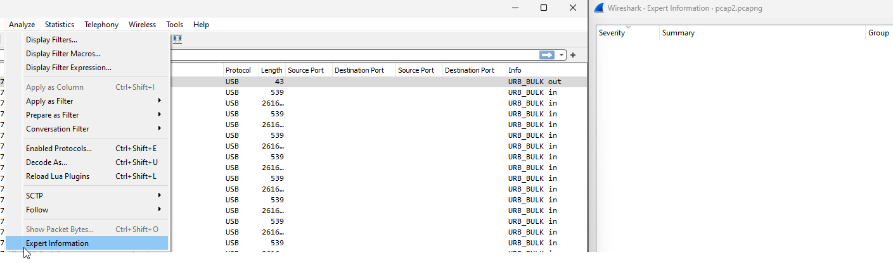

<!-- /wp:image -->

<!-- wp:spacer {"height":"10px"} -->

<!-- /wp:spacer -->

<!-- wp:heading {"level":5,"anchor":"what-do-we-have"} -->

##### What Do We Have?

<!-- /wp:heading -->

<!-- wp:spacer {"height":"10px"} -->

<!-- /wp:spacer -->

<!-- wp:image {"align":"full","id":720,"sizeSlug":"full","linkDestination":"none"} -->

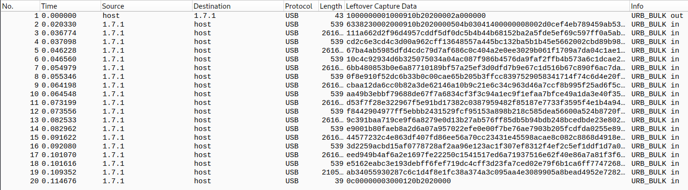

<!-- /wp:image -->

<!-- wp:spacer {"height":"10px"} -->

<!-- /wp:spacer -->

<!-- wp:preformatted {"backgroundColor":"tertiary"} -->

```
# What do we have inside the PCAP?
> Protocol: <strong>USB</strong>
> Data from Client to USB-Device: <strong>URB_BULK out</strong>
> Data from USB-Device to Client: <strong>URB_BULK in</strong>
```

<!-- /wp:preformatted -->

<!-- wp:buttons {"align":"wide","layout":{"type":"flex","justifyContent":"center"}} -->

<!-- wp:button -->

[Get My WIRESHARK PROFILES](https://github.com/trustinveritas/pentest-project-site/blob/main/Wireshark/WireShark-Profiles.zip)

<!-- /wp:button -->

<!-- wp:button -->

[More about the USB Protocol](https://www.totalphase.com/blog/2020/07/about-the-usb-protocol-common-usb-bus-errors-and-how-to-troubleshoot-them/)

<!-- /wp:button -->

<!-- /wp:buttons -->

<!-- wp:heading {"level":5,"anchor":"what-is-from-interest-for-us"} -->

##### What is from interest for us?

<!-- /wp:heading -->

<!-- wp:spacer {"height":"10px"} -->

<!-- /wp:spacer -->

<!-- wp:image {"align":"full","id":724,"sizeSlug":"full","linkDestination":"none"} -->

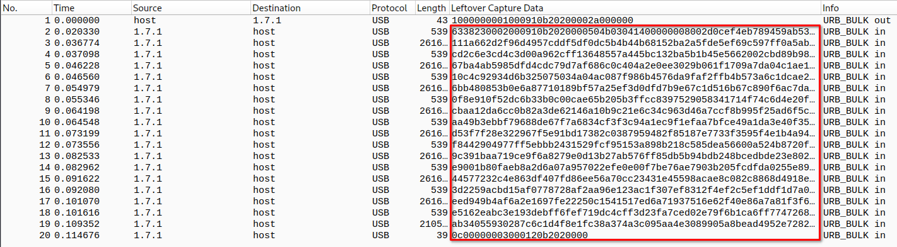

<!-- /wp:image -->

<!-- wp:spacer {"height":"10px"} -->

<!-- /wp:spacer -->

<!-- wp:preformatted {"backgroundColor":"tertiary"} -->

```
# What do we want?
> We want the <strong>data transferd to the client</strong>
```

<!-- /wp:preformatted -->

<!-- wp:heading {"level":5,"anchor":"searching-for-anomalies"} -->

##### Searching for ANOMALIES

<!-- /wp:heading -->

<!-- wp:preformatted {"backgroundColor":"tertiary"} -->

```
+ Packet: 01 | Size: <strong>43</strong> | Info: URB_BULK out
  - from Host > <em><strong>USB-Device</strong></em>
  - could be a possible command or request from the host, to the usb-device

+ Packet: 2 - 18 | Size: <strong>539</strong> or <strong>261659</strong> | Info: URB_BULK in
  - from <em><strong>USB-Device</strong></em> > Host
  - could be possible data transmitted from usb-device to the host

+ Packet: 19 | Size: <strong>210558</strong> | Info: URB_BULK in
  - from <em><strong>USB-Device</strong></em> > Host
  - the size is completely different compared to the other packets - smaller size

+ Packet 20 | Size: <strong>39</strong> | Info: URB_BULK in
  - from <em><strong>USB-Device</strong></em> > Host
  - the size is completely different compared to the other packets - smaller size
```

<!-- /wp:preformatted -->

<!-- wp:spacer {"height":"10px"} -->

<!-- /wp:spacer -->

<!-- wp:image {"align":"full","id":729,"sizeSlug":"full","linkDestination":"none"} -->

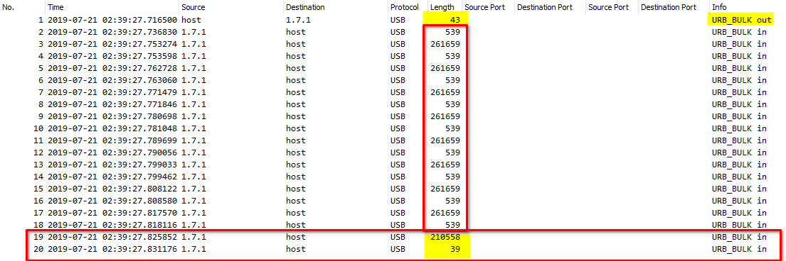

<!-- /wp:image -->

<!-- wp:spacer {"height":"10px"} -->

<!-- /wp:spacer -->

<!-- wp:heading {"level":5,"anchor":"possible-findings"} -->

##### Possible Findings

<!-- /wp:heading -->

<!-- wp:preformatted {"backgroundColor":"tertiary"} -->

```
1. It is also interesting that the traffic appears very regular.

2. There are a lot of packets that are sent at short, regular intervals.

<strong><em>This could indicate that some automated activity is taking place, such as copying files or transferring data.</em></strong>
```

<!-- /wp:preformatted -->

<!-- wp:separator -->

---

<!-- /wp:separator -->

<!-- wp:heading {"level":5,"anchor":"add-wireshark-profile-usb"} -->

##### Add Wireshark Profile: USB

<!-- /wp:heading -->

<!-- wp:preformatted {"backgroundColor":"tertiary"} -->

```
# In Wireshark
Right click on - <strong>Profile: Default</strong>
New...
USB
OK

<strong>Edit > Preferences... > Layout</strong>
OK

Right click on - <strong>Leftover Capture Data</strong>
Apply as Column
```

<!-- /wp:preformatted -->

<!-- wp:paragraph -->

Or download my WIRESHARK PROFILES from my [GitHub Repo](https://github.com/trustinveritas/pentest-project-site/blob/main/Wireshark/WireShark-Profiles.zip)

<!-- /wp:paragraph -->

<!-- wp:spacer {"height":"10px"} -->

<!-- /wp:spacer -->

<!-- wp:columns {"align":"full"} -->

<!-- wp:column -->

<!-- wp:image {"id":733,"sizeSlug":"full","linkDestination":"none"} -->

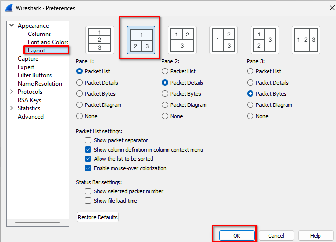

<!-- /wp:image -->

<!-- /wp:column -->

<!-- wp:column -->

<!-- wp:image {"id":734,"sizeSlug":"full","linkDestination":"none"} -->

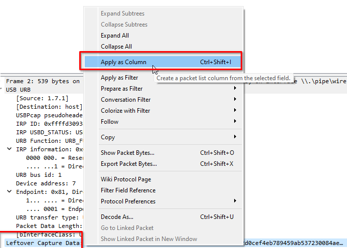

<!-- /wp:image -->

<!-- /wp:column -->

<!-- /wp:columns -->

<!-- wp:spacer {"height":"10px"} -->

<!-- /wp:spacer -->

<!-- wp:separator -->

---

<!-- /wp:separator -->

<!-- wp:heading {"level":5,"anchor":"how-do-we-get-the-data"} -->

##### How Do We Get The Data?

<!-- /wp:heading -->

<!-- wp:preformatted {"backgroundColor":"tertiary"} -->

```
# In Wireshark... Create Filter
<strong>usb.dst == "host"</strong>
```

<!-- /wp:preformatted -->

<!-- wp:spacer {"height":"10px"} -->

<!-- /wp:spacer -->

<!-- wp:image {"align":"wide","id":737,"sizeSlug":"full","linkDestination":"none"} -->

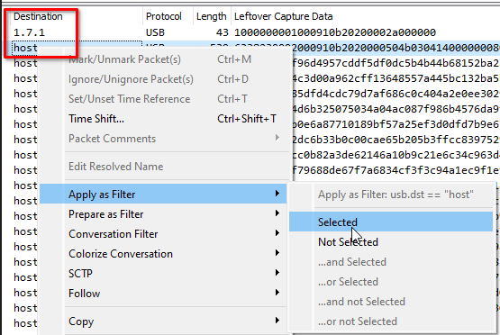

<!-- /wp:image -->

<!-- wp:spacer {"height":"10px"} -->

<!-- /wp:spacer -->

<!-- wp:separator {"className":"is-style-wide"} -->

---

<!-- /wp:separator -->

<!-- wp:heading {"level":4,"anchor":"tshark-wireshark-cli"} -->

#### TShark - Wireshark CLI

<!-- /wp:heading -->

<!-- wp:heading {"level":5,"anchor":"windows"} -->

##### WINDOWS

<!-- /wp:heading -->

<!-- wp:syntaxhighlighter/code {"language":"bash"} -->

```
# Read PCAP
"C:\Program Files\Wireshark\tshark.exe" -r pcap2.pcapng

# Read PCAP and Apply Filter
"C:\Program Files\Wireshark\tshark.exe" -r pcap2.pcapng -Y "usb.dst == host"

# Show only the data and pipe it to xxd save HexDump into data.bin
"C:\Program Files\Wireshark\tshark.exe" -r pcap2.pcapng -Y "usb.dst == host" -T fields -e usb.capdata | xxd -r -p > data.bin
```

<!-- /wp:syntaxhighlighter/code -->

<!-- wp:heading {"level":6,"anchor":"command-in-a-nutshell"} -->

###### COMMAND IN A NUTSHELL

<!-- /wp:heading -->

<!-- wp:preformatted {"backgroundColor":"tertiary"} -->

```
<strong>"C:\Program Files\Wireshark\tshark.exe"</strong>

This is the path to the tshark executable, which is the command-line version of Wireshark. It allows you to perform packet captures and analysis directly from the command line.


<strong>-r pcap2.pcapng</strong>

The -r flag tells tshark to read from the specified file, in this case, pcap2.pcapng

<strong>
-Y "usb.dst == host"</strong>

The -Y flag is used to apply a display filter. Here, it's filtering for USB packets where the destination (usb.dst) is the host machine.


<strong>-T fields -e usb.capdata</strong>

The -T fields flag tells tshark to output only the specified fields of information. -e usb.capdata specifies the field to output, which in this case is usb.capdata, or the captured data from USB packets.


<strong>| xxd -r -p</strong>

This part of the command is using a pipe (|) to send the output of the tshark command to xxd, a tool that creates a hexdump or does the reverse. The -r flag tells xxd to reverse the process (i.e., convert from hexdump to binary), and the -p flag tells it to output in plain hexdump style.


<strong>> data.bin</strong>

Finally, this part of the command is redirecting the output of the entire process to a file named <em><strong>data.bin</strong></em>. The > operator in a command line interface is used to redirect output to a file, creating the file if it doesn't exist, or overwriting it if it does.
```

<!-- /wp:preformatted -->

<!-- wp:heading {"level":5,"anchor":"linux"} -->

##### LINUX

<!-- /wp:heading -->

<!-- wp:syntaxhighlighter/code {"language":"bash"} -->

```
tshark -r pcap2.pcapng -Y 'usb.dst == "host"' -T fields -e usb.capdata | xxd -r -p > data.bin
```

<!-- /wp:syntaxhighlighter/code -->

<!-- wp:separator -->

---

<!-- /wp:separator -->

<!-- wp:heading {"level":5,"anchor":"hexdump"} -->

##### HEXDUMP

<!-- /wp:heading -->

<!-- wp:preformatted {"backgroundColor":"tertiary"} -->

```
<strong>hexdump -C data.bin | head</strong>
00000000  63 38 23 00 02 00 09 10  b2 02 00 00 50 4b 03 04  |c8#.........<em><strong>PK</strong></em>..|
00000010  14 00 00 00 08 00 2d 0c  ef 4e b7 89 45 9a b5 37  |......-..N..E..7|
00000020  23 00 84 ae 29 00 0e 00  00 00 70 63 61 70 5f 63  |#...).....pcap_c|
00000030  68 61 6c 2e 70 63 61 70  b4 dd 07 5c cf 69 1c c0  |hal.pcap...\.i..|
00000040  f1 b2 57 77 f6 ca 08 d9  7b 9f 71 76 38 91 2d 23  |..Ww....{.qv8.-#|
00000050  34 29 a7 a2 21 2b 2b 65  a5 10 85 a2 54 64 a7 a8  |4)..!++e....Td..|
00000060  10 b2 32 72 1a 48 c3 8a  10 d9 33 32 ba e7 f9 7a  |..2r.H....32...z|
00000070  fe f7 3c 0e df d7 eb dc  f3 78 bd ee ae bb 7b dd  |..<......x....{.|
00000080  df a7 f7 ef 7f fd ff ff  df b3 4a e9 e8 94 aa a1  |..........J.....|
00000090  a5 a5 35 a8 6b d3 ea da  e4 af 05 ec 17 fd 67 f4  |..5.k.........g.|
```

<!-- /wp:preformatted -->

<!-- wp:heading {"level":5,"anchor":"binwalk"} -->

##### BINWALK

<!-- /wp:heading -->

<!-- wp:preformatted {"backgroundColor":"tertiary"} -->

```
<strong>binwalk data.bin </strong>

DECIMAL       HEXADECIMAL     DESCRIPTION
--------------------------------------------------------------------------------
12            0xC             <strong>Zip archive data</strong>, at least v2.0 to extract, compressed size: 2308021, uncompressed size: 2731652, name: <strong>pcap_chal.pcap</strong>
2308173       0x23384D        End of Zip archive, footer length: 22
```

<!-- /wp:preformatted -->

<!-- wp:syntaxhighlighter/code {"language":"bash"} -->

```
# Export the data from the binary
binwalk -e data.bin
```

<!-- /wp:syntaxhighlighter/code -->

<!-- wp:preformatted {"backgroundColor":"tertiary"} -->

```
DECIMAL       HEXADECIMAL     DESCRIPTION
--------------------------------------------------------------------------------
12            0x<strong>C</strong>             <strong>Zip archive data</strong>, at least v2.0 to extract, compressed size: 2308021, uncompressed size: 2731652, name: <strong>pcap_chal.pcap</strong>
2308173       0x23384D        End of Zip archive, footer length: 22
```

<!-- /wp:preformatted -->

<!-- wp:heading {"level":5,"anchor":"findings"} -->

##### Findings

<!-- /wp:heading -->

<!-- wp:preformatted {"backgroundColor":"tertiary"} -->

```
1. We got a zip file: <strong>C.zip</strong>
2. We got a file: <strong>PCAP</strong>

# Inside the ZIP is the same pcap file
```

<!-- /wp:preformatted -->

<!-- wp:spacer {"height":"10px"} -->

<!-- /wp:spacer -->

<!-- wp:image {"align":"wide","id":748,"sizeSlug":"full","linkDestination":"none"} -->

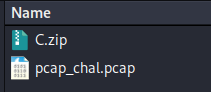

<!-- /wp:image -->

<!-- wp:spacer {"height":"10px"} -->

<!-- /wp:spacer -->

<!-- wp:separator {"className":"is-style-wide"} -->

---

<!-- /wp:separator -->

<!-- wp:heading {"level":4,"anchor":"analyze-the-new-pcap-with-wireshark"} -->

#### Analyze the new PCAP with Wireshark

<!-- /wp:heading -->

<!-- wp:heading {"level":5,"anchor":"wireshark-101-things-of-interest"} -->

##### WIRESHARK 101 - Things of Interest

<!-- /wp:heading -->

<!-- wp:preformatted {"backgroundColor":"tertiary"} -->

```
# In Wireshark > Statistics
[ ] Protocol Hierarchy
[ ] Conversations
[ ] Endpoints
```

<!-- /wp:preformatted -->

<!-- wp:separator -->

---

<!-- /wp:separator -->

<!-- wp:heading {"level":5,"anchor":"protocol-hierarchy"} -->

##### Protocol Hierarchy

<!-- /wp:heading -->

<!-- wp:spacer {"height":"10px"} -->

<!-- /wp:spacer -->

<!-- wp:image {"align":"full","id":751,"sizeSlug":"full","linkDestination":"none"} -->

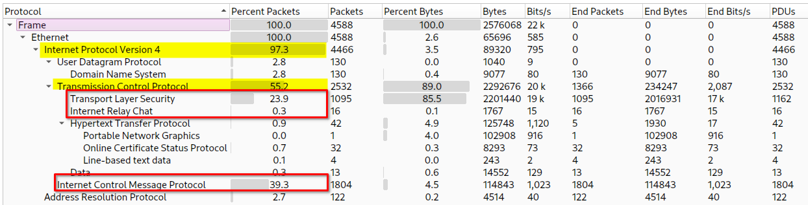

<!-- /wp:image -->

<!-- wp:spacer {"height":"10px"} -->

<!-- /wp:spacer -->

<!-- wp:preformatted {"backgroundColor":"tertiary"} -->

```
# What do we see?
1. We got <strong>97.3 % IPv4 Communication</strong>
  + <strong>TCP</strong> makes <strong>55.2 %</strong>
    - <em>From TCP -</em> <strong>TLS makes 23.9 %</strong>
    - <em>From TCP -</em> <strong>IRC makes 0.3 %</strong>
    - <em>From TCP</em> - <strong>PNG 1 Packet transferd</strong>

  + <strong>ICMP </strong>makes<strong> 39.3 %</strong>

2. The rest is...
  + ARP
  + UDP
    - DNS
```

<!-- /wp:preformatted -->

<!-- wp:heading {"level":5,"anchor":"findings"} -->

##### Findings

<!-- /wp:heading -->

<!-- wp:preformatted {"backgroundColor":"tertiary"} -->

```
# <strong>IRC</strong> - <strong>I</strong>nternet <strong>R</strong>elay <strong>C</strong>hat

Internet Relay Chat (IRC) is a <em>text-based chat system for instant messaging</em>. IRC is designed for group communication in discussion forums, called channels, but also allows <em>one-on-one communication via private messages</em> as well as <em>chat and data transfer</em>, including file sharing.
```

<!-- /wp:preformatted -->

<!-- wp:buttons {"layout":{"type":"flex","justifyContent":"center"}} -->

<!-- wp:button -->

[More about IRC](https://en.wikipedia.org/wiki/Internet_Relay_Chat)

<!-- /wp:button -->

<!-- /wp:buttons -->

<!-- wp:separator -->

---

<!-- /wp:separator -->

<!-- wp:heading {"level":5,"anchor":"investigate-protocol-irc"} -->

##### Investigate Protocol: IRC

<!-- /wp:heading -->

<!-- wp:preformatted {"backgroundColor":"tertiary"} -->

```
# In Wireshark... Create Filter <em>(Apply my IRC Profile)</em>
<strong>irc</strong>

# <strong>Right click packet</strong> > <strong>Follow</strong> > <strong>TCP Stream</strong>
:irc.cct NOTICE Auth :*** Looking up your hostname...
CAP LS 302
PASS RedRoverRedRover$$
NICK zoobah
USER binaryphalanx 2 * :binaryphalanx
```

<!-- /wp:preformatted -->

<!-- wp:spacer {"height":"10px"} -->

<!-- /wp:spacer -->

<!-- wp:image {"align":"full","id":756,"sizeSlug":"full","linkDestination":"none"} -->

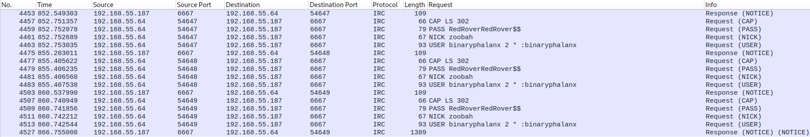

<!-- /wp:image -->

<!-- wp:spacer {"height":"10px"} -->

<!-- /wp:spacer -->

<!-- wp:preformatted {"backgroundColor":"tertiary"} -->

```
# <strong>CAP LS 302</strong>
This is a command sent from the client to the server to request a list of "CAP" (capabilities) commands supported by the server. 302 here is the version of the capability negotiation protocol that the client supports. This allows the client and server to negotiate the capabilities they will use during the session.

# <strong>NICK</strong>
NICKNAME == zoobah

# <strong>USER</strong>
USERNAME == binaryphalanx | 2 == Mode | * Placeholder for the server | REALNAME == :binaryphalanx

# <strong>PASS</strong>
PASSWORD == RedRoverRedRover$$

# <strong>192.168.55.64</strong>
IRC SERVER
```

<!-- /wp:preformatted -->

<!-- wp:syntaxhighlighter/code {"language":"bash"} -->

```
tshark -r pcap_chal.pcap -Y '(irc && ip.addr==192.168.55.187) && (irc.request.command)' -T fields -e irc.request
```

<!-- /wp:syntaxhighlighter/code -->

<!-- wp:preformatted {"backgroundColor":"tertiary"} -->

```
CAP LS 302
PASS RedRoverRedRover$$
NICK zoobah
USER binaryphalanx 2 * :binaryphalanx
CAP LS 302
PASS RedRoverRedRover$$
NICK zoobah
USER binaryphalanx 2 * :binaryphalanx
CAP LS 302
PASS RedRoverRedRover$$
NICK zoobah
USER binaryphalanx 2 * :binaryphalanx
```

<!-- /wp:preformatted -->

<!-- wp:separator {"className":"is-style-wide"} -->

---

<!-- /wp:separator -->

<!-- wp:heading {"level":5,"anchor":"findings"} -->

##### Findings

<!-- /wp:heading -->

<!-- wp:preformatted {"backgroundColor":"tertiary"} -->

```
# <strong>ICMP</strong> - <strong>I</strong>nternet <strong>C</strong>ontrol <strong>M</strong>essage <strong>P</strong>rotocol

The Internet Control Message Protocol (ICMP) is a supporting protocol in the Internet protocol suite. It is <em>used by network devices</em>, <em>including routers</em>, to <em>send error messages</em> and <em>operational information indicating success</em> or <em>failure when communicating with another IP address</em>, for example, an error is indicated when a requested service is not available or that a host or router could not be reached. <strong>ICMP differs from transport protocols such as TCP and UDP in that it is not typically used to exchange data between systems</strong>, <strong>nor is it regularly employed by end-user network applications</strong> (with the exception of some diagnostic tools like <strong>ping</strong> and <strong>traceroute</strong>).

ICMP for IPv4 is defined in RFC 792. A separate ICMPv6, defined by RFC 4443, is used with IPv6.
```

<!-- /wp:preformatted -->

<!-- wp:buttons {"layout":{"type":"flex","justifyContent":"center"}} -->

<!-- wp:button -->

[More about ICMP](https://en.wikipedia.org/wiki/Internet_Control_Message_Protocol)

<!-- /wp:button -->

<!-- /wp:buttons -->

<!-- wp:separator -->

---

<!-- /wp:separator -->

<!-- wp:heading {"level":5,"anchor":"investigate-protocol-icmp"} -->

##### Investigate Protocol: ICMP

<!-- /wp:heading -->

<!-- wp:preformatted {"backgroundColor":"tertiary"} -->

```
# In Wireshark... Create Filter <em>(Apply my ICMP Profile)</em>
<strong>icmp</strong>

# <strong>4588 ICMP Packets</strong> inside the PCAP
> Thats a lot traffic!
> If you scroll through you see
  + Echo (ping) request
  + Echo (ping) reply

> If you scroll further
  + <strong>Echo (ping) request - (no response found!)</strong>
```

<!-- /wp:preformatted -->

<!-- wp:preformatted {"backgroundColor":"tertiary"} -->

```
# Let's filter for this packets
<strong>icmp.type == 8</strong>

# Now let's filter the packets with no response
<strong>(icmp.type == 8) && (icmp.no_resp)</strong>
```

<!-- /wp:preformatted -->

<!-- wp:spacer {"height":"10px"} -->

<!-- /wp:spacer -->

<!-- wp:image {"align":"full","id":762,"sizeSlug":"full","linkDestination":"none"} -->

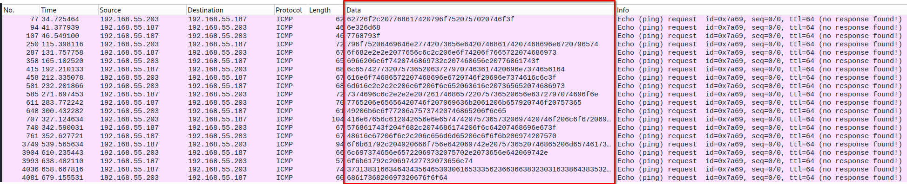

<!-- /wp:image -->

<!-- wp:spacer {"height":"10px"} -->

<!-- /wp:spacer -->

<!-- wp:preformatted {"backgroundColor":"tertiary"} -->

```
# We got here some interesting data which changes every time

# If you take a closer look inside Wireshark - <strong>we can see a chat!</strong>
```

<!-- /wp:preformatted -->

<!-- wp:spacer {"height":"10px"} -->

<!-- /wp:spacer -->

<!-- wp:image {"align":"full","id":766,"sizeSlug":"full","linkDestination":"none"} -->

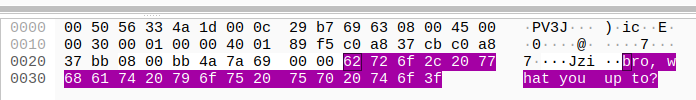

<!-- /wp:image -->

<!-- wp:spacer {"height":"10px"} -->

<!-- /wp:spacer -->

<!-- wp:preformatted {"backgroundColor":"tertiary"} -->

```
# Let's export the data to investigate further !
```

<!-- /wp:preformatted -->

<!-- wp:syntaxhighlighter/code {"language":"bash"} -->

```
# TShark
tshark -r pcap_chal.pcap -Y 'icmp.resp_not_found' -2 -T fields -e data.data
```

<!-- /wp:syntaxhighlighter/code -->

<!-- wp:preformatted {"backgroundColor":"tertiary"} -->

```
62726f2c207768617420796f7520757020746f3f
6e326d68
7768793f
796f75206469646e27742073656e642074686174207468696e6720796574
6f682e2e2e2077656c6c2c206e6f74206f7665722074686973
6966206e6f7420746869732c207468656e20776861743f
6c657427732075736520637279707463617420696e7374656164
616e6f74686572207468696e6720746f20696e7374616c6c3f
6d616e2e2e2e206e6f206f6e652063616e207365652074686973
7374696c6c2e2e2e207261746865722075736520656e6372797074696f6e
7765206e65656420746f207069636b2061206b657920746f20757365
49206b6e6f77206a75737420746865206f6e65
416e67656c612042656e6e657474207573657320697420746f206c6f6720696e746f20746865204265746865736461204e6176616c20486f73706974616c
576861743f204f682c2074686174206f6c64207468696e673f
48616e67206f6e2c206c656d6d65206c6f6f6b206974207570
6f6b61792c204920666f756e642069742e2075736520746865206d65746173706c6f697420706f727420746f2072656365697665
6c697374656e65722069732075702e2073656e642069742e
6f6b61792c20697427732073656e74
3731383166346434356465303061653335623663663832303163386438353262
6861736820697320676f6f64
```

<!-- /wp:preformatted -->

<!-- wp:separator -->

---

<!-- /wp:separator -->

<!-- wp:preformatted {"backgroundColor":"tertiary"} -->

```
# Since this is in HEX let's parse it into ASCII
```

<!-- /wp:preformatted -->

<!-- wp:buttons {"layout":{"type":"flex","justifyContent":"center"}} -->

<!-- wp:button -->

[Get my HEX-2-ASCII Parsing Script](https://github.com/trustinveritas/pentest-project-site/blob/main/HEX/parse-hex-to-ascii.py)

<!-- /wp:button -->

<!-- /wp:buttons -->

<!-- wp:preformatted {"backgroundColor":"tertiary"} -->

```
# With the script we get the following output

bro, what you up to?
n2mh
why?
you didn't send that thing yet
oh... well, not over this
if not this, then what?
let's <strong>use cryptcat</strong> instead
another thing to install?
man... no one can see this
still... rather <span style="text-decoration: underline">use encryption</span>
we need to <span style="text-decoration: underline">pick a key to use</span>
I know just the one
<strong>Angela Bennett uses it to log into the Bethesda Naval Hospital</strong>
What? Oh, that old thing?
Hang on, lemme look it up
okay, I found it. <strong>use the metasploit port</strong> to receive
listener is up. send it.
okay, it's sent
<strong>7181f4d45de00ae35b6cf8201c8d852b</strong>
hash is good
```

<!-- /wp:preformatted -->

<!-- wp:heading {"level":5,"anchor":"findings"} -->

##### Findings

<!-- /wp:heading -->

<!-- wp:preformatted {"backgroundColor":"tertiary"} -->

```
# We found a Chat via ICMP !
+ talking about <a rel="noreferrer noopener" href="https://www.kali.org/tools/cryptcat/" target="_blank"><strong>cryptcat</strong></a>
+ talking about a <strong>encryption key</strong>
  - Angela Bennett uses it to log into
    the Bethesda Naval Hospital

+ talking about <strong>metasploit port</strong>
  - 4444

+ <strong>MD5 Hash</strong>
  - 7181f4d45de00ae35b6cf8201c8d852b
```

<!-- /wp:preformatted -->

<!-- wp:buttons {"layout":{"type":"flex","justifyContent":"center"}} -->

<!-- wp:button -->

[HASH IDENTIFIER](https://nth.skerritt.blog/)

<!-- /wp:button -->

<!-- /wp:buttons -->

<!-- wp:separator {"className":"is-style-wide"} -->

---

<!-- /wp:separator -->

<!-- wp:heading {"level":5,"anchor":"wireshark-101-things-of-interest"} -->

##### WIRESHARK 101 - Things of Interest

<!-- /wp:heading -->

<!-- wp:preformatted {"backgroundColor":"tertiary"} -->

```
# In Wireshark > Statistics
[x] Protocol Hierarchy
[ ] Conversations
[ ] Endpoints
```

<!-- /wp:preformatted -->

<!-- wp:separator -->

---

<!-- /wp:separator -->

<!-- wp:heading {"level":5,"anchor":"conversations-tcp"} -->

##### Conversations > TCP

<!-- /wp:heading -->

<!-- wp:spacer {"height":"10px"} -->

<!-- /wp:spacer -->

<!-- wp:image {"align":"full","id":776,"sizeSlug":"full","linkDestination":"none"} -->

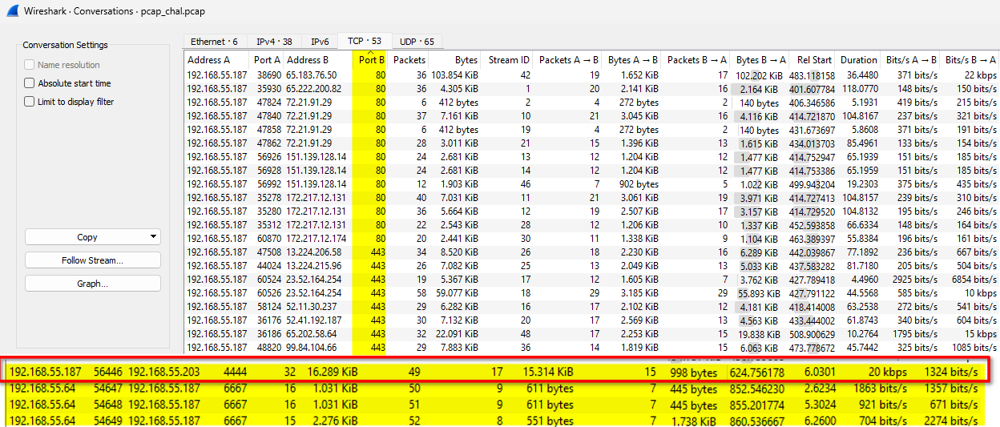

<!-- /wp:image -->

<!-- wp:spacer {"height":"10px"} -->

<!-- /wp:spacer -->

<!-- wp:preformatted {"backgroundColor":"tertiary"} -->

```
# We found the METASPLOIT PORT from the conversation
<strong>4444</strong>

# Communication between...
<strong>192.168.55.187 <> 192.168.55.203</strong>

# If we check the ICMP conversation from before we see...
<strong>192.168.55.187 <> 192.168.55.203</strong>

# SAME IP-Addresses !
```

<!-- /wp:preformatted -->

<!-- wp:spacer {"height":"10px"} -->

<!-- /wp:spacer -->

<!-- wp:image {"align":"wide","id":778,"sizeSlug":"full","linkDestination":"none"} -->


<!-- /wp:image -->

<!-- wp:spacer {"height":"10px"} -->

<!-- /wp:spacer -->

<!-- wp:heading {"level":5,"anchor":"further-investigations"} -->

##### FURTHER INVESTIGATIONS

<!-- /wp:heading -->

<!-- wp:syntaxhighlighter/code {"language":"bash"} -->

```
# TShark
tshark -r pcap_chal.pcap -Y 'ip.addr==192.168.55.187 && tcp.port==56446 && ip.addr==192.168.55.203 && tcp.port==4444'
```

<!-- /wp:syntaxhighlighter/code -->

<!-- wp:preformatted {"backgroundColor":"tertiary"} -->

```
3933 624.756178 192.168.55.187 56446 192.168.55.203 4444 TCP 74 56446 → 4444 [SYN] Seq=0 Win=29200 Len=0 MSS=1460 SACK_PERM TSval=2003616300 TSecr=0 WS=128
 3934 624.760904 192.168.55.203 4444 192.168.55.187 56446 TCP 74 4444 → 56446 [SYN, ACK] Seq=0 Ack=1 Win=28960 Len=0 MSS=1460 SACK_PERM TSval=642514547 TSecr=2003616300 WS=128
 3935 624.761089 192.168.55.187 56446 192.168.55.203 4444 TCP 66 56446 → 4444 [ACK] Seq=1 Ack=1 Win=29312 Len=0 TSval=2003616304 TSecr=642514547
 3936 624.763319 192.168.55.187 56446 192.168.55.203 4444 TCP 82 56446 → 4444 [PSH, ACK] Seq=1 Ack=1 Win=29312 Len=16 TSval=2003616307 TSecr=642514547
 3937 624.764297 192.168.55.187 56446 192.168.55.203 4444 TCP 1514 56446 → 4444 [ACK] Seq=17 Ack=1 Win=29312 Len=1448 TSval=2003616308 TSecr=642514547
 3938 624.765135 192.168.55.203 4444 192.168.55.187 56446 TCP 66 4444 → 56446 [ACK] Seq=1 Ack=17 Win=29056 Len=0 TSval=642514553 TSecr=2003616307
 3939 624.765163 192.168.55.187 56446 192.168.55.203 4444 TCP 250 56446 → 4444 [PSH, ACK] Seq=1465 Ack=1 Win=29312 Len=184 TSval=2003616309 TSecr=642514553
 3940 624.765884 192.168.55.187 56446 192.168.55.203 4444 TCP 1514 56446 → 4444 [ACK] Seq=1649 Ack=1 Win=29312 Len=1448 TSval=2003616309 TSecr=642514553
 3941 624.766457 192.168.55.187 56446 192.168.55.203 4444 TCP 1514 56446 → 4444 [ACK] Seq=3097 Ack=1 Win=29312 Len=1448 TSval=2003616310 TSecr=642514553
 3942 624.766898 192.168.55.203 4444 192.168.55.187 56446 TCP 66 4444 → 56446 [ACK] Seq=1 Ack=1465 Win=31872 Len=0 TSval=642514554 TSecr=2003616308
 3943 624.767193 192.168.55.187 56446 192.168.55.203 4444 TCP 1514 56446 → 4444 [ACK] Seq=4545 Ack=1 Win=29312 Len=1448 TSval=2003616311 TSecr=642514554
 3944 624.767678 192.168.55.203 4444 192.168.55.187 56446 TCP 66 4444 → 56446 [ACK] Seq=1 Ack=1649 Win=34816 Len=0 TSval=642514555 TSecr=2003616309
 3945 624.767690 192.168.55.203 4444 192.168.55.187 56446 TCP 66 4444 → 56446 [ACK] Seq=1 Ack=3097 Win=37760 Len=0 TSval=642514556 TSecr=2003616309
 3946 624.767700 192.168.55.187 56446 192.168.55.203 4444 TCP 250 56446 → 4444 [PSH, ACK] Seq=5993 Ack=1 Win=29312 Len=184 TSval=2003616311 TSecr=642514555
 3947 624.768403 192.168.55.187 56446 192.168.55.203 4444 TCP 1514 56446 → 4444 [ACK] Seq=6177 Ack=1 Win=29312 Len=1448 TSval=2003616312 TSecr=642514556
 3948 624.769184 192.168.55.203 4444 192.168.55.187 56446 TCP 66 4444 → 56446 [ACK] Seq=1 Ack=4545 Win=40576 Len=0 TSval=642514556 TSecr=2003616310
 3949 624.769196 192.168.55.203 4444 192.168.55.187 56446 TCP 66 4444 → 56446 [ACK] Seq=1 Ack=5993 Win=43520 Len=0 TSval=642514557 TSecr=2003616311
 3950 624.769199 192.168.55.187 56446 192.168.55.203 4444 TCP 1514 56446 → 4444 [PSH, ACK] Seq=7625 Ack=1 Win=29312 Len=1448 TSval=2003616313 TSecr=642514556
 3951 624.769885 192.168.55.187 56446 192.168.55.203 4444 TCP 1514 56446 → 4444 [ACK] Seq=9073 Ack=1 Win=29312 Len=1448 TSval=2003616313 TSecr=642514557
 3952 624.770419 192.168.55.203 4444 192.168.55.187 56446 TCP 66 4444 → 56446 [ACK] Seq=1 Ack=6177 Win=46336 Len=0 TSval=642514557 TSecr=2003616311
 3953 624.770443 192.168.55.187 56446 192.168.55.203 4444 TCP 1498 56446 → 4444 [PSH, ACK] Seq=10521 Ack=1 Win=29312 Len=1432 TSval=2003616314 TSecr=642514557
 3954 624.770860 192.168.55.203 4444 192.168.55.187 56446 TCP 66 4444 → 56446 [ACK] Seq=1 Ack=7625 Win=49280 Len=0 TSval=642514558 TSecr=2003616312
 3955 624.771091 192.168.55.187 56446 192.168.55.203 4444 TCP 1514 56446 → 4444 [ACK] Seq=11953 Ack=1 Win=29312 Len=1448 TSval=2003616315 TSecr=642514558
 3956 624.772120 192.168.55.203 4444 192.168.55.187 56446 TCP 66 4444 → 56446 [ACK] Seq=1 Ack=9073 Win=52224 Len=0 TSval=642514559 TSecr=2003616313
 3957 624.772138 192.168.55.203 4444 192.168.55.187 56446 TCP 66 4444 → 56446 [ACK] Seq=1 Ack=10521 Win=55040 Len=0 TSval=642514559 TSecr=2003616313
 3958 624.773127 192.168.55.203 4444 192.168.55.187 56446 TCP 66 4444 → 56446 [ACK] Seq=1 Ack=11953 Win=57984 Len=0 TSval=642514560 TSecr=2003616314
 3959 624.773163 192.168.55.187 56446 192.168.55.203 4444 TCP 1218 56446 → 4444 [PSH, ACK] Seq=13401 Ack=1 Win=29312 Len=1152 TSval=2003616317 TSecr=642514560
 3960 624.773454 192.168.55.203 4444 192.168.55.187 56446 TCP 66 4444 → 56446 [ACK] Seq=1 Ack=13401 Win=60928 Len=0 TSval=642514561 TSecr=2003616315
 3961 624.777176 192.168.55.203 4444 192.168.55.187 56446 TCP 66 4444 → 56446 [ACK] Seq=1 Ack=14553 Win=63744 Len=0 TSval=642514563 TSecr=2003616317
 3974 630.780743 192.168.55.187 56446 192.168.55.203 4444 TCP 66 56446 → 4444 [FIN, ACK] Seq=14553 Ack=1 Win=29312 Len=0 TSval=2003622324 TSecr=642514563
 3975 630.786204 192.168.55.203 4444 192.168.55.187 56446 TCP 66 4444 → 56446 [FIN, ACK] Seq=1 Ack=14554 Win=63744 Len=0 TSval=642520573 TSecr=2003622324
 3976 630.786250 192.168.55.187 56446 192.168.55.203 4444 TCP 66 56446 → 4444 [ACK] Seq=14554 Ack=2 Win=29312 Len=0 TSval=2003622330 TSecr=642520573
```

<!-- /wp:preformatted -->

<!-- wp:separator -->

---

<!-- /wp:separator -->

<!-- wp:heading {"level":5,"anchor":"let-s-inspect-the-host-s"} -->

##### Let's Inspect the HOST'S

<!-- /wp:heading -->

<!-- wp:table -->

| PROTOCOL | WIRESHARK FILTER          | DATA         |
| -------- | ------------------------- | ------------ |
| ICMP     | `ip.addr==192.168.55.203` | 1804 Packets |
| TCP      | `ip.addr==192.168.55.203` | 32 Packets   |

Host: 192.168.55.203

<!-- /wp:table -->

<!-- wp:table -->

| PROTOCOL | WIRESHARK FILTER          | DATA         |
| -------- | ------------------------- | ------------ |
| UDP      | `ip.addr==192.168.55.187` | 130 Packets  |
| DNS      | `ip.addr==192.168.55.187` | 130 Packets  |
| TCP      | `ip.addr==192.168.55.187` | 2532 Packets |
| TLS      | `ip.addr==192.168.55.187` | 1095 Packets |
| IRC      | `ip.addr==192.168.55.187` | 16 Packets   |
| HTTP     | `ip.addr==192.168.55.187` | 42 Packets   |
| PNG      | `ip.addr==192.168.55.187` | 1 Packets    |
| OCSP     | `ip.addr==192.168.55.187` | 32 Packets   |
| ICMP     | `ip.addr==192.168.55.187` | 1804 Packets |

Host: 192.168.55.187

<!-- /wp:table -->

<!-- wp:separator {"className":"is-style-wide"} -->

---

<!-- /wp:separator -->

<!-- wp:heading {"level":5,"anchor":"wireshark-101-things-of-interest"} -->

##### WIRESHARK 101 - Things of Interest

<!-- /wp:heading -->

<!-- wp:preformatted {"backgroundColor":"tertiary"} -->

```
# In Wireshark > Statistics
[x] Protocol Hierarchy
[x] Conversations
<s>[ ] Endpoints</s>
```

<!-- /wp:preformatted -->

<!-- wp:separator -->

---

<!-- /wp:separator -->

<!-- wp:heading {"level":5,"anchor":"let-s-focus-on-the-icmp-chat"} -->

##### Let's focus on the ICMP chat

<!-- /wp:heading -->

<!-- wp:preformatted {"backgroundColor":"tertiary"} -->

```
<strong>let's use cryptcat instead</strong>

we need to pick a key to use
I know just the one
Angela Bennett uses it to log into the Bethesda Naval Hospital

okay, I found it. use the metasploit port to receive
listener is up. send it.
okay, it's sent
7181f4d45de00ae35b6cf8201c8d852b
hash is good
```

<!-- /wp:preformatted -->

<!-- wp:separator -->

---

<!-- /wp:separator -->

<!-- wp:heading {"level":5,"anchor":"what-is-cryptcat"} -->

##### What is CRYPTCAT?

<!-- /wp:heading -->

<!-- wp:spacer {"height":"10px"} -->

<!-- /wp:spacer -->

<!-- wp:image {"align":"wide","id":790,"sizeSlug":"full","linkDestination":"none"} -->

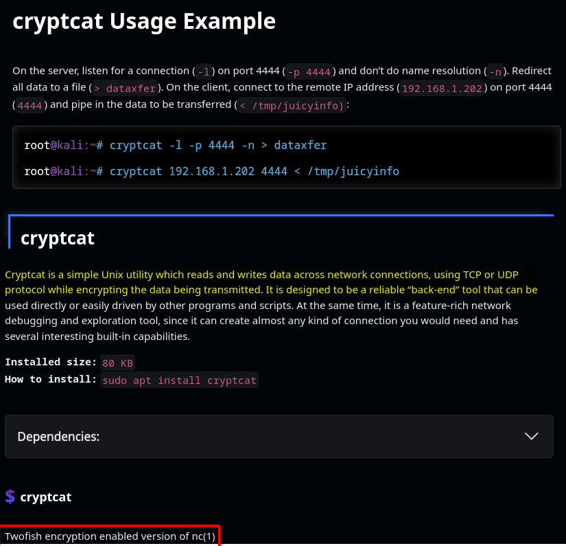

<!-- /wp:image -->

<!-- wp:spacer {"height":"10px"} -->

<!-- /wp:spacer -->

<!-- wp:separator -->

---

<!-- /wp:separator -->

<!-- wp:preformatted {"backgroundColor":"tertiary"} -->

```
# In Wireshark... Create Filter
<strong>((tcp.port==4444) && (ip.src==192.168.55.187)) && (tcp.flags == 0x018)</strong>
```

<!-- /wp:preformatted -->

<!-- wp:spacer {"height":"10px"} -->

<!-- /wp:spacer -->

<!-- wp:image {"align":"full","id":792,"sizeSlug":"full","linkDestination":"none"} -->

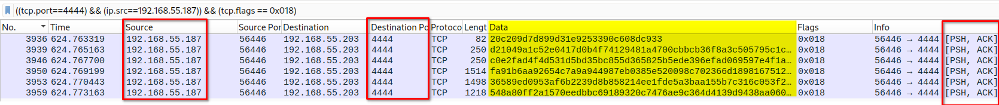

<!-- /wp:image -->

<!-- wp:spacer {"height":"10px"} -->

<!-- /wp:spacer -->

<!-- wp:separator -->

---

<!-- /wp:separator -->

<!-- wp:preformatted {"backgroundColor":"tertiary"} -->

```
let's use cryptcat instead

<strong>we need to pick a key to use
I know just the one
Angela Bennett uses it to log into the Bethesda Naval Hospital</strong>

okay, I found it. use the metasploit port to receive
listener is up. send it.
okay, it's sent
7181f4d45de00ae35b6cf8201c8d852b
hash is good
```

<!-- /wp:preformatted -->

<!-- wp:paragraph -->

URL : [Find the Password](https://mike.passwall.com/uselesstrivia/thenet.html)

<!-- /wp:paragraph -->

<!-- wp:preformatted {"backgroundColor":"tertiary"} -->

```
# The phrase "Angela Bennet ... Bethesda Naval Hospital
Is from the film: <strong>The Net</strong>
```

<!-- /wp:preformatted -->

<!-- wp:buttons {"layout":{"type":"flex","justifyContent":"center"}} -->

<!-- wp:button -->

[Get the Password for cryptcat!](https://mike.passwall.com/uselesstrivia.html)

<!-- /wp:button -->

<!-- /wp:buttons -->

<!-- wp:separator {"className":"is-style-wide"} -->

---

<!-- /wp:separator -->

<!-- wp:heading {"level":4,"anchor":"poc-decrypt-cryptcat"} -->

#### PoC - Decrypt Cryptcat

<!-- /wp:heading -->

<!-- wp:heading {"level":5,"anchor":"mind-blowing-part"} -->

##### Mind Blowing Part

<!-- /wp:heading -->

<!-- wp:quote -->

> <!-- wp:paragraph -->
>
> _**Now we're approaching the mind-boggling section where I spent countless hours giving my brain a real workout.**_
>
> <!-- /wp:paragraph -->
>
> trustinveritas

<!-- /wp:quote -->

<!-- wp:separator -->

---

<!-- /wp:separator -->

<!-- wp:preformatted {"backgroundColor":"tertiary"} -->

```
# In Wireshark
<strong>tcp.port==4444</strong>
```

<!-- /wp:preformatted -->

<!-- wp:spacer {"height":"10px"} -->

<!-- /wp:spacer -->

<!-- wp:image {"align":"full","id":800,"sizeSlug":"full","linkDestination":"none"} -->

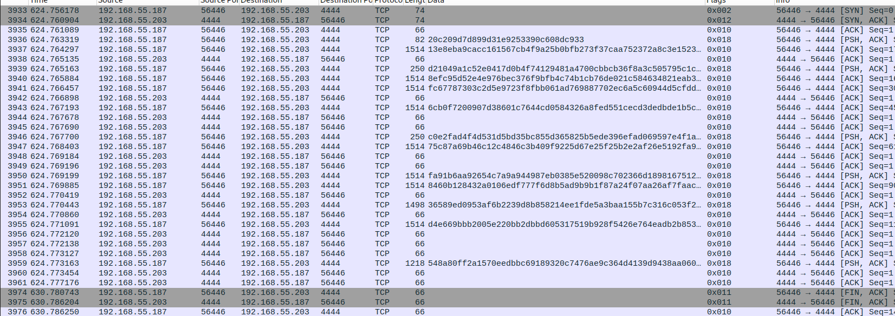

<!-- /wp:image -->

<!-- wp:spacer {"height":"10px"} -->

<!-- /wp:spacer -->

<!-- wp:preformatted {"backgroundColor":"tertiary"} -->

```
# In Wireshark
<strong>File > Export Specified Packets...</strong>

# File: <strong>cryptcat.pcap</strong>
```

<!-- /wp:preformatted -->

<!-- wp:separator -->

---

<!-- /wp:separator -->

<!-- wp:syntaxhighlighter/code {"language":"bash"} -->

```
# Decrypt Data which will be sent via cryptcat
cryptcat -vv -k HERE-COMES-THE-PASSOWRD-OF-THE-HOSPITAL-ACCESS -l -p 4444 > decryptedfile

listening on [any] 4444 ...
```

<!-- /wp:syntaxhighlighter/code -->

<!-- wp:syntaxhighlighter/code {"language":"bash"} -->

```
# Make data ready for netcat to host
tcptrace -e cryptcat.pcap

1 arg remaining, starting with 'cryptcat.pcap'
Ostermann's tcptrace -- version 6.6.7 -- Thu Nov  4, 2004

32 packets seen, 32 TCP packets traced
elapsed wallclock time: 0:00:00.027017, 1184 pkts/sec analyzed
trace file elapsed time: 0:00:06.030071
TCP connection info:
  1: 192.168.55.187:56446 - 192.168.55.203:4444 (a2b)   17>   15<  (complete)
```

<!-- /wp:syntaxhighlighter/code -->

<!-- wp:syntaxhighlighter/code {"language":"bash"} -->

```
# Send encrypted data
cat a2b_contents.dat| nc -v localhost 4444

localhost [127.0.0.1] 4444 (?) open
```

<!-- /wp:syntaxhighlighter/code -->

<!-- wp:preformatted {"backgroundColor":"tertiary"} -->

```
# Get DECRYPTED data
cryptcat -vv -k <em>HERE-IS-PASSWORD</em> -l -p 4444 > decryptedfile
listening on [any] 4444 ...
<strong>connect to [127.0.0.1] from localhost [127.0.0.1] 41886</strong>
```

<!-- /wp:preformatted -->

<!-- wp:spacer {"height":"10px"} -->

<!-- /wp:spacer -->

<!-- wp:image {"align":"wide","id":804,"sizeSlug":"full","linkDestination":"none"} -->


<!-- /wp:image -->

<!-- wp:spacer {"height":"10px"} -->

<!-- /wp:spacer -->

<!-- wp:syntaxhighlighter/code {"language":"bash"} -->

```
binwalk decryptedfile
```

<!-- /wp:syntaxhighlighter/code -->

<!-- wp:preformatted {"backgroundColor":"tertiary"} -->

```
DECIMAL       HEXADECIMAL     DESCRIPTION
--------------------------------------------------------------------------------
0             0x0             <strong>ELF</strong>, 64-bit LSB shared object, AMD x86-64, version 1 (SYSV)
```

<!-- /wp:preformatted -->

<!-- wp:syntaxhighlighter/code {"language":"bash"} -->

```
file decryptedfile
```

<!-- /wp:syntaxhighlighter/code -->

<!-- wp:preformatted {"backgroundColor":"tertiary"} -->

```
decryptedfile: <strong>ELF 64-bit LSB pie executable</strong>, x86-64, version 1 (SYSV), dynamically linked, interpreter /lib64/ld-linux-x86-64.so.2, BuildID[sha1]=10e9d33fce367a29cfe8d74866c3cb474ec61172, for GNU/Linux 3.2.0, stripped
```

<!-- /wp:preformatted -->

<!-- wp:separator -->

---

<!-- /wp:separator -->

<!-- wp:syntaxhighlighter/code {"language":"bash"} -->

```
md5sum decryptedfile
```

<!-- /wp:syntaxhighlighter/code -->

<!-- wp:preformatted {"backgroundColor":"tertiary"} -->

```
<strong>7181f4d45de00ae35b6cf8201c8d852b</strong>
decryptedfile

# If we check the ICMP chat
okay, it's sent
<strong>7181f4d45de00ae35b6cf8201c8d852b</strong>
hash is good

# We got the same HASH!
```

<!-- /wp:preformatted -->

<!-- wp:spacer {"height":"10px"} -->

<!-- /wp:spacer -->

<!-- wp:image {"align":"wide","id":808,"sizeSlug":"full","linkDestination":"none"} -->


<!-- /wp:image -->

<!-- wp:spacer {"height":"10px"} -->

<!-- /wp:spacer -->

<!-- wp:syntaxhighlighter/code {"language":"bash"} -->

```
strings decryptedfile | awk '{ print length, $0 }' | sort -n | cut -d' ' -f2-
```

<!-- /wp:syntaxhighlighter/code -->

<!-- wp:preformatted {"backgroundColor":"tertiary"} -->

```
[SNIP]

irc.cct
ERROR %s
<strong>NICK cct</strong>
e connecH
.eh_frame
#flag :CH
No such H
<strong>PRIVMSG H</strong>
CAP LS 302
GLIBC_2.14
<strong>JOIN #flag
gethostbyname
Failed to get ip</strong>
GCC: (GNU) 9.1.0
<strong>Found the server at %s</strong>
<strong>Connected to my server!</strong>
/lib64/ld-linux-x86-64.so.2
<strong>USER cct2019 cct2019 irc.cct :realname</strong>

[SNIP]
```

<!-- /wp:preformatted -->

<!-- wp:spacer {"height":"10px"} -->

<!-- /wp:spacer -->

<!-- wp:image {"align":"wide","id":811,"sizeSlug":"full","linkDestination":"none"} -->

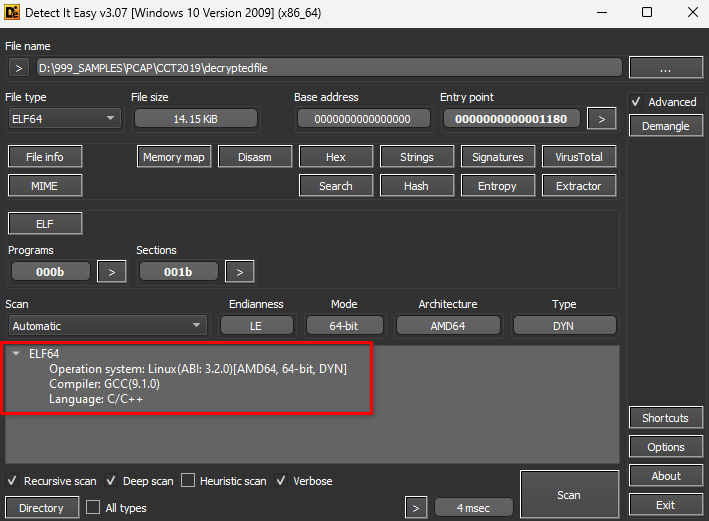

<!-- /wp:image -->

<!-- wp:spacer {"height":"10px"} -->

<!-- /wp:spacer -->

<!-- wp:separator -->

---

<!-- /wp:separator -->

<!-- wp:heading {"level":5,"anchor":"findings"} -->

##### Findings

<!-- /wp:heading -->

<!-- wp:preformatted {"backgroundColor":"tertiary"} -->

```
# We have got a <strong>IRC Client</strong> !
> Looks like it tries to connect to a IRC-Server
> This client was transmitted via cryptcat

<strong># Since the HINT1</strong>
HINT1: It's a pcap challenge. If you're doing stego or re, you're either down a rabbit hole or there's an easier way.

<strong><em>> We don't need Reverse Engineering Skills here</em></strong>
```

<!-- /wp:preformatted -->

<!-- wp:separator {"className":"is-style-wide"} -->

---

<!-- /wp:separator -->

<!-- wp:heading {"level":4,"anchor":"let-s-create-a-fake-irc-server"} -->

#### Let's create a fake IRC Server

<!-- /wp:heading -->

<!-- wp:buttons {"layout":{"type":"flex","justifyContent":"center"}} -->

<!-- wp:button -->

[Get my FAKE IRC-Server Python Code !](https://github.com/trustinveritas/pentest-project-site/blob/main/IRC/fake-irc.py)

<!-- /wp:button -->

<!-- /wp:buttons -->

<!-- wp:separator -->

---

<!-- /wp:separator -->

<!-- wp:heading {"level":5,"anchor":"change-etc-hosts"} -->

##### Change /etc/hosts

<!-- /wp:heading -->

<!-- wp:syntaxhighlighter/code {"language":"bash"} -->

```
sudo nano /etc/hosts
```

<!-- /wp:syntaxhighlighter/code -->

<!-- wp:preformatted {"backgroundColor":"tertiary"} -->

```
127.0.0.1 irc.cct
```

<!-- /wp:preformatted -->

<!-- wp:separator -->

---

<!-- /wp:separator -->

<!-- wp:heading {"level":5,"anchor":"start-wireshark-to-record-on-interface-lo-loopback"} -->

##### Start WIRESHARK to record on interface: LO == loopback

<!-- /wp:heading -->

<!-- wp:preformatted {"backgroundColor":"tertiary"} -->

```
<strong># Checklist</strong>
[x] /etc/hosts Edited
[x] Wireshark is listening on loopback
[x] Execute the FAKE IRC SERVER python script
<strong><em>[ ] Execute the IRC Client</em></strong>
```

<!-- /wp:preformatted -->

<!-- wp:spacer {"height":"10px"} -->

<!-- /wp:spacer -->

<!-- wp:image {"align":"full","id":817,"sizeSlug":"full","linkDestination":"none"} -->

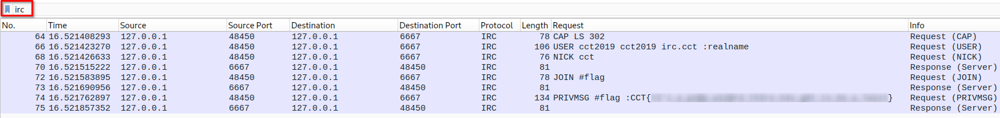

<!-- /wp:image -->

<!-- wp:spacer {"height":"10px"} -->

<!-- /wp:spacer -->

<!-- wp:social-links {"openInNewTab":true,"showLabels":true,"align":"center","layout":{"type":"flex","justifyContent":"center"}} -->

- <!-- wp:social-link {"url":"https://tryhackme.com/room/cct2019","service":"chain","label":"TryHackMe - Access the challenge"} /-->

<!-- /wp:social-links -->
