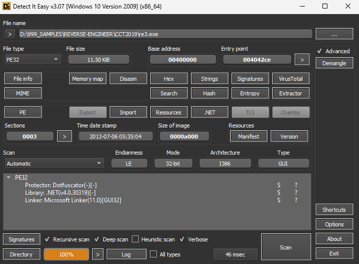
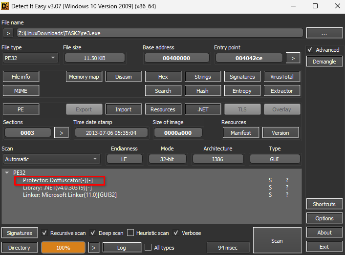
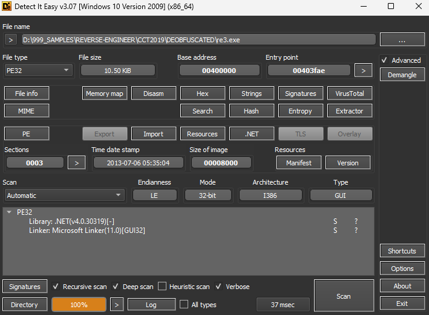

### Level: **_Insane_**


#### Introduction


Legacy challenges from the `US Navy Cyber Competition Team 2019 Assessment` sponsored by [US TENTH Fleet](https://www.fcc.navy.mil/)

Thanks to **[zoobah](https://tryhackme.com/p/zoobah)** for the room on TryHackMe!


---


#### Table of Content


1. [Level: Insane](https://salucci.ch/2023/07/02/ctf-tryhackme-cct2019-2/#level-insane)

   1. [Introduction](https://salucci.ch/2023/07/02/ctf-tryhackme-cct2019-2/#introduction)
   2. [Table of Content](https://salucci.ch/2023/07/02/ctf-tryhackme-cct2019-2/#table-of-content)

2. [CCT2019 - re3](https://salucci.ch/2023/07/02/ctf-tryhackme-cct2019-2/#cct2019-re3)

   1. [DOWNLOAD THE FILES](https://salucci.ch/2023/07/02/ctf-tryhackme-cct2019-2/#download-the-files)
   2. [What do we See?](https://salucci.ch/2023/07/02/ctf-tryhackme-cct2019-2/#what-do-we-see)
   3. [DE4DOT - DeObfuscation .NET](https://salucci.ch/2023/07/02/ctf-tryhackme-cct2019-2/#de4dot-deobfuscation-net)
   4. [Class0.Main](https://salucci.ch/2023/07/02/ctf-tryhackme-cct2019-2/#class0-main)
   5. [GForm0](https://salucci.ch/2023/07/02/ctf-tryhackme-cct2019-2/#gform0)
   6. [WE NEED TO SATISFY THE IF-STATEMENT](https://salucci.ch/2023/07/02/ctf-tryhackme-cct2019-2/#we-need-to-satisfy-the-if-statement)


---


### CCT2019 - re3


There's some kind of a high security lock blocking the way. Defeat the GUI to claim your key!


**NOTE**  
The key is a 32-character hex blob and doesn't follow the CCT`{.\*}` format. It'll be apparent when you've found it.


If you need a Windows machine to help reverse engineering this, please use the [Windows base room](https://tryhackme.com/room/windowsbase)


---


##### DOWNLOAD THE FILES


```
mkdir CCT2019
mkdir TASK1
mkdir TASK2
mkdir TASK3
mkdir TASK4

cd TASK2
ls

-rw-r--r-- 1 anyguy anyguy 11776 Jun 29 01:47 re3.exe
```


```
# What do we have?
> A executable called <strong>re3.exe</strong>
  + We need a Windows Client
  + TryHackMe offers a lot of Clients
    or use your own virtual machine.
```


---


#### Analyze the \*.exe with Detect It Easy





##### What do we See?





```
1. We see it's OBFUSCATED BY: <strong>DotFuscator</strong>
2. It's <strong>.NET v4.0.30319</strong>
```


---


#### Deobfuscation of .NET


##### DE4DOT - DeObfuscation .NET


[Compiled Binaries](https://github.com/vee2xx/de4dot-built-binaries)


[Original GitHub Repo](https://github.com/de4dot/de4dot)


```
PS Dot-NET-Deobfuscation\de4dot-built-binaries\net45>

.\de4dot.exe -r "D:\999_SAMPLES\REVERSE-ENGINEER\CCT2019" -ru -ro "D:\999_SAMPLES\REVERSE-ENGINEER\CCT2019\DEOBFUSCATED"
```


```
de4dot v3.1.41592.3405

Detected Dotfuscator 000:0:2:5.0.2300.0 (D:\999_SAMPLES\REVERSE-ENGINEER\CCT2019\re3.exe)
Cleaning D:\999_SAMPLES\REVERSE-ENGINEER\CCT2019\re3.exe
Renaming all obfuscated symbols
Saving <strong>D:\999_SAMPLES\REVERSE-ENGINEER\CCT2019\DEOBFUSCATED\re3.exe</strong>


Press any key to exit...
```


---





---


#### dnSpy - Let's dive into the code


```
// D:\999_SAMPLES\REVERSE-ENGINEER\CCT2019\DEOBFUSCATED\re3.exe
// RE3  , Version=0.0.0.0, Culture=neutral, PublicKeyToken=null

// Entry point: Class0.Main
// Timestamp: 51D79068 (7/6/2013 5:35:04 AM)

using System;
using System.Diagnostics;
using System.Reflection;
using System.Runtime.CompilerServices;
using System.Runtime.InteropServices;
using System.Runtime.Versioning;

[assembly: AssemblyVersion("0.0.0.0")]
[assembly: RuntimeCompatibility(WrapNonExceptionThrows = true)]
[assembly: AssemblyTitle("RE3  ")]
[assembly: Debuggable(DebuggableAttribute.DebuggingModes.IgnoreSymbolStoreSequencePoints)]
[assembly: TargetFramework(".NETFramework,Version=v4.0", FrameworkDisplayName = ".NET Framework 4")]
[assembly: AssemblyDescription("")]
[assembly: AssemblyTrademark("")]
[assembly: CompilationRelaxations(8)]
[assembly: AssemblyCompany("")]
[assembly: AssemblyProduct("RE3  ")]
[assembly: AssemblyCopyright("Navy Cyber Competition Team 2019     ")]
[assembly: AssemblyConfiguration("")]
[assembly: ComVisible(false)]
[assembly: Guid("cd7ec975-154d-4ef3-bfd6-2983fc44ae86")]
[assembly: AssemblyFileVersion("1.0.0.0")]
```


```
# <strong>Class0</strong> has the <strong>Main-Methode</strong> which is the <strong>entry point</strong> of the program

[SNIP]

// D:\999_SAMPLES\REVERSE-ENGINEER\CCT2019\DEOBFUSCATED\re3.exe
// RE3  , Version=0.0.0.0, Culture=neutral, PublicKeyToken=null

// <strong>Entry point: Class0.Main</strong>
// Timestamp: 51D79068 (7/6/2013 5:35:04 AM)

[SNIP]
```


---


##### Class0.Main


```
using System;
using System.Windows.Forms;

// Token: 0x02000004 RID: 4
internal static class Class0
{
    // Token: 0x06000008 RID: 8 RVA: 0x000020CC File Offset: 0x000002CC
    [STAThread]
    private static void Main()
    {
        Application.EnableVisualStyles();
        Application.SetCompatibleTextRenderingDefault(false);
        Application.Run(new GForm0());
    }
}
```


```
# This starts an object instance of <strong>GForm0</strong>

[SNIP]

// Token: 0x06000008 RID: 8 RVA: 0x000020CC File Offset: 0x000002CC
    [STAThread]
    private static void Main()
    {
        Application.EnableVisualStyles();
        Application.SetCompatibleTextRenderingDefault(false);
        <strong>Application.Run(new <span style="text-decoration: underline">GForm0</span>());</strong>
    }

[SNIP]
```


---


##### GForm0


```
[SNIP]

// Token: 0x0600000B RID: 11 RVA: 0x00002760 File Offset: 0x00000960
    private void eventHandlerA(object sender, EventArgs e)
    {
        int value = this.bar1.Value;
        int value2 = this.bar2.Value;
        int value3 = this.bar3.Value;
        int value4 = this.bar4.Value;
        int num = 711000000;
        if (value + value2 + value3 + value4 == 711 && value * value2 * value3 * value4 == num && value > value2 && value2 > value3 && value3 > value4)
        {
            MessageBox.Show(this.goodBoy(value, value2, value3, value4, (byte[])this.byteA.Clone()));
            return;
        }
        MessageBox.Show(this.badBoy(value, value2, value3, value4, (byte[])this.byteA.Clone()));
    }

[SNIP]
```


```
# Basically what you see is...
The <strong>eventHandlerA</strong> method is used as an event handler for clicking the checkButton button.

# Here is the flow of the method

1. The values of the scrollbar controls bar1, bar2, bar3 and bar4 are retrieved.

2. The variable num is set to the value 7110000.

3. It is checked if the sum of the values of bar1, bar2, bar3 and bar4 is equal to 711 and if the product of these values is equal to num. It is also checked if value is greater than value2, value2 is greater than value3 and value3 is greater than value4.

4. If all checks succeed, a MessageBox is called with the return value of goodBoy, passing value, value2, value3, value4, and a cloned copy of the byteA array as arguments.

5. If one or more checks fail, a MessageBox is called with the return value of badBoy, passing the same arguments as in step 4.


The <code><strong>goodBoy</strong></code> method performs an XOR operation on each byte in the byte_0 array, using this.int_0 and int_3 as keys. <em>The result of the XOR operation is then converted to a string and returned.</em>
```


---


#### How to get the right value?


##### WE NEED TO SATISFY THE IF-STATEMENT


```
[SNIP]

// GForm0
// Token: 0x0600000B RID: 11 RVA: 0x00002760 File Offset: 0x00000960
private void eventHandlerA(object sender, EventArgs e)
{
	int value = this.bar1.Value;
	int value2 = this.bar2.Value;
	int value3 = this.bar3.Value;
	int value4 = this.bar4.Value;
	int num = 711000000;
	<strong>if (value + value2 + value3 + value4 == 711 && value * value2 * value3 * value4 == num && value > value2 && value2 > value3 && value3 > value4)
	{
		MessageBox.Show(this.goodBoy(value, value2, value3, value4, (byte[])this.byteA.Clone()));
		return;
	}</strong>
	MessageBox.Show(this.badBoy(value, value2, value3, value4, (byte[])this.byteA.Clone()));
}

[SNIP]
```


---


```
# Basically this means
value + value2 + value3 + value4 == 711
value * value2 * value3 * value4 == 711000000
value > value2 > value3 > value4
```


---


#### Let's script a Python-Tool to get the values


[Get My Python Script !](https://github.com/trustinveritas/pentest-project-site/blob/main/Cryptographie/CCT2019/re3.py)


---


```
# With this script you get the 4-Values
# Set the values according the result
```


- 


