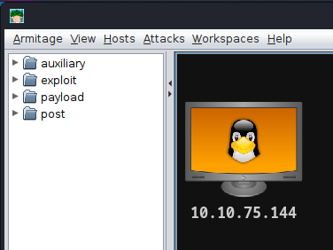

### Level: **_Hard_**


Can you get access to the temple?


Thanks to **[toxicat0r](https://tryhackme.com/p/toxicat0r) **for the room on TryHackMe!


#### Table of Content


---


#### RECONNAISSANCE


##### ARMITAGE C2 FRAMEWORK


```
> Fireup your Teamserver
<strong>sudo teamserver <em>YOUR THM IP</em> s3cr3t</strong>

[*] Generating X509 certificate and keystore (for SSL)
Generating 2,048 bit RSA key pair and self-signed certificate (SHA256withRSA) with a validity of 90 days
        for: CN=Armitage Hacker, OU=FastAndEasyHacking, O=Armitage, L=Somewhere, ST=Cyberspace, C=Earth
[*] Starting RPC daemon
[*] MSGRPC starting on 127.0.0.1:55554 (NO SSL):Msg...
[*] MSGRPC backgrounding at 2023-08-03 23:18:18 +0200...
[*] MSGRPC background PID 193443
[*] sleeping for 20s (to let msfrpcd initialize)
[*] Starting Armitage team server
[*] Use the following connection details to connect your clients:
        Host: 10.11.8.178
        Port: 55553
        User: msf
        Pass: s3cr3t

[*] Fingerprint (check for this string when you connect):
        583de178edbea05c7275a16fce89f5f7ed5be261
[+] I'm ready to accept you or other clients for who they are
```


```
> Fireup Armitage C2 Framework
<strong>sudo armitage</strong>

<strong>Connect
Yes</strong>
[+] trustinveritas joined
```


---


##### ARMITAGE - NMAP SCAN


```
> Preform a Short NMAP (OS detect) scan
<strong>Armitage
Hosts
Nmap Scan
Quick Scan (OS detect)</strong>

<strong>10.10.75.144</strong> (TARGET IP)

msf6 > db_nmap --min-hostgroup 96 -sV -n -T4 -O -F --version-light 10.10.75.144
[*] Nmap: Starting Nmap 7.94 ( https://nmap.org ) at 2023-08-03 23:22 CEST
[*] Nmap: <strong>7/tcp  open  echo</strong>
[*] Nmap: <strong>21/tcp open  ftp     vsftpd 3.0.3</strong>
[*] Nmap: <strong>22/tcp open  ssh     OpenSSH 7.6p1 Ubuntu 4ubuntu0.5</strong> (Ubuntu Linux; protocol 2.0)
[*] Nmap: <strong>23/tcp open  telnet  Linux telnetd</strong>
[*] Nmap: <strong>80/tcp open  http    Apache httpd 2.4.29</strong> ((Ubuntu))
```





---


##### RUSTSCAN


```
> Double Check with my super duper scanner

<strong>sudo rustscan -a 10.10.75.144 --ulimit 5000 -- -oA scans/ -sC -sV --script vuln,mysql-enum</strong>
```


```
.----. .-. .-. .----..---.  .----. .---.   .--.  .-. .-.
| {}  }| { } |{ {__ {_   _}{ {__  /  ___} / {} \ |  `| |
| .-. \| {_} |.-._} } | |  .-._} }\     }/  /\  \| |\  |
`-' `-'`-----'`----'  `-'  `----'  `---' `-'  `-'`-' `-'
The Modern Day Port Scanner.
________________________________________
: https://discord.gg/GFrQsGy           :
: https://github.com/RustScan/RustScan :
 --------------------------------------
😵 <a rel="noreferrer noopener" href="https://admin.tryhackme.com" target="_blank"><strong>https://admin.tryhackme.com</strong></a>

[~] The config file is expected to be at "/root/.rustscan.toml"
[~] Automatically increasing ulimit value to 5000.
<strong>Open 10.10.75.144:7
Open 10.10.75.144:21
Open 10.10.75.144:22
Open 10.10.75.144:23
Open 10.10.75.144:80</strong>
<strong><span style="text-decoration: underline">Open 10.10.75.144:61337</span></strong>

PORT      STATE SERVICE REASON         VERSION
<strong>7/tcp     open  echo</strong>    syn-ack ttl 63
<strong>21/tcp    open  ftp</strong>     syn-ack ttl 63 <strong>vsftpd 3.0.3</strong>
<strong>22/tcp    open  ssh</strong>     syn-ack ttl 63 <strong>OpenSSH 7.6p1 Ubuntu 4ubuntu0.5</strong> (Ubuntu Linux; protocol 2.0)
| vulners:
|   cpe:/a:openbsd:openssh:7.6p1:
|       EXPLOITPACK:98FE96309F9524B8C84C508837551A19    5.8     https://vulners.com/exploitpack/EXPLOITPACK:98FE96309F9524B8C84C508837551A19    *EXPLOIT*
|       EXPLOITPACK:5330EA02EBDE345BFC9D6DDDD97F9E97    5.8     https://vulners.com/exploitpack/EXPLOITPACK:5330EA02EBDE345BFC9D6DDDD97F9E97    *EXPLOIT*
|       EDB-ID:46516    5.8     https://vulners.com/exploitdb/EDB-ID:46516      *EXPLOIT*
|       EDB-ID:46193    5.8     https://vulners.com/exploitdb/EDB-ID:46193      *EXPLOIT*
|       CVE-2019-6111   5.8     https://vulners.com/cve/CVE-2019-6111
|       1337DAY-ID-32328        5.8   https://vulners.com/zdt/1337DAY-ID-32328  *EXPLOIT*
|       1337DAY-ID-32009        5.8   https://vulners.com/zdt/1337DAY-ID-32009  *EXPLOIT*
|       SSH_ENUM  5.0   https://vulners.com/canvas/SSH_ENUM     *EXPLOIT*
|       PACKETSTORM:150621      5.0   https://vulners.com/packetstorm/PACKETSTORM:150621  *EXPLOIT*
|       EXPLOITPACK:F957D7E8A0CC1E23C3C649B764E13FB0    5.0     https://vulners.com/exploitpack/EXPLOITPACK:F957D7E8A0CC1E23C3C649B764E13FB0    *EXPLOIT*
|       EXPLOITPACK:EBDBC5685E3276D648B4D14B75563283    5.0     https://vulners.com/exploitpack/EXPLOITPACK:EBDBC5685E3276D648B4D14B75563283    *EXPLOIT*
|       EDB-ID:45939    5.0     https://vulners.com/exploitdb/EDB-ID:45939      *EXPLOIT*
|       EDB-ID:45233    5.0     https://vulners.com/exploitdb/EDB-ID:45233      *EXPLOIT*
|       CVE-2018-15919  5.0     https://vulners.com/cve/CVE-2018-15919
|       CVE-2018-15473  5.0     https://vulners.com/cve/CVE-2018-15473
|       1337DAY-ID-31730        5.0   https://vulners.com/zdt/1337DAY-ID-31730  *EXPLOIT*
|       CVE-2021-41617  4.4     https://vulners.com/cve/CVE-2021-41617
|       CVE-2020-14145  4.3     https://vulners.com/cve/CVE-2020-14145
|       CVE-2019-6110   4.0     https://vulners.com/cve/CVE-2019-6110
|       CVE-2019-6109   4.0     https://vulners.com/cve/CVE-2019-6109
|       CVE-2018-20685  2.6     https://vulners.com/cve/CVE-2018-20685
|       PACKETSTORM:151227      0.0   https://vulners.com/packetstorm/PACKETSTORM:151227  *EXPLOIT*
<strong>|       MSF:AUXILIARY-SCANNER-SSH-SSH_ENUMUSERS-        0.0     https://vulners.com/metasploit/MSF:AUXILIARY-SCANNER-SSH-SSH_ENUMUSERS- *EXPLOIT*</strong>
|_      1337DAY-ID-30937        0.0   https://vulners.com/zdt/1337DAY-ID-30937  *EXPLOIT*

<strong>23/tcp    open  telnet</strong>  syn-ack ttl 63 <strong>Linux telnetd</strong>
<strong>80/tcp    open  http</strong>    syn-ack ttl 63 <strong>Apache httpd 2.4.29</strong> ((Ubuntu))
| vulners:
|   cpe:/a:apache:http_server:2.4.29:
|       CVE-2019-9517   7.8     https://vulners.com/cve/CVE-2019-9517
|       PACKETSTORM:171631      7.5   https://vulners.com/packetstorm/PACKETSTORM:171631  *EXPLOIT*
|       EDB-ID:51193    7.5     https://vulners.com/exploitdb/EDB-ID:51193      *EXPLOIT*
|       CVE-2023-25690  7.5     https://vulners.com/cve/CVE-2023-25690
|       CVE-2022-31813  7.5     https://vulners.com/cve/CVE-2022-31813
|       CVE-2022-23943  7.5     https://vulners.com/cve/CVE-2022-23943
|       CVE-2022-22720  7.5     https://vulners.com/cve/CVE-2022-22720
|       CVE-2021-44790  7.5     https://vulners.com/cve/CVE-2021-44790
|       CVE-2021-39275  7.5     https://vulners.com/cve/CVE-2021-39275
|       CVE-2021-26691  7.5     https://vulners.com/cve/CVE-2021-26691
|       CNVD-2022-73123 7.5     https://vulners.com/cnvd/CNVD-2022-73123
|       CNVD-2022-03225 7.5     https://vulners.com/cnvd/CNVD-2022-03225
|       CNVD-2021-102386        7.5   https://vulners.com/cnvd/CNVD-2021-102386
|       5C1BB960-90C1-5EBF-9BEF-F58BFFDFEED9    7.5     https://vulners.com/githubexploit/5C1BB960-90C1-5EBF-9BEF-F58BFFDFEED9  *EXPLOIT*
|       1337DAY-ID-38427        7.5   https://vulners.com/zdt/1337DAY-ID-38427  *EXPLOIT*
|       EXPLOITPACK:44C5118F831D55FAF4259C41D8BDA0AB    7.2     https://vulners.com/exploitpack/EXPLOITPACK:44C5118F831D55FAF4259C41D8BDA0AB    *EXPLOIT*
|       EDB-ID:46676    7.2     https://vulners.com/exploitdb/EDB-ID:46676      *EXPLOIT*
|       CVE-2019-0211   7.2     https://vulners.com/cve/CVE-2019-0211
|       1337DAY-ID-32502        7.2   https://vulners.com/zdt/1337DAY-ID-32502  *EXPLOIT*
|       FDF3DFA1-ED74-5EE2-BF5C-BA752CA34AE8    6.8     https://vulners.com/githubexploit/FDF3DFA1-ED74-5EE2-BF5C-BA752CA34AE8  *EXPLOIT*
|       CVE-2021-40438  6.8     https://vulners.com/cve/CVE-2021-40438
|       CVE-2020-35452  6.8     https://vulners.com/cve/CVE-2020-35452
|       CVE-2018-1312   6.8     https://vulners.com/cve/CVE-2018-1312
|       CVE-2017-15715  6.8     https://vulners.com/cve/CVE-2017-15715
|       CNVD-2022-03224 6.8     https://vulners.com/cnvd/CNVD-2022-03224
|       8AFB43C5-ABD4-52AD-BB19-24D7884FF2A2    6.8     https://vulners.com/githubexploit/8AFB43C5-ABD4-52AD-BB19-24D7884FF2A2  *EXPLOIT*
|       4810E2D9-AC5F-5B08-BFB3-DDAFA2F63332    6.8     https://vulners.com/githubexploit/4810E2D9-AC5F-5B08-BFB3-DDAFA2F63332  *EXPLOIT*
|       4373C92A-2755-5538-9C91-0469C995AA9B    6.8     https://vulners.com/githubexploit/4373C92A-2755-5538-9C91-0469C995AA9B  *EXPLOIT*
|       0095E929-7573-5E4A-A7FA-F6598A35E8DE    6.8     https://vulners.com/githubexploit/0095E929-7573-5E4A-A7FA-F6598A35E8DE  *EXPLOIT*
|       CVE-2022-28615  6.4     https://vulners.com/cve/CVE-2022-28615
|       CVE-2021-44224  6.4     https://vulners.com/cve/CVE-2021-44224
|       CVE-2019-10082  6.4     https://vulners.com/cve/CVE-2019-10082
|       CVE-2019-0217   6.0     https://vulners.com/cve/CVE-2019-0217
|       CVE-2022-22721  5.8     https://vulners.com/cve/CVE-2022-22721
|       CVE-2020-1927   5.8     https://vulners.com/cve/CVE-2020-1927
|       CVE-2019-10098  5.8     https://vulners.com/cve/CVE-2019-10098
|       1337DAY-ID-33577        5.8   https://vulners.com/zdt/1337DAY-ID-33577  *EXPLOIT*
|       CVE-2022-36760  5.1     https://vulners.com/cve/CVE-2022-36760
|       CVE-2022-37436  5.0     https://vulners.com/cve/CVE-2022-37436
|       CVE-2022-30556  5.0     https://vulners.com/cve/CVE-2022-30556
|       CVE-2022-29404  5.0     https://vulners.com/cve/CVE-2022-29404
|       CVE-2022-28614  5.0     https://vulners.com/cve/CVE-2022-28614
|       CVE-2022-26377  5.0     https://vulners.com/cve/CVE-2022-26377
|       CVE-2022-22719  5.0     https://vulners.com/cve/CVE-2022-22719
|       CVE-2021-34798  5.0     https://vulners.com/cve/CVE-2021-34798
|       CVE-2021-33193  5.0     https://vulners.com/cve/CVE-2021-33193
|       CVE-2021-26690  5.0     https://vulners.com/cve/CVE-2021-26690
|       CVE-2020-9490   5.0     https://vulners.com/cve/CVE-2020-9490
|       CVE-2020-1934   5.0     https://vulners.com/cve/CVE-2020-1934
|       CVE-2019-17567  5.0     https://vulners.com/cve/CVE-2019-17567
|       CVE-2019-10081  5.0     https://vulners.com/cve/CVE-2019-10081
|       CVE-2019-0220   5.0     https://vulners.com/cve/CVE-2019-0220
|       CVE-2019-0196   5.0     https://vulners.com/cve/CVE-2019-0196
|       CVE-2018-17199  5.0     https://vulners.com/cve/CVE-2018-17199
|       CVE-2018-17189  5.0     https://vulners.com/cve/CVE-2018-17189
|       CVE-2018-1333   5.0     https://vulners.com/cve/CVE-2018-1333
|       CVE-2018-1303   5.0     https://vulners.com/cve/CVE-2018-1303
|       CVE-2017-15710  5.0     https://vulners.com/cve/CVE-2017-15710
|       CVE-2006-20001  5.0     https://vulners.com/cve/CVE-2006-20001
|       CNVD-2022-73122 5.0     https://vulners.com/cnvd/CNVD-2022-73122
|       CNVD-2022-53584 5.0     https://vulners.com/cnvd/CNVD-2022-53584
|       CNVD-2022-53582 5.0     https://vulners.com/cnvd/CNVD-2022-53582
|       CNVD-2022-03223 5.0     https://vulners.com/cnvd/CNVD-2022-03223
|       CVE-2020-11993  4.3     https://vulners.com/cve/CVE-2020-11993
|       CVE-2019-10092  4.3     https://vulners.com/cve/CVE-2019-10092
|       CVE-2018-1302   4.3     https://vulners.com/cve/CVE-2018-1302
|       CVE-2018-1301   4.3     https://vulners.com/cve/CVE-2018-1301
|       CVE-2018-11763  4.3     https://vulners.com/cve/CVE-2018-11763
|       4013EC74-B3C1-5D95-938A-54197A58586D    4.3     https://vulners.com/githubexploit/4013EC74-B3C1-5D95-938A-54197A58586D  *EXPLOIT*
|       1337DAY-ID-35422        4.3   https://vulners.com/zdt/1337DAY-ID-35422  *EXPLOIT*
|       1337DAY-ID-33575        4.3   https://vulners.com/zdt/1337DAY-ID-33575  *EXPLOIT*
|       CVE-2018-1283   3.5     https://vulners.com/cve/CVE-2018-1283
|_      PACKETSTORM:152441      0.0   https://vulners.com/packetstorm/PACKETSTORM:152441  *EXPLOIT*
|_http-litespeed-sourcecode-download: Request with null byte did not work. This web server might not be vulnerable
|_http-jsonp-detection: Couldn't find any JSONP endpoints.
|_http-stored-xss: Couldn't find any stored XSS vulnerabilities.
|_http-csrf: Couldn't find any CSRF vulnerabilities.
<strong>|_http-server-header: Apache/2.4.29 (Ubuntu)</strong>
|_http-dombased-xss: Couldn't find any DOM based XSS.
|_http-wordpress-users: [Error] Wordpress installation was not found. We couldn't find wp-login.php
<strong>
61337/tcp open  http</strong>    syn-ack ttl 63 <strong>Werkzeug httpd 2.0.1 (Python 3.6.9)</strong>
| vulners:
|   cpe:/a:python:python:3.6.9:
|       CVE-2022-37454  7.5     https://vulners.com/cve/CVE-2022-37454
|       CVE-2021-3177   7.5     https://vulners.com/cve/CVE-2021-3177
|       CVE-2020-27619  7.5     https://vulners.com/cve/CVE-2020-27619
|       CVE-2021-3737   7.1     https://vulners.com/cve/CVE-2021-3737
|       CVE-2020-8492   7.1     https://vulners.com/cve/CVE-2020-8492
|       CVE-2013-0340   6.8     https://vulners.com/cve/CVE-2013-0340
|       CVE-2007-4559   6.8     https://vulners.com/cve/CVE-2007-4559
|       CVE-2020-26116  6.4     https://vulners.com/cve/CVE-2020-26116
|       CVE-2019-9948   6.4     https://vulners.com/cve/CVE-2019-9948
|       CVE-2023-27043  5.0     https://vulners.com/cve/CVE-2023-27043
|       CVE-2022-0391   5.0     https://vulners.com/cve/CVE-2022-0391
|       CVE-2021-4189   5.0     https://vulners.com/cve/CVE-2021-4189
|       CVE-2019-9636   5.0     https://vulners.com/cve/CVE-2019-9636
|       CVE-2019-5010   5.0     https://vulners.com/cve/CVE-2019-5010
|       CVE-2019-20907  5.0     https://vulners.com/cve/CVE-2019-20907
|       CVE-2019-16056  5.0     https://vulners.com/cve/CVE-2019-16056
|       CVE-2019-15903  5.0     https://vulners.com/cve/CVE-2019-15903
|       CVE-2019-10160  5.0     https://vulners.com/cve/CVE-2019-10160
|       CVE-2018-20852  5.0     https://vulners.com/cve/CVE-2018-20852
|       CVE-2018-20406  5.0     https://vulners.com/cve/CVE-2018-20406
|       CVE-2021-28861  4.3     https://vulners.com/cve/CVE-2021-28861
|       CVE-2020-8315   4.3     https://vulners.com/cve/CVE-2020-8315
|       CVE-2020-14422  4.3     https://vulners.com/cve/CVE-2020-14422
|       CVE-2019-9947   4.3     https://vulners.com/cve/CVE-2019-9947
|       CVE-2019-9740   4.3     https://vulners.com/cve/CVE-2019-9740
|       CVE-2019-18348  4.3     https://vulners.com/cve/CVE-2019-18348
|       CVE-2019-16935  4.3     https://vulners.com/cve/CVE-2019-16935
|       CVE-2021-3733   4.0     https://vulners.com/cve/CVE-2021-3733
|       CVE-2021-23336  4.0     https://vulners.com/cve/CVE-2021-23336
|_      CVE-2021-3426   2.7     https://vulners.com/cve/CVE-2021-3426
|_http-wordpress-users: [Error] Wordpress installation was not found. We couldn't find wp-login.php
|_http-litespeed-sourcecode-download: Page: /index.php was not found. Try with an existing file.
<strong>|_http-server-header: Werkzeug/2.0.1 Python/3.6.9</strong>
<strong>| http-enum:
|_  /robots.txt: Robots file</strong>
|_http-stored-xss: Couldn't find any stored XSS vulnerabilities.
|_http-dombased-xss: Couldn't find any DOM based XSS.
|_http-jsonp-detection: Couldn't find any JSONP endpoints.
| http-slowloris-check:
|   VULNERABLE:
|   Slowloris DOS attack
|     State: LIKELY VULNERABLE
|     IDs:  CVE:CVE-2007-6750
|       Slowloris tries to keep many connections to the target web server open and hold
|       them open as long as possible.  It accomplishes this by opening connections to
|       the target web server and sending a partial request. By doing so, it starves
|       the http server's resources causing Denial Of Service.
|
|     Disclosure date: 2009-09-17
|     References:
|       http://ha.ckers.org/slowloris/
|_      https://cve.mitre.org/cgi-bin/cvename.cgi?name=CVE-2007-6750
<strong>| http-csrf:
| Spidering limited to: maxdepth=3; maxpagecount=20; withinhost=10.10.75.144
|   Found the following possible CSRF vulnerabilities:
|
|     Path: http://10.10.75.144:61337/login
|     Form id: username
|_    Form action:</strong>
Service Info: OSs: Unix, Linux; CPE: cpe:/o:linux:linux_kernel
```


---


##### FEROXBUSTER


```
<strong>feroxbuster -u http://10.10.75.144/ -w /usr/share/wordlists/dirb/big.txt -d 0 -x php,txt,html,bak,js,docx,pdf,json,bat,cmd,ps1,sh</strong>
```


```
 ___  ___  __   __     __      __         __   ___
|__  |__  |__) |__) | /  `    /  \ \_/ | |  \ |__
|    |___ |  \ |  \ | \__,    \__/ / \ | |__/ |___
by Ben "epi" Risher 🤓                 ver: 2.10.0
───────────────────────────┬──────────────────────
 🎯  Target Url            │ http://10.10.75.144/
 🚀  Threads               │ 50
 📖  Wordlist              │ /usr/share/wordlists/dirb/big.txt
 👌  Status Codes          │ All Status Codes!
 💥  Timeout (secs)        │ 7
 🦡  User-Agent            │ feroxbuster/2.10.0
 💉  Config File           │ /etc/feroxbuster/ferox-config.toml
 🔎  Extract Links         │ true
 💲  Extensions            │ [php, txt, html, bak, js, docx, pdf, json, bat, cmd, ps1, sh]
 🏁  HTTP methods          │ [GET]
 🔃  Recursion Depth       │ INFINITE
───────────────────────────┴──────────────────────
 🏁  Press [ENTER] to use the Scan Management Menu™
──────────────────────────────────────────────────

404      GET        9l       31w      274c Auto-filtering found 404-like response and created new filter; toggle off with --dont-filter
403      GET        9l       28w      277c Auto-filtering found 404-like response and created new filter; toggle off with --dont-filter
200      GET       15l       74w     6147c <strong>http://10.10.75.144/icons/ubuntu-logo.png</strong>
200      GET      375l      964w    10918c <strong>http://10.10.75.144/</strong>
200      GET      375l      964w    10918c <strong>http://10.10.75.144/index.html</strong>
[####################] - 9m    266162/266162  0s      found:3       errors:786
[####################] - 9m    266097/266097  486/s   http://10.10.75.144/
```


```
<strong>feroxbuster -u http://10.10.75.144:61337/ -w /usr/share/wordlists/dirb/big.txt -d 0 -x php,txt,html,bak,js,docx,pdf,json,bat,cmd,ps1,sh</strong>
```


```
 ___  ___  __   __     __      __         __   ___
|__  |__  |__) |__) | /  `    /  \ \_/ | |  \ |__
|    |___ |  \ |  \ | \__,    \__/ / \ | |__/ |___
by Ben "epi" Risher 🤓                 ver: 2.10.0
───────────────────────────┬──────────────────────
 🎯  Target Url            │ http://10.10.75.144:61337/
 🚀  Threads               │ 50
 📖  Wordlist              │ /usr/share/wordlists/dirb/big.txt
 👌  Status Codes          │ All Status Codes!
 💥  Timeout (secs)        │ 7
 🦡  User-Agent            │ feroxbuster/2.10.0
 💉  Config File           │ /etc/feroxbuster/ferox-config.toml
 🔎  Extract Links         │ true
 💲  Extensions            │ [php, txt, html, bak, js, docx, pdf, json, bat, cmd, ps1, sh]
 🏁  HTTP methods          │ [GET]
 🔃  Recursion Depth       │ INFINITE
───────────────────────────┴──────────────────────
 🏁  Press [ENTER] to use the Scan Management Menu™
──────────────────────────────────────────────────

404      GET        4l       34w      232c Auto-filtering found 404-like response and created new filter; toggle off with --dont-filter
<strong>200      GET </strong>      89l      195w     1676c <strong>http://10.10.75.144:61337/login</strong>
302      GET        4l       24w      218c http://10.10.75.144:61337/ => http://10.10.75.144:61337/login
302      GET        4l       24w      218c http://10.10.75.144:61337/account => http://10.10.75.144:61337/login
403      GET        4l       30w      239c http://10.10.75.144:61337/admin
403      GET        4l       30w      239c http://10.10.75.144:61337/application
404      GET        0l        0w      232c http://10.10.75.144:61337/customercenter.pdf
404      GET        0l        0w      232c http://10.10.75.144:61337/disseny
302      GET        4l       24w      218c http://10.10.75.144:61337/external => http://10.10.75.144:61337/login
302      GET        4l       24w      218c http://10.10.75.144:61337/home => http://10.10.75.144:61337/login
302      GET        4l       24w      218c http://10.10.75.144:61337/internal => http://10.10.75.144:61337/login
302      GET        4l       24w      218c http://10.10.75.144:61337/logout => http://10.10.75.144:61337/login
[####################] - 2h    266110/266110  0s      found:11      errors:7315
[####################] - 2h    266097/266097  31/s    http://10.10.75.144:61337/
```


---


##### BURPSUITE


```
GET / HTTP/1.1
Host: <strong>10.10.75.144</strong>
Cache-Control: max-age=0
Upgrade-Insecure-Requests: 1
User-Agent: Mozilla/5.0 (X11; Linux x86_64) AppleWebKit/537.36 (KHTML, like Gecko) Chrome/115.0.0.0 Safari/537.36
Accept: text/html,application/xhtml+xml,application/xml;q=0.9,image/avif,image/webp,image/apng,*/*;q=0.8,application/signed-exchange;v=b3;q=0.7
Accept-Encoding: gzip, deflate
Accept-Language: en-US,en;q=0.9
If-None-Match: "2aa6-5c7e13d2f159f-gzip"
If-Modified-Since: Sat, 24 Jul 2021 16:44:51 GMT
Connection: close
```


```
GET / HTTP/1.1
Host: <strong>10.10.75.144:61337</strong>
Upgrade-Insecure-Requests: 1
User-Agent: Mozilla/5.0 (X11; Linux x86_64) AppleWebKit/537.36 (KHTML, like Gecko) Chrome/115.0.0.0 Safari/537.36
Accept: text/html,application/xhtml+xml,application/xml;q=0.9,image/avif,image/webp,image/apng,*/*;q=0.8,application/signed-exchange;v=b3;q=0.7
Accept-Encoding: gzip, deflate
Accept-Language: en-US,en;q=0.9
Connection: close
```


```
HTTP/1.0 302 FOUND
Content-Type: text/html; charset=utf-8
Content-Length: 218
Location: http://10.10.75.144:61337/login
Server: Werkzeug/2.0.1 Python/3.6.9
Date: Thu, 03 Aug 2023 22:00:31 GMT

<!DOCTYPE HTML PUBLIC "-//W3C//DTD HTML 3.2 Final//EN">
<title>Redirecting...</title>
<h1>Redirecting...</h1>
<p>You should be redirected automatically to target URL: <a href="/login">/login</a>. If not click the link.
```


```
GET <strong>/login</strong> HTTP/1.1
Host: <strong>10.10.75.144:61337
</strong>
Upgrade-Insecure-Requests: 1
User-Agent: Mozilla/5.0 (X11; Linux x86_64) AppleWebKit/537.36 (KHTML, like Gecko) Chrome/115.0.0.0 Safari/537.36
Accept: text/html,application/xhtml+xml,application/xml;q=0.9,image/avif,image/webp,image/apng,*/*;q=0.8,application/signed-exchange;v=b3;q=0.7
Accept-Encoding: gzip, deflate
Accept-Language: en-US,en;q=0.9
Connection: close
```


```
HTTP/1.0 200 OK
Content-Type: text/html; charset=utf-8
Content-Length: 1676
Server: Werkzeug/2.0.1 Python/3.6.9
Date: Thu, 03 Aug 2023 22:01:35 GMT
```


```
GET <strong>/robots.txt</strong> HTTP/1.1
Host: <strong>10.10.75.144:61337
</strong>
Upgrade-Insecure-Requests: 1
User-Agent: Mozilla/5.0 (X11; Linux x86_64) AppleWebKit/537.36 (KHTML, like Gecko) Chrome/115.0.0.0 Safari/537.36
Accept: text/html,application/xhtml+xml,application/xml;q=0.9,image/avif,image/webp,image/apng,*/*;q=0.8,application/signed-exchange;v=b3;q=0.7
Accept-Encoding: gzip, deflate
Accept-Language: en-US,en;q=0.9
Connection: close
```


```
HTTP/1.0 200 OK
Content-Type: text/html; charset=utf-8
Content-Length: 20
Server: Werkzeug/2.0.1 Python/3.6.9
Date: Thu, 03 Aug 2023 22:03:13 GMT

<!-- Try harder --!>
```


---


##### FTP ENUMERATION / Port 21


```
> Anonymous Loginm
<strong>ftp 10.10.75.144</strong>
<strong>anonymous
anonymous</strong>

Connected to 10.10.75.144.
220 (vsFTPd 3.0.3)
Name (10.10.75.144:anyguy): anonymous
331 Please specify the password.
Password:
530 Login incorrect.
ftp: Login failed
```


---


##### TELNET ENUMERATION / Port 23


```
<strong>nmap -n -sV -Pn --script "*telnet* and safe" -p 23 10.10.75.144</strong>

Starting Nmap 7.94 ( https://nmap.org ) at 2023-08-04 00:23 CEST
Nmap scan report for 10.10.75.144
Host is up (0.043s latency).

PORT   STATE SERVICE VERSION
<strong>23/tcp open  telnet  Linux telnetd
| telnet-encryption:
|_  Telnet server does not support encryption</strong>
Service Info: OS: Linux; CPE: cpe:/o:linux:linux_kernel

Service detection performed. Please report any incorrect results at https://nmap.org/submit/ .
Nmap done: 1 IP address (1 host up) scanned in 8.30 seconds
```


```
> Armitage C2 Framework
<strong>auxiliary
scanner
telnet
telnet_version</strong>

> This uses the Metasploit Module
msf6 <strong>auxiliary(scanner/telnet/telnet_version)</strong>

[*] Auxiliary module running as background job 1.
[+] 10.10.75.144:23       - 10.10.75.144:23 <strong>TELNET Ubuntu 18.04.6 LTS</strong>\x0atemple login:
[*] 10.10.75.144:23       - Scanned 1 of 1 hosts (100% complete)
```


---


#### WEAPONIZATION


##### WERKZEUG / FLASK DEBUG


```
> If you try a SQLi on the login you get a nice..

<strong><em>Error: Hacking attempt detected! You have been logged as YOUR-IP. (Detected illegal chars in username).</em></strong>

> Before you try, it's the same for password ;)
```


---


```
> Flask / Werkzeug <strong>2.0.1</strong>
> Python <strong>3.6.9</strong>
> Apache HTTP Server <strong>2.4.29</strong>
> Ubuntu <strong>18.04.6 LTS</strong>
```


