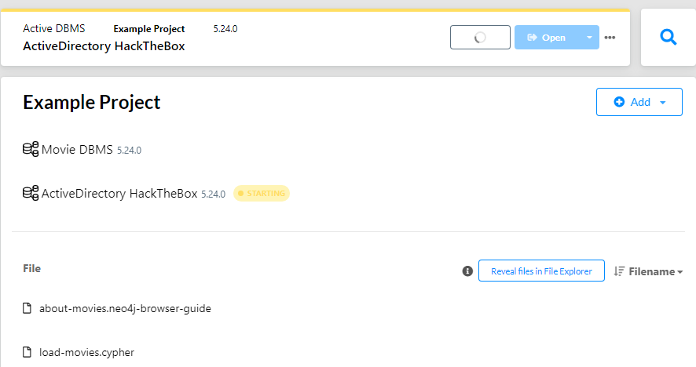
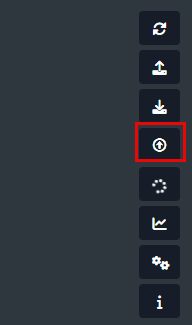

# 🧱 BloodHound Community Edition (CE)

BloodHound CE is the latest version, featuring a modern web interface and simplified setup using Docker.

## ✅ Prerequisites

- `Docker` and `Docker Compose` installed on `Ubuntu Server`

:::note
If you don't have `Docker` & `Docker Compose` on a `Ubuntu Server`

<details>
<summary>🛠 How to Install Docker + Docker Compose on a Ubuntu Server</summary>

### 1. Install the VM (Ubuntu Server)

- **Create VM inside VMWare Workstation**
  - Ubuntu Server 24.04.2
  - 2 CPU / 8 GB RAM
  - Disk 80 GB
  - Network Adapter: `NAT` / `Host-only` (so you can SSH inside other VM's with `Host-only`)

- **Download ISO**
  - [https://ubuntu.com/download/server](https://ubuntu.com/download/server)

- **Install**
  - Language: English
  - Install Ubuntu Server
  - Configure minimal settings
  - Username: `yourname`
  - Install OpenSSH (checked)
  - Skip snaps and additional services.

- **After install**
  - `sudo apt update && sudo apt upgrade -y`

---

### 🛠 2. Set Static IP Inside Ubuntu VM

```bash
ip addr
```

> NAT Network is `ens33` & Host-only Network is `ens36`

```powershell
ssh <username>@<ip-of-ens33>
```

```bash
sudo nano /etc/netplan/00-installer-config.yaml
```

```yaml
network:
  version: 2
  ethernets:
    ens33:
      dhcp4: yes # NAT interface, keep DHCP to get internet access
      routes:
        - to: default
          via: 192.168.38.2
      nameservers:
        addresses:
          - 1.1.1.1
          - 8.8.8.8
    ens36:
      dhcp4: no # Host-only interface, set static IP manually
      addresses:
        - 192.168.175.133/24
```

> ✅ `ens33` gets Internet automatically via DHCP (NAT).
> ✅ `ens36` has fixed IP `192.168.175.133` for stable `SSH` and `lab traffic`.

#### Set correct permission

```bash
sudo chmod 600 /etc/netplan/00-installer-config.yaml
```

#### Apply Configuration

```bash
sudo netplan generate
```

```bash
sudo netplan apply
```

---

### 3. Install Docker and Docker Compose

```bash
# Install required packages
sudo apt install -y apt-transport-https ca-certificates curl software-properties-common gnupg

# Add Docker’s GPG key
curl -fsSL https://download.docker.com/linux/ubuntu/gpg | sudo gpg --dearmor -o /etc/apt/keyrings/docker.gpg

# Set up stable Docker repository
echo \
  "deb [arch=$(dpkg --print-architecture) signed-by=/etc/apt/keyrings/docker.gpg] https://download.docker.com/linux/ubuntu \
  $(lsb_release -cs) stable" | \
  sudo tee /etc/apt/sources.list.d/docker.list > /dev/null

# Update package index
sudo apt update

# Install Docker Engine and Docker Compose plugin
sudo apt install -y docker-ce docker-ce-cli containerd.io docker-compose-plugin

# Enable and start Docker service
sudo systemctl enable docker
sudo systemctl start docker

# Add your user to the Docker group (optional, so you don't need sudo)
sudo usermod -aG docker $USER

```

---

### 📜 Gold Standard BloodHound CE Bash Script

```bash
#!/bin/bash
# ------------------------------------------------------------------
# [BloodHound CE Setup Phase 1]
# Author: Alessandro Salucci
# Date: 2025-04-28
#
# Description: Prepares Ubuntu VM with Docker, network config.
# ------------------------------------------------------------------

set -e

echo "[*] Updating system..."
sudo apt update && sudo apt upgrade -y

echo "[*] Installing Docker and Docker Compose Plugin..."
sudo apt install -y apt-transport-https ca-certificates curl gnupg git software-properties-common

sudo mkdir -p /etc/apt/keyrings
curl -fsSL https://download.docker.com/linux/ubuntu/gpg | sudo gpg --dearmor -o /etc/apt/keyrings/docker.gpg

echo "deb [arch=$(dpkg --print-architecture) signed-by=/etc/apt/keyrings/docker.gpg] https://download.docker.com/linux/ubuntu $(lsb_release -cs) stable" | \
  sudo tee /etc/apt/sources.list.d/docker.list > /dev/null

sudo apt update
sudo apt install -y docker-ce docker-ce-cli containerd.io docker-compose-plugin

echo "[*] Enabling Docker service..."
sudo systemctl enable docker
sudo systemctl start docker

echo "[*] Adding user to docker group..."
sudo usermod -aG docker $USER

echo "[*] Configuring static IP for Host-only adapter..."
cat <<EOF | sudo tee /etc/netplan/00-installer-config.yaml > /dev/null
network:
  version: 2
  ethernets:
    ens33:
      dhcp4: yes
      routes:
        - to: default
          via: 192.168.38.2
      nameservers:
        addresses:
          - 1.1.1.1
          - 8.8.8.8
    ens36:
      dhcp4: no
      addresses:
        - 192.168.175.133/24
EOF

echo "[*] Securing Netplan config permissions..."
sudo chmod 600 /etc/netplan/00-installer-config.yaml

echo "[*] Applying Netplan configuration..."
sudo netplan apply

echo "[*] Phase 1 Complete. Rebooting..."
sleep 3
sudo reboot
```

```bash
mkdir setups
```

```bash
cd setups
```

```bash
nano bloodhound-setup-1.sh
```

> Copy the script from above

```bash
chmod +x bloodhound-setup-1.sh
```

> Make it executable.

```bash
sudo ./bloodhound-setup-1.sh
```

> Run it with root or sudo

```bash
#!/bin/bash
# ------------------------------------------------------------------
# [BloodHound CE Setup Phase 2 - Full Auto Setup]
# Author: Alessandro Salucci
# Date: 2025-04-28
#
# Description: After reboot — downloads BloodHound CLI, fixes Docker ports,
# starts BloodHound CE properly and outputs correct info.
# ------------------------------------------------------------------

set -e

echo "[*] Starting Docker service..."
sudo systemctl start docker

echo "[*] Downloading BloodHound CLI..."
wget https://github.com/SpecterOps/bloodhound-cli/releases/latest/download/bloodhound-cli-linux-amd64.tar.gz
tar -xvzf bloodhound-cli-linux-amd64.tar.gz
chmod +x bloodhound-cli

echo "[*] Installing BloodHound CE..."
sudo ./bloodhound-cli install

# Fix docker-compose.yml port bindings
echo "[*] Fixing BloodHound CE Docker ports to allow external access..."

# Backup the original docker-compose.yml first
cp docker-compose.yml docker-compose.yml.bak

# Use sed to replace localhost bindings with 0.0.0.0 (or remove the localhost IP restriction)
sed -i 's/${BLOODHOUND_HOST:-127.0.0.1}:${BLOODHOUND_PORT:-8080}:8080/8080:8080/' docker-compose.yml
sed -i 's/${NEO4J_HOST:-127.0.0.1}:${NEO4J_HTTP_PORT:-7474}:7474/7474:7474/' docker-compose.yml
sed -i 's/${NEO4J_HOST:-127.0.0.1}:${NEO4J_BOLT_PORT:-7687}:7687/7687:7687/' docker-compose.yml

# Restart Docker containers to apply changes
echo "[*] Restarting BloodHound CE containers..."
docker compose down
docker compose up -d

# Get the admin password dynamically
ADMIN_PASSWORD=$(~/bloodhound-cli config get default_password || echo "UnknownPassword-CheckManually")

echo "[*] Setup completed successfully!"
echo "--------------------------------------------------"
echo "➡ SSH Access: ssh youruser@192.168.175.133"
echo "➡ BloodHound CE Web: http://192.168.175.133:8080/ui/login"
echo ""
echo "Default Login -> Username: admin"
echo "Default Password -> $ADMIN_PASSWORD"
echo "--------------------------------------------------"
```

```bash
sudo nano bloodhound-2.sh
```

```bash
sudo chmod +x bloodhound-2.sh
```

```bash
sudo ./bloodhound-2.sh
```

---

###

</details>
:::

---

## BloodHound v4.x Deprecated - SharpHound

## How to Setup BloodHound (Windows)

1. Download Neo4j Desktop from: [https://neo4j.com/download/](https://neo4j.com/download/)
2. Install it and create a `Local DB`

## How to Setup BloodHound (Linux)

1. `sudo apt install neo4j`
2. `sudo systemctl start neo4j`

---

## Set up a DB

1. Open `Neo4j Desktop`
2. `Add` Local DBMS
3. `Set`Password
4. `Start` instance



---

## Open BloodHound

1. Username `neo4j`
2. Password `<The Password You Set>`
3. Upload `SharpHound` files



---

## See how you use BloodHound and SharpHound in action

- [Object ACLs](https://blog.salucci.ch/docs/HackingLab/HackTheBox/SOC-Analyst/Object-ACLs/#1-repeat-the-example-in-the-section-and-type-done-as-the-answer-when-you-are-finished)