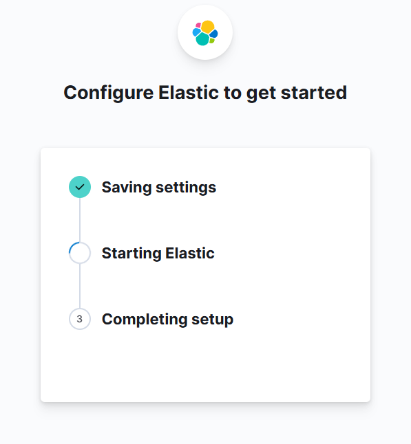

# 🧱 Elastic Stack in a VM – Step-by-Step Setup (Ubuntu Server)

> 💡 This guide walks you through setting up Elasticsearch, Kibana, and Filebeat in a **realistic SIEM-style environment** using **Ubuntu 22.04** inside a **VM** (e.g. VirtualBox, VMware).

---

## 🛠️ 1. VM Setup (VirtualBox / VMware)

- OS: Ubuntu (Server)
- RAM: 8–16 GB (or more if you want to load lots of logs)
- Disk: 50–100 GB (dynamic disk recommended)
- CPUs: 8 vCPU

---

## 🛠️ 2. Install VMWare Tools

```bash
sudo apt update
sudo apt upgrade
sudo apt autoremove -y
sudo apt clean
sudo apt autoclean
sudo apt install open-vm-tools open-vm-tools-desktop -y
sudo reboot
```

---

## 🌐 3. Set Static IP

### Find your IP

```bash
ip a
```

:::tip
Access your VM with `SSH - PowerShell` to Copy & Paste information.

1. 🔐 Check SSH on Ubuntu

```bash
sudo systemctl status ssh
```

2. 💻 Connect in PowerShell via SSH

```bash
ssh <username>@<ip>
yes
<password>
```

```bash
Welcome to Ubuntu 24.10 (GNU/Linux 6.11.0-21-generic x86_64)

 * Documentation:  https://help.ubuntu.com
 * Management:     https://landscape.canonical.com
 * Support:        https://ubuntu.com/pro

 System information as of Tue Apr 15 06:04:16 PM UTC 2025

  System load:  0.0                Processes:              276
  Usage of /:   14.2% of 47.93GB   Users logged in:        0
  Memory usage: 2%                 IPv4 address for ens33: 192.168.38.129
  Swap usage:   0%


0 updates can be applied immediately.
```

:::

```bash
sudo nano /etc/netplan/00-installer-config.yaml
```

### Example config

```yaml
network:
  version: 2
  ethernets:
    ens33:
      dhcp4: no
      addresses:
        - 192.168.38.129/24
      nameservers:
        addresses:
          - 8.8.8.8
          - 1.1.1.1
      routes:
        - to: 0.0.0.0/0
          via: 192.168.38.2
```

> Press `Ctrl + X` > `Shift + y` > `Enter`

```bash
sudo chmod 600 /etc/netplan/00-installer-config.yaml
sudo netplan apply
```

---

## 📦 4. Install Java (required for Elasticsearch)

```bash
sudo apt update && sudo apt upgrade -y
sudo apt install -y openjdk-17-jdk
java -version
```

```bash
openjdk version "17.0.14" 2025-01-21
OpenJDK Runtime Environment (build 17.0.14+7-Ubuntu-124.10)
OpenJDK 64-Bit Server VM (build 17.0.14+7-Ubuntu-124.10, mixed mode, sharing)
```

---

## 📦 5. Install Dependencies

```bash
sudo apt install -y wget curl gnupg apt-transport-https
```

---

## 📦 6. Install Elasticsearch

```bash
curl -fsSL https://artifacts.elastic.co/GPG-KEY-elasticsearch | sudo gpg --dearmor -o /usr/share/keyrings/elastic-keyring.gpg
echo \
  "deb [signed-by=/usr/share/keyrings/elastic-keyring.gpg] https://artifacts.elastic.co/packages/8.x/apt stable main" \
  | sudo tee /etc/apt/sources.list.d/elastic-8.x.list > /dev/null
sudo apt update && sudo apt install -y elasticsearch kibana logstash filebeat
```

---

## 🚀 7. Enable and Start Services

```bash
sudo systemctl enable elasticsearch.service --now
sudo systemctl enable kibana.service --now
sudo systemctl enable filebeat.service --now
```

---

## 🔑 8. Enrollment & Verification (First-Time Setup)

```bash
sudo /usr/share/elasticsearch/bin/elasticsearch-create-enrollment-token -s kibana
sudo /usr/share/kibana/bin/kibana-verification-code
```

---

## 🌐 9. Access Kibana UI

```bash
sudo nano /etc/kibana/kibana.yml
```

:::info
Make sure you change Kibana's bind address. So it can be accessed from outside the VM.

```bash
# Specifies the address to which the Kibana server will bind. IP addresses and host names are both valid values.
# The default is 'localhost', which usually means remote machines will not be able to connect.
# To allow connections from remote users, set this parameter to a non-loopback address.
server.host: "0.0.0.0"
```

:::

```bash
sudo systemctl restart kibana
```

> Check if it listens `Port 5601`

```bash
sudo ss -tulnp | grep 5601
```

```bash
tcp   LISTEN 0      511                 0.0.0.0:5601      0.0.0.0:*    users:(("node",pid=4387,fd=19))
```

Open in browser: `http://<your-server-ip>:5601`

---

## 📊 10. Configure Elastic to get started

1. Enter `Enrollment token`
2. Enter `verification code`
    - Run in the SSH connection `sudo /usr/share/kibana/bin/kibana-verification-code`
    - 
3. Generate a password for Elastic
    - `sudo /usr/share/elasticsearch/bin/elasticsearch-reset-password -u elastic`
4. Login with `username: elastic` | `password: <generated password>`