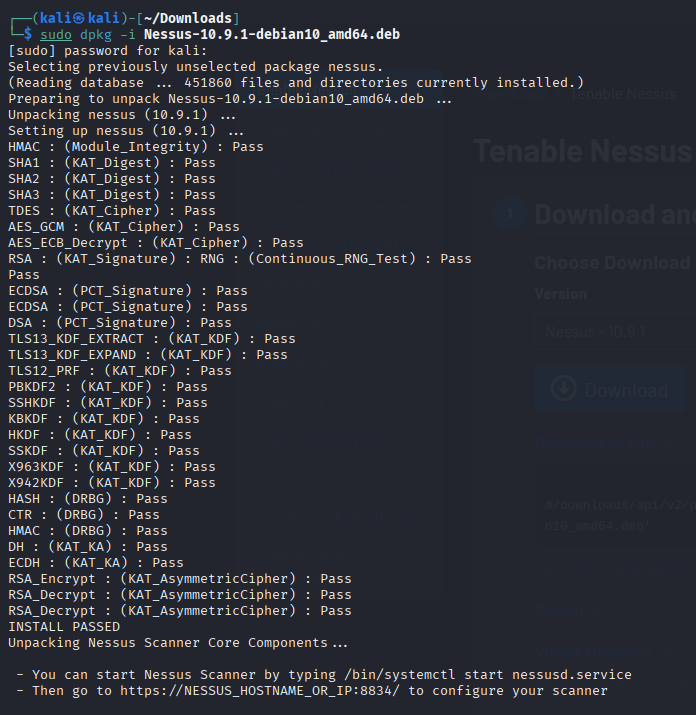

# 🛠️ Step-by-step: Install Nessus Essentials

## 1. Download the Debian package

```bash
curl --request GET \
  --url 'https://www.tenable.com/downloads/api/v2/pages/nessus/files/Nessus-10.9.1-debian10_amd64.deb' \
  --output 'Nessus-10.9.1-debian10_amd64.deb'
```

## 2. Install the package

```bash
sudo dpkg -i Nessus-*.deb
sudo apt-get install -f -y   # Fix any missing dependencies
```



## 3. Start the Nessus service

```bash
sudo systemctl start nessusd.service
```

To verify the service is up:

```bash
sudo systemctl status nessusd.service
```

## 4. Set up via Web UI

1. Open your browser and navigate to: `https://localhost:8834/`
2. Bypass the SSL warning (click "`Advanced`" → "`Accept risk and continue`).
3. Select Nessus Essentials and complete the registration wizard:
4. Let Nessus download and compile plugins (~10–20 minutes)

## 5. You're ready to scan!

Log in at `https://localhost:8834/`, build a scan, and target up to 16 IPs *(Essentials license limit)*.

---

## ⚠️ Common pitfalls

- `dpkg` **errors**: Run `sudo apt-get install -f` to fix dependencies.
- **Activation issues**: Copy code carefully (no extra spaces).
- **SSL warning**: Expected; skip it and continue.

---

## ✅ Install Nessus Self‑Signed CA in Your Browser

1. Navigate to: `https://localhost:8834/getcert`
2. Download the CA certificate.
3. Add it to your browser's trusted authorities

### Firefox

`Options → Privacy & Security → View Certificates → Authorities → Import`

### Chrome/Edge

`(OS-managed stores): click Advanced → Proceed → Get Certificate → Install Certificate`

This stops the warning temporarily in that browser.
